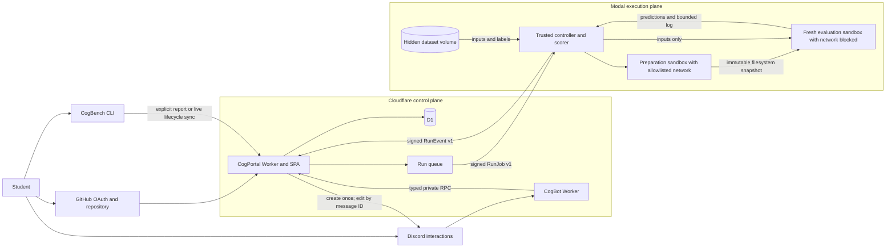

# Platform architecture

## Shape and ownership

The portal is the only owner of identity, team membership, quotas, run state,
and leaderboard selection. The bot does not query D1. The runner does not own
users or quotas. The CLI is not an official execution authority.

## Trust levels

| Result | Execution | Visibility | Can promote? | Can publish? |
| --- | --- | --- | --- | --- |
| Local self-reported | Student machine, public cases | User/team after explicit sync | No | No |
| Hosted practice | Isolated runner, public cases | Team | Yes, exact artifact and SHA only | No |
| Official verified | Isolated runner, hidden cases | Team; logs suppressed | N/A | Explicit team selection |
| Leaderboard selection | Existing official result | Course leaderboard | N/A | Already selected |

This distinction is part of the wire model and UI, not a presentation-only
label. Local reports have no run ID and no route into promotion or quotas.

## Identity linking

GitHub OAuth creates the primary CogPortal user. Opening `/cog` while unlinked creates a hashed,
single-use, ten-minute token associated with a Discord user. The raw token is
placed in the URL fragment, so it is not sent in HTTP requests or ordinary
server logs. CogPortal shows the Discord identity and requires explicit user
confirmation before inserting the link. The original ephemeral Discord surface
includes an **I've connected** action so the student can complete the handoff
without learning another command.

`cogbench link` uses a device authorization flow. The terminal receives a
high-entropy device code, the browser displays a short user code, and the
signed-in user approves a named device. Only a hash of the resulting scoped
token is stored in D1. Tokens expire after 60 days and can be revoked on the
Connections page.

Discord and CLI linking require the GitHub-authenticated user to have already
joined a cohort and a team with a connected repository. A team creator or
maintainer explicitly maps one Discord channel from the private `/cog`
surface. `cogbench run --live` then posts four sequenced, idempotent lifecycle
events to CogPortal. CogPortal stores the message ID and edits that single
Components V2 bubble; the CLI never receives a Discord token and never talks
to Discord directly. A failed Discord delivery cannot fail the local run.

## Execution lifecycle

1. Portal revalidates current GitHub repository permission and records an
   immutable commit SHA.
2. Portal enqueues `RunJobV1`; queue retries isolate temporary Modal outages
   from the student request.
3. Preparation downloads a bounded GitHub archive, rejects links and unsafe
   tar paths, installs dependencies without secrets, validates the entry point,
   and snapshots the filesystem.
4. Evaluation starts a fresh sandbox from that snapshot with all outbound
   networking blocked. Only case inputs cross into the sandbox.
5. The trusted controller scores predictions against public or hidden labels
   and emits signed, sequenced, idempotent events.
6. Portal consumes an official attempt only when hidden evaluation begins.
   Infrastructure failures and stale provider runs refund it.

Official evaluation never performs a fresh install: it must reference the
prepared artifact from the exact successful hosted-practice parent. This
reduces dependency drift and prevents practice/official environment skew.

## Monorepo rules

- `packages/contracts` is the TypeScript source of truth for browser/API/RPC
  types. `protocols/v1` is the language-neutral runner boundary.
- Applications may depend on contracts; contracts never depend on an app.
- Portal owns migrations. Other services receive typed methods or signed
  messages, never direct database access.
- Python benchmark plugins use entry points, so course modules can version and
  ship independently from the CLI.
- pnpm workspaces are sufficient at this size. A task orchestrator should be
  added only when measured CI graph/caching needs justify another student and
  maintainer dependency.
- Canonical templates are linked by immutable GitHub repository ID and reviewed
  revision in `template-catalog`; names are informational because repositories
  can be renamed.

## Failure and replay model

Run jobs and events carry explicit protocol versions and IDs. Event effects are
repeat-safe: metrics upsert, terminal outbox IDs derive from event IDs, and the
run sequence marker is written last. A five-minute scheduled maintenance pass
expires link requests and marks Modal runs stale after a configurable one-hour
window. Stale official attempts are repaired idempotently on later passes if a
transient database error interrupts cleanup.
