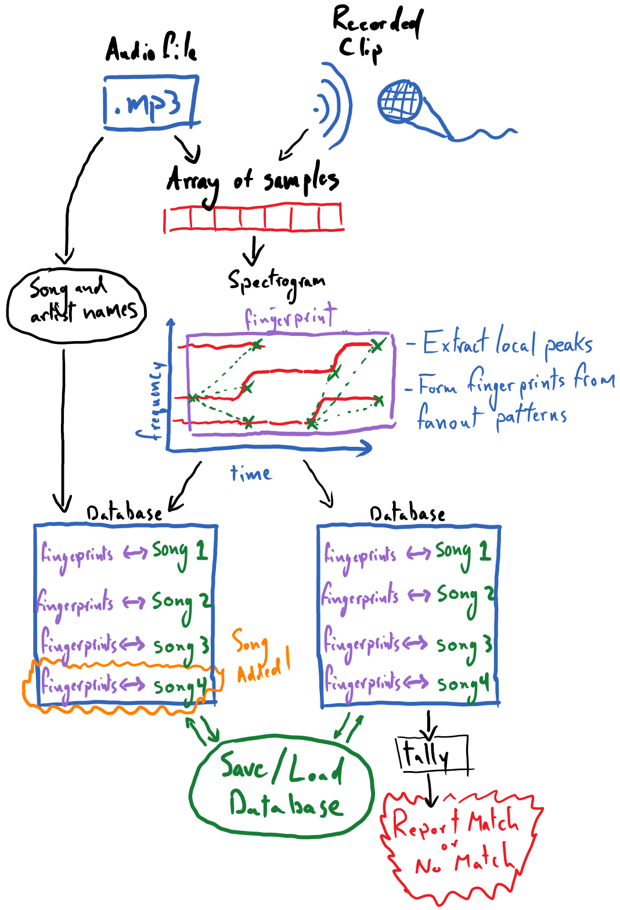
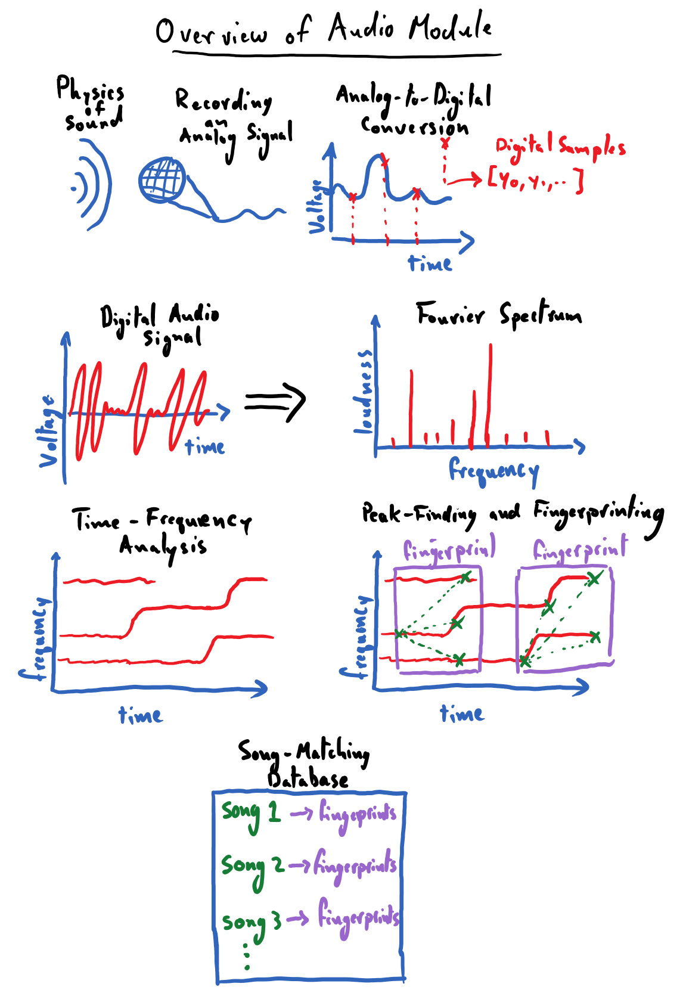

# Week 1 capstone: Song Recognition (Audio module)

> Verbatim CogWeb course material, captured for reference. Do not edit to fit our
> design; re-capture from the source instead.

**Fetched:** 2026-08-16

**Source:**

- [Audio/capstone_summary.html — Capstone Project: Song Recognition](https://rsokl.github.io/CogWeb/Audio/capstone_summary.html)
- [audio.html — Audio Module overview (included below for context)](https://rsokl.github.io/CogWeb/audio.html)

Markdown below is the course's own `_sources/` text (Sphinx publishes the
pre-render source alongside the site), with jupytext cell markers removed and
figure `` tags rewritten to local copies in `media/`. LaTeX is left as
authored.

---
# Capstone Project: Song Recognition

The capstone project for the audio module, as stated at its outset, is to create an installable Python package that can be used to recognize songs being played from brief clips of audio.
The following is a diagrammatic overview of the capstone project that we will be developing;
this conveys the major capabilities that the final product should have.



Many of the core pieces here were already developed in the reading and exercises for this module:

- Converting various forms of audio recordings to numpy arrays of samples
- Producing a spectrogram from the samples
- Extracting local peaks from the spectrogram

These can be leveraged from the previous exercises nearly unchanged for this project.
The process of forming "fanout" patterns among a spectrogram's local peaks, and thus rendering a fingerprint for the recording, will require novel work from the reader.
This was described in the section on "Matching Audio Recordings".
Developing code around our so-called database, which is rooted in a plain Python dictionary, will also require some creativity.

It is recommended that this capstone project be tackled as a group project among three to five students.
While it is certainly doable for an individual to complete this project by theirself, there is great value participating in the collaborative process of divvying up the project and working to bring its various pieces together.
Students are advised to use [git and GitHub](https://guides.github.com/introduction/git-handbook/) to work on a shared code base.

## Capstone Tasks

It is strongly recommended that students work through [this section of PLYMI](https://www.pythonlikeyoumeanit.com/Module5_OddsAndEnds/Modules_and_Packages.html) (completing the reading comprehension exercises) to learn how they are to structure their code as an installable / importable Python package.

Groups might break tasks down along the following lines:

- Creating functions for converting all variety of audio recordings, be them recorded from the microphone or digital audio files, into a NumPy-array of digital samples.
- Creating a function that takes in digital samples of a song/recording and produces a spectrogram of log-scaled amplitudes and extracts local peaks from it
- Creating a function that takes the peaks from the spectrogram and forms fingerprints via "fanout" patterns among the peaks.
- Devising a scheme for organizing song metadata, e.g. associating song titles and artist names with a recording, and associating these with unique song-IDs to be used within the database.
- Writing the core functionality for storing fingerprints in the database, as well as querying the database and tallying the results of the query.
- Designing an interface for the database, including the following functionality:
   - [saving and loading the database](https://www.pythonlikeyoumeanit.com/Module5_OddsAndEnds/WorkingWithFiles.html#Saving-&-Loading-Python-Objects:-pickle)
   - inspecting the list of songs (and perhaps artists) that exist in the database
   - providing the ability to switch databases (optional)
   - deleting a song from a database (optional)
   - guarding against the adding the same song to the database multiple times (optional)
- Recording long clips of songs under various noise conditions (e.g. some should be clips from studio recordings, others recorded with little background noise, some with moderate background noise, etc.) so that you can begin to test and analyze the performance of your algorithm.
- Creating a function that can take an array of audio samples from a long (e.g. one minute) recording and produce random clips of it at a desired, shorter length. This can help with experimentation/analysis.
For example you can record a 1 minutes clip of a song, played from your phone and then create many random 10 second clips from it and see if they all successfully match against your database.


## Advice and Gotchyas

### Configuration Parameters

There are several "tunable" aspects of the algorithm that we are implementing, such as the minimum amplitude threshold in peak finding.
Here are some viable starting values for these; you can start with these and try experimenting with them to improve the performance of your song-matching algorithm:

- **Defining the local neighborhood for finding the peaks in the spectrogram**: Use a rank-$2$ connectivity-$1$ binary structure, and iterate that structure $20$ times (looks at roughly the $15$ nearest bins as the neighborhood).
- **Finding an appropriate background/foreground amplitude threshold for identifying peaks in the spectrogram**: this can be obtained for a given recording by identifying the ~$75^\text{th}$ percentile amplitude and using that as the threshold.
- **Setting the size of the fanout pattern for forming the fingerprints**: a fanout size of $15$ nearest neighbors can be appropriate.

### Spectrogram

For the spectrogram, it is advisable that students use matplotlib's `mlab.specgram` function, which does not produce a plot by default.

```python
import matplotlib.mlab as mlab

spectrogram, freqs, times = mlab.specgram(
    samples,
    NFFT=4096,
    Fs=sampling_rate,
    window=mlab.window_hanning,
    noverlap=int(4096 / 2)
)
```

where `samples` is the NumPy array of audio samples and `sampling_rate` is the integer-valued sampling rate used to obtain `samples` (i.e. typically 44,100 Hz).
The other settings determine properties about the size/properties of the FFT windows being using to produce the spectrogram; these should be held constant across recordings.

`spectrogram` is the shape-$(F, T)$ array of amplitudes, `freqs` is the shape-$(F,)$ array of frequency values corresponding to the vertical bins of the spectrogram and `times` is a shape-$(T,)$ array of time values corresponding to the horizontal bins of the spectrogram.

Before extracting peaks from the spectrogram, it is recommended that you take the logarithm of its values so that these amplitudes reflect the audible decibel scale.
There may be zeros in the spectrogram, which will produces NaNs (Not-a-Numbers) when you take its logarithm.
To avoid this, first replace all amplitudes in the spectrogram smaller than `1E-20` with `1E-20`, and then take the logarithm.
`numpy.clip` is a handy function for this.


## Analyzing and Testing Performance

Ideally, students will take time to analyze and characterize the performance of their algorithm.
This means conducting experiments that vary one or multiple of the following:

- the length of the clip being recording for matching  (e.g. how short of a clip can be matched against the database?)
- the noise level of the clip (e.g. how well does a studio-quality clip, low-noise clip, ..., or very noisy clip match against the database?)
- the number of songs in your database (e.g. does adding more songs to the database create "confusers" that cause false-matches)

Assess how these factors affect the reliability of your algorithm's performance. 

It is also a good idea to assess, in a quantifiable way, the quality of your algorithm's matches. 
When your algorithm does produce the appropriate match, how large is the leading tally for this match? How much larger is the next-largest tally?
How can you guard against false-matches?
Perhaps you can intentionally try to match a clip from a song that _does not_ exist in your database - does your algorithm predict a match regardless?
Maybe there is a minimum tally that is necessary to help distinguish a false match from a true one.
It may be that the ratio between the $1^\text{st}$ and $2^\text{nd}$ largest tallies can be an indicator of quality.

Feel free to tweak the tunable parameters, like the size/shape of your peak-finding neighborhood or the fanout-size of the fingerprint formation process, to improve the quality of your algorithm.

Finally, consider documenting the results of this analysis, providing visualizations of the data that led you to your conclusions.


---

## Appendix: Audio Module overview

Source: <https://rsokl.github.io/CogWeb/audio.html>

# Audio Module


Nowadays, most phones come with software that lets them do a pretty neat trick: if you're out and about and some music catches your ear, you can hold your phone up in the air and ask it to name that tune!
Your phone is able to do this even though there are millions of songs out there and despite the loud chatter of your friends in the background.
It manages to pinpoint the song being played after catching a whiff of it for mere seconds.
This is an impressive trick indeed, but how in the world does it work?


The first module of the CogWorks course is all about working with audio data; it will give us all of the tools needed to code up our own song-recognition app *from scratch*!
As is the CogWorks way, we will do our best to achieve this goal without relying on any "black boxes" in our solution.
As such, we will begin from square one and discuss the question: what is sound and how do we record it?
This will amount to **a brief physics lesson in sound waves and microphones**. Please note that these lessons do not require a background in physics, but hopefully they will spur an interest in the reader.
We'll follow this thread down the path of understanding **the basics of digitizing an analog signal**, which will give us insight into how audio files "store sounds" to be played back later.


With digitized audio data in hand, we'll find ourselves with a real mess;
in its raw form, it is hard to visually discern any salient qualities from an audio signal's waveform besides stark changes in loudness.
This sets the stage for the power house of signal processing: **Fourier transforms**.
Critically, Fourier transforms will allow us to identify what *notes* (frequencies, to be more precise) are present in an audio recording.
This will be a huge leap forward for us in our quest to create a song-recognition app: we can finally begin to characterize the distinguishing qualities of songs in a quantifiable way.


In order to extract identifiable features from songs, we will want to pinpoint the prominent frequencies (notes) of that song along with *when* those frequencies occur in the song.
The process of distilling a frequency-time breakdown of our audio recording is known as **spectrogram analysis**.
We will code up our own tooling to apply Fourier transforms over small temporal windows of audio data so that we can view **spectrograms** for our songs. 
A song's spectrogram can reveal intuitive, and often unique, patterns – in it, we will be able to literally see the recurrence of the song's chorus, the emergence of a loud guitar solo (or some Fortnite bass drop, or whatever youths listen to nowadays), and other key identifiable features.
At this point, we will never have been closer to being able to "identify" a song based on reliable, quantifiable features.


Finally, we will need to figure out some heuristic for extracting a sparse set of identifiable features of a song – its "fingerprints" – that we can store in a database.
This, as we'll see, will boil down to **locating the local maxima** in a song's spectrogram.
Once populated with a library of songs, we can query this song-fingerprint database with a clip of a song and have it name the tune!


The following is a simple illustration of a road map for this module.
Its purpose is to help us make note of the major landmarks that we will be encountering during our journey through the land of audio processing.
I worked pretty hard on these drawings, please don't make fun of them.


