# Week 2 capstone: Face Recognition and Identity Clustering (Vision module)

> Verbatim CogWeb course material, captured for reference. Do not edit to fit our
> design; re-capture from the source instead.

**Fetched:** 2026-08-16

**Source:**

- [Video/FacialRecognition.html — Vision Module Capstone (part 1: detect, describe, match)](https://rsokl.github.io/CogWeb/Video/FacialRecognition.html)
- [Video/Whispers.html — Whispers Algorithm (part 2: clustering)](https://rsokl.github.io/CogWeb/Video/Whispers.html)
- [vision.html — Vision Module overview (included below for context)](https://rsokl.github.io/CogWeb/vision.html)

Markdown below is the course's own `_sources/` text (Sphinx publishes the
pre-render source alongside the site), with jupytext cell markers removed and
figure `` tags rewritten to local copies in `media/`. LaTeX is left as
authored.

---
# Vision Module Capstone

We will put our knowledge of neural networks and working with visual data to use by creating a program that detects and recognizes faces in a pictures, in order to sort the pictures based on individuals.
The goal is to 

1. take input from our camera
2. locate faces in the image and extract their "descriptor vectors"
3. determine if there is a match for each face in the database
4. return the image with rectangles around the faces along with the corresponding name (or "Unknown" if there is no match)

In the "Unknown" case, the program should prompt the user to input the unknown person's name so they can be added to the database.
Here is an example of what might be returned if the program recognizes everyone in the image

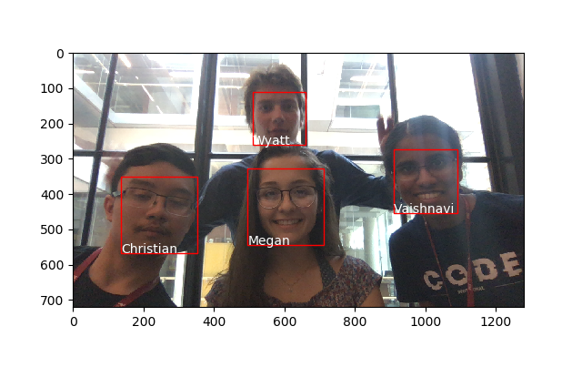

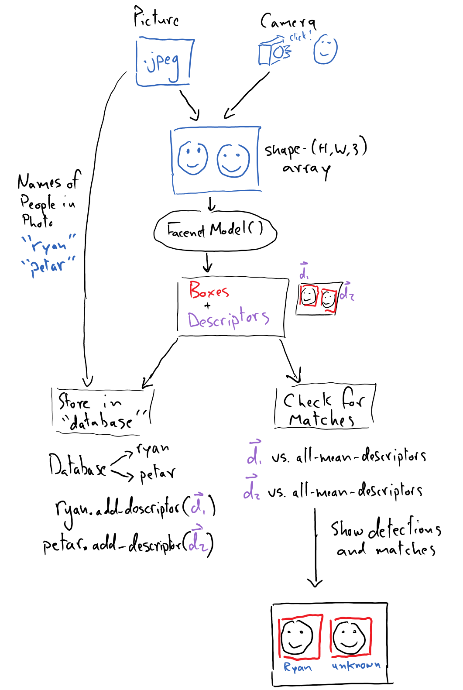

Let's take a closer look at the pre-trained models we'll be using to accomplish this.

## Pre-Trained FaceNet Models

We will utilize two models from pre-trained neural networks provided by `facenet_pytorch`, via the [facenet_models](https://github.com/CogWorksBWSI/facenet_models) package.
Both models are made accessible via a single class: `FacenetModel`

```python
from facenet_models import FacenetModel

# this will download the pretrained weights for MTCNN and resnet
# (if they haven't already been fetched)
# which should take just a few seconds
model = FacenetModel()
```
### Detecting Faces

The first is a model called a ["multi-task cascaded neural network"](https://arxiv.org/ftp/arxiv/papers/1604/1604.02878.pdf), `MTCNN`, which provides face *detection and alignments*  capabilities.
Given an input image, the model will return a list of box coordinates with corresponding face-probabilities and face landmarks for each detected face.

```python
# detect all faces in an image
# returns a tuple of (boxes, probabilities, landmarks)
# assumes ``pic`` is a numpy array of shape (R, C, 3) (RGB is the last dimension)
#
# If N faces are detected then arrays of N boxes, N probabilities, and N landmark-sets
# are returned.
boxes, probabilities, landmarks = model.detect(pic)
```

### Using Detection Probabilities to Filter False Detections

At times spurious objects - like a basketball - can be detected as faces. However, these false detections usually have low "face-probabilities" associated with them.
**Thus we can filter out detections that fail to have high face-probabilities in order to avoid having false detections in our images**.
We need to figure out what a reasonable face-probability threshold is to do this.
Perhaps we can try running the detector on a wider range of cluttered images in hopes to find some false detections, and then record what the face-probabilities are in associated with these objects versus those of true detections.
From this we might estimate a sensible minimum probability threshold.

### "Describing" Faces

```python
# Crops the image once for each of the N bounding boxes
# and produces a shape-(512,) descriptor for that face.
#
# If N bounding boxes were supplied, then a shape-(N, 512)
# array is returned, corresponding to N descriptor vectors
descriptors = model.compute_descriptors(pic, boxes)
```

We will then use `facenet_pytorch`'s `InceptionResnetV1`, which is trained to produce 512-dimensional face **descriptor vectors** for a given image of a face.
This model takes in the image and the detected boxes.


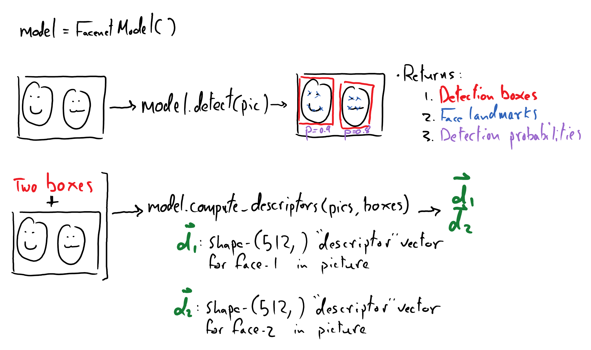

A facial descriptor vector is essentially an *an abstract embedding* of a face, which describes the face's features in a way that is robust to changes in lighting, perspective, facial expression, and other factors, using only a 512-dimensional vector!
These features are not necessarily concrete facial features like a nose and eyes, but more abstract representations that the model learned.

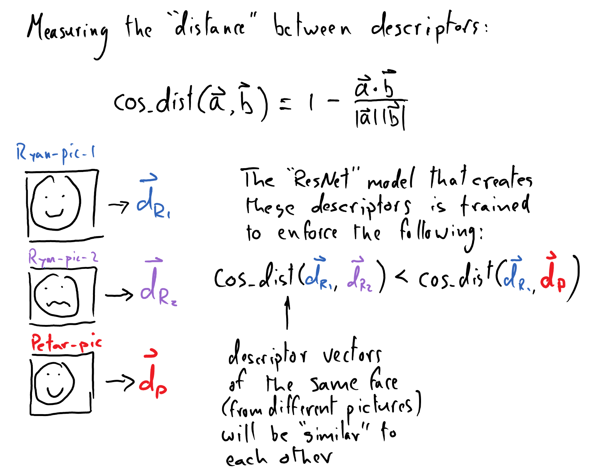

How did the model learn to produce such robust descriptor vectors?
The model learned to create facial descriptors in this way by taking a triplet of pictures of faces, each consisting of two different pictures of the same person and a picture of a distinct person.
The loss function then compares the pairwise dot-products between the descriptor vectors that are produced by the faces.
The loss is designed to be minimized by ensuring that the descriptor vectors for the single individual are more similar (have a larger dot-product) than those between descriptor vectors from different faces.
By training over many triplets of different faces, the `InceptionResnetV1`is able to learn how to distill robust, distinguishing abstract features from a face in only a $512D$ vector!
You can read more about this [in the FaceNet paper](https://arxiv.org/pdf/1503.03832.pdf).
This model was trained on the [VGGFace2 dataset](http://www.robots.ox.ac.uk/~vgg/publications/2018/Cao18/cao18.pdf).

The principle that images of the same face have similar descriptor vectors allows us to "recognize" a face after it has been detected.
If a detected face is "close enough" to a face in our database (the calculated distance between the face descriptors is below a certain cutoff), we can label the face with the appropriate name in the output image.
Otherwise, we can prompt the user to enter the name corresponding to the unknown face.


Now that we have some familiarity with the tools we'll be employing to accomplish facial recognition, let's talk about how our database can be structured to keep track of our faces and add new ones when we find them.


## Database

Our face-recognition "database" will simply consist of a dictionary of $\mathrm{name} \rightarrow \mathrm{profile}$ mappings, where, at a minimum, a "profile" contains a person's name and a list of descriptor vectors (taken from a collection of different images of that person).

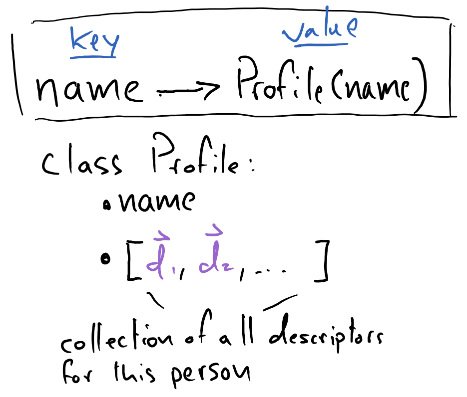

Make sure you're familiar with Python's dictionary data structure, which can be reviewed [here](https://www.pythonlikeyoumeanit.com/Module2_EssentialsOfPython/DataStructures_II_Dictionaries.html) on PLYMI.
Another important tool to familiarize yourself with is the `pickle` module, which will allow you to store and load objects from your computer's file system.
PLYMI's coverage of the `pickle` module can be found [here](https://www.pythonlikeyoumeanit.com/Module5_OddsAndEnds/WorkingWithFiles.html#Saving-&-Loading-Python-Objects:-pickle).


## Recognizing Faces

How do we recognize a face in a new image using our neural networks?

We mentioned earlier that the nature of face descriptor vectors is that images of the same face should yield similar face descriptors.
Thus, in order to identify if a new image is a match to any of the faces in the database we must mathematically compute the similarity between the new face descriptor and each of the **averaged** face descriptors in the database.
I.e. for each person stored in our database, we will check the new descriptor vector against the average descriptor vector for that person.

This can be done with **cosine distance**, which is a measure of the similarity between two normalized vectors.
Cosine distance can be computed by taking the dot product of two normalized vectors.
Review ["Fundamentals of Linear Algebra"](https://rsokl.github.io/CogWeb/Math_Materials/LinearAlgebra.html#The-Dot-Product) for additional coverage on this topic.

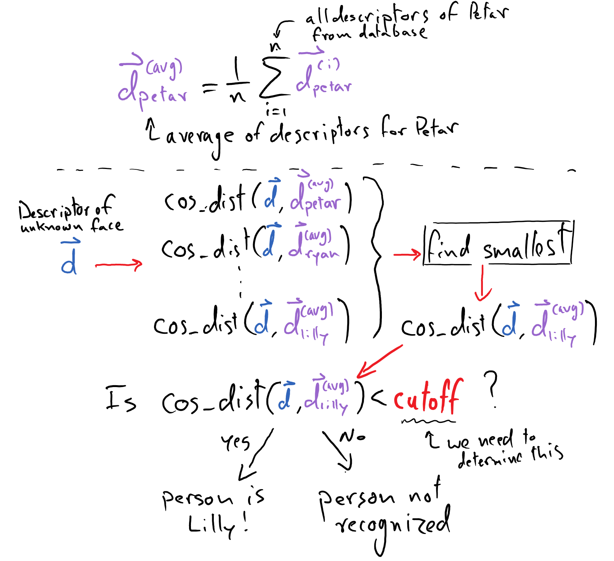

We can use cosine distance to compute the similarity between any two face descriptors, but how similar is "close enough" to validate a match?
This is where a **cutoff** comes into play.

**The cutoff indicates the maximum cosine-distance between two descriptors that is permitted to deem them a match.** 
This value should be determined experimentally such that it is large enough to account for variability between descriptors of the same face but not so large as to falsely identify a face.
If a face descriptor doesn't fall below the cutoff distance with any face in the database, it is deemed "Unknown" and the user is prompted to enter a name.
If the name exists in the database, the image should be added to that person's profile.
This situation may arise from a bad photo (bad lighting, something covering the face, etc.) or too strict of a cutoff (in this case, experiment with a slightly larger cutoff).
If the name doesn't already exist, you should make a new profile with that name and face descriptor.

## Whispers Algorithm

The second part of this capstone project involves implementing an algorithm that can separate images into clusters of pictures of the same person.
There will be one cluster for each person in our database.
The implementation of this algorithm is explored in the following page.

## Some Useful Code

Use the install and use the [camera module](https://github.com/CogWorksBWSI/Camera) so that you can take pictures using your webcam (or you can just use pictures from your phone).

The following code can be uses sci-kit image to read in an RGB image from various image file formats (e.g. .png or jpeg).
To use this code, you must install scikit image. 
First, activate the conda environment that you want to install it in.
And then run:

```shell
conda install -c conda-forge scikit-image
```

For some image formats there is a fourth channel - alpha - that can be used to measure opacity in a color.
The models that we are using are only compatible with RGB images, so included is a check that will remove the alpha-channel from an image.


```python
# reading an image file in as a numpy array
import skimage.io as io

# shape-(Height, Width, Color)
image = io.imread(str(path_to_image))
if image.shape[-1] == 4:
    # Image is RGBA, where A is alpha -> transparency
    # Must make image RGB.
    image = image[..., :-1]  # png -> RGB
```    

## Team Tasks

This has been a basic run-through of the concepts and tools you will use to create this capstone project.
Here are some general tasks that it can be broken down into.


* Create a `Profile` class with functionality to store face descriptors associated with a named individual.
* Functionality to create, load, and save a database of profiles
    * Functionality to add and remove profiles
    * Functionality to add an image to the database, given a name (create a new profile if the name isn't in the database, otherwise add the image's face descriptor vector to the proper profile)
* Function to measure cosine distance between face descriptors. It is useful to be able to take in a shape-(M, D) array of M descriptor vectors and a shape-(N, D) array of N descriptor vectors, and compute a shape-(M, N) array of cosine distances – this holds all MxN combinations of pairwise cosine distances.

* Estimate a good detection probability threshold for rejecting false detections (e.g. a basketball detected as a face). Try running the face detector on various pictures and see if you notice false-positives (things detected as faces that aren't faces), and see what the detectors reported "detection probability" is for that false positive vs for true positives.
* Estimate the maximum cosine-distance threshold between two descriptors, which separates a match from a non-match. Note that this threshold is also needed for the whispers-clustering part of the project, so be sure that this task is not duplicated and that you use the same threshold. You can read more about how you might estimate this threshold on [page 3 of this document](https://github.com/rsokl/WhispersLectureMaterials/blob/main/Whispers_Algorithm.pdf)
* Functionality to see if a new descriptor has a match in your database, given the aforementioned cutoff threshold.
* Functionality to display an image with a box around detected faces with labels to indicate matches or an "Unknown" label otherwise

Also visit the following page for a discussion of the whispers algorithm, which we will use to sort unlabeled photos into piles for unique individuals.

## Links

* [Dictionary Data Structure - PLYMI](https://www.pythonlikeyoumeanit.com/Module2_EssentialsOfPython/DataStructures_II_Dictionaries.html)
* [Pickle Module - PLYMI](https://www.pythonlikeyoumeanit.com/Module5_OddsAndEnds/WorkingWithFiles.html#Saving-&-Loading-Python-Objects:-pickle)
* ["Fundamentals of Linear Algebra" - CogWeb](https://rsokl.github.io/CogWeb/Math_Materials/LinearAlgebra.html#The-Dot-Product) - **link needs to be changed when official website is published**


---

# Part 2: Whispers Algorithm

Source: <https://rsokl.github.io/CogWeb/Video/Whispers.html>


**Note that there is a different version of these lecture notes available here**: https://github.com/rsokl/WhispersLectureMaterials/blob/main/Whispers_Algorithm.pdf

It is recommended that you read the linked pdf document for a briefer, more accessible introduction, and then read this section.

In the second part of the capstone project, we want to be able to separate a group of pictures into groups of pictures of distinct individuals such that each individual in the database has a group of pictures.
Note that each picture should only contain one person.
For example, there would be two correct groups of a picture of two people who are both also in other pictures.
We don't want this to happen because an image can only be in one cluster.
We will be working with these pictures in the form of a 512-dimensional face descriptor vector which we will generate using `facenet_pytorch`'s trained resnet model.

Notice how this problem is different from the other part of the capstone:

- There are **no labels/truths** accompanying each piece of data
- We don't know the possible "classifications" which are in this case the people that can be present in the images

Because of these, it becomes apparent that training a neural network will not work.
We couldn't produce a loss function without knowing the *truths*, and that is necessary for the model to backpropagate and *learn*.

## Unsupervised Learning

This is where *unsupervised learning* comes in.
We will be revisiting this topic more formally in week three, but here is a general introduction.
This learning is unsupervised because the data does not come labeled - there is no point of reference to supervise by.
However, this method allows for *clustering* of data.
In this case, we will be grouping images using information from the cosine similarity between their descriptor vectors.

Note how much easier unsupervised training can be.
It is less expensive in terms of both time and money because a large amount of data doesn't need to be labeled.
In addition, large datasets for learning are not needed anymore.
It is important to really understand the structure of a problem and not develop an overkill solution.
If all we need is to separate a set of images into the different people contained in the images, we don't need to find or create and label a dataset.
We also don't need to worry about all the possible people the images could contain - or training a model.

## Breaking Down the Algorithm

Before we dive into the implementation of the algorithm, we have to understand a structure utilized in whispers: the **graph**.
The graph we are referring to isn't related to the coordinate plane, but rather one with *nodes* and *edges*.
Graphs are a large area of study, and we will only be touching on what is relevant for the whispers algorithm.
A graph can come in various forms, but the most common graphical representation uses circles to represent nodes and lines to represent edges.


The nodes usually represent *things* and the edges the *relationship* between those things.
In our case, the node represents an image and the edge a similarity to another image.
Note how not all nodes have edges - think of this in our scenario as there being only one picture of a particular person in a set of images.

Now how do we represent a graph with *code*?
A common method is known as the **adjacency matrix**.
An adjacency matrix, $A$ is an $n$ by $n$ matrix, with $n$ being the number of nodes in the graph.
$A_{i, j}$ represents the relationship between nodes $i$ and $j$.
In our case, $A_{i, j}$ shows whether two nodes have an edge or not - $1$ could signify having an edge and $0$ not having one.


The indices in the matrix are representing nodes.
Implementing a `node` class is recommended to keep things neat.
Referring to the `node.py` class that is prewritten can be helpful.
As a rule of thumb, we want the `node` object to include the following information:

- label (which cluster it is a part of)
- ID (a unique value in $[0,n-1]$, which can be the node's index in the adjacency matrix)
- neighbors (a list of the ID's of the node's neighbors)

The following steps outline the flow of the whispers algorithm:

1. Set up an adjacency matrix based on a cutoff
    * There is only an edge between two nodes, or images, if the two face descriptor vectors are "close enough" (note that when using cosine similarities, this translates to the *distance* between the vectors being **less** than the designated cutoff)
    * Initially each node has a unique label - the colors represent different labels

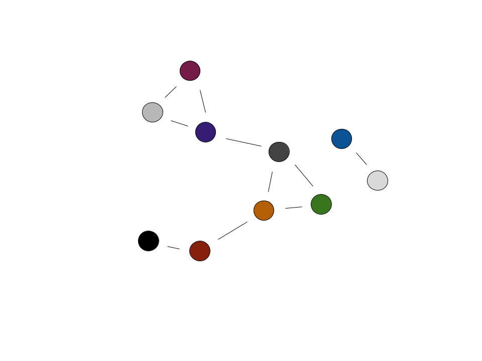

2. Pick a random node
3. Count the frequency of the labels (each corresponding to a cluster) of its neighbors
4. The current node takes on the label of the most frequent label determined in the previous step
    * In the case of a tie, randomly choose a label from those that are tied    

5. Repeat this until the process converges (no change in number of labels) or a max number of iterations is reached

The previous four steps can be visualized as follows:

Iteration 1:
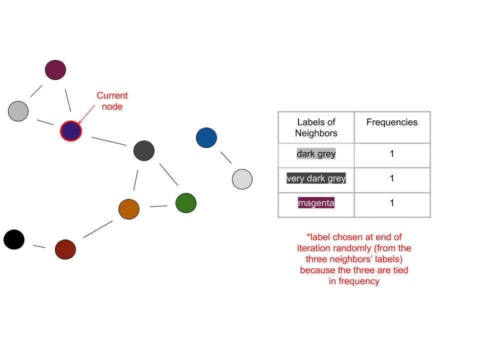

Iteration 2:
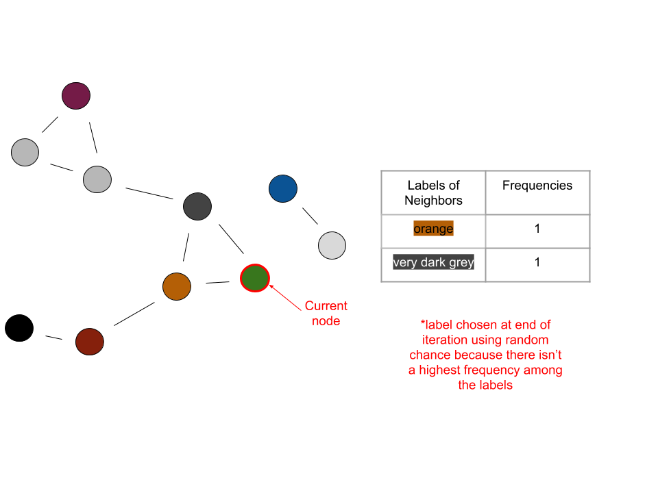

Iteration 3:
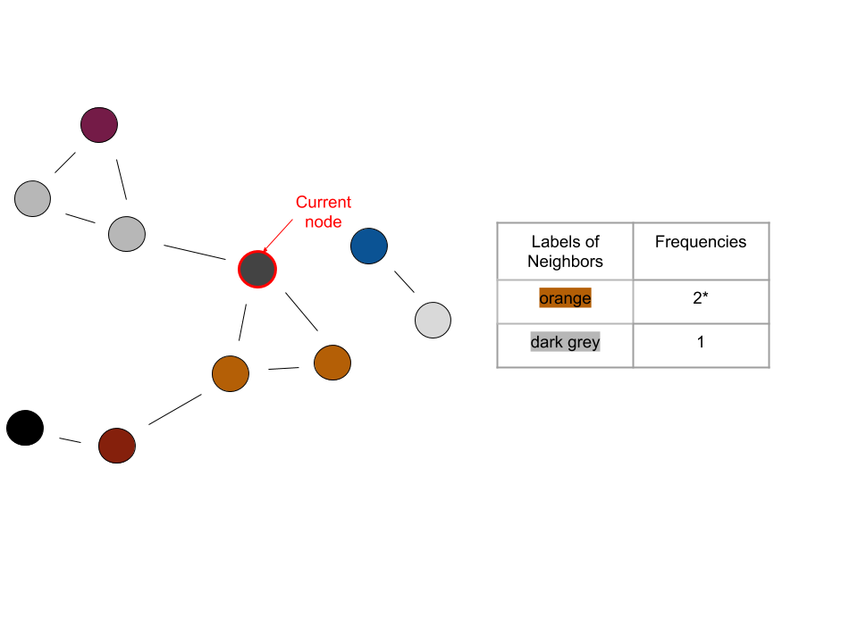

In the last iteration shown, the current node would become orange because orange is the most frequent label among its neighbors.
When the number of labels converges, the end result could look like this:

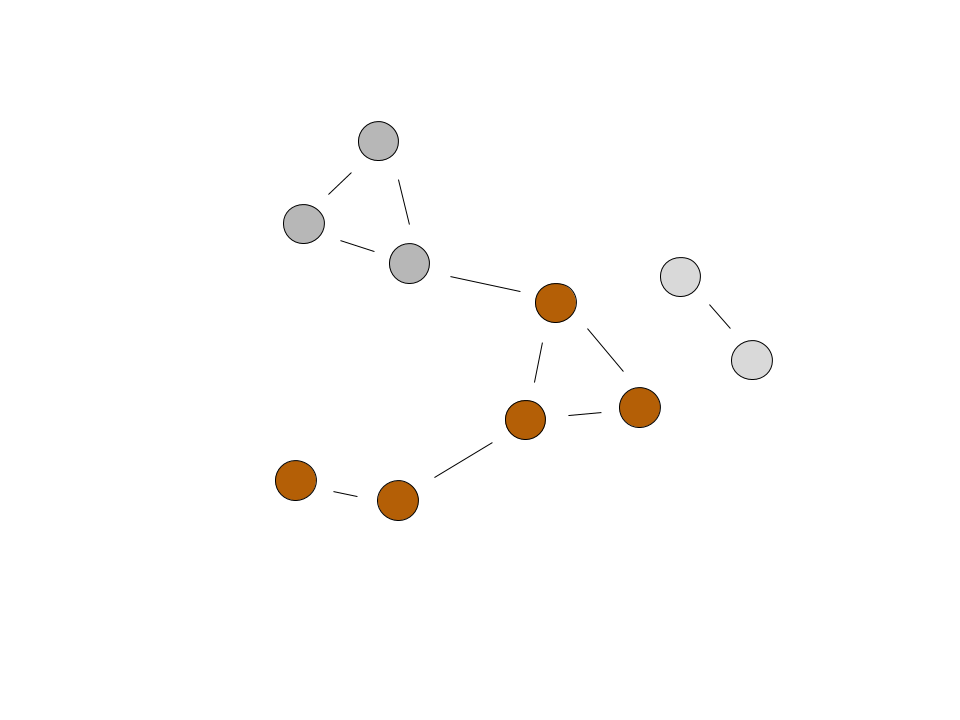

The final graph represents how the algorithm found three clusters of images, which corresponds to three different people. 

## Key Points

Some key ideas to keep in mind are:

- We want edges between nodes we are confident are related (images whose face descriptors are similar within a set cutoff, which can be guided by a little experimentation)
- We also want edges between nodes whose relationship is questionable - as we saw in the example graphs, some images had edges with others which were of a different person (we can accomplish this by having a looser cutoff)
- We don't want edges between all pairs of nodes
- We want to have a *max* set number of iterations to run because there is a possibility that convergence will never occur
- Because the first node and some labels are chosen randomly, there is a possibility of getting different results on different runs of the program on the same set of images
- Because of the variability caused by this randomness, the whispers algorithm isn't meant for really small sets of images - think about it like there is more scope for "correction" when there is an erroneous initial pairing of pictures in a large set
- An image can only be in one cluster at any given iteration
- For a better implementation of the whispers algorithm, use edge *weights* to aid choosing labels (refer to the next section)

## Whispers Algorithm With Weighted Edges

We know that the closer together descriptor vectors are, the more similar the corresponding images are.
However, in the implementation of the algorithm above, we are only using the vectors to determine whether nodes have edges or not.
When a node has a tie among the frequency of the labels in its neighbors, we are randomly choosing a label from among those tied.
However, what if we used the cosine similarity in determining which label to take on for each node?
This would result in a more accurate choice of label, and in less sporadic behavior in smaller sets of images.
A nuance in implementation would be to weight our edges using $1/x^2$, with $x$ being the cosine *distance* between the descriptor vectors.
For convenience, we will be using cosine distance between two descriptors $\vec{d_1}$ and $\vec{d_2}$, which is given by $1 - \frac{\vec{d_1} \cdot \vec{d_2}}{|\vec{d_1}||\vec{d_2}|}$.


This weighting makes it easier to find images that are truly close and of the same person - try it both with and without the weighting and see if a difference is noticeable.
Now what does weighting an edge mean?
It means that instead of there being a binary distinction in terms of connection between nodes (connected or not), there will be a scale among those that are connected.
The ones that are closer in similarity will have a larger weight, which is determined using the $1/x^2$ from above.
Recall that cosine similarity returns a value from $0$ to $1$, with $0$ meaning two vectors are identical and $1$ meaning they are completely different (orthogonal).
Using the $1/x^2$ weighting results in a large weight for similar vectors.
Implementing this is quite similar to what we had previously.
Instead of simply putting a $1$ in the adjacency matrix to signify an edge, we will have $A_{i, j}$ contain $1/x^2$.


Now determining which label to take on for each node can be broken down like this:

- have a weight sum corresponding to each label among the node's neighbors
- for each neighbor, the weight of the edge between it and the node will be added to the sum corresponding to the neighbor's label
- the node will take on the label with the highest corresponding weight sum

The process can be visualized as follows:

Iteration 1:
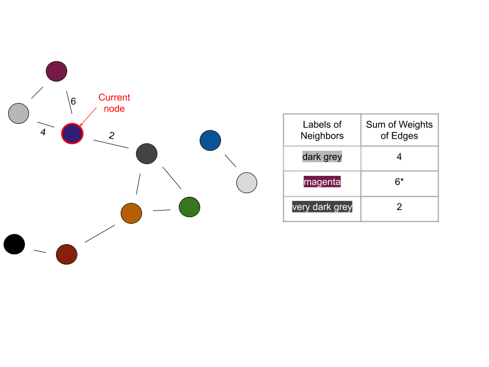

Iteration 2:
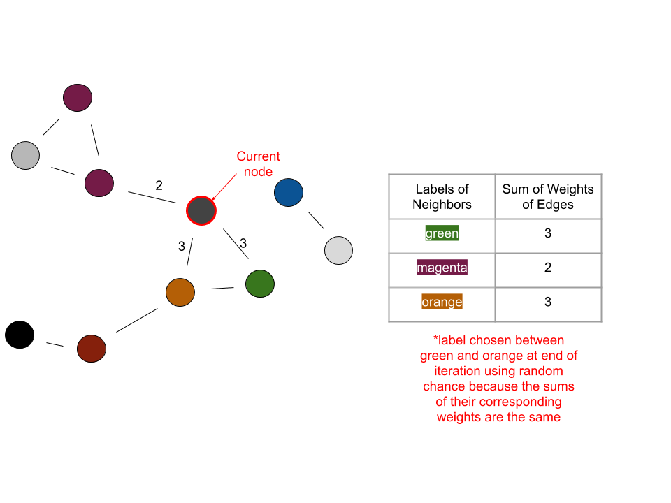

Iteration 3:
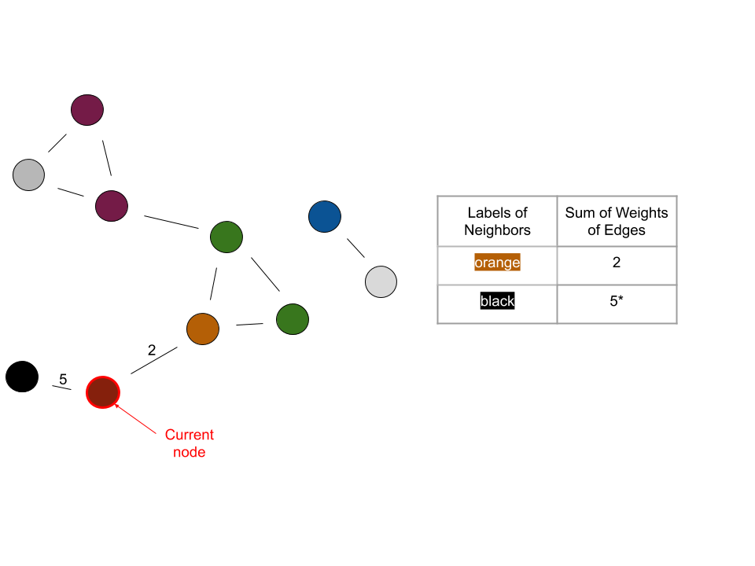

Notice how the weighted edges reduced the need to randomly choose a label.
Using this method, choosing labels took place with an additional piece of information: a quantified similarity between a node and its neighboring nodes.

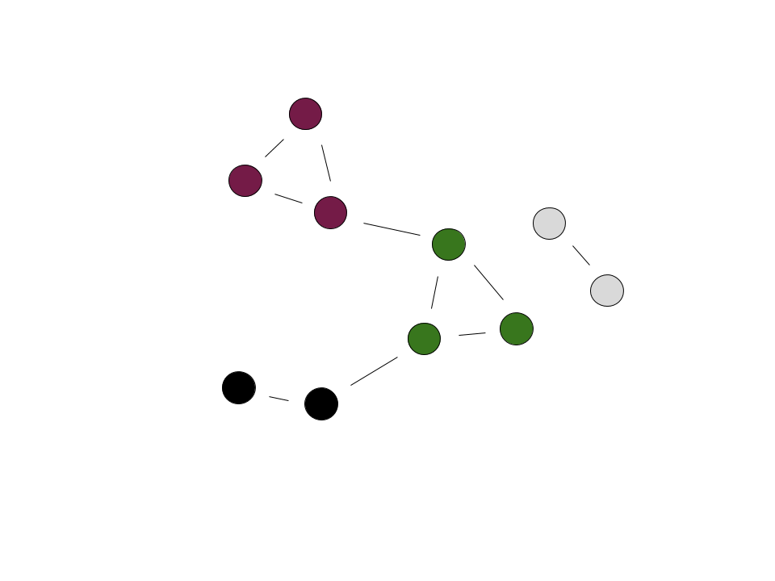

The resulting graph from the running the weighted whispers algorithm is different from the one obtained using the normal algorithm!
Some of the clusters are composed of the same nodes, but have a different label.
This doesn't correlate to an actual difference in result - as long as the same images are grouped together, their corresponding label has no added significance.
Moreover, this subtlety goes to show the role randomness can play in the whispers algorithm.
However, a significant difference from before is the number of clusters: there are four instead of three.
The cluster distinguished by the black label was previously grouped with another cluster.
The implication could be that the normal whispers algorithm grouped two peoples' pictures together.
There are a few ways that chance could have played out that resulted in the merging of clusters.
It could be a good exercise to think through one or two.
Regardless, the increased robustness of the weighted whispers algorithm corresponds to leaving much fewer decisions to random chance.
Overall, this results in the weighted algorithm having a higher accuracy.

## Team Tasks

Here are some recommended tasks:

- Define a `Node` class to store the information for a picture of a single individual from your pile of pictures (see below)
- Create a function that takes in a list of image-paths, and returns a list of nodes and an adjacency graph that describes the weighted connections between your nodes. This list of nodes and adjacency matrix, together, represent your graph.
   - You will need to estimate a maximum cosine-distance threshold for distinguishing nodes that share an edge (i.e. if $\mathrm{cosdist}(\vec{d}_i, \vec{d}_j) < \mathrm{threshold}$ then node-i and node-j will share an edge). Note that this max cosine-distance threshold is also needed for the face-recognition database, so make sure that both legs of the project are collaborating to estimate this value and that you use the same value.
   - For your adjacency matrix, it is recommended that use weighted edges rather than 1s to represent edges. The recommended weighting function is  $\frac{1}{(\mathrm{cosdist}(\vec{d}_i, \vec{d}_j)) ^ 2}$
- Create a `connected_components` function, which takes in your graph's list of nodes, and returns a list of lists -- each inner list contains all nodes with a common label.
- Create a `propagate_label` function that takes in a node, the node's neighbors, and the adjacency matrix. It should update that node's label based on the weights of its neighbor's labels
- Create a `whispers` function, which calls the `propagate_label` function some specified number of times on your graph. A node should be randomly selected each time the `propagate_labels` function is called.
    - While the whispers function is running -- and updated the graph's labels -- consider using your `connected_components` function and record / plot how the number of connected components changes across iterations. At first each node should have its own unique label, and thus there should be as many connected components as nodes. But soon the number of connected components should decrease and converge to a stable number.
- Gather a directory of pictures of, say, 10 distinct people. Each person should have 3-10 pictures. Create a graph from these pictures, run the whispers algorithm, and see if there is ultimately 10 connected components – one for each of the 10 distinct people. 
    - Write code that will automatically organize the photos according to these connected component groupings

## Useful Code

You will need to install `networkx` to use this code. First activate the appropriate conda environment, and then run:

```shell
conda install -c conda-forge networkx
```

The following code can be used to help us keep track of all of the pertinent information for each node in our graph.
Also included is code that will plot our graph's nodes and edges, and color each node based on its current label value. Thus nodes that have been clustered together by the whispers algorithm will have the same color. 

```python
import networkx as nx
import numpy as np
import matplotlib.cm as cm
import matplotlib.pyplot as plt


class Node:
    """ Describes a node in a graph, and the edges connected
        to that node."""

    def __init__(self, ID, neighbors, descriptor, truth=None, file_path=None):
        """ 
        Parameters
        ----------
        ID : int
            A unique identifier for this node. Should be a
            value in [0, N-1], if there are N nodes in total.
        
        neighbors : Sequence[int]
            The node-IDs of the neighbors of this node.
        
        descriptor : numpy.ndarray
            The shape-(512,) descriptor vector for the face that this node corresponds to.
        
        truth : Optional[str]
            If you have truth data, for checking your clustering algorithm,
            you can include the label to check your clusters at the end.
            If this node corresponds to a picture of Ryan, this truth
            value can just be "Ryan"
        
        file_path : Optional[str]
            The file path of the image corresponding to this node, so
            that you can sort the photos after you run your clustering
            algorithm
        """
        self.id = ID  # a unique identified for this node - this should never change

        # The node's label is initialized with the node's ID value at first,
        # this label is then updated during the whispers algorithm
        self.label = ID

        # (n1_ID, n2_ID, ...)
        # The IDs of this nodes neighbors. Empty if no neighbors
        self.neighbors = tuple(neighbors)
        self.descriptor = descriptor

        self.truth = truth
        self.file_path = file_path


def plot_graph(graph, adj):
    """ Use the package networkx to produce a diagrammatic plot of the graph, with
    the nodes in the graph colored according to their current labels.
    Note that only 20 unique colors are available for the current color map,
    so common colors across nodes may be coincidental.
    Parameters
    ----------
    graph : Tuple[Node, ...]
        The graph to plot. This is simple a tuple of the nodes in the graph.
        Each element should be an instance of the `Node`-class.
        
    adj : numpy.ndarray, shape=(N, N)
        The adjacency-matrix for the graph. Nonzero entries indicate
        the presence of edges.
        
    Returns
    -------
    Tuple[matplotlib.fig.Fig, matplotlib.axis.Axes]
        The figure and axes for the plot."""

    g = nx.Graph()
    for n, node in enumerate(graph):
        g.add_node(n)

    # construct a network-x graph from the adjacency matrix: a non-zero entry at adj[i, j]
    # indicates that an egde is present between Node-i and Node-j. Because the edges are 
    # undirected, the adjacency matrix must be symmetric, thus we only look ate the triangular
    # upper-half of the entries to avoid adding redundant nodes/edges
    g.add_edges_from(zip(*np.where(np.triu(adj) > 0)))

    # we want to visualize our graph of nodes and edges; to give the graph a spatial representation,
    # we treat each node as a point in 2D space, and edges like compressed springs. We simulate
    # all of these springs decompressing (relaxing) to naturally space out the nodes of the graph
    # this will hopefully give us a sensible (x, y) for each node, so that our graph is given
    # a reasonable visual depiction 
    pos = nx.spring_layout(g)

    # make a mapping that maps: node-lab -> color, for each unique label in the graph
    color = list(iter(cm.tab20b(np.linspace(0, 1, len(set(i.label for i in graph))))))
    color_map = dict(zip(sorted(set(i.label for i in graph)), color))
    colors = [color_map[i.label] for i in graph]  # the color for each node in the graph, according to the node's label

    # render the visualization of the graph, with the nodes colored based on their labels!
    fig, ax = plt.subplots()
    nx.draw_networkx_nodes(g, pos=pos, ax=ax, nodelist=range(len(graph)), node_color=colors)
    nx.draw_networkx_edges(g, pos, ax=ax, edgelist=g.edges())
    return fig, ax
```


## Taking it Further

These are ideas to take your project further if your team has the time:

- Display and label the results of the clustering (one possibility is in a grid view)
- When the program is run on a folder of images, have it automatically create folders of the different people/clusters with the corresponding images in them


---

## Appendix: Vision Module overview

Source: <https://rsokl.github.io/CogWeb/vision.html>

# Vision Module

We will motivate this module using the same approach that we took in the audio module - by thinking about a neat trick that our phones can do.
Many phones come with apps that can organize our photos for us, based not only on a picture's metadata (e.g. the time and location where they were taken) but also on what or _who_ are in the picture.
For example, without our input the app can sort pictures of individuals into separate folders, making it easy for us to find all of the pictures of a parent or a friend.
How can the app recognize who is in a picture?
For that matter, how can the app understand the contents of a photograph *at all*?

What might seem like a mere convenience afforded to us by an app is actually the culmination of remarkable technical achievements in the field of **computer vision**.
In short, this field asks: how can we enable computers to "understand" visual data in manners similar to that of humans?
To be more precise, computer vision is a scientific field that devises theories, mathematical methods, and algorithms that enable us to distill high-level meaning from an image in systematic ways that do not directly rely on human cognition.


Computer vision is a broad field that draws widely from other fields such as signal processing, information theory, graph theory, and machine learning.
With the relatively brief amount of time we will spend with this material, we will only have the opportunity to walk a narrow path through this field.
In particular, we will focus on some recent developments in computer vision that have produced an explosion of interest and work;
namely, we will view computer vision through the lens of machine learning, with a focus on supervised deep learning.

To kick things off, we will take a bird's eye view of the field of **machine learning (ML)** to understand, broadly, how it contextualizes problems and intersects with the field of computer vision.
Here, we will see that the general task of **transforming observations into useful predictions or decisions** is a major thrust of ML.
Mediating this transformation is a **mathematical model**, which we must design to have the capacity to capture the critical relationships between the data that we will observe and the meaning that we hope to distill from them.
Before we delve too deeply into what makes for a good mathematical model, we will reflect on what it means for a model (or a machine), to **learn**.
While there are many different flavors of learning we will be focusing on **supervised learning**, whereby we can "teach" a machine by showing it the results that it *should* have predicted.
In this context, we will study how so-called gradient-based learning, which is rooted in the **gradient descent** optimization scheme, provides us with an ability to automate the process of making fine-tuned adjustments to our model's mathematical parameters, so as to improve the quality of its predictions.

Returning to the topic of mathematical models, a major challenge that machine learning practitioners face time and time again is the prospect of devising an appropriate mathematical model for each new problem that they tackle.
The **deep learning** revolution has made major strides to help mitigate this challenge by putting forth ideas and techniques for designing "universal" mathematical models, which tend to take the form of **neural networks**.
(To convey just how universal these models are becoming, a neural network based model that [exhibited remarkable language comprehension ability](https://openai.com/blog/better-language-models/) was [repurposed to solve challenging computer vision tasks](https://openai.com/blog/image-gpt/)).
We will spend time understanding and working with basic neural networks, along with some of the crucial practical details that enable them to thrive.  

This range of topics, brought together, will enable us to leverage convolutional neural networks along with unsupervised clustering techniques to create our own photo-sorting app!
With a click of a button it will be able to organize photos of friends and families.

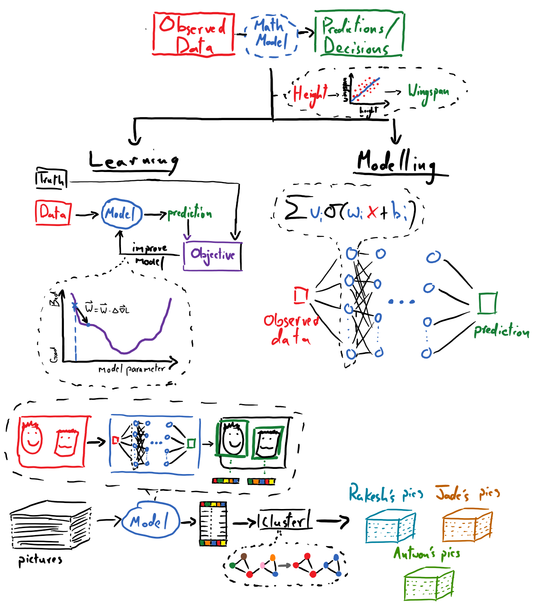
