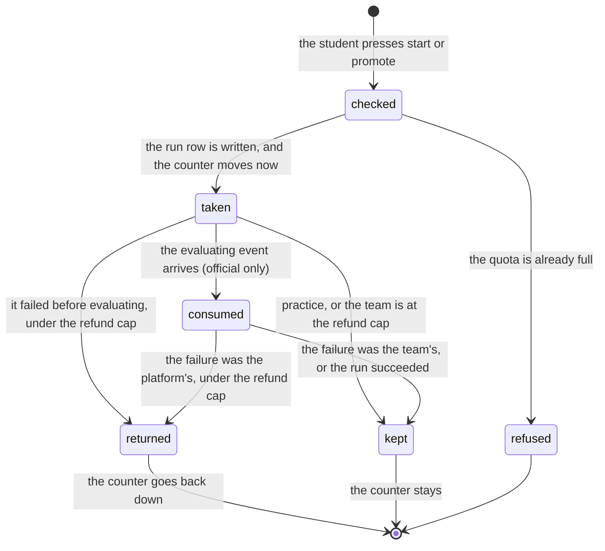

# Credit and quota

> **In flight.** One paragraph below rests on `apps/runner-modal/src/cogworks_runner/modal_app.py`, which was being edited while this document was drafted, as uncommitted work on top of `f74e087` (the `cogworks sync` weights work and the removal of instructor adapters, both named in [`goal.md`](../goal.md)). That paragraph is the one under **What the portal claims**, on why the platform never reads the submission's own account of whose fault a failure was. The reasoning it cites is untouched by the edit. The edit does add one failure route, a `data_download` failure at the `preparing` phase for a weight file that will not fetch, and it refunds like every other prepare-stage failure, so nothing in this document changes. Everything else here comes from the worker and the browser, which are unmodified at the lines cited.

## Summary

A team gets ten hosted practice runs and three official attempts, per benchmark version, and nothing else on the platform is scarce. This document owns four answers: what a run costs, the exact moment that cost is taken, the exact conditions under which it comes back, and what a student sees when the counter reaches its limit.

The rule underneath all four is the same one that governs what the platform says about a repository. The platform charges a team for what the team's code did, and pays for its own failures itself. [`../foundations/what-the-portal-claims.md`](../foundations/what-the-portal-claims.md) is that rule applied to numbers; this is that rule applied to budget. The failure categories it turns on are in [`../foundations/the-run.md`](../foundations/the-run.md#when-a-run-fails).

Credit is visible in one place: the ATTEMPT BUDGET panel on the dashboard, two rows of discrete cells that fill as they are used. It is never visible from the terminal.

## The simple case

A team starts a practice run. The counter reads 1/10 before the container exists. The run fails during dependency installation, and the counter still reads 1/10: a practice run is spent when it starts, and nothing gives it back.

Later they promote a good practice run. The official counter reads 1/3 the instant they confirm. That run dies during preparation because the repository was made private, and the counter drops back to 0/3, because a failure before evaluation is never the team's. They fix the repository, promote again, and this time their code raises during evaluation. That one stays at 1/3, and the run page says so in a single line: "This failure consumed one official attempt." (`apps/portal/src/components/FailureCard.tsx:70`).

## The ask, event by event

### Asking

The quota is read at the moment the student commits, from the durable record rather than from anything the browser was holding.

For practice, the portal counts the team's existing practice runs on this benchmark at this version, whatever became of them, and compares that count to ten (`apps/portal/worker/services/run-actions.ts:206`). For official, it counts attempt claim rows for this team, benchmark, and version, and compares that count to three (`run-actions.ts:347`).

Both limits are constants in one file: `PRACTICE_LIMIT = 10` and `OFFICIAL_LIMIT = 3` (`packages/contracts/src/schema.ts:1176`). Four other places in the product write those numbers out by hand. See [Edge cases](#edge-cases).

### Answered without work

A full quota is refused before anything is written. Nothing is inserted, nothing is dispatched, and no notification is sent.

The refusal carries the code `quota_exhausted` and one of two sentences: "The practice-run quota is exhausted." (`run-actions.ts:209`) or "The official-attempt quota is exhausted." (`run-actions.ts:357`). No client special-cases that code, so wherever a student manages to reach it, they read the server's sentence verbatim.

Most students never reach it, because the surfaces hide the control first. See [What a student sees at zero](#what-a-student-sees-at-zero).

### The work begins

**Credit is taken when the run row is written, not when work starts.**

For a practice run, there is no separate ledger. The run row *is* the charge: the quota counts rows, so the counter moves the moment the insert lands (`run-actions.ts:271`), before Modal has been asked anything. A practice run that never reaches a container has still used a slot.

For an official run, promotion inserts two rows together: the run, and an attempt claim carrying the team, the benchmark, the version, the attempt number, and `consumed: false` (`run-actions.ts:389`). The quota counts claim rows regardless of that flag, so the official counter also moves at once.

Both counters are read straight from those rows on the next dashboard request (`apps/portal/worker/routes/dashboard.ts:105`, `:107`), which is why the panel is correct within one poll of the button press.

### While it works

One thing happens and it is invisible. When an official run reports the `evaluating` phase, the portal sets that claim's `consumed` flag to true (`apps/portal/worker/routes/runner-events.ts:98`).

This does not change the quota. The counter was already at its new value, and deleting the claim is what would move it back. What the flag does is mark the point past which the platform stops treating the attempt as returnable on the strength of the phase alone. Everything before it can be refunded because nothing of the team's ran; everything after it is decided by which category the failure carries.

The dashboard's own footnote describes this flag rather than the counter, and reads as though it described the counter: "Local practice is unlimited. Official attempts are consumed only once hidden evaluation begins." (`apps/portal/src/routes/DashboardPage.tsx:164`). The cells two lines above it move at promotion.

### How it ends

A run's terminal write is also the credit decision, and the two are made in the same handler.

**A succeeded run keeps its charge.** Practice and official alike. Nothing is given back for a run that worked.

**A failed run is tested against one predicate.** An official attempt is spent only when all three of these hold (`runner-events.ts:32`):

1. The run's mode is `official`.
2. The sandbox did not mark the failure as the platform's.
3. The failed phase is `evaluating` or `scoring`, **and** the category is one of `student_runtime`, `timeout`, `memory_limit`, `output_invalid` (`runner-events.ts:25`).

Anything else refunds. In particular, every failure during fetching, installing, or the contract check refunds, because none of those phases is in the set. So does every `scorer` and `provider` failure, because neither category is.

**A refund deletes the claim row and records that it happened** (`apps/portal/worker/execution/refunds.ts:122`). The order matters and is commented: the delete first, the mark second, because marked-but-not-deleted would charge a team for a refund they did not receive, while deleted-but-not-marked is repaired by the next poll (`refunds.ts:123`).

**A practice run is never refunded.** The refund function returns `not_applicable` for any run that is not official (`refunds.ts:115`), and there is a test that says so by name (`apps/portal/test/refund-cap.test.ts:298`). A practice run that dies because Modal was unreachable, because the benchmark data was missing, or because the reaper found it stalled costs the same as one that ran.

## The refund cap

A team may receive five refunds per benchmark before the platform stops giving attempts back (`refunds.ts:35`).

The cap exists because refunds were unbounded and reachable on purpose. A submission that reliably provoked a platform-side failure could be replayed forever without ever spending an attempt (`refunds.ts:11`). The comment above the constant is unusually direct about its own basis:

> "There is no measured basis for 5. Nothing here was calibrated, and there is nothing to calibrate against: the platform never recorded a refund until the migration that added `runs.refunded_at`, so no history of real refund counts exists." (`refunds.ts:23`)

Five was chosen against the one number that does exist. A team hitting genuine trouble can lose and regain all three attempts and still have room; a team whose submission provokes the same platform-side failure repeatedly runs out and appears on the admin overview instead of looping unseen.

At the cap, the run still fails, the attempt stays spent, `consumedAttempt` is set to true so the failure card tells the truth, and the failure detail gains a sentence (`refunds.ts:45`):

> "A run that fails on our side normally gives the attempt back. Your team has already received all 5 refunds available on this benchmark, so this one stays spent. Bring the run to an instructor and they can look at what keeps going wrong."

The count is interpolated from the constant so the sentence cannot drift from the rule. It is appended to the existing detail rather than replacing it, because an official run keeps no log, so that detail is the only surviving text about why the run died, and it is the evidence the sentence tells the team to bring (`refunds.ts:53`).

Three separate code paths give attempts back, and all three ask the same function, because "a cap in one is not a cap in the others" (`refunds.ts:16`): the live runner callback (`runner-events.ts:169`), the fixture state machine used when no real provider is configured (`apps/portal/worker/execution/sync.ts:100`), and the stale-run reaper (`apps/portal/worker/execution/maintenance.ts:136`).

## What a student sees at zero

**Practice at 10/10.** The ATTEMPT BUDGET panel shows ten filled cells and reads `10/10 used` in the detector colour (`apps/portal/src/components/QuotaCells.tsx:25`). The START A RUN panel replaces its whole control with one sentence (`DashboardPage.tsx:329`):

> "All 10 hosted practice runs are used. Local practice stays unlimited; a successful candidate can still be promoted below."

The branch select and the "Run practice benchmark" button do not grey out. They are gone: the exhausted branch of the conditional renders the sentence instead of the fragment that holds them (`DashboardPage.tsx:327`).

That is the right shape when the sentence is true, and the sentence is only half true. "A successful candidate can still be promoted below" holds when the team has a succeeded practice run, because the promotion block below is a separate conditional on that candidate. When they do not, the sentence points at nothing, and there is no way left to obtain one: every hosted path runs through the same limit, including "Verify hosted" from Discord and the run console, and "Rerun hosted", which all call the same practice starter (`run-actions.ts:504`, `run-actions.ts:457`). A team at 10/10 with no successful practice run cannot reach the leaderboard on that benchmark version at all, and nothing on the page says who to ask.

**Official at 3/3.** The promote button is disabled rather than removed, on both surfaces. The dashboard's footnote under it becomes "All official attempts are used." (`DashboardPage.tsx:403`). The run page says more (`apps/portal/src/routes/RunDetailPage.tsx:294`):

> "All official attempts are used for this benchmark version. Your existing successful official runs can still be selected for the leaderboard."

That one is fully true. Publishing costs nothing and can be changed as often as the team likes, so a team out of attempts still controls which of their successful official runs is public.

**Neither number is visible from the terminal.** `cogworks status` reports the account, the team, the repository, the Discord channel, the device, the expiry, and the portal, and nothing per benchmark. A student who wants to know whether a hosted run is worth starting has to open the dashboard. See [`../terminal/status.md`](../terminal/status.md).

## Modifiers

| Modifier | Set before the ask | Changed while it works |
| --- | --- | --- |
| Who you are | Credit is not per person. Any member with write access spends from the same two counters, and no screen shows who spent what. An instructor sees every team's usage on the admin page and cannot start a run for a team; there is no path to grant more. | No effect. |
| Where your team and repository stand | The quota is per team, and a team is its repository, so credit follows the repository. A student who leaves a team leaves the runs behind. Two teams on the same benchmark never share a counter. | No effect. Membership changes mid-run do not move a charge. |
| Which week's benchmark | The counters are per benchmark **and** per benchmark version (`run-actions.ts:207`, `dashboard.ts:49`). A team out of practice runs on `vision-recognition` still has ten on `language-search`, and a new version of the same benchmark starts them at zero again. The refund cap is scoped the same way (`refunds.ts:86`). | No effect. |
| Practice or leaderboard | The whole subject. Practice costs one of ten and is never returned; official costs one of three and can be. Publishing costs nothing. A local run costs nothing and is unlimited, which is the sentence both exhausted states lead with. | No effect. A run's mode is fixed when the row is written. |
| Flags, options, and where you are typing | Every hosted start spends the same practice slot no matter which surface pressed the button. The surfaces do not say so consistently: the run console warns "This uses one of the team's shared practice runs." (`apps/portal/src/components/RunConsole.tsx:206`) while Discord's confirmation for the identical action says "It's practice and spends nothing." (`apps/discord-bot/src/commands.ts:514`). | No effect. |

## Cancel and interrupt

| Event | Before the work begins | While it works |
| --- | --- | --- |
| You stop it yourself | Dismissing a confirm costs nothing. The promote button is a two-press control that decays back to unarmed on its own, so an armed button left alone spends nothing (`apps/portal/src/components/ConfirmButton.tsx:6`). | Not possible. There is no way to cancel a run, so there is no way to stop a charge once it is taken. See [`../foundations/the-run.md`](../foundations/the-run.md#edge-cases). |
| You do something else mid-way | Navigating away before pressing spends nothing. | The charge is server-side and survives everything the browser does. Closing the tab does not refund; the run finishes and settles on its own. |
| A teammate acts at the same time | Two teammates pressing start at 9/10 both pass the quota check and one loses to the one-active-run index instead, so only one row exists and only one slot is spent (`apps/portal/worker/db/schema.ts:368`). At 2/3 the same race is resolved by the attempt table's own unique index, and the loser is told "The official attempt could not be claimed." (`run-actions.ts:407`). | A teammate cannot refund or spend a run already in flight. |
| The network or the portal fails | A failed start writes nothing and spends nothing. | A run whose events fail to arrive is failed by the reaper after an hour, with category `provider`, which refunds an official attempt under the cap and leaves a practice slot spent. The failure detail says which happened: "This attempt was refunded." or "Start the run again when you're ready." (`maintenance.ts:42`, `:44`). |
| The page or the process goes away | Nothing has been charged. | No effect on credit. A killed container produces a failure like any other, and that failure's category decides. |
| The thing being measured changes | A new benchmark version resets both counters, because both are scoped to the version. A team that has used everything on version 1 has a full budget on version 2 the moment it goes active. | No effect. A run in flight keeps the version it was started against, and its refund is counted against that version. |
| The platform refuses or credit runs out | This row is the document. A full quota refuses before any write. | The refund cap is the one place credit runs out mid-flight: past five refunds on a benchmark, a platform-side failure stops giving the attempt back and says so in the failure detail. |

## Interactions with other systems

**Who may do this.** Anyone with current write access to the connected repository can spend the team's credit, and nobody can grant more. There is no operator endpoint that adds an attempt; an instructor returning one by hand means editing the database, which the reaper's own comment assumes as the manual repair for a run that missed its refund window (`maintenance.ts:37`).

**The team owns it.** Both counters are team-scoped and no screen attributes a run to the person who started it. This is [no per-person numbers](../foundations/what-the-portal-claims.md#no-per-person-numbers) applied to budget: a per-person share of the ten would be a per-person number.

**Credit.** This document.

**What the portal claims.** The `infrastructure` flag on a failure is the credit system's version of the honesty rule. The platform decides whether a failure was its own from what its own controller observed, never from anything the student's process wrote, because a submission that could claim a platform fault could buy unlimited attempts. The reasoning, and the exploit that forced it, is at `apps/runner-modal/src/cogworks_runner/modal_app.py:2026`.

**What the benchmark supplied.** No effect on credit. A run that depended heavily on a benchmark-supplied resource costs the same as one that did not.

**Live updates and reconnection.** The counters are not streamed. The dashboard polls them only while it holds an active run (`apps/portal/src/lib/queries.ts:41`), so a dashboard parked after a run settles shows whatever it last fetched. A refund that lands later, from the reaper an hour on, is not reflected until the page is reloaded. **Unverified** against a live portal.

**Discord.** The activity and the bot show official attempts as filled and empty cells and a count, both against a hardcoded three. They show no practice counter at all, and the confirmation copy for a hosted verification says it spends nothing. See [`../discord/commands.md`](../discord/commands.md).

**Configuration.** Neither limit is configurable per cohort, per team, or per benchmark. Both are module constants, and changing either means a deploy. The refund cap is the same.

## Edge cases

- **The two limits have five sources and one authority.** `PRACTICE_LIMIT` and `OFFICIAL_LIMIT` in `packages/contracts/src/schema.ts:1176` are what the server enforces and what the dashboard payload carries. Four places write the numbers out instead: the admin page prints `{practiceUsed}/10 · {officialUsed}/3` (`apps/portal/src/routes/AdminPage.tsx:437`), the run console builds "of 3" into its confirmation (`RunConsole.tsx:208`), and the Discord bot hardcodes three in three places (`apps/discord-bot/src/commands.ts:185`, `:186`, `:521`, `:524`). Raising `OFFICIAL_LIMIT` to four would leave an instructor reading `4/3` and a Discord button offering "Use attempt 4 of 3".
- **A mixed source, in the same sentence.** Both promote confirmations combine a payload value with the imported constant: "Confirm, uses attempt {quota.officialUsed + 1} of {OFFICIAL_LIMIT}" (`DashboardPage.tsx:395`) and the same shape on the run page (`RunDetailPage.tsx:277`). They agree today because both are three. They are two sources in one string.
- **The promote button is live before the quota is.** The run page disables it only once the quota has loaded: `disabled={!!quota && quota.officialUsed >= quota.officialLimit}` (`RunDetailPage.tsx:280`). The dashboard query that supplies the quota is not even enabled until the run query resolves (`RunDetailPage.tsx:54`), so on a fresh page load there is a window in which the button is enabled, the "N official attempts remaining" line is absent, and a click sends a request the server refuses. The refusal is at least correct and legible; the button was not.
- **The two confirm labels disagree, and one breaks the voice rule.** The dashboard writes "Confirm, uses attempt 2 of 3". The run page writes the same sentence with an em dash in place of the comma, U+2014, verified in the bytes at `RunDetailPage.tsx:277`. `docs/design/voice.md` rules out em dashes in student-facing copy. Same action, same product, two strings, and the character is quoted here by name rather than reproduced so this document keeps the rule the string breaks.
- **A practice run that never dispatched still costs a slot.** When Modal refuses the job, an official run's claim is deleted in the same batch as the failure write, and a practice run's is not, because there is nothing to delete: the row is the charge (`run-actions.ts:171`). The team paid for a run that no container ever saw.
- **A failed practice run says nothing about credit.** The failure card's attempt line renders only for official runs (`FailureCard.tsx:63`). A student whose practice run failed at install reads a full explanation of what went wrong and no indication that one of their ten is gone.
- **Recovering from a refunded official attempt costs a practice run.** A failed official run occupies its surface, so the same candidate cannot be promoted again. The run page's recovery is "Run practice again on {branch}" under the line "attempt not consumed; a fresh practice run creates the next candidate to promote" (`RunDetailPage.tsx:194`). The official attempt came back; the practice slot that recovers it is spent silently.
- **Attempt numbers repeat after a refund.** The number is one more than the current claim count (`run-actions.ts:366`), and a refund deletes a claim, so a team can hold two different runs both labelled attempt 1 of 3.
- **The refund cap counts runs, not attempts.** `refundsAlreadyGiven` counts runs with a non-null `refundedAt` for this team, benchmark, and version, excluding the run being decided (`refunds.ts:80`). The exclusion is deliberate: none of the three callers writes the claim delete and the run's terminal state in one transaction, so a retry can re-enter the decision for a run already marked, and counting itself would report a cap that is not there.
- **Fixture mode applies the same rule with one clause missing.** The fixture state machine keeps its own copy of `CONSUMING_FAILURES` (`sync.ts:9`) and decides on phase and category alone, with no `infrastructure` check, because a fixture scenario carries no such flag (`sync.ts:87`). Two copies of the same four-element set now exist, in two files, and only a reader comparing them would notice if they drifted.

## Open questions and verification

- The five hardcoded copies of the limits are a real defect and the cheapest to fix: every one of them has the authoritative constant available to import, and two files already import it. Carried to triage, ranked above the others because an instructor reads the admin page every day.
- The Discord confirmation "It's practice and spends nothing." (`commands.ts:514`) is wrong. That button calls `startPracticeRun`, which is exactly what the ten-run quota counts. The equivalent control in the browser says the opposite and says it correctly. Carried to triage.
- The dashboard's "Official attempts are consumed only once hidden evaluation begins." (`DashboardPage.tsx:164`) describes the `consumed` flag, not the cells directly above it, which move at promotion. Whether a student reads it as a promise that the counter will not move was not observed. **Unverified**, and carried to triage as copy.
- Whether the promote button really is clickable in the window before the quota loads depends on how fast the dashboard query resolves after the run query. The condition is certain from the code; the window's length was not measured. **Unverified.**
- The dead end at 10/10 with no successful candidate is derived from the code paths, not observed: every hosted entry point was traced to `startPracticeRun` and its limit check. Whether a team has actually hit it, and what they were told to do, was not established. **Unverified**, and worth a product decision rather than only a bug.
- `REFUND_CAP = 5` says of itself that it has no measured basis and asks to be revisited once `refunded_at` has a season of real counts. That is a note to the next maintainer, not a defect, and it is recorded here so the request does not get lost in a source comment.
- No counter was watched move against a running portal for this pass. Every number, string, and moment above is read from the source. **Unverified.**

Verified against Cog\*Portal commit `f74e087`.
