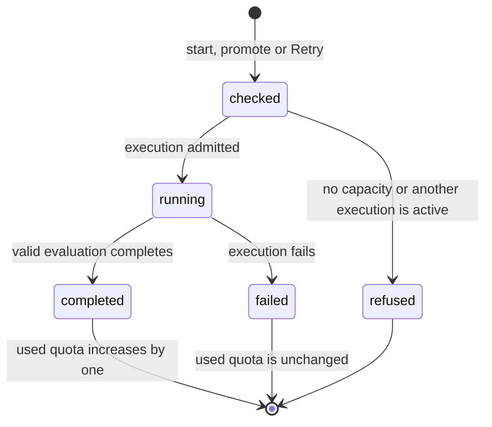

# Credit and quota

## Summary

A team has room for ten completed hosted practice evaluations and three completed official evaluations per benchmark version. Failed executions use no quota, whether the failure came from the submission or the platform. A valid low or partial result still counts as a completed evaluation.

This document owns the limits and when an evaluation counts. [The run](../foundations/the-run.md) owns execution status and history. Local practice, reading results and changing the selected public result use no quota.

## The simple case

A team starts a practice run with no completed evaluations. While it runs, the team cannot start another execution on that benchmark. If it fails during installation or evaluation, practice usage remains zero. If it completes with a valid result, usage becomes one of ten.

An official run follows the same rule against its separate limit of three. If it fails, Retry starts another official execution in the same view with the same recorded source and settings. It does not require another practice run. The failed execution remains in history.

## The ask, event by event

### Asking

The portal checks current usage and whether another execution is active. The limits belong to the team, benchmark and version, separately for practice and official evaluations. Only one execution may be active for a team's benchmark, even across versions.

### Answered without work

At the limit, a new execution is refused without dispatch. A stale button cannot bypass that check. Reading old results and selecting an eligible official result for publication remain available.

### The work begins

An admitted execution reserves capacity until it ends. It has not yet added to used quota. Closing the page does not cancel it or free the reservation.

> Technical note: the run insertion checks capacity itself, and the database enforces one active execution. Promotion and Retry write their execution and phase records together. There is no separate attempt ledger controlling admission. See `apps/portal/worker/services/run-accounting.ts` and `apps/portal/worker/services/run-actions.ts`.

### While it works

Usage still counts completed evaluations. The active execution prevents a teammate from starting another run on the same benchmark. Entering evaluation or scoring does not itself spend quota.

### How it ends

A completed evaluation counts once. A low score, a zero result or a valid partial result does not make it free. A failed execution releases its reservation and adds nothing to used quota. This includes dispatch failures, timeouts and invalid output failures.

Late findings can be retained on a failed execution, but do not turn it into a completed evaluation or add it to used quota. Historical results that were already refunded remain excluded; the new policy does not retroactively charge them. There is no refund cap.

## What a student sees at zero

At ten completed practice evaluations, the team cannot start another hosted practice execution on that benchmark version. Local practice remains unlimited. An existing eligible practice candidate can still be promoted if official capacity remains.

At three completed official evaluations, neither promotion nor an official Retry can start another evaluation on that version. Existing eligible official results can still be selected for the leaderboard without cost.

The dashboard reports completed usage in its attempt-budget cells; the staff view reports completed totals. The terminal has no per-benchmark quota display. See [starting a practice run](../portal/start-a-practice-run.md) and [terminal status](../terminal/status.md). Browser copy and recovery controls are being assembled separately from this backend checkpoint; this document does not certify their final presentation.

## Modifiers

| Modifier | Set before the ask | Changed while it works |
| --- | --- | --- |
| Who you are | A member needs current write access to the team's repository. Staff can inspect usage within their assigned scope. There is no per-person allowance. | A role change does not change an execution's quota treatment. |
| Where your team and repository stand | Usage belongs to the team. Retry checks current repository access and the identity recorded for the failed execution. | Leaving a team does not move its history or usage to another team. |
| Which week's benchmark | Each benchmark version has its own limits. | The execution remains charged, if completed, to its recorded version. |
| Practice or leaderboard | Practice and official evaluations have separate limits. Publication is free. | Retry preserves the failed execution's mode. |
| Flags, options, and where you are typing | Portal, Activity and CogBot use the same server admission rules. Local CLI runs do not spend hosted quota. | Changing where a run is watched has no effect. |

## Cancel and interrupt

| Event | Before the work begins | While it works |
| --- | --- | --- |
| You stop it yourself | Dismissing a confirmation starts nothing. | Closing the view does not cancel an execution. |
| You do something else mid-way | Navigating away before submitting starts nothing. | The run continues independently of the page. |
| A teammate acts at the same time | Admission permits only one active execution. Repeated Retry requests for the same failure create at most one successor. | A teammate cannot start another execution on that benchmark until this one ends. |
| The network or the portal fails | A lost response may hide an admitted execution, so re-read the view before assuming nothing started. | If the execution fails, it uses no quota. Replaying its original Retry request does not create another successor. |
| The page or the process goes away | An unsent request leaves no execution. | Reloading does not erase history. A failed container uses no quota. |
| The thing being measured changes | Retry refuses incompatible source or configuration rather than choosing a new commit. Changed code is a new candidate. | The admitted execution retains its recorded source and version. |
| The platform refuses or credit runs out | No execution is dispatched when admission refuses. | Failure remains free. No later category or refund cap can charge it. |

## Interactions with other systems

**Who may do this.** Current repository write permission is required for run actions. Quota does not grant permission.

**The team owns it.** Results and usage belong to the team. The portal does not divide them into personal shares.

**Credit.** This document owns the rule; other descriptions should link here.

**What the portal claims.** A failed execution remains failed even if findings arrive later. It cannot become publishable through a late callback.

**What the benchmark supplied.** The content of a valid result does not change whether a completed evaluation counts.

**Live updates and reconnection.** Re-reading quota returns the server's completed counts. Final browser refresh behavior remains subject to assembled UI verification.

**Discord.** The shared action applies the same checks to Activity and CogBot. A replay keeps its original failed-execution target.

**Configuration.** Limits remain ten practice and three official evaluations, with one active execution per team and benchmark. The limits are module constants, not per-team settings. Changing them requires a deploy. This phase changes no timeout or stale-run threshold.

## Edge cases

The following presentation findings retain the earlier draft's source references. They have not been rechecked against the pending UI integration.

- **The two limits have five sources and one authority.** `PRACTICE_LIMIT` and `OFFICIAL_LIMIT` in `packages/contracts/src/schema.ts:1176` are what the server enforces and what the dashboard payload carries. Four places write the numbers out instead: the admin page prints `{practiceUsed}/10 · {officialUsed}/3` (`apps/portal/src/routes/AdminPage.tsx:437`), the run console builds "of 3" into its confirmation (`RunConsole.tsx:208`), and the Discord bot hardcodes three in three places (`apps/discord-bot/src/commands.ts:185`, `:186`, `:521`, `:524`). Raising `OFFICIAL_LIMIT` to four would leave an instructor reading `4/3` and a Discord button offering "Use attempt 4 of 3".
- **A mixed source, in the same sentence.** Both promote confirmations combine a payload value with the imported constant: "Confirm, uses attempt {quota.officialUsed + 1} of {OFFICIAL_LIMIT}" (`DashboardPage.tsx:395`) and the same shape on the run page (`RunDetailPage.tsx:277`). They agree today because both are three. They are two sources in one string.
- **The promote button is live before the quota is.** The run page disables it only once the quota has loaded: `disabled={!!quota && quota.officialUsed >= quota.officialLimit}` (`RunDetailPage.tsx:280`). The dashboard query that supplies the quota is not even enabled until the run query resolves (`RunDetailPage.tsx:54`), so on a fresh page load there is a window in which the button is enabled, the "N official attempts remaining" line is absent, and a click sends a request the server refuses. The refusal is at least correct and legible; the button was not.
- **The two confirm labels disagree, and one breaks the voice rule.** The dashboard writes "Confirm, uses attempt 2 of 3". The run page writes the same sentence with an em dash in place of the comma, U+2014, verified in the bytes at `RunDetailPage.tsx:277`. `docs/design/voice.md` rules out em dashes in student-facing copy. Same action, same product, two strings, and the character is quoted here by name rather than reproduced so this document keeps the rule the string breaks.

- Several failed official executions can carry the same attempt number. Numbering follows completed official evaluations, not the number of failures in history.
- An old Retry request cannot start the next generation after its successor fails. The team must request Retry for that newer failure.
- A saved artifact reference does not prove the hosted provider can still restore it. An unavailable snapshot is discovered during restoration; that failure uses no quota.

## Open questions and verification

- Recheck the hardcoded limit labels and the promotion button while quota loads against the integrated UI. Their earlier findings remain open; this policy correction does not resolve them.

- Provider snapshot restoration and assembled browser recovery remain unverified here. A source reference alone does not prove either works.

Verified against Cog\*Portal commit `a0e8eac` for recovery policy, by source and existing local test evidence, not hand-verified UI.
