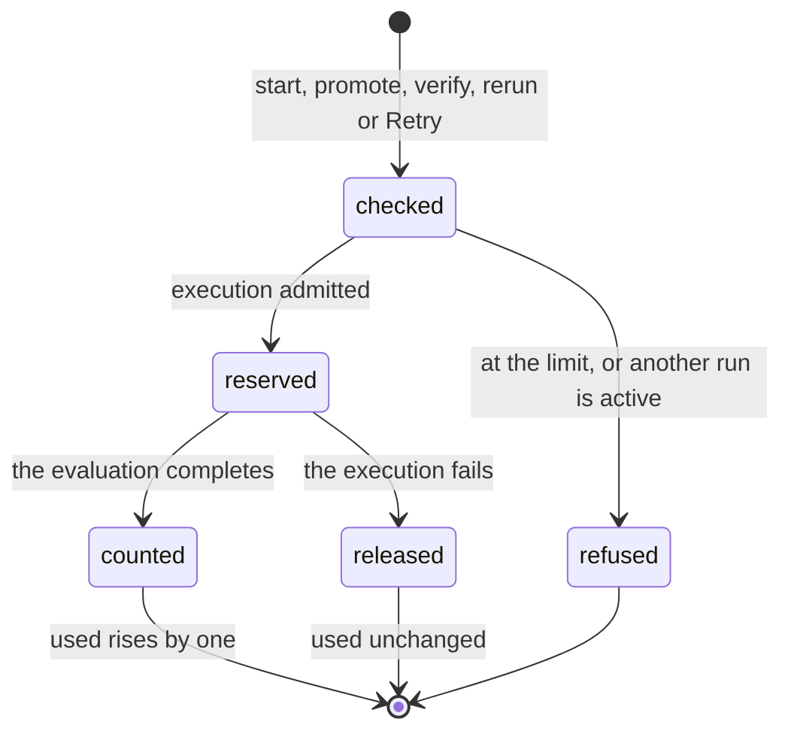

# Credit and quota

## Summary

A team may complete ten hosted practice evaluations and three official evaluations per benchmark version. Only a completed evaluation counts, whatever it scored. A failed execution counts nothing, whether the submission or the platform caused it. While an execution is active it holds a place against the limit, so two can never race past it, and it releases that place if it fails.

The limits are `PRACTICE_LIMIT = 10` and `OFFICIAL_LIMIT = 3` (`packages/contracts/src/schema.ts:1519`, `:1520`). They belong to the team, not to a person, and they are counted separately for each benchmark and version, so Recognition, Clustering, Language and Audio each have their own ten and three.

This document owns the limits and when an execution counts. [The run](../foundations/the-run.md) owns statuses, Retry and history. Local runs, reading results and publishing a result cost nothing.

## The simple case

A team with no completed evaluations starts a practice run. The Runs page's launcher reads "10 of 10 hosted practice runs left on this version; a run that fails doesn't count." (`apps/portal/src/routes/DashboardPage.tsx:653`). While the run is active no other run can start on that benchmark. If it fails, the count stays at ten left and the lead card says "Failed runs don't use your hosted budget." (`:445`). If it succeeds, with any score, nine are left and the reference facts show "Hosted practice 1 of 10 used" (`:838`, `apps/portal/src/components/QuotaCells.tsx:35`).

Observed locally on fixture data in `/tmp/cogshots/matched/pairs/b-dashboard-desk.png`: three practice runs, one of them failed, read "8 of 10 hosted practice runs left" and "2 of 10 used"; one succeeded official attempt reads "1 of 3 used".

Official attempts follow the same rule against three. A failed official attempt's page says "A failed official attempt doesn't use up one of your team's attempts." (`apps/portal/src/routes/RunDetailPage.tsx:196`).

## The ask, event by event

```mermaid
stateDiagram-v2
    [*] --> checked : start, promote, verify, rerun or Retry
    checked --> refused : at the limit, or another run is active
    checked --> reserved : execution admitted
    reserved --> counted : the evaluation completes
    reserved --> released : the execution fails
    counted --> [*] : used rises by one
    released --> [*] : used unchanged
    refused --> [*]
```

### Asking

Every action that starts an execution reads the team's completed and active runs for that benchmark and version, and refuses when completed plus active reaches the limit (`apps/portal/worker/services/run-actions.ts:257`, `:420`, `:606`). It also refuses when any run is active on that benchmark, in any version (`apps/portal/worker/services/run-accounting.ts:40`).

### Answered without work

At the limit nothing is dispatched:

- Practice: "The practice-run quota is exhausted." (`run-actions.ts:258`). The Runs page does not offer the start at all; it says "All 10 hosted practice runs on this version are used. Local runs score the same way and have no limit:" above `cogworks run --benchmark {id}` (`DashboardPage.tsx:616`).
- Official: "The official-attempt quota is exhausted." (`run-actions.ts:421`). The Runs page disables "Promote to official" with "All 3 official attempts on this version are used." (`DashboardPage.tsx:520`); the run page with "All official attempts are used for this benchmark version. Your existing successful official runs can still be selected for the leaderboard." (`RunDetailPage.tsx:665`).
- Retry: "The completed-evaluation quota is exhausted." (`run-actions.ts:611`). The console does not offer Retry without capacity (`apps/portal/worker/services/run-surfaces.ts:387`).
- Another run active: "A run is already in progress; runs go one at a time per benchmark." (`DashboardPage.tsx:666`).

Publishing an existing official result and reading history remain available at the limit.

### The work begins

Admission reserves. The insert that writes the run counts completed and active runs in the same statement and writes nothing if they reach the limit (`run-accounting.ts:73`, `:90`), and a partial unique index allows one active run per team and benchmark (`apps/portal/worker/db/schema.ts:416`). Nothing is added to used quota yet, and closing the page does not release the place.

### While it works

The active run holds its place until it ends. Entering evaluation or scoring changes nothing. The Runs page and run page show only completed counts, so an active run does not appear as used there; the console and Discord count it (below).

### How it ends

A completed evaluation counts once (`run-accounting.ts:11`). A low score, a zero, or a valid partial result is still completed. A Week 3 run that withheld its overall still counts.

A failed execution counts nothing and releases its place. That covers dispatch failures, install failures, the student's own exceptions, timeouts, memory, invalid output, scorer failures and the stale sweep. A completion that arrives after the run was failed is kept as history and still counts nothing (`apps/portal/worker/routes/runner-events.ts:173`).

Historical runs marked refunded under the earlier policy stay excluded (`run-accounting.ts:12`). There is no refund step and no refund cap.

## What each surface says

| Surface | What it shows | Counts |
| --- | --- | --- |
| Runs page launcher | "{left} of 10 hosted practice runs left on this version; a run that fails doesn't count." (`DashboardPage.tsx:653`) | Completed |
| Runs page reference facts | "Hosted practice" and "Official attempts" as cells, "{n} of {limit} used" (`:838`, `:846`) | Completed |
| Runs page first run | "One that succeeds can be promoted to one of your {n} official attempts, which score the hidden set." (`:709`) | Completed |
| Runs page lead card, failed | "Failed runs don't use your hosted budget." or "It didn't use an official attempt." (`:445`, `:444`) | Not applicable |
| Run page | "{n} official attempts left" beside the promote button (`RunDetailPage.tsx:659`) and the confirm "Confirm, uses attempt {n} of 3" (`:647`) | Completed |
| Console | "Use official attempt {n} of 3 for {benchmark} at {sha7}?" (`apps/portal/src/components/RunConsole.tsx:274`); hosted verification says "This uses one of the team's shared practice runs." (`:272`) | Completed plus active (`run-surfaces.ts:368`) |
| Discord `/cog` | "official attempts   {n} of 3 used", absent when none are left (`apps/discord-bot/src/commands.ts:186`) | Completed plus active |
| Discord confirmations | "It's practice, and it uses one of this benchmark's hosted practice runs." and "spends one official attempt" (`commands.ts:553`, `:559`) | Not applicable |
| Admin page | "{n} practice runs · {m} official attempts" summed across every benchmark and version, or "No hosted runs yet" when both are zero (`apps/portal/src/routes/AdminPage.tsx:477`, `:482`) | Completed |
| Terminal | Nothing. `cogworks status` reports no quota ([terminal status](../terminal/status.md)). | Not applicable |

## Modifiers

| Modifier | Set before the ask | Changed while it works |
| --- | --- | --- |
| Who you are | Starting anything needs current GitHub write access, except on the development fixture repository, which skips the check (`run-actions.ts:122`). There is no per-person allowance; any member can spend the team's places. Staff see completed totals on the admin page. | A role change does not change how an admitted run counts. |
| Where your team and repository stand | Usage belongs to the team, across repository changes. A run from a repository the team has left still counts if it completed. | Leaving a team does not move its usage. |
| Which week's benchmark | Each benchmark and version has its own ten and three. One active run per benchmark spans its versions. | A run counts against the version it was admitted on. |
| Practice or leaderboard | Separate limits. Publishing is free and repeatable. | Retry keeps the failed run's mode and counts against that mode. |
| Flags, options, and where you are typing | Portal, Activity and CogBot use the same admission. Local CLI runs, `cogworks check` and `cogworks sync` use nothing. | Where the run is watched has no effect. |

## Cancel and interrupt

| Event | Before the work begins | While it works |
| --- | --- | --- |
| You stop it yourself | Dismissing a confirmation starts nothing. | No stop exists. The place is held until the run ends. |
| You do something else mid-way | Navigating away before confirming starts nothing. | The run continues and counts only if it completes. |
| A teammate acts at the same time | Two starts race at the insert; one is admitted. Two Retries of one failure create one successor. | A teammate cannot start another run on that benchmark until this one ends. |
| The network or the portal fails | A lost response can hide an admitted run; reloading shows it as active. | If the run fails, it counts nothing. |
| The page or the process goes away | An unsent request leaves no run. | A killed container ends in a failure, which counts nothing. |
| The thing being measured changes | A new active version starts with a fresh ten and three; the old version's usage stays with it. | The admitted run keeps its version. |
| The platform refuses or credit runs out | Nothing is dispatched. | Failure stays free; no later step can charge it. |

## Interactions with other systems

**Who may do this.** Current repository write permission; the development fixture repository skips the check. Quota grants nothing.

**The team owns it.** Usage is the team's. No surface divides it by person.

**Credit.** This document owns the rule.

**What the portal claims.** The completed count is what the server enforces. The console and Discord show completed plus active, so an in-flight official attempt reads as used there and returns if it fails.

**What the benchmark supplied.** The content of a completed result does not change whether it counts.

**Live updates and reconnection.** The Runs page refreshes its counts when its active run settles. Discord's line updates with the console snapshot.

**Discord.** Discord's confirmations and status line use the same server admission and hardcode the official limit ([B-35](../bug-triage.md)).

**Configuration.** The limits are constants in `packages/contracts`; changing them needs a deploy.

## Edge cases

- **"No hosted runs yet" can be false.** The admin page counts completed evaluations only, so a team whose every run failed is labelled "No hosted runs yet" and sorted with teams that never tried (`AdminPage.tsx:108`, `:432`, `:477`).
- **Discord hides the count at the limit.** The `/cog` line is drawn only while another attempt is possible (`commands.ts:187`), so a team at three of three sees no line rather than "3 of 3 used".
- **Confirmations say "uses" before anything is used.** The console's hosted verification and Discord's verify, rerun and promote confirmations state the cost unconditionally; only completion charges it ([B-09b](../bug-triage.md)).
- **Attempt numbers can repeat.** An official run is numbered by completed attempts plus one when admitted, so failures and their Retry share a number.
- **A version bump resets the limits.** A new active version is a new scope; nothing carries over.
- **A scorer change within a version does not.** Migration `0044_week2_recognition_v2.sql` changed Recognition's scorer inside version 2. Earlier Recognition selections left the board, and the attempts that produced them stay counted against the same version.
- **The official limit is written out in the Discord bot.** `commands.ts:189`, `:190`, `:560`, `:563` say "3" rather than reading `OFFICIAL_LIMIT`.

## Open questions and verification

- The admin page's "No hosted runs yet" for a team with only failed runs. Carried to triage.
- The scorer-version change that hid selections without returning attempts. Carried to triage with the leaderboard.
- Whether the console and Discord should count an active run as used was not established; they disagree with the Runs page while a run is active.
- No hosted observation exercised a count. The fixture screenshot shows a failed practice run not counted; no hosted run checked usage before and after.
- Hosted beta (`4984730`) counts the same way: `run-accounting.ts`, `run-actions.ts` admission, `dashboard.ts` and the Discord bot match the candidate. Beta's Runs page shows the counts in an "ATTEMPT BUDGET" panel (beta `apps/portal/src/routes/DashboardPage.tsx:200`) where the candidate shows them in "For reference" (`DashboardPage.tsx:838`).

Read against Cog\*Portal commit `2ff32fa`. Local fixture observation named where used.
