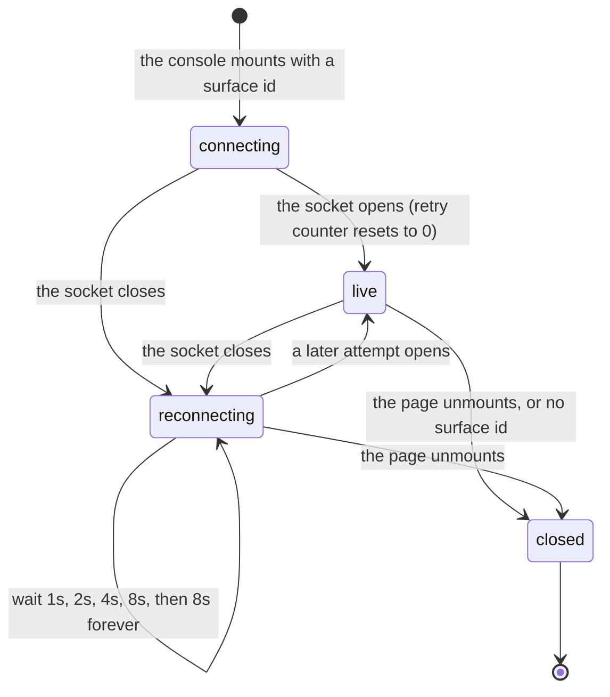

# Live updates and reconnection

## Summary

Four surfaces move on their own while a student watches: a run page that polls, a run console that holds a WebSocket, a sandbox that sends a heartbeat, and a CLI that pushes events from a laptop. This document owns every interval, every cap, and every backoff in that set. Other documents state a number only by linking here.

There is no screen called "live updates". What a student sees is a page that changes without being asked, a Discord message that edits itself in place, and a small word in the corner of the run console saying whether the connection is real.

Two template sections are reshaped. "The ask, event by event" is replaced by the intervals themselves and by a Mermaid diagram of the stream's own states, because the thing this document describes is not an ask a student makes. Everything else is in the fixed order.

## The simple case

A student runs `cogworks run --benchmark audio-identification --live`. Their laptop opens a session, the team channel gets a progress bubble, and a teammate opens the run console from that bubble. For the next two minutes three clocks tick at once: the laptop sends a heartbeat every 2 seconds, the portal's per-surface Durable Object rebuilds and rebroadcasts a snapshot every 2 seconds, and the teammate's browser holds a socket that receives each one. The console header reads "Live".

The teammate's wifi drops. The socket closes, the header changes to "Reconnecting…", and the browser tries again after 1 second, then 2, then 4, then 8, and every 8 thereafter. When it reconnects the portal sends one frame: the current snapshot, carrying up to 250 events. Nothing is replayed step by step, because nothing needs to be; the snapshot already contains the history.

When the run finishes the header reads "Complete" whether or not the socket is still open.

## Every interval, in one table

| What | Interval | Where | Stops when |
| --- | --- | --- | --- |
| Run page | 2 s | `apps/portal/src/lib/queries.ts:58` | the run's status is terminal |
| Dashboard | 2 s | `queries.ts:41` | the dashboard reports no `activeRun` |
| Connections page | 4 s | `queries.ts:120` | at least one CLI device is linked. Never otherwise |
| Setup page | 2.5 s | `queries.ts:249` | every step on the visible checklist is verified |
| Run-surface Durable Object | 2 s | `apps/portal/worker/realtime/run-surface-hub.ts:8` | the snapshot's status is no longer `running` |
| Sandbox status heartbeat | 2.0 s | `apps/runner-modal/src/cogworks_runner/modal_app.py:901` | the stage's `with` block exits |
| CLI `--live` heartbeat | 2.0 s | `python/cogbench/src/cogbench/cli.py:482` | the session closes |
| Run-surface WebSocket | pushed, not polled | `apps/portal/src/lib/run-surface-stream.ts:37` | the page unmounts |

The 2 second figure for the run page and the dashboard is one constant, `ACTIVE_RUN_POLL_MS`, defined at `packages/contracts/src/schema.ts:1178` with the comment "plan §4: 2-second active-run polling". The run page also states it to the student in words while a practice run is live: "Updates every 2 s." (`apps/portal/src/routes/RunDetailPage.tsx:155`). An official run reads "Hidden evaluation; logs are suppressed." in the same place instead, so the only surface that tells a student its own polling rate tells only half of them.

Two of these never stop on their own. The connections page polls every 4 seconds for as long as the tab is open and no device is linked, which is the state a student sits in while they run `cogworks link` in another window. TanStack Query pauses polling for an unmounted or backgrounded page, which is what keeps it from running all night, and the setup query carries that note explicitly (`queries.ts:242`). Whether the 4 second loop is intentional is a product question and is carried to triage.

## The stream, state by state

The socket is opened against `/api/run-surfaces/{id}/stream`, upgraded from the page's own scheme (`run-surface-stream.ts:11`). The route rejects a request without an upgrade header with a 426 and the sentence "Expected a WebSocket upgrade." (`apps/portal/worker/routes/run-surfaces.ts:61`), and 404s a surface belonging to another team on purpose (`run-surfaces.ts:19`).

Backoff is `Math.min(8_000, 500 * 2 ** Math.min(retry, 4))` (`run-surface-stream.ts:54`). The exponent is capped at 4, so the delay climbs 1 s, 2 s, 4 s, 8 s and then stays at 8 s for as long as the page is open. There is no attempt limit and no give-up state: a console left open against a dead portal retries every 8 seconds indefinitely, and the header says "Reconnecting…" the whole time.

A frame that does not parse against the snapshot schema is dropped without comment, because "the next authoritative snapshot wins" (`run-surface-stream.ts:47`). A socket error closes the socket, which routes into the same reconnect path (`run-surface-stream.ts:56`). The Durable Object answers Discord-style keepalives itself through `setWebSocketAutoResponse`, so a `ping` gets a `pong` without waking the object (`run-surface-hub.ts:13`).

## What a reconnection replays

One frame. On `/connect` the Durable Object accepts the socket and immediately sends whatever it last stored under `latest`, if anything (`run-surface-hub.ts:43`). It does not replay a sequence of events.

That is enough because the snapshot is not a delta. It carries the run's whole visible state, including up to 250 stream events (`packages/contracts/src/schema.ts:579`), so a browser that missed four minutes gets those four minutes back in one message. A browser that connects before any snapshot has been published gets nothing and sits at "Live" with the console reading "Waiting for the first structured event." (`apps/portal/src/components/RunConsole.tsx:331`).

### Retention, and what falls off

The portal keeps 250 stream events per surface. `MAX_SURFACE_EVENTS` is 250 (`apps/portal/worker/services/run-surfaces.ts:37`), the snapshot builder reads the newest 250 by `occurredAt` and reverses them into chronological order (`run-surfaces.ts:267`), and every accepted event triggers a trim that deletes rows past the 250th, up to a thousand at a time (`run-surfaces.ts:414`).

At one event every 2 seconds from a sandbox heartbeat, 250 events is a little over eight minutes. A longer run's early events are gone from the console and from any reconnection, with nothing on screen saying they were dropped. The console's own control says "Show all {n}" using the count it has (`RunConsole.tsx:314`), so the number a student sees is the number that survived.

Events are also filtered per stage before rendering. `runSurfaceCurrentEvents` keeps only those whose `sourceRunId` matches the stage on screen, so a hosted run does not show the local run's history even though the surface stores both (`packages/contracts/src/schema.ts:594`).

### How the Durable Object decides to tick

On a publish it stores the snapshot, broadcasts to every socket, and sets an alarm for 250 ms out when the run is running or 1 ms out when it is not (`run-surface-hub.ts:35`), and only when that is sooner than an alarm already set. On each alarm it rebuilds the snapshot from the database, broadcasts it, syncs the Discord message, and re-arms at `TICK_MS` only while the status is still `running` (`run-surface-hub.ts:85`). A finished run's object goes quiet after one last tick.

Two failures are handled by name. A 404 from the snapshot builder means the surface is gone, so the object deletes its alarm and all its storage and closes every socket with the code 1000 and the reason "Run surface no longer exists" (`run-surface-hub.ts:64`). A Discord rate limit reschedules the alarm at the retry-after Discord asked for rather than at the normal tick (`run-surface-hub.ts:72`). Anything else logs `run_surface_tick_failed` and retries in 2 seconds forever.

## The sandbox side

Each long stage runs inside a `StatusHeartbeat`, a daemon thread that re-emits the current phase every 2.0 seconds until the block exits, then joins with a 1 second timeout (`modal_app.py:901`, `:910`). The heartbeat carries the same fields as a real status change, including elapsed milliseconds measured from the reporter's own start (`modal_app.py:878`), so a run page's elapsed time comes from the sandbox rather than from the browser's clock.

### When the callback cannot land

`_post_event` posts each event to the portal with a signature, and retries at most three times (`modal_app.py:826`). Each attempt has a 15 second timeout (`:840`). A 429, 500, 502, 503, or 504 is retried; anything else raises at once. A transport failure is retried too. The wait between attempts is `time.sleep(max(retry_after, 0.25 * (2**attempt)))`, so the portal's own `Retry-After` header wins when it asks for longer than the 0.25, 0.5, 1.0 second schedule (`modal_app.py:852`).

After three attempts the event is lost. There is no queue and no later flush: a run whose terminal `failed` event never lands keeps whatever status it had, and the run page keeps polling every 2 seconds against a row nothing will change.

The portal rejects a signature whose timestamp is more than 300 seconds from its own clock (`apps/portal/worker/routes/runner-events.ts:24`), answering 401 with "Runner signature timestamp is invalid." (`:55`). A sandbox with a badly wrong clock therefore has every event refused, and the three retries all fail the same way, because the timestamp is recomputed but the skew is not.

The portal is careful about ordering on its side. An event whose sequence is not greater than the run's last is ignored (`runner-events.ts:81`), a run already terminal ignores everything (`:80`), and the surface append is wrapped so that a realtime failure logs `runner_surface_publish_failed` rather than failing the callback the sandbox is waiting on (`runner-events.ts:296`).

## The CLI's live session

`cogworks run --live` opens a session before the benchmark starts and prints one of three lines to stderr: "live: one progress bubble opened in your team channel", "live: synced to CogPortal; a team maintainer can choose the Discord channel with /cog", or "live: synced to CogPortal; Discord delivery is temporarily unavailable" (`cli.py:562`, `:565`, `:569`).

After that a background thread sends a heartbeat every 2.0 seconds carrying the current phase and, while evaluating, the case counter (`cli.py:482`). Events go through a queue capped at 32 (`cli.py:417`); a progress event that does not fit is dropped silently with `put_nowait`, and the terminal event gets a 1 second `put` instead (`cli.py:454`).

Alongside the queue the session keeps a 32-entry history. When it overflows it removes the first progress event it can find, and only falls back to removing the oldest entry when every entry is terminal (`cli.py:444`). Progress goes first because a heartbeat is worth less than a phase change.

On finish, `_finish` sets a 5 second deadline, closes the session so the heartbeat stops, queues the terminal event, and then posts the whole 32-entry history as one batch (`cli.py:502`). That batch is sent with `retry=False` and a 5 second timeout (`python/cogbench/src/cogbench/client.py:114`), unlike every other CLI call, which retries three times. If the batch throws, the session waits out the remainder of the 5 seconds for the single terminal event to land instead (`cli.py:514`).

The student sees at most one warning per session, latched by `_warned`: "cogworks: live updates paused: {reason}" from the sender thread (`cli.py:475`), "cogworks: final live update could not be queued" when the terminal event will not fit (`cli.py:460`), or "cogworks: final live update was delayed: {reason}" when the replay batch failed (`cli.py:513`). A session that loses every event after the first failure says so once and then goes quiet.

### The batch applies partially

The server accepts between 1 and 32 events, requires strictly increasing sequences, and requires any terminal event to be last (`packages/contracts/src/schema.ts:646`). Those rules are checked before anything is applied.

What is not checked in advance is whether each event can be applied. The handler loops over the batch and awaits `acceptLocalRunEvent` once per event (`apps/portal/worker/routes/local-runs.ts:380`). That call can throw: a 404 "Local run session not found." when the session does not belong to this device (`local-runs.ts:84`), or a 409 "The completed report does not match this live run." when the report's benchmark, repository, or commit disagrees with the session (`local-runs.ts:114`). A throw on the nth event leaves the first n as applied writes and returns a 4xx for the whole request.

Nothing rolls back, and the CLI does not retry the batch, so the surface keeps a partial history and the student's only signal is "cogworks: final live update was delayed". Carried to triage.

## What a student sees when it fails

One word, in the top right of the run console, and it is chosen by status before stream state (`RunConsole.tsx:84`):

| Word | When |
| --- | --- |
| `Complete` | the run succeeded, whatever the socket is doing |
| `Stopped` | the run failed, whatever the socket is doing |
| `Cancelled` | the run's status is `cancelled` |
| `Live` | the run is still going and the socket is open |
| `Snapshot` | the run is still going and there is no socket to open |
| `Reconnecting…` | the run is still going and the socket is connecting or retrying |

Because status wins, a finished run always reads "Complete" even when the socket died an hour ago and the page is showing a cached snapshot. That is correct: the run really is complete, and the connection no longer matters. While a run is going the word is the only indication that the page may be stale, and there is no timestamp beside it saying how stale.

The run page, which polls rather than streams, has no equivalent word. A student on a run page whose fetches are all failing sees the last good render with nothing marking it, because a failed refetch keeps the previous data.

### `cancelled` is a dead status

`cancelled` is a valid run status in the schema (`packages/contracts/src/schema.ts:35`), one of the three terminal statuses (`:40`), a case in the console's status copy (`RunConsole.tsx:78`), a branch in the Discord message that renders "### Cancelled" (`apps/portal/worker/services/discord-messages.ts:199`), and a mark in the stage rail (`RunConsole.tsx:71`).

Nothing writes it. Searching the worker and the contracts for a write of that value finds only reads: the dashboard's active-run filter (`apps/portal/worker/routes/dashboard.ts:98`), the runner-event guard (`runner-events.ts:80`), and the snapshot's status mapping (`apps/portal/worker/services/run-surfaces.ts:40`). The only literal assignment anywhere is a test fixture (`packages/discord-kit/test/loader.test.ts:112`). There is no cancel endpoint and no cancel button.

So a student can never stop a hosted run, and four pieces of copy exist for a state they can never reach. Carried to triage.

## Modifiers

| Modifier | Set before the ask | Changed while it works |
| --- | --- | --- |
| Who you are | The stream route requires a team, and a surface belonging to another team is a 404 (`run-surfaces.ts:19`). An instructor gets the same intervals as a student; nothing polls faster for staff. | No effect. A session that expires mid-run makes the next poll fail; the socket is not re-authenticated and stays open until it closes for another reason. **Unverified.** |
| Where your team and repository stand | Decides which surfaces exist to watch. A team with no runs has nothing streaming; the console shows "No shared runs yet." in the Activity (`apps/portal/src/activity-main.tsx:293`). | No effect on any interval. |
| Which week's benchmark | No effect. Every interval is the same for all three weeks. Longer weeks reach the 250-event cap sooner in wall-clock terms, which is the only week-dependent behavior here. | No effect. |
| Practice or leaderboard | Practice runs stream a sanitized log and say "Updates every 2 s."; official runs suppress the log and say "Hidden evaluation; logs are suppressed." (`RunDetailPage.tsx:153`). The event stream itself is identical. | No effect. |
| Flags, options, and where you are typing | `--live` is what opens a CLI session at all; without it a local run sends nothing and the terminal is the only surface. The run console exists in the browser and inside the Discord Activity and behaves identically in both, against different API prefixes (`activity-main.tsx:28`). | No effect. `--live` cannot be turned on mid-run. |

## Cancel and interrupt

| Event | Before the work begins | While it works |
| --- | --- | --- |
| You stop it yourself | Nothing is streaming yet, so nothing to stop. | Ctrl+C during `--live` sends a terminal `failed` event and the replay batch inside the same 5 second budget, then exits 130 (`cli.py:715`). In the browser there is no stop control; closing the tab is the only way out. |
| You do something else mid-way | No effect. | Navigating away unmounts the console, which sets `stopped`, clears the pending reconnect timer, and closes the socket (`run-surface-stream.ts:60`). Polling pauses with the unmounted query. Nothing is lost: the surface is durable. |
| A teammate acts at the same time | No effect. | Two browsers on one surface are two sockets on one Durable Object and both receive every broadcast. A teammate starting a second run creates a second surface with its own object and its own Discord message. |
| The portal fails | No effect. | The socket closes and the header reads "Reconnecting…" while the browser retries every 8 seconds forever. Polling queries keep their last good data with nothing marking it stale. The CLI warns once and keeps running the benchmark. |
| The process goes away | No effect. | A closed tab loses nothing. A killed sandbox stops heartbeating; the run keeps its last status and the run page keeps polling a row that will not change until the controller writes a terminal event. |
| The thing being measured changes | No effect. | No effect. A stream is about one surface, and a surface is about one run at one commit. |
| Refused, or out of credit | A run refused for quota never opens a surface, so there is nothing to stream. | No effect. Credit is not consulted while a run streams. |

## Interactions with other systems

**Who may do this.** Anyone on the team. Every realtime route goes through `requireTeam` and then checks that the surface belongs to that team (`run-surfaces.ts:17`). The CLI's event routes go through `requireDevice` instead, and the session must belong to that exact device and user (`local-runs.ts:76`).

**The team owns it.** A surface belongs to a team, and every member watching sees the same frames. The actor's login appears on the console, which is the only per-person thing on it, and it is a name rather than a number.

**Credit.** Nothing here spends or refunds anything. A run that consumes credit does so when it starts, before the first frame. See [`credit-and-quota.md`](credit-and-quota.md).

**What the portal claims.** A live frame carries phase names and, once scored, metrics. No claim is made about the repository until the run settles. See [`foundations/what-the-portal-claims.md`](../foundations/what-the-portal-claims.md).

**What the benchmark supplied.** Nothing in the event stream discloses it, and nothing on the wire could: the snapshot has no field for it. See [`what-the-benchmark-supplied.md`](what-the-benchmark-supplied.md).

**Live updates and reconnection.** This document. Other documents link here rather than restating an interval.

**Discord.** The Durable Object edits one message in place for the life of a run (`apps/portal/worker/services/discord-messages.ts:246`), on the same 2 second tick as the broadcast. A 404 from Discord clears the stored message id and bumps a nonce generation so the next tick posts a fresh message rather than failing forever (`discord-messages.ts:261`).

**Configuration.** None of these numbers is configurable at run time. All eight are constants in source.

## Edge cases

- **A local-run event batch can be partly applied.** Described above. The loop is sequential and nothing rolls back (`local-runs.ts:380`).
- **The replay batch is the one CLI call that does not retry.** Every other portal call retries three times; `send_local_run_event_batch` passes `retry=False` with a 5 second timeout (`client.py:114`). The comment on the retry policy elsewhere is about handing control back to the student, which does not obviously apply to a background flush.
- **A surface publish from the CLI path is fire and forget.** `publishSurfaceInBackground` uses `waitUntil` and logs `run_surface_publish_failed` on error (`local-runs.ts:176`). The CLI gets a 200 for an event the console may never see.
- **The 5 second finish deadline is only consumed on failure.** `_finish` computes the deadline, and waits on it only inside the `except` branch (`cli.py:514`). When the batch succeeds the process exits without waiting for the terminal event's own request to complete.
- **A progress event dropped from the queue is still in the history.** The queue and the history are separate structures with the same cap. An event that does not fit the queue was already appended to the history (`cli.py:444`), so the replay batch can deliver an event the live path never sent.
- **A late progress event for an earlier phase is discarded as a duplicate.** The server orders local phases `preparing`, `contract_check`, `evaluating`, `scoring`, and returns early for any progress event whose phase sits behind the session's current one (`local-runs.ts:99`). A replay batch sent after the run finished therefore drops most of what it carries, which is the intent: the history exists to fill a gap, not to rewind.
- **Elapsed time on a local event is computed by the server when the CLI omits it.** The fallback is `event.occurredAt - current.createdAt` clamped at zero (`local-runs.ts:91`), so a laptop clock ahead of the portal's produces an elapsed figure that grows faster than the wall clock.
- **An event with no elapsed time renders an em dash.** The console's time column shows the literal `"—"` when `elapsedMs` is null (`RunConsole.tsx:106`). That character is ruled out by `docs/design/voice.md`; it is quoted here because it is a user-visible string. Flagged.
- **The console scrolls itself only when you are already at the bottom.** New events autoscroll when the log is within 24 pixels of the bottom, and otherwise raise a "{n} new events" button (`RunConsole.tsx:169`). Autoscroll honors `prefers-reduced-motion`.
- **A terminal run collapses its own history.** Once a run is not running the console shows the last three events and offers "Show all {n}" (`RunConsole.tsx:150`). The three-line summary is what most students will read.

## Open questions and verification

- The connections page polls every 4 seconds forever while no device is linked (`queries.ts:120`). Whether that is intentional is a product call; it is carried to triage.
- The run-surface socket retries every 8 seconds with no attempt limit and no give-up state. Whether a console left open overnight against a dead portal causes any real cost was not measured. **Unverified.**
- The 250-event cap silently drops the beginning of a long run. Whether any 2026 benchmark run exceeds it was not measured; at one heartbeat per 2 seconds it is about eight minutes. **Unverified.**
- The local-run batch applies partially and returns a 4xx. Worth treating as a bug: either validate every event first or apply the batch in one transaction.
- `cancelled` is a dead status with four pieces of user-visible copy behind it and no way to reach it. Worth a decision: remove the copy, or add the cancel path it implies.
- Whether a session expiring mid-run closes an open WebSocket was not established. The route authenticates the upgrade and nothing re-checks afterwards. **Unverified.**
- No pass observed a real reconnection. The backoff, the single replay frame, and the "Reconnecting…" header are read from source. **Unverified.**
- The console renders an em dash for an unknown elapsed time (`RunConsole.tsx:106`), against `docs/design/voice.md`. Small, but it is on the most-watched screen in the product.
- The run page has no staleness indicator when its polls fail, unlike the console's status word. Whether students notice was not observed. **Unverified.**

Verified against Cog\*Portal commit `f74e087`.
