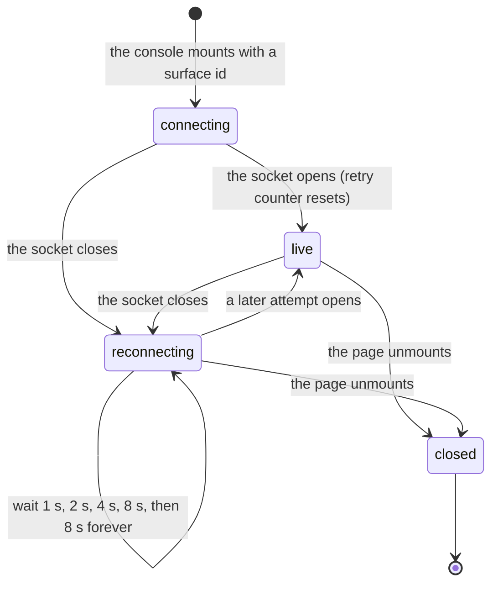

# Live updates and reconnection

## Summary

Four things move on their own while a student watches: pages that poll, a run console that holds a WebSocket, a sandbox that sends a heartbeat, and a CLI that pushes events from a laptop. This document owns every interval, cap and backoff in that set. Other documents state a number by linking here.

There is no screen called "live updates". A student sees a page that changes without being asked, a sentence saying it does ("This card checks back every two seconds, so there's no need to reload."), a Discord message that edits itself, and a small word in the corner of the console saying whether the connection is real.

"The ask, event by event" is replaced by the intervals themselves and by a diagram of the stream's states, because what this document describes is not an ask a student makes. Everything else is in the fixed order.

## The simple case

A student runs `cogworks run --benchmark audio-identification --live`. Their laptop opens a session, the team channel gets a progress bubble, and a teammate opens the console from it. Three clocks tick: the laptop sends a heartbeat every 2 seconds, the portal's per-surface Durable Object rebuilds and broadcasts a snapshot every 2 seconds, and the teammate's browser receives each one. The console's corner reads `Live`.

The teammate's wifi drops. The socket closes, the corner reads `Reconnecting…`, and the browser tries again after 1, 2, 4, then 8 seconds, and every 8 seconds after that. When it reconnects the Durable Object rebuilds the snapshot from the database and sends it as one frame carrying up to 250 events. Nothing is replayed step by step; the snapshot already holds the history.

When the run finishes the corner reads `Complete` whether or not the socket is still open.

## Every interval, in one table

| What | Interval | Where | Stops when |
| --- | --- | --- | --- |
| Run page | 2 s | `apps/portal/src/lib/queries.ts:71-80` | the run's status is terminal |
| Dashboard (and the run page's copy of it) | 2 s | `queries.ts:43-50` | the payload names no active run |
| Connections page | 4 s | `queries.ts:129-137` | at least one CLI device is linked; never otherwise |
| Setup page | 2.5 s | `queries.ts:280-310` | every step on the visible checklist is verified or checked off |
| Loading mark counter | 1 s, from 3 s | `apps/portal/src/components/Feedback.tsx:13-40` | the query settles |
| Run-surface Durable Object | 2 s | `apps/portal/worker/realtime/run-surface-hub.ts:8` | the snapshot is no longer `running` |
| Sandbox status heartbeat | 2.0 s | `apps/runner-modal/src/cogworks_runner/modal_app.py:1250` | the stage's `with` block exits |
| CLI `--live` heartbeat | 2.0 s | `python/cogbench/src/cogbench/cli.py:937` | the session closes |
| Stale-run sweep | every 5 min | `apps/portal/wrangler.jsonc:92`, `apps/portal/worker/execution/maintenance.ts:43-90` | never; it is a cron |
| Run-surface WebSocket | pushed | `apps/portal/src/lib/run-surface-stream.ts:28-72` | the page unmounts |

The run page and dashboard figure is one constant, `ACTIVE_RUN_POLL_MS`, at `packages/contracts/src/schema.ts:1521` with the comment "plan §4: 2-second active-run polling". Three places tell the student in words: the run page's live footer `Updates every 2 s.` for practice (`apps/portal/src/routes/RunDetailPage.tsx:274-280`), its sentence "Still running. This page checks back on its own, and what the run shows will appear here once it has been scored." (`:257-262`), and the dashboard card's "This card checks back every two seconds, so there's no need to reload." (`apps/portal/src/routes/DashboardPage.tsx:383-385`). An official run's footer reads `Hidden evaluation; logs are suppressed.` instead.

The connections page still polls every 4 seconds for as long as it is open with no device linked (B-28). TanStack Query stops polling an unmounted query.

## The stream, state by state

```mermaid
stateDiagram-v2
    [*] --> connecting : the console mounts with a surface id
    connecting --> live : the socket opens (retry counter resets)
    connecting --> reconnecting : the socket closes
    live --> reconnecting : the socket closes
    reconnecting --> reconnecting : wait 1 s, 2 s, 4 s, 8 s, then 8 s forever
    reconnecting --> live : a later attempt opens
    live --> closed : the page unmounts
    reconnecting --> closed : the page unmounts
    closed --> [*]
```

The socket is opened against `/api/run-surfaces/{id}/stream`, on the page's own scheme (`run-surface-stream.ts:10-14`). The route answers a request with no upgrade header with `426` and "Expected a WebSocket upgrade." (`apps/portal/worker/routes/run-surfaces.ts:62`), and a surface belonging to another team with a `404` on purpose (`run-surfaces.ts:19`).

Backoff is `Math.min(8_000, 500 * 2 ** Math.min(retry, 4))` (`run-surface-stream.ts:61`). There is no attempt limit and no give-up state.

A frame that fails the snapshot schema, names another surface, or is older than the snapshot on screen is dropped (`run-surface-stream.ts:47-55`, `packages/contracts/src/schema.ts:766`). A socket error closes the socket, which routes into the same reconnect path. The Durable Object answers a literal `ping` with `pong` without waking (`run-surface-hub.ts:13`).

## The loading mark names its own wait

Every page that waits on a query shows the same mark: a pulsing square and a label such as `Loading`, `Reading run record` or `Opening live bench`. Past three seconds it appends the whole seconds it has waited (`Feedback.tsx:13-40`, `useWaitedSeconds(3)`).

The three seconds are the point. A counter from the first frame turns every fast load into a stopwatch; one that appears only once a wait is unusual tells a student this one is. The seconds are hidden from assistive technology, because the mark is a live region and a number changing every second would interrupt once a second.

## What a reconnection replays

One frame. On `/connect` the Durable Object rebuilds the snapshot from the database, stores it, broadcasts it to every socket, and sends it to the new one (`run-surface-hub.ts:114-127`). It does not replay a sequence of events.

That is enough because the snapshot is not a delta. It carries the run's visible state and up to 250 events (`schema.ts:754`), so a browser that missed four minutes gets them back in one message. A console with no events yet reads "Waiting for the first event from the runner." (`apps/portal/src/components/RunConsole.tsx:476`).

### Retention, and what falls off

The portal keeps 250 stream events per surface. `MAX_SURFACE_EVENTS` is 250 (`apps/portal/worker/services/run-surfaces.ts:42`), the snapshot reads the newest 250 and reverses them into order (`:274-279`, `:306`), and each accepted event trims rows past the 250th (`:486-500`).

At one heartbeat every 2 seconds, 250 events is a little over eight minutes. A longer run's early events are gone from the console and from any reconnection, and nothing says so. The console's "Show all {n}" counts what survived.

Events are also filtered per stage: `runSurfaceCurrentEvents` keeps only the current run's events, so a hosted run does not show the local run's history (`schema.ts:787`).

### How the Durable Object decides to tick

On a publish it stores and broadcasts the snapshot, then sets an alarm 250 ms out when the run is running or 1 ms out when it is not, only when that is sooner than the alarm already set (`run-surface-hub.ts:87-97`). Each alarm rebuilds, broadcasts, edits the Discord message, and re-arms at 2 seconds while the status is `running`.

Three failures are handled by name (`run-surface-hub.ts:136-176`). A `404` means the surface is gone: the object deletes its alarm and storage and closes every socket with code 1000 and "Run surface no longer exists". A Discord rate limit re-arms at the retry-after Discord asked for. Anything else logs `run_surface_tick_failed` and re-arms in 2 seconds. A stored snapshot that no longer matches the schema is discarded and rebuilt rather than trusted (`:30-58`).

## The sandbox side

Each long stage runs inside a `StatusHeartbeat`, a daemon thread that re-emits the current phase every 2.0 seconds and joins with a 1 second timeout (`modal_app.py:1233-1260`). Elapsed milliseconds come from the reporter's own start (`:1219-1231`), so the elapsed time on a run comes from the sandbox, not the browser.

The Evaluate heartbeat carries `0/{n}` cases, and the only other count is `{n}/{n}` at the end (`modal_app.py:2246-2258`). The console's bar therefore sits empty for the whole of evaluation (B-22).

### When the callback cannot land

`_post_event` signs each event and tries three times with a 15 second timeout each, retrying 429, 500, 502, 503, 504 and transport failures, waiting `max(retry_after, 0.25 * 2**attempt)` seconds between (`modal_app.py:1117-1144`).

A terminal event is no longer lost when those three fail. The outcome is stored before it is sent (`:1210-1211`, `:2336-2356`), and the job function carries Modal retries, five attempts from 10 seconds doubling to 60, so a redelivery replays the stored event without scoring again (`:2155-2185`). The window is bounded by the stale-run sweep, which measures from the run's creation: a run that scores close to the sixty-minute mark can lose its result to the sweep during the first retry delay, and the comment says so (`:2168-2178`).

The sweep itself fails a run still `queued` after ten minutes and a run in any later phase after `RUN_STALE_AFTER_SECONDS` (3600, minimum 900), with category `provider` and detail "The execution provider stopped reporting progress." (`maintenance.ts:21-90`, `wrangler.jsonc:82`). The run page and the dashboard card say so while queued; see [`../portal/watching-a-run.md`](../portal/watching-a-run.md).

The portal rejects a signature more than 300 seconds from its clock with `401` and "Runner signature timestamp is invalid." (`apps/portal/worker/routes/runner-events.ts:24`, `:46`). It ignores an event for a run already terminal, except a late completion of a failed run, which is kept as evidence without changing the status (`runner-events.ts:71-72`, `:168-246`). A realtime publish failure is logged as `runner_surface_publish_failed` and does not fail the callback (`:365`).

## The CLI's live session

`cogworks run --live` opens a session before the benchmark starts and prints one of three lines to stderr: "live: one progress bubble opened in your team channel", "live: synced to CogPortal; a team maintainer can choose the Discord channel with /cog", or "live: synced to CogPortal; Discord delivery is temporarily unavailable" (`cli.py:1077-1084`).

A heartbeat thread queues the current phase every 2.0 seconds (`cli.py:936-941`). Events go through a queue capped at 32; a progress event that does not fit is dropped, and a terminal event that does not fit evicts the oldest queued one to make room (`cli.py:886-911`). Beside the queue the session keeps a 32-entry history that drops progress events first (`:889-893`).

On finish, `_finish` sets a 5 second deadline, closes the session, queues the terminal event, and posts the whole history as one batch (`cli.py:964-985`). The batch is sent with `retry=False` and a 5 second timeout (`python/cogbench/src/cogbench/client.py:116-128`). The single terminal post waits until the batch has been tried, so it does not race it (`cli.py:917-920`). If the batch fails, the student reads "cogworks: final live update was delayed: {reason}" and the session waits out the rest of the 5 seconds for the single event (`:979-982`).

The student sees at most one sender warning per session, "cogworks: live updates paused: {reason}" (`cli.py:924-928`). Ctrl+C sends a failure through the same path and prints `cogworks: interrupted` (`:1356-1360`). A kill that cannot be caught sends nothing, and nothing ages out the session (B-13).

### The batch applies partially

The server checks the batch shape first: 1 to 32 events, strictly increasing sequences, a terminal event last (`schema.ts:871-873` and the refinement after it). Then it applies events one at a time (`apps/portal/worker/routes/local-runs.ts:400-417`). An event can throw, with "Local run session not found." (`:84`) or "The completed report does not match this live run." (`:114`), and the events before it stay applied while the request returns an error. Nothing rolls back (B-27).

## What a student sees when it fails

One word, top right of the console, chosen by status before stream state (`RunConsole.tsx:93-100`):

| Word | When |
| --- | --- |
| `Complete` | the run succeeded |
| `Stopped` | the run failed |
| `Cancelled` | the status is `cancelled`, which nothing writes |
| `Live` | the run is going and the socket is open |
| `Snapshot` | the run is going and there is no stream path |
| `Reconnecting…` | the run is going and the socket is connecting, including the very first connection, or retrying |

Because status wins, a finished run reads `Complete` even when the socket died long ago. While a run is going the word is the only staleness signal, with no timestamp beside it.

The run page and the dashboard card have no such word. A failed refetch keeps the previous data with nothing marking it stale.

### `cancelled` is a dead status

`cancelled` is in the schema's status enum and `TERMINAL_STATUSES` (`schema.ts:35`, `:40`), and has copy on the console ("Stopped before completion", `RunConsole.tsx:87`), the dashboard ("Cancelled {time ago}.", `DashboardPage.tsx:457`) and the Discord message ("### Cancelled", `apps/portal/worker/services/discord-messages.ts:213`). Nothing writes it and there is no cancel endpoint (B-37).

## Modifiers

| Modifier | Set before the ask | Changed while it works |
| --- | --- | --- |
| Who you are | Every realtime route requires a team, and another team's surface is a `404`. Staff get the same intervals. | A session that expires mid-run makes the next poll fail. The open socket is not re-authenticated. |
| Where your team and repository stand | Decides which surfaces exist. A team with no runs has nothing streaming; the Activity reads "No shared runs yet." (`apps/portal/src/activity-main.tsx:341`). | No effect on any interval. |
| Which week's benchmark | No effect on intervals. Longer evaluations reach the 250-event cap sooner. | No effect. |
| Practice or leaderboard | Practice and official runs stream identically. Only the run page's footer sentence differs. | No effect. |
| Flags, options, and where you are typing | `--live` is what opens a CLI session; without it a local run sends nothing. The console behaves the same in the browser and in the Activity, against different API prefixes (`activity-main.tsx:256`). | `--live` cannot be turned on mid-run. |

## Cancel and interrupt

| Event | Before the work begins | While it works |
| --- | --- | --- |
| You stop it yourself | Nothing is streaming. | Ctrl+C during `--live` sends a terminal `failed` and the history batch within 5 seconds, then exits 130. In the browser there is no stop control. |
| You do something else mid-way | No effect. | Unmounting the console stops the reconnect timer and closes the socket (`run-surface-stream.ts:66-71`). Polling stops with the unmounted query. The surface is durable. |
| A teammate acts at the same time | No effect. | Two browsers on one surface are two sockets on one Durable Object. A teammate's new run gets its own surface, object and Discord message. |
| The network or the portal fails | No effect. | The console reads `Reconnecting…` and retries every 8 seconds forever. Polls keep their last good data. The CLI warns once and keeps running the benchmark. The sandbox retries three times, then relies on the stored outcome and Modal's retries. |
| The page or the process goes away | No effect. | A closed tab loses nothing. A killed sandbox stops heartbeating; the sweep fails the run within ten to fifteen minutes if queued, or about an hour after creation otherwise. A killed CLI leaves its session running (B-13). |
| The thing being measured changes | No effect. | No effect. A stream is about one surface, and a surface about one run at one commit. |
| The platform refuses or credit runs out | A run refused at admission never opens a surface. | No effect. Credit is not consulted while a run streams. |

## Interactions with other systems

**Who may do this.** Anyone on the team, through `requireTeam` and a team check on the surface (`run-surfaces.ts:17-19`). The CLI's event routes use `requireDevice`, and the session must belong to that device (`local-runs.ts:66-84`).

**The team owns it.** Every member watching sees the same frames. The starter's login is the only person named.

**Credit.** Watching uses no quota. See [credit and quota](credit-and-quota.md).

**What the portal claims.** A live frame carries phase names, step names, counts, and metrics only once scored. See [`../foundations/what-the-portal-claims.md`](../foundations/what-the-portal-claims.md).

**What the benchmark supplied.** The snapshot has no field for it. See [`what-the-benchmark-supplied.md`](what-the-benchmark-supplied.md).

**Live updates and reconnection.** This document.

**Discord.** The Durable Object edits one message in place on the same 2 second tick (`discord-messages.ts:264-301`). A `404` from Discord clears the stored message id and bumps a nonce generation so the next tick posts a fresh message (`:281-289`).

**Configuration.** Only `RUN_STALE_AFTER_SECONDS` is configurable (`wrangler.jsonc:82`, floor 900 at `maintenance.ts:36-41`). Every other number here is a constant in source.

## Edge cases

- **A batch of live events can be partly applied.** Above (B-27).
- **The history batch is the one CLI call besides setup check-offs that does not retry** (`client.py:116-128`).
- **A surface publish from the CLI path is fire and forget.** `publishSurfaceInBackground` uses `waitUntil` and logs `run_surface_publish_failed` (`local-runs.ts:171-187`). The CLI gets a 200 for an event the console may not see until the next tick.
- **A dropped progress event can still arrive in the batch,** because the queue and the history are separate (`cli.py:886-911`).
- **A late progress event for an earlier phase is discarded** (`local-runs.ts:100`), so a batch sent after the run finished drops most of what it carries. The history fills gaps; it does not rewind.
- **A local event with no elapsed time gets one from the server,** `occurredAt - createdAt` clamped at zero (`local-runs.ts:94`), so a fast laptop clock makes elapsed grow faster than wall time.
- **An event with no elapsed time renders an em dash** in the console (`RunConsole.tsx:115`), a character `docs/design/voice.md` bans.
- **The console scrolls itself only near the bottom.** Within 24 pixels; otherwise a "{n} new events" button appears. Scrolling honours `prefers-reduced-motion` (`RunConsole.tsx:226-234`, `:468-494`).
- **A terminal run folds its own history** to the last three events (`RunConsole.tsx:202`).
- **The stale sweep measures from creation, not from the last callback,** which the runner's own comment names as what bounds result recovery (`modal_app.py:2168-2178`).

## Open questions and verification

- The connections page polls every 4 seconds forever with no device linked (`queries.ts:134-135`). Carried to triage (B-28).
- The socket retries every 8 seconds with no limit. Cost over a night was not measured.
- The 250-event cap drops the start of a long run silently. Whether a 2026 run exceeds it was not measured.
- The batch applies partially (B-27).
- A killed `--live` session is never aged out (B-13).
- `cancelled` has copy on three surfaces and no writer (B-37).
- `Reconnecting…` is shown for the first connection (`run-surface-stream.ts:21`, `RunConsole.tsx:99`). Carried to triage.
- No reconnection, sweep, stored-outcome redelivery or Discord rate limit was observed on any build.
- Hosted beta (`4984730`) behaves the same for everything in this document: `queries.ts`, `run-surface-stream.ts`, `run-surface-hub.ts`, `run-surfaces.ts`, `maintenance.ts`, `runner-events.ts`, `local-runs.ts`, `modal_app.py` and `cli.py` are byte-identical between beta and the candidate. Only the console's markup differs; see [`../portal/watching-a-run.md`](../portal/watching-a-run.md).

Read against Cog\*Portal commit `2ff32fa`.
