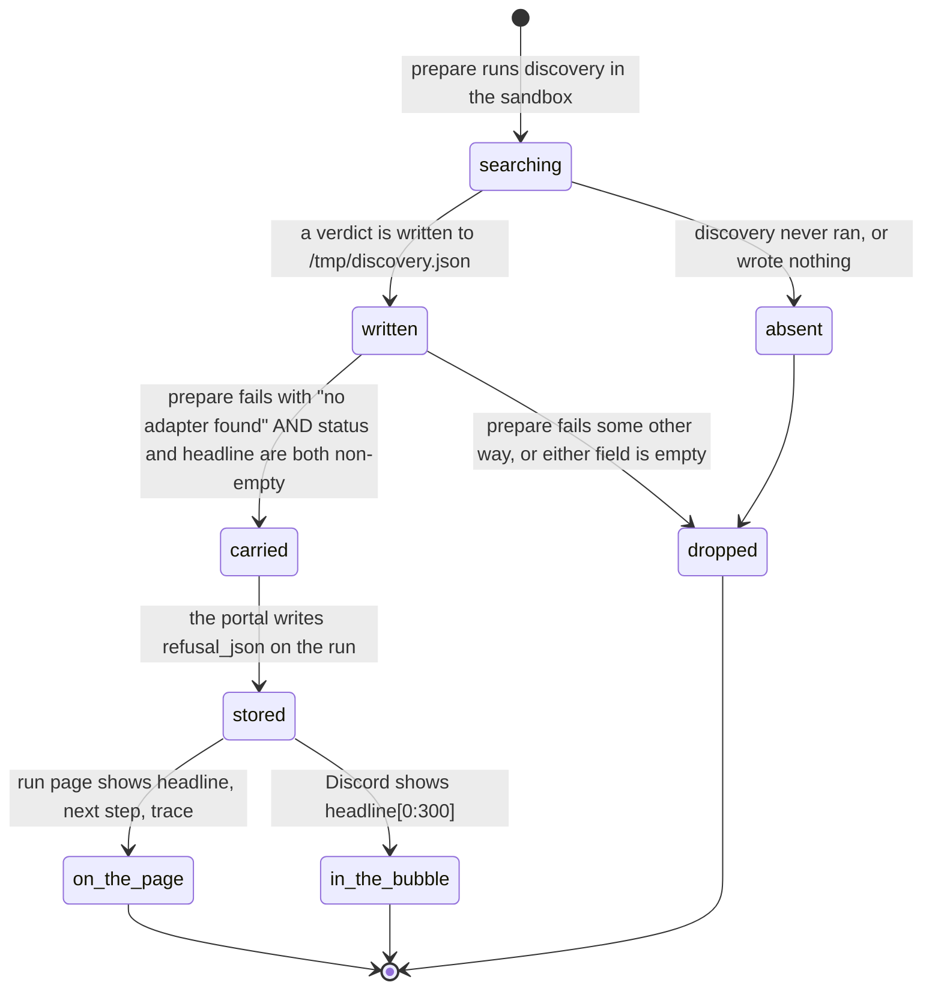

# Refusals across the four surfaces

## Summary

One refusal, four renderings. When the platform declines to give a number it writes a single object: a status, a headline, the one next step when it honestly knows one, and the steps the search got through. That object then reaches four surfaces that show four different amounts of it, and the differences are not proportional to the room each surface has. The terminal shows the most words. The run page shows the most evidence. The Discord bubble shows the first 300 characters of one sentence. The Discord bot, for almost every portal failure, shows one sentence that names nothing at all.

This document owns that comparison. [`foundations/what-the-portal-claims.md`](../foundations/what-the-portal-claims.md) owns the words themselves (*refusal*, *could not look*, *withheld*, *floor*, *supplied*) and this document does not restate them.

Two template sections are reshaped. A refusal is not something a student asks for, so "the ask, event by event" becomes "where a refusal comes from" and the Mermaid diagram traces the object rather than a screen. Everything else is in the fixed order.

## The simple case

A team pushes a Week 1 repository in which no chain of their functions identifies a clip. They press "Start run". Two minutes later four people are looking at four different accounts of the same event.

The student who ran `cogworks check` first read a headline naming the hand-off that failed, the list of steps that were wired, and a next step. The student watching the run page read the same headline under "WHAT THE BENCHMARK LOOKED FOR", and under it the trace with the shape each function took and the shape it returned. The team channel got a bubble reading "Stopped during the contract check" with one grey subtext line, cut at 300 characters. And a fourth teammate who typed `/cog` while the portal was briefly unreachable read "I couldn't reach Cog\*Portal just now. Nothing changed—try again in a moment.", which is the same sentence they would have got for a bad join code, a device that was never linked, or a Discord outage.

None of the four is wrong. They disagree about how much of a known answer a student is allowed to have.

## Where a refusal comes from

The structured refusal reaches a hosted run page from exactly one place: the `adapter_missing` branch of the prepare stage (`apps/runner-modal/src/cogworks_runner/modal_app.py:1186`). No other failure category carries one, and the protocol says so: "Absent for every other kind of failure. Their code raising is theirs to read, and the log is where it belongs." (`packages/contracts/src/protocol.ts:234`).

`_refusal_from` reads the sandbox's discovery file, takes the `verdict` key and nothing else, and caps every field (`modal_app.py:778`):

| Field | Cap | Where it is enforced again |
| --- | --- | --- |
| `status` | 40 characters | `protocol.ts:95` |
| `headline` | 600 characters | `protocol.ts:97` |
| `nextStep` | 600 characters, defaults to empty | `protocol.ts:100` |
| `trace` | 16 steps | `protocol.ts:102` |
| each step's `stage` | 60 characters | `protocol.ts:75` |
| each step's `function`, `received`, `returned` | 200 characters | `protocol.ts:76` |

It returns nothing at all unless both status and headline are non-empty (`modal_app.py:808`), so a verdict with a status and a blank headline is dropped silently and the run page shows only the failure card. The wire contract holds the same caps independently, and the comment there says why the capped one-line `detail` was not enough on its own: "Truncating that to 240 characters loses the part that helps" (`protocol.ts:232`). The portal stores the object verbatim as `refusal_json` on the failed run (`apps/portal/worker/routes/runner-events.ts:215`).

### Which statuses can reach a run page

The one branch that carries a refusal fires only when the prepare step raised "No adapter found in {name}, and no set of functions in it performed the benchmark's task." (`modal_app.py:514`), and prepare raises that only when nothing resolved. A submission discovery found and marked ready sets `resolved_by = "discovery"` and the step returns normally (`modal_app.py:490`).

`Submission.ready` is true for a straight pipeline only when the verdict is `scored`, and for a week that ends in a database only when both the store and the query bound (`python/cogbench/src/cogbench/resolve.py:142`). So a `scored` verdict never reaches a refusal card: by the time it exists, the run went on to score. What reaches the card is `not_wired`, `not_read`, `nothing_here`, `could_not_look`, and one more the sandbox writes itself. When discovery raises, the prepare script synthesizes a `not_read` verdict with the headline "The search for your code could not run: {error}" cut at 200 characters (`modal_app.py:493`), which is the only refusal on the platform whose headline is about the platform's own search rather than about the repository.

### What is not a refusal

Most failures are not refusals and carry none. A submission that raises produces a `student_runtime` failure with a traceback, and the traceback goes to the log rather than into a card. The distinction is deliberate: a refusal is what the platform writes when there was no code to score, and a traceback is what it hands back when there was. Every failure, refusal or not, renders a `FailureCard` first, with a stable code chip, a title, an explanation, the capped detail line in a monospace block, a "What to do" paragraph, and a copyable local reproduction (`apps/portal/src/components/FailureCard.tsx:28`). The refusal card is the second card, and only some failures have one.

## What each surface shows

| | Status | Headline | Next step | Trace | Notes | Coverage |
| --- | --- | --- | --- | --- | --- | --- |
| Terminal, `cogworks check` | Not shown | Full | Full | Stage and function only | Full | Not shown |
| Terminal, `cogworks check --json` | Full | Full | Full | Full, with shapes | Full | Full |
| Run page | Not shown | Full | Full | Up to 16 steps, with shapes | Not shown | Not shown |
| Discord bubble | Not shown | First 300 characters | Not shown | Not shown | Not shown | Not shown |
| Discord bot, portal error | Not shown | Replaced by one generic sentence | Not shown | Not shown | Not shown | Not shown |

### The terminal

`render_check` prints the verdict's headline, then every note, then the next step (`python/cogbench/src/cogbench/report.py:269`). Above it prints a "Wired up:" block listing each step's stage and its function name, padded to the widest label (`report.py:253`). Above that again sits the survey: which directory was searched and why, which files were read, which could not be read and for what reason, and a count of the team's own scripts that were skipped for reading files this machine does not have (`report.py:50`).

It does not print the shapes. `Verdict.render()` builds the fuller text with a "What ran:" section naming what each step received and returned (`python/cogbench/src/cogbench/verdict.py:258`), but grepping the repository for `.render()` finds it only in `python/cogbench/tests/test_verdict.py:87` and `:98`. No command calls it. The terminal is the most complete surface for the words and the least complete for the evidence, which is the reverse of what the run page does.

One suppression is worth knowing. `cogworks check` also prints a paragraph naming the graded run's packages this machine cannot import, and it is dropped when the verdict is already `could_not_look`, "because printing both makes the reader work out that two paragraphs are one fact" (`report.py:203`). The verdict wins, being specific about which modules.

### The fifth rendering: a local run that finds nothing

`cogworks run` never prints a verdict. When discovery finds nothing to score it raises before the benchmark loads, with a sentence that points at the other command: "Nothing in this repository could be scored yet. Run `cogworks check --benchmark {name}` to see what was found." (`python/cogbench/src/cogbench/cli.py:281`). The comment explains the redirection: the report already said why in full, and repeating it would print the same paragraphs twice.

So a student who only ever runs `cogworks run` sees a refusal reduced to a pointer. `cogworks report` is no better; `_print_report` prints the benchmark line, the metrics, the commit, and the diagnostics, and never a verdict (`cli.py:161`).

### The run page

`RunDetailPage` renders the `FailureCard` first and the `RefusalCard` under it, and the comment says why that order: the card says which phase stopped and the refusal says why (`apps/portal/src/routes/RunDetailPage.tsx:173`). The refusal panel is labelled "WHAT THE BENCHMARK LOOKED FOR" (`apps/portal/src/components/RefusalCard.tsx:27`). The next step renders only when it is non-empty, deliberately: "an invented next step is worse than an absent one" (`RefusalCard.tsx:34`).

The trace goes to `WiringTrace` with `incomplete` set, which changes the heading to "How far your code was followed" rather than "Your code, as it was run" (`apps/portal/src/components/WiringTrace.tsx:43`). That component truncates nothing; it draws every step it is given, with "took" and "returned" lines under each function name (`WiringTrace.tsx:58`). The truncation happened earlier, in the sandbox, at 16 steps and 200 characters a field. A repository whose search ran deeper than 16 steps loses the tail with no mark saying so.

So the run page is where the shapes live. A student reading the terminal has the words and not the evidence; a student reading the run page has both.

### The Discord bubble

One line: `lines.push("-# " + snapshot.refusalHeadline.slice(0, 300))` (`apps/portal/worker/services/discord-messages.ts:219`). Discord's `-# ` prefix renders it as subtext, the smallest type the message has. It is appended under the failure trace, and only when the run failed. The comment gives the reason it exists at all: "Contract check stopped" is true and says nothing a team can act on, and "Discord is where several teams read a result first" (`discord-messages.ts:214`).

The refusal line is not the first thing in that block. `failureTrace` puts the last completed step above it and then one line naming the failure, taken from a fixed table: `adapter_missing` maps to `run.failed.contract`, which reads "Contract check stopped" (`apps/portal/worker/services/discord-messages.ts:90`, `packages/discord-kit/src/steps.ts:147`). The refusal headline is appended under that pair, so the bubble reads as a stopped step first and a reason second.

The snapshot carries only the headline. `refusalHeadlineOf` parses the stored JSON and returns the headline string alone (`apps/portal/worker/services/run-surfaces.ts:376`), and the snapshot schema holds one nullable string capped at 600 (`packages/contracts/src/schema.ts:578`). The next step and the trace are not merely unrendered in Discord; they never leave the portal.

### Practice and official do not show the same amount

A third axis cuts across the four surfaces: the same refusal on an official run comes with less around it than on a practice run.

The portal stores the sandbox's sanitized log only for practice runs: `log: run.mode === "practice" ? event.sanitizedLog : null` (`apps/portal/worker/routes/runner-events.ts:194`). The run page renders the log block only for practice (`RunDetailPage.tsx:350`), collapsed to its last 14 lines with a "show all {n} lines" control (`apps/portal/src/components/LogView.tsx:11`). While an official run is still going, the pipeline panel says "Hidden evaluation; logs are suppressed." where a practice run says "Updates every 2 s." (`RunDetailPage.tsx:153`).

The refusal card is unaffected: it renders identically in both modes. So an official run that refused shows the reason and not the surrounding output, which is the intended shape. A student who wants the output runs the same commit as practice.

### The Discord bot, and the disagreement

This is the sharpest inconsistency in the product, and it is not about refusals at all. It is about every error.

When a slash command or a button throws, the bot replies with one string: "I couldn't reach Cog\*Portal just now. Nothing changed—try again in a moment." (`apps/discord-bot/src/index.ts:46`, repeated at `:138`). That sentence is the answer for a network fault, a 403 from the team gate, an expired Discord link, a malformed payload, and a bug in the command handler. The claim it makes is defensible: the bot only wraps `executeCommand`, so nothing was written. What it does not do is say which of those happened, or name anything the student could act on.

> This string contains an em dash ("changed—try"), which `docs/design/voice.md` rules out. It is quoted exactly as it appears. Flagged; carried to triage.

The Discord Activity, opened from the same message by the same student, does the opposite. `jsonRequest` parses the portal's own error body and rethrows the portal's message verbatim, falling back to "The live bench could not be reached." only when the body cannot be read (`apps/portal/src/activity-main.tsx:55`). A startup failure renders that message under the heading "The bench is still here." (`activity-main.tsx:218`); a failed action renders it on the console (`activity-main.tsx:284`).

Two surfaces, one Discord client, one portal, opposite policies. A student who presses a button in the bubble and gets the generic sentence, then opens the Activity and reads "Finish joining a team and connecting its repository first.", has learned that one of the two was withholding something.

The browser sits between them. `queryErrorState` groups the portal's 21 error codes by what a student can do about each, and its default branch keeps the server's own sentence as the first line, "because the server wrote a route-specific sentence; it is better than anything generic we could substitute" (`apps/portal/src/lib/query-error-state.ts:184`). That is the same argument the bot decided the other way.

### `could_not_look` on a hosted run

`could_not_look` is the refusal to judge when the platform manufactured the absence, and it is produced inside `not_wired` when coverage says a module was skipped for a reason of ours (`python/cogbench/src/cogbench/verdict.py:344`). A skip is ours when the import that failed names a package the graded run installs (`python/cogbench/src/cogbench/discover.py:315`).

It is reachable on a hosted run. Discovery runs inside the sandbox (`modal_app.py:479`), the verdict it produces goes to the discovery file, and `_refusal_from` carries whatever status it finds without inspecting it. But the condition that produces it is a package the course's own list says the image installs and the image does not have, which means the image did not build the way its manifest says. In normal operation it cannot fire, and no test exercises that path. **Unverified**: not observed against a running portal.

If it does fire, the student reads a sentence written for a laptop: "This check could not read {n} of your files, because this machine is missing packages they import. That is a limit of this check and not a problem with your repository: the graded run installs those packages and will read them." (`verdict.py:386`). On a hosted run page "this machine" is the graded run, and the promise in the last clause is about the run the student is looking at, which just failed. Carried to triage.

The status field makes this harder rather than easier to spot. `RefusalCard` renders the headline, the next step, and the trace, and never the status (`RefusalCard.tsx:25`). A student cannot tell `could_not_look` from `not_wired` on a run page except by reading the sentence closely.

## Modifiers

| Modifier | Set before the ask | Changed while it works |
| --- | --- | --- |
| Who you are | No effect. A refusal is not role-scoped and there is no privileged view that shows more of one. An instructor reading a team's failed run gets the same two cards a student does. | No effect. |
| Where your team and repository stand | Decides which refusal is produced, not how much of it is shown. A repository with no Python gets `nothing_here`; one whose modules will not import gets `not_read`; one whose functions never chained gets `not_wired`. All five renderings treat the four identically. | No effect. A run's refusal is about the commit it resolved at the start. |
| Which week's benchmark | No effect on the rendering. Week 3 is the only benchmark that withholds a number rather than refusing outright, and a withheld number is not a refusal object; it never reaches `refusal_json`. | No effect. |
| Practice or leaderboard | No effect on the rendering. A refused official run consumes no attempt, because `adapter_missing` is absent from `CONSUMING_FAILURES` (`apps/portal/worker/routes/runner-events.ts:25`), and the failure card says "No official attempt was consumed." (`FailureCard.tsx:71`). | No effect. |
| Flags, options, and where you are typing | The whole subject of this document. `cogworks check` prints words without shapes; `--json` prints everything including the coverage no other surface shows; the run page prints words and shapes; the bubble prints 300 characters; the bot prints one generic sentence. | No effect. Every surface reads the same stored object and none of them re-asks for more. |

## Cancel and interrupt

| Event | Before the work begins | While it works |
| --- | --- | --- |
| You stop it yourself | No refusal exists yet, so there is nothing to show or retract. | Ctrl+C in the terminal exits 130 before the verdict is printed, so a refusal that was computed is never read. A hosted run has no cancel button and no cancel endpoint, so this row has no browser case. |
| You do something else mid-way | No effect. | No effect. Navigating away from a run page and back re-fetches the stored refusal; it is durable on the run row, not held in the page. |
| A teammate acts at the same time | No effect. | No effect. A second run gets its own refusal on its own run row, and the Discord bubble is per surface, so a teammate's run does not overwrite this one's line. |
| The portal fails | No effect; no refusal has been written. | If the callback carrying the failed event never lands, no refusal is stored and the run sits in its last status. The sandbox retries three times (`modal_app.py:826`); after that the event is lost. See [`live-updates.md`](live-updates.md#when-the-callback-cannot-land). |
| The process goes away | No effect. | A killed sandbox produces a failure attributed by elapsed time and return code, not a refusal. Nothing reads text the student's own process could have written; the reasoning is written out at `modal_app.py:2054`. |
| The thing being measured changes | No effect. | No effect. A refusal is about the commit the run resolved when it started, and a branch that moves afterwards changes only what the next run measures. |
| Refused, or out of credit | An exhausted quota is refused before any container starts and produces no refusal object at all. The two kinds of "no" do not share a rendering. | Not reachable. Credit is checked before the work begins. |

## Interactions with other systems

**Who may do this.** Nobody produces a refusal on purpose. Anyone who can read a run can read its refusal, and every reader sees the same amount.

**The team owns it.** A refusal is about the team's repository at a commit. It names the team's own function names and says nothing about a person.

**Credit.** A failed execution uses no quota, including one refused because no adapter could be found. See [credit and quota](credit-and-quota.md).

**What the portal claims.** The vocabulary and its rules live in [`foundations/what-the-portal-claims.md`](../foundations/what-the-portal-claims.md). This document only compares how much of it each surface prints.

**What the benchmark supplied.** A refusal never says what the benchmark handed the code, because a run that refused produced no score to qualify. That disclosure and the gap in it are in [`what-the-benchmark-supplied.md`](what-the-benchmark-supplied.md).

**Live updates and reconnection.** The refusal arrives with the terminal `failed` event, so it appears the moment the run stops rather than streaming in. Every interval is in [`live-updates.md`](live-updates.md).

**Discord.** Two policies, described above. The bubble truncates a real refusal to 300 characters; the bot replaces every portal error with one sentence while the Activity shows the portal's own.

**Configuration.** None of the five renderings is configurable, and none of the caps is a setting.

## Edge cases

- **A screen reader is told the status and not the reason.** The run page's only live region for the outcome is `Run status: {label}` in a visually hidden div (`RunDetailPage.tsx:122`). When a polling refetch flips a run to `failed`, that announces one word. Both cards render into the page without a live region of their own, so the refusal is readable but not announced. **Unverified**: not tested with a screen reader.
- **A refusal with an empty headline is dropped entirely.** `_refusal_from` returns `None` unless both status and headline are non-empty (`modal_app.py:808`). The run then shows a failure card whose detail is the capped last error line, which is the exact outcome the refusal exists to prevent.
- **The prepare script writes the headline twice.** It puts the first 300 characters of the headline into the `RuntimeError` message as well (`modal_app.py:513`), and that becomes the failure card's `detail`. On a refused run a student reads the same sentence twice on one page, once cut at 300 characters and once whole.
- **A refusal survives a page reload and a rerun does not inherit it.** The object lives on the run row, so reloading shows the same two cards. Pressing "Run practice again on {branch}" starts a new run with its own row and its own refusal, and the old page keeps its own.
- **The bubble is edited in place, so the refusal line replaces the progress rail.** `syncRunSurfaceMessage` PATCHes the one message for the lifetime of a run (`apps/portal/worker/services/discord-messages.ts:246`). A teammate who scrolls back to where the run started finds the terminal message, never the sequence.
- **The Discord truncation is untested.** `apps/discord-bot/test/refusal-message.test.ts:16` asserts `headline.slice(0, 300).length <= 300` against a string the test defines itself, which is true of every string. Nothing pins the real cut.
- **The bubble's "Cancelled" branch is unreachable.** `runSurfaceMessage` falls through to "### Cancelled" for any terminal status that is not `succeeded` or `failed` (`discord-messages.ts:199`), and `cancelled` is never written to a run; see [`live-updates.md`](live-updates.md#cancelled-is-a-dead-status).
- **The failure card sends the student to the terminal for what is already on screen.** `adapter_missing` renders the title "Nothing here could be scored" and the action "Run the check below. It says how far your code was followed and what the next step was given, in your own function names." (`packages/contracts/src/failures.ts:76`). The refusal card directly beneath it is already showing exactly that, under the same heading.
- **A student cannot reach the coverage from any surface they are told to use.** The setup guide and the failure card both send a student to `cogworks check`, which prints the survey and the verdict but not the coverage record. Only `--json` has it, and nothing names that flag.
- **The refusal outlives the run page's own failure copy.** `FAILURE_CATALOG` copy is chosen by category, and every refusal shares one category (`adapter_missing`), so four different verdicts render under one title and one action. The variation a student needs is entirely in the second card.
- **Coverage travels with every verdict and is shown by none of them.** A `scored` run whose best module failed to import publishes a real number that is wrong for that repository, and only the coverage describes it (`verdict.py:149`). It reaches `cogworks check --json` and nowhere else.

## Open questions and verification

- The terminal never prints the wiring shapes. `Verdict.render()` and its "What ran:" block exist and are called only by tests (`verdict.py:258`). Either the run page is deliberately the only place the shapes appear, or `render()` is a call site that was dropped. Worth a decision; carried to triage.
- Whether a hosted run can produce `could_not_look` in practice was not established. The path exists and the triggering condition is a mis-built image. **Unverified.**
- The `could_not_look` sentence is written for a laptop and reads wrongly on a run page, where "this machine" is the graded run and "the graded run installs those packages and will read them" is a promise about the run that just failed. Worth treating as a bug if the path is reachable at all.
- The bot's generic sentence contains an em dash, against `docs/design/voice.md`. It is also the only reply for at least five distinct conditions, while the Activity shows the portal's own message for every one of them. The disagreement is the item; the em dash is a second, smaller one.
- Whether a student ever notices the bot and the Activity disagreeing was not observed. **Unverified.**
- Nothing announces a refusal to assistive technology when a run flips to failed under the 2 s poll. Whether that matters in practice was not tested. **Unverified.**
- The refusal `status` is carried on the wire, stored on the run, and rendered nowhere. Whether that is deliberate was not established.
- Whether a `wired_but_wrong` verdict can reach a refusal card was not settled. A week that ends in a database is ready on its store and query pair alone, so a bound pair with a wrong answer scores rather than refuses; an unbound pair with a `wired_but_wrong` verdict is a shape the source permits and no test covers. **Unverified.**
- A trace longer than 16 steps is cut with no mark on the page saying it was cut. Whether any 2026 repository produces one was not measured. **Unverified.**

Verified against Cog\*Portal commit `a0e8eac` for quota policy; unchanged descriptions retain their earlier references.
