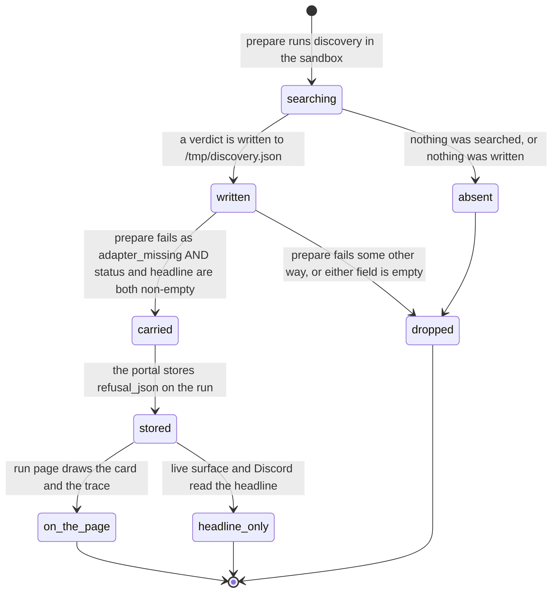

# Refusals across the four surfaces

## Summary

A refusal is written once and rendered differently on each surface. When the platform cannot find code to score, discovery writes one object: a status, a headline, a next step when it knows one, the steps it got through, notes, the files it could not read, and the lines the team's code raised on. That object reaches the terminal, the run page, the live run surface and Discord, and each shows a different part of it. The terminal shows the most words. The run page shows the most evidence. The live surface and the Discord bubble show the headline alone. The Discord bot, for every portal error, shows one sentence that names nothing.

This document owns that comparison. [`foundations/what-the-portal-claims.md`](../foundations/what-the-portal-claims.md) owns the words themselves (*refusal*, *could not look*, *withheld*, *floor*, *supplied*).

Two template sections are reshaped. A refusal is not something a student asks for, so "the ask, event by event" becomes "where a refusal comes from" and the diagram traces the object rather than a screen.

## The simple case

A team pushes a Week 1 repository in which no chain of their functions identifies a clip, and presses "Start practice run". A couple of minutes later four people read four accounts of it.

The student who ran `cogworks check` first read a "Wired up:" list of stages and function names, then the headline naming the hand-off that failed, any notes, the files that could not be read, and a next step. The student on the run page reads a red card that opens "Run failed", then "refused at {stage}", the headline in large serif type, a short table of what the run saw (`after`, `not read`, `raised`, `next`), and the trace with the shape each function took and returned. A teammate watching the live run surface reads the headline under "Stopped". The team channel's bubble reads "Stopped during the contract check", then "Contract check stopped", then the headline in small grey type, cut at 300 characters.

## Where a refusal comes from

The structured refusal reaches a run from one place: the prepare stage, when the prepare script fails with a message containing "no adapter found", "entry point" or "the search for your code could not finish" (`apps/runner-modal/src/cogworks_runner/modal_app.py:1579`). That failure is always `adapter_missing`, phase `contract_check`, `infrastructure` false. No other category carries a refusal, and the protocol says why: "Their code raising is theirs to read, and the log is where it belongs." (`packages/contracts/src/protocol.ts:332`).

```mermaid
stateDiagram-v2
    [*] --> searching : prepare runs discovery in the sandbox
    searching --> written : a verdict is written to /tmp/discovery.json
    searching --> absent : nothing was searched, or nothing was written
    written --> carried : prepare fails as adapter_missing AND status and headline are both non-empty
    written --> dropped : prepare fails some other way, or either field is empty
    absent --> dropped
    carried --> stored : the portal stores refusal_json on the run
    stored --> on_the_page : run page draws the card and the trace
    stored --> headline_only : live surface and Discord read the headline
    dropped --> [*]
    on_the_page --> [*]
    headline_only --> [*]
```

`_refusal_from` reads the discovery file's `verdict` key and caps every field to what the protocol accepts (`modal_app.py:1042`; `protocol.ts:119`):

| Field | Cap |
| --- | --- |
| `status` | 40 characters |
| `headline`, `nextStep` | 600 characters each |
| `trace` | 16 steps; `stage` 60 characters, `function`, `received`, `returned` 200 each |
| `notes` | 8 notes of 600 characters |
| `skipped` | 32 files; module 200, reason 300, owner 20 |
| `errors` | 16 entries; file 200, function 200, message 200 |

It returns nothing unless both status and headline are non-empty (`modal_app.py:1099`), and a malformed file is caught so it cannot turn a failed installation into a controller error (`modal_app.py:1567`). The portal stores the object as `refusal_json` on the failed run (`apps/portal/worker/routes/runner-events.ts:256`).

### Which statuses reach a run page

A submission discovery found and marked ready goes on to score, so `scored` never reaches a refusal card. What reaches it is `not_wired`, `not_read`, `nothing_here` and `could_not_look`, plus one the sandbox writes itself: when discovery raises, the prepare script records `not_read` with the headline "The search for your code could not finish: {error}", the error cut at 200 characters (`modal_app.py:721`). Any `not_read` without a next step gets "Run cogworks check --benchmark {id} locally to inspect the search." (`modal_app.py:731`). The headline stays neutral about fault because the search ran after the team's installation and can import their modules.

### What is not a refusal

Most failures carry none. A submission that raises is `student_runtime`, and the exception goes to the failure detail and the log. A Week 3 withheld number is not a refusal either; the run succeeds and the reason is its first note (see [`../sandbox/scoring-and-refusals.md`](../sandbox/scoring-and-refusals.md#week-3-withholds-the-overall)).

## What each surface shows

| | Status | Headline | Next step | Trace | Notes | Unread files and raised lines |
| --- | --- | --- | --- | --- | --- | --- |
| `cogworks check` | Not shown | Full | Full | Stage and function only | Full | Full |
| `cogworks check --json` | Full | Full | Full | Full, with shapes | Full | Full |
| Run page | Not shown | Full | Full, plus a fixed command | Up to 16 steps, with shapes | Not shown | Full, with owner when not theirs |
| Live run surface and Activity | Not shown | Full | Not shown | Not shown | Not shown | Not shown |
| Discord bubble | Not shown | First 300 characters | Not shown | Not shown | Not shown | Not shown |
| Discord bot, portal error | Not shown | Replaced by one generic sentence | Not shown | Not shown | Not shown | Not shown |

Status, `f03ebfa` (2026-10-03): two rows change in source. The run page's Notes cell becomes "First note open, the rest folded" (`apps/portal/src/components/RefusalCard.tsx:100-126`, `:177`; [B-61](../bug-triage.md#b-61-a-refusals-notes-reach-the-browser-and-are-never-drawn)). The Discord bot's portal-error row shows the portal's own sentence when the portal refused, as described under [the Discord bot](#the-discord-bot-and-the-disagreement). The table above is `2ff32fa`.

### The terminal

`render_check` prints a "Wired up:" block of stage and function names, then the headline, every note, the verdict's `problems()` lines ("Could not read:" and "Raised while trying:"), then the next step (`python/cogbench/src/cogbench/report.py:330`, `:352`). Above it sits the survey of what was searched. It does not print shapes: `Verdict.render()` builds a "What ran:" section with them and no command calls it (`python/cogbench/src/cogbench/verdict.py:333`).

The paragraph naming graded packages this machine cannot import is dropped when the verdict is already `could_not_look`, because "printing both makes the reader work out" that two paragraphs are one fact (`report.py:244`).

`cogworks run` never prints a verdict. When there is nothing to score it stops with "Nothing in this repository could be scored yet. Run `cogworks check --benchmark {name}` to see what was found." (`python/cogbench/src/cogbench/cli.py:459`). `cogworks report` prints no verdict either.

### The run page

The failure card renders the refusal in place of its own title and detail (`apps/portal/src/components/FailureCard.tsx:85`). The catalog copy for `adapter_missing` ("Nothing here could be scored", `packages/contracts/src/failures.ts:63`) and the runner's one-line detail do not appear, so the headline is on the page once. The code chip and mode sit at the right of the "refused at" line in mono.

The card's rows (`apps/portal/src/components/RefusalCard.tsx`):

- **refused at {stage}.** The stage read out of the headline's "the {stage} step", else the phase (`RefusalCard.tsx:116`).
- **The headline**, in serif, as the card's title.
- **after.** "{function} returned {shape}" for the last step that returned something.
- **not read.** "1 module, which may hold what the run looked for" or "{n} modules, any of which may hold what the run looked for", then each module and its reason, with "(ours)" or "(environment)" after the reason when the skip is not the team's fault (`RefusalCard.tsx:155`, `:176`). For a `FileNotFoundError`, and for a `RuntimeError` mentioning a microphone or recording, it adds one fix line, "open the file inside the function, not at import" or "move the microphone call out of module scope".
- **raised.** `{file}:{line}` and the message, for each line the team's code raised on.
- **next.** The next step when there is one, then always `cogworks check --benchmark {id} --update-setup` (`RefusalCard.tsx:226`).
- **The trace**, under "How far your code was followed", with "took" and "returned" lines (`apps/portal/src/components/WiringTrace.tsx:42`). The cut at 16 steps happened in the sandbox and nothing on the page says so.

The page renders the refusal identically for practice and official runs, and keeps the log for practice only. The failure card's margin note reads "A run that fails doesn't count against your team's practice runs." or "A failed official attempt doesn't use up one of your team's attempts." (`apps/portal/src/routes/RunDetailPage.tsx:196`).

When a refusal is absent (a dropped verdict, or a failure whose message matched none of the three phrases), the card falls back to the catalog: "Nothing here could be scored", the runner's detail line open, "Run the check below. It says how far your code was followed and what the next step was given, in your own function names." and `cogworks check --benchmark {benchmark}` (`failures.ts:63`). Observed locally on fixture data, `pairs/b-run-vision-failed-desk.png`.

### The live run surface and the Activity

The console prints the refusal headline under the failure when there is one, else the failure's event copy, and offers "See why it failed", which opens the run page (`apps/portal/src/components/RunConsole.tsx:187`). The snapshot that feeds it, and Discord, carries the headline alone, capped at 600 (`apps/portal/worker/services/run-surfaces.ts:447`).

### The Discord bubble

The bubble is edited in place for the life of a run. On failure it reads "Stopped during {phase}", the step trail ending in the failure's event copy (`adapter_missing` maps to "Contract check stopped", `apps/portal/worker/services/discord-messages.ts:90`), then the headline as subtext: `"-# " + plain(snapshot.refusalHeadline.slice(0, 300))` (`discord-messages.ts:233`). `plain` turns line breaks into spaces and escapes Markdown and `<`, because the headline is built from the team's own function names and lands in a channel the whole team reads (`discord-messages.ts:134`). The cut is by character and can stop mid-word.

### The Discord bot, and the disagreement

When a slash command or button throws, the bot replies "I couldn't reach Cog\*Portal just now. Nothing changed. Try again in a moment." (`apps/discord-bot/src/index.ts:46`, `:138`). That is the answer for a network fault, a team-gate refusal, an expired link and a handler bug. The claim it makes holds, since the bot only wraps the command, but it names nothing the student could act on. [B-19](../bug-triage.md).

Status, `f03ebfa` (2026-10-03): the bot no longer collapses a refusal. The portal's RPC entrypoint lets an `ApiHttpError` through and replaces anything else with "Cog\*Portal could not complete that request." (`apps/portal/worker/rpc.ts:35-48`). The bot shows a refusal's message as written, with Markdown escaped and mentions off, plus "Back to Cog" and an "Open Cog\*Portal" link (`apps/discord-bot/src/failure.ts:25-48`). A failure it cannot explain reads "I couldn't confirm that with Cog\*Portal. It may still have gone through, so check the run there before pressing it again." after a confirm (the channel bind says "check the team bench" instead), and "I couldn't reach Cog\*Portal just now. Try again in a moment." on a read. "Nothing changed" is gone from the bot. Checked by tests and a miniflare probe, not in a Discord client ([B-19](../bug-triage.md#b-19-the-discord-bot-replaces-every-actionable-portal-error-with-one-generic-sentence)). The Activity and the bot now decide the question the same way.

The Activity, opened from the same message, rethrows the portal's own error message and falls back to "The live bench could not be reached." only when the body cannot be read (`apps/portal/src/activity-main.tsx:54`). A startup failure renders under "The bench is still here." (`activity-main.tsx:277`). The browser keeps the server's sentence too, because "The server wrote a route-specific sentence; it is better than anything generic" (`apps/portal/src/lib/query-error-state.ts:181`). The bot decided the same question the other way.

### Could not look on a hosted run

`could_not_look` is produced inside `not_wired` when any skipped module was skipped for a reason that is not the team's (`verdict.py:423`). A missing dependency is now always classified `ours`, because the search cannot see the graded image's full package set (`python/cogbench/src/cogbench/discover.py:281`), and both `ours` and `environment` skips block a verdict (`verdict.py:202`). So on a hosted run, a module importing a package that neither the image nor the team's `requirements.txt` installed produces `could_not_look` when nothing else binds.

The headline names a count and no cause: "This check could not read {one of your files | n of your files}, so it could not finish looking for the code this task needs." (`verdict.py:457`). The run page's "not read" row then lists each module with its reason and "(ours)". `RefusalCard` never shows the status, so `could_not_look` and `not_wired` are told apart by the sentence alone.

## Modifiers

| Modifier | Set before the ask | Changed while it works |
| --- | --- | --- |
| Who you are | No effect. An instructor reading a team's failed run gets the same card. | No effect. |
| Where your team and repository stand | Decides which refusal is produced, not how much is shown. No Python gives `nothing_here`; modules that will not import give `not_read`; functions that never chain give `not_wired`; an unread file gives `could_not_look`. | No effect. A refusal is about the commit the run resolved. |
| Which week's benchmark | Decides the stage names and the trace. Week 3 can also withhold a number on a run that succeeds, which is not a refusal object and never reaches `refusal_json`. | No effect. |
| Practice or leaderboard | No effect on the refusal. An official run shows no log around it. A failed execution uses no quota in either mode. | No effect. |
| Flags, options, and where you are typing | The subject of this document: see the table above. | No effect. Every surface reads the same stored object. |

## Cancel and interrupt

| Event | Before the work begins | While it works |
| --- | --- | --- |
| You stop it yourself | No refusal exists yet. | Ctrl+C in the terminal exits 130 before the verdict is printed. A hosted run has no cancel control. |
| You do something else mid-way | No effect. | No effect. The refusal is stored on the run row and re-read on return. |
| A teammate acts at the same time | No effect. | No effect. A second run gets its own row and its own refusal. |
| The portal fails | No effect. | If the `failed` event never lands, nothing is stored. The runner keeps the outcome and redelivers it on its function retries (`modal_app.py:2179`); after the portal's one-hour stale sweep the run is failed as a provider failure without the refusal. |
| The process goes away | No effect. | A killed sandbox produces a failure attributed by elapsed time and return code, not a refusal. |
| The thing being measured changes | No effect. | No effect. |
| Refused, or out of credit | An exhausted quota is refused before any container starts and produces no refusal object. The two kinds of "no" share no rendering. | Not reachable. |

## Interactions with other systems

**Who may do this.** Nobody produces a refusal on purpose. Anyone who can read a run reads all of it.

**The team owns it.** It names the team's own functions and files and nothing about a person.

**Credit.** A refused execution uses no quota. See [credit and quota](credit-and-quota.md).

**What the portal claims.** Defined in [`foundations/what-the-portal-claims.md`](../foundations/what-the-portal-claims.md). "(ours)" on an unread module is a claim of fault; see the open questions.

**What the benchmark supplied.** A refusal says nothing about supplied resources, because no score exists to qualify. See [`what-the-benchmark-supplied.md`](what-the-benchmark-supplied.md).

**Live updates and reconnection.** The refusal arrives with the terminal `failed` event. See [`live-updates.md`](live-updates.md).

**Discord.** The bubble carries 300 characters of the headline; the bot replaces every portal error with one sentence while the Activity shows the portal's own. Status, `f03ebfa` (2026-10-03): the bot shows a portal refusal as written too.

**Configuration.** None of the renderings or caps is a setting.

## Edge cases

- **The notes travel and are not drawn.** `notes` is what the search learned that the headline does not say. The runner forwards it, the portal stores and serves it, and `RefusalCard` declares the field and never renders it (`RefusalCard.tsx:25`). Only the terminal prints it. Status, `f03ebfa` (2026-10-03): the card draws the first note under the headline and folds the rest behind "{n} more notes from the search" (`RefusalCard.tsx:100-126`). Seen locally on synthetic data ([B-61](../bug-triage.md#b-61-a-refusals-notes-reach-the-browser-and-are-never-drawn)).
- **A screen reader hears the status, not the reason.** The only live region is "Run status: {label}" (`RunDetailPage.tsx:184`), so a run that flips to failed under the 2-second poll announces one word. **Unverified** with a screen reader.
- **A refusal with an empty headline is dropped.** The card then shows the catalog copy and the runner's detail line, which begins "No adapter found in {repository}, and no set of functions in it performed the benchmark's task." (`modal_app.py:747`).
- **Two next steps can say the same thing.** A `not_read` refusal with the default next step shows "Run cogworks check --benchmark {id} locally to inspect the search." directly above `cogworks check --benchmark {id} --update-setup`.
- **The Discord cut is untested.** `apps/discord-bot/test/refusal-message.test.ts:16` asserts `headline.slice(0, 300).length <= 300` on a string it defines itself. The real message test checks escaping, not the cut (`apps/portal/test/run-surfaces.test.ts:428`).
- **Coverage is shown only through refusals.** A `scored` run whose best module failed to import publishes a number and no surface but `check --json` says which files were not read (`verdict.py:170`).

## Open questions and verification

- The refusal's notes reach the browser and are dropped by the card (`RefusalCard.tsx:25`). Carried to triage. Status, `f03ebfa` (2026-10-03): drawn; see the edge case above.
- The terminal never prints the wiring shapes; `Verdict.render()` is called by nothing (`verdict.py:333`). Either the run page is deliberately the only place for them or a call site was dropped.
- On a hosted run, a module skipped for a package the team never declared is labeled "(ours)" (`discover.py:303`, `RefusalCard.tsx:176`). The classifier's reason is that a local search cannot see the graded image; inside the graded image that reason does not hold. Whether the hosted card should say "(ours)" is a product call.
- The bot's generic sentence is the only reply for at least five conditions, while the Activity shows the portal's message for each. [B-19](../bug-triage.md). Its em dash is gone. Status, `f03ebfa` (2026-10-03): fixed in source; the bot shows the portal's refusal. Not seen in a Discord client.
- Nothing announces a refusal to assistive technology when a run flips to failed. **Unverified.**
- The refusal `status` is carried, stored and rendered nowhere.
- Whether any 2026 repository produces a trace longer than 16 steps was not measured.
- **Hosted beta (`4984730`) differs:** beta's failure card shows the headline as its reason line, then under "Show details" the code, the catalog explanation, the runner's 240-character detail (which carries the start of the headline after the "No adapter found" sentence), the refusal card with the headline again, and the catalog command (beta `apps/portal/src/components/FailureCard.tsx:30`, `:55`, `:62`, `:68`). `2ff32fa` shows the headline once and drops the detail and catalog copy when a refusal exists (`FailureCard.tsx:70`, `:85`). The runner, protocol and Discord paths are identical.
- No item here has been observed against a hosted refusal. `CROSS-01` and `CROSS-02` need a repository that produces one.

Read against Cog\*Portal commit `2ff32fa`.
