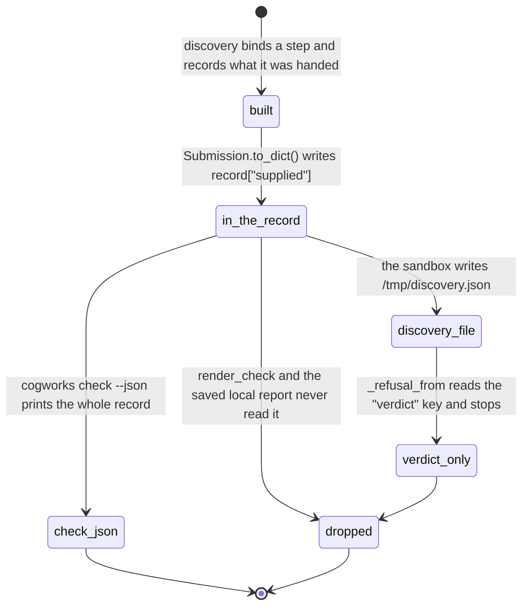

# What the benchmark supplied

> **In flight.** The removal of instructor-supplied adapters landed during this drafting pass, as uncommitted work on top of `f74e087`. Affected: `benchmarks/adapters/` (all four `submission.py` files and its `README.md` now show as deleted), `apps/runner-modal/src/cogworks_runner/modal_app.py` (no `STAGED_ADAPTER_DIR`, no `/opt/adapters` image copies, no staging block, no `instructor_adapter:` branch), and the `benchmarks/week1` submodule, whose `adapters.py` was edited in the same pass. `python/cogbench/src/cogbench/resolve.py` has also moved since `f74e087`; `_supplied_by` now begins at line 349 and the comment quoted below sits at line 262, with the logic unchanged. Every citation in this document is to `f74e087` unless it says otherwise. A verifier must re-read all four paths rather than trust this prose.

## Summary

Some of what a run scores did not come out of the team's repository. The benchmark hands their functions the name of each item, a GloVe table, a folder pointed at its own files, an empty database of the right shape. A score computed with a resource the platform provided is a different claim from one computed without it, and the platform builds a phrase saying exactly which.

There are three kinds of supplied thing and the platform treats them differently. The first is per-step and is disclosed nowhere a student is told to look. The second names glue code somebody else wrote, and reaches the run page as one of the small notes rather than as the headline its author intended. The third is the image itself, which is the same for every team and is disclosed to nobody.

[`foundations/what-the-portal-claims.md`](../foundations/what-the-portal-claims.md) owns the word *supplied*. This document owns where it goes.

## The simple case

A Week 3 team's `embed` function takes a caption and a GloVe table. They never load GloVe; the benchmark passes it. Discovery records that, and `cogworks check --benchmark language-search --json` will show `{"step": "embedder.embed", "supplied": "glove"}` in its discovery record.

The same team starts a hosted run. It scores 0.74. The run page shows the number, the finding, the metrics, and the wiring trace. It does not say GloVe was supplied, because nothing on the wire between the sandbox and the portal carries that sentence. A team that loaded its own vectors and a team that was handed them get identical pages.

## The first disclosure: what a step was handed

`_supplied_by` builds one row per thing, read off the bindings rather than accumulated as the search runs, "so it cannot drift from what was actually called: the plan on each step IS the argument list, and this is that list in words" (`python/cogbench/src/cogbench/resolve.py:358`).

`_given_to` turns one bound step into rows (`resolve.py:395`):

| What the binding holds | The phrase recorded |
| --- | --- |
| an `identity` slot | "the name of each item" |
| an `extra:` slot | the slot's own name, for example `glove` |
| each keyword argument | the keyword's name |
| a tuning value | its `repr()` |
| a `pooled` entry | the benchmark's own object that filled this step |
| a `value` entry | the value's recorded description |
| a `folder` entry | "their {name}/ was pointed at the benchmark's files" |

The pooled case carries the strongest comment in the file: that step "was not one of their functions at all", it was one of the benchmark's own objects offered because the stage named it and it turned out to be callable, and "that is the largest thing a run can supply, so it is the one thing that must never be missing from this list" (`resolve.py:409`).

The rows cover the whole search, not just the main line: `_supplied_by` walks `submission.chain` and then every chain under `submission.branches` (`resolve.py:367`). Week 3's role is made of branches with an empty chain, so without that second loop its rows would all be missing.

The tests pin the phrasing rather than the mechanism. A side input records as `{"step": "embedder.embed", "supplied": "glove"}` (`python/cogbench/tests/test_resolve.py:489`), and a pooled step as `"weights_model (_Encoder) handed to the chain as this step"` (`test_resolve.py:769`), which is the one row that names an object the team never wrote.

Two more sources sit above the per-step rows. A `fit` stage emits everything `_given_to` finds plus "computed once as {name}" (`resolve.py:380`), and the comment records the measured defect that ordering fixed: only the "computed once" line used to be recorded, "so the GloVe vectors the benchmark handed that call never appeared under 'supplied' and the run page understated what it had given the student's code" (`resolve.py:376`). And a week whose task ends in a database adds two rows to the query step: the team's own state attribute by name, and "an id-to-name table over the enrolled songs", described as "the one value here the benchmark invented rather than read off their code" (`resolve.py:384`).

## Where the phrase goes, and where it stops

`Submission.to_dict()` writes the rows under `supplied` when there are any, with this comment above the line:

> "Everything the benchmark handed their code that did not come out of their code. A run page shows this under "supplied", because a score computed with a resource we provided is a different claim from one computed without it." (`resolve.py:271`)

The run page does not show it. Searching `apps/portal/src` and `packages/contracts/src` for `supplied` returns nothing. There is no field for it on the result schema (`packages/contracts/src/protocol.ts:106`), so it could not arrive even if a page wanted to render it.

The reason is that `Submission.to_dict()` has exactly two consumers.

The first is the CLI, which puts the whole record under `checks["discovery"]` (`python/cogbench/src/cogbench/cli.py:354`). That dictionary is printed in full only under `--json` (`cli.py:366`). The human-readable path is `render_check`, which prints the benchmark, the interpreter, the repository, the survey, the gap note, a "Wired up:" block, and the verdict, and never the supplied rows (`python/cogbench/src/cogbench/report.py:155`). The saved local report has no field for them either; `_print_report` prints the benchmark line, the metrics, the commit, and the diagnostics (`cli.py:161`).

The second is the sandbox. The prepare script writes the record to `/tmp/discovery.json` (`apps/runner-modal/src/cogworks_runner/modal_app.py:504`). Two functions read from the sandbox afterwards, and neither reads this. `_refusal_from` opens that file and takes the `verdict` key alone (`modal_app.py:790`). `_collect_wiring` opens a different file, `/tmp/cog-wiring.json`, and keeps four fields per step and at most sixteen steps (`modal_app.py:1652`), where that file was written from the verdict's trace plus the store and query pair (`modal_app.py:641`).

So the phrase is built on every hosted run, written to disk inside the sandbox, and then read past. The only surface where a human can read it is `cogworks check --benchmark {id} --json`, and nothing in the product names that flag.

> This is stricter than [`foundations/what-the-portal-claims.md`](../foundations/what-the-portal-claims.md#supplied-by-the-benchmark) currently states. That document says the local report shows it. The local report does not; only `check --json` does. Carried to triage as a consistency fix in both places.

A hosted score computed with benchmark-supplied GloVe vectors is therefore presented identically to one computed without them.

## The second disclosure: glue code somebody else wrote

This one does reach the run page, and it says something stronger.

Week 1's adapter wrapper reads a `PROVENANCE` dictionary off the submission object, and off the module that defined it when the object does not carry one, because "provenance may live at module scope while the factory returns an instance" (`benchmarks/week1/audio_identification_benchmark/adapters.py:90` in the working tree; line 92 at the submodule's pinned commit `a39e56b`, where the code is byte-identical and only the comment differs).

The driver then checks it. When the dictionary's `source` is anything other than the exact string `"student"`, it inserts a sentence at position 0 of the mapping log:

> "scored through an instructor-supplied adapter; we supplied: {items}" (`benchmarks/week1/audio_identification_benchmark/drivers.py:286`)

where `{items}` is the `we_supplied` list joined with `"; "`, falling back to the literal `"wiring only"` when that list is empty. The comment says why position 0: it "rides the same channel as the mapping log so it reaches the run page without a new field", and is "stated first, because 'we wrote some of this' outranks any note about how a name was resolved" (`drivers.py:280`).

### The scorer demotes it

Position 0 of the mapping log is not position 0 of the run page.

The mapping log rides on the first case output, capped at twelve entries (`drivers.py:291`), which the provenance line survives by being first. The scorer then collects those into `adapter_notes` and appends them to the diagnostics list *after* its own sentences: `diagnostics.extend(_diagnostics(...))` at `benchmarks/week1/audio_identification_benchmark/metrics.py:294`, then `diagnostics.extend(adapter_notes)` at `:307`.

`_diagnostics` always returns at least one line. Its last statement is unconditional: "Outcome split over {n} scored queries: {counts}." (`metrics.py:449`). So the provenance sentence can never be `diagnostics[0]`.

The run page renders `diagnostics[0]` as the large `Finding` sentence and everything after it as small bullets beneath (`apps/portal/src/routes/RunDetailPage.tsx:223`). The disclosure its author placed first therefore renders last, in the smallest type on the panel, under a headline about outcome splits. Carried to triage.

The cap makes it worse in the tail. The sandbox truncates diagnostics to the first 32 entries of 240 characters each (`modal_app.py:2334`, matching `protocol.ts:111`). Because the provenance line is appended last, it is the first thing dropped if a run ever produces 32 diagnostics. Week 1's scorer emits roughly ten and the mapping log up to twelve, so this is a latent risk rather than an observed loss. **Unverified.**

### What the source says now

As of `f74e087` four instructor adapters existed under `benchmarks/adapters/`, all three sandbox images copied that directory to `/opt/adapters` (`modal_app.py:148`, `:196`, `:248`), and the prepare script staged one into the checkout only when the repository had no `submission.py` or `benchmark_adapter.py` of its own (`modal_app.py:385`). Each adapter carried a module-scope `PROVENANCE` whose `source` was always the string `"instructor-supplied"` (`benchmarks/adapters/README.md:36`), and the run recorded `resolved_by = "instructor_adapter:{slug}"` (`modal_app.py:449`).

In the working tree all of that is gone. The reading and the sentence survive in the Week 1 submodule; the thing that used to trigger them does not.

The trigger is a module-scope `PROVENANCE` dictionary whose `source` is not exactly `"student"`. Nothing in the repository now writes one. A dictionary with no `source` key at all satisfies the condition, because the check is `provenance.get("source") != "student"` (`drivers.py:279`). So the line is now reachable only if a team writes a `PROVENANCE` dict into their own `submission.py`, which nothing documents and nothing asks for.

Stated plainly: as the source reads now, this is dead copy with no code path that can produce it. It should either be removed with the adapters or given a documented meaning for a student-written declaration. Carried to triage.

## The third kind: what the image supplies and never discloses

Every hosted run executes inside an image that provides a great deal the repository did not, and none of it is disclosed per run. The argument for that silence is that it is identical for every team, so it cannot change how one team's number compares to another's.

- **The package list.** Each week's graded stack is data in `python/cogbench/src/cogbench/environment.py`, applied through `requirement_strings` for the image interpreter and `venv_install_command` for the pinned CPython 3.8.20 venv that runs Week 1 and Week 3 student code (`environment.py:230`). The lists exist because a submission importing a package the course told students to install used to fail at import (`modal_app.py:137`).
- **The FaceNet checkpoint.** Downloaded at image build under a sha256 lock, and the build fails on a mismatch: "FaceNet checkpoint does not match the reviewed lock." (`apps/runner-modal/src/cogworks_runner/image_bake.py:34`).
- **The Week 3 artifacts.** GloVe and COCO baked in at build time "so the network-blocked evaluation sandbox has them", with the build refusing if the GloVe cache was not produced (`image_bake.py:38`).
- **Two environment variables that change answers.** `PYTHONHASHSEED=0` on all three images, because one 2026 team builds its IDF table by iterating a set and its text retrieval score moved between 0.8188 and 0.8335 across three seeds (`modal_app.py:161`). `MPLBACKEND=Agg`, because a plot that wants a window blocks until the sandbox times out, and one team's code called `plt.show()` inside its iteration loop (`modal_app.py:152`).

The seed is the interesting one, because the platform does record it. `Submission.to_dict()` writes `hashRandomization` and `hashSeed` into the same record as `supplied` (`resolve.py:300`, `:307`), with a comment saying "two pinned runs under different seeds are two different programs". It lands in exactly the same place: `check --json`, and nowhere a student reads.

## Modifiers

| Modifier | Set before the ask | Changed while it works |
| --- | --- | --- |
| Who you are | No effect. There is no view of the supplied rows for anyone, staff included. An instructor reading a team's run sees the same page the team does. | No effect. |
| Where your team and repository stand | A repository that declares its own `submission.py` is never searched, so no bindings exist and no rows are built at all (`cli.py:350`). Discovery is what produces the disclosure, and discovery only runs when nothing was declared. | No effect. The rows are read off the bindings once, at the end of the search. |
| Which week's benchmark | Decides what there is to disclose. Week 3 supplies GloVe and a corpus; Week 1 supplies an id-to-name table over the enrolled songs and the name of each item; Week 2 supplies its own FaceNet model. Week 1 is the only benchmark that can emit the instructor-adapter sentence, and only Week 1's driver reads `PROVENANCE`. | No effect. |
| Practice or leaderboard | No effect on what is built or shown. A promoted run carries the same diagnostics as the practice run it came from, so the demoted provenance bullet travels to the leaderboard entry with it. | No effect. |
| Flags, options, and where you are typing | The whole finding. `cogworks check --json` is the only surface that shows the supplied rows; the same command without `--json` does not; the run page and Discord have no field for them. The provenance sentence is the reverse: it reaches the run page and Discord as a diagnostic and never reaches the CLI, which does not run the Week 1 driver's mapping log. | No effect. |

## Cancel and interrupt

| Event | Before the work begins | While it works |
| --- | --- | --- |
| You stop it yourself | Nothing has been bound, so there is nothing to disclose. | Ctrl+C during a local run ends before the report is written; the rows were built in memory and are discarded. A hosted run has no cancel path. |
| You do something else mid-way | No effect. | No effect. The rows are a property of one resolution and are not shared between runs. |
| A teammate acts at the same time | No effect. | No effect. Each run resolves the repository independently and builds its own rows. |
| The portal fails | No effect. | No effect on the rows, which never travel to the portal. A failed callback loses the diagnostics that carry the provenance sentence along with everything else in the completed event. |
| The process goes away | No effect. | A killed sandbox loses `/tmp/discovery.json` with the container. Nothing was going to read the supplied rows from it anyway. |
| The thing being measured changes | No effect. | No effect. What was supplied is about the bindings this run made, at this commit. |
| Refused, or out of credit | No rows exist; nothing was resolved. | A refused run produced no score, so there is nothing for a disclosure to qualify. The refusal card carries none. |

## Interactions with other systems

**Who may do this.** Nobody asks for this disclosure; it is produced by discovery on every search. Nobody can see more of it than anybody else, because nobody can see it.

**The team owns it.** Every row names one of the team's own steps by label. Nothing here is attributable to a person.

**Credit.** Nothing here spends or refunds anything. See [`credit-and-quota.md`](credit-and-quota.md).

**What the portal claims.** *Supplied* is defined in [`foundations/what-the-portal-claims.md`](../foundations/what-the-portal-claims.md#supplied-by-the-benchmark), which is currently stricter than this document about where it appears; the correction is noted above.

**What the benchmark supplied.** This document.

**Live updates and reconnection.** Nothing supplied streams. The provenance sentence arrives in the completed event's diagnostics, so it appears when the run settles. See [`live-updates.md`](live-updates.md).

**Discord.** The bubble shows up to four non-primary metrics and no diagnostics (`apps/portal/worker/services/discord-messages.ts:150`), so neither disclosure reaches Discord at all.

**Configuration.** Nothing here is configurable. The package lists, the seed, and the artifact digests are constants read at image build.

## Edge cases

- **An empty supplied list is written as an absent key.** The record gets a `supplied` field only when there is at least one row (`resolve.py:269`). A reader cannot tell "the benchmark supplied nothing" from "this record predates the field", which matters for the one consumer that exists, `check --json`.
- **A declared submission discloses nothing.** A repository with its own `submission.py` skips discovery, so no bindings and no rows exist. That is correct for the supplied rows, which describe an inference, and wrong for the run page, which then shows no disclosure for a repository that may still have been handed GloVe.
- **The comment and the code disagree, in the source.** `resolve.py:271` asserts behavior no surface implements. The comment is the only documentation the field has, and it is wrong.
- **The `PROVENANCE` check treats a missing key as non-student.** `provenance.get("source") != "student"` is true for `{}`, so an empty dictionary at module scope triggers the sentence with the fallback text `"wiring only"`.
- **The image's contribution is invisible even to the CLI.** `cogworks check` prints the hosted interpreter only when it differs from the local one, and prints the packages the local machine is missing. It never prints what the image adds, so a student cannot enumerate the graded environment from any command.
- **A pooled step is the largest supplied thing and shows up as a wiring row instead.** When the benchmark's own object filled a stage, the wiring trace on the run page lists that stage with the object's label as though it were the team's function. The row saying it was ours is in the supplied list, which the page does not have.

## Open questions and verification

- The supplied rows never reach the hosted run page. This is the defect the document exists to name, and the comment at `resolve.py:271` claims the opposite. Worth treating as a bug: either add a field to `BenchmarkResultV1Schema` and render it, or delete the comment and say plainly that the disclosure is local only.
- The supplied rows do not reach the human-readable CLI output either. `render_check` never prints them and the saved local report has no field for them. `foundations/what-the-portal-claims.md:81` says the local report shows it; that sentence needs correcting.
- The instructor-adapter disclosure is now dead copy. The adapters, the image copies, and the staging block are gone from the working tree; the reading in `adapters.py` and the sentence in `drivers.py` remain, with no code path that can set a non-student `PROVENANCE`. Remove it, or document what a student-written declaration means. **Verify against the working tree, not against `f74e087`.**
- Even when it could fire, the provenance sentence renders as a small bullet rather than as the headline its comment intends, because the scorer appends adapter notes after its own always-present outcome line (`metrics.py:307`, `:449`). Worth treating as a bug independent of whether the adapters return.
- Whether a run has ever produced 32 diagnostics, which would drop the provenance line entirely, was not measured. **Unverified.**
- No pass observed `cogworks check --json` against a real repository, so the exact shape of a `supplied` row in practice is read from `python/cogbench/tests/test_resolve.py:489` rather than from output. **Unverified.**
- Whether the image's contribution should be disclosed per run at all is a product question. The argument for silence is that it is identical for every team; the argument against is that a student cannot tell which packages their code is allowed to import from anything the platform shows them.

Verified against Cog\*Portal commit `f74e087`.
