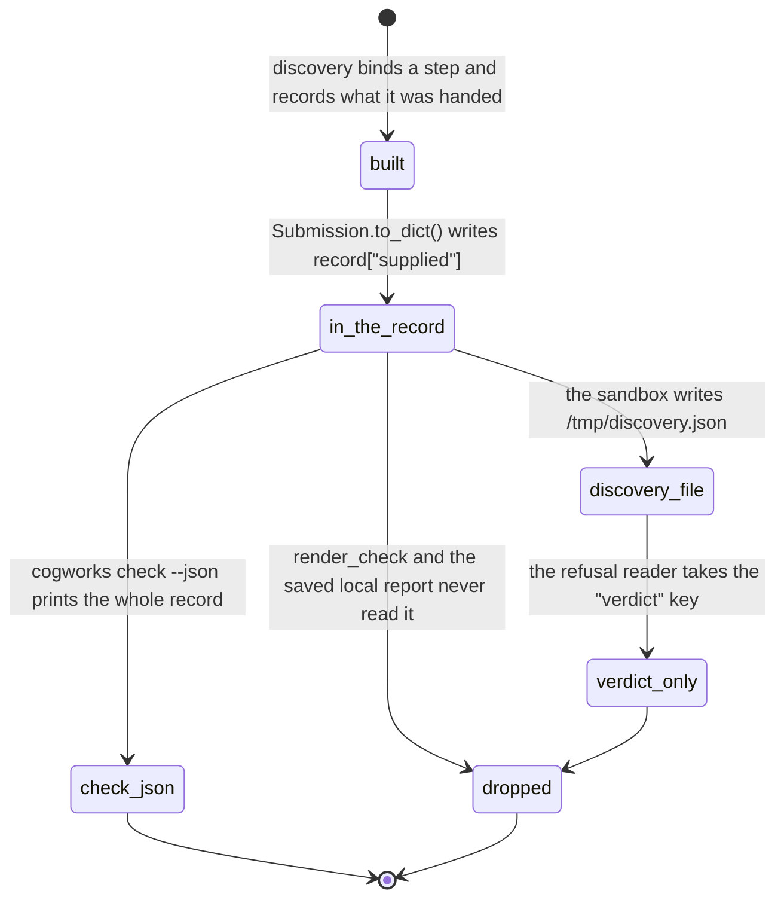

# What the benchmark supplied

## Summary

Some of what a run scores did not come out of the team's repository. The benchmark hands the team's functions the name of each item, a GloVe table, a folder pointed at its own files, an id-to-name table. A score computed with a resource the platform provided is a different claim from one computed without it, and the platform builds a phrase saying exactly which.

There are four kinds of supplied thing and the platform treats them differently:

1. **What a step was handed.** Built on every search, shown only by `cogworks check --json`.
2. **Weights from the team's own local run.** Named under the title of the practice run that fetched them and, by source, on the official attempt promoted from it.
3. **Glue code somebody else wrote.** A Week 1 sentence that nothing in the current tree triggers, though a team's own `submission.py` still can.
4. **The image itself.** The same for every team and disclosed per run to nobody.

[`foundations/what-the-portal-claims.md`](../foundations/what-the-portal-claims.md) owns the word *supplied*. This document owns where it goes.

## The simple case

A Week 3 team's `embed` function takes a caption and a GloVe table. They never load GloVe; the benchmark passes it. Discovery records that, and `cogworks check --benchmark language-search --json` shows `{"step": "embedder.embed", "supplied": "glove"}` in its discovery record (`python/cogbench/tests/test_resolve.py:947`).

The same team starts a hosted run. The run page shows the finding, the wiring trace and the readings. It does not say GloVe was supplied, because nothing on the wire between the sandbox and the portal carries the phrase. A team that loaded its own vectors and a team that was handed them get identical pages.

## The first kind: what a step was handed

`_supplied_by` builds one row per thing, read off the bindings rather than collected as the search runs, so it "cannot drift from what was actually called" (`python/cogbench/src/cogbench/resolve.py:1345`). `_given_to` turns one bound step into rows (`resolve.py:1379`):

| What the binding holds | The phrase recorded |
| --- | --- |
| an `identity` slot | "the name of each item" |
| an `extra:` slot | the slot's own name, for example `glove` |
| each keyword argument | the keyword's name |
| a tuning value | its `repr()` |
| a `pooled` entry | the benchmark's own object that filled this step, for example "weights_model (_Encoder) handed to the chain as this step" (`test_resolve.py:1205`) |
| a `value` entry | the value's recorded description |
| a `folder` entry | "their {name}/ was pointed at the benchmark's files" |

The pooled row is the largest thing a run can supply: that step was not one of the team's functions at all. The rows cover every chain under `branches` as well as the main chain, which matters for Week 3, whose search is made of branches. A `fit` stage adds "computed once as {name}". A week whose task ends in a database adds the team's state attribute by name and "an id-to-name table over the enrolled songs", which the code calls "the one value here the benchmark invented rather than read off their code" (`resolve.py:1365`).

## Where the phrase goes, and where it stops

```mermaid
stateDiagram-v2
    [*] --> built : discovery binds a step and records what it was handed
    built --> in_the_record : Submission.to_dict() writes record["supplied"]
    in_the_record --> check_json : cogworks check --json prints the whole record
    in_the_record --> discovery_file : the sandbox writes /tmp/discovery.json
    in_the_record --> dropped : render_check and the saved local report never read it
    discovery_file --> verdict_only : the refusal reader takes the "verdict" key
    verdict_only --> dropped
    check_json --> [*]
    dropped --> [*]
```

`Submission.to_dict()` writes the rows under `supplied` when there are any, with the comment "a score computed with a resource we provided is a different claim from one computed without it" (`resolve.py:628`). The comment no longer says a run page shows it, which it used to (removed in `da36ac8`).

The record has two consumers:

- **The CLI** puts it under `checks["discovery"]` (`python/cogbench/src/cogbench/cli.py:786`) and prints that dictionary only under `--json` (`cli.py:795`). The human-readable `render_check` prints the survey, a "Wired up:" block and the verdict, never the supplied rows. The saved local report has no field for them.
- **The sandbox** writes the record to `/tmp/discovery.json` (`apps/runner-modal/src/cogworks_runner/modal_app.py:732`). `_refusal_from` reads only its `verdict` key (`modal_app.py:1042`), and `_collect_wiring` reads a different file with four fields per step (`modal_app.py:1609`). The completed event has no field for it (`packages/contracts/src/protocol.ts:158`), and searching `apps/portal/src` for `supplied` finds only the weights line below.

So the phrase is built on every hosted search, written inside the sandbox, and read past. The only surface where a person can read it is `cogworks check --benchmark {id} --json`, and nothing in the product names that flag. [B-04](../bug-triage.md).

## The second kind: weights from the team's own local run

A Week 3 team keeps its trained projection out of git and lets `cogworks sync` upload the file its last local run used. A hosted practice run on the same commit fetches it during preparation, and the completed event lists the paths it fetched (`modal_app.py:2222`, `:2296`). The run page prints them under the title in small mono type:

> "{paths} from your local run at {shortSha}" (`apps/portal/src/routes/RunDetailPage.tsx:179`)

That is the one supplied thing a hosted run page names. The official attempt promoted from that run should carry the same line, though not from the runner. An official attempt reuses the practice run's prepared environment, weights included, so its job carries no weight list (`apps/portal/worker/execution/runner.ts:169`), and the runner sends `weightsSupplied` only when it prepared the run itself (`modal_app.py:2295`). Promotion, though, copies the practice run's row into the official run, weights record included (`apps/portal/worker/services/run-actions.ts:430`). A completed event without the field leaves that record as it is (`apps/portal/worker/routes/runner-events.ts:220-222`). At `2ff32fa` a Retry of a failed official attempt is the exception: its successor is written without that record (`run-actions.ts:618-642`) and reuses the environment, so its page has no line. Integrated `93dfa5e` source carries the record onto a Retry that reuses the same artifact (`505ce25`, [B-67](../bug-triage.md#b-67-an-official-attempt-does-not-say-which-synced-weights-it-scored-with)). Read from code; no promoted or retried run with synced weights has been observed. An earlier revision of this document said the line was missing from every official attempt.

## The third kind: glue code somebody else wrote

Week 1's adapter wrapper reads a `PROVENANCE` dictionary off the submission object or the module that defined it (`benchmarks/week1/audio_identification_benchmark/adapters.py:90`, pinned `4e516f3`). When its `source` is anything other than `"student"`, including a dictionary with no `source` key, the driver puts this sentence first in the mapping log:

> "scored through an instructor-supplied adapter; we supplied: {items}" (`benchmarks/week1/audio_identification_benchmark/drivers.py:324`)

where `{items}` is the `we_supplied` list joined with "; ", or "wiring only".

Nothing writes one. `benchmarks/adapters/` is gone from the tree, the images no longer carry instructor adapters, and a discovered submission is wrapped from a benchmark module that defines no `PROVENANCE`. The sentence is reachable only if a team writes a non-student `PROVENANCE` dictionary into its own declared `submission.py`, which nothing documents.

If it did fire, it would not lead. Week 1's scorer appends the mapping notes after its own (`benchmarks/week1/audio_identification_benchmark/metrics.py:294`, `:307`), and its own always end with "Outcome split over {n} scored queries: {counts}." (`metrics.py:450`). The run page shows the first note as the finding and the rest as small bullets, so the sentence its author put first would be the last bullet.

## The fourth kind: what the image supplies and never discloses

Every hosted run executes inside an image that provides a great deal the repository did not, and none of it is disclosed per run. The argument for that silence is that it is identical for every team.

- **The package list.** Each week's graded stack is data in `python/cogbench/src/cogbench/environment.py`, installed through `requirement_strings` for the image interpreter and `venv_install_command` for the pinned CPython 3.8.20 venv that runs Week 1 and Week 3 student code (`environment.py:198`, `:230`).
- **The FaceNet checkpoint.** Downloaded at image build under a sha256 lock; the build fails with "FaceNet checkpoint does not match the reviewed lock." (`apps/runner-modal/src/cogworks_runner/image_bake.py:53`).
- **The Week 3 artifacts.** GloVe, the captions and the image descriptors, baked in "so the network-blocked evaluation sandbox has them" (`image_bake.py:103`).
- **Two environment variables that change answers.** `PYTHONHASHSEED=0`, because one 2026 team builds its IDF table by iterating a set and its text retrieval score moved between 0.8188 and 0.8335 across three seeds (`modal_app.py:322`), and `MPLBACKEND=Agg`, because a plot that wants a window blocks until the sandbox times out (`modal_app.py:313`).

The record does carry the seed: `hashRandomization` and `hashSeed` sit beside `supplied` (`resolve.py:656`, `:661`), with the comment that "two pinned runs under different seeds are two different programs". It lands in the same place, `check --json`, and nowhere a student reads.

## Modifiers

| Modifier | Set before the ask | Changed while it works |
| --- | --- | --- |
| Who you are | No effect. No view of the supplied rows exists for anyone, staff included. | No effect. |
| Where your team and repository stand | A repository with a declared `submission.py` is never searched, so no bindings and no rows exist. A repository with synced weights gets the weights line on its practice run. | No effect. The rows are read off the bindings once, at the end of the search. |
| Which week's benchmark | Decides what there is to disclose. Week 3 supplies GloVe, the caption corpus and the descriptors, and is the only week that fetches synced weights; Week 1 supplies an id-to-name table and the name of each item; Week 2 supplies its FaceNet model. Only Week 1 reads `PROVENANCE`. | No effect. |
| Practice or leaderboard | The supplied rows are absent from both. The weights line appears on a practice run that fetched weights and, by source, on the official attempt promoted from it. | No effect. |
| Flags, options, and where you are typing | `cogworks check --json` is the only surface with the supplied rows; the same command without `--json` omits them; the run page, the live surface and Discord have no field for them. | No effect. |

## Cancel and interrupt

| Event | Before the work begins | While it works |
| --- | --- | --- |
| You stop it yourself | Nothing has been bound. | Ctrl+C during a local command ends before anything is printed; the rows were built in memory and are discarded. A hosted run has no cancel control. |
| You do something else mid-way | No effect. | No effect. The rows belong to one resolution. |
| A teammate acts at the same time | No effect. | No effect. Each run resolves the repository on its own. A teammate's later `cogworks sync` at the same commit changes which weights the next run fetches, not this one. |
| The portal fails | No effect. | No effect on the rows, which never travel. A `completed` event that never lands loses the weights line with everything else. |
| The process goes away | No effect. | A killed sandbox loses `/tmp/discovery.json`; nothing read the supplied rows from it anyway. |
| The thing being measured changes | No effect. | No effect. What was supplied is about this run's bindings at this commit. |
| Refused, or out of credit | No rows exist. | A refused run has no score to qualify, and the refusal card carries no disclosure. |

## Interactions with other systems

**Who may do this.** Nobody asks for this disclosure; discovery produces it on every search.

**The team owns it.** Every row names one of the team's own steps by label. The weights line names files in the team's repository.

**Credit.** Nothing here spends anything. See [`credit-and-quota.md`](credit-and-quota.md).

**What the portal claims.** *Supplied* is defined in [`foundations/what-the-portal-claims.md`](../foundations/what-the-portal-claims.md#supplied-by-the-benchmark).

**What the benchmark supplied.** This document.

**Live updates and reconnection.** Nothing supplied streams. The weights line arrives with the completed event. See [`live-updates.md`](live-updates.md).

**Discord.** The bubble shows metrics and the refusal headline, never notes or supplied rows, so no disclosure reaches Discord.

**Configuration.** Nothing here is configurable. The package lists, the seed and the artifact digests are fixed at image build.

## Edge cases

- **An empty supplied list is an absent key.** The record gets `supplied` only when there is at least one row (`resolve.py:629`), so a reader of `check --json` cannot tell "nothing supplied" from "a record that predates the field".
- **A declared submission discloses nothing**, which is right for the rows (they describe an inference) and leaves no disclosure for a repository that may still have been handed GloVe.
- **The `PROVENANCE` check treats a missing key as non-student.** `{}` at module scope would trigger the sentence with "wiring only" (`drivers.py:317`).
- **The image's contribution is invisible to the CLI.** `cogworks check` prints the packages this machine is missing, never what the image adds, so no command enumerates the graded environment.
- **A pooled step looks like the team's own function on the run page.** The wiring trace lists the benchmark's object under the stage it filled; the row saying it was the benchmark's is in the supplied list, which the page does not have.

## Open questions and verification

- The supplied rows never reach the hosted run page. [B-04](../bug-triage.md): the claim in the `resolve.py` comment is gone, the gap is not.
- Whether an official attempt's page repeats the weights line has not been observed. Source says it does, copied from its practice run at promotion (`run-actions.ts:430`, `runner-events.ts:220-222`), except after a Retry of a failed official attempt (`run-actions.ts:618-642`). An earlier reading said it did not and carried that to triage ([B-67](../bug-triage.md#b-67-an-official-attempt-does-not-say-which-synced-weights-it-scored-with)).
- Nothing in the current tree triggers the instructor-adapter sentence. Only a team's own non-student `PROVENANCE` would, and the sentence would then render as the last bullet (`drivers.py:316`, `metrics.py:307`). Remove it, or document what a student-written declaration means.
- No pass observed `cogworks check --json` against a real repository; the row shapes are read from `python/cogbench/tests/test_resolve.py:947` and `:1205`. **Unverified.**
- Whether the image's contribution should be disclosed per run is a product question. The case against silence is that no surface tells a student which packages their code may import.
- **Hosted beta (`4984730`) does not differ** for anything in this document. The resolver, runner, protocol, run-event handler and the weights line are identical between the two builds.

Read against Cog\*Portal commit `2ff32fa`.
