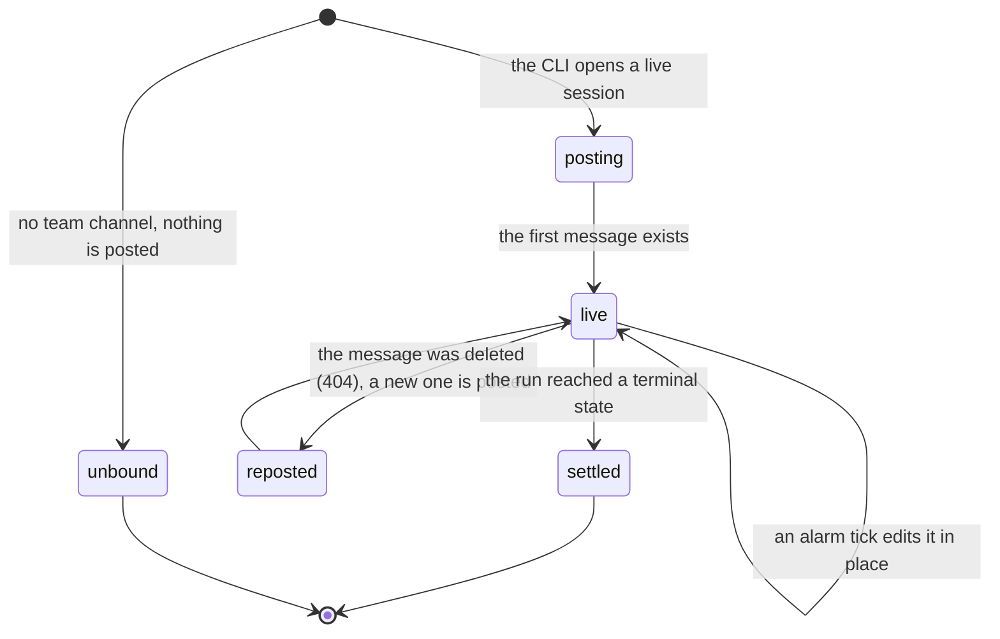

# What the platform posts unasked

## Summary

Two things arrive in a team's Discord channel without anyone typing a command. A *run bubble*, which is one message per shared run, posted when the run starts and edited in place until it ends. And a *team nudge*, which is one message about the team rather than about a run, posted once and never touched again.

Both require a bound channel. A team that has never confirmed one gets neither, and the platform says so rather than failing: the run path returns `"unbound"` and does nothing (`apps/portal/worker/services/discord-messages.ts:249`), and the nudge path only considers teams whose channel is set (`apps/portal/worker/services/team-nudges.ts:55`). Binding is an explicit act with a card that names exactly what will become visible; see [`commands.md`](commands.md#the-bind-channel-prompt).

The two are deliberately different mechanisms. The run bubble is one message the platform keeps current, so a run does not generate a stream of chat. The nudge is posted once and abandoned, because an observation about a team is about a moment and editing it later would be a claim about a different moment (`discord-messages.ts:285`).

## The simple case

A student runs `cogworks run --benchmark audio-identification --live`. Their terminal prints:

> "live: one progress bubble opened in your team channel" (`python/cogbench/src/cogbench/cli.py:562`)

In the channel, one message appears:

```
### Audio Identification
-# local run  `89353d0`  by Ada  `0:04`

◐ **Preparing the bench**
-# Contract check
-# Evaluation
-# Scoring

● local  ○ hosted  ○ official  ○ published
```

with a "Watch live" button on the right of the heading. That message never gets a sibling. It is edited every couple of seconds as the run moves: the top step turns into a check with a time chip, the next one lights up, and the rail fills. When the run ends the whole body is replaced by a result and up to three buttons appear.

## The ask, event by event



### Asking

Nobody asks for this. The run bubble is started by `cogworks run --live`, which opens a session on the portal; the portal reads the team's bound channel at that moment and writes it onto the run surface (`apps/portal/worker/routes/local-runs.ts:272`). Everything afterwards uses the channel recorded on the surface, not the team's current one.

The nudge is started by a cron trigger every five minutes (`apps/portal/wrangler.jsonc:79`), which runs the maintenance pass and, last of all, delivers whatever is worth saying (`apps/portal/worker/execution/maintenance.ts:167`).

### Answered without work

Three ways nothing is posted.

No bound channel. The CLI says so rather than going quiet: "live: synced to CogPortal; a team maintainer can choose the Discord channel with /cog" (`cli.py:565`).

No bot token configured. The nudge pass returns immediately (`team-nudges.ts:150`), and the run path throws "Discord message delivery is not configured." into the worker log where a student never sees it.

Nothing true to say. This is the common case for nudges and the one the code calls out: "Returning null is the common case and the important one. A portal that always has something to say is a portal nobody reads." (`team-nudges.ts:92`).

### The work begins

For the run bubble, the moment the first message is posted. That happens inside the request that opens the live session, before the first event arrives (`local-runs.ts:348`). From then on the whole team can see the author, the commit, the progress, and the self-reported score, which is exactly what the bind-channel card promised.

For a nudge, the moment the claim row is written. The insert happens before the send, so a crash between them costs one silent observation rather than one message every five minutes forever (`team-nudges.ts:167`).

### While it works

The run surface lives in a Durable Object that keeps an alarm. Each tick rebuilds the snapshot, broadcasts it to any connected console, and edits the Discord message; while the run is still running it re-arms at two seconds (`apps/portal/worker/realtime/run-surface-hub.ts:8`, `:85`). A newly published snapshot pulls the next tick forward to 250 milliseconds, so a live event reaches the channel faster than the base rate.

A 429 from Discord is retried once when the wait is two seconds or less, and otherwise raised with the wait attached, which the alarm uses to re-arm rather than to give up (`discord-messages.ts:62`, `run-surface-hub.ts:71`).

A 404 on an edit means somebody deleted the message. The stored message id is cleared, a generation counter is incremented, and a new message is posted (`discord-messages.ts:259`). Every first post carries `enforce_nonce` with a nonce built from the surface id and that generation, so a retried request cannot produce two bubbles for one run (`discord-messages.ts:242`).

Nudges have no "while". Each is one POST with no nonce and no retry.

### How it ends

**The running body.** A heading with the benchmark title; a subtext line joining the stage word ("local run", "hosted practice", "official attempt", "published"), the short commit as a mono chip, "by" and the runner's name, elapsed time as a chip, and where they apply "dirty worktree" and "simulated" (`discord-messages.ts:117`, `:124`). Then, when a team best exists, "-# team best so far 0.913". Then four loader lines, then the stage rail.

The four steps are prepare, check, evaluate, score, and their labels change with state. Pending reads "Preparation", "Contract check", "Evaluation", "Scoring"; active reads "Preparing the bench", "Checking the contract", "Evaluating", "Reading the gauges"; done reads "Bench prepared", "Contract passed", "Evaluated", "Scored" (`packages/discord-kit/src/steps.ts:31`). A pending step carries no marker at all, only dimmed subtext, so the eye lands on what is happening now (`steps.ts:117`). A done step carries a time chip taken from the event that proves it finished, and no chip at all when no such event was observed. The evaluate step carries a live count instead, `18/40`.

The phase behind all of that is resolved carefully. At terminal the snapshot's phase column often holds a status word rather than a phase, so the code falls back to the last event that named a real one and returns null when nothing did, "so copy never claims one" (`steps.ts:47`).

**The four terminal headlines.**

> "### ✳ Published  **0.913**" (`discord-messages.ts:189`)

> "### ✓ Bench clear  **0.913**" (`discord-messages.ts:192`)

> "### × Stopped during evaluation", or "### × Stopped on the bench" when no phase was observed (`discord-messages.ts:196`)

> "### Cancelled during the contract check", or "### Cancelled" (`discord-messages.ts:199`)

The phase noun is a small dictionary, not the raw phase: queued, preparing, and installing all read "preparation"; `contract_check` reads "the contract check" (`discord-messages.ts:104`). The first two headlines are green, the third is red, and cancelled stays ink, which is the one terminal state the platform declines to colour as a result.

**The terminal extras.** Under the headline and the meta line, in order:

> "-# a new team best, past 0.891" (`discord-messages.ts:146`)

> "-# team best stays 0.913" (`discord-messages.ts:147`)

A comparison only claims an improvement when the run was observed rather than self-reported; a succeeded local run falls back to "-# team best so far 0.913" (`discord-messages.ts:142`).

> "-# the useful detail is in your terminal" (`discord-messages.ts:207`)

on a failed local run, because the platform did not run that code and will not guess about it.

> "-# workspace has uncommitted changes, so hosted verification needs a commit and push" (`discord-messages.ts:210`)

on a succeeded local run from a dirty tree, which is the one line that names the next obstacle before the student hits it.

A failure then adds a two-line trace: the last step that finished, and the failure line, whose label prefers the safe category copy of the observed event ("Evaluation timed out", "Dependencies could not be installed", "Contract check stopped") over the step's own label (`packages/discord-kit/src/steps.ts:130`, `discord-messages.ts:78`).

And last, when the run failed because nothing could be scored:

> "-# " followed by the refusal headline, truncated to 300 characters (`discord-messages.ts:219`)

The comment above it says why: "Contract check stopped" is true and says nothing a team can act on, the platform already wrote one sentence explaining the failure in the team's own function names, and Discord is where several teams read a result first. See [`../foundations/what-the-portal-claims.md`](../foundations/what-the-portal-claims.md#refusal).

**Subscores.** A succeeded run adds up to four non-primary metrics, each as a mono value, a five-cell gauge when the value is a unitless number between 0 and 1, and the metric label in lower case. A gauge is withheld for anything without a known range, because it would be misleading (`discord-messages.ts:150`).

**Buttons.** None at all while running; the "Watch live" accessory is the only control. At terminal, at most two: the stage's primary action and one quiet secondary, plus a link to the run surface in the portal (`packages/discord-kit/src/policy.ts:3`). Pressing one opens a private confirmation card and leaves this message untouched; see [`commands.md`](commands.md#while-it-works).

**The nudges.** Two sentences, each posted at most once per team, keyed by team and kind (`apps/portal/worker/db/schema.ts:155`).

`no_first_light`, when the team has started at least one run, that first attempt is at least 24 hours old, and no run has ever succeeded:

> "No run has scored yet for this team.
>
> A pipeline that returns the wrong answer for every query is more useful
> right now than three finished pieces that have never run together. The
> course's own advice, from day one: making it work with all the pieces
> together is the most important part at the end, so the initial design has
> to be well thought out.
>
> Stub whatever is missing, wire it end to end, and run it. A score near zero
> is a starting point. No score is not." (`team-nudges.ts:110`)

`quiet_since_first_light`, when the last successful run finished at least 48 hours ago:

> "The last run that scored for this team was 3 days ago.
>
> Running after each change is how you find out which change did it. It is
> free and offline: `cogworks run --benchmark <id>`." (`team-nudges.ts:129`)

The file's own header states the three rules those sentences follow: every sentence is a template so the portal cannot claim something it did not observe; no sentence names a person or counts anything per person; and a sentence states what was observed and stops, with advice appearing only where the course itself gave it, quoted as the course's (`team-nudges.ts:14`). The quoted advice is real and attributed: it was given once, on day one, to a room.

## Modifiers

| Modifier | Set before the ask | Changed while it works |
| --- | --- | --- |
| Who you are | Not consulted. The bubble names the runner because a run has one, and the nudges name nobody at all. Nothing here is role-gated: everyone who can read the channel reads the same message. | No effect. |
| Where your team and repository stand | A bound channel is the whole precondition for both. The channel is snapshotted onto the run surface when the surface is created, so a team that rebinds mid-run leaves the existing bubble where it was and starts the next one somewhere else. A team with no runs at all is skipped by the nudge pass entirely, because "they are still setting up, and the setup flow already tells them what to do" (`team-nudges.ts:102`). | No effect. |
| Which week's benchmark | The bubble names the benchmark in its heading and nowhere else; a team running three benchmarks gets three independent bubbles. The nudges are per team and count runs across every benchmark, so a team scoring on Week 1 and silent on Week 3 is not quiet. | No effect. |
| Practice or leaderboard | The stage word and the rail carry it: "local run", "hosted practice", "official attempt", "published". A published run gets a different headline and a star. A local run's metric is never treated as a team best to beat (`discord-messages.ts:139`). | The whole point. A run promoted from local to hosted keeps its bubble and its message, and the rail advances in place. |
| Flags, options, and where you are typing | `--live` is what creates a bubble at all; a run without it is invisible to the channel. Nothing else is configurable from the student's side. The bot token, the client id (which selects the emoji manifest), and the public origin (which decides whether the portal link button exists) are the platform's settings. | No effect. |

## Cancel and interrupt

| Event | Before the work begins | While it works |
| --- | --- | --- |
| You stop it yourself | A run never started posts nothing. There is no way to ask for a bubble and then withdraw it. | Ctrl+C in the terminal ends the run, the live session is told, and the bubble settles to "### Cancelled during evaluation". The message is not deleted. Deleting it by hand makes the next edit 404, which clears the stored id and posts a fresh message, so a deleted bubble comes back once (`discord-messages.ts:259`). |
| You do something else mid-way | Starting a second run makes a second bubble; each surface has its own message and its own nonce generation. | The same. Runs go one at a time per benchmark, so the second bubble is for a different benchmark or a different stage. |
| A teammate acts at the same time | A teammate binding the channel a moment earlier means the run posts; a moment later means it does not, and the CLI has already printed the unbound sentence. | A teammate rebinding the team channel does not move an existing bubble. A teammate pressing a button on the bubble opens their own private confirmation and changes nothing others can see until the mutation lands, at which point the next tick edits the shared message. |
| The network or the portal fails | Discord being unreachable when the session opens is caught and logged; the run continues and the CLI prints "live: synced to CogPortal; Discord delivery is temporarily unavailable" (`cli.py:569`). | A rate limit re-arms the alarm at the time Discord asked for. Any other failure logs `run_surface_tick_failed` and retries in two seconds. A surface that no longer exists tears the alarm down and closes every connected socket with "Run surface no longer exists" (`run-surface-hub.ts:64`). A nudge that fails to send leaves its claim in place on purpose, because re-sending the observation three days later would be worse than not sending it (`team-nudges.ts:180`). |
| The page or the process goes away | Nothing exists yet. | The bubble outlives every terminal and every browser. The alarm belongs to the run surface, not to whoever started it, so a closed laptop does not stop the message from settling. A run whose CLI dies without sending a terminal event keeps its bubble on the last step it reached, and the alarm keeps re-editing it every two seconds, because the alarm re-arms on the stored status rather than on activity (`run-surface-hub.ts:85`). It settles when the maintenance pass marks the run stale, which is an hour after it was created by default (`apps/portal/worker/execution/maintenance.ts:22`), and the detail line then reads "The execution provider stopped reporting progress." |
| The thing being measured changes | Not applicable. A bubble is about one run at one commit. | Unaffected. The heading, the commit chip, and the rail describe the run the surface was created for. |
| The platform refuses or credit runs out | An exhausted quota stops the run before any surface exists, so no bubble is posted. | A refusal reaches the channel as a failure headline plus up to 300 characters of the refusal sentence. Credit is not mentioned anywhere in the bubble; the attempt count appears only in `/cog` and in the confirmation cards. |

## Interactions with other systems

**Who may do this.** Nobody does it. Both kinds are posted by the platform. What a student controls is whether a channel is bound, which requires a team creator or maintainer, and whether a run is shared, which requires `--live`.

**The team owns it.** Both messages are addressed to the team. The bubble names one person, the runner, because a run has one; the nudges name nobody, which is the no-per-person-numbers rule applied to prose rather than to numbers (`../foundations/what-the-portal-claims.md`).

**Credit.** Neither message spends anything or reports what is left. A hosted run started from a bubble button spends credit, but the spending happens in the confirmation card, not here.

**What the portal claims.** The stage word is the claim. "local run" is self-reported, everything past it was observed. The refusal line is the platform declining to reach a verdict, carried into chat at 300 characters. See [`../foundations/what-the-portal-claims.md`](../foundations/what-the-portal-claims.md).

**What the benchmark supplied.** Not carried. The bubble has no field for it.

**Live updates and reconnection.** The two-second alarm above, and the 250-millisecond pull-forward on a new snapshot. The bubble is the only Discord surface that updates without being touched. See [`../cross-cutting/live-updates.md`](../cross-cutting/live-updates.md).

**Discord.** The buttons on a settled bubble lead into [`commands.md`](commands.md); the "Watch live" accessory leads into [`the-activity.md`](the-activity.md).

**Configuration.** A bot token for both, a public origin for the portal link button, and the cron schedule for nudges. Without a public origin the bubble still renders and has no link.

## Edge cases

- **The 4,000-character budget is aggregate.** A running bubble fits its step lines into whatever the heading and rail leave, dropping from the end rather than truncating a line (`packages/discord-kit/src/format.ts:34`). It is the only message that needs this.
- **The rail marks everything done once a run is published.** The stage state test treats `published` as making every index done, regardless of the stage the snapshot actually holds (`packages/discord-kit/src/rails.ts:22`). For a published run every stage really did happen, so the rendering is right for the reachable case and wrong in principle.
- **The stage rail and the browser console disagree about cancelled.** The rail draws a cancelled stage as pending; the console draws it as failed (`rails.ts:26`, `apps/portal/src/components/RunConsole.tsx:71`).
- **A nudge is a public statement about a team.** "No run has scored yet for this team." is readable by everyone in the channel, including anyone else the course put there. That follows from the team being the unit and from the channel being the team's, and it is worth knowing before a channel is bound.
- **The day count is floored.** A gap of 71 hours reads "2 days ago". The threshold is 48 hours, so the smallest number a student can read is 2.
- **`postTeamMessage` sets no `allowed_mentions`.** Every other message the platform sends carries `parse: []` (`discord-messages.ts:238`, `apps/discord-bot/src/interaction.ts:77`). The nudge bodies are fixed templates with nothing mention-shaped in them, so nothing pings today; the guarantee is one template away from not holding (`discord-messages.ts:295`).

## Open questions and verification

- **The 300-character truncation is untested.** `apps/discord-bot/test/refusal-message.test.ts:16` asserts `headline.slice(0, 300).length <= 300` on a string literal defined in the test itself, which is true of any string and says nothing about the product. The real cap is at `discord-messages.ts:219` and no test reaches it. Whether a 600-character refusal (the schema's own limit, `packages/contracts/src/schema.ts:578`) reads as a complete sentence after truncation was not checked. Carried to triage.
- **Nothing clears a `no_first_light` claim.** `clearFirstLightNudge` exists, is exported, and explains in its own doc comment why it matters: without it, a team that integrates, then goes quiet, then breaks its pipeline again would never hear about it, because the row from their first week is still there (`team-nudges.ts:189`). No code in the repository calls it. Worth treating as a bug.
- **A team with more than 200 bound channels' worth of teams is silently partial.** The candidate query takes the first 200 teams with a bound channel and does not page (`team-nudges.ts:59`). With a cohort under 200 teams this never bites; it has no ordering, so which 200 is undefined if it ever does.
- **The published rail state is stronger than the snapshot.** See the edge case above (`rails.ts:22`). Whether a surface can hold `published: true` with a stage behind `published` was not established from the code. **Unverified.**
- Whether a deleted bubble really comes back, and whether `enforce_nonce` prevents the duplicate it is there to prevent, was not observed against a live channel. **Unverified.**
- **Every tick edits, whether or not anything changed.** `syncRunSurfaceMessage` PATCHes on every alarm with no comparison against what was last sent (`discord-messages.ts:250`). An abandoned run therefore sends an identical edit every two seconds for up to an hour before the maintenance pass settles it. Whether the two-second rate stays inside Discord's per-channel limits with several teams running at once was not measured; the retry path handles one 429, and sustained limiting would show as a bubble that lags its console. **Unverified.**
- Whether a student reads the nudge as advice or as a rebuke was not tested with a student. The sentences were written to state an observation and stop, and that is the claim to check first.

Verified against Cog\*Portal commit `f74e087`.
