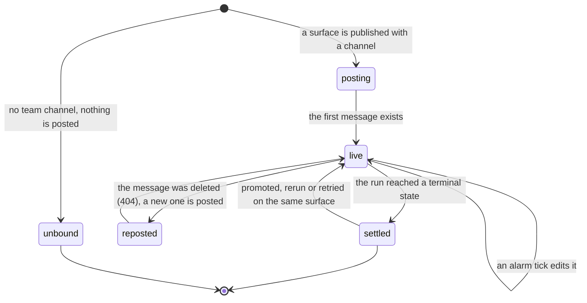

# What the platform posts unasked

## Summary

Two things arrive in a team's Discord channel without anyone typing a command. One is a *run bubble*: one message per run surface, posted when the surface is first published and edited in place until the run settles, then again whenever the run moves to its next stage. The other is a *team nudge*: one message about the team, posted once and never touched again.

Both need a bound channel. Without one, the bubble path returns `"unbound"` and does nothing (`apps/portal/worker/services/discord-messages.ts:267`), and the nudge pass only considers teams with a channel (`apps/portal/worker/services/team-nudges.ts:58`). Binding is the card in [`commands.md`](commands.md#how-it-ends).

A bubble is kept current so a run does not become a stream of chat. A nudge is posted once and abandoned, because it is an observation about a moment (`discord-messages.ts:303`).

Everything here is read from code and tests. No guild run of this build exists.

## The simple case

A student runs `cogworks run --benchmark audio-identification --live`. The terminal prints:

> "live: one progress bubble opened in your team channel" (`python/cogbench/src/cogbench/cli.py:1077`)

and one message appears in the channel:

```
### Audio Identification
-# local run  `89353d0`  by Ada  `0:04`

◐ **Preparing the bench**
-# Contract check
-# Evaluation
-# Scoring

● local
```

with a "Watch live" button beside the heading. The message is edited as the run moves: the active step becomes a check with a time chip, the next one lights, and the rail line grows a mark for each stage the run reaches. When the run ends the body is replaced by a result and up to two action buttons plus a "Cog\*Portal" link.

The same thing happens without `--live` whenever a hosted practice run starts, from the dashboard, from `/cog` or from the activity. Every hosted start creates or reuses a run surface carrying the team's channel and publishes it (`apps/portal/worker/services/run-actions.ts:315`, `:382`).

## The ask, event by event


```mermaid
stateDiagram-v2
    [*] --> unbound : no team channel, nothing is posted
    [*] --> posting : a surface is published with a channel
    posting --> live : the first message exists
    live --> live : an alarm tick edits it
    live --> reposted : the message was deleted (404), a new one is posted
    reposted --> live
    live --> settled : the run reached a terminal state
    settled --> live : promoted, rerun or retried on the same surface
    settled --> [*]
    unbound --> [*]
```

### Asking

Nobody asks. A bubble starts when a run surface is created: by `cogworks run --live` (`apps/portal/worker/routes/local-runs.ts:286`) or by any hosted practice start (`run-actions.ts:315`). Either copies the team's bound channel onto the surface at that moment (`local-runs.ts:294`, `run-actions.ts:324`). Every later edit uses the surface's channel, not the team's current one.

The nudge pass runs from the five-minute cron (`apps/portal/wrangler.jsonc:92`) after the stale-run repair (`apps/portal/worker/execution/maintenance.ts:102`).

### Answered without work

No bound channel. For a `--live` run the CLI says "live: synced to CogPortal; a team maintainer can choose the Discord channel with /cog" (`cli.py:1080`). A hosted run started in the browser says nothing about Discord.

The first post failed. The local run continues and the CLI says "live: synced to CogPortal; Discord delivery is temporarily unavailable" (`cli.py:1084`). That sentence also covers a portal with no bot token, where delivery is not temporary (`discord-messages.ts:50`).

Nothing true to say. The common case for nudges: "Returning null is the common case and the important one. A portal that always has something to say is a portal nobody reads." (`team-nudges.ts:95`).

### The work begins

For a bubble, the first POST, which for `--live` happens inside the request that opens the session (`local-runs.ts:371`). From then on everyone who can read the channel sees the runner's name, the commit, the progress, and the score.

For a nudge, the claim row. It is inserted before the send, so a crash between them costs one silent observation rather than a repeat every five minutes (`team-nudges.ts:167`).

### While it works

The surface lives in a Durable Object with an alarm. Each tick rebuilds the snapshot, broadcasts it to connected consoles, and edits the Discord message; while the run is running it re-arms at two seconds (`apps/portal/worker/realtime/run-surface-hub.ts:8`, `:178`). A new publication pulls the next tick forward to 250 milliseconds while running (`run-surface-hub.ts:93`). Every tick edits, whether or not anything changed (`discord-messages.ts:270`).

A 429 is retried once in place when Discord asks for two seconds or less; a longer wait re-arms the alarm for that long (`discord-messages.ts:62`, `run-surface-hub.ts:164`). Any other failure is logged as `run_surface_tick_failed` and re-armed at two seconds, whatever the run's status (`run-surface-hub.ts:168`).

A 404 on an edit means the message was deleted. The stored id is cleared, a generation counter increments, and a new message is posted with `enforce_nonce` and a nonce built from the surface id and that generation, so a retried POST cannot make two bubbles (`discord-messages.ts:278`, `:260`).

Nudges have no "while". Each is one POST with no nonce and no retry.

### How it ends

**The running body.** A heading with the benchmark title; a subtext line of the stage word ("local run", "hosted practice", "official attempt", "published"), the short commit as a chip, "by" and the runner's name, elapsed time as a chip, and, where they apply, "dirty worktree" and "simulated" (`discord-messages.ts:117`, `:138`). Then "-# team best so far {value}" when the team has one. Then four step lines and the rail.

The steps are prepare, check, evaluate, score. Pending they read "Preparation", "Contract check", "Evaluation", "Scoring"; active "Preparing the bench", "Checking the contract", "Evaluating", "Reading the gauges"; done "Bench prepared", "Contract passed", "Evaluated", "Scored" (`packages/discord-kit/src/steps.ts:31`). A pending step is dimmed subtext with no marker (`steps.ts:124`). A done step carries a time chip from the event that proves it finished, or none (`steps.ts:70`). Evaluate shows a live count such as `18/40` (`steps.ts:110`). At terminal the phase comes from the last event that named one, and is null rather than guessed when none did (`steps.ts:47`).

**The rail.** Each stage is read from its own run (`packages/contracts/src/schema.ts:796`). A stage the run never entered is left out, so a browser-started run's rail starts at hosted (`packages/discord-kit/src/rails.ts:43`). Marks are ✓ done, ● active, × failed, ○ pending.

**The headlines** (`discord-messages.ts:201`):

> "### ✳ Published  **0.913**"

> "### ✓ Bench clear  **0.913**"

> "### × Stopped during evaluation", or "### × Stopped on the bench" when no phase was observed

> "### Cancelled during the contract check", or "### Cancelled"

The phase noun is a small dictionary: queued, preparing and installing all read "preparation"; `contract_check` reads "the contract check" (`discord-messages.ts:104`). Published and Bench clear are green, Stopped red, Cancelled ink. No code path produces `cancelled`, so the last headline is unreachable.

**The terminal extras**, in order, under the headline and a meta line that now leads with the benchmark title:

> "-# a new team best, past 0.891" or "-# team best stays 0.913" (`discord-messages.ts:160`)

only for an observed run; a local run falls back to "-# team best so far 0.913" (`:153`).

> "-# the useful detail is in your terminal" (`discord-messages.ts:221`)

on a failed local run.

> "-# workspace has uncommitted changes, so hosted verification needs a commit and push" (`discord-messages.ts:224`)

on a succeeded local run from a dirty tree.

A failure then adds the last step that finished and a failure line whose label prefers the event's category ("Evaluation timed out", "Dependencies could not be installed", "Contract check stopped") over the step label (`discord-messages.ts:227`, `steps.ts:135`). When the run carries a refusal, "-# " and its headline cut at 300 characters (`discord-messages.ts:233`). The headline and the runner's name pass through an escape that turns line breaks into spaces and backslashes Markdown and `<`, so a team's own text cannot become a heading, a link or a mention (`discord-messages.ts:134`).

**Subscores.** A succeeded run adds up to four non-primary metrics, each a mono value, a five-cell gauge when the value is unitless and between 0 and 1, and the label in lower case (`discord-messages.ts:164`).

**Buttons.** None while running except the "Watch live" accessory, which opens [`the-activity.md`](the-activity.md) (`discord-messages.ts:192`). At terminal, the first of retry, publish, promote, verify the surface offers, then the first of rerun hosted, run again, then a "Cog\*Portal" link to `/run-surfaces/<id>` when an origin is set (`packages/discord-kit/src/policy.ts:17`, `discord-messages.ts:242`). Pressing one opens a private confirmation and leaves the bubble alone; see [`commands.md`](commands.md#while-it-works).

**The nudges.** Two, each posted at most once per team, keyed by team and kind (`apps/portal/worker/db/schema.ts:170`). Both read only hosted runs (`team-nudges.ts:67`).

`no_first_light`, when the team's first hosted run is at least 24 hours old and none has succeeded:

> "No run has scored yet for this team.
>
> A pipeline that returns the wrong answer for every query is more useful
> right now than three finished pieces that have never run together. The
> course's own advice, from day one: making it work with all the pieces
> together is the most important part at the end, so the initial design has
> to be well thought out.
>
> Stub whatever is missing, wire it end to end, and run it. A score near zero
> is a starting point. No score is not." (`team-nudges.ts:111`)

`quiet_since_first_light`, when the last succeeded hosted run finished at least 48 hours ago:

> "The last run that scored for this team was 3 days ago.
>
> Running after each change is how you find out which change did it. It is
> free and offline: `cogworks run --benchmark <id>`." (`team-nudges.ts:130`)

The file's header states the rules: every sentence is a template, no sentence names a person or counts per person, and advice appears only where the course gave it (`team-nudges.ts:14`).

## Modifiers

| Modifier | Set before the ask | Changed while it works |
| --- | --- | --- |
| Who you are | Not consulted for viewing; everyone who can read the channel reads the same message. The bubble names the runner; nudges name nobody. | No effect. |
| Where your team and repository stand | A bound channel is the precondition for both. The channel is copied onto the surface when it is created, so rebinding mid-run leaves the existing bubble where it was. A team with no hosted run is skipped by the nudge pass: "they are still setting up, and the setup flow already tells them what to do" (`team-nudges.ts:102`). | No effect. |
| Which week's benchmark | The bubble names its benchmark in the heading; separate surfaces get separate bubbles. Nudges count hosted runs across every benchmark. | No effect. |
| Practice or leaderboard | The stage word and the rail carry it. A local run's metric is never compared as an observed best (`discord-messages.ts:153`). | Verify, promote, publish, rerun and Retry on one surface keep its message, so the bubble moves from local to hosted to official to published in place. |
| Flags, options, and where you are typing | `--live` decides whether a local run has a bubble. A hosted run always has one when the team has a channel. The bot token, the client id (which picks the emoji manifest) and the public origin (which decides the portal link) are platform settings. | No effect. |

## Cancel and interrupt

| Event | Before the work begins | While it works |
| --- | --- | --- |
| You stop it yourself | A run never started posts nothing. | Ctrl+C sends a failure with code `run.failed.runtime` (`cli.py:1358`, `:998`), so the bubble settles to "### × Stopped during {phase}" with "-# the useful detail is in your terminal". It is not deleted. A message deleted by hand comes back on the next tick. |
| You do something else mid-way | A second run is a second surface with its own message. | The same. Runs go one at a time per benchmark. |
| A teammate acts at the same time | Binding a moment before the surface is created means it posts; a moment after means it does not. | Rebinding does not move an existing bubble. A teammate's button press opens their own private confirmation; the bubble changes when the mutation lands. |
| The network or the portal fails | A failed first post is logged as `run_surface_create_failed` and the run continues (`local-runs.ts:379`). | A rate limit re-arms the alarm for Discord's wait. Any other failure retries every two seconds with no limit, including for a settled run. A deleted surface tears the alarm down and closes sockets with "Run surface no longer exists" (`run-surface-hub.ts:152`). A nudge that fails to send keeps its claim (`team-nudges.ts:180`). |
| The page or the process goes away | Nothing exists yet. | The bubble outlives every terminal and browser. A hosted run that stops reporting is marked failed by the maintenance pass after an hour, or ten minutes if still queued, with "The execution provider stopped reporting progress." (`maintenance.ts:21`, `:32`, `:34`). A local run whose CLI dies without a terminal event (closed terminal, `kill -9`) is never swept: the sweep reads hosted runs only (`maintenance.ts:45`), so the bubble stays on its last step and the alarm edits it every two seconds indefinitely. |
| The thing being measured changes | Not applicable. A bubble is about one surface at one commit. | Unaffected. |
| The platform refuses or credit runs out | A hosted start refused for quota fails before its run exists. | A refusal from the benchmark reaches the channel as a failure headline plus up to 300 characters of the refusal sentence. Credit is never mentioned in the bubble. |

## Interactions with other systems

**Who may do this.** Nobody does it. A team creator or maintainer decides whether a channel is bound; a student decides whether a local run is shared with `--live`. Hosted runs are shared whenever a channel is bound.

**The team owns it.** Both are addressed to the team. The bubble names the runner because a run has one; nudges name nobody.

**Credit.** Neither spends anything or reports what is left.

**What the portal claims.** The stage word is the claim: "local run" is self-reported, everything after was observed. The refusal line is the platform declining a verdict. See [`../foundations/what-the-portal-claims.md`](../foundations/what-the-portal-claims.md).

**What the benchmark supplied.** Not carried.

**Live updates and reconnection.** The two-second alarm and the 250-millisecond pull-forward. See [`../cross-cutting/live-updates.md`](../cross-cutting/live-updates.md).

**Discord.** Bubble buttons lead into [`commands.md`](commands.md); "Watch live" into [`the-activity.md`](the-activity.md); "Cog\*Portal" to the browser's run surface page, which needs a signed-in team member (`apps/portal/src/App.tsx:170`).

**Configuration.** A bot token for both, a public origin for the portal link, and the cron for nudges.

## Edge cases

- **The 4,000-character budget is aggregate.** A running bubble fits its step lines into what the heading and rail leave, dropping from the end (`packages/discord-kit/src/format.ts:39`).
- **A nudge is a public statement about a team**, readable by anyone the course put in the channel.
- **The quiet nudge cannot see local runs.** It recommends `cogworks run`, which is local, while measuring only hosted runs, so a team running locally every day still reads "The last run that scored for this team was 2 days ago." Each nudge fires once per team, ever, because nothing calls `clearFirstLightNudge` (`team-nudges.ts:196`).
- **The day count is floored.** 71 hours reads "2 days ago".
- **Nudges set no `allowed_mentions`** (`discord-messages.ts:322`). Every other message carries `parse: []`. The nudge bodies are fixed templates, so nothing pings today.
- **The candidate query takes 200 teams** with no ordering and no paging (`team-nudges.ts:59`).
- **A cancelled stage on the rail is pending**, with the comment "A stopped run can be retried, so the rail keeps it open rather than failed." (`rails.ts:20`). The console marks the same state "×" (`apps/portal/src/components/RunConsole.tsx:80`). Unreachable while nothing produces `cancelled`.

## Open questions and verification

- **No guild evidence.** No artifact shows a bubble, a nudge, the nonce, the 404 repost or the 429 path on any build.
- **An abandoned local run edits forever.** No sweep reads local sessions (`maintenance.ts:45`) and the hub re-arms while the stored status is running (`run-surface-hub.ts:178`). Closing a terminal mid `--live` run is enough.
- **A channel the bot can no longer write keeps retrying.** A 403, or a 404 on the repost after a channel is deleted, re-arms every two seconds with no cap and no status check (`run-surface-hub.ts:175`), for every surface published on that channel. Each failure counts against the bot token Discord rate-limits for every team.
- **The bind prompt says "one live bubble per explicitly shared local run"** (`apps/discord-bot/src/commands.ts:433`), but every hosted run, promotion and publication on a surface with a channel also posts or edits one.
- **The 300-character cap is untested.** `apps/discord-bot/test/refusal-message.test.ts:16` asserts `.slice(0, 300).length <= 300` on a literal in the test. The real cap is `discord-messages.ts:233`. Whether a 600-character refusal (the snapshot's limit, `apps/portal/worker/services/run-surfaces.ts:454`) reads as a sentence after the cut was not checked.
- Whether a two-second edit rate per surface stays inside Discord's per-channel limits with several teams running was not measured.
- Hosted beta (`4984730`) does not differ here: `discord-messages.ts`, `team-nudges.ts`, `run-surface-hub.ts`, `local-runs.ts`, `maintenance.ts` and `packages/discord-kit/src/*` are byte-identical. Beta `26aa861` and candidate `02ed8c3` carry the same per-stage rail.

Read against Cog\*Portal commit `2ff32fa`.
