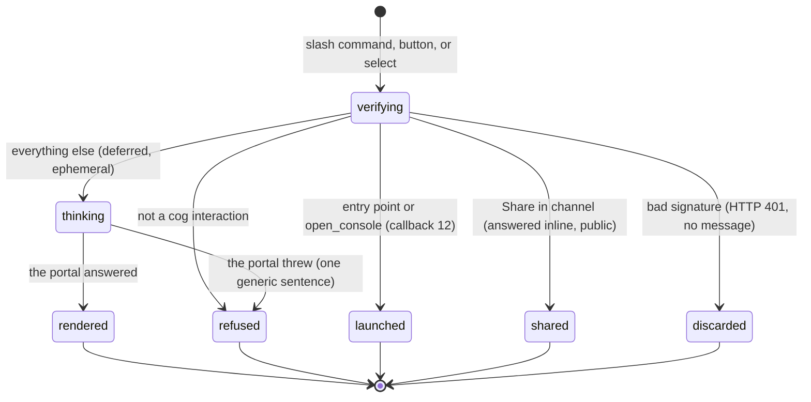

# The `/cog` command

## Summary

`/cog` is the whole chat surface. One command, one optional argument, and after that everything is buttons and a select menu inside the reply it just sent. It opens a private card carrying the team name, the repository, the latest shared run, the single action worth taking next, and a "Go to…" menu that swaps that card for the leaderboard, the benchmark list, or the team's local notes. There is no `/cog help`, no `/cog link`, and no `/cog unlink`; the first thing an unlinked student sees is the linking card, and the test that asserts this says so in its name (`apps/discord-bot/test/commands.test.ts:165`).

It is registered into the CogWorks course guild only (`apps/discord-bot/scripts/register-commands.mjs:38`), described as "Open your CogWorks lab bench", and takes one optional string option named `view`, described "Go straight to a view (optional)", with five choices: My team, Leaderboard, Benchmarks, Local practice, Connect account (`apps/discord-bot/scripts/command-payloads.mjs:1`).

A second command exists and is not a chat command. `launch` is a Discord Activity Entry Point, described "Open the CogWorks live bench", declared app-handled so that Discord does not add its own channel post, and answered with callback type 12 and no message at all (`apps/discord-bot/scripts/command-payloads.mjs:23`, `apps/discord-bot/src/index.ts:97`). What it opens is described in [`the-activity.md`](the-activity.md).

Every reply `/cog` produces is ephemeral except one: the leaderboard a student deliberately shares into the channel. Every message the bot sends, ephemeral or not, carries `allowed_mentions: { parse: [] }`, so nothing it prints can ping anyone (`apps/discord-bot/src/interaction.ts:77`).

## The simple case

A linked student on a team with a bound channel types `/cog` and, after a brief "thinking" state, gets a card only they can see:

```
### ◇ Analytical Engines
⑃ `cogworks/engines`

● **Face Recognition**  local  **0.913**
▮▯▯  official attempts   1 of 3 used

Live runs → <#123456789012345678>

-# private to you, quiet by default
```

Under it sit at most two buttons (the next run action, then "Open Cog\*Portal"), a divider, and a select menu labelled "Go to…" holding Team bench, Leaderboard, Benchmarks, and Local notes (`apps/discord-bot/src/commands.ts:54`, `:193`).

Choosing anything from that menu replaces this card in place. Nothing new appears in the channel, and nobody else sees any of it. The last line says so.

> Technical note: the marks are custom application emoji when the running application id has an entry in the generated manifest, and font glyphs otherwise (`packages/discord-kit/src/emoji.ts:101`). The manifest ships one application id with all 31 marks (`packages/discord-kit/src/emoji-manifest.generated.ts`), so a deployment under any other id renders the glyphs above rather than the drawn instrument marks. It degrades to a readable line instead of printing raw `:name:` text, which is the failure it was written to prevent.

## The ask, event by event



### Asking

Discord signs every interaction and the bot checks the signature before parsing anything. A missing, malformed, or wrong signature gets HTTP 401 with the body `Invalid request signature` and no Discord message at all (`apps/discord-bot/src/index.ts:78`); the student sees whatever Discord shows for a failed interaction.

Three things are decided before the portal is touched. Whether this is a `cog` command, a `cog:` component, or an Entry Point; anything else answers "Unsupported interaction." (`index.ts:95`). Whether the guild is the configured course guild; the Entry Point and the console launch answer "Cog is only enabled inside the CogWorks course server." (`index.ts:99`, `:106`) and the command handler answers "Cog lives in the CogWorks course server for now." (`commands.ts:587`). Whether an actor can be read from `member.user` or `user`; if not, "I couldn't tell who opened Cog. Close this and try once more." (`commands.ts:590`).

Which view is wanted is resolved in one function, in a fixed order: a share, bind, or bind-confirm custom id; the value chosen in the `cog:nav` select; a `cog:` prefix naming a view; a legacy subcommand, where `status` still means home and `link` still means connect; and finally the `view` option (`commands.ts:389`). Anything unrecognized falls through to home. The legacy subcommand branch exists so payloads registered before the option-based shape keep working during a registration rollout, and a test holds that shape in place (`test/commands.test.ts:491`).

### Answered without work

Four outcomes end the ask with nothing recorded anywhere.

The four guard sentences above. A leaderboard, a benchmark list, or a local-notes view, all of which are reads. And the connect card, which is the one that looks like work and is not: it writes a link token row, but that row is a one-time credential, not a change to the team.

> Technical note: `open_console` and the Entry Point are intercepted in the request handler and answered with callback type 12 before `executeCommand` runs (`index.ts:104`). That interception is load-bearing. `open_console` reaching `executeCommand` matches the surface-action shape, is not `run_again`, and is not one of the mutations, so it would answer "That run action is not available." for a button the platform itself put on the message (`commands.ts:504`).

### The work begins

For most views there is no such moment. Home, benchmarks, leaderboard, and local notes are reads, and abandoning any of them costs nothing.

Hosted actions have one, and each is guarded by a confirmation card first. Verify hosted, promote to official, publish result, rerun hosted and Retry each send a preview with the consequence in the button label, and only the second press calls the portal (`commands.ts:506`, `test/commands.test.ts:255`). The moment work begins is that second press: a hosted execution is admitted or a leaderboard entry is replaced. See [`../foundations/the-run.md`](../foundations/the-run.md) for what each of those costs.

Binding the team channel has one too. The confirmation writes the channel onto the team, and from then on every shared run posts there.

### While it works

Almost everything is deferred. The bot answers Discord immediately with a deferral and does the real work in the background, then edits that placeholder (`index.ts:112`). Which deferral it picks decides where the answer lands: a component that is not a surface action, or a surface action whose custom id ends in `:confirm`, gets a deferred update and edits the message the button was on; everything else gets a deferred ephemeral message and appears as a new private card (`index.ts:116`).

That split is why pressing a run button on a public message does not overwrite it. The confirmation prompt opens as a separate private card, and the public message stays as it was.

The one interaction answered inline is "Share in channel", which posts a public message rather than editing anything (`index.ts:110`).

Nothing is streamed. A `/cog` reply is a snapshot of the moment the portal answered, with no refresh and no staleness marker other than the "Refresh" button on the teamless card.

### How it ends

One container with an accent colour, some text, and at most one action row plus one select row. Three accents carry the meaning: ink `0x1c2637` for neutral, detector red `0xc63d2f` for attention and consequence, verification green `0x2e6b4f` for observed trust (`packages/discord-kit/src/accents.ts`).

#### Not linked

Red. The first thing most students ever see:

> "### ∞ Hi Ada, I'm Cog
> Your team's runs and results live in Cog\*Portal. Linking lets me bring them into Discord, so you can follow a run or check the board without leaving chat.
>
> You'll confirm what Discord can see before anything connects. The link works once and expires in **10 minutes**.
>
> -# Cog never runs code on your laptop, and official actions always ask first."

One link button, "Link to Cog\*Portal" (`commands.ts:244`). The ten minutes is real: the link token expires ten minutes after it is written (`apps/portal/worker/services/identity.ts:14`).

#### The link could not be made

> "I couldn't make a connection link just now. Nothing changed—try again in a moment." (`commands.ts:236`)

That string contains an em dash, which `docs/design/voice.md:100` forbids in portal copy. It is one of three in the product and all three are in this bot.

#### Linked, no team

Red, and the only card in the set with a "Refresh" button:

> "### One small step left
> You're linked as **ada-lovelace**. Choose your team's repository in Cog\*Portal, then come back and refresh." (`commands.ts:115`)

When the caller passed a portal origin, this card carries a link button "Choose your repository" and a secondary "Refresh". When it did not, it carries "Refresh" alone, and the sentence names a place the card cannot reach. That is the state a linked student reaches by choosing "Connect account", and it is a dead end; see Open questions.

#### Home

Green. The card in [The simple case](#the-simple-case). Three of its lines vary. The repository line falls back to "-# repository not connected yet" (`commands.ts:191`). The run line falls back to "◇ The bench is ready. No shared runs yet." (`commands.ts:180`). The channel line is one of three sentences: "Live runs → <#channel>", or "Live runs are ready; choose this team's Discord channel below.", or "Live runs are ready once a team creator or maintainer chooses the team channel." (`commands.ts:129`).

The next action is chosen from a fixed priority: publish, promote, verify, open console, run again, rerun (`commands.ts:138`). At most one appears.

#### Benchmarks

Ink. A heading, one line per benchmark with its summary in subtext, and a select menu "Get the run command…" over the active ones:

> "### ◎ Benchmarks
> -# each one runs from your machine; choose it below to get the exact command"

Choosing one expands that row with a fenced command and the sentence "-# the run happens on your machine, and --live shares its progress with the team" (`commands.ts:281`). An empty catalogue reads "Nothing is published yet. The bench is getting set up." (`commands.ts:290`).

#### Leaderboard, private

Green, top ten, one line per team with a rank mark, the team name in bold when it is yours, and the primary metric. Empty, it reads "The board is wide open. Your team could set the first mark." (`commands.ts:328`). No commit is shown, and a test holds that (`test/commands.test.ts:430`). Below sit a "Share in channel" button and the navigation menu.

#### Leaderboard, shared

The same body, posted publicly, with the buttons and the menu removed and one line added:

> "-# official published results, shared from CogWorks" (`commands.ts:340`)

This is the only non-ephemeral thing `/cog` produces. It carries team names and scores and nothing else.

#### Local notes

Ink. Up to eight rows, each naming the GitHub login that produced the report, a commit chip or "dirty worktree" or "no commit", and the primary metric. Empty, it reads "No local reports yet. Local practice stays private until someone chooses to share it." (`commands.ts:373`). Under everything: "-# self-reported, never leaderboard-eligible" (`commands.ts:378`). See [`../foundations/what-the-portal-claims.md`](../foundations/what-the-portal-claims.md#self-reported).

#### The bind-channel prompt

Red, and the only card that describes what other people will see:

> "### Make this the team bench?
> Cog will post one live bubble per explicitly shared local run here, then edit that same message as the run moves.
>
> Everyone who can read this channel can see the author, commit, progress, and self-reported score. Source code and raw outputs stay on the student's device." (`commands.ts:421`)

Two buttons: "Yes, use this channel" and "Not now". Confirming binds and returns the home card with the channel line filled in (`commands.ts:620`).

#### The run-surface confirmations

Each is a red card holding a receipt (benchmark, commit chip, stage, metric, each line prefixed `>`), then a sentence, then a labelled button and "Not now".

Hosted verification runs the saved commit as practice. Its confirmation must distinguish capacity reserved while running from quota used only by a completed evaluation.

Promotion reuses the prepared environment and evaluates the saved commit against hidden inputs. It reserves official capacity; failure uses no quota.

> "### Publish this result?" / "This becomes the team's public leaderboard entry. You can replace it later with another official result." / button "Publish to leaderboard" (`commands.ts:527`)

> "### Start a new hosted run?" / "This starts a fresh hosted run on the same commit. The current run stays as history." / button "Start hosted run" (`commands.ts:533`)

Retry adds a confirmation for the failed execution. It preserves practice or official mode and the saved source, with at most one successor for that failure. The old failure stays in history. Final Discord presentation remains unverified.

#### After a confirmation

Green:

> "### Bench updated" plus the receipt, then "-# the team message and live console follow this run from here" (`commands.ts:569`)

Plus a link button to that run surface in the portal when an origin is configured.

#### Run again

Ink. A receipt, then "A fresh run gets its own message, so this one stays as history." and a fenced command the portal built from the benchmark id (`commands.ts:486`, `apps/portal/worker/rpc.ts:109`). One button, "Back to Cog".

#### The refusals

Six sentences end an ask without producing a view. "Cog lives in the CogWorks course server for now." "I couldn't tell who opened Cog. Close this and try once more." "That run surface is no longer available." (`commands.ts:477`) "That run action is not available." (`commands.ts:504`) "Open /cog inside the channel your team will use." (`commands.ts:414`, `:619`) And the one that stands in for everything the portal threw: "I couldn't reach Cog\*Portal just now. Nothing changed—try again in a moment." (`index.ts:46`).

## Modifiers

| Modifier | Set before the ask | Changed while it works |
| --- | --- | --- |
| Who you are | The Discord account id is the whole identity. Unlinked gets the connect card. Linked with no team gets the one-step-left card. Linked with a team gets home. A team creator or maintainer additionally gets the "Use this as our team channel" button; anyone else reads the sentence naming who can (`apps/portal/worker/services/discord.ts:194`). An instructor is not a role here; there is no admin view in Discord. | No effect. The identity is read once at the start of the interaction, and a link completed in the browser a second later does not change the card already being built. |
| Where your team and repository stand | The whole shape of the home card. No team gives the teamless card. A team with no repository gives "-# repository not connected yet" in place of the repository chip. No bound channel gives one of the two "Live runs are ready" sentences instead of the channel link. No shared run gives "The bench is ready. No shared runs yet." | No effect within one interaction. A teammate binding the channel mid-request does not change the card; pressing anything in the navigation menu rebuilds it from current state. |
| Which week's benchmark | The benchmarks view lists every published benchmark and marks the inactive ones "   paused" (`commands.ts:275`); only active ones appear in the "Get the run command…" menu. The leaderboard shows one benchmark, chosen by the portal, and the command carries no way to ask for another. Home reports whichever benchmark the latest shared run used. | No effect. |
| Practice or leaderboard | Local notes are self-reported and labelled as never leaderboard-eligible. The private leaderboard shows only published entries. The confirmation cards are where the two meet: verify hosted turns a local run into an observed one, promotion starts an official evaluation, publish puts it on the board. | No effect. Each confirmation acts on the snapshot it read when the prompt was built, and the portal re-checks the state before mutating (`apps/portal/worker/services/run-actions.ts:491`). |
| Flags, options, and where you are typing | `view` jumps straight to one of five cards and is the only option the command has. The channel matters for exactly one thing: binding, which uses the channel the interaction came from and refuses without one. The guild matters absolutely; outside the course guild every path answers with a sentence. A phone and a desktop get identical bytes, though the layout is Discord's to decide. | No effect. |

Nothing here can change mid-ask. Every input is read from the interaction payload, which is fixed the moment Discord sends it.

## Cancel and interrupt

| Event | Before the work begins | While it works |
| --- | --- | --- |
| You stop it yourself | There is no cancel. Dismissing an ephemeral card removes it from view and nothing is recorded. Pressing "Not now" on a confirmation returns the home card without calling the portal (`commands.ts:548`). | Once a confirm button is pressed the portal call runs to completion in the background whether or not the student is still looking. Dismissing the card does not stop it; the result reaches the team through the run bubble instead. |
| You do something else mid-way | Running `/cog` twice gives two independent ephemeral cards, each with live buttons. There is no lock and no shared state between them. | The background handler edits its own original message by interaction token. A second `/cog` cannot interfere with the first. |
| A teammate acts at the same time | A teammate binding the channel, starting a run, or publishing a result changes what the next card says. Nothing marks the card as stale, and there is no timestamp on it. | A teammate promoting the same run first means the portal refuses the second attempt with its own sentence, which the student never reads; it arrives as "I couldn't reach Cog\*Portal just now." See Open questions. |
| The network or the portal fails | Not detected. Every path calls the portal, so a portal that is down surfaces in the next phase. | Every thrown error is caught in one place and replaced with one sentence (`index.ts:38`). The real message is written to the worker log and not to the student. If the edit of the deferred message itself fails, the student is left with Discord's "thinking" state and no explanation; the failure is logged as `discord_deferred_response_edit_failed` (`index.ts:56`). |
| The page or the process goes away | Closing Discord loses the card. Nothing was written. | An interaction token is valid for fifteen minutes, so a background handler that finishes after the student closes Discord still edits the message; they find it on reopening. A mutation that already reached the portal is durable regardless. |
| The thing being measured changes | A branch that moved, a week that rolled over, or a run that finished between opening the card and pressing a button. The card shows what was true when it was built. | A confirmation acts on a surface id, and a surface is about one commit, so a branch that moved does not change what the action does. A run that reached a state where the action no longer applies gets a portal refusal, which the student reads as the generic sentence. |
| The platform refuses or credit runs out | An exhausted official quota does not change the home card: the attempts line still renders, and the promote button still appears when the surface offers the action. | The refusal arrives from the portal as "The official-attempt quota is exhausted." (`apps/portal/worker/services/run-actions.ts:357`) and is replaced with the generic sentence before the student sees it. Nothing is spent. |

After any interrupt, the durable effects come from run actions and channel binding, and each of those required a second press.

## Interactions with other systems

**Who may do this.** Anyone in the course guild can invoke `/cog`. What comes back depends on whether their Discord account is linked to a portal account and whether that account is on a team. Two different membership gates run behind the one card: the team status query accepts any membership row (`apps/portal/worker/services/discord.ts:154`) while the run-surface query requires a role of admin, maintain, or write and otherwise throws "Current write access to the team repository is required." (`apps/portal/worker/services/run-actions.ts:68`). Home calls both, so the two must agree or home cannot render.

**The team owns it.** Every card except the connect card is about the team. Local notes name the GitHub login that produced each report, which is the one place a person appears, and they carry no per-person number beyond that person's own self-reported metric on their own row.

**Credit.** Opening `/cog` is free. Hosted actions reserve capacity while running; completed evaluations count and failures do not. The earlier draft found hardcoded official-limit labels in `commands.ts:185`, `:186`, `:521` and `:524`; their presentation still needs rechecking. See [credit and quota](../cross-cutting/credit-and-quota.md).

**What the portal claims.** The local-notes view is the trust vocabulary in one line: "-# self-reported, never leaderboard-eligible". The verify-hosted confirmation is the other half: "the score is observed, not self-reported". See [`../foundations/what-the-portal-claims.md`](../foundations/what-the-portal-claims.md).

**What the benchmark supplied.** Nothing reaches this surface. No card names a supplied resource, and the wire contract behind them has no field for one.

**Live updates and reconnection.** None. A card is a snapshot. The only live surface in Discord is the run bubble, which the platform edits on its own; see [`channel-messages.md`](channel-messages.md).

**Discord.** This document is the Discord surface. The related pieces are the Activity ([`the-activity.md`](the-activity.md)), which `open_console` and the Entry Point launch, and the unprompted messages ([`channel-messages.md`](channel-messages.md)), which the bind-channel prompt is asking permission for.

**Configuration.** Three values: the Discord public key used to verify signatures, the course guild id, and an optional portal origin (`apps/discord-bot/src/env.ts:9`). Without the origin, every link button and every "Open Cog\*Portal" button disappears and the cards still render, because each is built through a helper that returns null on a missing or non-HTTP origin (`commands.ts:44`).

## Edge cases

- **The caps a card can hit.** A text display is truncated at 4,000 characters, an action row keeps its first 5 buttons, a select menu keeps its first 25 options, and a section keeps its first 3 text displays (`packages/discord-kit/src/components.ts:75`, `:96`, `:108`, `:124`). None of these are reachable by a student today: the navigation menu has four options, the leaderboard is sliced to ten rows, and local notes to eight. The 4,000-character cap is aggregate across every text display in a message, which is what `fitTextBudget` exists for, and only the run bubble uses it.
- **The separator is two en-spaces.** `META_SEP` is `  `, chosen because a run of regular spaces can collapse on mobile (`packages/discord-kit/src/format.ts:9`). One line in the home card does not use it: the attempts line separates its label from its count with three literal spaces (`commands.ts:186`).
- **`open_portal` is a dead branch.** It has a label in the home card's action map and never appears in the priority array that selects one (`commands.ts:138`, `:159`), so a surface offering only `open_portal` gets no button. The button policy for the public run bubble excludes it by type instead (`packages/discord-kit/src/policy.ts:11`), which is the clearer treatment.
- **Unlinking is not possible from Discord.** `unlinkDiscord` is on the RPC contract (`packages/contracts/src/discord.ts:58`), implemented (`apps/portal/worker/rpc.ts:57`), and stubbed in the bot's own test fixture (`test/commands.test.ts:115`), but no code path in `apps/discord-bot/src` calls it. The only way to unlink is the connections page in the browser.
- **The bind-channel prompt has an unreachable guard.** Both bind branches refuse without a channel id, with "Open /cog inside the channel your team will use." A guild interaction always carries one, and a direct message is already refused by the guild check, so the sentence may be dead copy.
- **A "thinking" state that never resolves.** Every deferred path ends in a PATCH of the original message. If that PATCH fails, nothing retries and nothing tells the student; Discord shows the command as still thinking until it expires.

## Open questions and verification

- **`/cog view:connect` is a dead end for an already-linked student.** When the account is linked, the connect view hands off to the home view without passing the portal origin (`commands.ts:235`), while every other caller passes it (`commands.ts:607`). For a student with a team this only loses the "Open Cog\*Portal" button. For a student without one it produces a card that says "Choose your team's repository in Cog\*Portal" with a "Refresh" button and no link, so the sentence names a destination the card cannot reach. Worth treating as a bug. **Unverified** against a running bot.
- **One sentence stands in for every portal error.** `index.ts:38` catches everything and answers "I couldn't reach Cog\*Portal just now. Nothing changed—try again in a moment." The Activity shows the same errors verbatim (`apps/portal/src/activity-main.tsx:54`), so the two surfaces disagree about what the student is told. Sentences lost on the Discord side include "CogBot needs View Channel and Send Messages in this private channel. Ask course staff to update its existing role, then try again." (`apps/portal/worker/services/discord.ts:123`), "That channel already belongs to {name}." (`:225`), "A team creator or maintainer needs to choose the team channel." (`:218`), and "The official-attempt quota is exhausted." (`apps/portal/worker/services/run-actions.ts:357`). The permissions one is the worst loss: it is the only sentence that says what to fix, and it fires exactly when a team binds a private channel. Worth treating as a bug.
- **The two membership gates disagree by role.** The team status query accepts any membership row; the run-surface query requires admin, maintain, or write. Home calls both, so a member holding any other role would get the generic error forever and never reach the home card, while the leaderboard, benchmarks, and local-notes views would still work. Whether such a row is reachable was not established: every write path stores one of the three, and a demoted admin is rewritten to `write` rather than to a read role (`apps/portal/worker/routes/team.ts:165`). Carried to triage as a divergence rather than a confirmed break. **Unverified.**
- **The Entry Point is installable where it cannot work.** `launch` declares `integration_types: [0, 1]` and `contexts: [0, 1, 2]` (`scripts/command-payloads.mjs:28`), so a user install offers it in direct messages and in other servers, and every one of those answers "Cog is only enabled inside the CogWorks course server." (`index.ts:99`). Either the declaration or the guard should change.
- **The em dash.** Three product strings carry one, all in this bot (`commands.ts:236`, `index.ts:46`, `:138`), against `docs/design/voice.md:100`. Carried to triage.
- **The official limit is written four times.** `commands.ts:185`, `:186`, `:521`, `:524`, and `apps/portal/src/components/RunConsole.tsx:208` each hardcode 3 while `OFFICIAL_LIMIT` is the authority (`packages/contracts/src/schema.ts:1177`). Changing the limit silently makes the Discord copy wrong.
- Whether the emoji manifest is synced for the production application id was not established. If it is not, every mark in every card renders as a font glyph. **Unverified.**
- Whether a deferred edit failure is visible to a student as a permanently thinking command was not observed. **Unverified.**

Verified against Cog\*Portal commit `a0e8eac` for recovery policy; unchanged Discord descriptions retain earlier references. No guild verification is claimed.
