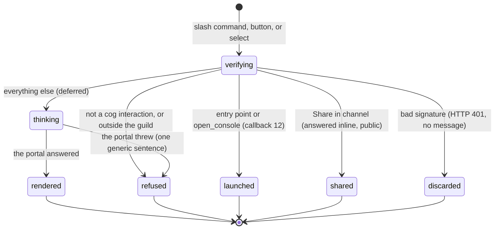

# The `/cog` command

## Summary

`/cog` is the whole chat surface: one command with one optional argument, and after that only buttons and a select menu inside the reply it sent. It opens a private card carrying the team name, the repository, the latest run surface, the one action worth taking next, and a "Go to…" menu that swaps the card for the leaderboard, the benchmark list, or the team's local notes. There is no `/cog help`, no `/cog link` and no `/cog unlink`; an unlinked student's first reply is the linking card (`apps/discord-bot/test/commands.test.ts:180`).

It is registered into the course guild only (`apps/discord-bot/scripts/register-commands.mjs:38`), described "Open your CogWorks lab bench", and takes one optional string option, `view`, described "Go straight to a view (optional)", with five choices: My team, Leaderboard, Benchmarks, Local practice, Connect account (`apps/discord-bot/scripts/command-payloads.mjs:1`).

A second command is not a chat command. `launch` is a Discord Activity Entry Point, described "Open the CogWorks live bench", registered globally and app-handled so Discord adds no channel post, and answered with callback type 12 and no message (`command-payloads.mjs:23`, `apps/discord-bot/src/index.ts:97`). What it opens is [`the-activity.md`](the-activity.md).

Every reply is ephemeral except the leaderboard a student deliberately shares. Every `/cog` reply carries `allowed_mentions: { parse: [] }`, so nothing it prints can ping anyone (`apps/discord-bot/src/interaction.ts:77`). The team nudges the portal posts into a channel do not set it ([`channel-messages.md`](channel-messages.md#edge-cases)).

Everything here is read from code and the bot's tests. No guild run of this build exists, so nothing below is observed.

## The simple case

A linked student on a team with a bound channel types `/cog` and, after Discord's "thinking" state, gets a card only they can see:

```
### ◇ Analytical Engines
⑃ `cogworks/engines`

● **Face Recognition**  local  **0.913**
▮▯▯  official attempts   1 of 3 used

Live runs → <#123456789012345678>

-# private to you, quiet by default
```

Under it sit at most two buttons (the next run action, then "Open Cog\*Portal"), a divider, and a "Go to…" select holding Team bench, Leaderboard, Benchmarks and Local notes (`apps/discord-bot/src/commands.ts:54`, `:172`). Choosing from the menu replaces this card in place; nothing appears in the channel.

> Technical note: the marks are custom application emoji when the running application id is in the generated manifest, and the font glyphs shown above otherwise (`packages/discord-kit/src/emoji.ts:101`). The manifest holds one application id, `1526706029356646460` (`packages/discord-kit/src/emoji-manifest.generated.ts:9`), which is also the client id the portal bundle defaults to (`apps/portal/src/env.client.ts:9`). A deployment under any other id renders glyphs.

## The ask, event by event


```mermaid
stateDiagram-v2
    [*] --> verifying : slash command, button, or select
    verifying --> discarded : bad signature (HTTP 401, no message)
    verifying --> refused : not a cog interaction, or outside the guild
    verifying --> launched : entry point or open_console (callback 12)
    verifying --> shared : Share in channel (answered inline, public)
    verifying --> thinking : everything else (deferred)
    thinking --> rendered : the portal answered
    thinking --> refused : the portal threw (one generic sentence)
    rendered --> [*]
    refused --> [*]
    launched --> [*]
    shared --> [*]
    discarded --> [*]
```

### Asking

The bot checks Discord's signature before parsing anything. A missing or wrong signature gets HTTP 401 `Invalid request signature` and no message (`index.ts:78`). An unparseable body gets "Discord sent an invalid interaction." (`index.ts:84`).

Three things are decided before the portal is touched. Whether this is the `cog` command, a `cog:` component or an Entry Point; anything else answers "Unsupported interaction." (`index.ts:95`). Whether the guild is the course guild; the Entry Point and a console launch answer "Cog is only enabled inside the CogWorks course server." (`index.ts:99`, `:106`) and everything else answers "Cog lives in the CogWorks course server for now." (`commands.ts:628`). Whether an actor can be read; if not, "I couldn't tell who opened Cog. Close this and try once more." (`commands.ts:631`).

The wanted view is resolved in one function, in order: a share, bind or bind-confirm custom id; the value chosen in `cog:nav`; a `cog:` id naming a view; a legacy subcommand, where `status` means home and `link` means connect; then the `view` option (`commands.ts:400`). Anything unrecognized is home. The legacy branch keeps payloads registered before the option shape working, and a test holds it (`test/commands.test.ts:613`).

### Answered without work

The guard sentences above, the leaderboard, benchmarks and local-notes views, and home itself are reads. The connect card writes a one-time link token row (`apps/portal/worker/services/identity.ts:42`), which is a credential, not a change to the team.

> Technical note: `open_console` and the Entry Point are answered with callback type 12 in the request handler before `executeCommand` runs (`index.ts:104`). If `open_console` ever reached `executeCommand` it would answer "That run action is not available." (`commands.ts:537`), so the two files must stay in step.

### The work begins

For the views there is no such moment. Run actions and channel binding each have one, always behind a second press.

Verify hosted, promote to official, publish result, rerun hosted and Retry each open a private confirmation with the consequence in its button, and only that button calls the portal (`commands.ts:539`, `test/commands.test.ts:287`). Pressing it admits a hosted execution or replaces the team's leaderboard entry. What each costs is [`../foundations/the-run.md`](../foundations/the-run.md).

Binding: "Yes, use this channel" writes the channel onto the team (`apps/portal/worker/services/discord.ts:227`), and from then on the platform posts there; see [`channel-messages.md`](channel-messages.md).

### While it works

Almost everything is deferred. The bot answers Discord at once and finishes in the background by editing the placeholder (`index.ts:112`). A component that is not a run action, or a run action whose id ends in `:confirm`, gets a deferred update and edits the message it was on; everything else gets a new private message (`index.ts:115`). That split is why a button on a public run bubble opens a private confirmation and leaves the bubble alone. "Share in channel" is the one interaction answered inline (`index.ts:110`).

Nothing streams. A card is a snapshot of the moment the portal answered.

### How it ends

One container with an accent colour, some text, at most one action row and one select row. Ink `0x1c2637` is neutral, detector red `0xc63d2f` is attention and consequence, verification green `0x2e6b4f` is observed trust (`packages/discord-kit/src/accents.ts`).

**Not linked.** Red:

> "### ∞ Hi Ada, I'm Cog
> Your team's runs and results live in Cog\*Portal. Linking lets me bring them into Discord, so you can follow a run or check the board without leaving chat.
>
> You'll confirm what Discord can see before anything connects. The link works once and expires in **10 minutes**.
>
> -# Cog never runs code on your laptop, and official actions always ask first." (`commands.ts:248`)

One link button, "Link to Cog\*Portal", opening `/connections#discord=<token>` (`identity.ts:54`). The ten minutes is the token's lifetime (`identity.ts:14`). The card does not say that the portal will only accept the link from an account already on a team; see Edge cases. If the token cannot be made: "I couldn't make a connection link just now. Nothing changed. Try again in a moment." (`commands.ts:240`).

**Linked, no team.** Red: "### One small step left / You're linked as **ada-lovelace**. Choose your team's repository in Cog\*Portal, then come back and refresh." (`commands.ts:115`). With a portal origin it carries "Choose your repository" (to `/connect`) and a secondary "Refresh"; without one, "Refresh" alone (`commands.ts:106`).

**Home.** Green, as in the simple case. The repository line falls back to "-# repository not connected yet" (`commands.ts:195`). The run line falls back to "◇ The bench is ready. No shared runs yet." (`commands.ts:184`). The attempts line appears only while an official attempt remains (`commands.ts:186`). The channel line is "Live runs → <#channel>", "Live runs are ready; choose this team's Discord channel below." or "Live runs are ready once a team creator or maintainer chooses the team channel." (`commands.ts:129`). A creator or maintainer in a channel also gets "Use this as our team channel" (`commands.ts:134`).

The next action is the first of retry, publish, promote, verify, open console, run again, rerun that the latest surface offers (`commands.ts:138`). Every surface offers `open_console` (`apps/portal/worker/services/run-surfaces.ts:346`), so "Run again" and "Rerun hosted" are never chosen here; a team whose latest run has nothing better gets "Open live console", which launches the Activity. "Open Cog\*Portal" goes to `/run-surfaces/<id>`, or `/dashboard` with no surface (`commands.ts:168`).

**Benchmarks.** Ink: "### ◎ Benchmarks / -# each one runs from your machine; choose it below to get the exact command", then one line per benchmark with its summary, inactive ones marked "   paused" (`commands.ts:279`, `:294`). Choosing from "Get the run command…" expands that row with a fenced `cogworks run --benchmark <id> --live` and "-# the run happens on your machine, and --live shares its progress with the team" (`commands.ts:285`). Empty: "Nothing is published yet. The bench is getting set up."

**Leaderboard, private.** Green, "### ▦ {title} leaderboard", top ten with a rank mark and the primary metric, no commit (`commands.ts:326`, `test/commands.test.ts:550`). Empty: "The board is wide open. Your team could set the first mark." (`commands.ts:332`). Then "Share in channel", the menu, and a "Cog\*Portal" link to `/dashboard`.

**Leaderboard, shared.** The same body posted publicly with the controls removed and "-# official published results, shared from CogWorks" added (`commands.ts:344`). It carries team names and scores only.

**Local notes.** Ink, "### ▤ Local field notes". Up to eight rows: the GitHub login that produced the report, a commit chip or "dirty worktree" or "no commit", the command chip (`run` or `test`) or "command not recorded", and the primary metric (`commands.ts:372`). When any row is a `test`: "-# a `test` line scored only the small smoke-test cases; `cogworks run` scores the practice set" (`commands.ts:383`). Footer: "-# self-reported, never leaderboard-eligible" (`commands.ts:389`). Empty: "No local reports yet. Local practice stays private until someone chooses to share it."

**The bind prompt.** Red:

> "### Make this the team bench?
> Cog will post one live bubble per explicitly shared local run here, then edit that same message as the run moves.
>
> Everyone who can read this channel can see the author, commit, progress, and self-reported score. Source code and raw outputs stay on the student's device." (`commands.ts:432`)

Buttons "Yes, use this channel" and "Not now". Confirming returns home with the channel line filled (`commands.ts:659`). The first sentence is narrower than what happens; see Open questions.

**Confirmations.** Red, a quoted receipt (benchmark, commit chip, stage, metric), a sentence, the labelled button and "Not now" (`commands.ts:580`):

| Action | Heading | Sentence | Button |
| --- | --- | --- | --- |
| Verify hosted | "Verify this exact commit?" | "A hosted run scores this exact commit on the course machines and records what it sees. It's practice, and it uses one of this benchmark's hosted practice runs." | "Verify {sha} hosted" |
| Promote | "Use an official attempt?" | "This scores the same commit on the hidden set and spends one official attempt. It reuses the environment this run already built, so nothing reinstalls." | "Use attempt {n} of 3" |
| Publish | "Publish this result?" | "This becomes the team's public leaderboard entry. You can replace it later with another official result." | "Publish to leaderboard" |
| Rerun hosted | "Start a new hosted run?" | "This starts a fresh hosted run on the same commit, which uses another of this benchmark's hosted practice runs. The current run stays as history." | "Start hosted run" |
| Retry | "Retry this run?" | "This retries the failed execution with the same source and keeps the result in this view." | "Retry" |

(`commands.ts:545`.) A Retry button carries the failed execution's id; one with no valid id answers "That Retry button has no valid execution ID. Refresh the team bench.", and one whose run is no longer the retryable head answers "That Retry button is out of date. Refresh the team bench." (`commands.ts:503`, `:508`).

**After a confirmation.** Green: "### Bench updated", the receipt, "-# the team message and live console follow this run from here", and an "Open Cog\*Portal" link to the surface (`commands.ts:610`).

**Run again.** Ink: "### Run it again", the receipt, "A fresh run gets its own message, so this one stays as history.", a fenced `cogworks run --benchmark <id> --live`, and "Back to Cog" (`commands.ts:518`, `apps/portal/worker/rpc.ts:118`). Reached from a bubble's button, never from home.

**Refusals.** "That run surface is no longer available." (`commands.ts:500`), "That run action is not available." (`:537`), "Open /cog inside the channel your team will use." (`:425`, `:660`), and, for everything the portal threw, "I couldn't reach Cog\*Portal just now. Nothing changed. Try again in a moment." (`index.ts:46`).

## Modifiers

| Modifier | Set before the ask | Changed while it works |
| --- | --- | --- |
| Who you are | The Discord account id is the whole identity. Unlinked gets the connect card, linked without a team the one-step card, linked with a team home. A creator or maintainer also gets the bind button (`apps/portal/worker/services/discord.ts:194`). Run actions also need write access and a live GitHub sign-in on the portal account (`apps/portal/worker/services/run-actions.ts:78`, `:125`). There is no instructor or TA view in Discord. | No effect. The identity is read once per interaction. |
| Where your team and repository stand | Shapes home: no team gives the one-step card, no repository the fallback line, no bound channel one of the two "Live runs are ready" sentences, no surface "The bench is ready. No shared runs yet." | No effect within one interaction. Any menu choice rebuilds from current state. |
| Which week's benchmark | Benchmarks lists every catalog row and offers commands only for active ones. The leaderboard shows one board, the active benchmark row with the highest version (`apps/portal/worker/services/leaderboard.ts:40`); the bot never asks for another (`commands.ts:324`). Home reports whichever benchmark the most recently updated surface used. | No effect. |
| Practice or leaderboard | Local notes are self-reported and never leaderboard-eligible. The leaderboard shows published official results only. The confirmations are where the two meet. | No effect. Each confirmation acts on the surface id, and the portal re-checks state before mutating (`run-actions.ts:684`). |
| Flags, options, and where you are typing | `view` jumps to one of five cards. The channel matters only for binding, which uses the channel the interaction came from. Outside the course guild every path answers with a sentence. | No effect. |

## Cancel and interrupt

| Event | Before the work begins | While it works |
| --- | --- | --- |
| You stop it yourself | Dismissing an ephemeral card removes it; nothing is recorded. "Not now" returns home without a mutation (`commands.ts:587`). | Once a confirm is pressed the portal call runs to completion in the background. Dismissing the card does not stop it; the result reaches the team through the run bubble. |
| You do something else mid-way | Two `/cog` invocations are two independent cards with live buttons. | Each background handler edits its own message by interaction token. |
| A teammate acts at the same time | A teammate binding, starting a run or publishing changes the next card. Nothing marks a card stale. | A teammate acting first makes the portal refuse the second press with its own sentence, which arrives as "I couldn't reach Cog\*Portal just now." |
| The network or the portal fails | Not detected here; every path calls the portal. | Every thrown error becomes the generic sentence; the real message goes to the worker log as `discord_command_failed` (`index.ts:38`). If editing the deferred message fails, Discord stays on "thinking" and the failure is logged as `discord_deferred_response_edit_failed` (`index.ts:56`). |
| The page or the process goes away | Closing Discord loses the card. Nothing was written. | A background handler that finishes after Discord closes still edits the message within the interaction token's life. A mutation that reached the portal is durable regardless. |
| The thing being measured changes | A run that moved on between opening the card and pressing a button: the card shows what was true when built. A Retry whose target is no longer the head answers "That Retry button is out of date." | A confirmation acts on a surface, and a surface is about one commit. A run that no longer allows the action is refused, and the refusal reads as the generic sentence. |
| The platform refuses or credit runs out | Home hides the attempts line once no official attempt remains (`commands.ts:187`), and the surface stops offering Retry without capacity (`run-surfaces.ts:387`). Promote is still offered on a surface whose quota is exhausted. | "The official-attempt quota is exhausted." or "The practice-run quota is exhausted." (`run-actions.ts:421`, `:258`) is replaced by the generic sentence. Nothing is spent. |

## Interactions with other systems

**Who may do this.** Anyone in the course guild can invoke `/cog`. Two membership gates sit behind home: the status query accepts any membership row (`discord.ts:154`), while the run-surface query requires admin, maintain or write and otherwise throws "Current write access to the team repository is required." (`run-actions.ts:78`). Every write path stores one of those three, so the two agree today.

**The team owns it.** Every card except the connect card is about the team. Local notes name the login behind each report; that row's metric is that person's own self-reported number, which is the closest Discord comes to a per-person figure.

**Credit.** Opening `/cog` is free. Hosted actions reserve capacity while running; completed evaluations count and failures do not. The verify and rerun sentences say a run "uses" one without saying a failure uses none, and Retry says nothing about quota. See [credit and quota](../cross-cutting/credit-and-quota.md).

**What the portal claims.** "-# self-reported, never leaderboard-eligible" on local notes, and "records what it sees" on hosted verification. See [`../foundations/what-the-portal-claims.md`](../foundations/what-the-portal-claims.md).

**What the benchmark supplied.** Not shown. The RPC contract has no field for it.

**Live updates and reconnection.** None. The live Discord surfaces are the run bubble ([`channel-messages.md`](channel-messages.md)) and the Activity ([`the-activity.md`](the-activity.md)).

**Discord.** The connect card hands off to the portal's Connections page, which shows "Connect {username} to Cog?" and a "Connect Discord" button (`apps/portal/src/routes/ConnectionsPage.tsx:89`, `:126`); afterwards it tells the student to run `/cog` again or press "Check the link" in the Activity (`ConnectionsPage.tsx:147`). Unlinking exists only on that page.

**Configuration.** The bot needs a Discord public key, the course guild id and, optionally, a portal origin (`apps/discord-bot/src/env.ts:9`). Without the origin every portal link disappears and the cards still render (`commands.ts:44`).

## Edge cases

- **Linking needs a team first, and the card does not say so.** The portal's preview and confirm routes require a team (`apps/portal/worker/routes/connections.ts:59`, `:76`). A teamless student who presses "Link to Cog\*Portal" is sent to `/join` or `/connect` and told "Your Discord link is on hold / It needs a team first. Finish getting started, then start the link again from Discord." (`apps/portal/src/components/DroppedLinkNotice.tsx:36`). The token is discarded.
- **`view:connect` for a linked student drops the portal link.** The already-linked branch calls home without the portal origin (`commands.ts:239`), so the card loses "Open Cog\*Portal" and the menu's portal link. Because linking requires a team, the teamless form of this card (with "Refresh" alone) needs a student who linked and then lost their team.
- **The caps a card can hit.** A text display truncates at 4,000 characters, a row keeps its first 5 buttons, a select its first 25 options, a section its first 3 text displays (`packages/discord-kit/src/components.ts:75`, `:96`, `:108`, `:124`). None is reachable today.
- **The separator is two en-spaces** (`packages/discord-kit/src/format.ts:9`), because runs of ordinary spaces collapse on mobile. The attempts line uses three literal spaces instead (`commands.ts:190`).
- **The leaderboard never bolds your team.** The bot bolds `isYou` rows (`commands.ts:327`), but the RPC never passes a team id (`rpc.ts:34`), so `isYou` is always false (`leaderboard.ts:105`).
- **A "thinking" state that never resolves.** If the PATCH of the deferred message fails, nothing retries and the student sees Discord's own timeout.
- **The Entry Point is offered where it cannot work.** `launch` declares `integration_types: [0, 1]` and `contexts: [0, 1, 2]` (`command-payloads.mjs:28`), so a user install offers it in direct messages and other servers, where it answers "Cog is only enabled inside the CogWorks course server."

## Open questions and verification

- **No guild evidence.** No artifact exercises `/cog`, the bind flow, the confirmations or the share on any build. Every claim above is read from code and `apps/discord-bot/test/commands.test.ts`.
- **One sentence stands in for every portal error.** `index.ts:38` and `:129` replace every thrown message. Lost sentences include the bind refusals "CogBot needs View Channel and Send Messages in this private channel. Ask course staff to update its existing role, then try again." (`discord.ts:124`), "That channel already belongs to {name}." (`:225`) and "A team creator or maintainer needs to choose the team channel." (`:218`); the action refusals "Sign in to GitHub on Cog\*Portal before changing a run." and "GitHub access expired. Sign in to Cog\*Portal again." (`run-actions.ts:125`, `:135`), "Commit your changes before hosted verification." (`:712`), and both quota sentences. The Activity shows the same errors verbatim (`apps/portal/src/activity-main.tsx:56`).
- **The bind prompt promises less than it delivers.** It says Cog posts "one live bubble per explicitly shared local run", but a hosted practice run started in the browser creates a surface on the bound channel and publishes it (`run-actions.ts:315`, `:382`), so it gets a bubble too, as do promotions and publications on any surface.
- **The Connections page says Cog cannot do what `/cog` does.** The consent panel reads "Cog receives neither source code nor your GitHub token, and it can't start an official evaluation." (`ConnectionsPage.tsx:111`), and the page lede says neither Discord nor the CLI "can submit an official result" (`:84`). `/cog` offers "Promote to official" and "Publish to leaderboard", and the RPC performs both (`rpc.ts:94`, `:99`).
- **The official limit is written four times here.** `commands.ts:189`, `:190`, `:560`, `:563` hardcode 3 while `OFFICIAL_LIMIT` is the authority. The Activity console now reads the constant (`apps/portal/src/components/RunConsole.tsx:274`).
- **Dead paths.** `open_portal` has a label and no place in the priority list (`commands.ts:163`); "Run again" and "Rerun hosted" sit behind `open_console`, which every surface carries; `unlinkDiscord` is on the RPC (`rpc.ts:57`) and no bot path calls it.
- **The membership gates differ by role** (`discord.ts:154` against `run-actions.ts:78`). Unreachable while no write path stores a fourth role (`apps/portal/worker/github/permissions.ts:3`).
- Whether the emoji manifest matches the production application id was not established.
- Hosted beta (`4984730`) does not differ for this surface: `apps/discord-bot/src/commands.ts`, `index.ts`, `command-payloads.mjs` and `apps/portal/worker/rpc.ts` are byte-identical on both builds.

Read against Cog\*Portal commit `2ff32fa`.
