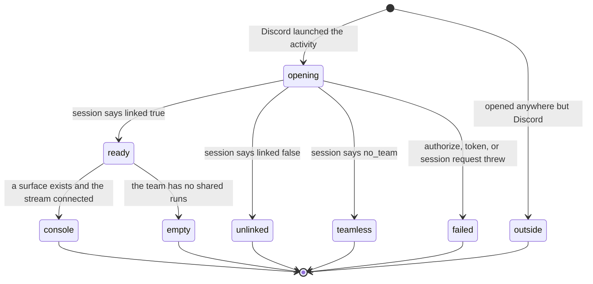

# The activity

## Summary

The activity is the portal's live run console running inside Discord. It is the same React component the browser uses, served from a separate entry point, sized to whatever pane Discord gives it, and told who the student is by their Discord account rather than by a portal session (`apps/portal/src/bootstrap.ts`, `apps/portal/src/activity-main.tsx`).

There are exactly two ways in. The `launch` Entry Point command, which Discord answers with callback type 12 and no channel post (`apps/discord-bot/src/index.ts:97`). And any button whose custom id matches `cog:surface:*:open_console`, which the bot intercepts before its command handler and answers the same way (`apps/discord-bot/src/index.ts:104`). The second is the one students actually use: it is the "Watch live" accessory on a running run bubble, and "Open live console" when the home card offers it.

Identity is a Discord user id in a signed cookie and nothing else. The activity never asks for a portal password, never redirects to GitHub, and never sees a portal session. What it can show is decided by whether that Discord id is linked to a portal account and whether that account is on a team.

## The simple case

A student presses "Watch live" on the run bubble in their team channel. Discord opens the activity in a pane beside the chat. For a moment they read a status line:

> "Opening the bench…" (`apps/portal/src/activity-main.tsx:215`)

Then the console appears: a header naming the benchmark, the team, the runner's GitHub login, the commit, and elapsed time; a status kicker and a connection word; a four-cell lifecycle strip reading Local, Hosted, Official, Published; a scrolling event list under the heading "Safe event stream"; and a small action rail headed "Run reference". The events keep arriving while they watch.

The two words at the top of the header are the ones a student actually reads. The kicker is "On the bench · evaluating" while a run is live, then "Bench clear", "Stopped during evaluation", or "Stopped before completion" (`apps/portal/src/components/RunConsole.tsx:76`). The word on the right is about the connection rather than the run: "Live", "Reconnecting…", or "Snapshot" while running, and "Complete", "Stopped", or "Cancelled" once it is not (`RunConsole.tsx:84`). An empty list reads "Waiting for the first structured event."

What that console shows and how it behaves is owned by [`../portal/watching-a-run.md`](../portal/watching-a-run.md); this document covers how the student gets there, what identity it runs under, and what happens when it cannot open.

## The ask, event by event

### Asking

The two entry points differ in reach. `open_console` rides on a button the platform itself put on a message, so it only exists where a run bubble or a home card exists, which is inside the course guild. The `launch` Entry Point is registered globally with user installation and every context allowed, so it can be invoked in a direct message or another server, where the guild check answers "Cog is only enabled inside the CogWorks course server." and the activity never opens (`apps/discord-bot/src/index.ts:98`). Both are answered with callback type 12 and no message, which is why neither leaves anything in the channel.

Before anything runs, the page decides whether it is embedded at all. It is embedded when the hostname ends in `.discordsays.com` or the query string carries `frame_id` (`activity-main.tsx:25`). Embedded, every API call is prefixed `/.proxy/api` so it goes through Discord's proxy; not embedded, `/api`.

Not embedded, the whole flow is skipped and one card renders:

> "Discord Activity
> ### Open the live bench from Discord.
> Use `/cog` in your team channel, then choose **Open live console**. Your linked Discord identity decides which team surfaces you can see." (`activity-main.tsx:205`)

with one link, "Open Cog\*Portal".

### How identity is established

Three requests and two cookies, all before the first run surface is fetched.

1. `GET /activity/oauth/state` mints 24 random bytes as 48 hex characters and stores them in a signed cookie named `cog_activity_oauth_state` with a ten-minute lifetime (`activity.ts:117`, `apps/portal/worker/util/id.ts:1`).
2. The Discord SDK is asked to authorize with `response_type: "code"`, that state, `scope: ["identify"]`, and `prompt: "none"` (`activity-main.tsx:152`).
3. `POST /activity/oauth/token` compares the returned state against the cookie, exchanges the code with Discord, reads `users/@me`, and writes a second signed cookie named `cog_activity_session` holding `{discordUserId}.{expiresAt}` with a one-hour lifetime. The state cookie is deleted (`activity.ts:124`).

Over HTTPS both cookies are `httpOnly`, `Secure`, `SameSite=None`, `Partitioned`, and `Priority=High`, which is what a cookie has to be to survive inside a third-party iframe in a modern browser. Over plain HTTP, which only happens in local development, they fall back to `SameSite=Lax` and no `Secure` flag (`activity.ts:56`).

Every later request reads that session cookie, splits it, and rejects an expired or malformed value with "The Cog Activity session expired. Open it again." A missing cookie gets "Open the Cog Activity again." (`activity.ts:82`). Both are 401s, and both land in the startup-error card.

Two details make the handshake work inside an iframe that is not on the portal's own origin. Every request goes to `/.proxy/api`, which is Discord's proxy for an embedded application, so the browser treats the call as same-origin with the activity's own host and sends the cookie under `credentials: "same-origin"` (`activity-main.tsx:28`, `:50`). And the cookies are partitioned, so the browser files them under the embedding context rather than refusing them outright.

> Technical note: the connect card in chat promises the link "works once and expires in **10 minutes**" (`apps/discord-bot/src/commands.ts:247`). Ten minutes is the life of the link token and of the state cookie. The activity session that the same handshake produces lasts an hour. Nothing tells the student that, so an activity left open goes quiet after an hour with a sentence about a session they were never told they had.

### Answered without work

Embedded, four screens end the ask before any run data is fetched, and none of them writes anything.

**Loading.** A single status line, "Opening the bench…", with a live-marked square beside it (`activity-main.tsx:215`).

**Startup error.** Anything thrown during the identity handshake lands here:

> "Could not open
> ### The bench is still here.
> {the error's own sentence}" (`activity-main.tsx:218`)

The fallback when there is no sentence is "Close the Activity and open it again." The activity puts the portal's real message on screen rather than replacing it, which is the opposite of what the bot does with the same errors (`activity-main.tsx:54`, and see [`commands.md`](commands.md#open-questions-and-verification)).

**Not linked.**

> "One connection
> ### Link Cog\*Portal to see your team's bench.
> Discord is attached to your existing GitHub-first portal account. No repository access or Discord login is stored on your laptop." (`activity-main.tsx:241`)

One button, "Link Cog\*Portal ↗", which opens the link URL through Discord's external-link command rather than navigating the pane. Under it, in small text:

> "After linking, close this Activity and open it again." (`activity-main.tsx:250`)

The comment above that line says why it is there: the activity does not poll for link completion, so a student who links in the browser comes back to the same card and reads it as a failure (`activity-main.tsx:247`).

**Linked, no team.**

> "One step left
> ### You are linked, but not on a team yet.
> Connect your fork in the browser to join or start your team. Then close this Activity and open it again." (`activity-main.tsx:227`)

One button, "Finish team setup ↗", pointing at `/connect`. This screen exists because the state used to render the not-linked card above, which told a student who had already linked to link again. The comment names that as the reason (`activity-main.tsx:220`), and the wire schema carries the distinction as a three-way union rather than a boolean: `false`, `"no_team"`, or `true` (`apps/portal/worker/routes/activity.ts:27`).

### The work begins

Opening the activity commits nothing. The one durable thing the handshake writes is a session cookie, and it expires on its own.

Work begins in the same place it does in chat: the second press of a confirmation. The action rail offers verify hosted, promote to official, publish result, and rerun hosted; each opens a modal dialog with a sentence, and only "Confirm" calls the portal (`apps/portal/src/components/RunConsole.tsx:196`, `:401`). The four sentences are quoted in [`../portal/watching-a-run.md`](../portal/watching-a-run.md).

### While it works

The console holds one WebSocket to the run surface, opened through the same proxy prefix (`activity-main.tsx:197`). On close it reconnects with backoff of 1, 2, 4, then 8 seconds, capped there, and the header word changes between "Live", "Reconnecting…", and "Snapshot" to say which (`apps/portal/src/lib/run-surface-stream.ts:54`, `RunConsole.tsx:84`). A frame that does not parse is dropped rather than shown, because the next authoritative snapshot supersedes it.

The event list follows the bottom while the student is at the bottom, and stops following the moment they scroll up. Events that arrive after that are counted into a control reading "3 new events", which scrolls back down and clears the count when pressed (`RunConsole.tsx:334`). The scroll itself respects `prefers-reduced-motion` (`RunConsole.tsx:172`).

While a mutation is in flight its button reads "Working…" and every button in the rail is disabled (`RunConsole.tsx:364`).

The activity also subscribes to Discord's layout-mode events. In picture-in-picture or grid layout the console switches to a compact form that drops the event list and the entire action rail, leaving the header and the lifecycle strip (`activity-main.tsx:199`, `RunConsole.tsx:302`).

### How it ends

A team with at least one shared run gets the console. A team with none gets:

> "Bench ready
> ### No shared runs yet.
> Start with `cogworks run --live`. Cog will keep one message and this console current for the team." (`activity-main.tsx:292`)

A successful action replaces the console's snapshot with the one the portal returned and selects it, so a verify press moves the lifecycle strip from Local to Hosted without the student doing anything else (`activity-main.tsx:281`).

A failed action does not replace the console. Its message appears as an alert beside the rail and the console stays live (`RunConsole.tsx:377`). The fallback when the failure carries no sentence is "That action could not be completed." (`activity-main.tsx:284`).

A failed run adds one line under the rail: "The useful detail is still in the runner's terminal." (`RunConsole.tsx:379`). That is the activity's version of the same refusal to guess that the run bubble makes with "-# the useful detail is in your terminal".

The one way out of the pane is "Open Cog\*Portal ↗", which opens the run surface in a real browser through Discord's external-link command rather than navigating the iframe (`activity-main.tsx:268`).

Nothing is written back to Discord by the activity. The team's channel message is updated by the portal on its own schedule; see [`channel-messages.md`](channel-messages.md).

## Modifiers

| Modifier | Set before the ask | Changed while it works |
| --- | --- | --- |
| Who you are | The Discord account id decides everything: unlinked gives the link card, linked without a team gives the team-setup card, linked with a team gives the console. Role matters for actions but not for viewing: any member's session can read the team's surfaces, while a mutation resolves the actor separately and requires write access to the repository (`activity.ts:205`, `apps/portal/worker/services/run-actions.ts:68`). There is no instructor view. | No effect. The session cookie is minted once and read on every request; a link completed in the browser is not noticed until the activity is closed and reopened. |
| Where your team and repository stand | No team gives the team-setup card and no surfaces are fetched at all, which the code marks with an explicit comment because `"no_team"` is truthy (`activity-main.tsx:171`). A team with no shared run gives the bench-ready card. A team with runs gets the ten most recently updated, newest first (`activity.ts:190`). | No effect within one open. New surfaces do not appear in the picker until the activity is reopened, though a mutation prepends its result to the list. |
| Which week's benchmark | Not chosen here. The picker lists recent surfaces by benchmark title and short commit, across every benchmark the team has run (`activity-main.tsx:95`). In compact layout the picker is hidden entirely. | No effect. Selecting a different surface closes the current stream and opens another. |
| Practice or leaderboard | The lifecycle strip is the whole distinction, drawn as Local, Hosted, Official, Published with a mark on each. The actions offered move a run along it. | No effect. Each action re-checks the portal's own preconditions, so a run that is no longer promotable is refused with the portal's sentence shown verbatim. |
| Flags, options, and where you are typing | Whether the page is embedded decides the API prefix and whether the SDK is constructed at all. Discord's layout mode decides whether the event list and the action rail exist. The client id and portal origin are compiled into the bundle at build time (`apps/portal/src/env.client.ts`). | Layout mode is the one thing that does change live: Discord emits an update and the console re-renders compact or full. |

## Cancel and interrupt

| Event | Before the work begins | While it works |
| --- | --- | --- |
| You stop it yourself | Closing the activity mid-handshake aborts it; the effect flags itself inactive and no state is set (`activity-main.tsx:188`). Any cookie already written stays and is harmless. On a confirmation dialog, Escape and a click on the backdrop both close it without calling the portal (`RunConsole.tsx:390`). | Closing the activity after "Confirm" does not stop the request. The mutation completes on the portal, and the result reaches the team through the run bubble rather than through this pane. |
| You do something else mid-way | Selecting another surface tears down the WebSocket and opens a new one. Nothing else in the activity holds state worth losing. | The action rail is disabled while any mutation runs, so a second action cannot start from this pane. A second action from chat or the browser can. |
| A teammate acts at the same time | The surface list is a snapshot of the moment it was fetched. A teammate starting a run after that is invisible until reopening. | A teammate's run reaches this pane only if it is the selected surface, in which case the stream carries it. A teammate promoting the same run first makes this pane's action fail with the portal's own sentence in the alert. |
| The network or the portal fails | Any failure in the handshake becomes the startup-error card, showing the portal's message when there is one. | A dropped socket reconnects with backoff to 8 seconds while the header reads "Reconnecting…". A failed action shows its message in an alert and leaves the console live. A 401 from an expired session does not force a re-handshake; it surfaces as a failed action. |
| The page or the process goes away | Nothing is written yet. | The run is on the portal and outlives the pane. Reopening the activity re-runs the handshake, refetches the ten most recent surfaces, and reconnects. Nothing about the pane is persisted, so the previously selected surface is not restored. |
| The thing being measured changes | Not applicable. The activity measures nothing; it displays a surface, and a surface is about one commit. | A branch that moves does not affect the open surface. A run reaching a terminal state changes the header word to "Complete", "Stopped", or "Cancelled" and collapses the event list to its last three entries with a "Show all" control. |
| The platform refuses or credit runs out | An exhausted quota is not visible before an action is attempted. The rail offers whatever actions the snapshot lists. | The refusal arrives as the portal wrote it, for example "The official-attempt quota is exhausted." (`apps/portal/worker/services/run-actions.ts:357`), and is shown in the alert beside the rail. Nothing is spent. |

## Interactions with other systems

**Who may do this.** Anyone whose Discord account is linked to a portal account on a team can open the activity and read that team's surfaces. Acting on one additionally requires admin, maintain, or write on the team repository. A student cannot reach another team's surface: every route compares the surface's team against the session's team and answers "Run surface not found." otherwise (`activity.ts:210`, `:226`).

**The team owns it.** Every surface belongs to a team, and the pane shows the team name in its header. The one personal detail is the runner's GitHub login on the run being watched.

**Credit.** The activity spends nothing to open. Its promote action spends one official attempt, and its confirmation names which one: "Use official attempt 2 of 3 for Face Recognition at bbbbbbb?" (`RunConsole.tsx:208`). That "of 3" is written into the string rather than read from `OFFICIAL_LIMIT` (`packages/contracts/src/schema.ts:1177`).

**What the portal claims.** The lifecycle strip is the claim: a run at `local` is self-reported, and one at `hosted` or beyond was observed. See [`../foundations/what-the-portal-claims.md`](../foundations/what-the-portal-claims.md).

**What the benchmark supplied.** Not shown here, and not carried on the run-surface contract at all.

**Live updates and reconnection.** One WebSocket per selected surface, with the backoff above, and the header word naming the state. See [`../cross-cutting/live-updates.md`](../cross-cutting/live-updates.md).

**Discord.** The activity is launched from the two places named in the summary and never posts anything. Its counterpart in the channel is the run bubble; see [`channel-messages.md`](channel-messages.md).

**Configuration.** The worker needs a Discord client id, a client secret, and an activity session secret, and answers 501 "Discord Activity authentication is not configured." without all three (`activity.ts:45`). The bundle needs a client id, a portal origin, and an activity hostname, all inlined at build time (`apps/portal/src/env.client.ts`).

## Edge cases

- **`prompt: "none"` means no consent screen ever appears.** A student who has never authorized the application gets a rejection from Discord instead of a prompt. That rejection is thrown from the handshake, so it lands in the startup-error card, which offers no way to authorize and no retry (`activity-main.tsx:156`).
- **The session route hardcodes a display name.** When the Discord id is not linked, the route creates a link token and passes the literal `"Discord user"` as the username stored on it (`activity.ts:171`). The real username was fetched during the token exchange (`activity.ts:145`) and returned to the browser, but only the id goes into the session cookie, so the session route has nothing else to pass. The chat path passes a real identity string instead: `Ada (@student)` (`apps/discord-bot/src/commands.ts:91`). A student who links from the activity therefore ends up recorded under a placeholder.
- **Compact layout removes every action.** In picture-in-picture or grid mode the console renders only the header and the lifecycle strip. There is nothing on screen that says the actions exist elsewhere.
- **The surface picker is not live.** It is populated once, at open. A mutation prepends its own result, so the list can hold a run that the initial fetch did not.
- **A cancelled run reads as pending on the strip.** The lifecycle mark for a cancelled stage is drawn as a failure by the console (`RunConsole.tsx:71`) and as pending by the Discord rail (`packages/discord-kit/src/rails.ts:26`). The same run is described two ways depending on which surface is looking.
- **The stream route requires an upgrade header.** A plain GET answers 426 with "Expected a WebSocket upgrade." (`activity.ts:228`), which no student can reach through the pane.
- **The teamless card is reachable two ways and says one thing.** The session route answers `"no_team"` for a linked account with no membership row (`activity.ts:175`), and the run-surface and stream routes answer 403 "Link Discord and finish joining a Cog\*Portal team first." for the same condition (`activity.ts:112`). A student only ever meets the first, because the second is unreachable once the session card has already stopped them.
- **A run that ends while the pane is open collapses its own history.** The event list drops to its last three entries with a control reading "Show all {n}", and that collapse resets whenever the surface, stage, or status changes (`RunConsole.tsx:150`, `:179`). A student watching a run finish sees the list they were reading shrink under them.
- **Discord's own error for a failed launch is not the portal's.** Everything up to callback type 12 is the bot's, and a bot that answers with a refusal sentence instead of a launch produces a chat message rather than a pane. A student who invoked `launch` outside the course guild gets an ephemeral sentence and no pane at all.

## Open questions and verification

- **`prompt: "none"` with no recovery path.** A first-time user with no prior authorization sees the generic "The bench is still here." card and has nothing to press. Worth treating as a bug: either the prompt should be allowed to appear, or the rejection should be caught and turned into an authorize button. **Unverified** against a real Discord client.
- **The placeholder display name.** `activity.ts:171` writes `"Discord user"` where the bot writes a real identity. Worth treating as a bug; the fix is to carry the username in the session cookie or to look it up. **Unverified**.
- **Two different lifetimes, one sentence.** The connect card says the link expires in ten minutes, which is true of the link and of the state cookie and not of the one-hour activity session (`apps/discord-bot/src/commands.ts:247`, `activity.ts:19`). Whether an hour-old activity fails in a way a student can understand was not observed. **Unverified**.
- **Neither card polls.** Both the not-linked and the teamless card tell the student to close and reopen, which is honest and is also the only recovery. Whether a student follows that instruction rather than pressing the button again was not observed. **Unverified**.
- Whether Discord's proxy forwards the partitioned session cookie on the WebSocket upgrade was not confirmed from the code; the stream route requires the same session as every other route. **Unverified**.
- Whether the compact layout is reachable in practice, and what a student makes of a console with no actions, was not observed. **Unverified**.
- The activity's error surface and the bot's disagree by design or by accident: one shows the portal's sentence, the other replaces it. Which is correct is a product call and is carried to triage.

Verified against Cog\*Portal commit `f74e087`.
