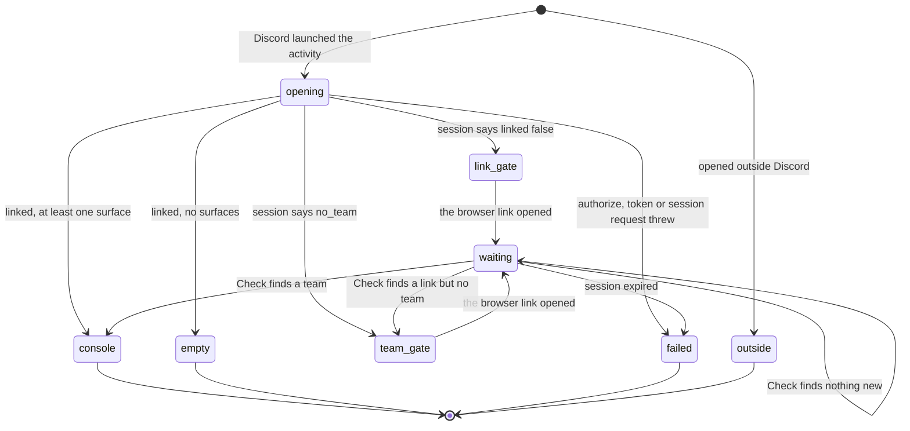

# The activity

## Summary

The activity is the portal's run console running inside Discord. It is the same `RunConsole` component the browser's run surface page uses, loaded from a separate entry point, sized to the pane Discord gives it, and told who the student is by their Discord account rather than by a portal session (`apps/portal/src/bootstrap.ts`, `apps/portal/src/activity-main.tsx`).

There are two ways in: the `launch` Entry Point command, answered with callback type 12 and no channel post (`apps/discord-bot/src/index.ts:97`), and any button whose custom id ends `:open_console` under `cog:surface:`, which the bot intercepts and answers the same way (`index.ts:104`). That button is "Watch live" on a running run bubble, and "Open live console" on the `/cog` home card when nothing outranks it.

Identity is a Discord user id in a signed cookie. The activity never sees a portal session. What it shows depends on whether that Discord id is linked to a portal account and whether the account is on a team.

No guild run of this build exists. The connect cards and the console are observed only as local fixtures in the browser, listed in Open questions.

## The simple case

A student presses "Watch live" on the run bubble in their team channel. Discord opens the activity and, for a moment, it reads "Opening the bench…" (`activity-main.tsx:274`).

Then the console appears under a header naming Cog\*Works and "{team} · live bench", with a select of recent runs labelled "{benchmark} · {short sha}" (`activity-main.tsx:88`, `:100`). The console leads with a status ("On the bench · evaluating", "Bench clear", "Run failed", or "Stopped before completion") and, on the right, a connection word: "Live", "Reconnecting…" or "Snapshot" while running, "Complete", "Stopped" or "Cancelled" once not (`apps/portal/src/components/RunConsole.tsx:85`, `:93`). Under the benchmark title sit the team, the runner's login, the short commit and elapsed time; then the current step with a progress bar; a four-cell lifecycle row (Local, Hosted, Official, Published); the event list headed "Live events"; and a side panel headed "Run reference" with the actions.

What the console shows is owned by [`../portal/watching-a-run.md`](../portal/watching-a-run.md). This document covers how the student gets there, under what identity, and what happens when it cannot open.

## The ask, event by event

```mermaid
stateDiagram-v2
    [*] --> outside : opened outside Discord
    [*] --> opening : Discord launched the activity
    opening --> failed : authorize, token or session request threw
    opening --> link_gate : session says linked false
    opening --> team_gate : session says no_team
    opening --> console : linked, at least one surface
    opening --> empty : linked, no surfaces
    link_gate --> waiting : the browser link opened
    team_gate --> waiting : the browser link opened
    waiting --> console : Check finds a team
    waiting --> team_gate : Check finds a link but no team
    waiting --> waiting : Check finds nothing new
    waiting --> failed : session expired
    console --> [*]
    empty --> [*]
    failed --> [*]
    outside --> [*]
```

### Asking

`open_console` rides on a button the platform put on a message, so it exists only in the course guild. `launch` is registered globally with user installation and every context (`apps/discord-bot/scripts/command-payloads.mjs:28`), so it can be invoked in a direct message or another server, where the guild check answers "Cog is only enabled inside the CogWorks course server." and nothing opens (`index.ts:98`).

The bundle runs the activity when the hostname is the activity hostname or ends in `.discordsays.com`, or the query string has `frame_id` (`bootstrap.ts:4`). Inside, it counts as embedded when the hostname ends in `.discordsays.com` or `frame_id` is present (`activity-main.tsx:34`). Embedded, API calls go to `/.proxy/api` through Discord's proxy; otherwise `/api`.

Not embedded, one card renders and nothing else runs:

> "Discord Activity
> ### Open the live bench from Discord.
> Use `/cog` in your team channel, then choose **Open live console**. Your linked Discord identity decides which team surfaces you can see." (`activity-main.tsx:264`)

with one link, "Open Cog\*Portal".

### How identity is established

Three requests and two cookies, before any run data.

1. `GET /activity/oauth/state` mints 24 random bytes as hex and stores them in the signed cookie `cog_activity_oauth_state` for ten minutes (`apps/portal/worker/routes/activity.ts:163`).
2. The Discord SDK authorizes with `response_type: "code"`, that state, `prompt: "none"` and `scope: ["identify"]` (`activity-main.tsx:222`).
3. `POST /activity/oauth/token` compares the state against the cookie, exchanges the code, reads `users/@me`, and writes `cog_activity_session` holding `{discordUserId}.{expiresAt}` for one hour, deleting the state cookie (`activity.ts:170`). The SDK is then authenticated with the returned access token (`activity-main.tsx:237`).

Over HTTPS both cookies are `httpOnly`, `Secure`, `SameSite=None`, `Partitioned` and `Priority=High`; over plain HTTP, which is local development only, `SameSite=Lax` and not `Secure` (`activity.ts:102`, `apps/portal/test/activity-auth.test.ts:11`). Requests go to `/.proxy/api` with `credentials: "same-origin"` (`activity-main.tsx:47`).

A refused exchange gets one of three sentences, chosen by Discord's `error` field (`activity.ts:74`):

- `invalid_grant`: "Discord would not accept that authorization. Close the Activity and open it again, and tell an instructor if it keeps happening."
- An error naming the portal's own credentials or request: "Discord turned down this Activity's sign-in, and reopening won't change that. Tell an instructor; the fix is on our side."
- Anything else, rate limits and edge failures included: "Discord did not answer this sign-in. Open the Activity again, and tell an instructor if it keeps happening."

A state mismatch reads "The Discord Activity authorization state expired." (`activity.ts:175`); a failed `users/@me` reads "Discord identity could not be loaded." (`:203`). Later requests reject a missing session cookie with "Open the Cog Activity again." and an expired or malformed one with "The Cog Activity session expired. Open it again." (`activity.ts:131`, `:134`), both 401.

### Answered without work

Embedded, these screens end the ask before any run is fetched. None writes anything except the gate cards, which mint a link token.

**Loading.** "Opening the bench…" with a live-marked square (`activity-main.tsx:274`).

**Startup error.** Anything thrown during the handshake:

> "Could not open
> ### The bench is still here.
> {the error's own sentence}" (`activity-main.tsx:277`)

The fallback is "Close the Activity and open it again." A rejection from the SDK's `authorize` call arrives with the SDK's own message.

**Not linked** (`apps/portal/src/components/ConnectGate.tsx:24`):

> "One connection
> ### Link Cog\*Portal to see your team's bench.
> Cog\*Portal knows you by your GitHub sign-in, which lives in your browser, so the link happens there."

One button, "Link Cog\*Portal ↗", opening the link through Discord's external-link command (`activity-main.tsx:143`). The session route creates that link with each read (`activity.ts:227`).

**Linked, no team** (`ConnectGate.tsx:34`): "One step left / ### You're linked, but not on a team yet. / Connect your fork in the browser to join or start your team." with "Finish team setup ↗" to `/connect` (`activity.ts:232`). The wire distinguishes the two as `false`, `"no_team"` and `true` (`activity.ts:27`).

**Coming back.** Once Discord reports the link opened, the card swaps its title to "Once you've linked it in the browser, check here." (or "Once you're on a team, check here.") and its button to "Check the link" (or "Check for your team"), with "Open the link again ↗" beneath (`ConnectGate.tsx:29`, `:39`, `apps/portal/src/lib/activity-gate.ts:48`). A check re-reads the session without relaunching. Linked with a team, the console replaces the card. Linked without a team, the team card replaces the link card. Unchanged, it says "Discord isn't linked to a portal account yet. Finish in the browser, then check again." or "You're linked, but we don't see a team for you yet. Finish in the browser, then check again." (`ConnectGate.tsx:32`, `:42`). An expired session sends the student to the startup card (`activity-main.tsx:167`).

> Technical note: a student who backs out of Discord's leave prompt gets `opened: false` and the card stays put; an older client that reports nothing is treated as having gone (`activity-gate.ts:48`, `apps/portal/test/activity-gate.test.ts:24`).

### The work begins

Opening the activity commits nothing beyond a session cookie that expires on its own and, for an unlinked student, a link token per session read.

Work begins at the console's confirmation. Verify hosted, promote, publish and rerun each open a dialog, and only its named button calls the portal: "Run it hosted", "Use attempt {n} of {limit}" or "Use an official attempt", "Publish", "Start a new run" (`RunConsole.tsx:287`). Retry has no dialog; its button calls the portal directly and reads "Retrying…" while it does (`RunConsole.tsx:361`). The sentences are quoted in [`../portal/watching-a-run.md`](../portal/watching-a-run.md).

### While it works

The console holds one WebSocket to the selected surface through the proxy prefix (`activity-main.tsx:256`). On close it reconnects after 1, 2, 4, then 8 seconds, capped (`apps/portal/src/lib/run-surface-stream.ts:61`). A frame that does not parse is dropped.

The event list follows the bottom while the student is there and stops following when they scroll up; later events are counted into "{n} new events", which scrolls down when pressed. Smooth scrolling is skipped under reduced motion (`RunConsole.tsx:230`, `:479`).

While a mutation runs its button reads "Working…" and every action button is disabled (`RunConsole.tsx:523`, `:530`).

The activity follows Discord's layout mode. In picture-in-picture or grid it renders compact (`activity-main.tsx:258`): the header select, the event list and the side panel go, which removes verify, promote, publish, rerun and "Open Cog\*Portal" (`RunConsole.tsx:436`). The status, failure reason, "See why it failed", Retry, the lifecycle row and the run history stay. The connect cards in compact keep only the title, the button and the status line (`ConnectGate.tsx:79`, `:100`).

### How it ends

A team with surfaces gets the console on the most recently updated one; the select holds the ten most recent (`activity.ts:253`). A team with none gets:

> "Bench ready
> ### No shared runs yet.
> Start with `cogworks run --live`. Cog will keep one message and this console current for the team." (`activity-main.tsx:340`)

A successful action puts the returned snapshot at the head of the list and selects it (`activity-main.tsx:325`). A failed one leaves the console and shows the portal's sentence in an alert under the header (`RunConsole.tsx:385`); the fallback is "That action could not be completed." (`activity-main.tsx:332`).

A failed hosted run shows "See why it failed", which opens `/runs/<id>` in the browser (`RunConsole.tsx:341`, `activity-main.tsx:313`). A failed local run has no run page and offers "Run again", which shows the `cogworks run --benchmark <id> --live` command (`RunConsole.tsx:350`, `:585`).

"Open Cog\*Portal" opens `/run-surfaces/<id>` in the browser through Discord's external-link command (`activity-main.tsx:309`). The activity posts nothing to Discord; the bubble is updated by the portal ([`channel-messages.md`](channel-messages.md)).

## Modifiers

| Modifier | Set before the ask | Changed while it works |
| --- | --- | --- |
| Who you are | The Discord account id decides the screen: unlinked gives the link card, linked without a team the team card, linked with a team the console. Any member can read the team's surfaces; a mutation re-resolves the actor and needs admin, maintain or write plus a live GitHub sign-in on the portal account (`activity.ts:272`, `apps/portal/worker/services/run-actions.ts:78`, `:125`). There is no instructor view. | Linking or joining in the browser is noticed when the student presses the check button. Without a press nothing changes. |
| Where your team and repository stand | No team gives the team card and no surfaces are fetched. No surfaces gives the bench-ready card. | New surfaces do not join the select until reopening, except one a mutation returned. |
| Which week's benchmark | Not chosen here. The select spans every benchmark the team has run. Hidden in compact. | Choosing another surface closes the stream and opens another. |
| Practice or leaderboard | The lifecycle row carries it. Each stage is read from its own run, so a run started in the browser shows Local as "–" (not run) through publication (`packages/contracts/src/schema.ts:796`, `RunConsole.tsx:82`). | Each action re-checks the portal's preconditions and a refusal is shown verbatim. |
| Flags, options, and where you are typing | Embedded or not decides the API prefix and whether the SDK exists. Layout mode decides compact. The client id, portal origin and activity hostname are compiled into the bundle (`apps/portal/src/env.client.ts`). | Layout mode changes live when Discord emits an update. |

## Cancel and interrupt

| Event | Before the work begins | While it works |
| --- | --- | --- |
| You stop it yourself | Closing the activity mid-handshake marks the effect inactive and sets nothing (`activity-main.tsx:247`). A cookie already written stays. In a confirmation, Escape, "Close" and a backdrop click close it without calling the portal (`RunConsole.tsx:576`). | Closing after the confirm does not stop the request. The result reaches the team through the run bubble. |
| You do something else mid-way | Choosing another surface tears down the WebSocket and opens another. | Action buttons are disabled while a mutation runs. A second action from chat or the browser can still start. |
| A teammate acts at the same time | The select is a snapshot from opening. | A teammate's change to the selected surface arrives through the stream. A teammate acting first makes this pane's action fail with the portal's sentence. |
| The network or the portal fails | A handshake failure becomes the startup card with the portal's or Discord's sentence. A failed check keeps the card and shows the error in its status line (`activity-main.tsx:169`). | A dropped socket reconnects with backoff while the header reads "Reconnecting…". A failed action shows its message and leaves the console live. |
| The page or the process goes away | Nothing is written yet. | The run outlives the pane. Reopening repeats the handshake, refetches the ten surfaces and selects the newest; the previous selection is not restored. |
| The thing being measured changes | Not applicable. A surface is about one commit. | A run reaching a terminal state changes the status word and folds the event list to its last three entries with a "Show all {n}" control, or "Show details" for a failure (`RunConsole.tsx:202`). |
| The platform refuses or credit runs out | An exhausted quota is not visible until an action is attempted. Retry is not offered without capacity. | The refusal arrives as written, for example "The official-attempt quota is exhausted." (`run-actions.ts:421`), in the alert. Nothing is spent. |

## Interactions with other systems

**Who may do this.** Anyone whose Discord account is linked to a portal account on a team. A surface from another team answers "Run surface not found." on every route (`activity.ts:267`, `:284`).

**The team owns it.** Every surface belongs to the team, and the header names it. The runner's login is the one personal detail.

**Credit.** Opening spends nothing. Verify says "This uses one of the team's shared practice runs." (`RunConsole.tsx:272`); promote names the attempt from `OFFICIAL_LIMIT` (`:274`). Neither says a failed execution uses none. See [credit and quota](../cross-cutting/credit-and-quota.md).

**What the portal claims.** The lifecycle row is the claim: Local is self-reported, the rest observed. See [`../foundations/what-the-portal-claims.md`](../foundations/what-the-portal-claims.md).

**What the benchmark supplied.** Not on the run-surface contract.

**Live updates and reconnection.** One WebSocket per selected surface with the backoff above. See [`../cross-cutting/live-updates.md`](../cross-cutting/live-updates.md).

**Discord.** Launched from the bubble's "Watch live", the home card's "Open live console", or `launch`. The link card hands off to the portal's Connections page, which afterwards tells the student to "choose **Check the link** in the Activity, or run **/cog** again" (`apps/portal/src/routes/ConnectionsPage.tsx:147`).

**Configuration.** The worker needs a Discord client id, client secret and activity session secret, and answers 501 "Discord Activity authentication is not configured." without them (`activity.ts:93`).

## Edge cases

- **`prompt: "none"` means no consent screen.** A student who has never authorized the application gets a rejection from the SDK, which lands on the startup card with Discord's message and nothing to press (`activity-main.tsx:226`).
- **An activity link is recorded as "Discord user".** The session route stores that literal as the link's username (`activity.ts:227`), and the portal shows it: the consent panel reads "Connect Discord user to Cog?" (`ConnectionsPage.tsx:89`) and the linked account row is named "Discord user" (`apps/portal/worker/routes/connections.ts:123`). The bot stores "Ada (@student)" (`apps/discord-bot/src/commands.ts:92`).
- **Each check mints a link.** Every session read for an unlinked student creates a new ten-minute link token (`activity.ts:227`); "Open the link again" opens the newest.
- **Past an hour the stream cannot come back.** The session cookie lasts an hour (`activity.ts:19`). A socket already open keeps working, but once it drops, every upgrade is refused with 401 (`activity.ts:281`) and the header reads "Reconnecting…" indefinitely without naming the expired session.
- **Compact removes most actions** with nothing saying they exist in the focused layout.
- **A cancelled stage is drawn two ways.** The console marks it "×" with the label "stopped" (`RunConsole.tsx:80`); the Discord rail draws it as pending (`packages/discord-kit/src/rails.ts:25`). No code path produces `cancelled`.
- **The stream route needs an upgrade header.** A plain GET answers 426 "Expected a WebSocket upgrade." (`activity.ts:286`), unreachable from the pane.
- **The not-embedded card names a button that is often absent.** Home offers "Open live console" only when no retry, publish, promote or verify outranks it (`commands.ts:138`).

## Open questions and verification

- **No guild evidence.** No artifact shows the activity inside Discord on any build: not the handshake, the cookies through the proxy, the WebSocket upgrade through the proxy, layout modes, or `openExternalLink`.
- **Local fixture evidence covers components, not the activity.** The link card's first and returning states render at 360px in the development gallery with inert buttons (`/tmp/cogshots/smoke/gal-Activity_connect_gat.png`, local, close to `2ff32fa`). The console component renders a failed hosted run with "See why it failed", Retry and Local "–" on the browser run surface page (`/tmp/cogshots/matched/pairs/b-run-surface-desk.png`, right half, local fixture). Neither was inside Discord.
- **The not-embedded card was not reached.** The local probe opened `/?frame_id=smoke` (`/tmp/cogshots/smoke.mjs:76`), which counts as embedded, so `new DiscordSDK` threw "instance_id query param is not defined" at module load and the page was blank (`/tmp/cogshots/smoke/log.txt:26`, `activity-360.png`; `activity-main.tsx:38`). A real launch carries `instance_id`; the card a student sees outside Discord (no `frame_id`) is unobserved.
- **`prompt: "none"` with no recovery** and **the "Discord user" placeholder** are read from code. Both are in Edge cases.
- **The activity and the bot disagree about errors.** The activity shows the portal's sentence; the bot replaces it (`apps/discord-bot/src/index.ts:46`).
- **Two confirmations for one action.** The console's verify reads "Run {sha} on the hosted benchmark? This uses one of the team's shared practice runs." and rerun reads "Start a new hosted lifecycle at this exact commit? The current result stays unchanged." (`RunConsole.tsx:272`, `:277`), while `/cog` uses different headings, sentences and button labels for the same actions (`commands.ts:551`, `:572`).
- Hosted beta (`4984730`) differs: its console confirms every action with a bare "Confirm" (beta `RunConsole.tsx:566`; candidate `RunConsole.tsx:597` names the consequence), writes promote as "Use official attempt {n} of 3", with a dash glyph in place of the number when no attempt remains (beta `:271`; candidate `:274` reads `OFFICIAL_LIMIT`), has no "See why it failed" link (candidate `:341`), and reads "Safe event stream", "Waiting for the first structured event." and "Runs the same submission again." (beta `:414`, `:450`, `:347`; candidate `:440`, `:476`, `:373`). The identity routes and the gate logic are identical: beta `98eecac` and candidate `835013f` are the same patch to `apps/portal/worker/routes/activity.ts`, and `activity-gate.ts` matches byte for byte.

Read against Cog\*Portal commit `2ff32fa`.
