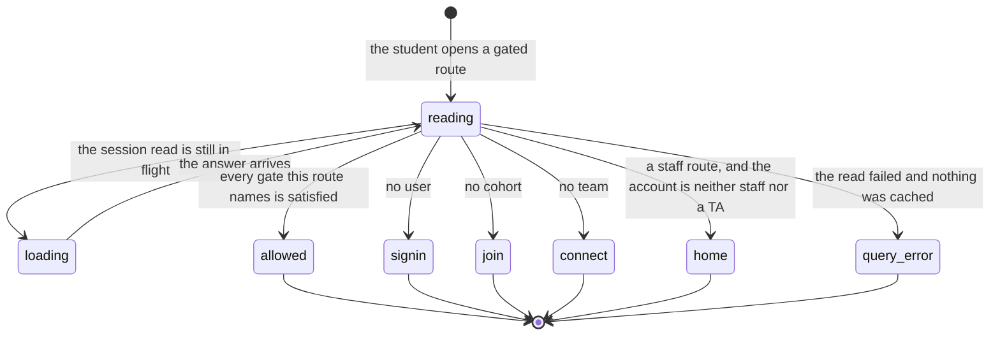

# Identity and roles

## Summary

Cog\*Portal answers three separate questions about a person, in three places, at three different moments: which account is this, which team's work may it act on, and may it see the instructor's view. This document owns all three. It defines the three identities a student can hold at the same time (a browser session, a linked device, a Discord account), the two role ladders stacked on top of them, and what the portal does at the instant somebody arrives on a page that is not theirs.

There is no page called "identity and roles". The subject surfaces as a redirect nobody asked for, a `VERIFIED` chip on the connections page, and a 403 sentence in a terminal. What a team is, and why membership works the way it does, belongs to [`the-team-and-the-repository.md`](the-team-and-the-repository.md); this document stops at who the actor is.

## The simple case

A student opens the portal, presses "Continue with GitHub", and comes back signed in. The portal now knows one thing about them: a GitHub login. It knows no cohort and no team, so the first gated page they touch sends them to `/join`, and the next one sends them to `/connect`. Once both are answered, every team page renders and stays rendered.

Later they type `cogworks link` in a terminal. A code appears, a browser tab opens, they name the device and press "Approve device", and the terminal writes a token to `~/.cogbench/config.json`. That token is a second identity for the same account, with its own sixty day expiry and its own Revoke button. Signing out of the browser does not touch it.

## The three identities

**The browser session.** A Better Auth cookie session, created by GitHub OAuth or, on a development deployment only, by the local sign-in form. `getAuth` turns the cookie into an account and then reads two more facts in the same round trip: the cohort the account joined, and the single team it belongs to (`apps/portal/worker/auth/session.ts:129`). The payload the browser receives carries the login, the platform role, an `isOwner` flag, and an `isTa` flag. It does not carry the team role, so nothing in the browser can gate on admin, maintainer, or member without asking the team endpoint.

**The device token.** Sixty days long, prefixed `cog_`, one per portal origin. `requireDevice` accepts a request only when the `Authorization` header starts with `Bearer cog_`, the token's hash matches a `cli_devices` row, the row has not expired, and the row was never revoked (`apps/portal/worker/auth/device.ts:16`). A request with no such header gets "A linked CogBench device token is required."; one carrying a dead token gets "This CogBench connection expired or was revoked." Every accepted request stamps `lastUsedAt`, which is the "Last used" line on the connections page.

**The Discord account.** One row mapping a Discord user id to a portal user, unique on both columns (`apps/portal/worker/db/schema.ts:395`, `:400`). It is created only by pasting a one-time link into the connections page and pressing "Connect Discord", and either side can delete it.

The three do not have to agree, and nothing reconciles them. A student can be signed in to the browser as one GitHub account, linked in the terminal as another, and connected to Discord as a third. Each surface reports its own and says nothing about the others. See [`the-ask.md`](the-ask.md#edge-cases).

## The two role ladders

They are independent. Neither reads the other.

**The platform role** is `student` or `staff`, and it is computed per request from a login rather than stored on the account. `platformRole` returns `staff` when the login appears in `PLATFORM_OWNER_LOGINS` or on the `platform_staff` roster table, and `student` otherwise (`apps/portal/worker/auth/roles.ts:73`). Owners come from the environment and deliberately not from the database, so nobody who can write the roster can mint an owner, and so a fresh database still has somebody who can add the first row. Separately, a student assigned as a team's TA in `team_tas` is treated as staff by the browser gate while `platformRole` still reads `student` for them.

The login a role is checked against is not always the login on screen. `authorizationLogin` returns the GitHub login, or the account's own name when development auth is enabled, or an empty string (`apps/portal/worker/auth/session.ts:52`). An empty login never reaches the roster query, because a query for `""` is a round trip that can only miss (`roles.ts:55`). Every roster path lowercases the login first, since GitHub treats logins case-insensitively.

**The team role** is `admin`, `maintain`, or `write`, written from the caller's GitHub permission on the team repository at the moment they joined. `teamRole` passes GitHub's `admin`, `maintain`, and `write` through, maps `push` to `write`, and maps everything else to nothing at all, which is the refusal (`apps/portal/worker/github/permissions.ts:3`). The team page prints the three as "admin", "maintainer", and "member" (`apps/portal/src/routes/TeamPage.tsx:31`). What each may do is [`the-team-and-the-repository.md`](the-team-and-the-repository.md#roles-on-a-team).

Staff is not a team role. An instructor on a team is whatever their GitHub permission made them, and a team admin holds no platform privileges at all.

## The ask, event by event

The ask this document narrates is arriving on a gated page: the route changes, the portal works out who is asking, and either the page renders or the student lands somewhere they did not choose.

### Asking

The route names which gate it wants and nothing else. `RequireStage` takes one of `user`, `cohort`, or `team`; `/join` asks for `user`, `/connect` asks for `cohort`, and `/setup`, `/dashboard`, `/team`, `/connections`, `/runs/:runId`, and `/run-surfaces/:surfaceId` all ask for `team` (`apps/portal/src/App.tsx:98`). `/admin` uses `RequireStaff` instead. `/`, `/leaderboard`, and `/signin` are ungated, and so is the 404 route.

Both gates read one query, `useSession`, cached for 60 seconds and not refetched when the window regains focus (`apps/portal/src/lib/queries.ts:24`, `apps/portal/src/App.tsx:27`). Nothing else is consulted. The gate cannot see a team role, a device, or a Discord link.

### Answered without work

Five ways the ask ends before the page mounts, in the order `RequireStage` tests them (`apps/portal/src/App.tsx:41`):

- The read is pending: a `LoadingMark`, which is not an answer yet.
- The read failed and nothing is cached: a `QueryError` card with a Retry. A warm tab keeps its cached session and falls through to the checks below instead, which is why a session outage does not eject somebody mid-task.
- No user: `Navigate` to `/signin`.
- The route wanted a cohort and there is none: `Navigate` to `/join`.
- The route wanted a team and there is none: `Navigate` to `/connect`.

Every redirect uses `replace`, so the back button returns to wherever the student came from rather than bouncing off the gate again.

`RequireStaff` has its own four (`apps/portal/src/App.tsx:75`): error with no cached session is a `QueryError`; pending or absent is a `LoadingMark`; no user is `/signin`; and anything that is not `platformRole === "staff"` and not `isTa` is a `Navigate` to `/`, with no message anywhere. A student who follows a link to `/admin` arrives on the marketing page with no explanation. That is a defect, not a decision, and it is carried to triage.

Nothing is written on any of these paths. No row, no cookie, no analytics event. The one exception is deliberate: a signed-out arrival at `/connections` stores the full path in `sessionStorage` so sign-in can send the student back to the device code they were holding, and a signed-in arrival that still owes a cohort or a team stores the fact that a link was dropped, so the destination page can say what happened (`apps/portal/src/lib/pending-return.ts:30`).

### The work begins

A gate never reaches this moment. Deciding who somebody is commits nothing.

Three asks in this area do commit, and each names its own moment:

- **A device link.** The token is written to the config file after the browser approval, not before, and `save_token` writes it through a `.tmp` file and `os.replace` so a killed process cannot leave a half-written config (`python/cogbench/src/cogbench/storage.py:44`). Owned by [`terminal/link.md`](../terminal/link.md).
- **A Discord confirm.** The one-time token is marked consumed before the account row is created, so two confirms of the same link serialize (`apps/portal/worker/routes/connections.ts:111`).
- **A device approval.** The `device_authorizations` row gains a `userId`, a device name, and an `approvedAt`, which is what lets the terminal's next poll mint a token.

### While it works

For a gate, nothing. The session query resolves and the branch is taken in one render.

For the device link, the terminal polls `/api/v1/cli/device/token` every 5 seconds until the ten minute authorization expires, printing nothing between polls (`python/cogbench/src/cogbench/client.py:78`). The browser page polls the connections summary every 4 seconds and stops only once at least one device exists, so a student parked on that page with no device polls indefinitely (`apps/portal/src/lib/queries.ts:120`).

### How it ends

A gate ends by rendering the child or by replacing the URL. Nothing is committed either way, and reloading the destination re-runs the same decision from scratch.

The device link ends with a token on disk, a line naming the machine, and an exit code of 0: "Linked {name}. Local commands still work offline." (`python/cogbench/src/cogbench/cli.py:668`). When the command was run outside a git worktree it also prints, on stderr, that the device is linked but the student should change into the team project first.

The failure path for the device link is a portal sentence, not a status: an approval that never arrived within ten minutes raises "The device link expired before it was approved." (`python/cogbench/src/cogbench/client.py:88`), and a code that was already used raises "The device code is invalid, expired, or already used." (`apps/portal/worker/routes/connections.ts:212`).

## Modifiers

| Modifier | Set before the ask | Changed while it works |
| --- | --- | --- |
| Who you are | The entire subject. Signed out reaches `/`, `/leaderboard`, and `/signin` and nothing else. A signed-in student reaches every team route once a cohort and a team exist. Staff and TAs additionally reach `/admin`, and the nav shows the link only to them (`apps/portal/src/components/Shell.tsx:61`). A team role changes nothing about which routes render. | The session is cached for 60 seconds and is not refetched on window focus, so a role granted or revoked elsewhere is invisible for up to a minute and does not arrive when the student returns to the tab. A staff grant taking effect looks like nothing happening. |
| Where your team and repository stand | This is what the stage cascade tests. No cohort sends every route above `user` to `/join`; no team sends every `team` route to `/connect`. A team always has a repository, so "a team with no repository" is not a state a gate can see. | A teammate adding this student to a team does not release the gate until the session query refetches. The student sees `/connect` until then, with no sign that the answer has already changed. |
| Which week's benchmark | No effect. No gate reads a benchmark, and no identity is scoped to one. | No effect. |
| Practice or leaderboard | No effect on identity. `/leaderboard` is ungated and renders for a signed-out visitor. | No effect. |
| Flags, options, and where you are typing | Each surface carries a different identity. In the browser it is the cookie. In the terminal it is the token for the resolved portal origin, which `--portal` can override for one invocation without changing which portal is active. In Discord it is the linked account, and a Discord user with no link gets "Link Discord to Cog\*Portal first." (`apps/portal/worker/services/run-actions.ts:61`). | No effect. Each surface reads its identity once per request. |

## Cancel and interrupt

| Event | Before the work begins | While it works |
| --- | --- | --- |
| You stop it yourself | Navigating away during a gate's session read leaves nothing behind; the query resolves into a cache nobody reads. Ctrl+C during `cogworks link` before approval prints `cogworks: interrupted` and exits 130, leaving an approved-or-not authorization row that expires on its own in ten minutes. | Ctrl+C after the browser approval but before the token is written loses the token permanently: the authorization was consumed by the poll that fetched it, so the next `cogworks link` must start a new code. The row is gone and the config file was never touched. |
| You do something else mid-way | Opening a second tab is independent; both read the same cookie. Running `cogworks link` twice starts two authorizations, and each is approved separately. | Approving a second device code in the same browser tab replaces the `user_code` in the URL, and the page drops the consumed code from the query string so a reload cannot re-offer a form for a code the portal already spent (`apps/portal/src/routes/ConnectionsPage.tsx:153`). |
| A teammate acts at the same time | A teammate adding this student to a team while they sit on `/connect` changes the answer, but the gate does not learn it until the session cache expires. | No effect on an in-flight link. A device belongs to an account, not to a team. |
| The portal fails | A failed session read with nothing cached shows the `QueryError` panel, whose copy depends on what failed: "The request never reached the portal, so nothing was lost. Check your connection, then try again." for a request that never left the browser, and "Your session ended, so the portal no longer recognizes this browser. Sign in again to continue." for a 401 (`apps/portal/src/lib/query-error-state.ts:87`, `:122`). A warm tab keeps rendering from cache. | The device-link poll does not retry: `poll_device_link` calls `request_json` with `retry` left false, so a single 502 mid-poll ends the link with a portal error rather than being retried (`python/cogbench/src/cogbench/client.py:78`). `cogworks status` does retry, because `device_status` passes `retry=True`. |
| The process goes away | Closing the tab discards the pending return the gate stored, since it lives in `sessionStorage`. Closing the terminal before approval leaves an authorization row that expires unused. | Closing the browser after approving but before the terminal polls is harmless: the approval is durable, and the next poll mints the token. Closing the terminal at the same moment is not: the approval stays consumed and the token is lost. |
| The thing being measured changes | A session that expires between the gate's decision and the page's first request produces a `QueryError` on the page rather than a redirect, because `RequireStage` already let the render through. | A device token that expires mid-session is judged twice, and the two judgements can disagree. The CLI treats a token as absent once its stored `expiresAt` is at or before now on the local clock (`python/cogbench/src/cogbench/storage.py:71`); the portal judges the same token against its own. A laptop whose clock runs fast sends the student to re-link a live token. |
| Refused, or out of credit | No credit is consulted. Identity is free. | No effect. Nothing in this area spends anything. |

## Interactions with other systems

**Who may do this.** Establishing an identity needs nothing but the identity itself. Reading it is unrestricted: `GET /session` answers for a signed-out browser with a payload of nulls rather than a 401 (`apps/portal/worker/routes/session.ts:23`). Acting on a team needs a team; `requireTeam` refuses with "Connect a repository to continue." (`apps/portal/worker/auth/session.ts:174`). Reaching staff endpoints needs the roster or a TA assignment; `requireStaff` refuses with "Staff access required." (`apps/portal/worker/auth/roles.ts:99`). The browser gate for the same surface says nothing at all, which is the mismatch flagged above.

**The team owns it.** An identity belongs to a person, and it is the only thing on the platform that does. Everything an identity is used for belongs to the team. Approving a device requires a team, so the device is personal but its usefulness is not.

**Credit.** None. No identity operation spends or reports credit.

**What the portal claims.** The connections page marks a GitHub identity `VERIFIED` because the portal watched the OAuth handshake, and marks nothing else. A device name is whatever the student typed and is never presented as a fact the portal checked. See [`what-the-portal-claims.md`](what-the-portal-claims.md#verified).

**What the benchmark supplied.** Nothing. No benchmark is loaded on any identity path.

**Live updates and reconnection.** Two polls, both described above: the connections summary every 4 seconds until a device exists, and the device token every 5 seconds until the ten minute authorization expires. Neither reconnects; both simply ask again.

**Discord.** The Discord identity is the weakest of the three and the only one that can be started from outside the portal. `/cog` in the course server produces a link containing a one-time token in the URL fragment, which the connections page reads from `window.location.hash` and never sends in a query string (`apps/portal/src/routes/ConnectionsPage.tsx:18`). An expired link says so: "This Discord link has expired. Open /cog in the course server to get a new one." (`apps/portal/worker/routes/connections.ts:66`).

**Configuration.** Which identity paths exist is a deployment property, published to the browser as `authConfig` (`apps/portal/worker/auth/session.ts:87`). GitHub sign-in requires both a client id and a secret, and configuring one without the other is a startup error rather than a degraded mode (`apps/portal/worker/auth/better-auth.ts:13`). Development sign-in requires `ENVIRONMENT=development`, `DEV_AUTH=enabled`, and GitHub unconfigured together, so there is no deployment where both paths are live and no real identity to impersonate.

## Edge cases

- **A development account has no GitHub login at all.** The dev login route nulls `github_login` immediately after creating the account, because that column is uniquely indexed and a real row may already hold the same name (`apps/portal/worker/routes/session.ts:55`). Everything downstream falls back to the email's local part, so the same person reads as `staffy` on the team page and as `@staffy` under a `GitHub` label in `cogworks status`, having never touched GitHub.
- **Account linking is off.** `accountLinking: { enabled: false }` (`apps/portal/worker/auth/better-auth.ts:87`). A student who signs in with a second GitHub account gets a second portal account, with its own cohort and its own team membership, and nothing on either says the two are the same person.
- **Three queries ask "which team is this user on" and tie-break three different ways.** `getAuth` orders by team id (`auth/session.ts:155`), the device status route orders by nothing at all (`routes/connections.ts:309`), and the membership helper orders by team name (`routes/team-membership.ts:50`). The unique index on `team_members.userId` makes at most one row exist, so all three agree today; the divergence is latent rather than live.
- **The staff roster is read on every session.** `authToSession` runs the TA lookup and the roster read together on every `/session` call (`auth/session.ts:106`). A role granted on the admin page therefore takes effect on the next session read, not on the next sign-in.
- **A cancelled GitHub sign-in is distinguished from a failed one by a substring.** Better Auth and GitHub both spell a cancellation with `denied`, so the sign-in page shows "GitHub sign-in was cancelled. Sign in again when you're ready." when the error code contains that word and "GitHub sign-in failed. Try again." otherwise (`apps/portal/src/routes/SignInPage.tsx:94`). The page does not claim to know which kind of failure the second one was.
- **The unconfigured sign-in button explains itself in text, not in a tooltip.** A disabled control takes no focus and has no hover on touch, so the reason sits in a visible paragraph: "GitHub sign-in isn't configured. Ask course staff to enable it." (`apps/portal/src/routes/SignInPage.tsx:85`).
- **Approving the same device code twice succeeds.** A reload re-offers the form while the code is still in the URL, so the route treats a second approval by the same user as success rather than as an error, but only while the code is still linkable (`apps/portal/worker/routes/connections.ts:204`). An approved code the terminal never consumed before expiry falls through to the refusal, because promising that the terminal will finish linking would be false.
- **Revoking is one click and removing a teammate is two.** The connections page fires Revoke and Unlink on a single press with no confirmation (`apps/portal/src/routes/ConnectionsPage.tsx:225`, `:259`), while removing a teammate arms and then confirms (`apps/portal/src/routes/TeamPage.tsx:304`). The destructive action that cannot be undone from the same screen is the one with no guard.

## Open questions and verification

- `RequireStaff` sends a non-staff account to `/` with no message (`apps/portal/src/App.tsx:83`), while the matching worker gate answers "Staff access required." (`apps/portal/worker/auth/roles.ts:99`). A TA whose assignment was removed, or a student following a link staff pasted in a channel, lands on the marketing page and cannot tell whether the page is gone, broken, or forbidden. Treat as a bug. **Unverified** against a running portal.
- The device-link poll passes no `retry` flag, so one retryable 5xx during the ten minute wait ends the link (`python/cogbench/src/cogbench/client.py:78`). Every other portal call the CLI makes on this path retries. Looks like an omission rather than a decision; carried to triage.
- `GET /v1/cli/device/status` with a `user_code` query is gated on being signed in but not on owning the code (`apps/portal/worker/routes/connections.ts:322`), so any signed-in account can learn whether an arbitrary code is valid and approved. The code carries 48 bits of entropy and lives ten minutes, so this is a small leak rather than a hole, but the check that is missing is the cheap one.
- The connections page polls every 4 seconds indefinitely while no device is linked (`apps/portal/src/lib/queries.ts:120`). Already raised in [`the-ask.md`](the-ask.md#open-questions-and-verification); repeated here because this is the page it happens on.
- Whether an expired `device_authorizations` row is ever deleted was not established. No cleanup path was found, and the table has no index on `expiresAt`.
- The glossary defines *Instructor* but the code says `staff`, and it has no entry for a TA or for the three team roles. Those words are used in this document as the code and the interface spell them. A glossary addition is owed.
- Whether the 60 second session cache produces a visible lag after an admin grants staff was not measured. **Unverified.**

Verified against Cog\*Portal commit `f74e087`.
