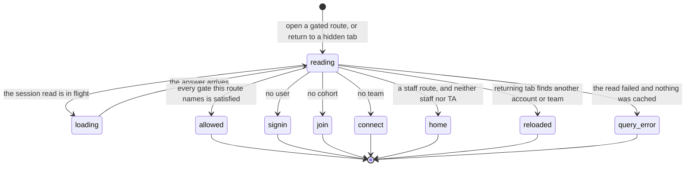

# Identity and roles

## Summary

Cog\*Portal answers three questions about a person: which account is this, which team's work may it act on, and may it see the instructor's view. This document owns all three. It defines the three identities a student can hold at the same time (a browser session, a linked device, a Discord account), the two role systems that sit on top of them, and what the portal does when somebody arrives on a page that is not theirs or returns to a tab after someone else signed in.

There is no page called "identity and roles". The subject surfaces as a redirect nobody asked for, a "Verified by GitHub sign-in" line on the Connections page, a loading mark over a page the student was just reading, and a 403 sentence in a terminal. What a team is belongs to [`the-team-and-the-repository.md`](the-team-and-the-repository.md); this document stops at who the actor is.

## The simple case

A student opens the portal, presses "Sign in with GitHub", and comes back signed in on `/signin`, which sends them straight to the step they owe: `/join` with no cohort, `/connect` with no team, `/dashboard` (the Runs tab) with both (`apps/portal/src/App.tsx:34`). A four-step rule at the top of each onboarding page, "Sign in", "Cohort", "Team", "Set up", shows where they are (`apps/portal/src/components/OnboardingPath.tsx:16`).

Later they type `cogworks link --portal {origin}` in a terminal. A code appears, a browser tab opens on Connections, they check the code, name the device and press "Approve device", and the terminal writes a token to `~/.cogbench/config.json`. That token is a second identity for the same account, with its own sixty day expiry and its own Revoke control. Signing out of the browser does not touch it.

## The three identities

**The browser session.** A Better Auth cookie session, created by GitHub OAuth or, on a development deployment only, by the development sign-in form. `getAuth` turns the cookie into an account and reads the cohort and the single team in the same round trip, ordering memberships by team id (`apps/portal/worker/auth/session.ts:128`, `:154`). The payload the browser receives carries the login, the platform role, an `isOwner` flag and an `isTa` flag (`session.ts:113`). It does not carry the team role, so nothing in the browser gates on admin, maintainer or member without asking the team endpoint.

**The device token.** Sixty days long, prefixed `cog_`, one per portal origin (`apps/portal/worker/routes/connections.ts:39`). `requireDevice` accepts a request only when the header starts with `Bearer cog_`, the hash matches a `cli_devices` row, and the row is neither expired nor revoked. With no header the answer is "A linked CogBench device token is required." (`apps/portal/worker/auth/device.ts:19`); with a dead one, "This CogWorks connection expired or was revoked. Run `cogworks link` to connect this machine again." (`device.ts:38`). Every accepted request stamps `lastUsedAt`, which is the "Last used" line on Connections.

**The Discord account.** One row mapping a Discord user to a portal user, unique on the portal user (`apps/portal/worker/db/schema.ts:441`). It is created only by opening the private link `/cog` sends, which lands on Connections, and pressing "Connect Discord". Both the preview and the confirm require a team (`connections.ts:59`, `:76`).

The three do not have to agree, and nothing reconciles them. A student can be signed in to the browser as one GitHub account, linked in the terminal as another, and connected to Discord as a third. Each surface reports its own.

## The two role systems

They are independent. Neither reads the other.

**The platform role** is `student` or `staff`, computed per request from a login rather than stored. `platformRole` returns `staff` when the login is in `PLATFORM_OWNER_LOGINS` or on the `platform_staff` roster (`apps/portal/worker/auth/roles.ts:66`). Owners come from the environment and never from the database, so nobody who can write the roster can mint an owner. A student assigned as a team's TA is treated as staff by the browser gate while `platformRole` still reads `student` for them. The login a role is checked against is the GitHub login, or the account name when development auth is enabled, or an empty string (`session.ts:52`).

**The team role** is `admin`, `maintain`, or `write`, written from the caller's GitHub permission when they joined. `teamRole` passes the three through, maps `push` to `write`, and maps everything else to null, which is a refusal (`apps/portal/worker/github/permissions.ts:3`). The team page labels `admin` as "Admin" and `maintain` as "Maintainer" and gives `write` no label (`apps/portal/src/routes/TeamPage.tsx:34`). What each may do is in [`the-team-and-the-repository.md`](the-team-and-the-repository.md#roles-on-a-team).

Staff is not a team role. An instructor on a team is whatever their GitHub permission made them, and a team admin holds no platform privileges.

## The ask, event by event

The ask is arriving on a gated page, or coming back to one: the route changes or the tab becomes visible, the portal works out who is asking, and either the page renders or the student lands somewhere they did not choose.

```mermaid
stateDiagram-v2
    [*] --> reading : open a gated route, or return to a hidden tab
    reading --> loading : the session read is in flight
    loading --> reading : the answer arrives
    reading --> query_error : the read failed and nothing was cached
    reading --> signin : no user
    reading --> join : no cohort
    reading --> connect : no team
    reading --> home : a staff route, and neither staff nor TA
    reading --> reloaded : returning tab finds another account or team
    reading --> allowed : every gate this route names is satisfied
    allowed --> [*]
    signin --> [*]
    join --> [*]
    connect --> [*]
    home --> [*]
    reloaded --> [*]
    query_error --> [*]
```

### Asking

The route names one gate. `RequireStage` takes `user`, `cohort`, or `team`: `/join` asks for `user`, `/connect` for `cohort`, and `/connections`, `/setup`, `/dashboard`, `/team`, `/runs/:runId` and `/run-surfaces/:surfaceId` for `team` (`apps/portal/src/App.tsx:113-176`). `/admin` uses `RequireStaff` (`App.tsx:177`). `/`, `/leaderboard`, `/signin` and the 404 route are ungated.

Both gates read one query, `useSession`, fresh for 60 seconds (`apps/portal/src/lib/queries.ts:25`). Window focus does not refetch it (`App.tsx:28`), but the restore gate does: whenever the document becomes visible again or is restored from the back/forward cache, `RestoreGate` cancels any session read in flight and fetches a fresh one with `staleTime: 0` (`apps/portal/src/components/RestoreGate.tsx:71-84`, `:135-156`).

### Answered without work

In the order `RequireStage` tests them (`App.tsx:49-79`):

- The read is pending: a loading mark.
- The read failed and nothing is cached: a `QueryError` card with a retry. A warm tab keeps its cached session and falls through to the checks below.
- No user: replace to `/signin`.
- The route wanted a cohort and there is none: replace to `/join`.
- The route wanted a team and there is none: replace to `/connect`.

`RequireStaff` shows the error card or a loading mark the same way, sends no user to `/signin`, and sends anyone who is neither `staff` nor a TA to `/` with no message (`App.tsx:95-96`).

Nothing is written on any of these paths, with two deliberate exceptions in `sessionStorage`. A signed-out arrival at `/connections?user_code=…` or `/connections#discord=…` is stored so sign-in can return there (`App.tsx:69-71`, `apps/portal/src/lib/pending-return.ts:3`). A signed-in arrival at the same addresses that still owes a cohort or a team is recorded as a dropped link, and the stored return is cleared (`App.tsx:74-77`, `pending-return.ts:31-40`); `/join` and `/connect` then show "Your device link is on hold" or "Your Discord link is on hold" with the way back (`apps/portal/src/components/DroppedLinkNotice.tsx:27`, `:36`).

### The work begins

A gate never reaches it, because deciding who somebody is commits nothing. Three asks in this area do commit, each owned elsewhere:

- **A device link.** The terminal writes its token only after the browser approval ([`terminal/link.md`](../terminal/link.md)).
- **A device approval.** The `device_authorizations` row gains a user, a name and an `approvedAt` (`connections.ts:170-213`).
- **A Discord confirm.** The one-time token is consumed before the account row is written, so two confirms of one link serialize (`connections.ts:75-138`).

### While it works

For a first arrival, nothing; the branch is taken in one render. For a returning tab, the restore gate keeps account-bound content mounted but invisible, inert and hidden from assistive technology, with a loading mark pinned over it, until the fresh read answers (`RestoreGate.tsx:209-249`). Public pages (the landing page, the leaderboard, sign-in) stay painted; only the header's account slot and team name are withheld. If that read fails, the header says "Couldn't check who's signed in." with a "Try again" button (`RestoreGate.tsx:290`, `:304`).

### How it ends

A gate ends by rendering the child or replacing the URL. A returning tab ends one of three ways: the same login and team gets the same mounted page back, with every other query invalidated after a back/forward restore (`RestoreGate.tsx:102-108`); a different login or team reloads the whole document so nothing from the old account outlives it (`RestoreGate.tsx:92-100`); a failed read leaves the page concealed under the error card until a retry succeeds.

## Modifiers

| Modifier | Set before the ask | Changed while it works |
| --- | --- | --- |
| Who you are | The entire subject. Signed out reaches `/`, `/leaderboard`, `/signin` and the 404 page. A student reaches every team route once a cohort and a team exist. Staff and TAs also reach `/admin`, and the header shows them an "Admin" tab (`apps/portal/src/components/Shell.tsx:68`). Staff without a team still pass through the student stages everywhere except `/admin`: `/connections` and `/setup` send them to `/join` or `/connect`. | A role granted elsewhere reaches this tab on the next session read, which the restore gate forces the next time the tab is hidden and shown. A platform role change keeps the page; a change of login or team reloads it. |
| Where your team and repository stand | What the `RequireStage` checks test. A team always has a repository, so "a team with no repository" is not a state a gate can see. | A teammate adding this student to a team while they sit on `/connect` is invisible until the session is read again. Returning to the tab after it happens reloads the document, because the team id changed (`RestoreGate.tsx:20-26`). |
| Which week's benchmark | No effect. No gate reads a benchmark. | No effect. |
| Practice or leaderboard | No effect on identity. `/leaderboard` is ungated. | No effect. |
| Flags, options, and where you are typing | Each surface carries its own identity: the cookie in the browser, the token for the resolved portal origin in the terminal, the linked account in Discord. A Discord user with no link gets "Link Discord to Cog\*Portal first." (`apps/portal/worker/services/run-actions.ts:71`). | No effect. Each surface reads its identity once per request. |

## Cancel and interrupt

| Event | Before the work begins | While it works |
| --- | --- | --- |
| You stop it yourself | Navigating away during a gate's read leaves nothing behind. Ctrl+C during `cogworks link` before approval exits 130 and leaves an authorization row that expires in ten minutes (`connections.ts:38`). | Ctrl+C after the browser approval but before the terminal's next poll leaves an approved, unconsumed code. The approval page treats a second approval of it as success only while the code is still linkable (`connections.ts:188-210`). |
| You do something else mid-way | A second tab reads the same cookie. Running `cogworks link` twice starts two authorizations. | Approving a device drops `user_code` from the address so a reload cannot re-offer a spent code (`apps/portal/src/routes/ConnectionsPage.tsx:176-180`). |
| A teammate acts at the same time | Membership changes made by someone else reach this tab only on the next session read. | No effect on an in-flight link; a device belongs to an account. |
| The network or the portal fails | A failed read with nothing cached shows the error card: "The request never reached the portal, so nothing was lost. Check your connection, then try again." or, for a 401, "Your session ended, so the portal no longer recognizes this browser. Sign in again to continue." (`apps/portal/src/lib/query-error-state.ts:93`, `:128`). A warm tab keeps rendering from cache. | The restore gate's read runs with `networkMode: "always"`, so an offline return fails with a retry instead of waiting silently (`RestoreGate.tsx:81-84`). The device-link poll does not retry a failed request (`python/cogbench/src/cogbench/client.py:80-90`). |
| The page or the process goes away | Closing the tab discards the stored return and dropped-link note; both live in `sessionStorage`. | Closing the browser after approving is harmless; the next poll mints the token. |
| The thing being measured changes | A session that expires between the gate's decision and a page's first request produces an error card on the page, not a redirect. | A device token is judged twice: the CLI treats it as absent once its stored expiry passes on the local clock, and the portal judges it against its own. |
| The platform refuses or credit runs out | Identity costs nothing. | No effect. |

## Interactions with other systems

**Who may do this.** Reading the session is unrestricted: `GET /session` answers a signed-out browser with nulls rather than a 401 (`apps/portal/worker/routes/session.ts:23`). Acting on a team needs a team: `requireTeam` refuses with "Connect a repository to continue." (`session.ts:173`). Staff endpoints refuse with "Staff access required." (`roles.ts:91`); the browser gate for the same page says nothing.

**The team owns it.** An identity is the only thing on the platform that belongs to a person. Approving a device and linking Discord both require a team, so the identity is personal and its usefulness is not.

**Credit.** None.

**What the portal claims.** Connections says "Verified by GitHub sign-in" under the GitHub login, because the portal watched the handshake (`ConnectionsPage.tsx:239`). A device name is whatever the student typed. A development account says "No GitHub identity; development sign-ins don't carry one." (`ConnectionsPage.tsx:243`). See [`what-the-portal-claims.md`](what-the-portal-claims.md#verified).

**What the benchmark supplied.** Nothing.

**Live updates and reconnection.** Connections polls every 4 seconds until at least one device exists (`queries.ts:129-136`); the terminal polls every 5 seconds for ten minutes. The restore gate rereads the session on every return to the tab.

**Discord.** `/cog` sends a link whose one-time token sits in the URL fragment, which Connections reads from `window.location.hash` (`ConnectionsPage.tsx:25-28`). An expired one says "This Discord link has expired. Open /cog in the course server to get a new one." (`connections.ts:66`).

**Configuration.** GitHub sign-in needs both a client id and a secret. Development sign-in needs `ENVIRONMENT=development`, `DEV_AUTH=enabled` and GitHub unconfigured together (`apps/portal/worker/env.ts:91-97`), so no deployment has both.

## Edge cases

- **A development account has no GitHub login.** The dev login route nulls `github_login` after creating the account, because that column is uniquely indexed (`session.ts:55`). Role checks fall back to the account name only on a development deployment.
- **Account linking is off.** `accountLinking: { enabled: false }` (`apps/portal/worker/auth/better-auth.ts:88`). A second GitHub account with the same email is refused on `/signin` with "A Cog\*Portal account already uses that email, and it isn't linked to this GitHub account. Sign in with the GitHub account you used before." (`apps/portal/src/routes/SignInPage.tsx:32-33`).
- **Three queries ask which team a user is on and tie-break three ways.** `getAuth` orders by team id, the device status route by nothing (`connections.ts:301-307`), and the team membership helper by team name. The unique index on `team_members.userId` (`schema.ts:196`) makes at most one row exist, so they agree.
- **The device-status `no_team` branch is reachable.** A member removed from their team keeps their device, and `cogworks status` then gets "Finish joining a team and connecting its repository first." (`connections.ts:309`).
- **Revoke and Unlink now arm before they act.** Each is a `ConfirmButton` whose second press reads "Confirm, it stops reporting" or "Confirm, Cog stops seeing your team" (`ConnectionsPage.tsx:258-264`, `:323-329`).
- **A staff member without a team cannot open Connections.** The route is behind the `team` gate, so the account menu's "Connections" item redirects them to `/join` or `/connect` (`apps/portal/src/components/UserMenu.tsx:221`). They cannot link Discord or a device without joining a team.
- **The account menu offers staff "Continue setup".** The header hides "Get started" from staff without a team, on the stated ground that staff "don't need" one (`Shell.tsx:53-55`), but the menu shows "Continue setup" to anyone without a team (`UserMenu.tsx:218-220`).

## Open questions and verification

- `RequireStaff` sends a non-staff account to `/` with no message (`apps/portal/src/App.tsx:95-96`) while the worker says "Staff access required." The sentence the error card already has, "Your account doesn't have access to this view. A TA can grant access if you should have it." (`query-error-state.ts:172`), is not used. Carried to triage (B-41).
- Sign-in routes staff without a team into the student path. `nextStagePath` ignores the platform role (`App.tsx:34-39`), so every staff sign-in without a cohort lands on "Join the cohort". Carried to triage as new.
- The device-link poll does not retry and cannot learn that the browser dropped its code (`client.py:80-90`, `connections.ts:171`). B-02, terminal half.
- `GET /v1/cli/device/status?user_code=` checks only that the caller is signed in, not that they own the code (`connections.ts:319-342`).
- Whether expired `device_authorizations` rows are ever deleted was not established.
- The restore gate's reload on a changed account was tested in `apps/portal/test/restored-document.test.ts`; it was not observed in a browser at `2ff32fa`. Needs a two-account back/forward pass.
- Hosted beta (`4984730`) differs: its header has only "Dashboard" and "Leaderboard" links and keeps Setup and Admin in the account menu (beta `apps/portal/src/components/Shell.tsx:54-55` against candidate `Shell.tsx:57-70`), and Revoke and Unlink fire on one press (beta `apps/portal/src/routes/ConnectionsPage.tsx:228-233`, `:275-280` against candidate `ConnectionsPage.tsx:258-264`, `:323-329`).

Read against Cog\*Portal commit `2ff32fa`.
