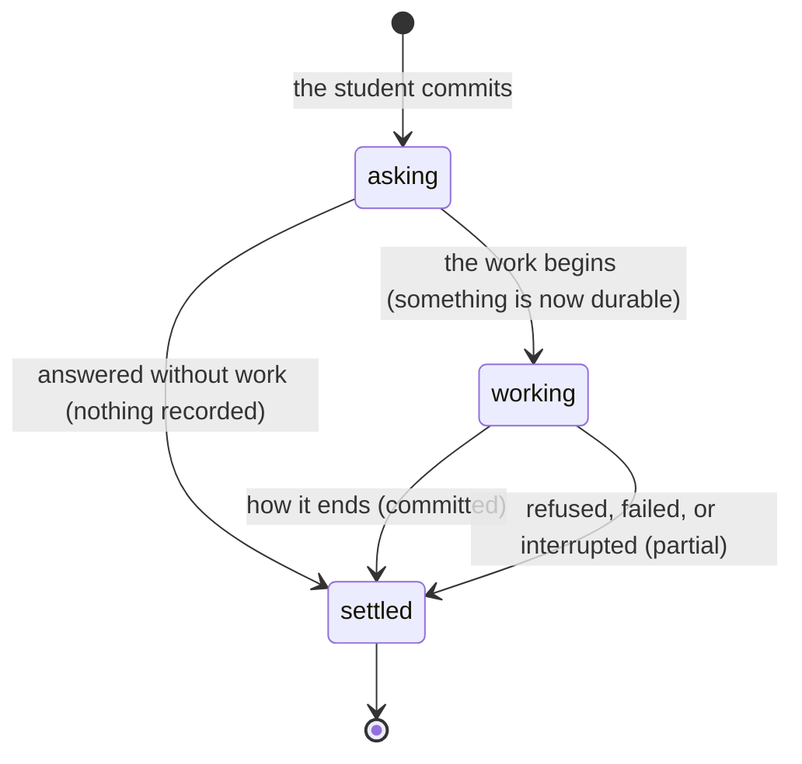

# The ask

## Summary

Everything a student does to Cog\*Portal is an *ask*: they commit to something, the platform either answers at once or starts working, and eventually it settles. This document defines the five phases every other document narrates, names the moment in each surface where abandoning stops being free, and defines the interrupt words that every cancel table in this repo relies on. It owns those definitions. Other documents link here rather than restating them.

There is no screen or command called "the ask". It is the shape shared by arriving on a route, submitting a form, pressing "Start run", typing `cogworks run` and pressing return, and invoking `/cog`.

## The simple case

A student presses a button. Either the request is refused with a reason, or work begins and leaves a durable record. Admitting a hosted execution reserves capacity; completion, not admission, uses quota. Interrupting the browser does not erase the record.

The platform's whole stance sits in that last clause. A finished ask leads with what it found, not with what it scored, and the number sits below the sentence (`docs/design/the-instrument-not-the-judge.md`).

## The ask, event by event

### Asking

The instant of commitment: the click, the return key, the route change, the slash command. Three things are decided here and never revisited within the ask.

**What is targeted.** The repository at a specific commit, the benchmark id, the team, the device. A hosted run resolves the branch to a commit before anything starts, and that commit is what the run is about for the rest of its life, even if the branch moves.

**What is validated before anything runs.** Argument parsing and portal-origin validation in the CLI. Route gates in the browser: `RequireStage` sends a student with no user to `/signin`, with no cohort to `/join`, with no team to `/connect`, all with `replace` (`apps/portal/src/App.tsx:41`). Protocol validation in the sandbox, which requires an exact field set and refuses a job with extra or missing fields (`apps/runner-modal/src/cogworks_runner/protocol.py:32`).

**What is captured so it can be restored.** The pending connection return in `sessionStorage`, so a student bounced to sign-in lands back where they were. The config file's active portal. The `location.state.entry` that tells the setup page whether the student created or joined a team.

### Answered without work

The ask ends before anything durable happens. This is the largest family of outcomes on the platform and it is where most of the "nothing is recorded" claims live.

In the browser it is a validation error, an empty state, a gate redirect, or a `QueryError` card. In the terminal it is a usage message, a missing-portal message, or an unlinked-device message, all on stderr with exit 2, or a bare `cogworks` printing help with exit 0. In Discord it is an ephemeral container the student is the only one who can see. In the sandbox it is a protocol refusal before the first container is created.

Nothing is written, no credit is spent, and no notification is sent. Every document says this explicitly for its own feature, because it is a claim a tester can check.

### The work begins

The moment abandoning the ask stops being free. It is a different moment on every surface, and each document names its own exactly:

- **A hosted run.** The execution is admitted before a container exists. It reserves capacity while active. A failure uses no quota and remains history; a completed evaluation counts.
- **A local run.** The first student module is imported. Discovery runs the team's own code, so by this point their code has had side effects on their own machine that the platform cannot undo.
- **A local report.** The first byte written to `.cogbench/reports/local_<hex>.json`.
- **A device link.** The moment the token is written to the config file, which happens after the browser approval, not before.
- **A live run.** The moment the session is opened and the Discord bubble is posted, which is visible to the whole team.
- **A promotion.** The moment the official attempt is spent.
- **A sandbox stage.** The moment `modal.Sandbox.create` returns, which is when the first `preparing` status reaches the portal.

Before this moment an interrupt leaves nothing behind. After it, something survives, and the document says what.

### While it works

What updates, what streams, what the student can still do, and what is disabled.

The browser polls or streams depending on the surface. A run page polls every 2 seconds while the run is not terminal. The live run surface holds a WebSocket with exponential backoff to 8 seconds. The connections page polls every 4 seconds until at least one device exists, and does not stop when the student simply parks there (`apps/portal/src/lib/queries.ts:120`). The setup page polls every 2.5 seconds until four checks are verified.

The terminal draws a spinner only when stderr is a terminal. Piped to a file or run in CI it goes silent and prints only the report, because a spinner in a log is thousands of escape codes nobody reads (`python/cogbench/src/cogbench/progress.py`).

The sandbox sends a heartbeat every 2 seconds carrying the current phase.

### How it ends

What is committed, what is shown, where the student lands, and the failure path.

A finished hosted run has a status, a set of metrics, possibly a wiring trace, possibly a refusal, and a set of diagnostics capped at 32 items of 240 characters each. A finished local run has a JSON file on disk. A finished device link has a token and an expiry. A finished promotion has a leaderboard entry.

The failure path is never a bare status. Every failure carries a category, a phase, a detail sentence written for a reader, and a flag saying whether the platform owns it. See [`the-run.md`](the-run.md#when-a-run-fails).

## Configuration precedence

The CLI resolves the portal origin in this order and stops at the first that is set: `--portal`, then the `COGPORTAL_URL` environment variable, then the active portal recorded in `~/.cogbench/config.json`, or wherever `COGBENCH_CONFIG` points (`python/cogbench/src/cogbench/cli.py:91`).

None of the three set raises before any request: "No CogPortal is selected. Copy `cogworks link --portal ...` from the setup page."

The resolved value must be a bare origin: a hostname, no username or password, no path beyond `/`, no parameters, no query, no fragment. It must be HTTPS unless the hostname is `localhost`, `127.0.0.1`, or `::1`, in which case HTTP is allowed for local development. Anything else raises "CogPortal must use HTTPS (HTTP is allowed only for local development)."

`--portal` applies to one invocation and does not change which portal is active afterwards. Only `cogworks link` writes the active portal.

## Exit codes

The CLI has three, and no others come out of `main`:

| Code | Meaning |
| --- | --- |
| `0` | The command did what it said. Includes a bare `cogworks` printing help, and includes `cogworks check` when every required signal is true. |
| `2` | Every handled failure: a portal error, a plugin error, a contract error, an `OSError`, a `ValueError`. Also a `check` whose required signals are not all true, which is a report, not a crash. |
| `130` | Ctrl+C. Prints `cogworks: interrupted` on stderr. |

An exception outside the caught tuple (`ContractError`, `PluginError`, `PortalError`, `OSError`, `ValueError`) is not handled and produces a traceback. `KeyError` is the one that is reachable in practice; see [`terminal/status.md`](../terminal/status.md#edge-cases).

## Events that end or interrupt an ask

This document has no Modifiers table and no Cancel and interrupt table, and it is the only one that does not. It defines those rows rather than filling them, and a table here would be a table of definitions restating itself. Every feature document carries both tables with the five and seven rows fixed below.

Every feature document fills the same seven rows, in this order. These are the definitions they rely on.

**You stop it yourself.** Escape, a Cancel button, Ctrl+C, closing the Discord activity, a confirm dialog dismissed. In the terminal, Ctrl+C is caught, the live session is told the run failed, and the process exits 130.

**You do something else mid-way.** Navigating away from a route, running a second command in another terminal, opening a second tab. This is distinct from a reload, which discards in-memory state that may not have been persisted.

**A teammate acts at the same time.** Another member of the same team starting a run, pushing a commit, renaming the team, or changing membership while an ask is in flight. Because the team is the unit, this is a normal condition rather than an error, and the platform mostly does not warn about it. The one place it does is the run lock: runs go one at a time per benchmark, and a second start returns `active_run_exists`.

**The portal fails.** A request errors or times out, the device token expires, or the browser session expires. The CLI retries a request marked retryable up to three attempts with 0.25 s doubling backoff, on 429, 500, 502, 503, 504, and on connection failures (`python/cogbench/src/cogbench/client.py:16`). `update_setup_checks` deliberately does not retry, because the student asked for one visible update and a failure should hand back control with something to act on rather than becoming background telemetry.

**The process goes away.** A reload, a closed tab, a closed terminal, a killed sandbox container. What survives is whatever was already durable. A hosted run outlives every browser that was watching it; a local run does not outlive its terminal.

**The thing being measured changes.** The branch moves to a new commit, the week rolls over, or the benchmark version changes. A run in flight is about the commit it resolved at the start and is unaffected. A promotion is about a run, so it is unaffected too. What changes is what the next ask will measure.

**Refused, or out of credit.** The platform declines. This is not a failure: nothing went wrong, and the sentence says why. A refusal and an exhausted quota are grouped because both are the platform saying no with a reason, and both leave the student's work untouched. See [`what-the-portal-claims.md`](what-the-portal-claims.md#refusal).

## Interactions with other systems

**Who may do this.** Every ask carries an actor. In the browser it is the session; in the terminal it is the device token; in Discord it is the linked Discord account mapped to a portal user. The three can disagree: a student can be signed in to the browser on one account and linked in the terminal on another, and nothing reconciles them.

**The team owns it.** Almost every ask is about the team rather than the person who made it. The exceptions are signing in, linking a device, and reading `cogworks status`.

**Credit.** Only hosted runs and promotions spend anything. See [`../cross-cutting/credit-and-quota.md`](../cross-cutting/credit-and-quota.md).

**What the portal claims.** The trust vocabulary is defined in [`what-the-portal-claims.md`](what-the-portal-claims.md) and constrains what any ask may say about its result.

**What the benchmark supplied.** Where a result depended on something the platform handed the team's code, that is disclosed. See [`../cross-cutting/what-the-benchmark-supplied.md`](../cross-cutting/what-the-benchmark-supplied.md).

**Live updates and reconnection.** The polling and streaming intervals above. See [`../cross-cutting/live-updates.md`](../cross-cutting/live-updates.md).

**Discord.** Some asks are echoed into a team channel without being asked to be. See [`../discord/channel-messages.md`](../discord/channel-messages.md).

**Configuration.** The precedence rule above, plus the benchmark id chosen by the track switcher in the browser, which changes which command every copy block on the setup page prints.

## Edge cases

- **An ask that is answered without work still costs a round trip.** A gate redirect in the browser happens after the session query resolves, so a student on a slow connection sees a loading mark and then a redirect, not an immediate bounce.
- **The three actors do not have to agree.** A device token, a browser session, and a Discord link can point at three different accounts, and no surface says so. The terminal reports its own account on the first line of `cogworks status`; the browser reports its own in the user menu; Discord reports its own in the connect card.
- **A bare `cogworks` exits 0.** Printing help is a success, which matters for scripts that treat any non-zero as failure.
- **The deprecated `doctor` alias.** `cogworks doctor` runs `check` and prints "cogworks: `doctor` is deprecated; use `cogworks check`." to stderr first. The alias is hidden from the help listing by giving the subparser group an explicit metavar, because `help=argparse.SUPPRESS` rendered a literal `==SUPPRESS==` row instead of hiding it.
- **The working directory is resolved once.** `Path.cwd()` is read before any benchmark loads, because a benchmark plugin may change the process working directory. Week 1 does exactly that, chdir-ing into a private scratch directory because one audited repository keeps a module-global relative `db.pkl`. Reading the directory afterwards wrote the report into a scratch directory that is then deleted, so `cogworks report` after a successful run said "No local reports found."
- **The hash seed is pinned before the first read.** `cogworks` re-executes itself once under a pinned `PYTHONHASHSEED` before reading any repository, because discovery runs student code whose answer can depend on string hashing, and an interpreter's seed is fixed before its first line. It is a no-op under an already-pinned seed and only happens when the command really came from a command line, so `main(["check", ...])` in a test does not restart the test runner.

## Open questions and verification

- The three-actor disagreement (browser session, device token, Discord link) is inferred from the code paths, not observed. **Unverified.**
- Whether a `QueryError` gate redirect is visible as a flash on a fast connection was not measured. **Unverified.**
- The connections page polls every 4 seconds forever while no device is linked (`apps/portal/src/lib/queries.ts:120`). Whether that is intentional or an oversight is a product call; it is carried to triage.
- No document in this set observed a real Ctrl+C mid-run. What the CLI does is read from the handler; whether the live session's `failed` event actually lands before the process exits was not confirmed. **Unverified.**

Verified against Cog\*Portal commit `a0e8eac` for hosted quota policy; unchanged descriptions retain earlier references.
