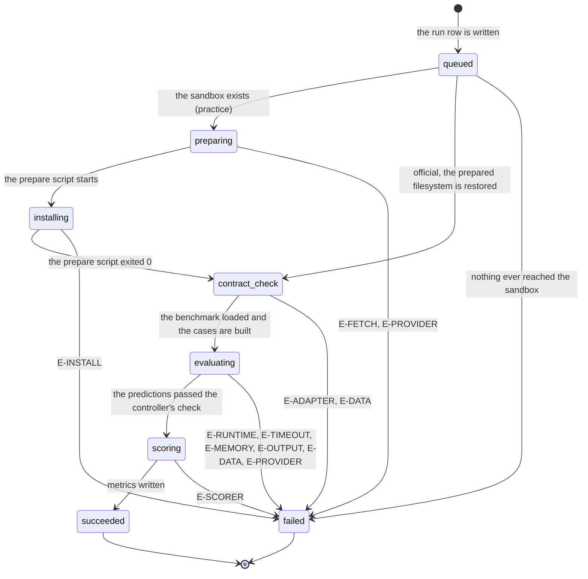

# The run

> Recovery policy was read against local commit `a0e8eac`. Unchanged layout and sandbox details below retain their earlier source references. Same-view browser controls are still being integrated by the portal owner and are not hand-verified here.

## Summary

A run is one attempt by the platform to score a team's repository at one commit. It is the platform's largest unit of work and its most durable record: a run outlives the browser that started it, the terminal that watched it, and the branch that pointed at its commit.

This document owns execution statuses, practice versus official runs, and the findings retained for each execution. [Credit and quota](../cross-cutting/credit-and-quota.md) owns completed-only usage and the limits. Failure categories explain what went wrong; they do not decide cost.

There is no screen called "the run". A run is reached from the dashboard, from `/runs/{id}`, from the live run console, and from a Discord bubble. All four read the same record.

## The simple case

A student on the dashboard picks a branch and presses "Run practice benchmark". The portal resolves that branch to a forty-character commit, writes a run row, and hands the job to Modal. A phase rail appears and fills left to right: Queued, Prepare, Install, Contract check, Evaluate, Score. Two to fifteen minutes later the run settles, and the page leads with what the scorer found, then the number.

If the practice run succeeds, it can become an official candidate. Promotion starts a separate official evaluation of the same commit using the prepared environment. Publication selects a completed official result; it does not start a third execution.

## The ask, event by event

### Asking

Access, source and capacity are checked before an execution is admitted. Retry checks them again for a new execution.

**Who is asking, and may they.** Every start path resolves the actor fresh and asks GitHub whether that account still has write access to the connected repository. A stale permission is not trusted: eligibility rendered in an earlier snapshot is checked again (`apps/portal/worker/services/run-actions.ts:473`). An account without it gets "Current write permission to the connected repository is required." (`run-actions.ts:99`).

**Which commit.** The branch is resolved to a forty-character SHA before anything starts, and that SHA is what the run is about for the rest of its life. A branch that moves five seconds later does not move the run.

**Whether there is room.** One execution may be active per team and benchmark. Admission also checks the mode's completed evaluations and active reservation against its version-specific limit.

### Answered without work

Four ways a start ends with no run row and nothing spent.
- **A run is already active.** `active_run_exists`, shown on the dashboard as "A run is already in progress; runs go one at a time per benchmark." (`apps/portal/src/routes/DashboardPage.tsx:368`). The lock is a partial unique index over the six non-terminal statuses (`apps/portal/worker/db/schema.ts:368`), so the race loses at the database rather than at the check.
- **The quota is used up.** `quota_exhausted`, carrying "The practice-run quota is exhausted." or "The official-attempt quota is exhausted." (`run-actions.ts:209`, `run-actions.ts:357`).
- **The commit will not resolve.** Starting from a local report whose commit is not on GitHub yet raises "Push {sha7} to GitHub first." (`run-actions.ts:233`).
- **The run is not promotable.** Only a succeeded practice run can be promoted: "Only a succeeded hosted run can be promoted." (`run-actions.ts:336`). An official run also needs a prepared filesystem to restore, and without one the portal says "The prepared hosted artifact is unavailable. Verify the commit again." (`run-actions.ts:361`).

These refusals create no execution and dispatch no job.

### The work begins

**The run row is written.** That is the moment, and it is earlier than a student would guess: before any container exists, before Modal has been asked anything. The row is inserted with status `queued` (`run-actions.ts:278`), six empty phase rows are inserted next (`run-actions.ts:142`), and only then is the job dispatched.

The record survives an interrupt. Capacity is reserved while the execution is active; used quota increases only if it completes. A dispatch failure leaves a failed record and uses no quota in either mode.

> Technical note: promotion and Retry admit the execution and its phase records in one transaction. Quota comes from run status, not from a second claim record.

### While it works

The sandbox sends signed, sequence-numbered events. Older events cannot roll status back. Once an execution fails, later completion evidence may add historical findings but cannot revive it or replace the current Retry execution.

During installation and evaluation a background thread repeats the current status every 2 seconds (`apps/runner-modal/src/cogworks_runner/modal_app.py:901`), so a long step still looks alive. During evaluation the repeat carries a case count, which is what turns the console line "Evaluating" into "Evaluating · 41/252 cases".

The browser polls the run every 2 seconds while the status is not terminal and stops when it is (`apps/portal/src/lib/queries.ts:58`). The dashboard polls on the same interval, but only while it holds an active run (`queries.ts:41`), so a dashboard left open after a run settles does not refresh again on its own.

Entering evaluation does not change used quota. A completed evaluation counts regardless of its score; a failed execution does not.

### How it ends

A run ends in exactly one of two ways the platform can produce.

**Succeeded.** The completed event carries metrics, up to 32 diagnostics of 240 characters each, an optional wiring trace, an optional difficulty sweep, the id of the prepared filesystem, and an environment digest. Metrics are upserted per key, the phase rows are closed, and the run's status becomes `succeeded` (`runner-events.ts:186`). A practice run also keeps a capped log; an official run's log is dropped on both sides (`modal_app.py:2347`, `runner-events.ts:194`).

**Failed.** The portal retains the failure category, phase and detail, with a structured refusal when supplied. The execution uses no quota, including when student code caused the failure.

There is no third ending. `cancelled` is in the status enum and has display copy waiting for it ("Stopped before completion", `apps/portal/src/components/RunConsole.tsx:78`), but nothing in the platform ever writes it. See [Edge cases](#edge-cases).

## Statuses and phases

Nine statuses. The first six are the pipeline phases, in order; the last three are terminal (`packages/contracts/src/schema.ts:20`, `:31`, `:40`).

| Phase | Rail label | When the sandbox reports it | What a student sees |
| --- | --- | --- | --- |
| `queued` | Queued | Never. No status event ever carries it. | The value a run row is born with (`run-actions.ts:278`), and the phase label on a failure that happened before preparation started (`modal_app.py:2265`). |
| `preparing` | Prepare | After `modal.Sandbox.create` returns, so the container already exists (`modal_app.py:1156`). | Fetching the repository archive at the resolved commit. |
| `installing` | Install | Immediately before the prepare script runs (`modal_app.py:1158`). | Installing the team's declared dependencies under the course constraints. Repeated every 2 seconds. |
| `contract_check` | Contract check | After the prepare script exits 0 (`modal_app.py:1189`), or as the very first event when a prepared filesystem is being restored (`modal_app.py:2270`). | One case run end to end, so a broken pipeline fails in seconds rather than after the whole dataset. |
| `evaluating` | Evaluate | At the start with `0/total`, again at `total/total`, and every 2 seconds between (`modal_app.py:2293`, `:2305`). | The team's code running against every case. |
| `scoring` | Score | After the predictions pass the controller's own validation (`modal_app.py:2314`). | The trusted scorer turning predictions into metrics, outside the student's container. |

| Terminal status | Meaning |
| --- | --- |
| `succeeded` | Metrics exist. A low number is a result, not a failure. |
| `failed` | One of the twelve categories below, with a phase and a sentence. |
| `cancelled` | Defined, rendered, and never written. |

**An official run skips two phases.** Every official run carries the id of the filesystem its parent practice run prepared, and the protocol refuses one that does not: "Official runs require a prepared artifact." (`apps/runner-modal/src/cogworks_runner/protocol.py:39`). With an artifact in hand the sandbox does no fetching and no installing; it restores and reports `contract_check` as its first event (`modal_app.py:2267`). This is why an official run is fast and why its numbers are about the same environment the practice run was scored in.

The phase rail does not know this. It draws all six phases from the enum and marks every phase before the current one as complete (`apps/portal/src/components/PhaseRail.tsx:40`), so an official run shows Prepare and Install with a completed mark and no duration under either. Two steps that never happened are drawn as though they did.

## Practice, official, and published

Three different claims about the same commit. They are not stages of one run; each is its own run row, except the third, which is not a run at all.

| | Practice | Official | Published |
| --- | --- | --- | --- |
| How it starts | A student presses start, or verifies a local run, or reruns a surface. | A student promotes a succeeded practice run. | A student publishes a succeeded official run. |
| What it scores against | The benchmark's public evaluation cases (`modal_app.py:936`). | A dataset read from a private volume the sandbox cannot write (`modal_app.py:940`). | Nothing. It selects an existing official run. |
| Dataset recorded | `practice-v1` (`apps/portal/worker/execution/runner.ts:78`). | The benchmark's real dataset version. | The selected run's. |
| Log | Kept, capped at 8 KiB. | Dropped by the sandbox and again by the portal. | Not applicable. |
| Attempt number | Null. | 1, 2, or 3. | Not applicable. |
| Who can see it | The team. | The team. | Every team in the cohort. |
| Costs | One of ten when completed. | One of three when completed. | Nothing. |
| Reversible | The execution remains history. | The execution remains history. | Yes. Publishing again replaces the selection. |

Publishing writes one row per team per benchmark version (`apps/portal/worker/db/schema.ts:609`), so a team has exactly one entry on a leaderboard and can move it to a different official run whenever they like.

## What a run record holds

A run row is the durable answer to six questions. Everything a student ever reads about a finished run comes out of it (`apps/portal/worker/db/schema.ts:287`).

**What was measured.** The benchmark id and version, the contract version, the branch name, and the forty-character commit. The branch is a label; the commit is the record.

**How it was measured.** The dataset version, the scorer version, the runtime version, the execution provider, the environment digest, and the id of the prepared filesystem. These are what make one run comparable to another and what make an old run still legible after the benchmark moves on.

**What happened.** Status, created and finished timestamps, and one row per phase with a start and end time. A phase that never ran keeps two nulls, which is how a duration can be absent without being zero.

**What was found.** Metrics, one row per key, each carrying its own label, unit, precision, direction, and help text. The help text is stored per run rather than per benchmark on purpose, so an old run keeps the words that were true when it ran (`schema.ts:577`). Alongside them: the scorer's diagnostics, the wiring trace when the platform inferred the team's functions, and the difficulty sweep when the benchmark has a knob to turn.

**What went wrong.** The failure category, phase, detail and structured refusal remain attached to the execution. Failures use no quota.

**What it cost.** Completed evaluations count toward the mode's quota. Historical refunded successes remain excluded.

A terminal failure stays failed. Signed late findings may enrich its history, but cannot publish it, spend quota or overwrite a newer Retry result.

## When a run fails

Twelve categories name the failure and its explanation. Every category uses no quota when the execution fails.

| Category | Code | What the student reads | Where it comes from | Phase | Spends an official attempt |
| --- | --- | --- | --- | --- | --- |
| `repository_fetch` | `E-FETCH` | "Repository could not be fetched" | The prepare script could not download the archive at the commit (`modal_app.py:1180`). | `preparing` | No |
| `dependency_install` | `E-INSTALL` | "Dependency installation failed" | The prepare script exited non-zero for any reason that was not the two above (`modal_app.py:1188`). | `installing` | No |
| `data_download` | `E-DATA` | "Benchmark data is not ready" | The controller could not read or could not validate the week's corpus against its pinned digests (`modal_app.py:926`, `:1000`, `:1015`, `:1031`, `:1053`, `:1063`, `:1085`). | `contract_check` or `evaluating` | No |
| `model_cache` | `E-MODEL` | "Model cache is not ready" | Nothing. No code path produces it. | Never | No |
| `adapter_missing` | `E-ADAPTER` | "Nothing here could be scored" | The repository declared no submission and discovery bound nothing end to end (`modal_app.py:1184`). Carries the structured refusal. | `contract_check` | No |
| `contract_invalid` | `E-CONTRACT` | "Adapter does not satisfy the contract" | Nothing, deliberately. Deriving it from words a submission printed would let student output impersonate controller evidence (`modal_app.py:1907`). | Never | No |
| `student_runtime` | `E-RUNTIME` | "Your code raised an exception" | The evaluation process exited non-zero and was not a timeout (`modal_app.py:1693`, `:1763`, `:1924`, `:2003`). | `evaluating` | No |
| `timeout` | `E-TIMEOUT` | "Evaluation exceeded the time limit" | Elapsed time reached 95% of the budget, or the process came back with a kill signal (`modal_app.py:2098`). | `evaluating` | No |
| `memory_limit` | `E-MEMORY` | "Memory limit exceeded" | The word "memory" or "oom" in an exception raised on the controller side (`modal_app.py:1937`). | `evaluating` | No |
| `output_invalid` | `E-OUTPUT` | "Predictions did not match the schema" | The controller's own check of the predictions file: wrong type, ragged matrix, non-finite number, wrong length (`modal_app.py:1502`, `:1354`, `:1374`). | `evaluating` | No |
| `scorer` | `E-SCORER` | "Scoring failed on our side" | Anything not already a classified failure, raised once the phase is `scoring` (`modal_app.py:2360`). | `scoring` | No |
| `provider` | `E-PROVIDER` | "Execution provider failed" | The prepare sandbox itself failing (`modal_app.py:1194`), anything unclassified before scoring (`modal_app.py:2364`), a dispatch Modal refused (`run-actions.ts:168`), or a run that stopped reporting for an hour (`apps/portal/worker/execution/maintenance.ts:78`). | Wherever it stopped | No |

Two consequences fall straight out of this table.

**No failed execution uses quota.** This applies before, during and after evaluation, in both modes.

**The platform never takes the submission's word about whose fault a failure was.** Attribution comes from what the controller observes outside the student process, such as elapsed time, return code and controller exceptions. This determines the explanation, not whether a failed execution spends quota.

Retry requests another execution of the same source in the same mode and view. The old failure remains history. A change to the code is a new candidate, not a Retry.

## Modifiers

| Modifier | Set before the ask | Changed while it works |
| --- | --- | --- |
| Who you are | Any team member with current write access to the repository can start, promote, and publish. There is no separate run permission; GitHub's answer is the permission (`run-actions.ts:98`). An instructor has no privileged start path and no way to run for a team. A signed-out visitor is redirected before the dashboard renders. | No effect. The actor is resolved once at the start, and a permission change made in GitHub mid-run does not stop a run in flight or change who may read it. |
| Where your team and repository stand | A team with no repository has no dashboard to start from. The branch list comes from GitHub, falling back to the repository's default branch when the list has not loaded (`DashboardPage.tsx:63`). A repository made private after a run started still fails that run at `preparing` with `E-FETCH`, because the archive fetch is what discovers it. | A repository going private mid-run surfaces as `E-FETCH` if it happens before the archive is pulled, and not at all afterwards: the sandbox holds its own copy. |
| Which week's benchmark | Decides the corpus, the interpreter, the memory ceiling, and which failure copy is sharpened. Week 1 and Week 3 execute student code under a pinned CPython 3.8.20; everything else uses 3.11 (`runner.ts:88`). Week 1 and Week 3 get 4096 MB, everything else 2048 (`runner.ts:129`). The wall clock is 900 seconds for every benchmark and both stages (`runner.ts:133`). | No effect. The job carries its runtime settings, and switching the track switcher in another tab does not reach a running job. |
| Practice or leaderboard | The mode decides the dataset, log visibility and which completed-evaluation limit applies. Only eligible official results can be published. | Retry preserves mode. Promotion creates a separate official execution; it does not change the practice execution. |
| Flags, options, and where you are typing | Hosted Retry targets a failed execution, not its branch tip. Portal, Activity and CogBot share the server action. Local CLI runs use no hosted quota. | Where the student watches does not change the recorded execution. |

## Cancel and interrupt

| Event | Before the work begins | While it works |
| --- | --- | --- |
| You stop it yourself | Closing a confirmation starts no execution. | The platform offers no cancellation action. Closing the view leaves the execution running until it completes or fails. |
| You do something else mid-way | Navigating away before pressing start costs nothing. | The run does not notice. It outlives the tab, the browser, and the session that started it; the record is on the server and the sandbox reports to a URL, not to a socket. Starting a second run on the same benchmark is refused with `active_run_exists`. |
| A teammate acts at the same time | Two teammates pressing start together produce one run and one `active_run_exists`, decided by a unique index rather than by whichever check ran first (`schema.ts:368`). | A teammate pushing a new commit does not affect a run in flight, because the run resolved its commit at the start. A teammate watching the same run sees the same phases; there is no per-person view. |
| The portal fails | A failure here is a failure to start: nothing is written, and the student sees the error message on the button they pressed. | The sandbox's callback is retried by Modal's own delivery, and the portal deduplicates by event id (`runner-events.ts:250`). An event the portal rejects with an error deletes its own dedup row so a retry can be applied (`runner-events.ts:265`). A run whose events stop arriving entirely is failed by the reaper after an hour. |
| The page or the process goes away | Nothing to lose. | A closed tab changes nothing. A killed sandbox container is the interesting case: the controller sees a non-zero return with no traceback, which is identical to a crash, so it decides from elapsed time and the return code instead (`modal_app.py:2077`). Past 95% of the budget it is a timeout; well short of it, it is attributed to the submission. |
| The thing being measured changes | The branch is resolved at the moment of asking, so a push landing one second earlier is in and one second later is out, with nothing saying which. | No effect. A run is about its commit. A benchmark version going inactive mid-run does not stop the run, though it does stop the next promotion: "That benchmark version is not active." (`run-actions.ts:119`). |
| The platform refuses or credit runs out | Admission refuses without dispatch if permission, recorded inputs or capacity are unavailable. | A failed execution uses no quota. No refund cap changes that outcome. |

## Interactions with other systems

**Who may do this.** Current write access to the connected repository, re-checked against GitHub on every start, promote, and publish. The repository is the permission; the portal keeps no separate list. See [`the-team-and-the-repository.md`](the-team-and-the-repository.md).

**The team owns it.** Every run belongs to a team, never to the person who pressed the button. The run row records a creating user only on the surface, not on the run, and no screen shows who started what. This is the same rule as [no per-person numbers](what-the-portal-claims.md#no-per-person-numbers), applied one level up: a run is the team's attempt.

**Credit.** Completed practice and official evaluations use their separate limits. Failed executions, reading history and publication are free. See [credit and quota](../cross-cutting/credit-and-quota.md).

**What the portal claims.** Every hosted run's metrics are *verified*: the portal ran the code itself. A run that fails with `adapter_missing` produces a *refusal* rather than a zero. A Week 3 run whose image side never bound *withholds* its overall. All three words are defined in [`what-the-portal-claims.md`](what-the-portal-claims.md).

**What the benchmark supplied.** A run's numbers depend on what the benchmark handed the team's code, and the local report discloses it. The hosted run page does not, which is carried to triage in [`what-the-portal-claims.md`](what-the-portal-claims.md#supplied-by-the-benchmark).

**Live updates and reconnection.** Phase events reach three places: the run page by polling, the run console by socket, and a Discord message edited in place. See [`../cross-cutting/live-updates.md`](../cross-cutting/live-updates.md).

**Discord.** A run started from any surface publishes to the team's channel when one is bound. The bubble carries the phase, the metric, and a truncated refusal headline. See [`../discord/channel-messages.md`](../discord/channel-messages.md).

**Configuration.** The wall clock, the memory ceiling, the CPU count, and the output cap are set per job when it is built (`runner.ts:81`), not per benchmark plugin, so a benchmark cannot ask for more room. The stale threshold is the one limit an operator can change, and it is floored at 900 seconds (`maintenance.ts:48`).

## Edge cases

- **`queued` is a phase nobody is ever in.** It is a real member of the enum, it has a rail label, and it is the value a run row starts at, but no status event carries it: the sandbox's first report is either `preparing` or `contract_check`. Its only working use is as the phase on a failure that happened before preparation began, which in practice means a dispatch that Modal refused (`run-actions.ts:167`).
- **`cancelled` is unreachable.** Nothing in the worker, the sandbox, or the CLI writes it. The local-session table does not even allow it (`schema.ts:467`). The run console has copy ready for it and the phase rail has a tone for it. A student cannot stop a run they started.
- **Two failure categories have no producer in this draft.** `model_cache` and `contract_invalid` remain catalog entries. Their producer reachability is separate from recovery eligibility; a category does not prohibit Retry.
- **An official run's rail claims two steps it skipped.** Prepare and Install render as complete with no timing, because the rail infers completion from position rather than from a phase row that started.
- **Attempt numbers can repeat after failure.** Numbering follows completed official evaluations, so several failed executions may have the same number.
- **Retry keeps the same view.** Each failed execution gets at most one successor. Replaying that request after the successor fails does not start another generation; Retry must target the newer failure.
- **Two failure codes render as one line in the console.** `data_download` and `model_cache` have no entry in the stream-code map, so both fall through to the provider default and appear in the live console as "The hosted runner could not finish" (`apps/portal/worker/services/run-surfaces.ts:67`). The run page shows the correct card; the console does not.
- **A run whose events stop is not noticed for an hour.** The reaper's threshold is 3600 seconds (`maintenance.ts:22`, set explicitly in `apps/portal/wrangler.jsonc:73`) and the cron fires every five minutes (`wrangler.jsonc:79`). The sandbox's own wall clock is 900 seconds, so a run that is genuinely stuck sits on the dashboard as active, blocking every other run on that benchmark, for up to 45 minutes after the container that was supposed to hold it is gone.
- **The durable orchestrator is not the code that runs.** `apps/portal/worker/orchestration/run-workflow.ts` and `apps/portal/worker/execution/sandbox.ts` describe a Cloudflare Workflow and a Cloudflare Sandbox adapter. The adapter throws on every method, and nothing constructs the workflow: the only reference is a re-export (`apps/portal/worker/index.ts:66`). Every real run goes to Modal. Reading either file as a description of what happens to a run is reading a plan, not the product.

## Open questions and verification

- Nothing writes `cancelled`, and no surface offers a stop. A student who starts the wrong source must wait for it to finish or fail; only completion uses quota.
- `model_cache` and `contract_invalid` are dead copy. `contract_invalid` has a documented reason to stay unreachable; `model_cache` does not, and its per-module overrides ("FaceNet cache is not ready", "Course artifact cache is not ready") were written for a student who can never see them. Carried to triage.
- The 45-minute window between the sandbox's 900 second ceiling and the reaper's 3600 second threshold was read from the two constants, not observed. Whether a run really can sit active that long, or whether Modal's own failure surfaces first through the callback, was not confirmed. **Unverified.**
- Whether the phase rail's completed marks on a skipped Prepare and Install confuse a reader was not observed. The mechanism is certain; the effect is not. **Unverified.**
- `packages/contracts/src/failures.ts:119` hardcodes "the 15-minute wall-time ceiling" in the sentence a student reads, while the sandbox interpolates the real budget from the job (`modal_app.py:1917`). Two packages hold the same number and only one of them would change. Carried to triage.
- The glossary defines *practice run*, *promotion*, and *credit*, and has no entry for *official run*, *official attempt*, *phase*, or *refund*, all of which this document and [`../cross-cutting/credit-and-quota.md`](../cross-cutting/credit-and-quota.md) rely on. They are defined here rather than coined; the glossary should point at these two documents the way it already points at credit.
- No run was watched end to end against a deployed portal for this pass. Every phase transition, every failure category, and every string above is read from the source. **Unverified.**

Verified against Cog\*Portal commit `a0e8eac` for recovery policy; unchanged descriptions retain their cited earlier references. Browser integration remains unverified.
