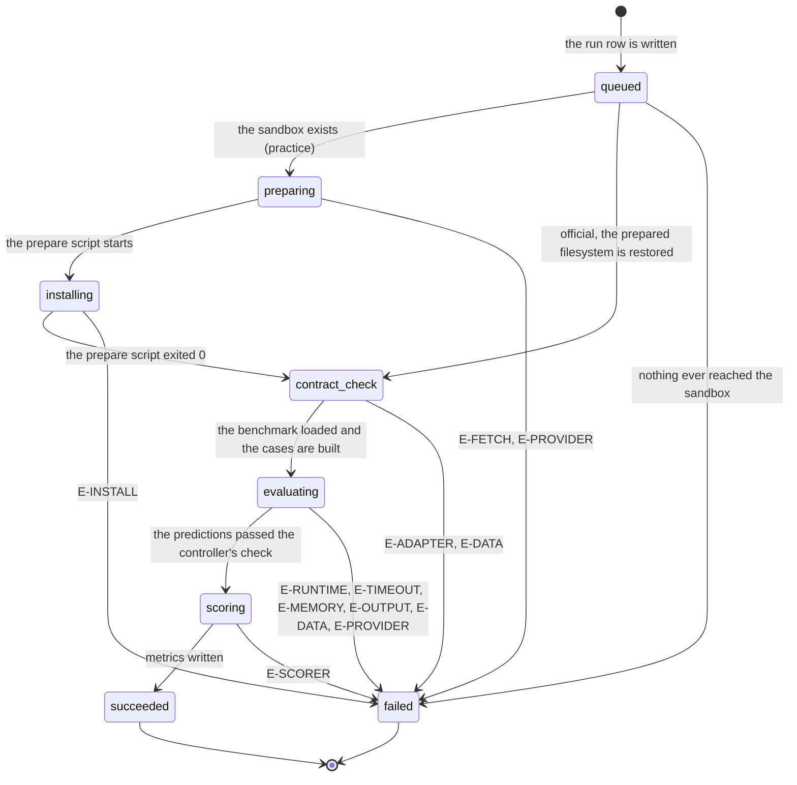

# The run

> **In flight.** The sandbox's prepare stage was being edited while this document was drafted, as uncommitted work on top of `f74e087`, in `apps/runner-modal/src/cogworks_runner/modal_app.py` and `apps/runner-modal/src/cogworks_runner/protocol.py`. Two of the four areas named in [`goal.md`](../goal.md) land there: `cogworks sync` uploading the weights a local run used, and the removal of instructor adapters. Every line number below is against `f74e087`, and the working tree has already moved about 47 lines past it, so a verifier must re-read by symbol rather than by line. One change is on disk that this document's failure table does not carry: the prepare script gains a `data_download` failure at the `preparing` phase when a weight file cannot be fetched, which is a phase that category could not previously fail at. It refunds like every other prepare-stage failure, so nothing in [`../cross-cutting/credit-and-quota.md`](../cross-cutting/credit-and-quota.md) changes. The job also gains a `weights` field and the result a `weightsSupplied` field.

## Summary

A run is one attempt by the platform to score a team's repository at one commit. It is the platform's largest unit of work and its most durable record: a run outlives the browser that started it, the terminal that watched it, and the branch that pointed at its commit.

This document owns four things every other document links to rather than restating: the full list of statuses and phases a run passes through, the difference between a practice run, an official run, and a published result, what a finished run record holds, and the twelve failure categories with what each one costs. What a run costs and when that cost comes back is in [`../cross-cutting/credit-and-quota.md`](../cross-cutting/credit-and-quota.md); this document says which failures fall on which side of that line and why.

There is no screen called "the run". A run is reached from the dashboard, from `/runs/{id}`, from the live run console, and from a Discord bubble. All four read the same record.

## The simple case

A student on the dashboard picks a branch and presses "Run practice benchmark". The portal resolves that branch to a forty-character commit, writes a run row, and hands the job to Modal. A phase rail appears and fills left to right: Queued, Prepare, Install, Contract check, Evaluate, Score. Two to fifteen minutes later the run settles, and the page leads with what the scorer found, then the number.

If the run succeeded, it becomes the team's promotable candidate. Promoting it starts a second run: same commit, same prepared filesystem, hidden inputs, no log. If that one succeeds too, the team can publish it to the leaderboard. Three runs, one commit, three different kinds of claim.

## The ask, event by event

### Asking

Three things are decided before a run row exists, and none of them is revisited afterwards.

**Who is asking, and may they.** Every start path resolves the actor fresh and asks GitHub whether that account still has write access to the connected repository. A stale permission is not trusted: eligibility rendered in an earlier snapshot is checked again (`apps/portal/worker/services/run-actions.ts:473`). An account without it gets "Current write permission to the connected repository is required." (`run-actions.ts:99`).

**Which commit.** The branch is resolved to a forty-character SHA before anything starts, and that SHA is what the run is about for the rest of its life. A branch that moves five seconds later does not move the run.

**Whether there is room.** One run at a time per benchmark, and enough quota. Both are checked here, and both are also enforced by a database index, so two teammates pressing start at the same instant cannot both win. See [Answered without work](#answered-without-work).

### Answered without work

Four ways a start ends with no run row and nothing spent.

- **A run is already active.** `active_run_exists`, shown on the dashboard as "A run is already in progress; runs go one at a time per benchmark." (`apps/portal/src/routes/DashboardPage.tsx:368`). The lock is a partial unique index over the six non-terminal statuses (`apps/portal/worker/db/schema.ts:368`), so the race loses at the database rather than at the check.
- **The quota is used up.** `quota_exhausted`, carrying "The practice-run quota is exhausted." or "The official-attempt quota is exhausted." (`run-actions.ts:209`, `run-actions.ts:357`).
- **The commit will not resolve.** Starting from a local report whose commit is not on GitHub yet raises "Push {sha7} to GitHub first." (`run-actions.ts:233`).
- **The run is not promotable.** Only a succeeded practice run can be promoted: "Only a succeeded hosted run can be promoted." (`run-actions.ts:336`). An official run also needs a prepared filesystem to restore, and without one the portal says "The prepared hosted artifact is unavailable. Verify the commit again." (`run-actions.ts:361`).

Nothing is written in any of these cases. No row, no phase skeleton, no attempt claim, no Discord message.

### The work begins

**The run row is written.** That is the moment, and it is earlier than a student would guess: before any container exists, before Modal has been asked anything. The row is inserted with status `queued` (`run-actions.ts:278`), six empty phase rows are inserted next (`run-actions.ts:142`), and only then is the job dispatched.

Everything after that point survives an interrupt. A practice run that never reaches a sandbox has still used one of the team's ten. An official promotion inserts its attempt claim in the same breath as the run row (`run-actions.ts:389`), and that claim is what the quota counts.

> Technical note: dispatch failure is handled differently for the two modes. If Modal never accepts the job, the run is marked failed with category `provider` and phase `queued`, and an official run's attempt claim is deleted in the same database batch, because "either half alone is a lie" (`run-actions.ts:157`). A practice run gets no such release: the row stays, and the practice slot stays used. See [`../cross-cutting/credit-and-quota.md`](../cross-cutting/credit-and-quota.md#edge-cases).

### While it works

The sandbox reports its own phase and nothing else. Each report is a signed, sequence-numbered event; the portal ignores anything whose sequence is not higher than the last one it applied, and ignores everything once the run is terminal (`apps/portal/worker/routes/runner-events.ts:80`).

During installation and evaluation a background thread repeats the current status every 2 seconds (`apps/runner-modal/src/cogworks_runner/modal_app.py:901`), so a long step still looks alive. During evaluation the repeat carries a case count, which is what turns the console line "Evaluating" into "Evaluating · 41/252 cases".

The browser polls the run every 2 seconds while the status is not terminal and stops when it is (`apps/portal/src/lib/queries.ts:58`). The dashboard polls on the same interval, but only while it holds an active run (`queries.ts:41`), so a dashboard left open after a run settles does not refresh again on its own.

One thing changes silently here. When an official run reports `evaluating`, the portal flips that attempt's `consumed` flag to true (`runner-events.ts:98`). Nothing on any screen changes at that instant; the flag matters only to the failure copy at the end.

### How it ends

A run ends in exactly one of two ways the platform can produce.

**Succeeded.** The completed event carries metrics, up to 32 diagnostics of 240 characters each, an optional wiring trace, an optional difficulty sweep, the id of the prepared filesystem, and an environment digest. Metrics are upserted per key, the phase rows are closed, and the run's status becomes `succeeded` (`runner-events.ts:186`). A practice run also keeps a capped log; an official run's log is dropped on both sides (`modal_app.py:2347`, `runner-events.ts:194`).

**Failed.** The failed event carries a category, a phase, a one-line detail capped at 240 characters, a flag saying whether the platform owns it, and sometimes a structured refusal. The portal records all of it and decides, once, whether the failure cost an official attempt.

There is no third ending. `cancelled` is in the status enum and has display copy waiting for it ("Stopped before completion", `apps/portal/src/components/RunConsole.tsx:78`), but nothing in the platform ever writes it. See [Edge cases](#edge-cases).

## Statuses and phases

Nine statuses. The first six are the pipeline phases, in order; the last three are terminal (`packages/contracts/src/schema.ts:20`, `:31`, `:40`).

| Phase | Rail label | When the sandbox reports it | What a student sees |
| --- | --- | --- | --- |
| `queued` | Queued | Never. No status event ever carries it. | The value a run row is born with (`run-actions.ts:278`), and the phase label on a failure that happened before preparation started (`modal_app.py:2265`). |
| `preparing` | Prepare | After `modal.Sandbox.create` returns, so the container already exists (`modal_app.py:1156`). | Fetching the repository archive at the resolved commit. |
| `installing` | Install | Immediately before the prepare script runs (`modal_app.py:1158`). | Installing the team's declared dependencies under the course constraints. Repeated every 2 seconds. |
| `contract_check` | Contract check | After the prepare script exits 0 (`modal_app.py:1189`), or as the very first event when a prepared filesystem is being restored (`modal_app.py:2270`). | One case run end to end, so a broken pipeline fails in seconds rather than after the whole dataset. |
| `evaluating` | Evaluate | At the start with `0/total`, again at `total/total`, and every 2 seconds between (`modal_app.py:2293`, `:2305`). | The team's code running against every case. |
| `scoring` | Score | After the predictions pass the controller's own validation (`modal_app.py:2314`). | The trusted scorer turning predictions into metrics, outside the student's container. |

| Terminal status | Meaning |
| --- | --- |
| `succeeded` | Metrics exist. A low number is a result, not a failure. |
| `failed` | One of the twelve categories below, with a phase and a sentence. |
| `cancelled` | Defined, rendered, and never written. |

**An official run skips two phases.** Every official run carries the id of the filesystem its parent practice run prepared, and the protocol refuses one that does not: "Official runs require a prepared artifact." (`apps/runner-modal/src/cogworks_runner/protocol.py:39`). With an artifact in hand the sandbox does no fetching and no installing; it restores and reports `contract_check` as its first event (`modal_app.py:2267`). This is why an official run is fast and why its numbers are about the same environment the practice run was scored in.

The phase rail does not know this. It draws all six phases from the enum and marks every phase before the current one as complete (`apps/portal/src/components/PhaseRail.tsx:40`), so an official run shows Prepare and Install with a completed mark and no duration under either. Two steps that never happened are drawn as though they did.

## Practice, official, and published

Three different claims about the same commit. They are not stages of one run; each is its own run row, except the third, which is not a run at all.

| | Practice | Official | Published |
| --- | --- | --- | --- |
| How it starts | A student presses start, or verifies a local run, or reruns a surface. | A student promotes a succeeded practice run. | A student publishes a succeeded official run. |
| What it scores against | The benchmark's public evaluation cases (`modal_app.py:936`). | A dataset read from a private volume the sandbox cannot write (`modal_app.py:940`). | Nothing. It selects an existing official run. |
| Dataset recorded | `practice-v1` (`apps/portal/worker/execution/runner.ts:78`). | The benchmark's real dataset version. | The selected run's. |
| Log | Kept, capped at 8 KiB. | Dropped by the sandbox and again by the portal. | Not applicable. |
| Attempt number | Null. | 1, 2, or 3. | Not applicable. |
| Who can see it | The team. | The team. | Every team in the cohort. |
| Costs | One of ten hosted practice runs. | One of three official attempts. | Nothing. |
| Reversible | No. | Only by a refund the platform decides. | Yes. Publishing again replaces the selection (`run-actions.ts:437`). |

Publishing writes one row per team per benchmark version (`apps/portal/worker/db/schema.ts:609`), so a team has exactly one entry on a leaderboard and can move it to a different official run whenever they like.

## What a run record holds

A run row is the durable answer to six questions. Everything a student ever reads about a finished run comes out of it (`apps/portal/worker/db/schema.ts:287`).

**What was measured.** The benchmark id and version, the contract version, the branch name, and the forty-character commit. The branch is a label; the commit is the record.

**How it was measured.** The dataset version, the scorer version, the runtime version, the execution provider, the environment digest, and the id of the prepared filesystem. These are what make one run comparable to another and what make an old run still legible after the benchmark moves on.

**What happened.** Status, created and finished timestamps, and one row per phase with a start and end time. A phase that never ran keeps two nulls, which is how a duration can be absent without being zero.

**What was found.** Metrics, one row per key, each carrying its own label, unit, precision, direction, and help text. The help text is stored per run rather than per benchmark on purpose, so an old run keeps the words that were true when it ran (`schema.ts:577`). Alongside them: the scorer's diagnostics, the wiring trace when the platform inferred the team's functions, and the difficulty sweep when the benchmark has a knob to turn.

**What went wrong.** Category, phase, a capped one-line detail, a structured refusal when the failure was "nothing here could be scored", and a flag saying whether an official attempt was consumed. That flag is documented as the authoritative answer to "did this cost an attempt" (`packages/contracts/src/failures.ts:9`).

**What it cost.** For an official run, an attempt claim row elsewhere, plus `refundedAt` on the run itself once an attempt has been given back (`schema.ts:340`).

A run is never edited after it settles. The event handler returns early on any run already terminal (`runner-events.ts:80`), and a late or duplicate event from the sandbox changes nothing.

## When a run fails

Twelve categories. Each has a fixed code, a title, and an explanation the student reads, all from `packages/contracts/src/failures.ts`. The last column is the whole of the credit rule: an official attempt is spent only when the category is one of four, the phase is `evaluating` or `scoring`, and the sandbox did not mark the failure as the platform's (`apps/portal/worker/routes/runner-events.ts:25`, `:32`).

| Category | Code | What the student reads | Where it comes from | Phase | Spends an official attempt |
| --- | --- | --- | --- | --- | --- |
| `repository_fetch` | `E-FETCH` | "Repository could not be fetched" | The prepare script could not download the archive at the commit (`modal_app.py:1180`). | `preparing` | No |
| `dependency_install` | `E-INSTALL` | "Dependency installation failed" | The prepare script exited non-zero for any reason that was not the two above (`modal_app.py:1188`). | `installing` | No |
| `data_download` | `E-DATA` | "Benchmark data is not ready" | The controller could not read or could not validate the week's corpus against its pinned digests (`modal_app.py:926`, `:1000`, `:1015`, `:1031`, `:1053`, `:1063`, `:1085`). | `contract_check` or `evaluating` | No |
| `model_cache` | `E-MODEL` | "Model cache is not ready" | Nothing. No code path produces it. | Never | No |
| `adapter_missing` | `E-ADAPTER` | "Nothing here could be scored" | The repository declared no submission and discovery bound nothing end to end (`modal_app.py:1184`). Carries the structured refusal. | `contract_check` | No |
| `contract_invalid` | `E-CONTRACT` | "Adapter does not satisfy the contract" | Nothing, deliberately. Deriving it from the words a submission printed was a way to buy a free attempt (`modal_app.py:1907`). | Never | No |
| `student_runtime` | `E-RUNTIME` | "Your code raised an exception" | The evaluation process exited non-zero and was not a timeout (`modal_app.py:1693`, `:1763`, `:1924`, `:2003`). | `evaluating` | **Yes** |
| `timeout` | `E-TIMEOUT` | "Evaluation exceeded the time limit" | Elapsed time reached 95% of the budget, or the process came back with a kill signal (`modal_app.py:2098`). | `evaluating` | **Yes** |
| `memory_limit` | `E-MEMORY` | "Memory limit exceeded" | The word "memory" or "oom" in an exception raised on the controller side (`modal_app.py:1937`). | `evaluating` | **Yes** |
| `output_invalid` | `E-OUTPUT` | "Predictions did not match the schema" | The controller's own check of the predictions file: wrong type, ragged matrix, non-finite number, wrong length (`modal_app.py:1502`, `:1354`, `:1374`). | `evaluating` | **Yes** |
| `scorer` | `E-SCORER` | "Scoring failed on our side" | Anything not already a classified failure, raised once the phase is `scoring` (`modal_app.py:2360`). | `scoring` | No |
| `provider` | `E-PROVIDER` | "Execution provider failed" | The prepare sandbox itself failing (`modal_app.py:1194`), anything unclassified before scoring (`modal_app.py:2364`), a dispatch Modal refused (`run-actions.ts:168`), or a run that stopped reporting for an hour (`apps/portal/worker/execution/maintenance.ts:78`). | Wherever it stopped | No |

Two consequences fall straight out of this table.

**No failure before evaluation ever spends an official attempt.** Fetch, install, contract check, and every refusal that says "nothing here could be scored" are free. The four categories that cost anything are all raised from the evaluation stage, and all four are conditions the submission itself produced.

**The platform never takes the submission's word about whose fault a failure was.** It used to. The sandbox wrote a marker to stderr when it failed before importing student code, and the controller read it, until someone noticed that three lines of `os.write(2, ...)` inside any student module put that marker on the same pipe. That bought a `model_cache` failure, which refunds, without limit, and the run page blamed the platform's own model cache (`modal_app.py:2043`). The rule now is that once student code is running in a process, nothing that process emits is evidence about the platform. Attribution comes from what the controller observes from outside: elapsed seconds, the return code, and exceptions raised on its own side.

A failed official run tells the team which side it landed on in one line under the failure card: "This failure consumed one official attempt." or "No official attempt was consumed." (`apps/portal/src/components/FailureCard.tsx:69`). A failed practice run gets no such line, though it also cost something.

## Modifiers

| Modifier | Set before the ask | Changed while it works |
| --- | --- | --- |
| Who you are | Any team member with current write access to the repository can start, promote, and publish. There is no separate run permission; GitHub's answer is the permission (`run-actions.ts:98`). An instructor has no privileged start path and no way to run for a team. A signed-out visitor is redirected before the dashboard renders. | No effect. The actor is resolved once at the start, and a permission change made in GitHub mid-run does not stop a run in flight or change who may read it. |
| Where your team and repository stand | A team with no repository has no dashboard to start from. The branch list comes from GitHub, falling back to the repository's default branch when the list has not loaded (`DashboardPage.tsx:63`). A repository made private after a run started still fails that run at `preparing` with `E-FETCH`, because the archive fetch is what discovers it. | A repository going private mid-run surfaces as `E-FETCH` if it happens before the archive is pulled, and not at all afterwards: the sandbox holds its own copy. |
| Which week's benchmark | Decides the corpus, the interpreter, the memory ceiling, and which failure copy is sharpened. Week 1 and Week 3 execute student code under a pinned CPython 3.8.20; everything else uses 3.11 (`runner.ts:88`). Week 1 and Week 3 get 4096 MB, everything else 2048 (`runner.ts:129`). The wall clock is 900 seconds for every benchmark and both stages (`runner.ts:133`). | No effect. The job carries its runtime settings, and switching the track switcher in another tab does not reach a running job. |
| Practice or leaderboard | The largest fork in this document. It decides the dataset, whether a log survives, whether an attempt is claimed, whether the prepare stage runs at all, and whether the result can reach a leaderboard. See [Practice, official, and published](#practice-official-and-published). | No effect. A run's mode is fixed at insert and there is no path that converts one into the other. Promotion creates a second run. |
| Flags, options, and where you are typing | The four surfaces start the same run. The dashboard sends a branch; the run page's retry sends the branch of the run being retried, or nothing when that run was on a detached commit (`apps/portal/src/routes/RunDetailPage.tsx:66`); the Discord activity and the run console send a surface mutation; `cogworks run` does not start a hosted run at all and never spends portal credit. | No effect on the run. It does change what the student sees: the run page polls, the console holds a socket, and Discord edits one message in place. |

## Cancel and interrupt

| Event | Before the work begins | While it works |
| --- | --- | --- |
| You stop it yourself | Nothing was started. Closing the confirm on "Promote to official" leaves no row, no claim, and no message. | Not possible. There is no cancel button, no cancel endpoint, and nothing that writes the `cancelled` status. A student who wants a run to stop can only wait for it or wait an hour for the stale reaper. |
| You do something else mid-way | Navigating away before pressing start costs nothing. | The run does not notice. It outlives the tab, the browser, and the session that started it; the record is on the server and the sandbox reports to a URL, not to a socket. Starting a second run on the same benchmark is refused with `active_run_exists`. |
| A teammate acts at the same time | Two teammates pressing start together produce one run and one `active_run_exists`, decided by a unique index rather than by whichever check ran first (`schema.ts:368`). | A teammate pushing a new commit does not affect a run in flight, because the run resolved its commit at the start. A teammate watching the same run sees the same phases; there is no per-person view. |
| The portal fails | A failure here is a failure to start: nothing is written, and the student sees the error message on the button they pressed. | The sandbox's callback is retried by Modal's own delivery, and the portal deduplicates by event id (`runner-events.ts:250`). An event the portal rejects with an error deletes its own dedup row so a retry can be applied (`runner-events.ts:265`). A run whose events stop arriving entirely is failed by the reaper after an hour. |
| The page or the process goes away | Nothing to lose. | A closed tab changes nothing. A killed sandbox container is the interesting case: the controller sees a non-zero return with no traceback, which is identical to a crash, so it decides from elapsed time and the return code instead (`modal_app.py:2077`). Past 95% of the budget it is a timeout; well short of it, it is attributed to the submission. |
| The thing being measured changes | The branch is resolved at the moment of asking, so a push landing one second earlier is in and one second later is out, with nothing saying which. | No effect. A run is about its commit. A benchmark version going inactive mid-run does not stop the run, though it does stop the next promotion: "That benchmark version is not active." (`run-actions.ts:119`). |
| The platform refuses or credit runs out | Both are checked before the row is written, so both are free. See [Answered without work](#answered-without-work). | Not reachable for a start. It is reachable for a refund: a platform-side failure past the team's refund cap fails the run and keeps the attempt, and says so in the failure detail. See [`../cross-cutting/credit-and-quota.md`](../cross-cutting/credit-and-quota.md#the-refund-cap). |

## Interactions with other systems

**Who may do this.** Current write access to the connected repository, re-checked against GitHub on every start, promote, and publish. The repository is the permission; the portal keeps no separate list. See [`the-team-and-the-repository.md`](the-team-and-the-repository.md).

**The team owns it.** Every run belongs to a team, never to the person who pressed the button. The run row records a creating user only on the surface, not on the run, and no screen shows who started what. This is the same rule as [no per-person numbers](what-the-portal-claims.md#no-per-person-numbers), applied one level up: a run is the team's attempt.

**Credit.** A practice run costs one of ten; an official attempt costs one of three; publishing costs nothing. The failure table above is the whole refund rule. See [`../cross-cutting/credit-and-quota.md`](../cross-cutting/credit-and-quota.md).

**What the portal claims.** Every hosted run's metrics are *verified*: the portal ran the code itself. A run that fails with `adapter_missing` produces a *refusal* rather than a zero. A Week 3 run whose image side never bound *withholds* its overall. All three words are defined in [`what-the-portal-claims.md`](what-the-portal-claims.md).

**What the benchmark supplied.** A run's numbers depend on what the benchmark handed the team's code, and the local report discloses it. The hosted run page does not, which is carried to triage in [`what-the-portal-claims.md`](what-the-portal-claims.md#supplied-by-the-benchmark).

**Live updates and reconnection.** Phase events reach three places: the run page by polling, the run console by socket, and a Discord message edited in place. See [`../cross-cutting/live-updates.md`](../cross-cutting/live-updates.md).

**Discord.** A run started from any surface publishes to the team's channel when one is bound. The bubble carries the phase, the metric, and a truncated refusal headline. See [`../discord/channel-messages.md`](../discord/channel-messages.md).

**Configuration.** The wall clock, the memory ceiling, the CPU count, and the output cap are set per job when it is built (`runner.ts:81`), not per benchmark plugin, so a benchmark cannot ask for more room. The stale threshold is the one limit an operator can change, and it is floored at 900 seconds (`maintenance.ts:48`).

## Edge cases

- **`queued` is a phase nobody is ever in.** It is a real member of the enum, it has a rail label, and it is the value a run row starts at, but no status event carries it: the sandbox's first report is either `preparing` or `contract_check`. Its only working use is as the phase on a failure that happened before preparation began, which in practice means a dispatch that Modal refused (`run-actions.ts:167`).
- **`cancelled` is unreachable.** Nothing in the worker, the sandbox, or the CLI writes it. The local-session table does not even allow it (`schema.ts:467`). The run console has copy ready for it and the phase rail has a tone for it. A student cannot stop a run they started.
- **Two failure categories have no producer.** `model_cache` and `contract_invalid` each have a code, a title, an explanation, an action, and per-module overrides, and nothing raises either. `contract_invalid` is absent on purpose, because reading it out of student-controlled text was a way to buy a refunded attempt. `model_cache` appears to be a leftover from when the sandbox trusted a stderr marker.
- **An official run's rail claims two steps it skipped.** Prepare and Install render as complete with no timing, because the rail infers completion from position rather than from a phase row that started.
- **Attempt numbers can repeat.** The number is computed as one more than the current claim count (`run-actions.ts:366`), and a refund deletes a claim. A team refunded once will see a second run also labelled "Official · attempt 1/3" (`RunDetailPage.tsx:116`).
- **A failed official run blocks its own surface.** Promoting the same candidate again is refused every time with "This surface already has a failed official run. Rerun hosted verification to create a new surface before promoting again." (`run-actions.ts:136`). The run page's recovery is a fresh practice run, which costs a practice slot and does not say so (`RunDetailPage.tsx:194`).
- **Two failure codes render as one line in the console.** `data_download` and `model_cache` have no entry in the stream-code map, so both fall through to the provider default and appear in the live console as "The hosted runner could not finish" (`apps/portal/worker/services/run-surfaces.ts:67`). The run page shows the correct card; the console does not.
- **A run whose events stop is not noticed for an hour.** The reaper's threshold is 3600 seconds (`maintenance.ts:22`, set explicitly in `apps/portal/wrangler.jsonc:73`) and the cron fires every five minutes (`wrangler.jsonc:79`). The sandbox's own wall clock is 900 seconds, so a run that is genuinely stuck sits on the dashboard as active, blocking every other run on that benchmark, for up to 45 minutes after the container that was supposed to hold it is gone.
- **The durable orchestrator is not the code that runs.** `apps/portal/worker/orchestration/run-workflow.ts` and `apps/portal/worker/execution/sandbox.ts` describe a Cloudflare Workflow and a Cloudflare Sandbox adapter. The adapter throws on every method, and nothing constructs the workflow: the only reference is a re-export (`apps/portal/worker/index.ts:66`). Every real run goes to Modal. Reading either file as a description of what happens to a run is reading a plan, not the product.

## Open questions and verification

- Nothing writes `cancelled`, and no surface offers a stop. Whether that is a deliberate scope decision or a missing feature is a product call. It is visible: a student who starts a run on the wrong branch has spent the slot and must wait. Carried to triage.
- `model_cache` and `contract_invalid` are dead copy. `contract_invalid` has a documented reason to stay unreachable; `model_cache` does not, and its per-module overrides ("FaceNet cache is not ready", "Course artifact cache is not ready") were written for a student who can never see them. Carried to triage.
- The 45-minute window between the sandbox's 900 second ceiling and the reaper's 3600 second threshold was read from the two constants, not observed. Whether a run really can sit active that long, or whether Modal's own failure surfaces first through the callback, was not confirmed. **Unverified.**
- Whether the phase rail's completed marks on a skipped Prepare and Install confuse a reader was not observed. The mechanism is certain; the effect is not. **Unverified.**
- `packages/contracts/src/failures.ts:119` hardcodes "the 15-minute wall-time ceiling" in the sentence a student reads, while the sandbox interpolates the real budget from the job (`modal_app.py:1917`). Two packages hold the same number and only one of them would change. Carried to triage.
- The glossary defines *practice run*, *promotion*, and *credit*, and has no entry for *official run*, *official attempt*, *phase*, or *refund*, all of which this document and [`../cross-cutting/credit-and-quota.md`](../cross-cutting/credit-and-quota.md) rely on. They are defined here rather than coined; the glossary should point at these two documents the way it already points at credit.
- No run was watched end to end against a deployed portal for this pass. Every phase transition, every failure category, and every string above is read from the source. **Unverified.**

Verified against Cog\*Portal commit `f74e087`.
