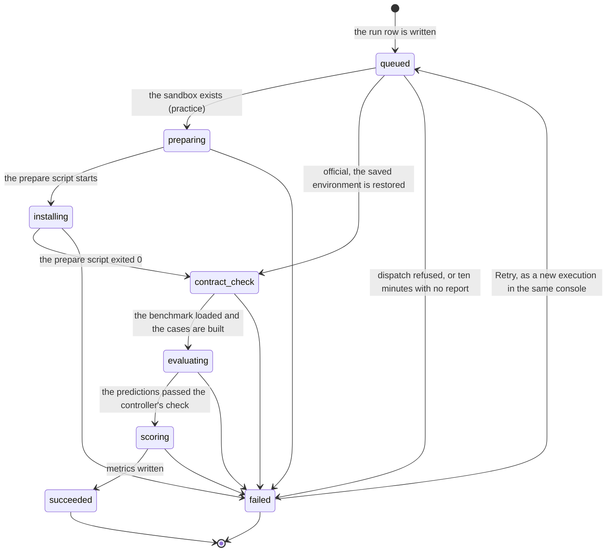

# The run

## Summary

A run is one attempt by the platform to score a team's repository at one commit. It is the platform's most durable record: it outlives the browser that started it, the terminal that watched it, and the branch that pointed at its commit.

This document owns execution statuses, practice against official runs, Retry, and what each execution keeps. [Credit and quota](../cross-cutting/credit-and-quota.md) owns when an execution counts. The sandbox documents own how each failure is attributed; this one owns what the student reads as a result.

There is no screen called "the run". A run is reached from the Runs page (`/dashboard`), from `/runs/{id}`, from its console at `/run-surfaces/{id}`, and from a Discord message. All four read the same record.

## The simple case

A student on the Runs page picks a branch and presses "Run practice benchmark". The portal resolves the branch to a forty-character commit, writes a run row, and hands the job to Modal. The lead card shows "Running now" with a pipeline rail: Queued, Prepare, Install, Contract check, Evaluate, Score, Complete. A few minutes later the run settles, and its page leads with what the scorer found, then the readings.

A succeeded practice run can be promoted once. Promotion starts a separate official execution of the same commit against hidden inputs, reusing the environment the practice run prepared. Publishing then selects a succeeded official run as the team's public entry; it starts nothing. Both acts are in [promote to the leaderboard](../portal/promote-to-the-leaderboard.md).

A failed execution can be retried from its console. Retry starts a new execution of the same recorded commit, mode and settings in the same console, and the failure stays in history.

## The ask, event by event

```mermaid
stateDiagram-v2
    [*] --> queued : the run row is written
    queued --> preparing : the sandbox exists (practice)
    preparing --> installing : the prepare script starts
    installing --> contract_check : the prepare script exited 0
    queued --> contract_check : official, the saved environment is restored
    contract_check --> evaluating : the benchmark loaded and the cases are built
    evaluating --> scoring : the predictions passed the controller's check
    scoring --> succeeded : metrics written
    queued --> failed : dispatch refused, or ten minutes with no report
    preparing --> failed
    installing --> failed
    contract_check --> failed
    evaluating --> failed
    scoring --> failed
    failed --> queued : Retry, as a new execution in the same console
    succeeded --> [*]
    failed --> [*]
```

### Asking

Access, source and capacity are checked before an execution is admitted, and checked again for every Retry.

**Who is asking, and may they.** Every start, promotion, publication and Retry asks GitHub whether the account still has write access to the connected repository (`apps/portal/worker/services/run-actions.ts:118`). The one exception is the development fixture repository, which skips the lookup (`:122`). The refusals are "Sign in to GitHub on Cog*Portal before changing a run." (`:125`), "GitHub access expired. Sign in to Cog*Portal again." (`:135`), and "Current write permission to the connected repository is required." (`:138`). Portal, Activity and CogBot share this one function, so eligibility rendered in an earlier snapshot is never trusted (`:674`).

**Which commit.** The branch is resolved to a SHA before anything starts, and that SHA is what the run is about for the rest of its life. A branch GitHub cannot resolve gets "GitHub has no branch named {branch}." (`:306`).

**Whether there is room.** One execution may be active per team and benchmark, across versions. The mode's completed evaluations plus its active reservations must be under the limit for that benchmark version (`:256`, `:257`).

### Answered without work

These refusals write no run and dispatch nothing:

- **A run is already active.** `active_run_exists`; the Runs page shows "A run is already in progress; runs go one at a time per benchmark." (`apps/portal/src/routes/DashboardPage.tsx:666`). While a run is active the launcher is replaced by "Runs go one at a time on each benchmark, so the next one can start once this one finishes." (`:243`). The lock is a partial unique index over the six active statuses (`apps/portal/worker/db/schema.ts:416`), so a race loses at the database.
- **The quota is used up.** "The practice-run quota is exhausted." or "The official-attempt quota is exhausted." (`run-actions.ts:258`, `:421`); Retry says "The completed-evaluation quota is exhausted." (`:611`).
- **The commit will not resolve.** Verifying a local run whose commit is not on GitHub yet gets "Push {sha7} to GitHub first." (`:289`).
- **The benchmark is not open.** "That benchmark version is not active." (`:158`) for an inactive version, and "This benchmark's hosted environment is not ready." (`:264`) when its sandbox contract is unset.
- **The run is not promotable.** "Only a succeeded hosted run can be promoted." (`:402`), plus the saved-environment refusals in [promotion](../portal/promote-to-the-leaderboard.md#answered-without-work).

### The work begins

**The run row is written.** That is the moment, and it is earlier than a student would guess: before any container exists. The row is inserted with status `queued` by a statement that re-counts capacity inside the insert itself (`apps/portal/worker/services/run-accounting.ts:73`), then six empty phase rows are written, then the job is dispatched. Promotion and Retry write the run and its phase rows in one batch (`run-actions.ts:457`, `:652`).

Admission reserves capacity; only a completed evaluation adds to used quota. If Modal refuses the dispatch, the run is failed at once with `E-PROVIDER` in phase `queued` and the detail "The run could not be queued for Modal." (`run-actions.ts:218`), and the button that started it shows "The run could not be queued. Try again." (`:227`). If Modal's answer is lost rather than refused, the run stays queued and keeps its reservation until a callback or the stale-run sweep settles it (`:185`).

### While it works

The sandbox sends signed, sequence-numbered events. An older event cannot roll status back, and a failed execution is never revived: a late completion for it records its findings as history but leaves it failed (`apps/portal/worker/routes/runner-events.ts:71`, `:173`).

During installation and evaluation a background thread repeats the current status every 2 seconds (`apps/runner-modal/src/cogworks_runner/modal_app.py:1250`), so a long step still looks alive. The evaluation repeat carries the case count it started with, so the count reads `0/N` until the end; see [B-22](../bug-triage.md).

The run page polls every 2 seconds while the run is active and says "Updates every 2 s." (`apps/portal/src/routes/RunDetailPage.tsx:278`); an official run says "Hidden evaluation; logs are suppressed." instead (`:277`). The Runs page polls on the same interval only while it holds an active run (`apps/portal/src/lib/queries.ts:48`). A queued run carries "Nothing has reported back yet, which is usually a short wait for a free machine. If nothing arrives within ten to fifteen minutes we stop waiting and mark this run failed, so it won't sit here all afternoon." (`apps/portal/src/lib/run-meta.ts:66`).

### How it ends

**Succeeded.** The completed event carries metrics, up to 32 diagnostics, an optional wiring trace, an optional sweep, the prepared environment's id and evidence, and an environment digest. The run becomes `succeeded` (`runner-events.ts:232`). A practice run keeps its capped log; an official run's log is never sent (`modal_app.py:2354`).

**Failed.** The run keeps its failure category, phase, detail and any structured refusal (`runner-events.ts:245`). No failure uses quota, including one the student's code caused. The run page says so in the margin: "A failed official attempt doesn't use up one of your team's attempts." or "A run that fails doesn't count against your team's practice runs." (`RunDetailPage.tsx:196`, `:197`). Observed locally on fixture data in `/tmp/cogshots/matched/pairs/b-run-failed-desk.png`.

There is no third ending. `cancelled` is in the status enum and has copy waiting for it, but nothing writes it ([B-37](../bug-triage.md)).

## Statuses and phases

Nine statuses: six active phases in order, then three terminal ones (`packages/contracts/src/schema.ts:20`, `:31`, `:40`).

| Phase | Rail label | When the sandbox reports it | What it means for the student |
| --- | --- | --- | --- |
| `queued` | Queued | Never. A run row is born with it. | Waiting for the sandbox's first report. Also the phase on a dispatch failure. |
| `preparing` | Prepare | After the sandbox is created (`modal_app.py:1520`). | Fetching the repository at the resolved commit. |
| `installing` | Install | Before the prepare script runs (`:1543`). | Installing declared dependencies. Repeated every 2 seconds. |
| `contract_check` | Contract check | After the prepare script exits 0 (`:1585`), or first when a saved environment is restored (`:2214`). | Loading the benchmark and building the cases. |
| `evaluating` | Evaluate | At the start with `0/N`, then `N/N` at the end (`:2246`, `:2258`). | The team's code running against every case. |
| `scoring` | Score | After the predictions pass the controller's check (`:2266`). | The trusted scorer turning predictions into metrics. |

| Terminal status | Meaning |
| --- | --- |
| `succeeded` | Metrics exist. A low number is a result, not a failure. |
| `failed` | A category, a phase and a sentence. |
| `cancelled` | Defined, rendered, and never written. |

**An official run, and a Retry of one, skips two phases.** A Retry resends the failed execution's recorded job (`apps/portal/worker/execution/runner.ts:264`), so a practice Retry prepares again and an official Retry restores. The official job carries the saved environment's id, the protocol refuses an official job without one ("Official runs require a prepared artifact.", `apps/runner-modal/src/cogworks_runner/protocol.py:46`), and the sandbox restores it and reports `contract_check` first (`modal_app.py:2211`). The rail does not know this: it marks every phase before the current one as done by position (`apps/portal/src/components/PhaseRail.tsx:41`), so on Modal an official run shows Prepare and Install complete with no time under them, and its page says "Every stage finished, {duration} from start to end." (`RunDetailPage.tsx:265`). The fixture provider runs every phase for every run, so this cannot be seen on local fixture data (`apps/portal/worker/execution/sync.ts:28`).

## Practice, official, and published

| | Practice | Official | Published |
| --- | --- | --- | --- |
| How it starts | "Run practice benchmark", hosted verification of a local run, or a console rerun. | Promotion of a succeeded practice run, once per practice run. | Publishing a succeeded official run. |
| What it scores against | The benchmark's public cases (`modal_app.py:1285`). | The hidden official split. | Nothing; it selects an official run. |
| Dataset recorded | `practice-v1` (`apps/portal/worker/execution/runner.ts:110`). | The benchmark's own dataset version. | The selected run's. |
| Log | Kept, capped. | Never sent. | Not applicable. |
| Title on its page | "Practice run on {branch}" | "Official attempt {n} on {branch}" (`RunDetailPage.tsx:301`) | Not applicable. |
| Who can see it | The team. | The team. | Anyone, signed in or not. |
| Counts against | Ten completed per benchmark version. | Three completed per benchmark version. | Nothing. |
| After a failure | Retry from the console. | Retry from the console. | Not applicable. |

Publishing writes one row per team, benchmark and version (`apps/portal/worker/db/schema.ts:680`), so a team has one public entry per board and can move it among its succeeded official runs.

## Retry

Retry exists so a failure the student did not cause, or one fixed on the platform's side, does not force the team to start a new run. It is offered on the console only, as a "Retry" button in place of the other actions, when the failed execution is the console's current one, its benchmark version is active, nothing else is running, the mode has capacity, and the recorded repository is still the connected one and readable (`apps/portal/worker/services/run-surfaces.ts:372`). The failure category does not decide it: a student's own exception can be retried, and fails again unless something changed. When Retry is withheld, the console says why with the server's sentence (`apps/portal/src/components/RunConsole.tsx:380`). Some of those sentences are written for an operator, such as "Retry status, team, repository, provider, or runtime version does not match." (`apps/portal/worker/execution/runner.ts:278`).

The run page links to the console as "Open current run" (`RunDetailPage.tsx:121`). For a category the catalog marks retryable, the failure card makes that link its primary next step instead (`:99`, `:209`).

Retry starts a new execution with the failed one's commit, branch, mode, dataset, scorer and saved environment (`run-actions.ts:618`). Each failure gets at most one successor, enforced by a unique index (`schema.ts:410`); replaying a Retry request returns quietly once a successor exists (`run-actions.ts:571`), and a Retry aimed at an older failure is refused with "Retry the current failed execution from its console." (`:576`). A changed repository gets "The recorded execution source is no longer available. Start a new candidate." (`:579`), and an unreadable one "The runner can't read the recorded repository and commit. Restore access before Retry." (`:596`).

Hosted beta (`4984730` lineage) exercised this once: practice run `run_f5fc5babe5` on `SamGu-NRX/week2_capstone@29f9cf9` failed `E-RUNTIME` in Evaluate, and one Retry, `run_f93ba19397`, succeeded at 0.925 on the same commit (`CogPortal-qa-video-20260930/outputs/beta-qa/hosted-run_f93ba19397/result.json`). That is the Recognition practice path only, and on beta.

## When a run fails

Twelve categories exist in the catalog (`packages/contracts/src/failures.ts:21`). None of them decides cost. Attribution comes from what the controller observes outside the student's process (elapsed time, return code, its own exceptions), never from what the submission printed; [`sandbox/timeouts-and-limits.md`](../sandbox/timeouts-and-limits.md) owns the detail.

| Category | Code | Title the student reads | Produced when | Retryable in the catalog |
| --- | --- | --- | --- | --- |
| `repository_fetch` | `E-FETCH` | "Repository could not be fetched" | The archive at the commit could not be downloaded (`modal_app.py:1574`). | Yes |
| `dependency_install` | `E-INSTALL` | "Dependency installation failed" | The prepare script exited non-zero for another reason (`:1584`). | No |
| `data_download` | `E-DATA` | "Benchmark data is not ready" | The corpus failed its digest check, or the deployed plugin's versions disagree with the job (`:1275`). | Yes |
| `model_cache` | `E-MODEL` | "Model cache is not ready" | Nothing produces it. | Yes |
| `adapter_missing` | `E-ADAPTER` | "Nothing here could be scored" | Nothing scoreable was found; carries the structured refusal (`:1581`). | No |
| `contract_invalid` | `E-CONTRACT` | "Adapter does not satisfy the contract" | Nothing, deliberately: student output must not impersonate controller evidence. | No |
| `student_runtime` | `E-RUNTIME` | "Your code raised an exception" | The evaluation process exited non-zero and was not a timeout (`:1740`, `:1826`, `:1907`). | No |
| `timeout` | `E-TIMEOUT` | "Evaluation exceeded the time limit" | 95% of the budget elapsed, or a kill signal came back (`:1996`, `:1998`). | No |
| `memory_limit` | `E-MEMORY` | "Memory limit exceeded" | "memory" or "oom" in a controller-side exception (`:1684`). | No |
| `output_invalid` | `E-OUTPUT` | "Predictions did not match the schema" | The controller's own check of the predictions. | No |
| `scorer` | `E-SCORER` | "Scoring failed on our side" | Anything unclassified raised during scoring (`:2310`). | Yes |
| `provider` | `E-PROVIDER` | "The run couldn't finish" | Sandbox failure, anything unclassified before scoring (`:2315`), a refused dispatch, or the stale-run sweep. | Yes |

**The stale-run sweep.** A Modal run still `queued` ten minutes after creation, or in any active phase an hour after creation, is failed with `E-PROVIDER` and "The execution provider stopped reporting progress." (`apps/portal/worker/execution/maintenance.ts:21`, `:32`, `:34`). The cron fires every five minutes (`apps/portal/wrangler.jsonc:92`). The hour is configurable but floored at 900 seconds (`maintenance.ts:38`).

**The evaluation process holds platform code too.** `E-RUNTIME` means "the process that ran the team's code exited non-zero", and that process also runs the platform's own pipeline. Observed on hosted beta: `run_f5fc5babe5` failed with "Your code raised an exception" and `'NoneType' object is not subscriptable`, and the exception was raised by the platform's `pipeline.py` reading one element of a per-item answer that was `None` (`hosted-run_f5fc5babe5/failed-dom.txt`). The candidate still has that read (`python/cogbench/src/cogbench/pipeline.py:834`).

## Modifiers

| Modifier | Set before the ask | Changed while it works |
| --- | --- | --- |
| Who you are | Any team member with current GitHub write access can start, promote, publish and Retry. There is no separate run permission and no instructor start path. A signed-out visitor is redirected before the Runs page renders. | No effect on a run in flight. A permission removed on GitHub stops the next action, not the current execution. |
| Where your team and repository stand | A team with no repository has no Runs page to start from. The branch list comes from GitHub; if it fails, the launcher offers the default branch and says "We couldn't load the branch list from GitHub, so only {branch} is offered. Reload the page to try again." (`DashboardPage.tsx:659`). | A changed repository does not touch a running execution; it does make promotion, publication and Retry refuse with a source sentence. |
| Which week's benchmark | Decides the corpus, the interpreter (CPython 3.8 for Week 1 and Week 3, 3.11 otherwise, `runner.ts:121`), and the memory ceiling (4096 MB for Week 1 and Week 3, 2048 otherwise, `:162`). The wall clock is 900 seconds for every benchmark (`:166`). | No effect. The job carries its own settings. |
| Practice or leaderboard | Mode decides the dataset, whether a log exists, and which limit applies. Only a succeeded official run can be published. | Retry preserves mode. Promotion creates a separate official run; the practice run is unchanged. |
| Flags, options, and where you are typing | Portal, Activity and CogBot reach the same server actions. A local CLI run uses no hosted quota. Retry exists only on the console, Discord and the Activity. | Where the student watches does not change the record. |

## Cancel and interrupt

| Event | Before the work begins | While it works |
| --- | --- | --- |
| You stop it yourself | Not pressing start, or letting an armed confirm expire, starts nothing. | There is no stop control anywhere. Closing the view leaves the execution running until it succeeds or fails. |
| You do something else mid-way | Navigating away before pressing start costs nothing. | The run outlives the tab and the session. A second start on the same benchmark is refused with `active_run_exists`. |
| A teammate acts at the same time | Two simultaneous starts produce one run and one `active_run_exists`, decided by the unique index. | A teammate's push does not affect a run in flight. Two teammates pressing Retry on one failure produce one successor. |
| The network or the portal fails | A request that fails before admission writes nothing; the error appears under the button pressed. | Runner callbacks are retried by the sandbox and deduplicated by event id after they apply (`runner-events.ts:311`). A run whose callbacks stop is failed by the stale-run sweep. |
| The page or the process goes away | Nothing to lose. | A closed tab changes nothing. A killed container returns non-zero with no traceback, so the controller decides from elapsed time and return code. |
| The thing being measured changes | The branch is resolved when the start is pressed; a push a second later is not in this run. | A run is about its commit. A benchmark version going inactive mid-run does not stop it, but blocks the next promotion and Retry with "That benchmark version is not active." |
| The platform refuses or credit runs out | Admission refuses without dispatch. | A failed execution uses no quota whatever its category. |

## Interactions with other systems

**Who may do this.** Current write access to the connected repository, rechecked against GitHub on every start, promotion, publication and Retry, except on the development fixture repository, which skips the check. See [`the-team-and-the-repository.md`](the-team-and-the-repository.md).

**The team owns it.** Every run belongs to the team. The run's console records who created it and the console shows `@login`; the run page and the Runs list name no person.

**Credit.** Completed practice and official evaluations count against separate limits per benchmark version. Failures, reading and publishing are free. See [credit and quota](../cross-cutting/credit-and-quota.md).

**What the portal claims.** A hosted run's metrics are *verified*. An `adapter_missing` run produces a *refusal* rather than a zero. A Week 3 run whose image side never bound *withholds* its overall and leads with `text_mrr`. The words are defined in [`what-the-portal-claims.md`](what-the-portal-claims.md). The `E-RUNTIME` title claims the student's code raised, which is not always what the controller observed (above).

**What the benchmark supplied.** Weights carried from a local run are named on the run page as "{paths} from your local run at {sha7}" (`RunDetailPage.tsx:179`). Other supplied resources are not shown on the run page; see [`what-the-portal-claims.md`](what-the-portal-claims.md#supplied-by-the-benchmark).

**Live updates and reconnection.** The run page and Runs page poll; the console holds a socket; a Discord message is edited in place. See [`../cross-cutting/live-updates.md`](../cross-cutting/live-updates.md).

**Discord.** A run with a bound team channel is echoed there. See [`../discord/channel-messages.md`](../discord/channel-messages.md).

**Configuration.** The wall clock, memory, CPU count and output cap are set per job by the portal (`runner.ts:114`), not by the benchmark plugin. The stale threshold is the one limit an operator can change (`wrangler.jsonc:82`).

## Edge cases

- **`queued` is a phase nobody reports.** No sandbox event carries it; it is the value a row starts with and the phase on a dispatch failure.
- **`cancelled` is unreachable.** No worker, sandbox or CLI path writes it, yet the Runs page has "Cancelled {ago}." (`DashboardPage.tsx:457`) and the console has "Stopped before completion" (`RunConsole.tsx:87`).
- **Two categories have no producer.** `model_cache` and `contract_invalid`. In the live console, `data_download` and `model_cache` fall through to the provider stream code because the map omits them (`run-surfaces.ts:60`).
- **A version mismatch reads as missing data.** The deployed plugin disagreeing with the job raises `data_download`, titled "Benchmark data is not ready" ([B-21](../bug-triage.md)).
- **Attempt numbers can repeat.** An official run is numbered by completed official evaluations plus one at the moment it is admitted (`run-accounting.ts:81`), so failed attempts and their Retry can share a number.
- **A late result does not revive a failure.** A completion arriving after the stale-run sweep failed the run stores its metrics on the failed run as history; the run stays failed and cannot be published (`runner-events.ts:173`).
- **The durable orchestrator is a plan.** `apps/portal/worker/orchestration/run-workflow.ts` and the Cloudflare sandbox adapter are not what runs; every real run goes to Modal.

## Open questions and verification

- `E-RUNTIME` is assigned to any non-zero exit of the evaluation process, which also runs platform code. The `pipeline.py:834` crash that produced it on hosted beta is fixed only on beta (`468655c`). Carried to triage.
- Nothing writes `cancelled` and no surface offers a stop ([B-37](../bug-triage.md)).
- An official run's rail and its "Every stage finished" sentence claim Prepare and Install ran. Read from code; the fixture provider cannot show it. Carried to triage.
- `packages/contracts/src/failures.ts:101` hardcodes "the 15-minute wall-time ceiling" while the job's budget is set in `runner.ts:166` ([B-35](../bug-triage.md)).
- Whether the stale-run sweep or Modal's own failure callback ends a stuck run first was not observed.
- Hosted beta (`4984730`) differs: only in `pipeline.py`, which keeps a per-item `None` answer (beta `python/cogbench/src/cogbench/pipeline.py`, commit `468655c`) where the candidate indexes it (`pipeline.py:834`). `run-actions.ts`, `run-accounting.ts`, `run-surfaces.ts`, `runner-events.ts` and `maintenance.ts` match the candidate apart from one comment (`run-actions.ts:89` on the candidate).

Read against Cog\*Portal commit `2ff32fa`. Local fixture observations are named where used; the Retry observation is hosted beta, not this build.
