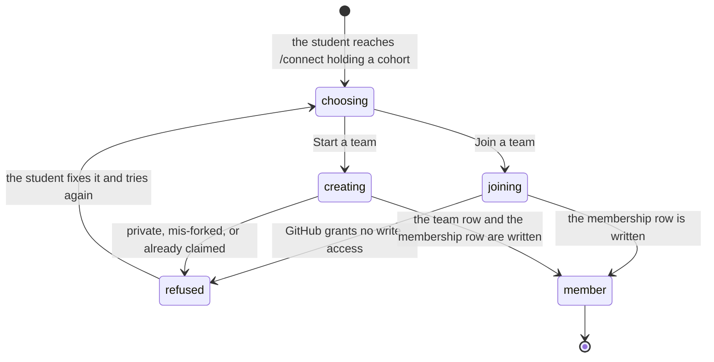

# The team and the repository

## Summary

A team on Cog\*Portal is a GitHub repository with people attached to it. Not a group that owns a repository, and not a roster that happens to have one: the repository is the row, and everything a team has (runs, credit, a leaderboard entry, a Discord channel) hangs off it. This document owns that rule, what follows from it, and how somebody becomes a member. It defines the three team roles, says where each comes from and what each may do, and names every way membership can change.

There is no page called "the team". The rule shows up as a wizard with two doors on `/connect`, a members panel on `/team`, and one sentence in an error card: "This view belongs to a team, and you're not on one yet. Connect a repository and the team exists." (`apps/portal/src/lib/query-error-state.ts:159`).

> **In flight.** The team page's process-signals panel and its co-author credit were being edited while this was drafted (`apps/portal/src/routes/TeamPage.tsx`, `apps/portal/worker/services/process-signals.ts`, `apps/portal/worker/routes/team.ts`). Nothing in this document depends on that panel, but a verifier should re-read those files rather than trusting any sentence here that touches them.

## The simple case

Four students fork the course template. The first one to reach `/connect` picks the fork, types a team name, and presses the button. A team exists, and they are its admin. The other three reach the same page, see the team in the cohort list, and press Join. The portal asks GitHub whether each of them can write to that fork; the ones who can become members, and the ones who have not accepted their collaborator invitation yet are told to go and accept it.

From then on the four share one thing completely. Every run any of them starts belongs to the team, spends the team's credit, and appears on every teammate's dashboard. Nothing anywhere records which of the four pressed the button.

## The repository is the team

`teams.repoFullName` is `notNull()` (`apps/portal/worker/db/schema.ts:137`). There is no route that creates a team without one, because the only function that inserts a team row is `connectTeam`, and its second argument is a repository (`apps/portal/worker/github/team.ts:34`). A team is created by connecting one, and that is the whole of team creation. The connect page states the rule outright: "You do this once. The repository is the team; everyone with write access shares its attempts." (`apps/portal/src/routes/ConnectPage.tsx:103`).

Three unique indexes carry the consequences:

- **One repository, one team, per cohort** (`teams_cohort_repo_unique` on `cohortId` and `repoFullName`, `db/schema.ts:145`). Two teams in the same cohort cannot claim the same fork, and the connect path says whose it is: `That repository is already connected by team {name}.` Two different cohorts may hold the same repository, which is what makes a repository reusable next year.
- **One team per student, everywhere** (`team_members_user_unique` on `userId`, `db/schema.ts:192`). Not one per cohort: one, full stop. The index exists to close a race where two simultaneous joins each read "no membership" and both inserted.
- **One Discord channel, one team** (`teams_discord_channel_unique`, `db/schema.ts:146`). SQLite treats nulls in a unique index as distinct, so any number of teams may have no channel, but a bound channel belongs to exactly one team.

What follows for a student is that leaving a team is not a thing they can do to themselves, and joining a second one is not either. Membership is close to permanent, and the section on removal below says who can end it.

## Roles on a team

Three roles, and the portal writes them from GitHub rather than offering them as a choice. `teamRole` maps GitHub's `admin`, `maintain`, and `write` through unchanged, maps `push` to `write`, and maps everything else to nothing, which is the refusal (`apps/portal/worker/github/permissions.ts:3`). The team page prints them as "admin", "maintainer", and "member" (`apps/portal/src/routes/TeamPage.tsx:31`).

| Role | Where it comes from | What it may do that the others may not |
| --- | --- | --- |
| `admin` | Creating the team, or holding admin on the repository at the moment of joining. | Rename the team, edit its description, add and remove members, and change the connected repository. Cannot be removed from the team page. |
| `maintain` | GitHub `maintain` at the moment of joining. | Choose the team's Discord channel. Anyone else asking is refused with "A team creator or maintainer needs to choose the team channel." (`apps/portal/worker/services/discord.ts:218`). Otherwise identical to a member. |
| `write` | GitHub `write` or `push` at the moment of joining, or being added from the team page. | Everything every member can do: start runs, promote, read the team's pages. |

Two things about that table are worth stating plainly.

**The stored role is a snapshot, and one gate refuses to trust it.** The role was written when the person joined and is never refreshed on its own. That let a creator who had since been demoted or removed on GitHub keep renaming the team indefinitely, and it blocked staff from fixing it, because the removal route saw the stale admin role and pointed staff back at GitHub where the change had already happened. `requireTeamAdmin` now re-reads the GitHub permission at the gate, writes the true role back, and refuses with "Your GitHub permission on the team repository is no longer admin, so team settings are read-only for you." (`apps/portal/worker/routes/team.ts:180`). A GitHub outage keeps the stored role, since refusing every admin action during one would be the larger failure.

**Starting a run does not read the stored role at all.** The browser actor is built with the role hardcoded to `write` (`apps/portal/worker/services/run-actions.ts:49`), and the real check is `requireCurrentRepositoryPermission`, which asks GitHub afresh and accepts `admin`, `maintain`, `write`, or `push` (`run-actions.ts:98`). So the authority to spend a team's credit is GitHub's answer today, not the portal's record from joining day. Its three refusals are "Sign in to GitHub on Cog\*Portal before changing a run.", "GitHub access expired. Sign in to Cog\*Portal again.", and "Current write permission to the connected repository is required."

## The ask, event by event

The ask this document narrates is becoming a member of a team: a student with a cohort and no team arrives at `/connect` and leaves with one.

### Asking

What is targeted is a repository, named by its `owner/name`, and in the create branch a team name as well. What is validated before anything runs is the cohort: `requireCohort` refuses with "Join a cohort first." (`apps/portal/worker/routes/team-membership.ts:35`), and the connect route refuses a student who already has a team with "You are already on a team." before any insert, so a team row cannot be created and then orphaned by a failed membership write (`apps/portal/worker/routes/github.ts:158`).

The page decides which door to show. With no teams in the cohort there is nothing to join, so the choice screen is skipped and the student goes straight to Start a team. An errored teams query is not allowed to look like an empty cohort, because that would quietly funnel everyone into creating duplicates of the same team (`apps/portal/src/routes/ConnectPage.tsx:69`).

### Answered without work

The create branch refuses six ways, and none of them writes anything:

- No cohort, or already on a team, as above.
- No team name, when the repository is not already a team: "Choose a team name to create the team." (`apps/portal/worker/github/team.ts:50`).
- A private repository: "Repositories must be public to run the benchmark."
- No write access on GitHub: "You need write access to run the benchmark for this repository."
- Not a fork of the course template: `Repository must be a fork of the course template {template}.` (`apps/portal/worker/github/template.ts:20`).
- The repository already belongs to another team in the cohort.

The join branch has one refusal and it is the long one, because it is the only one whose fix is entirely outside the portal:

> `Ask {admin} to add you as a collaborator on GitHub, then accept the invitation GitHub emails you (github.com/notifications) and press Join again. They can also add you here from Team settings.` (`apps/portal/worker/routes/team-membership.ts:69`)

It names the team's admin when one can be found, falls back to "a team admin" when none can, and it is the same sentence whether GitHub said no or the student has no GitHub token at all.

### The work begins

The moment the membership row is written. Before it, an abandoned connect leaves nothing; after it, this student is on this team and only an admin can take them off it.

In the create branch two rows are written in sequence, and the order matters. `connectTeam` inserts the team with `onConflictDoNothing`, then re-reads by `(cohortId, repoFullName)`, and grants `admin` only when the row it read back is the one it just wrote (`apps/portal/worker/github/team.ts:74`). Two students connecting the same fork in the same instant therefore produce one team with one admin and one member, rather than two teams or two admins. The membership insert upserts, and its update clause refuses to demote an existing admin.

### While it works

Nothing streams. Both branches are one request, and the page holds its own redirect open while the mutation settles: the connect page suppresses its "you already have a team, go to the dashboard" guard for as long as a join or create is in flight, because the refreshed session gains a team the instant the request returns and would otherwise unmount the handler before it could navigate (`apps/portal/src/routes/ConnectPage.tsx:52`).

### How it ends

Both branches answer with the same shape the rest of the team surface uses, and the page sends the student to `/setup`. The session now carries a team, so every gated route stops redirecting. See [`portal/setup.md`](../portal/setup.md).

The failure path is a sentence in the page's error region, and the student stays on the wizard. Nothing partial survives a failed create: either the team and the membership both exist or neither does.

## Modifiers

| Modifier | Set before the ask | Changed while it works |
| --- | --- | --- |
| Who you are | Signed out never reaches `/connect`; the gate sends the student to `/signin` first. A student with no cohort is sent to `/join`. A student who already has a team is refused before any write. Staff have no special path: an instructor joins a team the same way a student does, and the admin page does not create teams. | No effect. The actor is read once per request. |
| Where your team and repository stand | This is the ask. The three states the page can be in are no teams in the cohort (create only), teams exist (both doors), and the teams query failed (both doors, with the join list refusing to claim the cohort is empty). A repository already claimed by another team is named in the refusal. | A teammate creating the team while this student is on the create screen turns their create into a join: `connectTeam` finds the existing row and gives them `write` rather than `admin`, with no message saying the team was already there. |
| Which week's benchmark | No effect. A team is not scoped to a benchmark, and the connect wizard names none. | No effect. |
| Practice or leaderboard | No effect on membership. Both are team-owned afterwards, and neither is reachable without a team. | No effect. |
| Flags, options, and where you are typing | Only the browser can create or join a team. The CLI cannot: `cogworks link` requires a team already and says so, "Finish joining a team and connecting its repository first." (`apps/portal/worker/routes/connections.ts:311`). Discord cannot either; `/cog` reports team status and refuses to invent one. | No effect. |

## Cancel and interrupt

| Event | Before the work begins | While it works |
| --- | --- | --- |
| You stop it yourself | Pressing Back on the wizard returns to the choice screen and forgets nothing durable; no row exists yet. Closing the tab is the same. | Closing the tab after the request left the browser does not cancel it. The team may exist without the student ever seeing the confirmation, and reopening `/connect` redirects them to the dashboard, which is the only sign it worked. |
| You do something else mid-way | Opening `/team` in a second tab before joining hits the `team` gate and redirects to `/connect`. | Submitting twice is refused by the unique index rather than by the page: the second insert raises, and the route translates it into "You are already on a team." rather than a 500 (`apps/portal/worker/routes/team-membership.ts:177`). |
| A teammate acts at the same time | A teammate adding this student from the team page while they sit on `/connect` makes the wizard's next submit fail with "You are already on a team.", which is accurate but reads as a refusal rather than as good news. | The create race is handled explicitly, as above: one team, one admin. The join race is handled by the same unique index. |
| The portal fails | A failed cohort-teams query shows the error panel and does not claim the cohort is empty. A failed session read with nothing cached shows a `QueryError` before the wizard renders at all. | A GitHub outage during the permission read surfaces as the request's own failure. The team is not created on a guess: `getRepo` and `getPermission` both have to answer before any row is written. |
| The process goes away | Nothing survives. No draft team, no reserved name. | The write is a single request; either it committed or it did not. There is no half-created team, because the membership insert upserts and a team row with no members is only reachable if the request died between the two writes. That window exists and nothing cleans it up; see Open questions. |
| The thing being measured changes | A repository renamed on GitHub between the picker rendering and the submit is refused by `getRepo` under its old name. The refusal is GitHub's, and the page shows it. | A repository that becomes private between the listing and the submit is refused with "Repositories must be public to run the benchmark." |
| Refused, or out of credit | Credit is not consulted. Creating and joining a team cost nothing. | No effect. |

## Interactions with other systems

**Who may do this.** Creating or joining needs a cohort and no existing team. Renaming, adding, removing, and changing the repository need `admin` and a GitHub permission that still says admin. Choosing the Discord channel needs `admin` or `maintain`. Starting a run needs current GitHub write access, which the portal re-reads rather than trusting its own record. See [`identity-and-roles.md`](identity-and-roles.md#the-two-role-ladders).

**The team owns it.** Everything. Runs, credit, quota, leaderboard entries, local reports synced by any member, the Discord channel, and the process signals. The rule holds all the way down: there are no per-person numbers anywhere on the platform, including private ones. See [`what-the-portal-claims.md`](what-the-portal-claims.md#no-per-person-numbers). The team page's members panel names who is on the team and nothing about what any of them did.

**Credit.** Per team and per benchmark, not per person: ten hosted practice runs and three official attempts. Joining a team does not add credit, and leaving one, which nobody can do, would not remove any. See [`../cross-cutting/credit-and-quota.md`](../cross-cutting/credit-and-quota.md).

**What the portal claims.** The team page reports what it stored. It does not claim that a member can push: the panel comment says so directly, and the interface repeats it wherever it matters, because portal membership and GitHub collaboration are two different facts and the portal only observed one of them. See [`what-the-portal-claims.md`](what-the-portal-claims.md#verified).

**What the benchmark supplied.** Nothing. No benchmark is loaded on any membership path.

**Live updates and reconnection.** None on the connect wizard. The team page's process signals are recomputed at most every 30 minutes and served from a cached row in between (`apps/portal/worker/routes/team.ts:199`), so a commit pushed a minute ago may not appear.

**Discord.** A team may bind one channel, and the binding is unique. `cogworks status` prints the raw channel snowflake or "team channel not chosen". A Discord user acting on a team is resolved through their linked account, and that path checks the stored team role where the browser path does not; the asymmetry is in Open questions.

**Configuration.** Which repositories may be connected is a deployment property: `GITHUB_TEMPLATE_REPO_ID` is checked against the fork's source repository id when it is set, and `GITHUB_TEMPLATE_REPO` against the parent's full name when it is not (`apps/portal/worker/github/template.ts:5`). With neither set, any public repository the student can write to is acceptable.

## Edge cases

- **A cohort join code is not unique in the schema.** `cohorts.joinCode` is `notNull()` with no unique index (`apps/portal/worker/db/schema.ts:16`), and the join route matches on the uppercased code plus `active` and takes the first row with no ordering (`apps/portal/worker/routes/cohorts.ts:16`). Two active cohorts sharing a code would send students to an arbitrary one of them.
- **The join page rewrites the server's sentence.** The worker says "The cohort join code is invalid."; the page shows "That code doesn't match. Check the code your instructor shared." for that one code and passes every other message through unchanged (`apps/portal/src/routes/JoinPage.tsx:29`). The rewrite is better copy, and it means a change to the worker's sentence will not reach the student.
- **Changing the cohort is refused while on a team.** "You're on a team in your current cohort. Leave it before joining a different cohort." (`apps/portal/worker/routes/cohorts.ts:34`). The sentence names an action that does not exist anywhere in the interface.
- **A member added from the team page gets `write` regardless of GitHub.** `POST /team/members` inserts the role literally (`apps/portal/worker/routes/team-membership.ts:251`) while `POST /team/join` reads GitHub first. The panel is honest about the gap in its own comment, and the run path catches it later by re-reading GitHub, so the student is refused at run time rather than at add time, one screen away from the person who could fix it.
- **Adding somebody who has never signed in fails with a sentence containing an em dash.** The message is "No CogPortal account with that GitHub login yet", then an em dash, then "they need to sign in once first." (`apps/portal/worker/routes/team-membership.ts:226`). Em dashes are ruled out for student-facing strings by `docs/design/voice.md`, so this one is a voice defect as well as a wording choice.
- **An admin cannot be removed here, and nobody can remove themselves.** "A team admin cannot be removed here. Change their permission on GitHub instead." (`apps/portal/worker/routes/team-membership.ts:294`). There is no leave control on the team page or anywhere else, and no route behind one. A member who joined the wrong team must find their admin.
- **A repository swap rewrites the past.** `POST /team/repository` is refused while a run is active, but once it succeeds every earlier run of that team renders under the new repository name, because the run detail payload builds its `repo` block from the team row rather than from the run's own `repositoryId` (`apps/portal/worker/http/serializers.ts:125`). The commit SHA on the page is the old repository's; the name above it is the new one's.
- **The fixture repository bypasses GitHub entirely.** On a development deployment, connecting or joining the fixture repository grants `write` without asking GitHub anything (`apps/portal/worker/routes/team-membership.ts:149`), and `requireCurrentRepositoryPermission` returns before its first call for that repository (`apps/portal/worker/services/run-actions.ts:83`). Every permission story in this document is therefore untestable on the fixture team.
- **Renaming a team does not rename anything else.** The repository keeps its name, the Discord channel keeps its name, and the leaderboard shows the new name against entries promoted under the old one. Nothing records that a rename happened.

## Open questions and verification

- The Discord path and the browser path disagree about what membership means. `discordRunActor` refuses any role outside `admin`, `maintain`, or `write` with "Current write access to the team repository is required." (`apps/portal/worker/services/run-actions.ts:68`), while `getDiscordTeamStatus` accepts any membership row at all and reports the team (`apps/portal/worker/services/discord.ts:154`). Since `teamMembers.role` only ever holds those three values today, the gate is currently unreachable, and the two paths will diverge the moment a fourth role exists. Worth deciding which is right rather than leaving both. Treat as a bug.
- There is no way for a member to leave a team, and one error sentence tells them to do it (`apps/portal/worker/routes/cohorts.ts:34`). Either the control is missing or the sentence is wrong. Treat as a bug; it needs a product decision, not a patch.
- Old runs render under the team's current repository after a swap (`apps/portal/worker/http/serializers.ts:125`). The run row carries a `repositoryId` that would answer correctly and is not read. Treat as a bug. **Unverified**: no swap was performed against a running portal.
- `connectTeam` writes the team row and the membership row as two statements with no transaction (`apps/portal/worker/github/team.ts:53`, `:77`). A failure between them leaves a team with a repository claim and no members, which nothing detects and nothing cleans up, and which would then refuse the next student with `That repository is already connected by team {name}.` How reachable this is on D1 was not established.
- Whether a cohort can hold two teams with the same name was not checked; `teams.name` has no unique index, and the cohort list orders by name.
- Whether the 30 minute process-signals cache is visible to a student as stale data was not measured. **Unverified**, and the panel was in flight.
- The glossary has no entry for the three team roles. This document uses the interface's words ("admin", "maintainer", "member") and the code's values. A glossary addition is owed.

Verified against Cog\*Portal commit `f74e087`.
