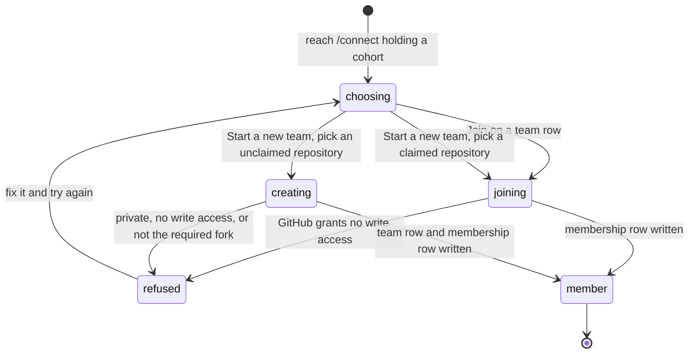

# The team and the repository

## Summary

A team on Cog\*Portal is a GitHub repository with people attached to it. The repository is the row, and everything a team has (runs, credit, a leaderboard entry, a Discord channel) hangs off it. This document owns that rule, what follows from it, and how somebody becomes a member. It defines the three team roles, says where each comes from and what each may do, and names every way membership can change.

There is no page called "the team". The rule shows up as the third step of the onboarding path, "Join or start your team" on `/connect`, a People section on `/team`, and one margin note: "The repository is the team. Everyone who can push to it shares its practice runs and official attempts, so it should be the one you'll actually work in." (`apps/portal/src/routes/ConnectPage.tsx:183-185`).

## The simple case

Four students share a repository. The first one to reach `/connect` picks "Start a new team", picks the repository, accepts or types a team name, and presses "Create {name}". A team exists and they are its admin. The other three reach the same page. When the portal's GitHub listing for them includes that repository, the team sits in a box headed "You can see this team's repository on GitHub, so it's probably yours" with a Join button (`ConnectPage.tsx:191-211`); otherwise they find it under "Join a team someone already started". The portal asks GitHub whether each can write to that repository; the ones who can become members, and the others are told whom to ask.

From then on the four share the team's work. Every run any of them starts belongs to the team, spends the team's credit, and appears on every teammate's Runs page. Nothing records which of the four pressed the button.

## The repository is the team

`teams.repoFullName` is `notNull()` (`apps/portal/worker/db/schema.ts:140`), and the only function that inserts a team row is `connectTeam`, whose argument is a repository (`apps/portal/worker/github/team.ts:34`). A team is created by connecting one.

Three unique indexes carry the consequences:

- **One repository, one team, per cohort** (`teams_cohort_repo_unique`, `schema.ts:152`). Picking a repository another team in the cohort holds joins that team instead of creating a second one.
- **One team per student, everywhere** (`team_members_user_unique`, `schema.ts:196`). The index closes the race where two simultaneous joins each read "no membership".
- **One Discord channel, one team** (`teams_discord_channel_unique`, `schema.ts:153`). Any number of teams may have no channel.

A student cannot leave their team or join a second one. (`b0e0c55`: a student can leave, which deletes only their membership; the team and its history stay. They still cannot be on two teams at once.)

A team also has a provenance. Rows marked `archive` are past-course demonstrations with names replaced; the cohort team list omits them and a direct join is refused with "This is a past-course demonstration with names replaced, so there's nothing to join. Choose a current team." (`apps/portal/worker/routes/team-membership.ts:81`, `:141-147`).

## Roles on a team

Three roles, written from GitHub rather than offered as a choice. `teamRole` maps `admin`, `maintain`, and `write` through, maps `push` to `write`, and maps everything else to null, which is a refusal (`apps/portal/worker/github/permissions.ts:3`). The team page labels them "Admin", "Maintainer", and nothing (`apps/portal/src/routes/TeamPage.tsx:34`).

| Role | Where it comes from | What it may do that the others may not |
| --- | --- | --- |
| `admin` | Creating the team, or holding admin on the repository when joining. | Rename the team, edit its description, add and remove members, and change the connected repository. Cannot be removed from the team page. |
| `maintain` | GitHub `maintain` when joining. | Choose the team's Discord channel. Otherwise the same as a member. |
| `write` | GitHub `write` or `push` when joining, or being added from the team page. | Start runs, promote, and read the team's pages. |

**The stored role is a snapshot, and the admin gate refuses to trust it.** `requireTeamAdmin` first refuses anyone not stored as admin with "Only the team creator can change team settings." (`apps/portal/worker/routes/team.ts:149`), then re-reads GitHub, writes the true role back, and refuses with "Your GitHub permission on the team repository is no longer admin, so team settings are read-only for you." (`team.ts:187`). A GitHub outage keeps the stored role.

**Starting a run does not read the stored role at all.** The browser actor is built as `write` (`apps/portal/worker/services/run-actions.ts:59`), and `requireCurrentRepositoryPermission` asks GitHub afresh (`run-actions.ts:118`). Its refusals are "Sign in to GitHub on Cog\*Portal before changing a run.", "GitHub access expired. Sign in to Cog\*Portal again.", and "Current write permission to the connected repository is required." (`run-actions.ts:125`, `:135`, `:138`).

## The ask, event by event

The ask is becoming a member: a student with a cohort and no team arrives at `/connect` and leaves with one.

```mermaid
stateDiagram-v2
    [*] --> choosing : reach /connect holding a cohort
    choosing --> joining : Join on a team row
    choosing --> creating : Start a new team, pick an unclaimed repository
    choosing --> joining : Start a new team, pick a claimed repository
    joining --> refused : GitHub grants no write access
    joining --> member : membership row written
    creating --> refused : private, no write access, or not the required fork
    creating --> member : team row and membership row written
    refused --> choosing : fix it and try again
    member --> [*]
```

### Asking

What is targeted is a team (join) or a repository by `owner/name` plus a team name (create). Both routes refuse a caller with no cohort ("Join a cohort first.", `team-membership.ts:35`, `apps/portal/worker/routes/github.ts:159`) and a caller already on a team ("You are already on a team.", `team-membership.ts:131`, `github.ts:165`) before anything is written.

The page decides which door to show. With no teams in the cohort it goes straight to "Start your team" (`ConnectPage.tsx:90`). An errored team list is not treated as an empty cohort: the start screen says "We couldn't check the cohort's teams, so joining is hidden until this loads. Starting a team still works." (`ConnectPage.tsx:294-295`).

### Answered without work

The create path refuses, writing nothing, when:

- The repository is private: "Repositories must be public to run the benchmark." (`github.ts:192`).
- The caller has no write role on GitHub: "You need write access to run the benchmark for this repository." (`github.ts:202`).
- `GITHUB_TEMPLATE_REPO_ID` is set and the repository does not descend from it: "This cohort only accepts forks of {template}, and this repository isn't one. Fork that template and connect the fork." (`apps/portal/worker/github/template.ts:23`).
- The caller has no GitHub token or login: "Sign in with GitHub to connect a repository." (`github.ts:183`).
- No team name reached the server for a new team: "Choose a team name to create the team." (`apps/portal/worker/github/team.ts:50`).

The join path has one refusal, for every case where GitHub does not grant a writable role:

> `Ask {admin} to add you as a collaborator on GitHub, then accept the invitation GitHub emails you (github.com/notifications) and press Join again. They can also add you here from Team settings.` (`team-membership.ts:69`)

It names the team's admin when there is one and "a team admin" otherwise.

### The work begins

When the membership row is written. Before it, an abandoned connect leaves nothing; after it, only an admin can take this student off the team.

In the create path, `connectTeam` inserts the team with `onConflictDoNothing`, re-reads it, and grants `admin` only when the row read back is the one it wrote (`github/team.ts:52-74`). Two students connecting the same repository at the same instant produce one team, one admin and one member. The membership upsert never demotes an existing admin (`github/team.ts:77-85`). The two writes are not a transaction.

### While it works

One request. The page suppresses its "you already have a team, go to Runs" redirect while a join or create is pending or has just succeeded, because the refreshed session gains a team before the success handler navigates (`ConnectPage.tsx:77-78`, `:104`). It also stops the GitHub repository listing so a stalled listing cannot hold a finished join on the page (`ConnectPage.tsx:85`).

### How it ends

The student is sent to `/setup` with a note about how they arrived; the setup page then says "You've created {team}" or "You're on {team}" once (`apps/portal/src/routes/SetupPage.tsx:495`). A failure is a sentence beside the button or the team row, and the student stays on the step.

## Modifiers

| Modifier | Set before the ask | Changed while it works |
| --- | --- | --- |
| Who you are | Signed out never reaches `/connect`. No cohort is sent to `/join`. Already on a team is sent to Runs. Staff have no special path: an instructor joins or creates a team the same way, and the admin page does not create teams. | No effect. The actor is read once per request. |
| Where your team and repository stand | This is the ask. No teams in the cohort means the start screen only; teams means a choice screen and a join list; an errored list hides joining and keeps starting. | A teammate creating the team a moment earlier turns this student's create into a join with `write`, with no message saying so. |
| Which week's benchmark | No effect. A team is not scoped to a benchmark. | No effect. |
| Practice or leaderboard | No effect on membership. | No effect. |
| Flags, options, and where you are typing | Only the browser creates or joins. `cogworks link` needs a team already: approval is behind `requireTeam` (`apps/portal/worker/routes/connections.ts:171`). Discord reports team status and cannot make one. | No effect. |

## Cancel and interrupt

| Event | Before the work begins | While it works |
| --- | --- | --- |
| You stop it yourself | "Back" or the browser's back gesture returns to the choice screen; the chosen path lives in `?path=` (`ConnectPage.tsx:58-60`). Nothing durable exists yet. | Closing the tab after the request left does not cancel it. The next visit to `/connect` sends the student to Runs. |
| You do something else mid-way | Opening `/team` in a second tab redirects to `/connect`. | A second Join press while one is pending is ignored (`ConnectPage.tsx:132`). A second submit that reaches the server is refused by the index and translated to "You are already on a team." (`team-membership.ts:187-189`). |
| A teammate acts at the same time | A teammate adding this student from the team page makes their next press fail with "You are already on a team." | The create race yields one team and one admin; the join race is held by the same index. |
| The network or the portal fails | A failed team list keeps the start path open and says joining is hidden. | A GitHub failure during the permission read is the request's own failure. The team is not created on a guess. |
| The page or the process goes away | Nothing survives. | The team row and the membership row are separate writes; a request that dies between them leaves a team with a claim and no members. |
| The thing being measured changes | A repository made private between the listing and the press is refused with the public-repository sentence. | No effect. |
| The platform refuses or credit runs out | Credit is not consulted. | No effect. |

## Interactions with other systems

**Who may do this.** Creating or joining needs a cohort and no team. Renaming, adding, removing and changing the repository need `admin` and a GitHub permission that still says admin. Choosing the Discord channel needs `admin` or `maintain`. Starting a run needs current GitHub write access. See [`identity-and-roles.md`](identity-and-roles.md#the-two-role-systems).

**The team owns it.** Runs, credit, quota, leaderboard entries, synced local reports, the Discord channel and the process signals. There are no per-person numbers anywhere; see [`what-the-portal-claims.md`](what-the-portal-claims.md#no-per-person-numbers). The team page's People section names who is on the team and nothing about what any of them did.

**Credit.** Per team, benchmark and version: ten completed hosted practice evaluations and three completed official ones. Joining adds none. See [`../cross-cutting/credit-and-quota.md`](../cross-cutting/credit-and-quota.md).

**What the portal claims.** Membership is the portal's own record. Adding someone on the team page does not give them GitHub access, and a member list on `/connect` shows only people who have signed in to the portal.

**What the benchmark supplied.** Nothing.

**Live updates and reconnection.** None on the wizard. The cohort team list is fresh for 30 seconds and is not polled (`apps/portal/src/lib/queries.ts:324-331`).

**Discord.** A team may bind one channel. A Discord user acting on a team is resolved through their linked account. The status path accepts any membership row while the run-actor path checks the stored role (`apps/portal/worker/services/discord.ts:154-159`, `run-actions.ts:78-79`); see Open questions.

**Configuration.** `GITHUB_TEMPLATE_REPO_ID` restricts ancestry when set. `GITHUB_TEMPLATE_REPO` only names the template on the fork button and in copy; it no longer rejects other repositories (`template.ts:13-16`). With the id unset, any public repository the student can write to is accepted.

## Edge cases

- **A cohort join code is not unique in the schema.** `cohorts.joinCode` has no unique index (`schema.ts:19`), and the join route takes the first match with no ordering (`apps/portal/worker/routes/cohorts.ts:16-20`).
- **The cross-cohort refusal is unreachable from the interface.** "You're on a team in your current cohort. Leave it before joining a different cohort." (`cohorts.ts:38`) needs a student with a team to post a join code, and `/join` redirects anyone who already has a cohort (`apps/portal/src/routes/JoinPage.tsx:21-23`). It names an action that does not exist.
- **A member added from the team page gets `write` regardless of GitHub.** `POST /team/members` inserts the role literally (`team-membership.ts:261`) while `POST /team/join` asks GitHub. The run path catches it later.
- **An admin cannot be removed here, and nobody can remove themselves.** "A team admin can't be removed." (`team-membership.ts:304`). There is no leave control or route.
- **The join refusal names a place that is gone.** It says "They can also add you here from Team settings." The team page's sections are now "People" and "Repository" (`TeamPage.tsx:345`, `:462`).
- **A repository swap no longer rewrites the past.** Run summaries and details read the run's own repository (`apps/portal/worker/http/serializers.ts:114`), so an old run keeps the repository it ran against.
- **The fixture repository bypasses GitHub.** On a development deployment, connecting or joining it grants `write` without asking (`github.ts:171-173`, `team-membership.ts:159-160`).
- **Renaming a team renames nothing else.** The repository and the Discord channel keep their names, and the leaderboard shows the new name.

## Open questions and verification

- No member can leave a team, and the only removal path refuses admins (`team-membership.ts:304`). B-07; self-leave in `b0e0c55`, and removing another admin is still refused.
- The Discord status path and the run-actor path disagree about which roles count as members (`discord.ts:154-159`, `run-actions.ts:78-79`). Unreachable while only three roles exist. B-03.
- A member added from the team page skips the GitHub check (`team-membership.ts:261`). B-29.
- `connectTeam` writes the team and the membership as two statements (`github/team.ts:53`, `:77`). A failure between them leaves a claimed repository with no members. How reachable this is on D1 was not established.
- Whether GitHub's collaborator-permission endpoint answers a caller who is not yet a collaborator, or refuses them, decides whether the join refusal above is what such a student reads. A non-2xx from GitHub becomes `GitHubApiError`, and anything but a 401 becomes the generic 500 "The request could not be completed by the configured backend." (`apps/portal/worker/github/client.ts:135-139`, `apps/portal/worker/http/errors.ts:45-49`). Needs a live GitHub account.
- Hosted beta (`4984730`) differs: the wizard's step is component state rather than `?path=` (beta `apps/portal/src/routes/ConnectPage.tsx:41`, candidate `ConnectPage.tsx:90`), there is no "probably yours" suggestion, and its heading is "Set up your team" (beta `ConnectPage.tsx:97`, candidate `ConnectPage.tsx:173`).
- Local `17d26d9` differs: staff and TAs with no team are sent to `/admin` rather than `/connect` (`App.tsx:37-43` at `17d26d9`; observed for `/signin`, `/dashboard` and `/setup` on the local fixture build, [checkpoint](../verification/checkpoint-17d26d9.md)). `/connect` opened by name still treats them as onboarding, by source; that was not observed.

Read against Cog\*Portal commit `2ff32fa`.
