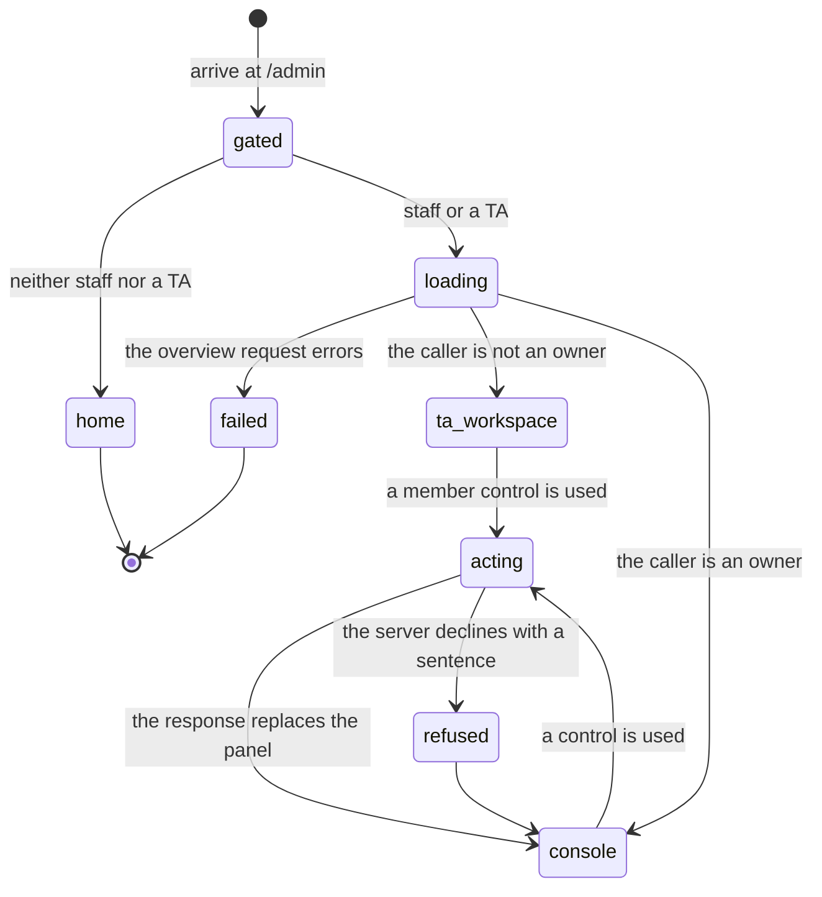

# The instructor's view

## Summary

The admin console is where an instructor manages a cohort: which teams exist, whether the platform has run anything for each of them, who is on them, which TA is assigned to each, which students have no team yet, the join code students enroll with, whether enrollment is open, and who counts as teaching staff.

It is arranged as a triage list, and the comment at the top says both what it is for and why the panels sit in the order they do: "Ten TAs cannot read forty repositories, so this page answers one question per row: has the platform run anything for this team yet, and how much. TEAMS comes first because that is the question; the join code, the roster, and the unassigned list are the owner's housekeeping and sit below it." (`apps/portal/src/routes/AdminPage.tsx:36-42`).

It lives at `/admin` behind `RequireStaff`, which sends a signed-out visitor to `/signin` and anyone who is neither staff nor a TA to the front page, both with `replace` (`apps/portal/src/App.tsx:81`, `:82`). Every endpoint behind it re-checks authorization server side, so the gate is a convenience rather than the enforcement.

Three roles read this page and two of them see different pages. The distinction between them is the most consequential thing in this document, so it comes first.

## Three roles

**Owner.** A GitHub login listed in the deployment's `PLATFORM_OWNER_LOGINS` environment variable (`apps/portal/worker/auth/roles.ts:44`). Owners are never read from the database, and the comment above the function states the reason plainly: "This is the root of trust, so it deliberately does not read the database. Staff live in the `platform_staff` table (migration 0031) and owners manage that table; if owners lived there too, anyone who could write the table could make themselves an owner, and a database compromise would be an administrative compromise." (`:33`). The same choice makes the roster bootstrappable: on a fresh database with an empty table, an owner is still staff, so somebody can always add the first row.

**Staff.** An owner, or a row in `platform_staff` matching the caller's login case-insensitively (`roles.ts:73`). Staff see every team's summary row in the console, which is its quota cell and its published score. They do not open another team's run pages: every run and run-surface endpoint is behind `requireTeam`, which answers for the caller's own team only (`apps/portal/worker/routes/runs.ts:24`, `apps/portal/worker/routes/run-surfaces.ts:25`). Staff cannot grant staff: every roster endpoint, including the read, is owner-gated, and the comment gives the reason as privilege escalation, "a TA who could add a login could add their own second account, and the roster would stop meaning what an owner set it to" (`apps/portal/worker/routes/admin.ts:449`). A test pins it (`apps/portal/test/staff-roster.test.ts:325`).

**TA.** A row in `team_tas` for one or more specific teams (`roles.ts:90`). A TA is staff for the purpose of reaching the console, and scoped to their assigned teams for everything they do inside it. Acting on any other team is refused with "This team is not assigned to you." (`admin.ts:224`).

Every login comparison in every one of these paths runs through one `normalizeLogin`, which trims and lowercases, because GitHub logins are case-insensitive and a row written by one path would otherwise be invisible to another (`roles.ts:20`, `:12`). It is exported for exactly that reason, "so the admin endpoints cannot drift from the check".

The three are not a ladder. An owner is staff and can do everything a TA can, on every team. A rostered staff member who is not an owner and has no assignments reaches the console and sees the TA workspace with nothing in it. A TA is not staff on the roster and does not appear in the PLATFORM STAFF panel at all, which is why the panel lists owners separately from the roster rather than describing the roster as the only route in.

The words on screen collapse this to two. The kicker reads "Admin" for an owner and "TA workspace" for everybody else (`AdminPage.tsx:52`), because the console has exactly two shapes and the third role does not change either of them.

## The simple case

An owner opens `/admin`. The kicker reads "Admin" and the heading is the cohort's name (`AdminPage.tsx:52`, `:53`). Four panels follow.

**COHORT.** The join code in large mono type with a copy button beside it, and a status word on the right reading "enrollment open" or "enrollment closed" (`:340`, `:345`). Below a rule, two controls: "Rotate join code", which arms and changes its own label to "Confirm, the old code stops working" for four seconds before firing (`:367`), and a plain button reading "Close enrollment" or "Open enrollment" (`:377`).

**PLATFORM STAFF.** A count, then the owners, then the roster. An earlier revision of this document quoted an explanatory sentence here; no such string is in the tree, and the claim inside it that staff "see every team's runs" was not true of any version of the product, because run pages are gated to the caller's own team. Owners are listed first with a chip reading "owner" whose title says "Set in the deployment's configuration, so this panel cannot remove it." (`:172`). Roster entries carry a name, or the words "not signed in yet" when no account matches (`:199`), the line "added by {login} {time ago}", and a remove button. At the bottom, an input placeheld "github login" and a button reading "Add staff".

**TEAMS.** A count and one disclosure row per team: the team name over the repository full name, a quota cell, the published score to three decimals or a dash when there is none, and a chevron (`:429`, `:437`, `:450`). Opening a row reveals four things in order: the assigned teaching staff under the kicker "Assigned teaching staff", or the line "No TA assigned." (`:478`, `:504`); a TA input placeheld "TA github login" and an "Assign TA" button; the member list, each member showing login, name, role, and a remove button; and a member input placeheld "github login" with a button reading "Add".

**UNASSIGNED STUDENTS.** A count and one row per cohort member with no team: login, name, how long ago they joined, and a select labelled "Assign to team…" (`:295`). Under the list, a note that draws the line the platform draws everywhere: "Assigning here places the student on the team's roster. They still need collaborator access to the team's fork to push." (`:104`).

The three panels below COHORT each show a count in their top right, so an owner reads the size of the cohort without expanding anything (`:65`, `:145`, `:86`). Two of the three empty states are written as sentences rather than as absence: "No teams yet." (`:71`), "Everyone in the cohort has a team." (`:92`), and, on the roster, one that explains why the panel is not broken: "No staff added yet. Owners already have access; add a GitHub login below to give someone else the same view." (`:182`).

A TA opening the same page sees the kicker "TA workspace", the cohort name, and the TEAMS panel containing only their assigned teams. The cohort panel, the staff roster, the unassigned list, and the TA assign and remove controls are all absent. What remains is the disclosure row and the member controls inside it, which is the working set for somebody whose job is to unstick a team rather than to run the course.

That reduction is server side as well as visual. A TA's overview names only their assigned teams (`admin.ts:257`), collects no unassigned students (`:259`), and carries `joinCode: null` (`:285`). Rendering less is not the mechanism; sending less is.

### What a TA can and cannot reach

Worth stating plainly, because the console's shape suggests more than the API allows.

A TA can open the console, see the TEAMS panel filtered to their assigned teams, read each of those teams' quota cell and published score, and add or remove members on them. Everything else in the console is absent for them, server side as well as visually: their overview names only assigned teams, collects no unassigned students, and carries `joinCode: null` (`admin.ts:257`, `:259`, `:285`).

A TA cannot open a student's run page. `/runs/:id` and the run surfaces behind it resolve through `requireTeam`, which reads the caller's own team and nothing else, so an assigned TA who is not on that team gets the same refusal a stranger does. The browser gate agrees. This is deliberate and is not a gap to close incidentally: a run page carries a team's unpublished practice results, and widening the gate to make a triage view work would publish those to everyone assigned to them.

So the supported workflow is roster and quota, not run triage. The four process signals that would support triage compute and are tested, and reach no page; `docs/design/the-instrument-not-the-judge.md` names the TA triage console as the design for that, and it does not exist.

## The ask, event by event

### Asking

Two reads. `GET /api/admin/overview` always, and `GET /api/admin/staff` only when the `StaffPanel` renders, which is only for an owner (`AdminPage.tsx:59`).

The overview computes the scope first. `getAdminScope` calls `requireStaff`, then asks the environment whether the caller is an owner; if not, it collects the caller's TA assignments (`admin.ts:199`). That scope decides three things at once: which teams are summarized, whether unassigned students are collected at all, and whether the response carries the join code (`:254`, `:259`, `:285`). A TA's response has `joinCode: null`, so the credential is not merely hidden in the browser, it is not sent.

While the overview is pending the whole page is one line, "Loading cohort" (`AdminPage.tsx:39`). The staff panel loads independently and shows "Loading roster" inside its own frame (`:158`).

> Technical note: an owner's response contains the live enrollment credential, so the route sets `Cache-Control: private, no-store` with the reason written beside it: "Owner responses contain the active enrollment credential. They must always reflect D1 and must never be retained by a browser or intermediary." (`admin.ts:252`). Not caching a join code matters because rotation is meant to be immediate; a cached overview would let a stale code look current after the old one stopped working.

### Answered without work

Three short paths.

- The gate. Neither staff nor a TA goes to `/` with `replace`; a request that gets past the browser is refused with "Staff access required." (`roles.ts:99`).
- A failed overview. The whole page is a `QueryError` card with a retry button (`AdminPage.tsx:43`).
- A failed staff roster. Only that panel becomes a card; the teams below still render (`:160`).

Nothing is written by any of these, and nothing is written by simply arriving. Every mutation on the page is a button press.

The gate and the endpoints disagree slightly about who gets in, and the endpoints win. `RequireStaff` admits anyone whose session says `platformRole === "staff"` or `isTa` (`App.tsx:82`); `requireStaff` on the server re-derives both from the environment and two database reads on every request (`roles.ts:82`). A session that went stale between the two lets a page render and then refuses its first action.

### The work begins

Each control has its own moment, and each one is a single request whose response replaces what the page was showing.

The cohort mutations are the two that cannot be taken back. "Rotate join code" generates a new code server side and writes it, and the old code stops matching immediately (`admin.ts:299`). "Close enrollment" flips `active`, and the join route requires an active cohort, so a student mid-signup gets "The cohort join code is invalid." rather than a sentence about enrollment being closed (`apps/portal/worker/routes/cohorts.ts:22`, `:27`). Both go through the same `PATCH /api/admin/cohort`, and the response is treated as authoritative and written straight into the cache rather than triggering a refetch, "instead of briefly showing the old credential while a follow-up request is in flight" (`apps/portal/src/lib/queries.ts:354`).

The roster mutations write one row each and answer with the whole roster (`admin.ts:470`, `:490`). Adding is `onConflictDoNothing`, deliberately: "re-adding somebody already on the roster should not rewrite who granted it and when. The first grant is the fact the audit trail exists to keep." (`:478`). Removing a login that is not there is not an error (`:488`).

The team mutations write a membership or a TA assignment and answer with that team's whole summary (`admin.ts:379`, `:412`, `:431`, `:446`). Assignment is also `onConflictDoNothing`, so assigning the same TA twice is a no-op.

The one mutation on the page with no confirmation step is member removal. Adding a staff login, adding a member, and assigning a TA are all additive and reversible. Removing a member, removing a TA, and removing a staff entry are single clicks on small icon buttons with no arming, and only the cohort's own rotation gets a `ConfirmButton`. The asymmetry is defensible for the roster, where re-adding restores access, and less so for a member removal, which is the one action here that takes something away from a student mid-course.

### While it works

Every mutation disables its own control and nothing else. The buttons carry `disabled={...isPending}`, so a second press is impossible while one is in flight, and the rest of the page stays live (`AdminPage.tsx:210`, `:235`, `:521`, `:572`).

The unassigned select is the exception worth naming: while assigning, its disabled placeholder changes from "Assign to team…" to "Assigning…" (`:295`). That is the only progress text on the page.

Errors render inline, next to the control that failed, and the server's own sentence wins when there is one. Each site has a fallback for the case where the failure was not an API error: "Update failed." on the cohort panel (`:382`), "The roster did not change. Try again." on the staff panel (`:248`), "Member update failed." inside a team row (`:584`), and "Assigning failed." on an unassigned student (`:282`). Each is announced with `role="alert"`.

### How it ends

Nothing settles. The page is a set of controls over live state, and it stays open.

What is committed depends on the control: a new join code, an enrollment flag, a roster row, a membership row, a TA assignment. Mutations that touch a team also invalidate the leaderboard cache, because a membership change can change what "your team" means on a public board (`queries.ts:341`).

Two response-handling styles sit side by side. The cohort patch and both roster mutations write their response straight into the cache, because the response is the whole object and a refetch would only fetch it again (`queries.ts:357`, `:423`). Everything else invalidates and lets the next render refetch. The visible difference is latency: rotating a code repaints instantly, adding a member repaints after a round trip.

Nothing on the page confirms success in words. A successful add clears its input and the new row appears; a successful removal makes a row disappear. An instructor who was not watching the list has only the list to tell them what happened.

## Modifiers

| Modifier | Set before the ask | Changed while it works |
| --- | --- | --- |
| Who you are | The single largest modifier in the product. An owner sees four panels and every control. A TA sees the kicker "TA workspace", one panel, and only the member controls inside their own teams. Non-staff never arrive. The role is resolved on every request rather than trusted from the session, and the browser's rendering is a mirror of that, not the enforcement (`admin.ts:199`, `:210`, `:218`). | Being removed from the roster in another window does not repaint this one. The next mutation is refused with "Staff access required." while the page continues to show controls that no longer work. |
| Where your team and repository stand | The instructor is not on a team; the page is about other people's teams. Each row names the repository full name under the team name (`AdminPage.tsx:432`), and the note under the unassigned list says why adding somebody here is not the same as giving them repository access (`:104`). Member roles shown in a team row are derived from GitHub permission, which is why a creator cannot be removed here. | A team renaming itself, or connecting a different repository, changes the row on the next invalidation. Every team mutation invalidates the whole `admin` key, so any successful action refreshes every team (`queries.ts:344`). |
| Which week's benchmark | Nothing on this page is scoped to a benchmark. The quota cell, the published score, and the refund count are all totals with no benchmark named. That is the source of the defect in [Open questions](#open-questions-and-verification). | No effect. There is no track switcher here. |
| Practice or leaderboard | Both appear as numbers only: practice runs and official attempts in the quota cell, and the team's published primary metric in the score column, taken from the most recently selected leaderboard row (`admin.ts:92`). Neither links anywhere. An instructor cannot reach a run from this page. | A team publishing a result changes the score column on the next invalidation, which only happens after some other admin action. |
| Flags, options, and where you are typing | No query parameters are read. Every input is a GitHub login typed by hand, with `spellCheck={false}` and no autocomplete against the cohort, so a typo is only detectable afterwards, and only on the staff roster, where it renders as "not signed in yet" (`AdminPage.tsx:199`). `PLATFORM_OWNER_LOGINS` decides who sees the owner view; changing it requires a deployment. | No effect. |

## Cancel and interrupt

| Event | Before the work begins | While it works |
| --- | --- | --- |
| You stop it yourself | An armed `ConfirmButton` disarms itself after four seconds, so an abandoned first click on "Rotate join code" cannot fire later (`apps/portal/src/components/ConfirmButton.tsx:39`). Navigating away before pressing anything changes nothing. | A mutation cannot be cancelled from the page. Navigating away mid-request abandons the response, not the write: the join code still rotates, the member is still added. Returning shows the result. |
| You do something else mid-way | Opening a second team row while one is loading is fine; each row holds its own mutation state. | Two mutations in different rows run independently and both invalidate the same cache key, so the later response wins the repaint. |
| A teammate acts at the same time | Another owner rotating the code a moment earlier means the code on screen is already dead, with nothing saying so. | Two owners rotating at once produce two codes; the second write wins and the first owner's panel keeps showing the code they generated until they act again. There is no polling and no version check on the cohort. |
| The portal fails | A failed overview is a card with a retry. A failed roster read is a card inside its panel. | A failed mutation renders the server's sentence beside its control and leaves the page otherwise intact. Nothing is retried automatically. The mutation state stays in error until the next attempt, so one failed removal keeps its message under the list indefinitely. |
| The page or the process goes away | Nothing to lose. No draft is held anywhere: the three text inputs are component state and are cleared on success (`AdminPage.tsx:136`, `:406`, `:415`). | The write completes server side regardless. Reload shows the result. A half-typed login is lost. |
| The thing being measured changes | A team deleted elsewhere would 404 on the next action with "Team not found." (`admin.ts:319`). | Same. The overview is a snapshot, and every mutation re-reads the team it touched rather than trusting the snapshot. |
| The platform refuses or credit runs out | No credit is spent by anything on this page. Quotas are displayed, never enforced here. | Five refusals reach an instructor as sentences: "This team is not assigned to you." (`admin.ts:224`), "Owner access required." (`:213`), "User must sign in before being assigned as a TA." (`:425`), "@{login} is not in this team's cohort." (`:351`), and "A team admin cannot be removed here. Change their permission on GitHub instead." (`:405`). Two more name the state rather than the rule: "@{login} is already on this team." and "@{login} is already on team {name}." (`:366`). |

## Interactions with other systems

**Who may do this.** Owners, rostered staff, and TAs, with the split described in [Three roles](#three-roles). The three read paths and every write path resolve the role from the environment and the database on each request. Two independent reads are issued together rather than in sequence when checking staff, with a comment noting that a team's assigned TA "is staff without appearing on the platform roster, which predates this table (migration 0008)" (`roles.ts:86`).

**The team owns it.** Every object on the page below the cohort panel is a team. Members, TAs, quota, and score all hang off a team, and no number is attributed to a person anywhere, which is the platform's hardest rule (see [`foundations/what-the-portal-claims.md`](../foundations/what-the-portal-claims.md#no-per-person-numbers)). A staff roster entry is not an exception: the comment calls it "an access grant, not a record of a person, so there is nothing here to rank or score" (`AdminPage.tsx:124`).

**Credit.** Displayed, not spent. The quota cell shows practice runs and official attempts used, and a refund count when there is one, with a title explaining what a refund is: "Official attempts given back after a run failed on the platform's side." (`:443`). The comment above it says why a zero is hidden: showing "0 refunded" on every row would bury the rows where the number is not zero (`:438`). The refund count is the one number here an instructor is meant to act on, and the reasoning for surfacing it is written out: a team hitting real infrastructure trouble and a team whose submission provokes the same platform-side failure both appear, and both are worth looking at (`:438`). Nothing on this page can grant credit; the numbers are for deciding what to do elsewhere. See [`../cross-cutting/credit-and-quota.md`](../cross-cutting/credit-and-quota.md).

**What the portal claims.** The staff panel is unusually careful about the difference between a login and an account. A roster row is a string, so a typo and a person who has not signed in look identical, and rather than leave an entry that silently grants nothing the console says which: "not signed in yet", with a title reading "Nobody with this login has signed in. If the spelling is wrong, this grants nothing." (`:197`). The server comment makes the same point (`admin.ts:138`).

**What the benchmark supplied.** Nothing. No benchmark is named on this page, which is why the quota cell and the score column read as totals with no denominator a reader can check.

**Live updates and reconnection.** None. Neither admin query polls (`queries.ts:333`, `:413`), and refetch on window focus is off application wide (`App.tsx:27`). The page updates only in response to something the instructor did. During a lab session with students joining continuously, the unassigned list is as old as the last action taken on the page.

**Discord.** Not present. No admin action posts a message and no Discord state is shown. An instructor who wants to reach a team through Discord has to go elsewhere; the team's channel is visible from `cogworks status` and from the team page, not here.

**Configuration.** `PLATFORM_OWNER_LOGINS` decides who is an owner, and is the only thing on this page that cannot be changed from this page. That is the point: moving the staff roster into a table in migration 0031 was specifically so that changing who is staff no longer meant editing a Cloudflare secret and redeploying (`roles.ts:66`), and owners stayed behind precisely because they are what makes the table safe to edit. The managed cohort is whichever row sorts first by active, then by id (`admin.ts:229`), so a deployment with two cohorts has one of them unreachable from the console.

## Edge cases

- **The join code alphabet excludes the ambiguous characters.** `ABCDEFGHJKLMNPQRSTUVWXYZ23456789`, eight characters, from `crypto.getRandomValues` (`admin.ts:240`). No `I`, `O`, `0`, or `1`, because the code is read aloud and typed from a slide. The join route uppercases whatever a student enters before matching (`cohorts.ts:21`), so case is not a failure mode; the excluded characters are.
- **The code is copied, not shown as text to select.** The whole code is a button; pressing it writes to the clipboard and swaps a screen-reader label from "Copy join code" to "Copied" for 1.4 seconds (`AdminPage.tsx:360`, `:324`). A clipboard write the browser refuses is swallowed, and a comment notes the fallback is that the "code stays visible" (`:326`).
- **A creator cannot be removed from either surface.** Removing a member whose role is `admin` is refused with a sentence pointing at GitHub (`admin.ts:401`), matching the student-facing path. The comment gives the consequence rather than the rule: removing the creator "strands the team's settings for everyone" (`:394`). Tests pin the refusal and that an ordinary member still removes cleanly (`apps/portal/test/admin-members.test.ts:164`, `:186`).
- **Adding refuses rather than upserting.** A login already on this team, or on another, is refused (`admin.ts:359`). The comment names the bug this prevents: re-adding a creator "used to silently demote them to 'write'" (`:360`). A separate catch turns the unique index into the same sentence rather than a raw 500 (`:374`).
- **Assigning a TA needs an existing account; adding staff does not.** The TA route looks the login up and 404s with "User must sign in before being assigned as a TA." (`admin.ts:425`), because the assignment is a foreign key to a user row. The staff route deliberately does no lookup, "an owner names the teaching staff before the term starts, when none of them have signed in" (`:467`).
- **Removing a TA or a member for an unknown login succeeds quietly.** Both routes only act when a user row is found and return the team summary either way (`admin.ts:393`, `:443`). A typo in a removal is indistinguishable from a removal that worked.
- **Member roles are shown in the platform's words, not GitHub's.** `admin` renders as "creator" in the detector accent, `maintain` as "maintainer", and everything else as "member" (`AdminPage.tsx:542`). The underlying value is a GitHub permission.
- **Members are sorted by role then login; TAs by login.** Creators first, then maintainers, then writers (`admin.ts:117`); TAs alphabetically (`:75`). Teams are sorted by name and unassigned students by GitHub login (`:255`, `:270`).
- **A login with no GitHub identity falls back to the local part of the email.** Members, TAs, and unassigned students all render `login ?? email.split("@")[0]` (`admin.ts:113`, `:127`, `:276`), so a dev-auth account appears under something that is not a GitHub login.
- **The published score column is the most recent selection across all benchmarks.** It orders selections by `selectedAt` descending and takes one (`admin.ts:102`), so a team that has published on two benchmarks shows whichever they published last, with nothing saying which.
- **An empty TEAMS panel for a TA is the same empty state as an empty cohort.** "No teams yet." (`AdminPage.tsx:71`) is shown to a TA with no assignments and to an owner of a cohort with no teams. The two are not the same condition and read identically.
- **The staff count includes owners.** The panel's count is `entries.length + owners.length` (`AdminPage.tsx:145`), and the owners are listed above the roster with their own separator. An owner reading the panel sees themselves, which is the point: the server comment notes that "an owner reading a roster that omits them would reasonably conclude their own access was missing" (`admin.ts:147`).
- **Owner logins are shown as configured, not normalized.** The roster response splits and trims `PLATFORM_OWNER_LOGINS` without lowercasing (`admin.ts:186`), while every comparison lowercases. The display keeps whatever spelling the deployment used; the matching does not care.
- **A roster entry keeps the casing the owner typed.** `platform_staff` stores both a normalized `login` for matching and a `displayLogin` for showing (`admin.ts:154`, `:474`). The name beside it is looked up by lowercasing both sides, with a comment noting an exact match "would report a rostered person as 'not signed in yet' purely because the owner typed their login differently" (`:161`).
- **Removing a staff entry is keyed on the normalized login.** `DELETE /admin/staff/:login` lowercases the path parameter before deleting (`admin.ts:492`), so the remove button works regardless of which spelling is on screen.
- **The unassigned select has no chosen value.** It is rendered with `value=""` and a disabled placeholder option, so it never shows a team as selected and resets after every assignment (`AdminPage.tsx:287`, `:294`). It disables itself when there are no teams to assign to.
- **A student assigned from here joins with the `write` role.** The insert is unconditional about the role (`admin.ts:372`), so an instructor cannot create a creator from this page, which is consistent with the refusal to remove one.
- **The refund count is a lifetime total across benchmarks.** It counts every run with a `refundedAt` (`admin.ts:87`), and the comment records that nothing counted these before migration 0029, so a team's total "starts at zero on the deploy that added the column even if they were refunded before it" (`:84`).
- **Every list on this page is short by construction.** There is no pagination, no search, and no filter. A cohort large enough to need one would render every team, every member, and every unassigned student in one document, and the overview would build a full summary for each team in parallel before answering (`admin.ts:272`).
- **The whole overview is rebuilt for one change.** A successful member add invalidates the `admin` key, which refetches every team's summary, not the one that changed (`queries.ts:344`). The response the mutation already returned for that team is discarded.
- **A team's row does not say who its creator is until it is opened.** The collapsed row shows name, repository, quota, and score. The creator, marked in the detector accent, is inside the disclosure (`AdminPage.tsx:539`), which is also where the one member who cannot be removed lives.
- **Time is shown in three different shapes on one page.** "added by {login} {time ago}" on the roster and "joined {time ago}" on an unassigned student both use a relative format that stops at days (`apps/portal/src/lib/format.ts:17`); nothing here shows an absolute date. A student who joined three months ago reads "92 d ago".
- **The remove buttons carry their own sentences for a screen reader.** Each has both a `title` and an `sr-only` span naming the person and the team, for example "Remove {login} as TA" and "Remove {login} from platform staff" (`AdminPage.tsx:214`, `:497`, `:552`). The icon alone would otherwise be an unlabelled button repeated once per row.
- **The staff panel disappears entirely for a TA rather than appearing empty.** Same for the cohort and unassigned panels (`AdminPage.tsx:55`, `:59`, `:81`). A TA is never shown a control they cannot use, which is why the page has two shapes rather than one shape with disabled parts.
- **An owner with no cohort sees a 404 rather than a console.** `getManagedCohort` throws "Cohort not found." when no row exists (`admin.ts:235`), so a fresh deployment answers the overview with a 404, which the page renders as the missing-record empty state and a "Back to start" link (`apps/portal/src/lib/query-error-state.ts:113`). Bootstrapping a cohort is not something this page can do.
- **The cohort panel is skipped when the join code is null even for an owner.** The condition is `scope === "owner" && cohort.joinCode` (`AdminPage.tsx:55`), so an owner would silently lose the panel rather than see it broken if the code were ever absent. The schema requires a code, so this is a guard rather than a reachable state.

## Open questions and verification

- **The quota cell compares two different quantities.** `AdminPage.tsx:437` renders `{team.practiceUsed}/10 · {team.officialUsed}/3`. Two things are wrong with that line. The denominators are hardcoded, where `DashboardPage` and `RunDetailPage` read `practiceLimit` and `officialLimit` from the quota payload (`apps/portal/src/routes/DashboardPage.tsx:154`, `apps/portal/src/routes/RunDetailPage.tsx:284`), so a limit change silently desynchronizes the staff view. Worse, the numerators are not the same measurement as the limits: the overview counts every practice run and every official attempt a team has ever made, across all benchmarks and versions (`admin.ts:76`, `:80`), while the quota those limits belong to is per team per benchmark version (`apps/portal/worker/services/run-actions.ts:206`, `:347`). A team six runs into Recognition and five into Clustering shows "11/10" to an instructor who is looking at the number to decide whether to grant something. Worth treating as a bug, and it is the first thing an instructor reads on the page.
- **Two admin routes parse the request body before authorizing it.** `PATCH /admin/teams/:teamId` calls `parseBody` at `admin.ts:314` and `requireTeamScope` at `:317`; `POST /admin/teams/:teamId/members` does the same at `:328` and `:331`. An unauthenticated caller sending a malformed body gets 400 "The request body is invalid." rather than 401. No data leaks, and the sibling routes get the order right (`:416`, `:435`, `:459`), so this reads as an oversight rather than a decision. Worth treating as a bug.
- **The `PATCH /admin/cohort` response carries the new join code with no `Cache-Control` header.** The `GET` sets `private, no-store` with a stated reason (`admin.ts:252`); the `PATCH` that mints the code does not (`:305`). A `PATCH` response is not normally cached, so the practical exposure is small, but the reason given on the `GET` applies identically here. Carried as a question.
- The staff roster query accepts an `enabled` argument whose comment describes disabling it for a TA (`queries.ts:410`), but the panel is only rendered for an owner (`AdminPage.tsx:59`) and calls the hook with no argument. The mechanism the comment describes is not the one in use. Harmless, and the comment is now misleading.
- Rotating the join code has no undo and no record of the previous code. Whether an instructor who rotates by accident mid-session has a recovery path other than reading the new code aloud was not established.
- The four-second arming window on "Rotate join code" is the same window used for spending an official attempt (`ConfirmButton.tsx:39`). Whether four seconds is long enough for an instructor reading a label they have not seen before was not measured. **Unverified.**
- Closing enrollment produces "The cohort join code is invalid." for a student mid-signup (`cohorts.ts:27`), which describes the code rather than the state. Whether a separate sentence for a closed cohort is worth adding is a product call.
- A deployment with more than one cohort exposes only the first by `active` then `id` (`admin.ts:229`). Whether that is a real configuration or a single-cohort assumption made explicit was not established.
- Nothing on the page distinguishes a TA who is also a rostered staff member from one who is not, and the kicker reads "TA workspace" whenever the caller is not an owner (`AdminPage.tsx:52`), so a rostered non-owner staff member with no assignments sees a TA workspace containing no teams. **Unverified** against a running portal.
- Whether the four inline error fallbacks are ever reached was not established. Each fires only when the failure is not an `ApiRequestError`, and every server refusal on this page carries a sentence. **Unverified.**
- The error message inside a team row concatenates the messages of four separate mutations (`AdminPage.tsx:581`), so two failures in one row produce one run-on line. Whether that is reachable in practice depends on whether two of the four can be in an error state at once; both add mutations clear on success but neither clears on a later attempt's success.
- Removing a member is a single unarmed click on a small icon button (`AdminPage.tsx:544`), where rotating the join code takes two. Whether removal deserves the same arming is a product call, and it is the only destructive action here with no confirmation.
- No admin action is recorded anywhere except the staff roster, which keeps `grantedBy` and `grantedAt` (`admin.ts:475`). Who removed a member, who rotated a code, and who closed enrollment are not recorded. Whether the course needs that trail was not established.
- Whether a TA ever sees a team they expect to be assigned to but are not, and reads "No teams yet." as the console being broken, was not observed. **Unverified**: no browser was opened for this pass.

Verified against Cog\*Portal commit `f74e087`.
