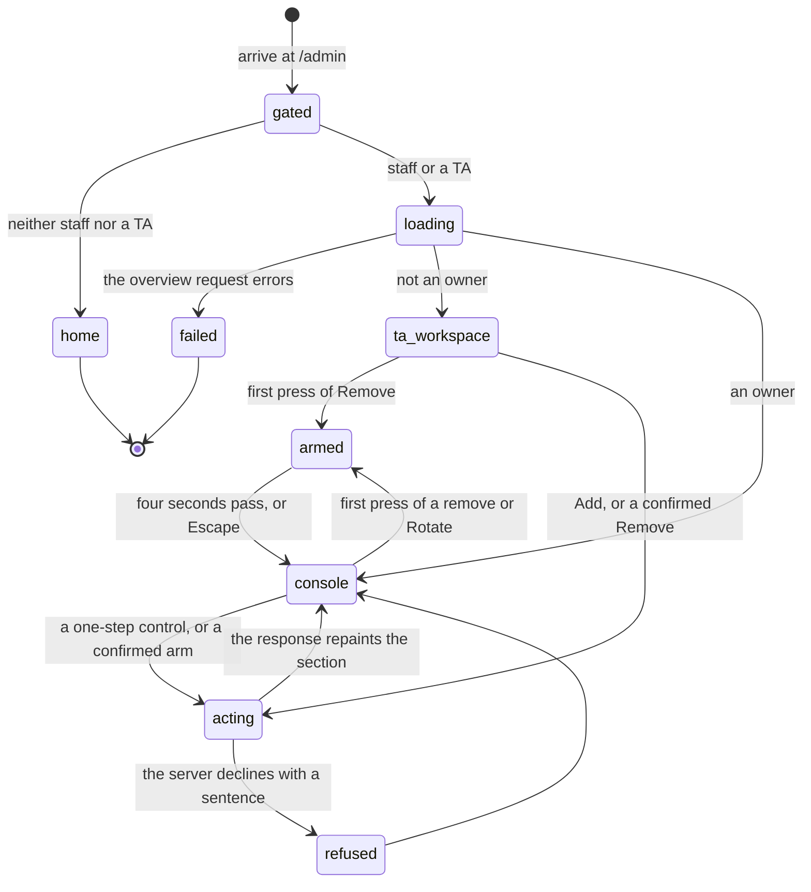

# The instructor's view

## Summary

The admin console at `/admin` is where teaching staff look after a cohort: which teams the platform has run anything for, who is on each team, which TA is assigned, which students have no team yet, the join code and whether enrollment is open, and who counts as staff. The comment at the top states what it is for: "Ten TAs cannot read forty repositories, so this page answers one question per row: has the platform run anything for this team yet, and how much." (`apps/portal/src/routes/AdminPage.tsx:30-32`).

It is reached from the "Admin" tab in the header, which appears for anyone the session marks as staff or a TA (`apps/portal/src/components/Shell.tsx:52`, `:68`). The route sits behind `RequireStaff`, which sends a signed-out visitor to `/signin` and anyone else who is neither staff nor a TA to `/`, both with `replace` and no message (`apps/portal/src/App.tsx:94-96`). Every endpoint re-checks on the server, so the gate is a convenience and not the enforcement.

The console has two shapes. An owner gets the whole page; everyone else gets the teams assigned to them and nothing more. Which shape you get is the most consequential thing in this document, so the roles come first.

## Three roles

**Owner.** A GitHub login listed in the deployment's `PLATFORM_OWNER_LOGINS` (`apps/portal/worker/auth/roles.ts:44-46`). Owners are never read from the database, and the comment gives the reason: "if owners lived there too, anyone who could write the table could make themselves an owner, and a database compromise would be an administrative compromise" (`:36-40`). The same choice means an empty roster can never lock every administrator out.

**Staff.** An owner, or a login on the owner-managed roster in `platform_staff`, matched case-insensitively (`roles.ts:55-73`). Being rostered lets you open the console. It does not show you any team: a non-owner's overview holds only the teams they are assigned to as TA (`apps/portal/worker/routes/admin.ts:298-302`). Staff cannot grant staff; every roster endpoint, the read included, is owner-only, because "a TA who could add a login could add their own second account" (`admin.ts:490-497`), pinned by `apps/portal/test/staff-roster.test.ts:325`.

**TA.** A row in `team_tas` for one or more teams. A TA passes the staff gate without being on the roster (`roles.ts:79-92`) and acts only on assigned teams; anything else is refused with "This team is not assigned to you." (`admin.ts:263-264`).

Every login comparison goes through one `normalizeLogin`, which trims and lowercases, so a row written by one path is never invisible to another (`roles.ts:12-22`).

Nobody on this page can open a team's run pages. Run and run-surface endpoints answer only for the caller's own team (`apps/portal/worker/routes/runs.ts:25`, `apps/portal/worker/routes/run-surfaces.ts:25`), and a TA is not on the team. The console shows totals and the latest published score, and links to nothing.

## The simple case

An owner opens `/admin`. The eyebrow reads "Instructor console", the heading is the cohort's name, and the lede says "Open a team to see who's on it and what it last published." (`AdminPage.tsx:59-64`). Four things follow.

**Join code.** A strip set large enough to read off a projector. The code is one button with corner brackets; pressing it copies the code and the word beside it changes from "Copy" to "Copied" for 1.4 seconds (`:153-168`, `:199`). A refused clipboard write says "Couldn't copy. Select the join code above and copy it manually, or try again." (`:207`). Beside it, "Enrollment open" with "Anyone with this code can join the cohort.", or "Enrollment closed" with "The code is refused until you open enrollment again." (`:220-225`). Under a rule, "Change enrollment" opens a fold holding the two actions, each with its consequence beside it (`:245`, `:269-317`):

- "Close enrollment" or "Open enrollment", one press: "New students can't join until you open it again. Everyone already in the cohort keeps their place." or "Anyone with the code can join again." (`:280-286`).
- "Rotate join code", which arms to "Confirm, the old code stops working" for four seconds: "Makes a new code at once. Use it if this one reached people outside the course." (`:292-305`).

**Teams.** A count, the note "A team the platform has never run anything for sorts first, since it's the one worth opening." (`:76`), and one row per live team. Archive teams are left out (`admin.ts:294-297`). A row shows the team name over its repository, then either "No hosted runs yet" with the one red dot on the row, or "{n} practice runs · {n} official attempts" with singulars for one, then "TA {names}" or "No TA" (`AdminPage.tsx:461-499`). Teams with no completed hosted evaluation sort first, the rest by name (`:118-125`). Opening a row shows:

- "Members", each with avatar and name. An admin's row shows the word "Admin" in place of a remove control; everyone else has "Remove", which arms to "Confirm, they leave" (`:520-543`). An empty team reads "Nobody is on this team." Under it, "Add a student" takes a GitHub login, offering the cohort's students without a team as suggestions (`:547-558`).
- "Teaching staff", each TA with "Unassign", which arms to "Confirm unassign" (`:567-589`), or "No TA assigned."; then "Assign a TA" (`:593-604`).
- One footnote: "Latest published score {score} · {benchmark} v{version}", or "Nothing published yet" (`:617-620`).

**Students without a team.** A count, the note "Assigning here places the student on the team's roster. They still need collaborator access to the team's fork to push." (`:656`), and one row per cohort member with no team: their name, "joined {time ago}" on wider screens, and a select reading "Assign to team…" (`:704-735`). An empty list reads "Everyone in the cohort has a team." (`:659`). A successful pick announces "Added {student} to {team}." (`:684`).

**Platform staff.** A count of owners plus roster entries, and the note "Staff open this console and see the teams assigned to them. Owners come from the deployment's configuration, so this list can't remove them." (`:769-770`). Owners come first, marked "Owner" with the title "Set in the deployment's configuration, so this list cannot remove it." (`:779-789`). Each roster entry shows a name, or "not signed in yet" when no account has that login, then "added by {login} {time ago}" on wider screens, then "Remove", which arms to "Confirm, access ends" (`:790-822`). With no entries: "No staff added yet. Owners already have access; add a GitHub login below to give someone else the same view." (`:827-830`). "Add staff" takes a login at the bottom.

Observed locally on fixture data for an owner on desktop and phone (`/tmp/cogshots/matched/pairs/a-admin-desk.png`, `b-admin-active-desk.png`, and the `-mob` pair, close to `2ff32fa`): cohort "BWSI CogWorks 2026", seven teams, one student without a team, the owner alone on the staff list. The TA workspace was not captured.

Anyone who is not an owner sees the eyebrow "TA workspace", the lede "The teams assigned to you. Open one to see who's on it and to add or remove a student." (`AdminPage.tsx:64`), and only the Teams section, holding only their assigned teams, with no TA controls inside the rows. A rostered staff member with no assignments reads "No teams assigned to you yet." (`:81`). The reduction happens on the server: a non-owner's overview carries no unassigned students and `joinCode: null` (`admin.ts:303-326`).

## The ask, event by event

```mermaid
stateDiagram-v2
    [*] --> gated : arrive at /admin
    gated --> home : neither staff nor a TA
    gated --> loading : staff or a TA
    loading --> failed : the overview request errors
    loading --> ta_workspace : not an owner
    loading --> console : an owner
    console --> armed : first press of a remove or Rotate
    ta_workspace --> armed : first press of Remove
    armed --> console : four seconds pass, or Escape
    console --> acting : a one-step control, or a confirmed arm
    ta_workspace --> acting : Add, or a confirmed Remove
    acting --> console : the response repaints the section
    acting --> refused : the server declines with a sentence
    refused --> console
    home --> [*]
    failed --> [*]
```

### Asking

`GET /api/admin/overview` always; `GET /api/admin/staff` only for an owner, because the staff section only renders for one (`AdminPage.tsx:99`). The overview first works out the scope: owner, or the caller's TA assignments (`admin.ts:239-248`). That scope decides which teams are summarized, whether students without a team are collected, and whether the join code is sent.

While the overview is pending the page is one line, "Loading cohort" (`AdminPage.tsx:44`). The staff section loads on its own and shows "Loading roster" inside itself (`:773`).

> Technical note: the overview carries the live join code to an owner, so it is sent with `Cache-Control: private, no-store`, "They must always reflect D1 and must never be retained by a browser or intermediary." (`admin.ts:291-293`). The summaries for every team in scope come from five statements in one pass rather than six per team (`admin.ts:50-62`), after a 36-team cohort was measured at 223 queries for one page load.

### Answered without work

- The gate. Neither staff nor a TA lands on `/` without being told why. A request that gets past a stale browser session is refused with "Staff access required." (`roles.ts:91`).
- A failed overview. The whole page is the shared error card with a retry (`AdminPage.tsx:45-50`). An owner on a deployment with no cohort gets "Cohort not found." as a 404 (`admin.ts:275`), which renders as the missing-record state with "Back to start" (`apps/portal/src/lib/query-error-state.ts:113`); the console cannot create a cohort.
- A failed staff roster. Only that section becomes an error card (`AdminPage.tsx:774-775`).
- Opening or closing a team row or the enrollment fold writes nothing.

### The work begins

Each control is one request, and its response repaints what it touched.

The two enrollment actions cannot be taken back. Rotating writes a new eight-character code at once and the old one stops matching (`admin.ts:279-284`, `:340`); afterwards the strip says "The new code works now, and the old one no longer does." or, while closed, "The old code no longer works. The new one will once you open enrollment." (`AdminPage.tsx:258-263`). Closing enrollment means a student typing the current code is told "That code is right, but enrollment is closed. Ask your instructor to open it." (`apps/portal/worker/routes/cohorts.ts:30`). Both go through `PATCH /api/admin/cohort`, whose answer is written straight into the page rather than refetched.

Adding a member writes the `write` role without asking GitHub (`admin.ts:413`). Assigning a TA writes an assignment and does nothing if it exists (`:468-471`). Adding staff writes a roster row and keeps the first grant if the login is already there: "The first grant is the fact the audit trail exists to keep." (`:519-522`).

Every removal arms first, which is new in this build: a member ("Confirm, they leave"), a TA ("Confirm unassign"), and a staff entry ("Confirm, access ends") all take two presses within four seconds, and Escape disarms (`apps/portal/src/components/RemoveButton.tsx:59-78`). Assigning a student from the select is one step.

### While it works

Each control shows its own busy state, and a row's other removals are disabled while one is in flight (`AdminPage.tsx:536-537`, `:580-581`). The student select changes its placeholder to "Assigning…" (`:728`).

Errors appear beside the control. The server's sentence wins; when there is none, each section has a fallback with a next step: "Enrollment didn't change. Try again in a moment." (`:311`), "The member list didn't change. Try again." and "The TA list didn't change. Try again." (`:441`, `:443`), "That assignment didn't go through. Pick the team again." (`:740`), and "The roster did not change. Try again." (`:763`). When two mutations in one list have failed, their server sentences are joined with a space (`:410-415`).

### How it ends

The page stays open; it is a set of controls over live state. A successful add clears its field (`:374-376`). A successful removal returns focus to the team row's toggle (`:436-437`).

Team mutations invalidate every admin query and the leaderboard (`apps/portal/src/lib/queries.ts:383-388`), so one change refetches every team's summary and the staff roster. The cohort patch and both roster mutations write their response straight into the page instead.

Nothing records who removed a member, who rotated the code or who closed enrollment. The staff roster alone keeps who granted each entry and when.

## Modifiers

| Modifier | Set before the ask | Changed while it works |
| --- | --- | --- |
| Who you are | Owner: join code, every team, students without a team, staff, TA controls. Anyone else: their assigned teams and the member controls inside them. The role is resolved on the server on every request (`admin.ts:239-267`). | Losing staff or TA status elsewhere does not repaint this page; the next action is refused with "Staff access required." or "This team is not assigned to you." |
| Where your team and repository stand | Staff need no team. Each row names its repository; the note under students without a team says the roster is not repository access. An admin's row has no remove control, because the server refuses to remove one. | A team renaming itself or changing repository shows after the next invalidation. |
| Which week's benchmark | Totals span every benchmark and version, so they carry no limit beside them (`AdminPage.tsx:481`). The published score names its benchmark and version. | No effect. |
| Practice or leaderboard | Practice and official totals sit in the row; the latest published score sits in its footnote (`admin.ts:93-123`). Neither links anywhere. | A newly published score shows only after some other action on this page. |
| Flags, options, and where you are typing | No query parameters. Every login is typed by hand. The member field suggests students without a team; the TA and staff fields suggest nothing, so a typo shows only as "not signed in yet" on the roster. Who is an owner changes only with a redeploy. | No effect. |

## Cancel and interrupt

| Event | Before the work begins | While it works |
| --- | --- | --- |
| You stop it yourself | An armed control lapses after four seconds or on Escape. Closing the enrollment fold makes its actions inert at once (`AdminPage.tsx:265-269`). | A request cannot be cancelled. Leaving abandons the response, not the write. |
| You do something else mid-way | Opening several team rows at once is fine; each row holds its own state. | Two mutations in different rows both invalidate the same queries; the later answer wins the repaint. |
| A teammate acts at the same time | Another owner's rotation leaves this page showing a dead code, with nothing saying so. | Two owners rotating at once produce two codes; the later write wins and the other owner's page keeps showing theirs. |
| The network or the portal fails | A failed overview is an error card with a retry; a failed roster is an error card in its section. | The sentence or fallback appears beside the control; nothing retries by itself. |
| The page or the process goes away | Typed logins are lost. | The write completes regardless; reload shows it. |
| The thing being measured changes | Every mutation re-reads the team it touches. A team that no longer exists answers "Team not found." (`admin.ts:360`). | Same. |
| The platform refuses or credit runs out | Nothing here spends credit; totals are shown, never enforced. | Refusals arrive as sentences: "This team is not assigned to you.", "Owner access required." (`admin.ts:253`), "User must sign in before being assigned as a TA." (`:466`), "@{login} is not in this team's cohort." (`:392`), "@{login} is already on this team." or "@{login} is already on team {name}." (`:407-409`), "A team admin can't be removed." (`:446`), and "User not found." (`:386`). |

## Interactions with other systems

**Who may do this.** Owners, rostered staff and TAs, split as in [Three roles](#three-roles). Every read and write resolves the role from the environment and the database on each request.

**The team owns it.** Below the join code every object is a team. Members, TAs, totals and score hang off a team, and no number is attributed to a person; a staff entry is "an access grant, not a record of a person, so there is nothing here to rank or score" (`AdminPage.tsx:756-757`). See [`../foundations/what-the-portal-claims.md`](../foundations/what-the-portal-claims.md).

**Credit.** Totals count completed practice and official evaluations across benchmarks and versions; failures are not counted (`admin.ts:89-90`). See [`../cross-cutting/credit-and-quota.md`](../cross-cutting/credit-and-quota.md).

**What the portal claims.** A roster entry is a login string, so a typo and someone who has not signed in look the same; the page says which with "not signed in yet" and the title "Nobody with this login has signed in. If the spelling is wrong, this grants nothing." (`AdminPage.tsx:805`). After a rotation the strip reads the cohort's current state rather than assuming the new code works (`:255-263`), pinned by `apps/portal/test/admin-enrollment.test.ts:99`.

**What the benchmark supplied.** Only the published score's benchmark title and version, with "benchmark not in the catalog" when the catalog lacks the row (`AdminPage.tsx:619`).

**Live updates and reconnection.** None. No admin query polls and the app does not refetch on focus (`App.tsx:28`). During a lab session the list of students without a team is as old as the last action on the page.

**Discord.** Not present. No admin action posts anything and no Discord state is shown.

**Configuration.** `PLATFORM_OWNER_LOGINS` decides who is an owner and is the one thing this page cannot change. The managed cohort is the first row by `active`, then `id` (`admin.ts:269-277`), so a deployment with two cohorts can manage only one from here.

## Edge cases

- **The join code avoids look-alike characters.** Eight characters from `ABCDEFGHJKLMNPQRSTUVWXYZ23456789`, with no `I`, `O`, `0` or `1`, because it is read aloud and typed from a slide (`admin.ts:279-284`).
- **Rostered staff see an empty console.** A co-instructor added on the roster sees "TA workspace" and "No teams assigned to you yet." until they are assigned as TA to each team, one row at a time. The roster's empty-state sentence promises "the same view" the owner has (`AdminPage.tsx:828-829`), which it is not.
- **Assigning a TA needs an account; adding staff does not.** The TA route looks the login up and refuses an unknown one (`admin.ts:461-467`). The staff route deliberately does not, because "an owner names the teaching staff before the term starts, when none of them have signed in" (`:508-510`).
- **Removing an unknown login succeeds quietly.** The member and TA removals act only when a user row exists and return the team either way (`admin.ts:434`, `:484`).
- **An admin cannot be removed here either.** The row shows "Admin" and no control (`AdminPage.tsx:527-530`); the server refuses with "A team admin can't be removed." (`admin.ts:442-447`), pinned by `apps/portal/test/admin-members.test.ts:198`. The stored role is re-read from GitHub only when that admin next changes a team setting.
- **Adding refuses rather than overwrites.** A login already on a team is refused with a sentence, which keeps a creator from being re-added as `write` (`admin.ts:400-411`).
- **A member added here is `write` without a GitHub check,** the same as the team page's add. They learn they cannot push or run only later.
- **A login with no GitHub identity falls back to the email's local part** for members, TAs and students without a team (`admin.ts:141`, `:152`, `:317`), so a development account appears under something that is not a login.
- **The "refunded" note on a row never shows.** The row renders "· {n} refunded" when the count is above zero (`AdminPage.tsx:488-493`), and the server always sends 0, kept for older clients (`admin.ts:158-159`).
- **Owner logins show as configured.** The roster lists `PLATFORM_OWNER_LOGINS` trimmed but not lowercased (`admin.ts:226-229`); matching ignores case.
- **Times are relative.** "added by {login} {time ago}" and "joined {time ago}" stop at days, so a student who joined three months ago reads "92 d ago" (`apps/portal/src/lib/format.ts:17-27`).
- **Nothing paginates.** Every team, member and unassigned student renders in one document.

## Open questions and verification

- Two routes parse the body before authorizing: `PATCH /admin/teams/:teamId` (`admin.ts:355`, then `:358`) and `POST /admin/teams/:teamId/members` (`:369`, then `:372`). A caller outside scope with a malformed body gets 400 rather than 403. No data leaks; the sibling routes authorize first.
- `PATCH /admin/cohort` returns the new join code with no `Cache-Control` header (`admin.ts:334-352`), while the `GET` sets `private, no-store` for exactly that credential.
- "User not found." (`admin.ts:386`) gives no next step, where the team page's equivalent says the person must sign in once first.
- Rotation has no undo and keeps no record of the previous code.
- Whether giving rostered staff an empty console is the intent, or whether the roster sentence is the intent, is a product call.
- The TA workspace, every armed removal and every refusal sentence were read from code, not observed. **Unverified.**
- Hosted beta (`4984730`) differs: the eyebrow reads "Admin" (`apps/portal/src/routes/AdminPage.tsx:57` at `4984730`) where this build reads "Instructor console" (`AdminPage.tsx:59`); member, TA and staff removals are single unarmed clicks on icon buttons (`:643-646`, `:584`, `:263-266` at `4984730`) where this build arms each (`:532-541`, `:574-585`, `:815-822`); and rotation and enrollment sit as two inline buttons with no sentence afterwards (`:447-459` at `4984730`) where this build folds them under "Change enrollment" and reports the result (`:230-317`). The server routes are identical on both builds, including the one-pass summaries (`05b24a8` on beta, `4737aaf` here) and the TA-scope test (`5ffc0d1` on beta, `0072c28` here).

Read against Cog\*Portal commit `2ff32fa`. The owner view was observed locally on fixture data in `/tmp/cogshots/matched/pairs/` (close to `2ff32fa`).
