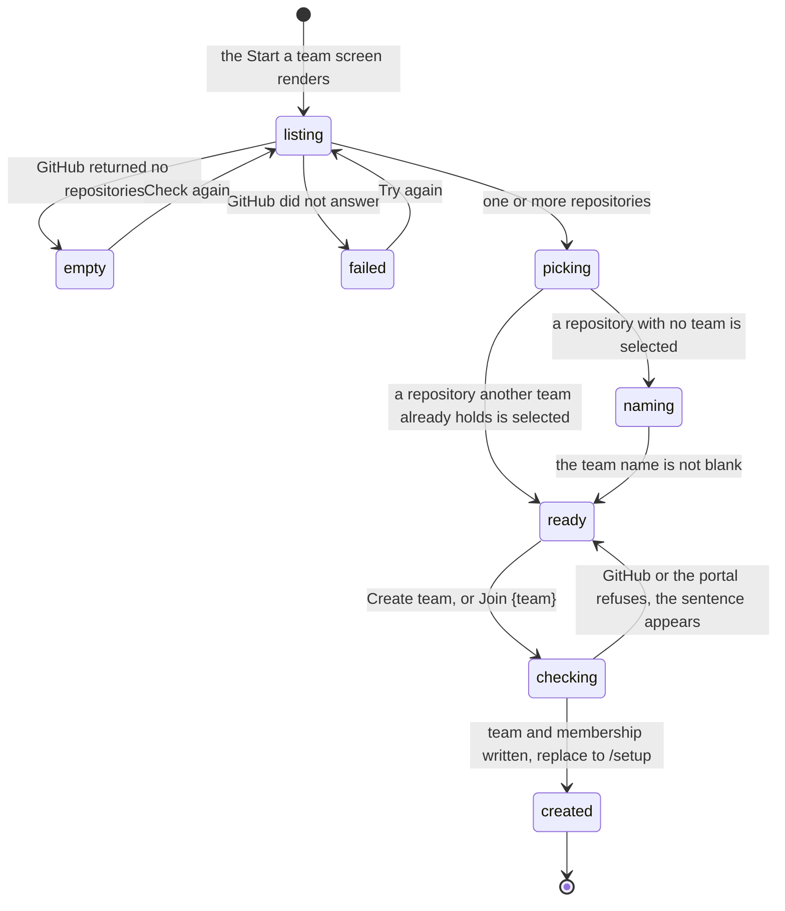

# Connecting a repository

## Summary

Connecting a repository is the act that brings a team into existence. A student picks one of their GitHub repositories from a list, names the team, and presses a button; the portal checks the repository against three rules, writes a team row and a membership row, and sends them to the setup guide. From that moment the team exists and its repository is fixed.

This document owns the "Start a team" half of `/connect`: the repository picker, the fork instructions, the GitHub App access link, the team name field, and everything the server does with the repository it is handed. The cohort join code and the "Join a team" half of the same route are [`join-or-make-a-team.md`](join-or-make-a-team.md). The two documents describe one URL, split at the choice screen's two cards.

The screen has one property worth naming up front: it is the last point at which a student is still an individual. Everything before it is about them, and everything after it is about their team. That is why the copy on the choice screen says "You do this once. The repository is the team; everyone with write access shares its attempts." (`apps/portal/src/routes/ConnectPage.tsx:103`) before offering either card.

Two structural facts decide the shape of everything below. `teams.repoFullName` is not null and is uniquely indexed with the cohort (`apps/portal/worker/db/schema.ts:137` and `:145`), so a team always has a repository and no two teams in a cohort can share one. And `team_members` is uniquely indexed on `userId` (`apps/portal/worker/db/schema.ts:192`), so the student doing this can only ever do it once. The repository is the team, and both halves of that sentence are enforced by an index rather than by a check that could be forgotten.

## The simple case

A student who is first in their group reaches `/connect` and, because their cohort has no teams yet, is taken straight past the choice screen to "Start a team" (`apps/portal/src/routes/ConnectPage.tsx:68`). The heading reads "Start a team" and the line under it names the course template: "Your team runs from a public fork of `{template}`. Fork it, connect it, and the team exists." (`apps/portal/src/routes/ConnectPage.tsx:136`).

They have already forked the template, so their fork is in the list. They select it. The team name field appears, prefilled from the repository name with dashes turned into spaces and each word capitalized (`apps/portal/src/routes/ConnectPage.tsx:574`). They keep it. The button, which read "Select a repository" a moment ago, now reads "Create team". They press it.

The portal fetches the repository from GitHub, refuses it if it is private, reads their permission on it, refuses it if they cannot write, checks that it is a fork of the course template, reads `cogportal.toml` for a description, writes the team, and makes them its admin. They land on `/setup`, addressed as the person who created the team.

The more common first attempt is the one that does not go like that. The student forked the template but did not install the GitHub App on the account holding the fork, so the list is empty and they get three numbered steps instead of a picker. Forking and granting are two separate acts on GitHub, and most people do only the first.

The third case is a student who selects a repository another team in their cohort already holds. The team name field never appears, the button reads "Join {team}", and pressing it puts them on that team rather than creating a second one. It is the same outcome as the "Join a team" list, reached by a different route.

## The ask, event by event

### Asking

Reaching this screen is the ask. The gate is `stage="cohort"` (`apps/portal/src/App.tsx:109`), so a student with no cohort is sent to `/join` first. A student who already has a team is sent to `/dashboard`, unless a connect is in flight, in which case the redirect is deliberately suppressed so the mutation's success handler survives long enough to navigate (`apps/portal/src/routes/ConnectPage.tsx:52`).

Two requests run before the student can do anything. The teams query decides which half of the wizard they see. The repositories query, `GET /api/github/repositories`, produces the list, and while it runs the screen shows a loading mark labelled "Listing repositories" (`apps/portal/src/routes/ConnectPage.tsx:389`).

What that list contains is not "your repositories". It is the repositories the Cog\*Portal GitHub App can see. The server asks GitHub for the student's installations, then asks each installation for its repositories, drops every private one, sorts by most recently pushed, and keeps the first fifty (`apps/portal/worker/github/client.ts:194`). Each entry carries its default branch, up to thirty branch names, the description GitHub holds, whether it is a fork, and when it was last pushed.

One field is added by the portal rather than by GitHub. `claimedByTeam` is the name of the team in this student's cohort that already holds that repository, or null (`apps/portal/worker/routes/github.ts:146`). It is what turns the create path into a join path on selection. The claim lookup only runs when the student has a cohort and the list is not empty (`apps/portal/worker/routes/github.ts:127`), so it costs nothing on the empty path.

The list is rendered as radio cards, one per repository, each showing the full name in monospace, a `fork` marker when GitHub says it is one, the default branch, and "updated {n} ago" when a push time exists (`apps/portal/src/components/RepoPicker.tsx:141`). A repository another team holds is labelled "team · {name}" in small type on the right. Six are shown and the rest fold behind a veil labelled "Older repositories · newest first" (`apps/portal/src/components/RepoPicker.tsx:55`).

Under the picker sits the access link, whose label changes with the state of the GitHub App. Before the app is installed anywhere it reads "Missing a repository? Grant access on GitHub"; once installed it reads "Missing a repository? Edit access on GitHub" and adds a line naming the accounts it is installed for (`apps/portal/src/components/GrantAccess.tsx:22` and `:43`). It renders nothing at all when GitHub is unconfigured or no app slug is set.

Above the list sits a card headed "Recommended team home" and "Use a free GitHub organization" (`apps/portal/src/routes/ConnectPage.tsx:456`), with a link out to GitHub's organization plan page and a collapsed three-step summary. The collapse is deliberate: the comment above it says a numbered list starting at 01 and using the word "fork" sat directly above another numbered list starting at 01 and also using the word "fork", and the two read as one broken sequence (`apps/portal/src/routes/ConnectPage.tsx:471`). It closes with "Working alone? A personal fork is supported. The organization is a recommendation, not a gate."

That card renders above the picker and above the empty state alike, because it sits before the branch (`apps/portal/src/routes/ConnectPage.tsx:387`). A student with no repositories reads the organization advice first and the fork instructions second, which is the order the advice is useful in.

### Answered without work

**No repositories.** The list comes back empty and a card replaces it, headed "No repositories are visible yet. Three short steps:" (`apps/portal/src/routes/ConnectPage.tsx:515`). Step 01 says "Fork the template on GitHub. Keep the fork public; the benchmark runs from it." next to a button labelled "Fork {template}" that opens the template's fork page in a new tab. Step 02 says "Let the app see your fork. Install it on the account your fork lives in, which is the organization if you forked there." with the access link under it. Step 03 says "It shows up here." next to a "Check again" button that refetches.

This is the empty state as a protocol rather than an apology, and it is the screen a student most often meets on their first attempt, because forking and installing the app are two separate acts on GitHub and most people do only the first.

**The listing failed.** The shared error panel renders with a retry (`apps/portal/src/routes/ConnectPage.tsx:391`). The message is the server's: "GitHub did not answer the repository listing. Try again shortly." (`apps/portal/worker/routes/github.ts:106`). The route deliberately fails rather than returning an empty list, and the comment says why: swallowing the error returned an empty success, and this page then told a student their fork was missing during a GitHub outage.

**Nothing selected.** The submit button reads "Select a repository" and is disabled (`apps/portal/src/routes/ConnectPage.tsx:441`).

**Selected, unclaimed, and unnamed.** The team name field appears and the button stays disabled until the name is not blank (`apps/portal/src/routes/ConnectPage.tsx:439`). A blank-but-not-empty name is also rejected server side, where the request schema preprocesses a whitespace-only `teamName` to undefined and the create path then refuses with 400 "Choose a team name to create the team." (`apps/portal/worker/routes/github.ts:39`, `apps/portal/worker/github/team.ts:50`).

**Already on a team.** The connect route refuses with 409 "You are already on a team." before any insert (`apps/portal/worker/routes/github.ts:159`). The comment above it says the one-team index would have rejected it anyway, as a raw 500, after the team row for the new repository had already been written, leaving an orphaned claim with no members. `apps/portal/test/github-connect.test.ts:168` asserts both the status and that no team row was left behind.

Nothing is recorded in any of these cases.

> Technical note: the empty state is the only screen in this flow that offers to fix its own cause. "Check again" refetches the same query and shows a busy state while it runs (`apps/portal/src/routes/ConnectPage.tsx:562`), so a student who installs the app in the other tab can come back and press one button. Nothing polls on their behalf; see [Interactions](#interactions-with-other-systems).

The distinction between an empty list and a failed listing is the whole reason the route refuses rather than returning `[]`. They look nothing alike on screen, and only one of them is the student's problem to fix.

### The work begins

The moment `connectTeam` inserts the team row (`apps/portal/worker/github/team.ts:54`). Everything before it is reads against GitHub and the database, and every one of them can refuse.

The order of the checks matters, because it decides which sentence a student gets first:

1. No GitHub token or no GitHub login: 403 "Sign in with GitHub to connect a repository." (`apps/portal/worker/routes/github.ts:177`). This is what a development account meets, since it has no GitHub identity at all.
2. The repository is private: 403 "Repositories must be public to run the benchmark." (`apps/portal/worker/routes/github.ts:186`).
3. The caller's permission does not map to a writable role: 403 "You need write access to run the benchmark for this repository." (`apps/portal/worker/routes/github.ts:196`).
4. The repository is not a fork of the course template: 403 "Repository must be a fork of the course template {template}." (`apps/portal/worker/github/template.ts:20`). The check prefers the template's numeric id when one is configured and falls back to comparing the parent's full name (`apps/portal/worker/github/template.ts:10`).

Only after all four does anything get written. The team row carries the repository's owner, name, full name, URL, default branch, numeric id, and the id of the repository it was forked from, plus a description read out of the fork's `cogportal.toml` (`apps/portal/worker/github/team.ts:55`).

Two of those four checks are skipped entirely for the fixture repository in a development deployment, which is given `write` without asking GitHub anything (`apps/portal/worker/routes/github.ts:165`). That path exists so the platform can be exercised without a GitHub App, and it is gated on `devAuthAvailable`, which requires GitHub to be unconfigured.

The insert itself is written to survive a race. It uses `onConflictDoNothing` and then re-reads the row by cohort and repository, so two students connecting the same fork at the same instant end up on one team rather than colliding (`apps/portal/worker/github/team.ts:68`). If the re-read still finds nothing, the route gives up with 500 "Team could not be created." (`apps/portal/worker/github/team.ts:76`), which is the one truly unexpected outcome on this path.

The membership insert is equally careful. It upserts on the team and user pair with a `CASE` that refuses to demote an existing admin (`apps/portal/worker/github/team.ts:80`), so a second connect by the team's creator cannot quietly turn them into an ordinary member.

### While it works

One POST. The submit button carries a busy state; the picker stays live underneath it, so a student can change their selection while a request is in flight, and the request that returns is the one for the repository that was selected when it was sent.

There is no progress detail. The four GitHub calls behind the request (fetch the repository, fetch the permission, fetch `cogportal.toml`, and the earlier listing) are invisible, so a slow GitHub reads as a slow button.

The team name field stays editable throughout. Editing it while the request is in flight has no effect on the request, which captured the trimmed value when it was built (`apps/portal/src/routes/ConnectPage.tsx:374`), and the edited value is what a retry would send.

Nothing else on the page is disabled. The organization card's link and the fork button still open GitHub in a new tab, which is harmless and occasionally useful: a student whose connect is about to fail on the fork check can go and look at the parent repository while they wait.

### How it ends

On success the portal returns a fresh session and the page navigates to `/setup` with `replace` and `state.entry` set to "created" when the student made the team and "joined" when they attached themselves to a repository another team already held (`apps/portal/src/routes/ConnectPage.tsx:376`). The setup page reads that entry to choose which version of the guide to show.

The role written is `admin` when this request created the team, and the mapped GitHub role otherwise (`apps/portal/worker/github/team.ts:74`). The comparison is against the id this request generated, so a race in which another student's insert won leaves this student as a `write` member of the team that other student created, which is the correct outcome rather than two teams for one repository.

On failure the sentence appears above the button. The server's own message when the error is an `ApiRequestError`, and "Connecting failed. Try again." otherwise (`apps/portal/src/routes/ConnectPage.tsx:431`). The selection and the typed name are kept.

The response body is the whole session, not the team (`apps/portal/worker/routes/github.ts:224`), and the mutation invalidates every query on success (`apps/portal/src/lib/queries.ts:207`). By the time the setup page renders, the session it reads carries the new team, its name, and its repository.

What is now fixed is the repository. Changing it later is a Team settings operation, available to an admin, and it is the only place the sentence "That repository is already connected by team {name}." can appear (`apps/portal/worker/routes/team.ts:407`). Nothing on this screen can produce it, because here a claimed repository is an invitation rather than a conflict.

## Modifiers

| Modifier | Set before the ask | Changed while it works |
| --- | --- | --- |
| Who you are | A signed-out student never arrives; the gate redirects. A student with a cohort and no team is the only person this screen is built for. A student who already has a team is redirected away, and the server refuses anyway. A development account reaches the screen and sees only the fixture repository, because the fixture client is used exactly when GitHub is unconfigured (`apps/portal/worker/routes/github.ts:92`). An instructor gets no special path and cannot create a team for someone else here. | No effect. The session is read when the request is handled. |
| Where your team and repository stand | This screen is the transition. Before it the student has a cohort and nothing else; after it they have a team with a repository, and there is no state in between. A repository another team already holds is still selectable, and selecting it changes the button to "Join {team}" and hides the team name field, because that team already has a name (`apps/portal/src/routes/ConnectPage.tsx:443`). | The redirect to `/dashboard` is suppressed while the mutation is pending or has just succeeded, or the page would unmount before it could navigate to `/setup` (`apps/portal/src/routes/ConnectPage.tsx:52`). |
| Which week's benchmark | No effect. No benchmark is named or loaded, and the fork is not inspected for benchmark code. What the repository contains is discovered later, by running it. | No effect. |
| Practice or leaderboard | No effect on the ask. The team name typed here is the name that appears on the public leaderboard, and the field says so: "Shown on the public leaderboard. You can rename it later." (`apps/portal/src/routes/ConnectPage.tsx:422`). | No effect. |
| Flags, options, and where you are typing | `templateRepo` fills the template's name into three places, and every one of them has a fallback for when it is unset: the subtitle says "the course template", the fork button says "Fork the template", and the fork link goes to github.com rather than to a fork page (`apps/portal/src/routes/ConnectPage.tsx:528`). `appSlug` decides whether the access link renders at all (`apps/portal/src/components/GrantAccess.tsx:18`). `GITHUB_TEMPLATE_REPO_ID` decides whether the fork check compares ids or names. The team name field caps at 60 characters, and so does the contract (`packages/contracts/src/schema.ts:1009`). | No effect. |

The picker is used here without `disableClaimed`, so a repository another team holds is selectable rather than greyed out (`apps/portal/src/components/RepoPicker.tsx:89`). Team settings passes that flag; this screen does not, because here a claimed repository is the way to join.

The one modifier that changes the screen most is invisible to the student: whether the GitHub App is installed on the account holding their fork. Nothing about that account appears anywhere until the app is installed, at which point the repositories simply appear. A student cannot see which accounts they have not granted, only which ones they have (`apps/portal/src/components/GrantAccess.tsx:43`).

## Cancel and interrupt

| Event | Before the work begins | While it works |
| --- | --- | --- |
| You stop it yourself | Navigating away loses the selection and the typed team name. Nothing is drafted and nothing is confirmed. | There is no cancel control. Closing the tab abandons the browser's half; the server finishes and, if it reached the insert, the team exists and the student is on it. Their next visit to `/connect` redirects them to `/dashboard`. |
| You do something else mid-way | Changing the selected repository is free and rewrites the prefilled team name, but only when the newly selected repository is unclaimed (`apps/portal/src/routes/ConnectPage.tsx:365`), so a name the student typed for a claimed repository is not clobbered. | A second press is ignored while the mutation is pending (`apps/portal/src/routes/ConnectPage.tsx:370`). Opening a second tab and connecting there wins; this tab's request then meets 409 "You are already on a team." |
| A teammate acts at the same time | A teammate who connects the same fork a moment earlier turns this student's create into a join: `claimedByTeam` arrives on the next listing fetch, which has a five minute stale time (`apps/portal/src/lib/queries.ts:111`), so the button may still read "Create team" for a while. | Two students connecting the same fork at the same instant do not create two teams. The insert uses `onConflictDoNothing` and then re-reads the row, so the loser joins the winner's team as a `write` member instead of failing (`apps/portal/worker/github/team.ts:68`). |
| The network or the portal fails | A failed teams query hides the join half and says so on this screen: the error panel, then "We couldn't check the cohort's teams, so joining is hidden until this loads. Starting a team still works." (`apps/portal/src/routes/ConnectPage.tsx:151`). A failed repositories query renders the panel with "GitHub did not answer the repository listing. Try again shortly." and a retry. | A failed connect renders the server's sentence, or "Connecting failed. Try again." for anything that is not an `ApiRequestError`. Nothing partial is written: the team insert and the membership insert are the last two statements, and the 409 guard exists specifically to stop a team row from being created without a member. |
| The page or the process goes away | Nothing is lost. | A reload after the writes landed finds a session with a team, so `/connect` redirects to `/dashboard` rather than `/setup`. The student never sees the setup guide's entry copy and reaches setup later through the dashboard. |
| The thing being measured changes | A repository renamed on GitHub between the listing and the press is fetched again by full name and will 404, which becomes a generic 500 rather than a sentence about renaming (`apps/portal/worker/github/client.ts:126`). A repository made private in the same window is refused with the public-repository sentence. | The team stores the full name as it was at connect time. A rename afterwards is not detected here; the repository can be changed from Team settings, which is where the "already connected by team" refusals live (`apps/portal/worker/routes/team.ts:407`). |
| Refused, or out of credit | Credit is not consulted. A team has no quota until it exists. | Not reachable. Every refusal on this screen is about GitHub or about the one-team rule. |

Every refusal keeps the student on the screen with their selection intact. None of them redirect.

The one interrupt worth planning for is the tab closed between the server's writes and the browser's navigation. The team exists, the student is on it, and the only thing lost is the setup guide's entry copy. The recovery is to open the dashboard, which is where `/connect` sends them from then on.

## Interactions with other systems

**Who may do this.** Any signed-in student with a cohort and no team. Write access to the repository is required and is read live from GitHub with the student's own OAuth token (`apps/portal/worker/routes/github.ts:190`). There is no staff override and no way to connect a repository on someone else's behalf.

**The team owns it.** This is the ask that creates the owner. Before it there is no team; after it every run, report, and leaderboard entry belongs to the team this request wrote. The creator is the team's `admin`, which is the role Team settings later requires for adding members and changing the repository. See [`../foundations/the-team-and-the-repository.md`](../foundations/the-team-and-the-repository.md).

**Credit.** None spent. Quota begins when the team exists and is per team per benchmark; see [`../cross-cutting/credit-and-quota.md`](../cross-cutting/credit-and-quota.md).

**What the portal claims.** Every fact on this screen was observed by the portal from GitHub in the last few minutes: the repository list, the fork flag, the last push time, the description. `claimedByTeam` is the portal's own record. Nothing here is self-reported, and nothing is inferred from the repository's contents, which is why the fork is never scanned for benchmark code at connect time. See [`../foundations/what-the-portal-claims.md`](../foundations/what-the-portal-claims.md).

**What the benchmark supplied.** Nothing. No benchmark is loaded and none is named.

**Live updates and reconnection.** Nothing polls. The repositories query has a five minute stale time, the teams query thirty seconds, the installations query five minutes (`apps/portal/src/lib/queries.ts:106`, `:276`, `:197`). A student who installs the GitHub App in another tab must press "Check again" or "Try again"; the list will not notice on its own.

**Discord.** Not involved. A team's Discord channel is chosen after the team exists. The dropped-link notice appears at the top of this screen for a student who was bounced off a Discord or device link (`apps/portal/src/routes/ConnectPage.tsx:92`).

**Configuration.** `GITHUB_TEMPLATE_REPO` and `GITHUB_TEMPLATE_REPO_ID` decide the fork check and fill the template's name into the copy. `GITHUB_APP_SLUG` decides whether the access link renders. `ENVIRONMENT`, `DEV_AUTH`, and the absence of GitHub credentials decide whether the fixture repository appears in the list at all (`apps/portal/worker/env.ts:89`).

None of those are visible to a student, and two of them change what the screen accepts rather than what it says. A deployment with no template configured takes any public repository the student can write to and never mentions that the fork requirement was skipped.

## Edge cases

- **A permanently dead walkthrough video.** `GITHUB_TEAM_VIDEO` is declared as `const GITHUB_TEAM_VIDEO: string | null = null;` with a TODO about onboarding media that has not landed (`apps/portal/src/routes/ConnectPage.tsx:32`). The `WalkthroughVideo` render below it is guarded by that constant (`apps/portal/src/routes/ConnectPage.tsx:486`), so the component is imported, bundled, and unreachable. Nothing tells a reader of the page that a video was intended.
- **The access link's wording tracks four states, and the wrong one can show.** `GrantAccess` reads the installations list and picks among "Missing a repository? Edit access on GitHub", "The app is installed. Edit which repositories it can see", "Missing a repository? Grant access on GitHub", and "Grant repository access on GitHub" (`apps/portal/src/components/GrantAccess.tsx:22`). The installations query does not retry, because it 403s for development accounts, and a failed query yields an empty array (`apps/portal/src/lib/queries.ts:203`). An installed app whose installations call failed therefore reads as not installed.
- **A partial GitHub outage silently shortens the list.** The listing fails loudly when the token lookup or the installations call fails, but a failure fetching one installation's repositories is caught, logged, and turned into an empty array for that installation (`apps/portal/worker/github/client.ts:207`). A student with two installations, one of which GitHub could not answer, gets a successful response missing half their repositories and the "No repositories are visible yet" instructions if it was the only one with anything in it. That contradicts the reasoning written one level up.
- **Fifty repositories, thirty branches.** The listing keeps the fifty most recently pushed repositories and thirty branches each (`apps/portal/worker/github/client.ts:223`). A student with more than fifty visible repositories whose fork has not been touched recently will not find it, and the empty-state instructions will not help, because the fork is not missing.
- **Six visible, the rest folded.** The picker shows six and folds the remainder behind "See {n} more repositories" (`apps/portal/src/routes/ConnectPage.tsx:400`, `apps/portal/src/components/RepoPicker.tsx:53`). The order is most recently pushed first, with the full name as a tiebreaker (`apps/portal/src/components/RepoPicker.tsx:150`), which usually puts a fresh fork at the top.
- **The prefilled team name is generated, not suggested.** `defaultTeamName` replaces dashes and underscores with spaces, capitalizes each word, and truncates to sixty characters (`apps/portal/src/routes/ConnectPage.tsx:574`). A fork named `cogworks-2026-capstone` becomes "Cogworks 2026 Capstone", which will appear on the leaderboard unless the student edits it.
- **A claimed repository joins a team the picker does not name in the list.** The list marks it "team · {name}" in small type (`apps/portal/src/components/RepoPicker.tsx:128`) and the button becomes "Join {name}". This is a second, less obvious path to the same place as the "Join a team" list, and it does not check GitHub access differently: `connectTeam` finds the existing team and adds the caller with whatever role GitHub gave them (`apps/portal/worker/github/team.ts:42`).
- **"That repository is already connected by team {name}." is not reachable from here.** That sentence lives on the Team settings repository-change route (`apps/portal/worker/routes/team.ts:407` and `:439`), which only a student who already has a team can call. On this screen a claimed repository is a join, not a conflict.
- **A renamed or deleted repository produces the generic fault.** `githubJson` throws a plain `Error` on any non-2xx (`apps/portal/worker/github/client.ts:126`), which is not an `ApiHttpError`, so the error handler returns 500 "The request could not be completed by the configured backend." (`apps/portal/worker/http/errors.ts:40`). The shared mapping renders that as "FAILED ON OUR SIDE" with "If it happens again, tell a TA; this one is ours to fix.", which is the wrong attribution when the cause is a repository that moved.
- **The template check has a hole when neither variable is set.** With no `GITHUB_TEMPLATE_REPO_ID` and no `GITHUB_TEMPLATE_REPO`, both conditions are false and any public repository the student can write to is accepted (`apps/portal/worker/github/template.ts:16`). That is the correct behavior for a deployment that has not chosen a template, but it is silent: nothing on the page says the fork requirement is not being enforced.
- **The description comes from `cogportal.toml`, not from GitHub.** The connect path reads the file and uses its description (`apps/portal/worker/routes/github.ts:200`), while the picker shows GitHub's own description for the same repository. The two can disagree, and the one that survives onto the team card is the file's.
- **The teams-query error is only rendered on this half of the wizard.** The panel and its explanatory line sit inside the "Start a team" branch (`apps/portal/src/routes/ConnectPage.tsx:144`). An errored query normally returns no teams and therefore forces this branch, so the arrangement works. A cached team list plus a failed refresh is the exception: the choice screen renders, `teamsUnknown` is true, and nothing says so.
- **The dropped-link notice can be swallowed in development.** `useState(takeDroppedDeviceLink)` removes the key while reading it, and `StrictMode` calls the initializer twice (`apps/portal/src/components/DroppedLinkNotice.tsx:14`, `apps/portal/src/main.tsx:15`). Described in full in [`join-or-make-a-team.md`](join-or-make-a-team.md#edge-cases).
- **The stage guard writes to `sessionStorage` during render.** Both `rememberConnectionReturn` and `rememberDroppedDeviceLink` are called in the body of `RequireStage` rather than in an effect (`apps/portal/src/App.tsx:61` and `:67`). The writes are idempotent, so the double render is harmless in itself; it is the reader on the destination page that is not.
- **The response is only schema-checked in development.** `respond` parses the payload against its contract when `ENVIRONMENT` is development and passes it through untouched otherwise (`apps/portal/worker/http/respond.ts:14`). A shape defect that a development run would catch reaches a production client unvalidated, where the client's own Zod parse is what fails, and a client-side parse failure renders as "This view couldn't load, and the portal didn't report a reason we can show you." (`apps/portal/src/lib/query-error-state.ts:79`).
- **A repository with no push time sorts last.** `pushedAt` is nullable, and both the server and the picker sort a null to the bottom (`apps/portal/worker/github/client.ts:222`, `apps/portal/src/components/RepoPicker.tsx:151`). The picker also omits the "updated" clause entirely rather than printing an empty one.
- **A branch listing failure is silent by design.** If GitHub will not list a repository's branches, the failure is logged and the entry keeps just its default branch (`apps/portal/worker/github/client.ts:238`). Branches are not used on this screen, so nothing visible changes here; they matter later, when a run picks a ref.
- **The fork button opens a new tab and does not come back.** It calls `window.open` with the template's `/fork` page (`apps/portal/src/routes/ConnectPage.tsx:527`). There is no callback and no detection of a completed fork; the student returns to the portal tab and presses "Check again".
- **A development deployment shows exactly one repository.** The fixture client returns the single fixture repository with one branch per fixture scenario (`apps/portal/worker/github/client.ts:158`). Fixture and real repositories can never appear together, because the fixture path requires GitHub to be unconfigured, and the comment at `apps/portal/worker/routes/github.ts:116` says so where a reader would otherwise assume the two lists merge.
- **The team name is capped in two places and trimmed in three.** The field's `maxLength` is 60 (`apps/portal/src/routes/ConnectPage.tsx:416`), the contract's max is 60 (`packages/contracts/src/schema.ts:1009`), the generated default is truncated to 60 (`apps/portal/src/routes/ConnectPage.tsx:578`), and a whitespace-only value is normalized to absent before validation (`apps/portal/worker/routes/github.ts:39`). Nothing about a long or blank name can reach the database.
- **Team names are not unique.** Only the repository is. Two teams in a cohort may share a name, and the leaderboard will show both.
- **The list is sorted twice by the same rule.** The server sorts by push time with the full name as a tiebreaker before truncating to fifty (`apps/portal/worker/github/client.ts:88`), and the picker sorts by the identical rule again on arrival (`apps/portal/src/components/RepoPicker.tsx:150`). Harmless, and it means the picker is correct for any caller, including Team settings, which passes a differently sourced list.
- **Selecting a claimed repository leaves a stale team name behind.** `pick` only rewrites the prefilled name when the newly selected repository is unclaimed (`apps/portal/src/routes/ConnectPage.tsx:365`), and the field is hidden for a claimed one. The state is still there, so going back to an unclaimed repository reveals whatever was last typed rather than a name generated from the new selection.
- **The empty state and the populated state show the access link in different words.** `hasRepos` is false inside `ForkSteps` and true under the picker (`apps/portal/src/routes/ConnectPage.tsx:551` and `:402`), which is what swaps "Grant repository access on GitHub" for "Missing a repository? Grant access on GitHub". Only one is on screen at a time.
- **Nothing verifies the fork has any code in it.** The connect path reads metadata and `cogportal.toml` and nothing else. An empty fork connects successfully, and what is in it is discovered later by running it. That is deliberate: this screen is about identity, not about readiness.
- **A missing `cogportal.toml` is not an error.** `getCogportalToml` returns null when the file is absent and the parse of an empty string yields no description (`apps/portal/worker/routes/github.ts:200`), so the team is created with a null description and the team card in the join list shows nothing where one would be.
- **The default branch is captured at connect time.** It is stored on the team row (`apps/portal/worker/github/team.ts:64`) and is not re-read. A team that renames `main` afterwards has a team row naming a branch that no longer exists, and nothing on this screen would notice.
- **The wizard's back link is absent on this half when the cohort has no teams.** "Both options" only renders when there is a choice to return to (`apps/portal/src/routes/ConnectPage.tsx:74`), so the first student in a cohort sees "Start a team" with no way back and nothing suggesting there was ever another option. That is correct, and it also means they never learn the other path exists.

## Open questions and verification

- The dead `WalkthroughVideo` is the clearest defect on this screen and the cheapest to fix: either ship the asset or delete the component's use. Carried to triage.
- The per-installation swallow at `apps/portal/worker/github/client.ts:207` contradicts the deliberate loud failure at `apps/portal/worker/routes/github.ts:120`. Whether a partial listing should fail the request or be disclosed on the page is a product call. Carried to triage.
- Whether a student ever meets the fifty-repository cap was not established. It matters most for a student using a personal account with a long history rather than an organization.
- Whether GitHub's collaborator-permission endpoint answers a caller who lacks push access, or refuses them, decides whether the write-access refusal at `apps/portal/worker/routes/github.ts:196` is reachable or whether that case becomes the generic 500 instead. The same question governs the team join path. **Unverified**, and the single most valuable thing to check with a live GitHub account.
- The description disagreement between `cogportal.toml` and GitHub's own field was read from the code, not observed. **Unverified.**
- Whether the "Recommended team home" card is read at all, given it sits above the thing the student came to do, was not observed. **Unverified.**
- The template check accepting anything when neither template variable is set is either a deliberate escape hatch for a deployment without a template or a silent hole. Which one it is should be decided rather than inferred. Carried to triage.
- A repository renamed or deleted between the listing and the press produces "FAILED ON OUR SIDE", which attributes to the portal a cause that belongs to GitHub. Whether that is worth a dedicated sentence depends on how often it happens, which was not measured. **Unverified.**
- The stale team name left in state when a student moves between a claimed and an unclaimed repository is cosmetic, and it was not observed. **Unverified.**
- Whether a student who forked into an organization understands that the app must be installed on the organization, not on their personal account, is the highest-value thing to watch in a usability pass. The step-02 copy says it in one clause (`apps/portal/src/routes/ConnectPage.tsx:549`), and that clause is doing a lot of work.
- The stored default branch never being refreshed is a latent problem for runs rather than for this screen. Whether anything downstream re-resolves it was not checked here; see [`../foundations/the-run.md`](../foundations/the-run.md).
- Whether a student who reaches "Start a team" as the first person in their cohort would have preferred to wait for a teammate is a product question, not a defect. The screen gives them no way to find out whether anyone else is close.
- Nothing on this screen was exercised against a running portal in this pass. Every string above was read from the source.

Verified against Cog\*Portal commit `f74e087`.
