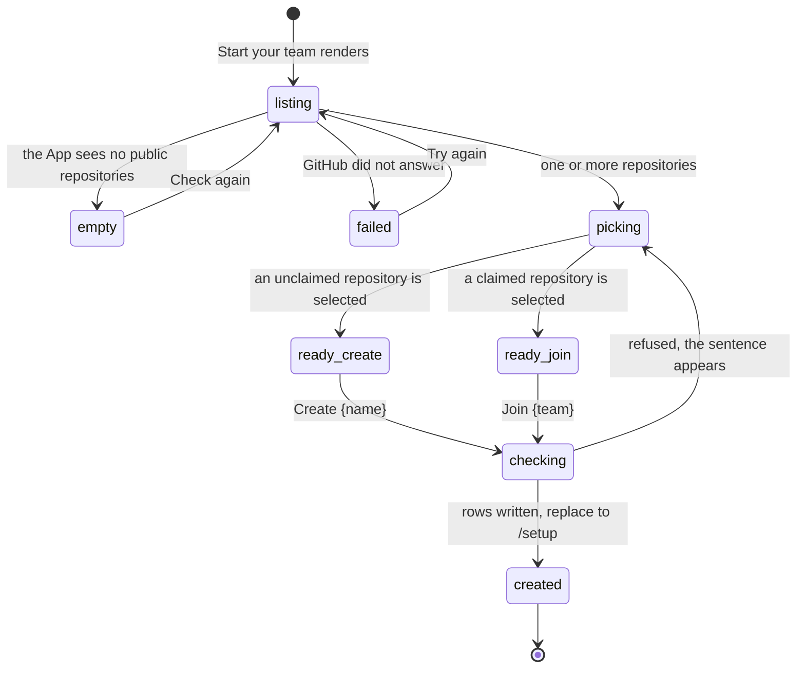

# Connecting a repository

## Summary

Connecting a repository creates a team. A student picks one of the repositories the portal's GitHub App can see, accepts or types a team name, and presses a button; the portal checks the repository, writes a team row and a membership row, and sends them to the setup guide.

This document owns the start path of `/connect` ("Start your team", `?path=start`): the repository picker, the fork steps when nothing is visible, the GitHub App access link, the team name field, and what the server does with the repository. The cohort code, the choice screen and the join path are [`join-or-make-a-team.md`](join-or-make-a-team.md).

The repository is fixed from here on, and the screen says why in its margin: "Forking gives your team its own copy of the starter code. It has to stay public, because the benchmark reads it from GitHub." with a template, or "It has to be public, because the benchmark reads it from GitHub." without one (`apps/portal/src/routes/ConnectPage.tsx:302-313`).

## The simple case

The first student in a cohort reaches `/connect`; with no teams to join, the page goes straight to "Start your team" (`ConnectPage.tsx:90`, `:265`). With a template configured, the line under it reads "Fork {template}, then pick your fork below. Your teammates join it after you." with the template as a link; without one, "Pick the repository your team will work in. Your teammates join it after you." (`ConnectPage.tsx:268-284`).

Their repository is in the list. They select it. A "Team name" field appears, empty, with a name made from the repository as its placeholder; the help reads "Shown on the public leaderboard. Leave it blank to use {suggestion}; you can rename it later." (`ConnectPage.tsx:636-656`). The button, which read "Choose a repository above", now reads "Create {name}" (`ConnectPage.tsx:673-677`). They press it, and land on `/setup`, which says "You've created {team}" and "You're its first member." (`apps/portal/src/routes/SetupPage.tsx:495-507`).

A first attempt can find an empty list, because forking and installing the portal's GitHub App are separate acts on GitHub. They get three numbered steps instead of a picker.

A student who picks a repository another team already holds sees no name field, and the button reads "Join {team}". Pressing it puts them on that team.

## The ask, event by event

```mermaid
stateDiagram-v2
    [*] --> listing : Start your team renders
    listing --> empty : the App sees no public repositories
    listing --> failed : GitHub did not answer
    listing --> picking : one or more repositories
    empty --> listing : Check again
    failed --> listing : Try again
    picking --> ready_create : an unclaimed repository is selected
    picking --> ready_join : a claimed repository is selected
    ready_create --> checking : Create {name}
    ready_join --> checking : Join {team}
    checking --> picking : refused, the sentence appears
    checking --> created : rows written, replace to /setup
    created --> [*]
```

### Asking

The gate is `stage="cohort"`; a student already on a team is sent to Runs unless a create or join is in flight (`ConnectPage.tsx:77-78`, `:104`).

`GET /api/github/repositories` produces the list, and the page shows "Listing repositories" while it runs (`ConnectPage.tsx:617-618`). The list is the public repositories the portal's GitHub App can see for this student: their installations, each installation's repositories, private ones dropped, sorted by most recent push, first fifty kept (`apps/portal/worker/github/client.ts:205-224`). The server adds `claimedByTeam`, the name of the team in this cohort that holds each repository (`apps/portal/worker/routes/github.ts:133-153`).

The picker shows six and folds the rest under "See {n} more repositories", detail "Older repositories · newest first" (`apps/portal/src/components/RepoPicker.tsx:53-55`). Each entry carries its full name, a fork marker, the default branch and "updated {n} ago". A claimed one says "Already {team}'s repository, so picking it joins that team" (`RepoPicker.tsx:139`). Under the picker is the access link (`apps/portal/src/components/GrantAccess.tsx:22-28`): "Missing a repository? Edit access on GitHub" when the App is installed, with "Installed for {accounts}", or "Missing a repository? Grant access on GitHub" when it is not. It renders nothing without GitHub or an App slug.

### Answered without work

**Nothing visible.** "No repositories are visible to the portal yet. Three steps make yours show up." (`ConnectPage.tsx:699`), then:

1. With a template, "Fork the course template", "Keep it public, under your account or your team's organization.", and a button "Fork {template}" that opens GitHub's fork page in a new tab (`ConnectPage.tsx:702-716`). Without one, "Pick a public repository" and "Use one your team already has, or create one on GitHub." (`:718`).
2. "Let the portal read it": "Install the portal's GitHub app on the account that owns the repository. It can read code and never writes." with the access link (`ConnectPage.tsx:721-723`).
3. "Check again": "Your repository appears here once the app can see it." and a button that refetches (`ConnectPage.tsx:725-735`).

**The listing failed.** The error card with a retry and the server's "GitHub did not answer the repository listing. Try again shortly." (`github.ts:107-111`, `:126-130`). A failure on any one installation now fails the whole request rather than shortening the list (`client.ts:210-214`).

**Nothing selected.** The button reads "Choose a repository above" and is disabled.

**Already on a team.** "You are already on a team." before any insert (`github.ts:164-166`).

Nothing is recorded in any of these cases.

### The work begins

When `connectTeam` inserts the team row (`apps/portal/worker/github/team.ts:52-68`). The checks before it, in order (`github.ts:157-205`):

1. No cohort: "Join a cohort first."
2. Already on a team: "You are already on a team."
3. No GitHub token or login: "Sign in with GitHub to connect a repository."
4. Private: "Repositories must be public to run the benchmark."
5. No write role: "You need write access to run the benchmark for this repository."
6. `GITHUB_TEMPLATE_REPO_ID` set and the repository does not descend from it: "This cohort only accepts forks of {template}, and this repository isn't one. Fork that template and connect the fork." (`apps/portal/worker/github/template.ts:17-25`).

Then the portal reads `cogportal.toml` for a description and writes the team with the repository's owner, name, URL, default branch, numeric id and source id. For a claimed repository it skips the insert and adds the caller with their GitHub role. The fixture repository on a development deployment skips GitHub entirely and gets `write` (`github.ts:171-173`).

The insert survives a race: `onConflictDoNothing`, re-read, and `admin` only if the row read back is this request's (`team.ts:68-74`). The membership upsert never demotes an admin (`team.ts:77-85`).

### While it works

One POST. The button shows a busy state; the picker and the name field stay live. The request captured the trimmed name, or the suggestion when the field was blank, when it was built (`ConnectPage.tsx:599`, `:609-612`). There is no progress detail for the three GitHub calls behind it.

### How it ends

On success the server returns the session and the page replaces to `/setup` with router state saying whether the student created or joined (`ConnectPage.tsx:606-611`). The role written is `admin` for a create and the mapped GitHub role for a join.

On failure the server's sentence appears above the button, or "Connecting failed. Try again." for anything else (`ConnectPage.tsx:658-664`). The selection and the typed name are kept.

## Modifiers

| Modifier | Set before the ask | Changed while it works |
| --- | --- | --- |
| Who you are | Built for a student with a cohort and no team. A development account sees only the fixture repository. An instructor has no special path and cannot connect a repository for someone else. | No effect. |
| Where your team and repository stand | This screen is the transition. A claimed repository is selectable and turns the action into "Join {team}". | The redirect to Runs is held while the request is pending or has just succeeded. |
| Which week's benchmark | No effect. The repository is not inspected for benchmark code. | No effect. |
| Practice or leaderboard | The team name is what the public leaderboard shows; the help text says so. | No effect. |
| Flags, options, and where you are typing | `GITHUB_TEMPLATE_REPO` fills the template into the subtitle, the fork step and the fork button. `GITHUB_TEMPLATE_REPO_ID` decides whether non-forks are refused. `GITHUB_APP_SLUG` decides whether the access link renders. The name field caps at 60, as does the contract (`ConnectPage.tsx:645`). | No effect. |

The picker is used without `disableClaimed` here; the team page passes it so a claimed repository there is not pickable (`RepoPicker.tsx:22`, `:88-89`).

## Cancel and interrupt

| Event | Before the work begins | While it works |
| --- | --- | --- |
| You stop it yourself | Leaving loses the selection and the name. "Back" returns to the choice when the cohort has teams; the first student in a cohort has no Back, because there was no choice. | No cancel control. Closing the tab does not stop the server; the next visit goes to Runs. |
| You do something else mid-way | Changing the selection is free and changes the placeholder; a typed name is kept across selections. | A second press while pending is ignored (`ConnectPage.tsx:603`). Connecting in a second tab first makes this request fail with "You are already on a team." |
| A teammate acts at the same time | A teammate who connects the same repository a moment earlier turns this create into a join, but `claimedByTeam` arrives only on the next listing, which is fresh for five minutes (`apps/portal/src/lib/queries.ts:120-127`), so the button may still read "Create {name}". | Two students connecting one repository at the same instant get one team; the loser joins as `write`. |
| The network or the portal fails | A failed team list shows its error above the picker and keeps starting open (`ConnectPage.tsx:287-297`). A failed listing shows the error card with a retry. | The server's sentence or "Connecting failed. Try again." |
| The page or the process goes away | Nothing lost. | A reload after the writes landed sends the student to Runs, not `/setup`, so the arrival note is skipped. |
| The thing being measured changes | A repository renamed or deleted between the listing and the press makes `getRepo` fail with a GitHub status, which reaches the student as "The request could not be completed by the configured backend." (`client.ts:135-139`, `apps/portal/worker/http/errors.ts:45-49`). Made private, it gets the public-repository sentence. | The team stores the name and default branch as they were; a later rename is not detected here. |
| The platform refuses or credit runs out | Credit is not consulted. | Not reachable. |

## Interactions with other systems

**Who may do this.** A signed-in student with a cohort and no team, with write access to the repository on GitHub, read with their own token.

**The team owns it.** This ask creates the owner. The creator is `admin`. See [`../foundations/the-team-and-the-repository.md`](../foundations/the-team-and-the-repository.md).

**Credit.** None spent.

**What the portal claims.** The list, fork flag, push time and description come from GitHub in the last few minutes; `claimedByTeam` is the portal's record. The fork step says the App "can read code and never writes" (`ConnectPage.tsx:722`), which depends on the App's GitHub-side permissions and cannot be checked from this repository.

**What the benchmark supplied.** Nothing.

**Live updates and reconnection.** Nothing polls. The listing and the installations are fresh for five minutes, the team list for thirty seconds (`queries.ts:120-127`, `:211-218`, `:324-331`). A student who installs the App in another tab presses "Check again".

**Discord.** Not involved. The dropped-link notice appears above the step for a student bounced off a Discord or device link (`ConnectPage.tsx:161`).

**Configuration.** `GITHUB_TEMPLATE_REPO`, `GITHUB_TEMPLATE_REPO_ID`, `GITHUB_APP_SLUG`, and the development switches that make the fixture repository the only one listed (`github.ts:96-98`). With `GITHUB_TEMPLATE_REPO_ID` unset, any public repository the student can write to is accepted, and nothing says so; per the working brief, setting it before every 2026 team has forked would lock those teams out.

## Edge cases

- **The access link's wording can be wrong.** The installations query does not retry and an error leaves no data (`queries.ts:211-218`), so an installed App whose installations call failed reads as not installed.
- **Fifty repositories.** A student with more than fifty visible repositories whose repository has not been pushed recently will not find it, and the fork steps will not help.
- **The suggested team name is generated.** Dashes and underscores become spaces, each word is capitalized, and the result is cut to 60 (`ConnectPage.tsx:759-764`). `cogworks-2026-capstone` becomes "Cogworks 2026 Capstone" on the leaderboard if the field is left blank. Typing replaces it rather than appending to it.
- **The description comes from `cogportal.toml`.** The picker shows GitHub's description; the team row gets the file's, or none (`github.ts:206-217`).
- **"That repository is already connected by team {name}." is not reachable here.** It belongs to the team page's repository change (`apps/portal/worker/routes/team.ts:585`).
- **A claimed past-course repository is joinable from here.** The claim lookup and `connectTeam` match on cohort and repository only, not on provenance (`github.ts:133-146`, `team.ts:42-46`), while the join route refuses archive teams. It needs a student with write access to an archive repository.
- **A branch listing failure is silent.** The entry keeps its default branch (`client.ts:239-244`).
- **Nothing verifies the repository has any code.** An empty fork connects.

## Open questions and verification

- Whether a non-collaborator's permission read is refused by GitHub, which would turn the write-access sentence into the generic 500 for that case (`client.ts:285-295`). Needs a live GitHub account.
- Whether a student who forked into an organization understands step 2's "the account that owns the repository" was not observed.
- A partial GitHub outage now fails the listing loudly (`client.ts:210-214`); B-00a is fixed, and was not observed against a real installation.
- Observed locally on fixture data: the choice screen and the start path layout (`/tmp/cogshots/matched/pairs/a-connect-desk.png`, `~2ff32fa`); creating a team on the fixture repository and landing on Setup, at `8052b12` in the old interface (`CogPortal-qa-video-20260930/outputs/beta-qa/01-desktop-onboarding.mp4`). No GitHub App, private repository or permission refusal was exercised.
- Hosted beta (`4984730`) differs: the start screen is headed "Start a team", the name field is prefilled with the generated name as its value, and the button reads "Select a repository" then "Create team" (beta `apps/portal/src/routes/ConnectPage.tsx:126`, `:354`, `:424-427`, candidate `ConnectPage.tsx:265`, `:595-599`, `:673-677`); success reaches `/setup` with no arrival state (beta `ConnectPage.tsx:364`, candidate `ConnectPage.tsx:611`).

Read against Cog\*Portal commit `2ff32fa`.
