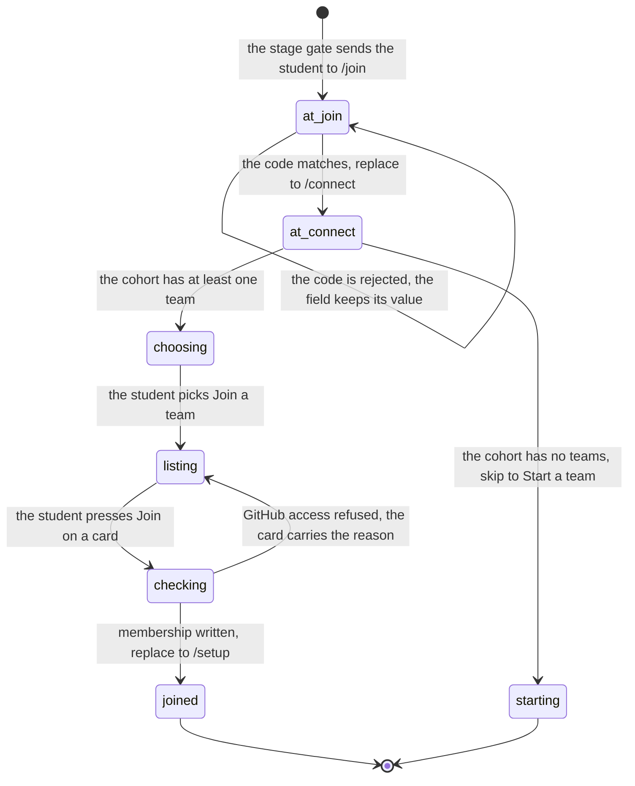

# Joining or making a team

## Summary

Between signing in and having somewhere to run code, a student passes two gates that look similar and are not. The first is the cohort: a code the instructor shared, typed once at `/join`, which decides which leaderboard and which set of teams the student can see. The second is the team: a group that shares one GitHub repository, picked from a list at `/connect`.

This document owns `/join` in full, and the "Join a team" half of `/connect`. The other half of `/connect`, where a student who is first in creates the team by connecting a fork, is [`connect-a-repository.md`](connect-a-repository.md). The split follows the wizard: `/connect` shows a choice screen with two cards, and this document follows the left one.

The two gates are easy to confuse because both are called joining and both happen once. The difference is who decides. A cohort is decided by a secret the instructor controls, and the portal is the only authority. A team is decided by GitHub: the portal asks whether this account can write to that repository and does what GitHub says.

Two structural facts govern everything below, and they are worth stating before anything else. `team_members` carries a unique index on `userId` (`apps/portal/worker/db/schema.ts:192`), so a student is on exactly one team at a time; there is no second team and no switching without an admin removing them first. And `teams.repoFullName` is not null and unique per cohort (`apps/portal/worker/db/schema.ts:137` and `:145`), so a team always has a repository and two teams in a cohort can never share one. The repository is the team, and the database enforces it rather than trusting the code to.

## The simple case

A student signs in and is sent to `/join` by the stage gate. The page shows one field, already focused, with eight middots for a placeholder. They type the code their instructor read out, in any case; the field renders it uppercase. The "Join" button enables at four characters. They press it, the portal accepts the code, and they arrive at `/connect`.

At `/connect` the portal lists the teams already in their cohort. Their teammate went first, so their team is there with its name, its member count, its repository, and a row of avatars. They press "Join" on that card. The portal checks their GitHub access to that team's fork, finds them as a collaborator, and adds them. They land on `/setup`.

The whole thing is two presses and one typed code, and the student does each of them once, ever.

The second common case is the student who is first. Their cohort has no teams yet, so `/connect` does not offer a choice at all: it goes straight to "Start a team", and this document hands off to [`connect-a-repository.md`](connect-a-repository.md).

The third is the student who presses "Join" on a team whose fork they cannot write to. The card keeps its place in the list and grows a sentence naming the person to ask and what to do after they ask. Nothing else changes; every other card is still pressable.

## The ask, event by event

### Asking

**The cohort code.** Arriving on `/join` is the ask. Before the page renders, two guards run. `RequireStage stage="user"` refuses a session with no user and sends it to `/signin` (`apps/portal/src/App.tsx:63`). Then the page itself refuses a student who already has a cohort, redirecting to `/dashboard` if they have a team and `/connect` if they do not (`apps/portal/src/routes/JoinPage.tsx:14`). Both use `replace`, so the back button does not oscillate.

The field is autofocused and rendered uppercase with wide letter spacing (`apps/portal/src/routes/JoinPage.tsx:52`). The placeholder is eight middots, which says how long a code is without showing a code that could be mistaken for one. Nothing is validated as the student types; the only client rule is that the trimmed value must be at least four characters before the button enables (`apps/portal/src/routes/JoinPage.tsx:69`).

The uppercase is presentational, applied by the field's styling, and the value is uppercased again when the request is built (`apps/portal/src/routes/JoinPage.tsx:21`). A student who types lowercase sees uppercase and sends uppercase, so there is no way to be caught out by case at any point.

The page heading is "Join the cohort" and the line under it is "Enter the join code from your instructor. You do this once." (`apps/portal/src/routes/JoinPage.tsx:41`). That last sentence is doing real work: it tells a student who is about to meet a second joining screen that this one is not it.

**A team.** Arriving on `/connect` is a second ask, and its gate is `stage="cohort"`: no user goes to `/signin`, no cohort goes to `/join` (`apps/portal/src/App.tsx:69`). The page then loads the cohort's teams, and what it shows depends on how many came back.

With at least one team, the student sees a choice screen headed "Set up your team" and one line under it: "You do this once. The repository is the team; everyone with write access shares its attempts." (`apps/portal/src/routes/ConnectPage.tsx:103`). Two cards follow. The first is "Join a team", hinted "Someone on your team went first. Find them among the cohort's {n} teams." with the count and the singular or plural filled in (`apps/portal/src/routes/ConnectPage.tsx:110`). The second is "Start a team", which the other document owns.

Choosing the first card replaces the screen with a list, headed "Join your team" and subtitled "Joining checks your GitHub access to the team's fork; collaborators get in instantly." (`apps/portal/src/routes/ConnectPage.tsx:124`). A "Both options" link goes back (`apps/portal/src/routes/ConnectPage.tsx:86`); it appears only while there is a choice to go back to. The step change is animated as a 0.2 second rise and is skipped entirely under a reduced-motion preference (`apps/portal/src/routes/ConnectPage.tsx:95`).

Nothing is captured across either ask. The join code is component state and dies with the page; the chosen wizard step is component state too, so a reload returns a student to the choice screen rather than to the list they were reading.

### Answered without work

`/join` answers without work in three ways. A student who already has a cohort is redirected. A press with fewer than four characters, or while a request is already in flight, returns early and does nothing at all (`apps/portal/src/routes/JoinPage.tsx:20`). And a rejected code renders a sentence under the field with the value still in it, so the student can correct rather than retype.

The rejection has three shapes, in this order (`apps/portal/src/routes/JoinPage.tsx:26`):

- Code `cohort_code_invalid`, which the server sends as a 403 with "The cohort join code is invalid." (`apps/portal/worker/routes/cohorts.ts:27`), is replaced by a sentence written for the student: "That code doesn't match. Check the code your instructor shared."
- Any other `ApiRequestError` renders the server's own message. The one a student can actually reach is the 409, "You're on a team in your current cohort. Leave it before joining a different cohort." (`apps/portal/worker/routes/cohorts.ts:34`).
- Anything that is not an `ApiRequestError` renders "Joining failed. Try again."

Nothing is recorded in any of these cases. The cohort row is only written on a match.

`/connect` answers without work when the cohort's team list is empty. Zero teams means there is nothing to join, so the choice screen is skipped entirely and the student goes straight to "Start a team" (`apps/portal/src/routes/ConnectPage.tsx:68`). This document ends there and [`connect-a-repository.md`](connect-a-repository.md) takes over.

The team join has its own short paths, all of them reads. A second press while one is in flight returns early (`apps/portal/src/routes/ConnectPage.tsx:215`). A student who already has a membership row is refused with 409 "You are already on a team." before the team is even looked up (`apps/portal/worker/routes/team-membership.ts:129`). A team id that does not belong to this cohort is 404 "Team not found." (`apps/portal/worker/routes/team-membership.ts:137`), which is what a stale list produces after a team is deleted. And a student whose GitHub access does not map to a writable role is refused before any insert.

> Technical note: the 404 for a team that has gone away arrives as a mutation error, so it renders as a sentence on the card rather than as the shared "not found" panel. A student sees "Team not found." in place, with the rest of the list intact, which is the right treatment for one dead row among many. The panel treatment, "The portal has no record at this address. Trying again will return the same answer." (`apps/portal/src/lib/query-error-state.ts:113`), is for a whole view that is missing.

### The work begins

For the cohort, the moment the server finds a matching active cohort and writes `cohortId` and `cohortJoinedAt` onto the user row (`apps/portal/worker/routes/cohorts.ts:37`). Before that, nothing. After it, the student's view of the platform has changed permanently: they can see that cohort's teams and that cohort's leaderboard, and joining a different cohort later is blocked while they hold a team in this one.

For the team, the moment the membership row is inserted (`apps/portal/worker/routes/team-membership.ts:171`). Everything before it is a read: the existing-membership check, the team lookup, the admin lookup, and the GitHub permission call. All of them can refuse, and none of them leave anything behind.

That single insert is the whole commitment, and it is why this ask has no partial state. There is no team row to create, no repository to claim, and no invitation to record. The team already exists with its repository, because a team cannot exist without one.

The insert is also guarded twice. The route checks for an existing membership first, and the unique index on `userId` catches the case where two requests from the same student raced past that check; the catch converts the constraint violation back into the same 409 sentence rather than letting it surface as a 500 (`apps/portal/worker/routes/team-membership.ts:177`).

### While it works

The cohort request is one POST. The button carries a `busy` state and the field stays editable, so a student can keep typing while a request is in flight; a second press is ignored by the early return.

The team request is also one POST, and the page tracks which card asked. `joiningId` records the team whose button was pressed, so only that card shows a spinner and only that card shows the error when it comes back (`apps/portal/src/routes/ConnectPage.tsx:230`). Every other card stays pressable, which matters because the most common failure is a fork the student cannot write to, and their next move may well be a different card.

Loading has a label. While the cohort's teams are being fetched, the page shows a loading mark reading "Checking the cohort" (`apps/portal/src/routes/ConnectPage.tsx:60`). The mark is a live region, so the wait is announced rather than being a silent blank (`apps/portal/src/components/Feedback.tsx:12`).

The list itself is not disabled while a request runs. Only the pressed card shows a busy button. That is deliberate given how the refusal works: a student who guessed wrong should be able to press the next card without waiting for a state to clear.

### How it ends

A successful cohort join navigates to `/connect` with `replace` (`apps/portal/src/routes/JoinPage.tsx:22`). The response is a fresh session, and the mutation invalidates every query, so the next page reads the new cohort rather than a stale one.

A successful team join navigates to `/setup` with `replace` and `state.entry = "joined"` (`apps/portal/src/routes/ConnectPage.tsx:219`). The setup page reads that entry to decide whether to address the student as the team's creator or as someone who arrived after it existed (`apps/portal/src/routes/SetupPage.tsx:31`), falling back to the team's own admin flag when the state is absent, which is what happens on a reload.

`replace` is used on both navigations for the same reason: the page just left is a page the student has finished with forever, and leaving it in the history means a back press lands on a screen that immediately redirects them forward again.

The role the student gets is the role GitHub says they have. `getPermission` returns a role name, `teamRole` maps `admin`, `maintain`, and `write` through unchanged and `push` to `write`, and anything else to null (`apps/portal/worker/github/permissions.ts:3`). Null is a refusal, not a lesser role. There is no read-only membership: a person who cannot push to the fork is not on the team, because the team is the fork.

Both mutations invalidate every cached query on success (`apps/portal/src/lib/queries.ts:189` and `:280`), so the destination page reads fresh state rather than the state that led the student here. The cohort join returns the whole session; the team join returns the team's detail, which the page ignores in favour of navigating.

A failure leaves the student exactly where they were, with the list still rendered and the code still in the field. Neither page clears its input on error, which is the correct behavior for a value the student may only need to change by one character.

## Modifiers

| Modifier | Set before the ask | Changed while it works |
| --- | --- | --- |
| Who you are | Signed out never reaches either page; the stage gate redirects first. A student and an instructor see the same two pages and the same rules: there is no staff bypass for the cohort code and no way for an instructor to place themselves on a team from here. A development account has no GitHub identity, so the team join refuses it unless the team's repository is the fixture repository (`apps/portal/worker/routes/team-membership.ts:149`). | No effect. The session is read at the start of the request and a role change does not reach an answer already in flight. |
| Where your team and repository stand | This is what both pages are for. No cohort means `/join`; a cohort and no team means `/connect`. A student who already has a team is redirected off `/connect` to `/dashboard` (`apps/portal/src/routes/ConnectPage.tsx:55`), and off `/join` as well. A repository is not optional: every team in the list has one, because the schema requires it. | The redirect off `/connect` is deliberately suppressed while a join or a create is in flight, because the refreshed session gains a team and would otherwise unmount the mutation before its success handler could navigate (`apps/portal/src/routes/ConnectPage.tsx:52`). |
| Which week's benchmark | No effect. Neither page names a benchmark, and neither reads the track. The cohort decides which leaderboard the student is on, not which week they run. | No effect. |
| Practice or leaderboard | No effect on the ask. The consequence is later: the team name typed on the other half of `/connect` is what appears on the public leaderboard, and joining an existing team inherits its name. | No effect. |
| Flags, options, and where you are typing | The join code is uppercased in the browser and again on the server before the lookup (`apps/portal/worker/routes/cohorts.ts:21`), so case never matters. The field has no maximum length, while the contract caps the code at 32 characters (`packages/contracts/src/schema.ts:1003`), so an over-long paste is refused by the server rather than by the field. Only active cohorts match. | No effect. |

Nothing on either page can be reconfigured by the student. The only input is the code and the choice of card.

One modifier deserves restating because it is the most common source of surprise: whether the cohort has any teams changes the shape of `/connect` entirely. Zero teams removes the choice, removes the "Both options" link, and puts a repository picker in front of a student who was expecting a list of names.

## Cancel and interrupt

| Event | Before the work begins | While it works |
| --- | --- | --- |
| You stop it yourself | Navigating away from `/join` with a code half typed loses the code and nothing else. There is no draft and no confirmation prompt. | There is no cancel control on either page. Closing the tab during a join abandons the browser's half of it; the server finishes the request either way, so a cohort join that had reached the write is done even though nobody saw the answer. The next visit finds the cohort already set and redirects accordingly. |
| You do something else mid-way | Navigating away is free. The pages hold no durable state. | Pressing "Join" on a second team card while the first is in flight is ignored: the handler returns early when the mutation is pending (`apps/portal/src/routes/ConnectPage.tsx:215`). The first request finishes and its result is shown on its own card. |
| A teammate acts at the same time | A teammate creating the team a moment before the list loads means the team is simply there. A teammate creating it a moment after means it is not, and the student sees a cohort with fewer teams than it has. The list has a 30 second stale time and no refetch interval (`apps/portal/src/lib/queries.ts:276`), so a student who parks on the choice screen does not see it appear. | Two students joining the same team at the same instant are both allowed: the constraint is one team per person, not a member cap. Two students racing to join *different* teams both succeed. A student who is added to a team from Team settings while looking at the list gets 409 "You are already on a team." on their next press (`apps/portal/worker/routes/team-membership.ts:129`), and the unique index catches the same race one layer down (`:178`). |
| The network or the portal fails | A failed session read with nothing cached renders the shared error panel: "The request never reached the portal, so nothing was lost. Check your connection, then try again." (`apps/portal/src/lib/query-error-state.ts:96`). | A failed cohort join shows "Joining failed. Try again." when the failure is not an `ApiRequestError`, and the server's own sentence when it is. A failed team join shows "Joining failed. Try again." on the card that asked (`apps/portal/src/routes/ConnectPage.tsx:275`). Neither leaves a partial record: both writes are single inserts. |
| The page or the process goes away | Nothing is lost. | A reload during a team join re-reads the session. If the insert landed, the student now has a team and `/connect` redirects them to `/dashboard`, not to `/setup`, so they skip the setup guide's entry copy and reach it later through the dashboard. |
| The thing being measured changes | A cohort deactivated between the instructor reading out the code and the student typing it is refused with "That code doesn't match. Check the code your instructor shared.", because the lookup requires `active` (`apps/portal/worker/routes/cohorts.ts:22`). The sentence blames the code rather than the cohort's state. | A team's repository changed from Team settings while a student is mid-join means the GitHub permission check runs against the new repository. The student may hold access to one and not the other. Nothing says so. |
| Refused, or out of credit | Credit is not consulted by either page. A team with no runs left is still joinable. | Not reachable. The only refusals here are the code, the cohort boundary, and GitHub access. |

Every refusal on both pages is a sentence in place, not a redirect. The student stays where they are with what they typed still in front of them.

The one interrupt that is genuinely lossy is closing the tab between the server's write and the browser's navigation. The cohort join or the membership insert has already happened, so the student is further along than the page they return to suggests. Both pages self-redirect on their next visit, so the recovery is automatic; what is lost is the destination, not the state. A team joined this way lands on `/dashboard` instead of `/setup`.

## Interactions with other systems

**Who may do this.** Anyone signed in may type a code. Joining a team additionally requires write access to that team's repository on GitHub, checked live against the student's own OAuth token (`apps/portal/worker/routes/team-membership.ts:159`). There is no portal-side invitation to accept and no approval queue: GitHub is the roster, and the portal reads it.

**The team owns it.** The cohort belongs to the person; the team belongs to the group. Joining a team is the moment the student stops being an individual on this platform. From here every run, report, and leaderboard entry is the team's. See [`../foundations/the-team-and-the-repository.md`](../foundations/the-team-and-the-repository.md).

**Credit.** None spent. A joining student inherits whatever the team has left rather than bringing their own; quota is per team per benchmark (see [`../cross-cutting/credit-and-quota.md`](../cross-cutting/credit-and-quota.md)).

**What the portal claims.** The team list reports what the portal's own database holds: name, description, repository full name, and the members it has records for. The member avatars and logins come from the users table, not from GitHub, so a member who has never signed in does not appear even if they have write access to the fork. That is a claim about the portal's records, correctly, and not a claim about the repository.

**What the benchmark supplied.** Nothing. No benchmark is loaded on either page.

**Live updates and reconnection.** Neither page polls. The session has a 60 second stale time, the team list 30 seconds, and `refetchOnWindowFocus` is off everywhere (`apps/portal/src/App.tsx:27`). A student watching the choice screen for a teammate's team to appear will wait forever unless they reload.

**Discord.** Not involved. A team's Discord channel is chosen later, from Discord. A student bounced off a Discord link because they had no team yet sees the dropped-link notice at the top of both pages (`apps/portal/src/components/DroppedLinkNotice.tsx:13`), which says "A Discord link was waiting, but you need a team first. Finish this step, then start the link again from Discord."

**Configuration.** The join code and the active flag are cohort rows in the database, set by staff. The fixture repository bypass on the team join path requires `devAuthAvailable`, which requires a development environment with GitHub unconfigured (`apps/portal/worker/env.ts:89`).

Two of those concerns are load-bearing enough to restate. The team is the unit from the moment the membership row exists, and GitHub is the roster from the moment before it. Everything the portal shows a student afterwards follows from those two sentences.

## Edge cases

- **The dropped-link notice can be swallowed in development.** `DroppedLinkNotice` reads its value through `useState(takeDroppedDeviceLink)`, and that initializer removes the key as it reads it (`apps/portal/src/components/DroppedLinkNotice.tsx:14`, `apps/portal/src/lib/pending-return.ts:43`). React calls a lazy initializer during render, and `StrictMode` renders twice on mount (`apps/portal/src/main.tsx:15`), so the second call returns null and the notice does not appear. The exact class of impure-render bug `StrictMode` exists to expose, in the component whose whole job is to tell a student something was lost.
- **The stage guard writes to `sessionStorage` while rendering.** `rememberDroppedDeviceLink` is called in the body of `RequireStage`, not in an effect (`apps/portal/src/App.tsx:67`). It is idempotent, so the double render is harmless for the write itself. Its consequence, one line later, is what the notice above then fails to show.
- **A student on a team cannot leave.** There is no leave control anywhere in the portal. The only removal path is a team admin deleting a member from Team settings, and even that refuses to remove an admin: "A team admin cannot be removed here. Change their permission on GitHub instead." (`apps/portal/worker/routes/team-membership.ts:294`). So the 409 sentence "You're on a team in your current cohort. Leave it before joining a different cohort." names an action a student cannot perform on their own.
- **The team list is not restricted to teams the student can join.** Every team in the cohort is listed, and the access check happens on the press. A student in a cohort of twenty teams sees twenty "Join" buttons, nineteen of which will refuse them. The first five are shown and the rest fold behind "See {n} more teams" (`apps/portal/src/routes/ConnectPage.tsx:242`).
- **The refusal names who to ask.** A join without GitHub access returns 403 `repo_access_required` carrying "Ask {adminLogin} to add you as a collaborator on GitHub, then accept the invitation GitHub emails you (github.com/notifications) and press Join again. They can also add you here from Team settings." (`apps/portal/worker/routes/team-membership.ts:69`). The admin login is looked up from the team's own membership rows and falls back to "a team admin" when there is none. The card under the list says a shorter version of the same thing before any press (`apps/portal/src/routes/ConnectPage.tsx:253`).
- **The reachability of that sentence is in doubt.** GitHub's collaborator-permission endpoint requires the caller to have push access to the repository. A student who is not a collaborator is exactly the caller who lacks it, and `githubJson` turns any non-2xx into a plain `Error` (`apps/portal/worker/github/client.ts:126`), which is not an `ApiHttpError` and therefore becomes a generic 500, "The request could not be completed by the configured backend." (`apps/portal/worker/http/errors.ts:40`). If that is what GitHub does, the carefully written sentence above is unreachable for the case it was written for. **Unverified**, and carried to triage.
- **A member with no GitHub login is listed under their email prefix.** The list falls back to the local part of the email when `githubLogin` is null (`apps/portal/worker/routes/team-membership.ts:102`), which is what a development account looks like on a team card.
- **Members are ordered by role, then login.** The query sorts by role ascending, so `admin` comes before `maintain` before `write` alphabetically, which is also the order of authority (`apps/portal/worker/routes/team-membership.ts:96`). The avatar strip shows five and then a `+n` (`apps/portal/src/routes/ConnectPage.tsx:319`), with every member's login in a screen-reader-only list so nothing is hidden from assistive technology.
- **An over-long code is refused in the server's voice.** The contract allows 4 to 32 characters (`packages/contracts/src/schema.ts:1003`) and the field has no `maxLength`, so a pasted paragraph fails schema parsing and comes back as 400 "The request body is invalid." (`apps/portal/worker/http/respond.ts:22`), which the page renders verbatim because it is an `ApiRequestError`.
- **The team list can fail without the page saying so on this half.** A failed teams query is surfaced only on the "Start a team" screen (`apps/portal/src/routes/ConnectPage.tsx:144`). That is normally enough, because an errored query yields no teams and the wizard sends the student straight there. A cached list plus a failed refresh is the one arrangement where the choice screen renders and the error does not. See [`connect-a-repository.md`](connect-a-repository.md#edge-cases).
- **The list is alphabetical, and the first five are the alphabetically first five.** Teams are ordered by name (`apps/portal/worker/routes/team-membership.ts:81`) and the page shows five before folding the rest (`apps/portal/src/routes/ConnectPage.tsx:29`). Nothing promotes the team the student is most likely to want, and there is no search field, so a team named "Zebra" in a cohort of twenty is always behind a press.
- **The folded teams are inert, not merely hidden.** The veil marks the folded region `aria-hidden` and untabbable while collapsed, and moves focus into it when a keyboard user expands it (`apps/portal/src/components/Veil.tsx:16`). A screen reader does not read out nineteen teams the student has not asked for.
- **The member strip is a portal record, not a GitHub record.** Members come from the users table joined to memberships (`apps/portal/worker/routes/team-membership.ts:93`), so a collaborator on the fork who has never signed in to the portal is invisible on the card. A student can therefore see "1 member" on a team of four and reasonably conclude they have the wrong team.
- **A development deployment can join the fixture team without GitHub.** When the team's repository is the fixture repository and `devAuthAvailable` is true, the permission check is skipped and the student is given `write` outright (`apps/portal/worker/routes/team-membership.ts:149`). This is the only path in either page that grants a role without asking GitHub.
- **`requireCohort` has its own sentence, and a student should never see it.** The teams endpoint refuses a cohort-less caller with 403 `no_cohort` "Join a cohort first." (`apps/portal/worker/routes/team-membership.ts:35`), which the shared mapping renders as "This view belongs to a cohort, and you haven't joined one yet. Join with the code your instructor shared." with a link to `/join` and no retry button (`apps/portal/src/lib/query-error-state.ts:145`). The stage gate should have redirected first, so reaching it means a session cached with a cohort the server no longer agrees about.
- **No retry button appears on a refusal.** The shared error panel suppresses retry for anything a second identical request would answer identically: 404, an ended session, and the cohort, team, and access states (`apps/portal/src/lib/query-error-state.ts:47`). A "Try again" on a missing cohort would make a promise the button cannot keep, and `apps/portal/test/query-error-render.test.ts:33` asserts the button is absent rather than merely inactive.
- **The join code is not secret and is not rate limited by the portal.** The route compares the uppercased code against active cohorts and returns a different status for a match and a miss (`apps/portal/worker/routes/cohorts.ts:16`). Guessing is bounded only by Better Auth's request-level limiter, which is not specific to this route. **Unverified.**
- **A cohort join is recorded with a timestamp.** `cohortJoinedAt` is written alongside `cohortId` (`apps/portal/worker/routes/cohorts.ts:39`). Nothing in the student-facing portal shows it.
- **The wizard step is not in the address.** Both halves of `/connect` share one URL, so the browser's back button leaves the page entirely rather than returning from the list to the choice screen. The in-page "Both options" link is the only way back.
- **A team card shows the repository, and that is the only thing a student can match on.** The name is chosen by whoever created the team and may be nothing like the group's name in Discord. The repository full name under it is truncated when long (`apps/portal/src/routes/ConnectPage.tsx:291`), and the description is clamped to two lines (`:289`).
- **The description on a team card came from the repository.** When a team is created, its description is copied from the fork's `cogportal.toml` if it has one (`apps/portal/worker/github/team.ts:59`), so an empty description usually means the fork has no such file rather than that the team declined to write one.
- **Two students can create two teams for the same group.** Nothing detects that two forks of the template belong to the same set of people. The unique index prevents two teams sharing one repository; it cannot prevent one group holding two repositories. The refusal a second student then hits is not a helpful one: they are told they lack access to their teammate's fork.
- **A cohort's teams are readable by every member of the cohort.** The endpoint returns every team with its members and repository (`apps/portal/worker/routes/team-membership.ts:74`). There is no privacy boundary between teams in a cohort at this stage, which is also what makes the leaderboard's team names unsurprising later.
- **The role a student joins with is fixed at the moment of the join.** Nothing re-reads GitHub afterwards. A student promoted to maintainer on the fork the next day keeps the row they were given, and a student whose access is revoked keeps their membership. The portal's roster and GitHub's can drift apart from the second after the insert.
- **The 409 for a cross-cohort move is checked against the team, not the user's cohort.** The route refuses when the student holds a team whose `cohortId` differs from the cohort they are trying to join (`apps/portal/worker/routes/cohorts.ts:30`). A student with a cohort but no team can therefore move between cohorts freely, and nothing warns them that the teams they were looking at a moment ago are gone.

## Open questions and verification

- Whether GitHub returns a 403 rather than a 200 for the collaborator-permission call made by a non-collaborator decides whether `repo_access_required` is reachable at all. This is the single most important thing to check with a live GitHub account, because it governs the most common failure on this page. **Unverified.**
- The `DroppedLinkNotice` initializer bug should be reproducible in a development build by running `cogworks link` before joining a cohort. It was not run. **Unverified**, and carried to triage.
- The 409 sentence tells a student to leave a team, and no leave control exists. Either the sentence should name the admin who can remove them or a leave path should exist. A product call, carried to triage.
- Whether a student in a large cohort finds their team in the folded list was not observed. Five are visible and the rest are behind one press; there is no search. **Unverified.**
- Whether the "Checking the cohort" loading mark is ever visible long enough to read was not measured. **Unverified.**
- The member strip showing only portal accounts, not GitHub collaborators, may make a student doubt they have found the right team. Whether it does in practice was not observed. **Unverified.**
- The wizard step living outside the address means a reload during the "Join a team" list returns to the choice screen. Minor, but it is the only navigation on either page that does not survive a refresh.
- Whether an instructor needs a way to place a student on a team without GitHub access was not established. Team settings can add a member (`apps/portal/worker/routes/team-membership.ts:213`), and that path does not check GitHub at all, which is either the intended escape hatch or a gap in the rule that the repository is the team.
- A student with a cohort and no team can silently rejoin a different cohort, which is allowed by the check at `apps/portal/worker/routes/cohorts.ts:30` but is not obviously intended. Whether staff want that is a product call.
- Nothing on either page was exercised against a running portal in this pass.

Verified against Cog\*Portal commit `f74e087`.
