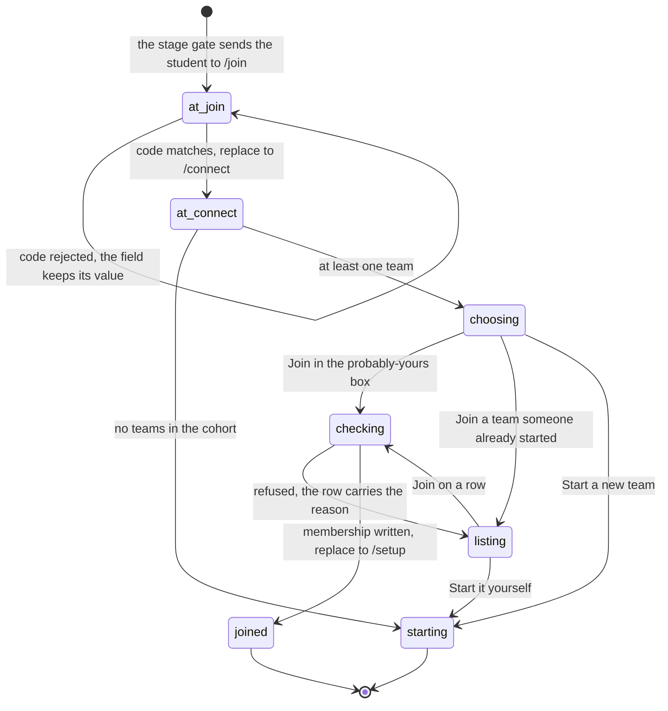

# Joining or making a team

## Summary

Between signing in and having somewhere to run code, a student passes two gates that look alike and are not. The first is the cohort: a code the instructor shared, typed once at `/join`, which decides which leaderboard and which set of teams the student sees. The second is the team: a group that shares one GitHub repository, picked at `/connect`. The onboarding path at the top of both pages numbers them "2. Cohort" and "3. Team" (`apps/portal/src/components/OnboardingPath.tsx:16-21`).

This document owns `/join` in full, the choice screen at `/connect`, and its join path. The start path, where the first student connects the repository, is [`connect-a-repository.md`](connect-a-repository.md). A claimed repository picked on the start path is also a join; that document covers it.

The difference between the gates is who decides. The portal alone decides a cohort, from a code. GitHub decides a team: the portal asks whether this account can write to that repository and does what GitHub says.

## The simple case

A student signs in and is sent to `/join`. The page reads "Join the cohort" and "A cohort is this summer's class. Your instructor's join code puts you in it, so you'll see your classmates' teams and this year's leaderboard." (`apps/portal/src/routes/JoinPage.tsx:50-55`). A margin note adds "You only do this once. Everyone in the class uses the same code, so if you don't have it, a classmate or a TA does." (`JoinPage.tsx:62-63`). They type the code, which appears in capitals, and press "Join the cohort". They land on `/connect`.

The page reads "Join or start your team" and "Usually one person starts the team and everyone else joins it." (`apps/portal/src/routes/ConnectPage.tsx:173-177`). A teammate went first, and the portal's GitHub listing for this student includes that teammate's repository, so a bracketed box at the top says "You can see this team's repository on GitHub, so it's probably yours" and shows the team with a Join button (`ConnectPage.tsx:191-211`). They press it. GitHub says they can write, and they land on `/setup`, which says "You're on {team}" and names who else is on it (`apps/portal/src/routes/SetupPage.tsx:495`, `:509-511`).

Observed locally on fixture data: the cohort page and the choice screen with the "probably yours" box (`/tmp/cogshots/matched/pairs/a-join-desk.png`, `a-connect-desk.png`, right halves, `~2ff32fa`).

## The ask, event by event

```mermaid
stateDiagram-v2
    [*] --> at_join : the stage gate sends the student to /join
    at_join --> at_join : code rejected, the field keeps its value
    at_join --> at_connect : code matches, replace to /connect
    at_connect --> starting : no teams in the cohort
    at_connect --> choosing : at least one team
    choosing --> checking : Join in the probably-yours box
    choosing --> listing : Join a team someone already started
    choosing --> starting : Start a new team
    listing --> checking : Join on a row
    listing --> starting : Start it yourself
    checking --> listing : refused, the row carries the reason
    checking --> joined : membership written, replace to /setup
    joined --> [*]
    starting --> [*]
```

### Asking

**The cohort.** `/join` is behind `RequireStage stage="user"` (`apps/portal/src/App.tsx:113-120`). A student who already has a cohort is redirected to `/dashboard` with a team and `/connect` without (`JoinPage.tsx:21-23`). The field is autofocused, uppercases each keystroke so what is on screen is what is sent, and stops at 32 characters, the server's limit (`JoinPage.tsx:76`, `:83`). The placeholder is eight middots. The button enables at four trimmed characters (`JoinPage.tsx:25`).

**The team.** `/connect` is behind `stage="cohort"` (`App.tsx:121-128`). While the cohort's teams load, the page shows "Checking the cohort" (`ConnectPage.tsx:110`). The chosen path lives in the address as `?path=join` or `?path=start`, so the back gesture returns to the choice and a reload keeps the step (`ConnectPage.tsx:58-60`, `:90`, `:122-127`). The choice screen offers "Join a team someone already started", hinted "Find your teammates among the cohort's {n} teams.", and "Start a new team" (`ConnectPage.tsx:217-230`). When the "probably yours" box is present, a label "Not the right team?" sits above the two cards (`ConnectPage.tsx:213-215`).

The join screen is "Join your team", with the margin note "Joining asks GitHub whether you can push to the team's repository. If you can't yet, whoever started the team can add you as a collaborator." (`ConnectPage.tsx:239`, `:246-248`). Each team is a row: its name, up to three avatars with `@logins` and "and {n} more", and the repository (`ConnectPage.tsx:531-557`, `:560-584`). A team with no members reads "Nobody has joined yet". Five rows show; the rest fold behind "See {n} more teams" (`ConnectPage.tsx:33`, `:472-482`). With more than five teams, a "Find your team" field filters by team name, member login or name, or repository, with a live count "{k} of {n} teams match" (`ConnectPage.tsx:387`, `:402-455`). Under the list: "Nobody on your team has started it yet? Start it yourself" (`ConnectPage.tsx:486-491`).

Nothing is captured beyond the address. The code is component state.

### Answered without work

`/join` answers without work when the student already has a cohort, when the press comes with fewer than four characters or a request in flight (`JoinPage.tsx:29`), and when the code is refused. Refusals keep the value in the field (`JoinPage.tsx:35-42`):

- `cohort_code_invalid` is shown as "That code doesn't match. Check the code your instructor shared."
- The right code for a closed cohort: "That code is right, but enrollment is closed. Ask your instructor to open it." (`apps/portal/worker/routes/cohorts.ts:30`).
- Any other server sentence is shown as sent; anything else reads "Joining failed. Try again."

`/connect` skips the choice when the cohort has no teams and goes straight to "Start your team" (`ConnectPage.tsx:90`).

The team join has its own short paths, all reads: a second press while one is pending is ignored (`ConnectPage.tsx:132`); a student already on a team gets "You are already on a team." (`apps/portal/worker/routes/team-membership.ts:131`); a team removed after the list loaded gets "This team was removed after the list loaded. Reload the page to see the current teams." in place of the server's "Team not found." (`ConnectPage.tsx:500-501`); and a student without a writable GitHub role gets the collaborator sentence below. A search that matches nothing reads "No team matches {query}." and "Check the spelling with a teammate, or start the team if nobody has yet." (`ConnectPage.tsx:458-466`).

### The work begins

For the cohort, when the server writes `cohortId` and `cohortJoinedAt` on the account (`cohorts.ts:41-44`). From then on `/join` redirects them away for good.

For the team, when the membership row is inserted (`team-membership.ts:180-185`). Everything before it is a read: the existing-membership check, the team lookup, the admin lookup and the GitHub permission call. A unique-index race is translated back to "You are already on a team." (`team-membership.ts:186-189`).

### While it works

The cohort button shows a busy state and the field stays editable. The team join tracks which row asked: only that row's button pulses and only that row shows a refusal, and every other row stays pressable (`ConnectPage.tsx:527-529`). While a join is pending or has just succeeded, the page stops its GitHub listing and suppresses its redirect to Runs, so a slow listing cannot hold a finished join (`ConnectPage.tsx:77-85`, `:104`).

### How it ends

A cohort join replaces to `/connect`. A team join replaces to `/setup` with router state naming the team (`ConnectPage.tsx:133-139`). The setup page reads that state once, says "You're on {team}" and "You're working with @a and @b." for the others, then removes the state so a reload does not repeat it (`SetupPage.tsx:57-68`, `:495-512`).

The role is GitHub's answer mapped by `teamRole`; anything below write is a refusal, not a lesser role. Both mutations invalidate every cached query on success (`apps/portal/src/lib/queries.ts:188-191`, `:333-336`).

A refusal leaves the student where they were, with the code in the field or the list intact.

## Modifiers

| Modifier | Set before the ask | Changed while it works |
| --- | --- | --- |
| Who you are | Signed out never reaches either page. Students and instructors see the same pages; there is no staff bypass for the code. A staff member without a team is still sent here by sign-in and by the account menu's "Continue setup", though the header hides "Get started" from them (`apps/portal/src/components/Shell.tsx:53-55`, `apps/portal/src/components/UserMenu.tsx:218-220`). A development account has no GitHub identity and is refused on join unless the team's repository is the fixture repository (`team-membership.ts:159-167`). | No effect. |
| Where your team and repository stand | No cohort means `/join`; a cohort and no team means `/connect`; a team sends both pages to Runs. Every team listed has a repository. | The redirect off `/connect` is held while a join is in flight (`ConnectPage.tsx:77-78`). |
| Which week's benchmark | No effect. | No effect. |
| Practice or leaderboard | No effect on the ask. Joining inherits the team's name, which is what the leaderboard shows. | No effect. |
| Flags, options, and where you are typing | Case never matters: the browser and the server both uppercase (`cohorts.ts:19`). `?path=` chooses the wizard step; an unknown value shows the choice. | No effect. |

## Cancel and interrupt

| Event | Before the work begins | While it works |
| --- | --- | --- |
| You stop it yourself | Leaving `/join` with a half-typed code loses the code. On `/connect`, "Back" or the back gesture returns to the choice (`ConnectPage.tsx:124-127`, `:142-152`). | There is no cancel control. Closing the tab does not stop the server. The next visit finds the cohort or the team and redirects. |
| You do something else mid-way | Free. | A second Join while one is pending is ignored. |
| A teammate acts at the same time | The team list is fresh for 30 seconds and not polled (`queries.ts:324-331`); a team created after it loaded does not appear until a reload. | A student added from a team page while looking at the list gets "You are already on a team." on the next press. If the tab is hidden and shown again first, the restore gate sees the new team and reloads the page, which then sends them to Runs (`apps/portal/src/components/RestoreGate.tsx:92-100`). |
| The network or the portal fails | A failed session read shows the shared error card. A failed team list is not shown as an empty cohort; the start screen says joining is hidden. | A failed join shows the server's sentence on that row, or "Joining failed. Try again." (`ConnectPage.tsx:496-506`). Neither page leaves a partial record. |
| The page or the process goes away | Nothing lost. A reload keeps the wizard step. | A reload after the insert lands on Runs, not `/setup`, so the arrival note is skipped; the setup guide is under the Setup tab. |
| The thing being measured changes | A cohort closed between hearing the code and typing it gets the closed-enrollment sentence. | A team's repository changed while a student joins is checked against the new repository. |
| The platform refuses or credit runs out | Credit is not consulted. | Not reachable. |

## Interactions with other systems

**Who may do this.** Anyone signed in may type a code. Joining a team needs write access to its repository on GitHub, read live with the student's own token (`team-membership.ts:162-176`). There is no portal invitation and no approval queue.

**The team owns it.** The cohort belongs to the person; the team to the group. See [`../foundations/the-team-and-the-repository.md`](../foundations/the-team-and-the-repository.md).

**Credit.** None spent. A joining student inherits whatever the team has left.

**What the portal claims.** Team rows show the portal's own records: name, repository and the members who have signed in. A collaborator who never signed in does not appear. The "probably yours" box claims only what it says: the student's GitHub listing includes that repository.

**What the benchmark supplied.** Nothing.

**Live updates and reconnection.** Neither page polls. The restore gate rereads the session when the tab returns.

**Discord.** A student bounced off a Discord or device link because they had no team sees "Your Discord link is on hold" or "Your device link is on hold" at the top of both pages, with the command to run again for a device (`apps/portal/src/components/DroppedLinkNotice.tsx:27-40`).

**Configuration.** The code and the active flag are cohort rows set by staff. Past-course `archive` teams are left out of the list (`team-membership.ts:81`).

## Edge cases

- **The cross-cohort sentence is unreachable.** "You're on a team in your current cohort. Leave it before joining a different cohort." (`cohorts.ts:38`) needs a student with a team to post a code, and `/join` redirects anyone with a cohort. It also names an action that does not exist. `b0e0c55`: it reads "Leave it from your Team page, then use this code." (`cohorts.ts:50`), an action that now exists; the sentence is still unreachable from `/join`.
- **A student on a team cannot leave.** There is no leave control; an admin can remove a member but never another admin (`team-membership.ts:304`). `b0e0c55`: Leave on the team page takes the student back here with "You left {team}" and "Its runs and results stay with the team. If GitHub still gives you write access to its repository, you can join it again below." (`ConnectPage.tsx:61-83`); the old team is in the list like any other.
- **The collaborator refusal names "Team settings".** "Ask {admin} to add you as a collaborator on GitHub, then accept the invitation GitHub emails you (github.com/notifications) and press Join again. They can also add you here from Team settings." (`team-membership.ts:69`). The team page has a People section and no "Team settings" (`apps/portal/src/routes/TeamPage.tsx:345`).
- **The list is alphabetical.** Teams are ordered by name (`team-membership.ts:82`) and the first five show. Search exists only above five teams.
- **The folded teams are inert while closed**, and the veil moves focus into them when opened (`apps/portal/src/components/Veil.tsx`).
- **A member with no GitHub login is listed under their email prefix** (`team-membership.ts:103`).
- **A student with a cohort and no team cannot change cohort from the interface.** `/join` redirects them; the server would allow it.
- **The dropped-link notice is read once.** `takeDroppedDeviceLink` removes the note as it reads it (`apps/portal/src/lib/pending-return.ts:42-47`), and the notice sits outside the keyed wizard step so moving between steps keeps it (`ConnectPage.tsx:159-161`). React 19 keeps the first result of a lazy initializer that StrictMode calls twice, so development does not swallow it.
- **Two students can create two teams for one group.** The index stops two teams sharing a repository, not one group holding two.

## Open questions and verification

- No member can leave a team (`team-membership.ts:304`). B-07; self-leave in `b0e0c55`.
- Whether GitHub's collaborator-permission endpoint answers a non-collaborator or refuses them decides whether that student reads the collaborator sentence or the generic "The request could not be completed by the configured backend." (`apps/portal/worker/github/client.ts:135-139`, `apps/portal/worker/http/errors.ts:45-49`). Needs a live GitHub account.
- The collaborator refusal names "Team settings", which no longer exists by that name. Carried to triage as new.
- Staff without a team are routed here after sign-in. Carried to triage as new (see [`sign-in.md`](sign-in.md#open-questions-and-verification)).
- Whether a student in a cohort of twenty finds their team without the "probably yours" box was not observed.
- Hosted beta (`4984730`) differs: `/join` reads "Enter the join code from your instructor. You do this once." with a "Join" button and no length cap, so an over-long paste is refused as "The request body is invalid." (beta `apps/portal/src/routes/JoinPage.tsx:41`, `:71`, candidate `JoinPage.tsx:51-55`, `:83`, `:100`); `/connect` reads "Set up your team", keeps its step in component state, has no search and no "probably yours" box, and a join reaches `/setup` with no arrival note (beta `apps/portal/src/routes/ConnectPage.tsx:41`, `:97`, `:212`, candidate `ConnectPage.tsx:90`, `:133-139`, `:173`).

Read against Cog\*Portal commit `2ff32fa`.
