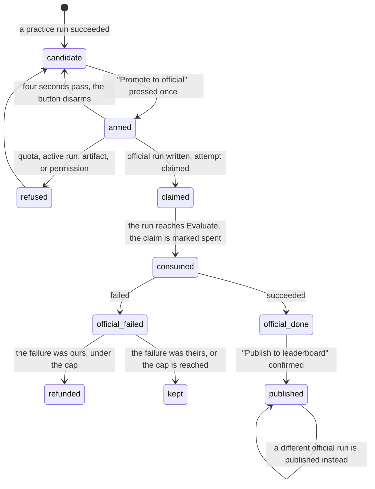

# Promoting a run

## What this document owns

Two acts, on two routes.

**Promotion** turns a practice run that succeeded into an official attempt. It is offered on `/dashboard` in the `Candidate ready` block and on `/runs/:runId` in the `PROMOTE` panel, and it spends one of the team's three official attempts per benchmark version.

**Publication** makes a succeeded official run the team's single public entry on the leaderboard. It is offered on `/runs/:runId` in the `PUBLISH` panel, it costs nothing, and it can be changed as often as the team likes.

This document owns both, everywhere they appear, including the run console's `Promote to official` and `Publish result` buttons. It also owns what an official failure costs and when it is given back.

[`start-a-practice-run.md`](start-a-practice-run.md) owns the practice run that becomes the candidate. [`watching-a-run.md`](watching-a-run.md) owns the official run while it works, and the console's own layout. [`the-run-page.md`](the-run-page.md) owns everything else on `/runs/:runId`. [`../cross-cutting/credit-and-quota.md`](../cross-cutting/credit-and-quota.md) owns the credit rules in full; this document says only what a student sees.

## Summary

The platform gives a team ten hosted practice runs and three official attempts per benchmark version. Practice is cheap and visible only to the team. Official is scarce, scored against inputs the team never sees, and eligible for the leaderboard.

Promotion is the bridge, and it is deliberately not a rerun. The official run copies the practice run's whole record, changes its mode, its attempt number, and its dataset version, and reuses the artifact the practice run already prepared, so the same commit is scored against different inputs rather than built again from scratch (`apps/portal/worker/services/run-actions.ts:368`). Under Modal a missing prepared artifact is a refusal rather than a rebuild: "The prepared hosted artifact is unavailable. Verify the commit again." (`run-actions.ts:361`).

Publication is separate and reversible. A team has exactly one public entry per benchmark version, stored as a single row keyed on team, benchmark, and version, and publishing a different official run overwrites it (`run-actions.ts:437`).

Neither happens automatically. Nothing on the platform promotes a good practice run, and nothing publishes a good official run. Both are explicit acts behind a two-step button.

The two are also asymmetric in a way worth naming early. Promotion is expensive and one-way: there is no demotion, and a failed official attempt cannot be retried on the same candidate. Publication is free and endlessly reversible: one row, overwritten as often as the team likes.

## The simple case

A practice run succeeds. The dashboard grows a block under the start controls: a kicker reading `Candidate ready` in verify green, then "RUN 3F82 scored 0.6412 on main · 4f2a91c", and beside it a button reading "Promote to official". Under it, one line: "Runs the same commit against hidden inputs. Logs are suppressed." (`apps/portal/src/routes/DashboardPage.tsx:404`).

The student presses it. The button does not fire; it re-labels itself "Confirm, uses attempt 1 of 3" and waits. Pressing again promotes; waiting four seconds disarms it, so "an abandoned first click can't fire later" (`apps/portal/src/components/ConfirmButton.tsx:6`).

The server checks their GitHub write access, confirms the parent is a succeeded practice run with a surface, confirms no run is active, counts the claims, confirms the prepared artifact exists, writes the official run and its attempt claim, lays down phase rows, dispatches, and answers `201`. The dashboard's `CURRENT RUN` panel appears, reading `official attempt #1 · logs suppressed`.

The same act on the run page looks slightly different. `PROMOTE` says "Re-runs 4f2a91c against the hidden official inputs. Logs are suppressed.", the button's confirm label reads "Confirm — uses attempt 1 of 3", and beside it a count reads `3 official attempts remaining`.

When that official run succeeds, its page grows a `PUBLISH` panel: "Publishes this run as your team's public result. You can switch to another successful official run at any time — free.", and a primary button reading "Publish to leaderboard" that arms to "Confirm, make this the public result". After publishing, the panel turns green, is relabelled `PUBLISHED`, and reads "This result is your team's public entry. See it on the leaderboard." with the last four words a link.

The dashboard's `PUBLISHED RESULT` panel then shows the number at 4xl in serif, its label, `· attempt #1 · 4f2a91c`, and two links, `View run` and `Leaderboard`. Before that it reads "Nothing published yet. Promote a successful practice run, then select the official result you want public." (`DashboardPage.tsx:199`).

The console does the same two things from Discord, as buttons in its right-hand column. Both are drawn in detector red rather than the neutral outline the other actions get (`RunConsole.tsx:365`), which is the only place in the platform where the consequential actions are visually separated from the cheap ones.

## The ask, event by event

### Asking

Both acts capture one thing: a run id. Promotion takes the practice run's id, publication takes the official run's id, and neither carries any other choice. There is no note, no label, and no way to promote a commit that is not already a succeeded practice run.

Both are behind a two-step `ConfirmButton` rather than an ordinary button, and the second label is where the cost is stated. On the dashboard it reads "Confirm, uses attempt 1 of 3". On the run page it reads "Confirm — uses attempt 1 of 3". On the console it is a modal instead: "Use official attempt 1 of 3 for Audio Identification at 4f2a91c?" (`apps/portal/src/components/RunConsole.tsx:208`). Three surfaces, three phrasings, one act.

Publication's confirm label is "Confirm, make this the public result" (`apps/portal/src/routes/RunDetailPage.tsx:340`), and the console's is "Publish 4f2a91c to the public leaderboard?".

Neither act captures who pressed it in anything the team can read. The run records `createdByUserId` on its surface, which the console prints as `@login`, and that is the whole of the attribution. `RUN LOG` shows an official run with an attempt number and no author.

### Answered without work

Promotion has seven refusals, all `409` except the permission ones, and all shown as the server's own sentence under the button.

"Only a succeeded hosted run can be promoted." (`run-actions.ts:336`), when the parent is not a practice run, did not succeed, or has no surface. "The official-attempt quota is exhausted." (`run-actions.ts:357`). "A run is already active for this benchmark." (`run-actions.ts:346`), because official runs queue behind practice runs on the same lock. "That benchmark version is not active." (`run-actions.ts:119`). "The prepared hosted artifact is unavailable. Verify the commit again." (`run-actions.ts:361`). "The official attempt could not be claimed." (`run-actions.ts:407`), when the claim insert loses a race. And "Run not found." for an id that is not this team's.

The seventh is the one a student is most likely to meet twice: "This surface already has a failed official run. Rerun hosted verification to create a new surface before promoting again." (`run-actions.ts:136`). One surface holds at most one official run, so a failed official attempt closes that surface for good, and the way forward is a fresh practice run rather than another promotion of the same candidate. The run page says the same thing in its own words beside the retry button on a non-consuming official failure: `attempt not consumed; a fresh practice run creates the next candidate to promote` (`RunDetailPage.tsx:197`).

Publication has two: "Only a succeeded official run can be published." (`run-actions.ts:426`) and "Run not found.". It also runs the same live GitHub write-access check that promotion does (`run-actions.ts:416`), so the three permission sentences apply to it as well.

When the client cannot read a reason it substitutes one: "The promotion couldn't be started. Try again." on the run page (`RunDetailPage.tsx:308`), and "That action could not be completed." on the console (`apps/portal/src/routes/RunSurfacePage.tsx:56`).

The run page's placement of that message has its own history. It used to sit in the failure block, which renders only when `run.failure` is set, while promotion is offered only for a run that succeeded: "the two never rendered together, so a refused promotion showed a button that stopped spinning and nothing else" (`RunDetailPage.tsx:299`). It now sits directly under the button that failed.

Two exhausted-quota states are not refusals but absences. On the run page, once the quota has loaded and is spent, the button is disabled and a sentence appears: "All official attempts are used for this benchmark version. Your existing successful official runs can still be selected for the leaderboard." (`RunDetailPage.tsx:294`). On the dashboard the button is disabled and the line under it reads only "All official attempts are used." (`DashboardPage.tsx:403`), which says less and does not mention the way forward.

### The work begins

For promotion, the moment is a pair of inserts: the official run row and the `officialAttempts` claim beside it, written back to back (`run-actions.ts:368`). The claim is what the quota counts, so the attempt is spent at promotion, not at evaluation.

The claim starts with `consumed: false`, and it is flipped to true the moment the run reaches the `evaluating` phase (`apps/portal/worker/routes/runner-events.ts:98`). That is the distinction the dashboard's attempt-budget note is making: "Local practice is unlimited. Official attempts are consumed only once hidden evaluation begins." (`DashboardPage.tsx:164`). A claim that is never consumed is a claim that can still be deleted.

If either insert throws, the run row is deleted, the surface is re-read for a racing official run, and either that run is returned or the caller is told the claim failed (`run-actions.ts:399`). If the dispatch to Modal is rejected afterwards, the run is failed and the claim is deleted in one D1 batch, so a run that never reached a container never costs an attempt (`run-actions.ts:171`).

For publication, the moment is an upsert into `leaderboardSelections` keyed on team, benchmark, and version (`run-actions.ts:428`). There is nothing to undo, because the next publication overwrites the same row.

Both acts publish the run surface as their last step (`run-actions.ts:411` and `:445`), which is what moves the console's stage strip and the Discord message. That happens after the durable writes, so a surface publish that failed would leave the promotion done and the console briefly stale.

### While it works

Promotion is one request and then a run. The button shows its busy state; the dashboard and the run queries are invalidated on success (`apps/portal/src/lib/queries.ts:439`). From there the official run is watched exactly like a practice run, with two differences: its log is never written, and the live line reads "Hidden evaluation; logs are suppressed." See [`watching-a-run.md`](watching-a-run.md).

Publication is one request with no run behind it. It invalidates the dashboard, the run, and the leaderboard (`queries.ts:455`), so the change is visible on all three by the time the button stops spinning.

### How it ends

A promoted run ends like any other run, on its own page, with one addition: for an official failure, the failure card carries a line saying whether it cost the attempt, and that line is authoritative because the server set it from what actually happened (`packages/contracts/src/failures.ts:9`).

**What an official failure costs.** The attempt is kept only when all four of these are true: the run's mode is official, the failure is not flagged as infrastructure, the phase is `evaluating` or `scoring`, and the category is one of `student_runtime`, `timeout`, `memory_limit`, or `output_invalid` (`runner-events.ts:32`). Everything else gives the attempt back by deleting the claim.

That is the platform's honesty rule applied to money: a failure the platform caused is a failure the platform pays for. A repository that would not clone, an install that would not resolve, a scorer that crashed, a provider that fell over: all refunded, none of them the team's fault in a way the platform can prove.

**The refund cap.** Refunds stop after five per team per benchmark (`apps/portal/worker/execution/refunds.ts:35`). Past that the run still fails, the attempt stays spent, and the failure detail gains a sentence saying so:

> "A run that fails on our side normally gives the attempt back. Your team has already received all 5 refunds available on this benchmark, so this one stays spent. Bring the run to an instructor and they can look at what keeps going wrong."

The sentence is appended to the runner's own detail rather than replacing it, because an official run keeps no log and "Replacing it would delete the very evidence the message tells the team to bring to an instructor" (`refunds.ts:55`). The cap has no measured basis and the code says so plainly: it was chosen against `OFFICIAL_LIMIT`, so that "A team hitting genuine infrastructure trouble can lose and regain every one of their three attempts and still have room left" (`refunds.ts:26`). The full rules are in [`../cross-cutting/credit-and-quota.md`](../cross-cutting/credit-and-quota.md).

A published run ends by changing what every other team sees. The leaderboard entry carries the team name, the commit, the primary metric, the supporting metrics, and the completion time, and never a person's name or a per-person number. See [`the-leaderboard.md`](the-leaderboard.md).

Nothing announces a publication to the cohort. The entry appears on the leaderboard the next time anyone loads it, the team's own dashboard panel turns green, and no message is posted anywhere.

## Modifiers

The act is the same everywhere; what changes is the wording, the confirmation style, and how much the surface knows before it offers the button.

| Modifier | Set before the ask | Changed while it works |
| --- | --- | --- |
| Who you are | Both acts require current GitHub write access on the connected repository, checked live on every call (`run-actions.ts:79`, `run-actions.ts:416`), with the same three sentences as starting a run. The browser applies no role check, so every team member sees both buttons. There is no instructor override and no approval step: any member can spend the team's scarce attempts alone. | No effect within the request. A permission removed on GitHub a moment later does not reach the answer in flight. |
| Where your team and repository stand | Promotion is about a commit the team already ran, so the repository's current state is irrelevant except to the permission check. A team that changed repositories can still promote an old run, and the run page will show the new repository's details beside it. | A teammate changing the repository invalidates the dashboard, so the candidate block re-reads. The candidate itself does not change. |
| Which week's benchmark | Attempts are counted per team, per benchmark, and per benchmark version (`apps/portal/worker/routes/dashboard.ts:53`), so three attempts on Week 1 and three on Week 2 are separate budgets. Publication is per benchmark version too, so a team has one public entry per version rather than one overall. | A version bump between reading the page and pressing the button is refused with "That benchmark version is not active." (`run-actions.ts:119`). |
| Practice or leaderboard | This is the modifier. Promotion is the only path from one to the other, and it is one-way: an official run cannot be demoted, and a practice run can never appear on the leaderboard. The dataset changes with it, from `practice-v1` to the benchmark's own official dataset version (`run-actions.ts:382`). | The mode of a run never changes. Promoting creates a second run; the practice run stays exactly as it was, on its own page, still readable. |
| Flags, options, and where you are typing | Three surfaces offer promotion and they differ only in wording and confirmation style: the dashboard arms in place, the run page arms in place with a different comma, and the console opens a modal. Publication is offered on the run page and the console, and never on the dashboard, whose `PUBLISHED RESULT` panel is read-only. | No effect. |

## Cancel and interrupt

An armed button is the only thing here that can be abandoned for free, and it abandons itself after four seconds whether or not anyone does.

| Event | Before the work begins | While it works |
| --- | --- | --- |
| You stop it yourself | An armed button disarms itself after four seconds and can be left alone (`ConfirmButton.tsx:39`). The console's modal closes on `Close`, Escape, or a backdrop click. Nothing is recorded either way. | There is no cancel once the request is sent, and no way to stop an official run afterwards. `cancelled` exists in the enums and is written by nothing. |
| You do something else mid-way | Navigating away from an armed button leaves nothing; the arm is component state. | Navigating away abandons the response, not the request. The attempt is spent and the run is running, and the student finds it in `RUN LOG`. |
| A teammate acts at the same time | A teammate promoting the same candidate first means this page's button is stale. The dashboard does not poll while idle, so it will not notice. | The server resolves it: a surface that already has an official run returns that run rather than making a second, unless the existing one failed, in which case the refusal names the way forward (`run-actions.ts:131`). A losing claim insert is answered with "The official attempt could not be claimed." |
| The network or the portal fails | Nothing is recorded. | A request that never left the browser leaves the quota untouched. A request that reached the server and timed out on the way back may have spent an attempt the browser never learned about; a reload settles it. |
| The page or the process goes away | The arm is lost on reload, which is the intended behaviour. | The official run outlives every browser. The claim is durable, and its consumed flag is set by the runner rather than by the page. |
| The thing being measured changes | The candidate is a run, and a run is about a fixed commit. A push does not invalidate a candidate; it just means the candidate is no longer the newest code, and nothing on the page says so. | A benchmark version bump does not disturb a running official run. It does reset the quota for the new version and orphan the old version's public entry. |
| The platform refuses or credit runs out | With the quota spent, the run page disables the button and explains; the dashboard disables it and says only "All official attempts are used." | The quota is checked inside the request, so a race is refused rather than over-spent. After the run starts, cost is decided by how it fails, and the refund cap is the one case where a platform failure still costs the team. |

## Interactions with other systems

**Who may do this.** Any team member with current GitHub write access. There is no second signature, no instructor approval, and no per-person allowance. One member can spend all three attempts in an afternoon and nothing warns the others.

**The team owns it.** The attempt, the official run, and the public entry are all the team's. The leaderboard entry carries the team name and never a person's, which is the platform's hardest rule.

**Credit.** Three official attempts per team per benchmark version (`packages/contracts/src/schema.ts:1177`), claimed at promotion, marked consumed at `evaluating`, refunded for platform-side failures up to five refunds per benchmark. See [`../cross-cutting/credit-and-quota.md`](../cross-cutting/credit-and-quota.md).

**What the portal claims.** An official number is a hosted measurement against inputs the team never sees, which is why it is the only kind that may be public. A self-reported local report can never be promoted, and the dashboard's panel says so in its aside: `SELF-REPORTED · NOT PROMOTABLE` (`DashboardPage.tsx:208`). See [`../foundations/what-the-portal-claims.md`](../foundations/what-the-portal-claims.md).

**What the benchmark supplied.** The official dataset version is the benchmark's, and it is recorded on the run rather than inferred. The metric labels, precisions, and help text on the leaderboard entry are the benchmark's too.

**Live updates and reconnection.** A promotion publishes the run surface immediately (`run-actions.ts:411`), so the console and the Discord message both move to the `Official` stage within one tick. Publication publishes the surface as well (`run-actions.ts:445`). See [`watching-a-run.md`](watching-a-run.md).

**Discord.** Both acts can be performed from the console reached through Discord, and both update the team's channel message. The bot's own reply after a promotion links to the surface, not to the run page.

**Configuration.** `OFFICIAL_LIMIT` is 3 (`schema.ts:1177`) and `REFUND_CAP` is 5 (`refunds.ts:35`). The admin page hardcodes `/3` rather than reading the payload, which is a triage item and not a second source of truth.

## Edge cases

- **The run page can offer a promotion it knows will fail.** The button is disabled by `!!quota && quota.officialUsed >= quota.officialLimit` (`RunDetailPage.tsx:280`), and the quota comes from a query that is enabled only once the run record has arrived. On first load the quota is undefined, so the guard is false, the button is enabled, and a click on an exhausted team is refused by the server. The same expression makes the confirm label read "Confirm — uses attempt 1 of 3" for a team that has used two.
- **Two confirm labels for one act, and one of them breaks the voice rule.** The dashboard says "Confirm, uses attempt 1 of 3" (`DashboardPage.tsx:395`) and the run page says "Confirm — uses attempt 1 of 3" (`RunDetailPage.tsx:277`). `docs/design/voice.md` rules out em dashes.
- **A second em dash sits in the publish blurb:** "You can switch to another successful official run at any time — free." (`RunDetailPage.tsx:334`).
- **Promoting twice is idempotent, until it is not.** A surface that already has an official run returns it rather than claiming again, so a double click costs one attempt. But a surface whose official run failed refuses instead, and the refusal is the longest sentence in the flow.
- **The dashboard promotes the newest succeeded practice run, not the best one.** `latestCandidate` is the first succeeded practice run in a list ordered by creation time descending (`dashboard.ts:99`), so a team whose newest practice run scored worse than an earlier one is offered the worse number by default. The run page is the only way to promote a specific run.
- **Publication is not offered on the dashboard.** `PUBLISHED RESULT` shows the current entry and links to it, and the only control that changes it is on an official run's own page.
- **Switching the public entry is free and silent.** The upsert overwrites the previous selection with no confirmation beyond the button's own arm, no record of what was public before, and no notice to the rest of the team.
- **A published run's page says so and offers no way to unpublish.** The panel becomes `PUBLISHED` and reads "This result is your team's public entry."; there is no control to withdraw it, only to publish a different official run.
- **The refund cap counts refunds, not failures.** It counts runs on the same team, benchmark, and version that carry a `refundedAt`, excluding the run being decided, because a retry "would make the second pass read one refund higher than the first and report a cap that is not there" (`refunds.ts:90`).
- **A refunded attempt frees the number but not the surface.** The claim is deleted, so the quota goes back up, but the surface still holds a failed official run and cannot be promoted into again.
- **Promotion inherits the parent's whole row.** The official run is written as `{...parent}` with a handful of fields overridden (`run-actions.ts:368`), so anything on the practice run that is not explicitly reset travels with it.
- **An exhausted team can still be shown a promote button on the console.** The action list is computed from the stage and status alone (`apps/portal/worker/services/run-surfaces.ts:322`) and does not consult the quota, so `Promote to official` is offered to a team with no attempts left. Its confirmation then reads "Use official attempt — of 3", because `nextOfficialAttempt` is null once the claims reach the limit (`RunConsole.tsx:208`).
- **Promotion is refused while a practice run is in flight,** including one started by a teammate seconds earlier, because official and practice share the same one-at-a-time lock.
- **The official run's attempt number is the claim count plus one** (`run-actions.ts:366`), so a refunded attempt lets the next promotion reuse a number that a failed run already displayed. Two runs in one team's log can both read `official #2`.
- **The practice run keeps its own page and its own log** after promotion. The official run's page is where the hidden-split number lives; the practice page is where the log for that same commit lives, and nothing on either links to the other.
- **`PUBLISHED RESULT` shows the metric at a fixed precision from the metric itself** and never the supporting numbers, so the dashboard's public figure and the leaderboard row can look different at a glance while describing the same run.- **The candidate block disappears while a run is active,** because the whole `START A RUN` panel is replaced by `CURRENT RUN`. A team watching an official run cannot see or reach the promote control for a different candidate until it finishes.
- **A team can publish an official run from an older benchmark version and keep it,** because selections are keyed by version. The dashboard only ever shows the selection for the version it is currently displaying, so an entry for an older version becomes invisible from the team's own dashboard.
## Open questions and verification

- `RunDetailPage` enables the promote button while the quota query is in flight (`RunDetailPage.tsx:280`), so a first click on an exhausted team is answered by the server rather than by the disabled state, and the confirm label can name the wrong attempt number. Worth treating as a bug. **Unverified.**
- The run page's confirm label contains an em dash, and so does the publish blurb (`RunDetailPage.tsx:277`, `:334`). Both violate `docs/design/voice.md`. The dashboard's equivalent label uses a comma. Carried to triage.
- The dashboard's exhausted line, "All official attempts are used.", omits the sentence the run page adds about existing official runs still being selectable. Whether that is deliberate brevity or an oversight was not established.
- Promoting the newest rather than the best candidate is a product decision the code does not explain. Worth confirming it is intended.
- Whether a student understands that a failed official attempt closes its surface, and that the recovery is a fresh practice run rather than another promotion, was not observed. The sentence explains the mechanism using a word, "surface", that appears nowhere else in the browser. **Unverified.**
- The refund cap's value of 5 has no measured basis, which the code states outright and asks to revisit "once `refunded_at` has a season of real counts behind it" (`refunds.ts:33`). Not a defect; a standing question.
- Whether a team ever reaches the refund cap in a season was not established, so the capped sentence may be unreachable in practice. **Unverified.**
- Nothing warns a team that one member is about to spend a shared official attempt, and nothing records who spent it in a place the team can read. Whether that matters was not established.
- The console offers `Promote to official` without consulting the quota, and its confirmation prints an em dash placeholder for the attempt number when none is available (`RunConsole.tsx:208`). Both look like defects. Carried to triage.
- Whether an official run that failed and was refunded is distinguishable from one that failed and was not, other than by the one line on the failure card, was not established. The `RUN LOG` row shows the failure code and nothing about cost.
- Whether the surface publish at the end of a promotion can fail without failing the promotion was not traced. `publishRunSurface` throws on a non-ok response (`services/run-surfaces.ts:437`), which would surface as an error after the attempt was already spent. **Unverified.**
Verified against Cog\*Portal commit `f74e087`.
