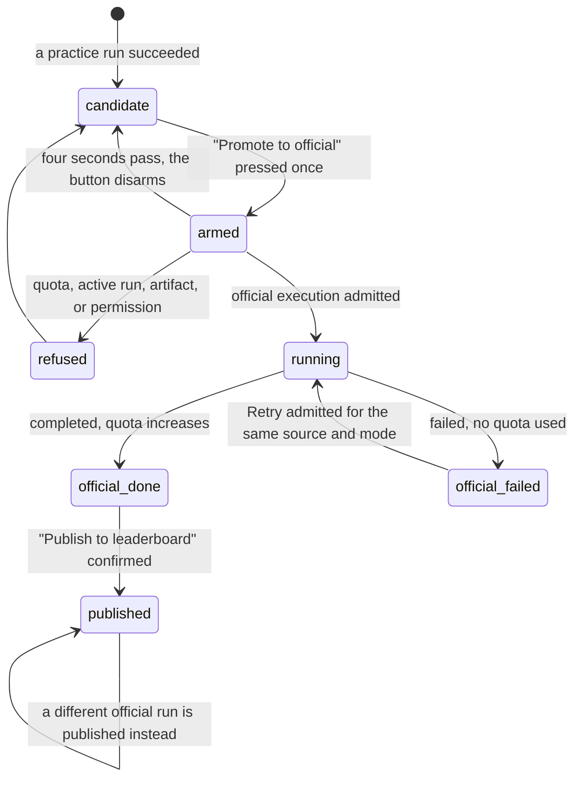

# Promoting a run

## What this document owns

Two acts, on two routes.

**Promotion** starts an official evaluation from a succeeded practice candidate. It reserves official capacity while running and counts against the three-evaluation limit only when completed.

**Publication** makes a succeeded official run the team's single public entry on the leaderboard. It is offered on `/runs/:runId` in the `PUBLISH` panel, it costs nothing, and it can be changed as often as the team likes.

This document owns promotion and publication. [Credit and quota](../cross-cutting/credit-and-quota.md) owns when evaluations count.

[`start-a-practice-run.md`](start-a-practice-run.md) owns the practice run that becomes the candidate. [`watching-a-run.md`](watching-a-run.md) owns the official run while it works, and the console's own layout. [`the-run-page.md`](the-run-page.md) owns everything else on `/runs/:runId`. [`../cross-cutting/credit-and-quota.md`](../cross-cutting/credit-and-quota.md) owns the credit rules in full; this document says only what a student sees.

## Summary

The platform permits ten completed hosted practice evaluations and three completed official evaluations per benchmark version. Failed executions use no quota.

Promotion is the bridge, and it is deliberately not a rerun. The official run copies the practice run's whole record, changes its mode, its attempt number, and its dataset version, and reuses the artifact the practice run already prepared, so the same commit is scored against different inputs rather than built again from scratch (`apps/portal/worker/services/run-actions.ts:368`). Under Modal a missing prepared artifact is a refusal rather than a rebuild: "The prepared hosted artifact is unavailable. Verify the commit again." (`run-actions.ts:361`).

Publication is separate and reversible. A team has exactly one public entry per benchmark version, stored as a single row keyed on team, benchmark, and version, and publishing a different official run overwrites it (`run-actions.ts:437`).

Neither happens automatically. Nothing on the platform promotes a good practice run, and nothing publishes a good official run. Both are explicit acts behind a two-step button.

Promotion starts another evaluation. If it fails, Retry can start another official execution in the same view without repeating practice. Publication selects an existing eligible result and remains free.

## The simple case

A practice run succeeds. The dashboard grows a block under the start controls: a kicker reading `Candidate ready` in verify green, then "RUN 3F82 scored 0.6412 on main · 4f2a91c", and beside it a button reading "Promote to official". Under it, one line: "Runs the same commit against hidden inputs. Logs are suppressed." (`apps/portal/src/routes/DashboardPage.tsx:404`).

The student presses it. The button does not fire; it re-labels itself "Confirm, uses attempt 1 of 3" and waits. Pressing again promotes; waiting four seconds disarms it, so "an abandoned first click can't fire later" (`apps/portal/src/components/ConfirmButton.tsx:6`).

The server checks current repository write access, candidate eligibility, recorded repository identity, active execution and official capacity. It requires a prepared artifact reference and admits the official execution before dispatch. A reference alone does not prove that Modal can still restore the snapshot.

The run page also names the saved commit and hidden official inputs before confirmation, with the remaining official capacity beside it. Its legacy wording and punctuation differ from the dashboard; final copy is part of the pending browser integration.

When that official run succeeds, its page offers publication as the team's public result and explains that switching results is free. A two-step button confirms the selection. After publication, the panel identifies the selected result and links to the leaderboard.

The dashboard's `PUBLISHED RESULT` panel then shows the number at 4xl in serif, its label, `· attempt #1 · 4f2a91c`, and two links, `View run` and `Leaderboard`. Before that it reads "Nothing published yet. Promote a successful practice run, then select the official result you want public." (`DashboardPage.tsx:199`).

The console does the same two things from Discord, as buttons in its right-hand column. Both are drawn in detector red rather than the neutral outline the other actions get (`RunConsole.tsx:365`), which is the only place in the platform where the consequential actions are visually separated from the cheap ones.

## The ask, event by event

### Asking

Both acts capture one thing: a run id. Promotion takes the practice run's id, publication takes the official run's id, and neither carries any other choice. There is no note, no label, and no way to promote a commit that is not already a succeeded practice run.

The dashboard and physical run page use two-step confirmation; the console opens a modal. Each confirmation must name the action and its consequence. The legacy labels differed in punctuation and cost wording, which the pending browser integration must recheck.

Publication's confirm label is "Confirm, make this the public result" (`apps/portal/src/routes/RunDetailPage.tsx:340`), and the console's is "Publish 4f2a91c to the public leaderboard?".

Neither act captures who pressed it in anything the team can read. The run records `createdByUserId` on its surface, which the console prints as `@login`, and that is the whole of the attribution. `RUN LOG` shows an official run with an attempt number and no author.

### Answered without work

Promotion refuses when current permission, candidate eligibility, repository identity, benchmark version, prepared artifact reference or capacity is unavailable. The server returns the reason.

A succeeded hosted practice candidate is required. Another active execution blocks admission, and three completed official evaluations exhaust the version's quota. A missing prepared artifact reference requires a fresh candidate.

A failed official execution does not require a new practice candidate merely to try again. Use Retry for that failure. Repeated promotion is not the recovery action; the current official execution remains attached to the same view.

Publication has two: "Only a succeeded official run can be published." (`run-actions.ts:426`) and "Run not found.". It also runs the same live GitHub write-access check that promotion does (`run-actions.ts:416`), so the three permission sentences apply to it as well.

When the client cannot read a reason it substitutes one: "The promotion couldn't be started. Try again." on the run page (`RunDetailPage.tsx:308`), and "That action could not be completed." on the console (`apps/portal/src/routes/RunSurfacePage.tsx:56`).

The run page's placement of that message has its own history. It used to sit in the failure block, which renders only when `run.failure` is set, while promotion is offered only for a run that succeeded: "the two never rendered together, so a refused promotion showed a button that stopped spinning and nothing else" (`RunDetailPage.tsx:299`). It now sits directly under the button that failed.

Two exhausted-quota states are not refusals but absences. On the run page, once the quota has loaded and is spent, the button is disabled and a sentence appears: "All official attempts are used for this benchmark version. Your existing successful official runs can still be selected for the leaderboard." (`RunDetailPage.tsx:294`). On the dashboard the button is disabled and the line under it reads only "All official attempts are used." (`DashboardPage.tsx:403`), which says less and does not mention the way forward.

### The work begins

Promotion admits an official execution and reserves capacity until it ends. It does not spend quota at admission or on entering evaluation. A failed dispatch leaves a failed historical record and uses no quota.

> Technical note: the guarded run insertion and its phase records share a transaction. No runtime attempt-claim allocation remains. See `apps/portal/worker/services/run-actions.ts`.

For publication, the moment is an upsert into `leaderboardSelections` keyed on team, benchmark, and version (`run-actions.ts:428`). There is nothing to undo, because the next publication overwrites the same row.

Both acts publish the run surface as their last step (`run-actions.ts:411` and `:445`), which is what moves the console's stage strip and the Discord message. That happens after the durable writes, so a surface publish that failed would leave the promotion done and the console briefly stale.

### While it works

Promotion is one request and then a run. The button shows its busy state; the dashboard and the run queries are invalidated on success (`apps/portal/src/lib/queries.ts:439`). From there the official run is watched exactly like a practice run, with two differences: its log is never written, and the live line reads "Hidden evaluation; logs are suppressed." See [`watching-a-run.md`](watching-a-run.md).

Publication is one request with no run behind it. It invalidates the dashboard, the run, and the leaderboard (`queries.ts:455`), so the change is visible on all three by the time the button stops spinning.

### How it ends

A completed official evaluation counts once, including a valid low or partial result. A failed official execution uses no quota and stays failed. Signed late findings may be retained as history, but cannot make that failure publishable.

Retry keeps the same view, source, configuration and mode. It starts a distinct execution and leaves the old failure in history. Current access and saved inputs must still be valid. To run changed code, create a new candidate.

A published run ends by changing what every other team sees. The leaderboard entry carries the team name, the commit, the primary metric, the supporting metrics, and the completion time, and never a person's name or a per-person number. See [`the-leaderboard.md`](the-leaderboard.md).

Nothing announces a publication to the cohort. The entry appears on the leaderboard the next time anyone loads it, the team's own dashboard panel turns green, and no message is posted anywhere.

## Modifiers

The act is the same everywhere; what changes is the wording, the confirmation style, and how much the surface knows before it offers the button.

| Modifier | Set before the ask | Changed while it works |
| --- | --- | --- |
| Who you are | Both acts require current GitHub write access on the connected repository, checked live on every call (`run-actions.ts:79`, `run-actions.ts:416`), with the same three sentences as starting a run. The browser applies no role check, so every team member sees both buttons. There is no instructor override and no approval step: any member can spend the team's scarce attempts alone. | No effect within the request. A permission removed on GitHub a moment later does not reach the answer in flight. |
| Where your team and repository stand | Promotion requires the repository identity recorded by the practice candidate to match the connected repository. Retry also rechecks current access and exact saved source. | An admitted execution retains its recorded source; later requests recheck eligibility. |
| Which week's benchmark | Attempts are counted per team, per benchmark, and per benchmark version (`apps/portal/worker/routes/dashboard.ts:53`), so three attempts on Week 1 and three on Week 2 are separate budgets. Publication is per benchmark version too, so a team has one public entry per version rather than one overall. | A version bump between reading the page and pressing the button is refused with "That benchmark version is not active." (`run-actions.ts:119`). |
| Practice or leaderboard | This is the modifier. Promotion is the only path from one to the other, and it is one-way: an official run cannot be demoted, and a practice run can never appear on the leaderboard. The dataset changes with it, from `practice-v1` to the benchmark's own official dataset version (`run-actions.ts:382`). | The mode of a run never changes. Promoting creates a second run; the practice run stays exactly as it was, on its own page, still readable. |
| Flags, options, and where you are typing | Three surfaces offer promotion and they differ only in wording and confirmation style: the dashboard arms in place, the run page also arms in place, and the console opens a modal. Publication is offered on the run page and the console, and never on the dashboard, whose `PUBLISHED RESULT` panel is read-only. | No effect. |

## Cancel and interrupt

Dismissing an armed confirmation starts nothing. Once admitted, the execution survives closing the page.

| Event | Before the work begins | While it works |
| --- | --- | --- |
| You stop it yourself | An armed button disarms itself after four seconds and can be left alone (`ConfirmButton.tsx:39`). The console's modal closes on `Close`, Escape, or a backdrop click. Nothing is recorded either way. | There is no cancel once the request is sent, and no way to stop an official run afterwards. `cancelled` exists in the enums and is written by nothing. |
| You do something else mid-way | Leaving an armed button starts nothing. | The admitted execution continues. Only a completed evaluation adds to used quota. |
| A teammate acts at the same time | A previously displayed action may be stale. | The server permits one initial official execution on the view and one Retry successor per failed execution. Replaying a Retry request does not choose a newer failure. |
| The network or the portal fails | An unsent request starts nothing. | A lost response can hide an admitted execution. Reload the view to read its current state; the original Retry target is safe to replay. |
| The page or the process goes away | Reloading loses an armed confirmation. | The execution remains recorded independently of the browser. Failure uses no quota. |
| The thing being measured changes | The candidate is a run, and a run is about a fixed commit. A push does not invalidate a candidate; it just means the candidate is no longer the newest code, and nothing on the page says so. | A benchmark version bump does not disturb a running official run. It does reset the quota for the new version and orphan the old version's public entry. |
| The platform refuses or credit runs out | The server refuses admission at the completed-evaluation limit or while another execution is active. | Completion counts once; failure does not count. |

## Interactions with other systems

**Who may do this.** Any team member with current GitHub write access. There is no second signature, no instructor approval, and no per-person allowance. One member can spend all three attempts in an afternoon and nothing warns the others.

**The team owns it.** The attempt, the official run, and the public entry are all the team's. The leaderboard entry carries the team name and never a person's, which is the platform's hardest rule.

**Credit.** Three completed official evaluations per team and benchmark version. Low and valid partial results count; failed executions do not. See [credit and quota](../cross-cutting/credit-and-quota.md).

**What the portal claims.** An official number is a hosted measurement against inputs the team never sees, which is why it is the only kind that may be public. A self-reported local report can never be promoted, and the dashboard's panel says so in its aside: `SELF-REPORTED · NOT PROMOTABLE` (`DashboardPage.tsx:208`). See [`../foundations/what-the-portal-claims.md`](../foundations/what-the-portal-claims.md).

**What the benchmark supplied.** The official dataset version is the benchmark's, and it is recorded on the run rather than inferred. The metric labels, precisions, and help text on the leaderboard entry are the benchmark's too.

**Live updates and reconnection.** A promotion publishes the run surface immediately (`run-actions.ts:411`), so the console and the Discord message both move to the `Official` stage within one tick. Publication publishes the surface as well (`run-actions.ts:445`). See [`watching-a-run.md`](watching-a-run.md).

**Discord.** Both acts can be performed from the console reached through Discord, and both update the team's channel message. The bot's own reply after a promotion links to the surface, not to the run page.

**Configuration.** The official limit remains three. There is no refund cap.

## Edge cases

- **The run page can offer a promotion it knows will fail.** The button is disabled by `!!quota && quota.officialUsed >= quota.officialLimit` (`RunDetailPage.tsx:280`), and the quota comes from a query that is enabled only once the run record has arrived. On first load the quota is undefined, so the guard is false, the button is enabled, and a click on an exhausted team is refused by the server. The same expression makes the legacy confirm label name attempt one for a team that has used two.
- **The legacy confirm labels disagree in punctuation.** The earlier source used a comma on the dashboard and an em dash on the run page. The latter violates `docs/design/voice.md`; final copy still needs browser verification.
- **The legacy publish blurb also used an em dash.** This was a separate voice violation in `RunDetailPage.tsx:334`, not a quota rule. Recheck the integrated copy.
- **Recovery targets the failed execution.** Retry preserves its source and mode. A later failure needs its own Retry request rather than a replay of the older request.
- **The dashboard promotes the newest succeeded practice run, not the best one.** `latestCandidate` is the first succeeded practice run in a list ordered by creation time descending (`dashboard.ts:99`), so a team whose newest practice run scored worse than an earlier one is offered the worse number by default. The run page is the only way to promote a specific run.
- **Publication is not offered on the dashboard.** `PUBLISHED RESULT` shows the current entry and links to it, and the only control that changes it is on an official run's own page.
- **Switching the public entry is free and silent.** The upsert overwrites the previous selection with no confirmation beyond the button's own arm, no record of what was public before, and no notice to the rest of the team.
- **A published run's page says so and offers no way to unpublish.** The panel becomes `PUBLISHED` and reads "This result is your team's public entry."; there is no control to withdraw it, only to publish a different official run.
- **Promotion inherits the parent's whole row.** The official run is written as `{...parent}` with a handful of fields overridden (`run-actions.ts:368`), so anything on the practice run that is not explicitly reset travels with it.
- **An offered action cannot bypass quota.** Admission checks capacity before dispatch. The earlier console offered promotion even when capacity was exhausted; its final action list and confirmation still need integrated browser verification.
- **Promotion is refused while a practice run is in flight,** including one started by a teammate seconds earlier, because official and practice share the same one-at-a-time lock.
- **Official numbering follows completed evaluations.** Failed executions can share the next attempt number; their physical records remain distinct.
- **The practice run keeps its own page and its own log** after promotion. The official run's page is where the hidden-split number lives; the practice page is where the log for that same commit lives, and nothing on either links to the other.
- **`PUBLISHED RESULT` shows the metric at a fixed precision from the metric itself** and never the supporting numbers, so the dashboard's public figure and the leaderboard row can look different at a glance while describing the same run.
- **The candidate block disappears while a run is active,** because the whole `START A RUN` panel is replaced by `CURRENT RUN`. A team watching an official run cannot see or reach the promote control for a different candidate until it finishes.
- **A team can publish an official run from an older benchmark version and keep it,** because selections are keyed by version. The dashboard only ever shows the selection for the version it is currently displaying, so an entry for an older version becomes invisible from the team's own dashboard.

## Open questions and verification

- `RunDetailPage` enables the promote button while the quota query is in flight (`RunDetailPage.tsx:280`), so a first click on an exhausted team is answered by the server rather than by the disabled state, and the confirm label can name the wrong attempt number. Worth treating as a bug. **Unverified.**
- The run page's confirm label contains an em dash, and so does the publish blurb (`RunDetailPage.tsx:277`, `:334`). Both violate `docs/design/voice.md`. The dashboard's equivalent label uses a comma. Carried to triage.
- The dashboard's exhausted line, "All official attempts are used.", omits the sentence the run page adds about existing official runs still being selectable. Whether that is deliberate brevity or an oversight was not established.
- Promoting the newest rather than the best candidate is a product decision the code does not explain. Worth confirming it is intended.
- Same-view Retry presentation and the link from a physical execution's historical page are being integrated by the portal owner. They are not accepted browser behavior at this local source checkpoint.

- Nothing warns a team that one member is about to spend a shared official attempt, and nothing records who spent it in a place the team can read. Whether that matters was not established.
- Final console confirmation wording remains subject to the portal owner's integration and the separate browser verification pass.

- A refresh failure after admission can leave the browser briefly stale without undoing the execution. Reopening the view must show its current execution. Assembled browser behavior remains unverified.

Verified against Cog\*Portal commit `a0e8eac` for recovery policy; unchanged layout references remain from the earlier draft. Browser integration remains unverified.
