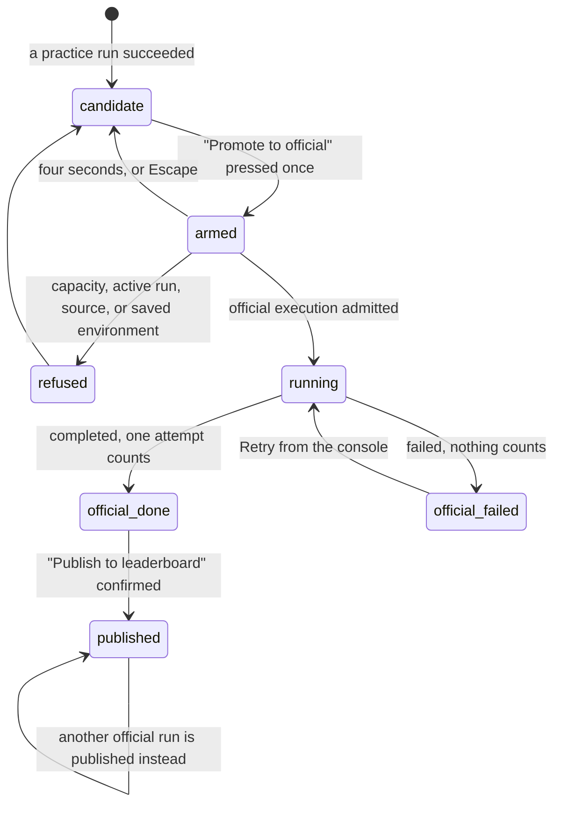

# Promoting a run

## Summary

Two acts take a team's work from practice to public.

**Promotion** starts an official execution of a succeeded practice run's commit against hidden inputs. It is offered once per practice run, it reserves official capacity while it runs, and it counts as one of three official attempts per benchmark version only if it completes.

**Publication** makes a succeeded official run the team's one public entry on that benchmark version's leaderboard. It starts nothing, costs nothing, and can be moved to another official run whenever the team likes.

This document owns both acts. [`start-a-practice-run.md`](start-a-practice-run.md) owns the practice run, [`watching-a-run.md`](watching-a-run.md) owns the official run while it works, [`the-run-page.md`](the-run-page.md) owns the rest of `/runs/:runId`, and [credit and quota](../cross-cutting/credit-and-quota.md) owns when an attempt counts.

Promotion is reached from the Runs page (`/dashboard`), from a practice run's page, from its console, and from Discord. Publication is reached from an official run's page, its console, and Discord; the Runs page only shows the result once it is public.

## The simple case

A practice run succeeds. On the Runs page its lead card grows a block labeled "Ready to promote" with the sentence "Promoting scores this same commit once against the hidden set, with its logs kept back. It would use official attempt {n} of 3." (`apps/portal/src/routes/DashboardPage.tsx:521`) and a button, "Promote to official". When the candidate is not the latest run, the same block stands on its own with a margin note: "There's no undo once an official attempt starts, so it's worth reading what the practice run found first." (`:316`).

The student presses the button. It does not fire; it re-labels itself "Confirm, uses attempt {n} of 3" (`:560`) and a thin line drains along its bottom edge for four seconds. A second press promotes; Escape or waiting disarms it, so "an abandoned first click can't fire later" (`apps/portal/src/components/ConfirmButton.tsx:12`).

The server admits an official execution and the Runs page shows it as "Running now" with "logs kept back". When it succeeds, its own page offers a "Publish" section: "You can switch to another successful official run at any time, at no cost." and a button "Publish to leaderboard" that arms to "Confirm, make this the public result" (`apps/portal/src/routes/RunDetailPage.tsx:722`, `:728`, `:729`). After publishing, the section is titled "Published" and reads "This result is your team's public entry. See it on the leaderboard." (`:709`, `:711`). Observed locally on fixture data in `/tmp/cogshots/matched/pairs/b-run-official-desk.png`.

The Runs page then says "It's your team's result on the leaderboard." under that run (`DashboardPage.tsx:454`), links "See the leaderboard", and lists it under "On the leaderboard" in the reference facts with "Open the run" and "Leaderboard" links (`:858`). Observed locally in `pairs/b-dashboard-desk.png`.

## The ask, event by event

```mermaid
stateDiagram-v2
    [*] --> candidate : a practice run succeeded
    candidate --> armed : "Promote to official" pressed once
    armed --> candidate : four seconds, or Escape
    armed --> refused : capacity, active run, source, or saved environment
    armed --> running : official execution admitted
    running --> official_done : completed, one attempt counts
    running --> official_failed : failed, nothing counts
    official_failed --> running : Retry from the console
    official_done --> published : "Publish to leaderboard" confirmed
    published --> published : another official run is published instead
    refused --> candidate
```

### Asking

Both acts carry one thing: a run id. Promotion takes a practice run's id; publication takes an official run's id. There is no note, no label, and no way to promote a commit that is not already a succeeded hosted practice run.

The Runs page offers only the newest succeeded practice run that has a primary metric (`DashboardPage.tsx:179`, `apps/portal/worker/routes/dashboard.ts:77`). Any other practice run is promoted from its own page.

The confirmations name the cost before the second press:

- Runs page and run page: "Confirm, uses attempt {n} of 3" (`DashboardPage.tsx:560`, `RunDetailPage.tsx:647`).
- Console: a dialog headed "Promote to official" with "Use official attempt {n} of 3 for {benchmark} at {sha7}?" and a button "Use attempt {n} of 3" (`apps/portal/src/components/RunConsole.tsx:274`, `:292`).
- Discord: "Use an official attempt?" with "This scores the same commit on the hidden set and spends one official attempt. It reuses the environment this run already built, so nothing reinstalls." (`apps/discord-bot/src/commands.ts:558`, `:559`).
- Publication on the console: "Publish {sha7} to the public leaderboard?" (`RunConsole.tsx:276`); in Discord: "This becomes the team's public leaderboard entry. You can replace it later with another official result." (`commands.ts:568`).

The number is the next completed attempt. Every confirmation says the attempt is used; only the run page's margin note says a failure doesn't use one: "Official attempts are shared by the whole team, 3 per benchmark version, and an attempt that fails doesn't use one up." (`RunDetailPage.tsx:611`).

### Answered without work

The pages hide the control and say why when the server would refuse:

- **Already promoted.** A practice run is promoted once (`apps/portal/worker/db/schema.ts:412`). Its page reads "This run was promoted to official attempt #{n}, which reruns {sha7} against the hidden inputs." with "Open attempt #{n}" (`RunDetailPage.tsx:631`, `:758`); the Runs page labels it "Promoted" with "A run is promoted once, so the next official attempt starts from a new practice run." (`DashboardPage.tsx:518`). Promoting again returns that attempt and spends nothing (`apps/portal/worker/services/run-actions.ts:167`). Observed locally in `pairs/b-run-success-desk.png`.
- **The promoted attempt failed.** The label becomes "Can't be promoted" with "That official attempt already ran and failed. Start a new practice run to create the next candidate to promote." (`apps/portal/worker/services/run-eligibility.ts:115`), and a link to the failed attempt. That attempt can be retried from its console, which the sentence does not mention.
- **A run from before consoles existed.** "This run is from before runs had a console, so it can't be promoted. Start a new practice run to create a candidate." (`run-eligibility.ts:105`).
- **A run from another repository.** The source refusal replaces the control.
- **A saved environment that cannot be reused.** One of "The saved environment can't be matched to the connected repository.", "The saved environment doesn't match this run's source and artifact.", or "The saved environment isn't compatible with this benchmark's current execution contract." (`run-eligibility.ts:35`, `:53`, `:59`), among others. Promotion never rebuilds; a missing environment means a new practice run.
- **No attempts left.** The Runs page disables the button and says "All 3 official attempts on this version are used." (`DashboardPage.tsx:520`). The run page disables it and says "All official attempts are used for this benchmark version. Your existing successful official runs can still be selected for the leaderboard." (`RunDetailPage.tsx:665`). The run page also keeps the button disabled until the quota has loaded (`:655`).

The server makes the same checks in order: current GitHub write access, the run is a succeeded practice run ("Only a succeeded hosted run can be promoted.", `run-actions.ts:402`), its source, an existing promotion, an active benchmark version ("That benchmark version is not active.", `:158`), the saved environment, no active run, and capacity ("The official-attempt quota is exhausted.", `:421`). A refusal appears under the button pressed (`DashboardPage.tsx:570`, `RunDetailPage.tsx:677`); when the reason cannot be read, the run page says "The promotion couldn't be started. Try again." and the console says "That action could not be completed." (`apps/portal/src/routes/RunSurfacePage.tsx:66`).

Publication refuses with "Only a succeeded official run can be published." (`run-actions.ts:488`), "This attempt was refunded, so its findings can't be published. Choose another official run." (`:487`), the source refusal, and "This run used different scoring rules and can't appear in the current ranking." (`:502`) when the benchmark's scorer version has moved since the run. The run page shows publication errors under its button, or "The result couldn't be published. Try again." (`RunDetailPage.tsx:737`).

### The work begins

**Promotion.** The official run is written as a copy of the practice run with its mode, status, dataset, scorer and runtime versions replaced, its log cleared, and its saved environment kept (`run-actions.ts:429`). The insert re-counts completed and active official runs itself, so two teammates cannot both take the last attempt (`apps/portal/worker/services/run-accounting.ts:90`). Its phase rows go in the same batch. Nothing is spent yet.

**Publication.** One upsert into the selections table keyed on team, benchmark and version (`run-actions.ts:505`). There is nothing to undo; the next publication overwrites it.

Both acts then republish the affected consoles, which moves the console's stage strip and the team's Discord message (`run-actions.ts:470`, `:530`).

### While it works

Promotion is one request and then a run. The run page sends the student to the new official run's page (`RunDetailPage.tsx:651`); the Runs page stays and shows the official run as its live lead card. The official run is watched like a practice run, with "Hidden evaluation; logs are suppressed." in place of the polling note (`RunDetailPage.tsx:277`).

Publication is one request. It refreshes the Runs page, run pages and single-benchmark leaderboards (`apps/portal/src/lib/queries.ts:507`), but not the Vision Overall board, which can show the previous selection for up to 30 seconds in the same tab.

### How it ends

A completed official run counts once, whatever it scored. A failed one counts nothing and stays failed; its page says "A failed official attempt doesn't use up one of your team's attempts." (`RunDetailPage.tsx:196`). Retry on its console starts another official execution of the same commit and saved environment without a new practice run ([the run](../foundations/the-run.md#retry)).

A published run changes what everyone sees on the leaderboard: the team name, its description, the primary metric, the supporting metrics, the commit and completion time, never a person ([the leaderboard](the-leaderboard.md)). Nothing announces it to the cohort.

## Modifiers

| Modifier | Set before the ask | Changed while it works |
| --- | --- | --- |
| Who you are | Both acts need current GitHub write access, checked live (`run-actions.ts:118`), except on the development fixture repository, which skips the check (`:122`). Every team member sees the controls. There is no approval step: any member can spend the team's attempts alone. | No effect within the request. |
| Where your team and repository stand | A run from a repository the team has left is refused by source, and its page says so instead of offering the control. Promotion also needs the saved environment to match the connected repository's id. | An admitted official run keeps its recorded source. |
| Which week's benchmark | Attempts and publication are per benchmark and version, so Recognition, Clustering, Language and Audio each have three attempts and one public entry. Vision Overall is computed from the Recognition and Clustering entries ([the leaderboard](the-leaderboard.md#what-the-overall-standings-actually-require)). | A version deactivated between reading and pressing is refused with "That benchmark version is not active." |
| Practice or leaderboard | Promotion is the only path from practice to official, and it is one-way. The dataset changes from `practice-v1` to the benchmark's official version. A self-reported local report can never be promoted; the Runs page labels those "Self-reported, not promotable" (`DashboardPage.tsx:284`). | The practice run is unchanged and keeps its page and log. |
| Flags, options, and where you are typing | Runs page and run page arm a button in place; the console and Discord open a confirmation. The console offers promotion without checking capacity and says "Use an official attempt" when none is left (`RunConsole.tsx:291`); the server refuses. | No effect. |

## Cancel and interrupt

| Event | Before the work begins | While it works |
| --- | --- | --- |
| You stop it yourself | An armed button disarms after four seconds or on Escape (`ConfirmButton.tsx:71`, `:83`). The console dialog closes on "Close", Escape or a backdrop click (`RunConsole.tsx:576`). Nothing is recorded. | There is no cancel. An official run cannot be stopped once admitted. |
| You do something else mid-way | Leaving an armed button starts nothing. | The official run continues; only completion counts. |
| A teammate acts at the same time | A teammate's run makes promotion refuse with `active_run_exists`. Two promotions of one practice run return the same attempt. Two promotions of different runs race at the insert; one wins the last attempt. | A teammate publishing a different official run replaces the selection; the last write wins and nothing tells the other. |
| The network or the portal fails | An unsent request starts nothing. | A lost response can hide an admitted run. Reloading shows it as the active run; pressing promote again returns it. |
| The page or the process goes away | Reloading loses an armed confirmation. | The official run is recorded independently of the browser. |
| The thing being measured changes | A push does not invalidate a candidate; the candidate is a commit. Nothing says it is no longer the newest code. | A version change does not stop the official run. Selections stay keyed to their version, and a scorer-version change hides older selections from the board. |
| The platform refuses or credit runs out | Admission refuses at three completed (plus active) official runs, or while another run is active. | Completion counts once; failure does not count. |

## Interactions with other systems

**Who may do this.** Any team member with current GitHub write access, or any member of a team on the development fixture repository, which skips the check. No second signature and no per-person allowance.

**The team owns it.** The attempt, the official run and the public entry are the team's. The console records who started the console; the leaderboard names no person.

**Credit.** Three completed official evaluations per team, benchmark and version. Publication is free. See [credit and quota](../cross-cutting/credit-and-quota.md).

**What the portal claims.** An official number is a hosted measurement on inputs the team never sees, which is why only it may be public. The run page and Runs page call a selected run public; the leaderboard decides separately whether to show it (edge cases below).

**What the benchmark supplied.** The official dataset version is recorded on the run. The metric labels and precisions shown on the leaderboard are the benchmark's.

**Live updates and reconnection.** Both acts republish the console, so the console and the Discord message move within one update. The run page and Runs page refresh their own queries on success.

**Discord.** Both acts are available from Discord's run actions and from the Activity, through the same server action. See [`../discord/commands.md`](../discord/commands.md).

**Configuration.** The official limit is `OFFICIAL_LIMIT = 3` (`packages/contracts/src/schema.ts:1520`). The portal reads it; the Discord bot writes "of 3" itself ([B-35](../bug-triage.md)).

## Edge cases

- **The Runs page offers the newest candidate, not the best.** It also skips a succeeded practice run with no primary metric (`DashboardPage.tsx:179`), so such a run is promotable only from its own page.
- **A refused attempt points at the costlier path.** After a failed official attempt, both pages say to start a new practice run, while Retry on the attempt's console would try the same commit again for nothing.
- **The run page reads the active version's quota.** Its quota comes from the Runs page payload for the run's benchmark id, which is the highest active version (`RunDetailPage.tsx:70`, `dashboard.ts:37`). For a run on an older version the label names the wrong attempt and the server refuses with "That benchmark version is not active."; for a benchmark with no active version the payload fails and the button stays disabled with no sentence.
- **"Published" can be false on the board.** The run page's "Published" and the Runs page's "On the leaderboard" read the selection row (`apps/portal/worker/http/serializers.ts:229`, `dashboard.ts:110`). The leaderboard additionally drops a selection whose scorer version is no longer the catalog's (`apps/portal/worker/services/leaderboard.ts:58`) or whose run has no primary metric (`:79`). Migration `0044_week2_recognition_v2.sql` moved Recognition's scorer within version 2, which hid every earlier Recognition selection while the teams' own pages still said it was public, and their spent attempts stayed spent.
- **A Week 3 run that withheld its overall ranks by `text_mrr`.** The run's primary becomes `text_mrr` (`apps/runner-modal/src/cogworks_runner/modal_app.py:2051`); it can be promoted and published, and the board sorts every entry by its own primary value without checking the key ([the leaderboard](the-leaderboard.md#edge-cases)).
- **Publication is not on the Runs page.** It shows the public result and links to it; only an official run's page, console or Discord can change it.
- **Switching the public entry is silent.** The upsert overwrites with no record of what was public before and no notice to teammates. There is no unpublish, only publishing another run.
- **Promotion copies the parent row.** Anything not explicitly reset travels with it (`run-actions.ts:430`).
- **The practice and official runs link to each other.** The official run's readings note names "the practice run this attempt was promoted from" with a link (`RunDetailPage.tsx:552`); the practice run links to its attempt.

## Open questions and verification

- The failed-attempt refusal tells the student to start a new practice run instead of retrying the attempt (`run-eligibility.ts:115`). Carried to triage.
- The console and Discord offer promotion with no attempts left and let the server refuse (`apps/portal/worker/services/run-surfaces.ts:353`). Carried to triage.
- A selection hidden by a scorer-version change, or with no primary metric, is still called public on the team's own pages. Carried to triage.
- Every confirmation says an attempt is used without saying a failure costs nothing. Whether that is acceptable shorthand is a copy decision.
- Nothing warns teammates before one member spends a shared attempt, and nothing the team reads records who did.
- No promotion or publication was observed on a hosted build. The fixture screenshots show the promoted and published states, not the transitions.
- Hosted beta (`4984730`) differs: the server path is the same, the pages are not. Beta's Runs page shows a "PUBLISHED RESULT" panel and a "Candidate ready" label and says "All official attempts are used." (beta `apps/portal/src/routes/DashboardPage.tsx:222`, `:536`, `:583`) where the candidate uses "On the leaderboard", "Ready to promote" and "All 3 official attempts on this version are used." (`DashboardPage.tsx:858`, `:514`, `:520`). Beta's console confirmation hardcodes "of 3" and shows an em dash when no attempt is left (beta `apps/portal/src/components/RunConsole.tsx:271`); the candidate reads `OFFICIAL_LIMIT` and says "an official attempt" (`RunConsole.tsx:274`).

Read against Cog\*Portal commit `2ff32fa`. Local fixture observations are named where used.
