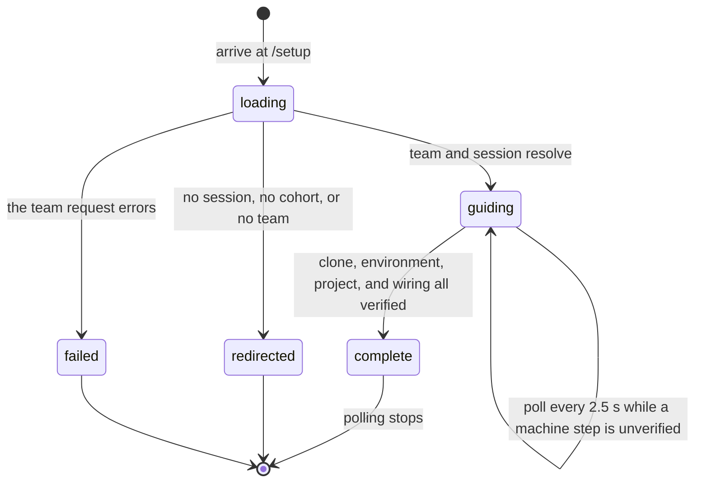

# The setup guide

## Summary

The setup guide takes a student from "the portal knows my team" to "my machine can run the benchmark". It is a list of six numbered milestones plus one unnumbered aside, each with a copyable command, and it colors itself in from evidence rather than from ticked boxes. Four of the six are marked done only when the `cogworks` CLI reports them from inside the team's own worktree. One is true the moment a team exists. One is a checkbox the student ticks, because nothing can observe whether they meant to work alone.

It lives at `/setup` behind `RequireStage stage="team"`, so a visitor with no session goes to `/signin`, one with no cohort to `/join`, and one with no team to `/connect`, all with `replace` (`apps/portal/src/App.tsx:122`, `:69`). It is the last stop of the onboarding chain and the only page whose main content is commands meant to be typed somewhere else.

The page has one job the rest of the portal does not: it says, per step, how strongly the portal believes the step is done. Four different words carry four different strengths of claim, and that distinction is the point of the screen.

It is also the one page in the product that spans two surfaces at once. The steps are printed in a browser and completed in a terminal, and the only thing joining them is one HTTP call the student makes on purpose, by adding `--update-setup` to a command they were going to run anyway. Everything odd about the page follows from that split: the silence while it waits, the four steps arriving together, and the fact that a failure is reported in the terminal and never here.

## The simple case

A student finishes connecting a repository and lands here. The header reads "Getting set up · 2 of 6" (`apps/portal/src/routes/SetupPage.tsx:158`) and the heading reads "Your team has a home." if they created the team, or "You're on {team name}." if they joined one (`:162`). Under it, a paragraph explains the coloring rule: "Work top to bottom in your terminal. Steps turn green on their own when the check in the last step runs, and it colors everything it can verify at once. The one box you tick yourself is the solo one below, because nothing can verify that you meant to work alone. Grey steps after you have done them are normal until then." (`:175`).

They copy four commands into a terminal, in order: `git clone` plus `cd`, a `pip install --upgrade` of `cogworks-benchmark`, two project installs, and finally `cogworks check --benchmark {id} --update-setup`. Between the fifth step and the last sits an unnumbered one, "Link this machine", carrying `cogworks link --portal {origin}`. It has to happen before the check, because the check's portal call needs a device token, and it is not numbered because linking is not a milestone the guide counts.

Nothing on the page changes while they work. When the check passes and its portal call lands, the page repaints within two and a half seconds: four grey circles become green ticks, the counter reaches "6 of 6", and a panel headed "SETUP COMPLETE" replaces the footer with a link to the dashboard (`:354`). The terminal, meanwhile, has printed one line naming what it sent: `setup: updated clone, environment, project, wiring` (`python/cogbench/src/cogbench/cli.py:158`).

If they stop halfway and close the tab, the footer says "No rush. The guide keeps your place." (`:370`). Nothing is lost, because nothing on this page was holding the progress: the four machine steps live in the portal's database, written by the CLI.

## What each step says

The steps are fixed. Their titles, commands, and warnings are the product, so they are quoted here in full order. The left rail repeats the same sequence as one-word labels under the kicker "Field notes" (`SetupPage.tsx:413`).

**01, "The team project."** Always `portal verified`, because the team cannot exist without it. The body links the repository by full name and says "is the shared source of truth. Hosted attempts always run from this repository, never from an uncommitted laptop folder." (`:198`). Rail label: Team.

**02, "Bring your teammates" or "Know your team."** The title depends on the entry mode. A creator reads "Add collaborators in GitHub first, then add them from Team settings. For group work, keep at least two organization owners so one locked account cannot strand the team." (`:219`). Someone who joined reads "Your teammates share this repository and its attempts. Ask the team creator for GitHub write access before you clone." (`:228`). Only the creator's version can be unfinished, and only the creator's version offers the checkbox. Rail label: People.

**03, "Clone the starter."** One block, two lines: `git clone {repo url}.git` then `cd {repo name}` (`:237`). Rail label: Clone.

**04, "Install the CogWorks tool."** Body: "Activate the course environment your instructor provided, then install the lightweight CLI from the TestPyPI pilot channel." (`:245`). One `pip install --upgrade --index-url https://test.pypi.org/simple/ --no-deps cogworks-benchmark` (`:261`), then two notes. The first: "The package is named `cogworks-benchmark`; the command it installs is `cogworks`. Those names intentionally differ." (`:263`). The second names the failure a mixed conda and Windows cohort actually hits, and a comment says why it is here rather than in the CLI's own error text: it "happens before the CLI exists, so the CLI's own error messages never get to help" (`:268`). The note reads "If your terminal says `cogworks: command not found`, the course environment is not active. Activate it and install again, or run `python -m cogbench` in place of `cogworks`." (`:271`). Rail label: Tool.

**05, "Install this project."** Body: "Two installs: the benchmark's pinned dependencies, then your own project in editable mode, so later code changes apply without reinstalling. This is also what registers the entry points the track looks for", followed by the entry-point names of every benchmark sharing the selected track's module (`:280`, `:285`). The block is `python -m pip install -r requirements-cogbench-pilot.txt` then `python -m pip install -e .` (`:300`). The note draws a boundary: "Editable installation means code changes take effect without reinstalling. CogWorks does not create or repair your conda environment." (`:302`). Rail label: Project.

**The unnumbered aside, "Link this machine."** Body: "This visibly online command opens CogPortal for approval, then returns to the terminal. The connection is revocable from Connections." (`:313`), then `cogworks link --portal {origin}` (`:321`), then "Linking never turns on background reporting. Ordinary check, test, run, and report commands still leave CogPortal alone." (`:322`). Rail label: Link, marked with a middot rather than a number.

**06, "Check the wiring."** Body: "`check` verifies Python, the Git remote, installed benchmark package, editable project, and adapter discovery. It does not grade your work or download the large public model/data cache." (`:335`). The block is `cogworks check --benchmark {id} --update-setup` (`:343`). The note names the split failure before it happens: "The flag makes this one run update the guide. If local checks pass but CogPortal is offline, the terminal prints both outcomes, exits 2, and gives the same command to retry." (`:345`). Rail label: Check.

## The ask, event by event

### Asking

Arriving on the route is the ask. Three things are decided before anything renders.

**Which team.** `GET /api/team` supplies the repository name and URL, the member list, and `isAdmin`, which is true when the caller's stored membership role is `admin` (`apps/portal/worker/routes/team.ts:119`). That role is derived from the caller's GitHub permission on the team repository, not from who created the team.

**How the student got here.** The router's `location.state.entry` says `created` or `joined`. `ConnectPage` sets it on both routes out: `joined` when a student joins an existing team from the cohort list (`apps/portal/src/routes/ConnectPage.tsx:219`), and `created` or `joined` depending on whether the chosen repository was already claimed (`:379`). When there is no state, the page falls back to `team.isAdmin ? "created" : "joined"` (`SetupPage.tsx:46`). See [Edge cases](#edge-cases): the fallback is not the same question.

**Which benchmark.** `useTrack()` reads the active benchmark list and the browser's stored preference, and every copy block on the page names whatever it returns (`apps/portal/src/lib/track.ts:86`). The comment above the switcher says why it is on this page at all: "Every command on this page names a benchmark, so the page has to show which one and let a student change it. Without this the default track silently decides what they're told to type." (`SetupPage.tsx:165`).

While `useTeam()` is pending or the session has no user, the whole page is one line: "Loading your team" (`:33`).

### Answered without work

Three ways out before any content renders, all of them free.

- A gate redirect. `RequireStage` sends the student to `/signin`, `/join`, or `/connect` with `replace`, so the back button does not bounce them into the same gate.
- A failed `GET /api/team`. The page renders a `QueryError` card whose wording is chosen by what the student can do about it rather than by which of the error codes arrived (`apps/portal/src/lib/query-error-state.ts:69`).
- A session that has no user. Same loading mark as a pending team, indefinitely.

Nothing is written in any of these cases. The page makes no request that changes anything, ever.

> Technical note: the gate resolves after the session query, not before it, so a student on a slow connection sees "Loading" and then a redirect rather than an immediate bounce. That is the shared behavior of every gated route and is described in [`foundations/the-ask.md`](../foundations/the-ask.md#edge-cases).

### The work begins

There is no such moment on this page.

The setup guide never writes to the portal. It issues three reads (`GET /api/team`, `GET /api/v1/connections`, `GET /api/v1/setup/state`) and renders them. The only durable effect a student can produce from the browser is the self-check box, which is written to `localStorage` under `cog-setup:{teamId}:{login}` and never leaves the machine (`apps/portal/src/lib/setup-progress.ts:9`, `:52`). The key carries the team and the login "so a shared computer doesn't leak progress between students" (`:5`).

The moment that matters for this feature happens in a terminal, not here. `cogworks check --benchmark {id} --update-setup` posts to `/api/v1/cli/setup/checks` and upserts one row per step (`apps/portal/worker/routes/setup.ts:87`). That is when a step stops being free to abandon, and it is described in [`terminal/check.md`](../terminal/check.md). The portal page only watches the result arrive.

The one exception is owner-only and behind a deployment flag: "Reset guide" issues `DELETE /api/v1/setup/state`, which deletes every verification row for that user and team (`setup.ts:116`).

> Technical note: the four steps land together because the CLI batches them, not because the page groups them. `check --update-setup` sends the list `("clone", "environment", "project", "wiring")` in one request, and only after the check itself returned 0 (`cli.py:617`). The server upserts each name and answers with the list it accepted (`setup.ts:85`). There is no partial state on the wire and no way for a student to report one step at a time.

The dev rehearsal bar, when it renders, sits above everything else under the kicker "Dev rehearsal" (`SetupPage.tsx:448`). It holds three mode buttons labelled "Live state", "creator", and "member" (`:449`), and a "Reset guide" control on the right. The first two write `?replay=creator` or `?replay=member` into the query string; "Live state" clears it.

### While it works

`useSetupState()` polls `GET /api/v1/setup/state` every 2.5 seconds and stops when `clone`, `environment`, `project`, and `wiring` are all present (`apps/portal/src/lib/queries.ts:267`, `:265`). The stopping set is deliberately smaller than the server's full list, and the comment says why: "SETUP_STEPS also carries test/run milestones the checklist never shows, so waiting on every step kept a finished page polling forever." (`:261`). `useConnections()` polls every 4 seconds until at least one CLI device exists, then stops (`:120`).

Everything else on the page is inert while it waits. The copy buttons work, the track switcher works, and the self-check toggles. There is no spinner, no "waiting for your terminal" line, and no indication that the page is asking anything. A student who runs the check and watches the browser sees nothing for up to 2.5 seconds and then four steps turn green at once.

Each command block carries its own copy button in the top right, labelled `copy` and changing to `copied` for 1.4 seconds (`apps/portal/src/components/Code.tsx:85`, `:66`). A clipboard write that the browser refuses is swallowed, so the label simply does not change and the block stays selectable. The blocks are syntax highlighted by a highlighter loaded on demand; until it resolves the same text renders as a plain `<pre>`, which means the first paint of the page shows unhighlighted commands that are already correct and already copyable (`Code.tsx:74`).

The header counter carries `aria-live="polite"` (`SetupPage.tsx:157`), so the move from "5 of 6" to "6 of 6" is announced. The steps themselves are not announced; their state is carried by a color and a tick.

Changing the track rewrites the benchmark id inside two copy blocks, the `check` command and the loop block, and rewrites the entry-point names listed in "Install this project" (`SetupPage.tsx:285`, `:343`, `:390`). It does not reset any step: verification is per user and team, not per benchmark.

### How it ends

The page has no end. It stays on screen and stops polling when the four machine steps are verified.

Complete means `done === total` from `setupSteps`, which counts six states: the team existing, the people step, and the four CLI-verified steps (`setup-progress.ts:105`). At six, a panel headed "SETUP COMPLETE" replaces the footer and says "Your machine can find the starter and this track's adapter interfaces. You're ready to begin implementing. A working model isn't expected yet." with an "Open dashboard" button (`SetupPage.tsx:354`). Below it, and at every stage, a panel headed "THE LOOP YOU'LL USE NEXT" prints the `test`, `run`, and `report` commands and the line "Later, omit --update-setup. Practice remains LOCAL · SELF-REPORTED." (`:394`). That line gains " FIRST TEST CHECKED." and " FIRST RUN CHECKED." once those two later milestones arrive (`:395`).

Incomplete shows a rule, the sentence "No rush. The guide keeps your place.", and a quieter dashboard link (`:370`).

The loop panel is the page's handover. It says "Once you have implemented an adapter, `test` runs the smaller public tier and `run` runs the larger practice tier. First-time runs may explicitly download the public cache." (`:382`), then prints three commands in one block: `cogworks test --benchmark {id} --update-setup`, `cogworks run --benchmark {id} --update-setup`, and `cogworks report` (`:390`). It is present whether or not setup is complete, so a student who has not cloned anything can already read what comes next.

The same progress is echoed on the dashboard by a slim nudge reading "Getting set up" and "{done} of {total} steps done", which disappears at completion or when dismissed (`apps/portal/src/components/SetupNudge.tsx:43`, `:57`, `:39`). Dismissal is permanent for that team and login, written to a second `localStorage` key (`setup-progress.ts:13`, `:72`). The nudge shares this page's polling hook, so a dashboard left open also polls the setup endpoint every 2.5 seconds until the four steps land.

## Four words for four claims

Each step can carry one chip, and the four words are not interchangeable.

| Chip | Where it appears | What the portal is claiming |
| --- | --- | --- |
| `portal verified` | The team project step, always. The people step when the team has two or more members (`SetupPage.tsx:188`, `:207`). | The portal saw this in its own records. |
| `CLI checked` | Clone, tool, project, and wiring, when a row exists in `setup_verifications` (`:235`, `:244`, `:279`, `:332`). | A linked device reported it. The portal did not look at the machine. |
| `linked` | The unnumbered link step, when at least one CLI device exists (`:311`). | A device token exists for this account. Not a claim about the directory it was run from. |
| `self checked` | The people step when the student ticked "I'm working solo for now" (`:207`, `:213`). | Nobody checked anything. The student said so. |

The rule that produces those four words is in [`foundations/what-the-portal-claims.md`](../foundations/what-the-portal-claims.md#verified): the portal only says what it observed, and anything on a student's machine is theirs to confirm. The chips are that rule made visible on one screen, and they are the only place in the product where all four strengths sit next to each other.

Two of the four gaps between them are worth stating outright. `CLI checked` is weaker than `portal verified` because the portal never looked at the machine: it received four names from a device it trusts and wrote them down. It does check one thing, the repository the caller says they are standing in, and refuses the whole call when that disagrees with the team's (`setup.ts:74`). Everything else in the payload, the CLI version, the Python version, the installed benchmark and submission ids, is recorded evidence rather than a checked claim. And `linked` is weaker still: it says a device token exists, not that the device is the machine the student is looking at, and a student with two laptops sees `linked` from the other one.

The page states the rule in prose as well, in the paragraph under the heading, which names the single exception before a student can wonder about it: the solo box, "because nothing can verify that you meant to work alone" (`SetupPage.tsx:177`).

The counting rule follows from the same distinction. A browser checkbox cannot advance a machine step: `setupSteps` reads only CLI evidence for clone, environment, project, and wiring, and the comment is explicit ("Ignore legacy browser checkboxes; only CLI evidence counts machine steps.", `setup-progress.ts:103`). A test pins it: ticking all five browser boxes with no terminal evidence still scores `{ done: 2, total: 6 }` (`apps/portal/test/setup-contract.test.ts:40`).

## Modifiers

| Modifier | Set before the ask | Changed while it works |
| --- | --- | --- |
| Who you are | The entry mode decides two things: the heading, and whether the people step is a milestone at all. A creator must either have a teammate or tick "I'm working solo for now"; someone who joined gets that step for free (`setup-progress.ts:107`). An owner on a deployment with `ONBOARDING_DEV_TOOLS=enabled` additionally gets the dev rehearsal bar. An instructor with no team never reaches the page: the gate sends them to `/connect`. | A teammate accepting an invitation flips the people step to `portal verified` on the next `useTeam()` read, which has no poll, so it lands on the next mount or refetch rather than promptly. |
| Where your team and repository stand | The whole page is addressed to one team and one repository. The clone block prints `git clone {repo url}.git` and `cd {repo name}` from the team record (`SetupPage.tsx:237`), and the note under it says "The link/check commands below compare this GitHub remote with your team. A similarly named folder is not enough." (`:239`). No team means no page. | Changing the team's repository from the team page rewrites the clone block on the next read. Existing verification rows are keyed on user and team, not on the repository, so four green ticks survive a repository change and now describe a directory the student no longer has. |
| Which week's benchmark | The track switcher picks it, defaulting to the newest active module (`track.ts:80`). It changes the `check` command, the loop commands, and the entry-point names in step 5. It does not change any step's state, because verification is not per benchmark. | Switching mid-guide rewrites the commands under the student's cursor with no warning. A student who copied the old command and has not run it yet gets no indication that the page now says something else. |
| Practice or leaderboard | No effect. Neither appears. The page is about the machine, and the closest it gets is the loop panel's reminder that practice stays `LOCAL · SELF-REPORTED` (`:394`). | No effect. |
| Flags, options, and where you are typing | `?replay=creator` and `?replay=member` rehearse the two entry modes with empty state, and are honored only for an owner on a dev-tools deployment (`:80`). Every other query parameter is ignored. There is no print view and no way to get the commands as plain text other than the per-block copy buttons. | Pressing a rehearsal button rewrites the query string with `replace`, swaps the entry mode, and blanks every verified step, teammate, and device (`:98`, `:100`, `:101`). The live state is not lost; it is simply not consulted while a replay is on. |

## Cancel and interrupt

| Event | Before the work begins | While it works |
| --- | --- | --- |
| You stop it yourself | There is nothing to stop. Leaving the page mid-load cancels three reads that changed nothing. | Same. The page holds no in-flight write. Untoggling the self-check writes the smaller set back to `localStorage` at once (`setup-progress.ts:52`). |
| You do something else mid-way | Navigating away unmounts the queries and stops both polls; TanStack Query also pauses polling for a backgrounded tab (`queries.ts:253`). Returning refetches. | Same. The four machine steps are server state, so nothing about the guide's position depends on the tab staying open. Only the self-check is local, and it is already written. |
| A teammate acts at the same time | A teammate joining before the page loads makes the people step `portal verified` on arrival, and the counter starts one higher. | A teammate's own `check --update-setup` does not affect this student's page. Verification rows are keyed on user and team (`setup.ts:33`), so each member colors in their own copy of the guide. A team of four has four independent guides. |
| The portal fails | A failed `GET /api/team` replaces the page with a `QueryError` card and a retry button. | A failed `GET /api/v1/setup/state` is silent: the page keeps the last good state and keeps polling. A student whose portal is down sees a guide that simply never turns green, with nothing saying why. |
| The page or the process goes away | Nothing to lose. | Nothing to lose. Reload re-reads all three queries and repaints identically, except for the entry mode; see [Edge cases](#edge-cases). |
| The thing being measured changes | Nothing has been measured yet. | A benchmark version bump does not touch verification rows. A repository change does not either. The guide's green ticks are about steps, not about a target, and no version or commit is recorded with them. |
| The platform refuses or credit runs out | Credit is not consulted. The page never spends anything and shows no quota. | The CLI's call is the one that can be refused. Three refusals reach the student in the terminal rather than here: no team (403, "Finish joining a team and connecting its repository first.", `setup.ts:71`), a mismatched directory (409, "This directory is {repositoryFullName}, but CogPortal expects {team repo}.", `setup.ts:81`), and a dead token ("This CogPortal connection is missing, expired, or revoked. Run `cogworks link --portal {}` and retry.", `python/cogbench/src/cogbench/cli.py:151`). The page shows no trace of any of them. |

## Interactions with other systems

**Who may do this.** Any signed-in student on a team, for their own progress only. There is no view of a teammate's guide and no instructor view of one. The dev rehearsal bar requires both `session.user.isOwner` and `session.auth.onboardingDevToolsEnabled` (`SetupPage.tsx:47`), and the reset endpoint re-checks both server side, returning 404 "API route not found." rather than 403 when either fails (`setup.ts:110`). Answering a disabled endpoint as though it does not exist is the right shape: a 403 would confirm the route is real. Ownership here is the deployment's `PLATFORM_OWNER_LOGINS`, read from the environment and never from the database, for the reason set out in [`admin.md`](admin.md#three-roles).

The CLI's write path uses a different actor entirely. `POST /api/v1/cli/setup/checks` authenticates a device token, not a browser session (`setup.ts:58`), so the account that colors the guide is the account the machine was linked as. A student signed in to the browser on one account and linked in the terminal on another watches a guide that will never turn green, with nothing on either surface saying the two disagree.

**The team owns it.** The repository, the members, and the commands are the team's. The verification rows are not: they are per user and per team, so "the guide" is really one guide per person. That is the correct scope, because the guide is about a laptop, and see [`foundations/the-team-and-the-repository.md`](../foundations/the-team-and-the-repository.md) for why almost everything else on the platform is not scoped this way.

**Credit.** None spent, none shown. A student cannot learn their remaining practice runs from this page. The loop panel names `test` and `run` without saying that one of them is free and the other spends nothing either, because both are local; the hosted quota belongs to the dashboard. See [`../cross-cutting/credit-and-quota.md`](../cross-cutting/credit-and-quota.md).

**What the portal claims.** The four chips above, and the counting rule that a self-check cannot stand in for a machine fact. Owned by [`foundations/what-the-portal-claims.md`](../foundations/what-the-portal-claims.md).

**What the benchmark supplied.** Nothing is run and nothing is scored. The only benchmark-derived content is the id in the commands and the entry-point names listed in step 5, which come from the selected track's module (`SetupPage.tsx:71`).

**Live updates and reconnection.** Two polls, both plain HTTP: setup state every 2.5 seconds until four steps are verified, connections every 4 seconds until a device exists. No WebSocket, no reconnection logic, no backoff. A poll that fails is retried on the next tick. The setup response is served `Cache-Control: private, no-store` (`setup.ts:53`), so no intermediary holds a stale answer between ticks. Both polls are the fastest in the portal after the run surface, and both exist for the same reason: they are waiting on something happening in another window.

**Discord.** Not mentioned anywhere on the page. A student who finishes setup gets no Discord message and no prompt to link an account. This is the only onboarding surface that never names the fourth surface.

**Configuration.** The `cogworks link` block prints `window.location.origin` (`:112`, `:321`), so a student on a staging portal copies a command pointing at staging. `ONBOARDING_DEV_TOOLS=enabled` gates the rehearsal bar and the reset endpoint. The benchmark id comes from the browser's stored track preference.

## Edge cases

- **The unnumbered step is consistent, and its tick is not.** "Link this machine" is rendered with no `index`, so its `<li>` gets `role="presentation"` and its circle falls back to a middot (`SetupPage.tsx:308`, `:493`, `:504`). The rail marks the same entry `unnumbered: true` and prints the same middot (`:123`, `:425`). Both columns therefore number 01 through 05, then a middot, then 06, and the header says "of 6". Three surfaces agree, and the intent is stated in a comment: "Device linking supports the wiring check but is not a counted milestone." (`:116`). This reads as deliberate and correct. The one thing that does not follow is the tick: a completed step renders a check mark regardless of whether it had a number, so a student with a linked device sees seven green ticks above a header reading "6 of 6". The presentation role also drops the step from the list semantics for a screen reader while leaving a command inside it.
- **Linking a machine can color the clone step.** `cogworks link`, run inside a worktree with a GitHub `origin`, sends `("clone",)` on its own (`cli.py:678`). A student who links from inside the project sees Clone turn green before running `check`. If they link from elsewhere, the CLI prints "setup: device linked; change into your team project before running `cogworks check --benchmark {} --update-setup`." on stderr instead (`cli.py:683`).
- **The four steps arrive together or not at all.** `check --update-setup` sends all four names in one call and only when the check itself returned 0 (`cli.py:617`). A student whose project installs cleanly but whose adapter is not discoverable gets exit 2 and no portal update, so Clone and Tool stay grey even though both are true. The page has no way to say "three of these four are fine".
- **The update call does not retry.** `update_setup_checks` passes `retry=False` with a 10 second timeout, and the docstring gives the reason: "the student asked for one visible portal update, and a failure should return control with an actionable retry instead of becoming background telemetry." (`python/cogbench/src/cogbench/client.py:141`). One flaky moment means running the command again.
- **`check --update-setup` cannot be pointed at a portal.** Only `run` declares `--portal` (`cli.py:83`), and `check` passes `None` to `_update_setup` (`cli.py:618`), so the portal comes from `COGPORTAL_URL` or the saved active portal. A student linked to two portals updates whichever one is active.
- **Test and run are steps the checklist never shows.** `SETUP_STEPS` on the server is six long, ending in `test` and `run` (`packages/contracts/src/schema.ts:927`), and `test --update-setup` and `run --update-setup` each send exactly one name (`cli.py:642`). Neither appears as a step. They surface only as the two trailing sentences in the loop panel.
- **Resetting reloads the page into a rehearsal.** "Reset guide" arms a `ConfirmButton` that changes its own label to "Confirm reset" for four seconds (`apps/portal/src/components/ConfirmButton.tsx:39`), then deletes the server rows, clears the local checks, and does a full page assignment to `/setup?replay=creator` (`SetupPage.tsx:141`). A failed reset renders nothing at all: the mutation has an `onSuccess` and no error path.
- **Nothing on the page tells a student what `--update-setup` sends.** `cogworks link` prints that sentence before the handshake (`cli.py:660`). The page's own reassurance is narrower: "Linking never turns on background reporting. Ordinary check, test, run, and report commands still leave CogPortal alone." (`SetupPage.tsx:322`).
- **The install command is deliberately unpinned.** A comment gives the measured reason: version 0.1.0 "printed nine lines of True and False and named no next step", so an old copy does not give a stale answer, it gives a wrong one (`:249`). `--upgrade` costs one network check.
- **The self-check survives a step it no longer belongs to.** "I'm working solo for now" is offered only while a creator has no teammate (`SetupPage.tsx:209`). Once a teammate joins, the chip becomes `portal verified` and the checkbox disappears, but the stored `teammates` key stays in `localStorage`. If that teammate later leaves, the checkbox reappears already ticked, asserting something the student said weeks earlier.
- **A private-mode browser loses the self-check silently.** Every `localStorage` access is wrapped, and the comments say the failure is not worth surfacing: "private mode, session-only progress is fine" (`setup-progress.ts:53`). A creator working solo in a private window can tick the box, reach "6 of 6", and find "5 of 6" in the next window.
- **The commands name a benchmark even before the benchmark list resolves.** `useTrack()` returns the constant `vision-recognition` as `benchmarkId` until the query lands (`apps/portal/src/lib/queries.ts:18`, `track.ts:100`). The check block therefore renders a real, possibly wrong, command for one paint. The constant's own comment warns against reading it as a track: "do not reach for this constant to scope a run, a quota, or setup copy" (`queries.ts:15`).
- **One active benchmark means no switcher.** `TrackSwitcher` renders plain text with no trigger when there is a single track, on the stated ground that "One track is not a choice." (`apps/portal/src/components/TrackSwitcher.tsx:118`). A cohort running one module sees a label where a control would otherwise be, and the label still carries the version, as `{title} · v{version}` (`:116`).
- **The 409 for a wrong directory compares normalized names.** The server strips a trailing `.git` and lowercases both sides before comparing (`setup.ts:23`), so a remote written with different capitalization or with the `.git` suffix still matches. What does not match is a fork under a personal account, which is the case the sentence at `setup.ts:81` exists to name.
- **A repeat run is not an error.** The upsert only rewrites `verifiedAt` (`setup.ts:96`), and the CLI prints `setup: updated {names}` with whatever the server accepted (`cli.py:158`). Running the check ten times leaves four rows and ten timestamps, and the page looks identical each time.
- **The rehearsal modes blank the real device too.** A replay sets `deviceLinked` and `teammates` to false and the terminal set to empty (`SetupPage.tsx:98`), so an owner rehearsing sees their own linked machine reported as unlinked. That is correct for a rehearsal and confusing for anyone who forgot the query string is on; the counter appends " · replaying creator" or " · replaying member" to say so (`:159`).
- **The step numbers are computed, not written.** A counter runs down the list and every `Step` that asks for one takes the next value, zero padded (`:127`). The rail keeps its own counter and skips the same entry (`:410`, `:425`). Two counters that must agree, kept in step by hand, in the same file.
- **A step that is verified loses its number entirely.** The circle renders a tick in place of the index (`:504`), so the numbers `01` through `06` are visible only on the steps still to do. That is a reasonable reading of a checklist, and it means a student cannot point a teammate at "step 4" once step 4 is done.
- **There is no way to un-verify a step from the browser.** Short of the owner-only reset, a verification row is permanent. A student who cloned into the wrong directory, ran the check, and then deleted the folder keeps four green ticks describing nothing.
- **The link command follows the browser, not the config file.** The block prints the origin the page is being served from (`SetupPage.tsx:112`), so a student reading a staging portal copies a command that links their machine to staging. The CLI's own precedence rule, `--portal` then `COGPORTAL_URL` then the saved active portal, does not apply here, because the page writes the flag in for them. See [`foundations/the-ask.md`](../foundations/the-ask.md#configuration-precedence).
- **The people step is the only one whose text depends on who is reading.** Every other step is identical for every member of a team. That makes the entry mode load bearing for exactly one step and one heading, which is why losing it is visible at all.

## Open questions and verification

- **The entry mode is lost on any arrival that does not carry router state, and the fallback answers a different question.** `location.state.entry` is set only by the two `ConnectPage` navigations (`ConnectPage.tsx:219`, `:379`). Arriving from the user menu's "Setup guide" link (`apps/portal/src/components/UserMenu.tsx:171`), the dashboard nudge (`apps/portal/src/components/SetupNudge.tsx:62`), or a bookmark falls back to `team.isAdmin` (`SetupPage.tsx:46`), and `isAdmin` means the caller holds GitHub admin permission on the team repository (`apps/portal/worker/routes/team.ts:119`, `:162`), not that they created the team. A student who joined a team but holds admin permission on its repository is then addressed as its creator: the heading becomes "Your team has a home.", the step becomes "Bring your teammates", and the people milestone stops being free, so the header counter drops by one and a checkbox appears that the same student never saw on arrival. The same fallback is used by the dashboard nudge (`SetupNudge.tsx:33`), so the two disagree with the post-connect page. Worth treating as a bug. Whether a plain reload preserves `history.state` and therefore the entry was not observed. **Unverified.**
- The setup guide never surfaces a failed `GET /api/v1/setup/state`. The page keeps polling and keeps showing stale state with no notice. Whether that is preferable to a card is a product call; it is carried to triage as a question, not a defect.
- The page is silent for up to 2.5 seconds after a successful check, with nothing saying it is waiting. The dashboard's connections page has the same shape and the same silence. Whether a student runs the check twice because the first appeared to do nothing was not observed. **Unverified.**
- The two step counters, one in the main column and one in the rail, are independent variables in one file (`SetupPage.tsx:127`, `:410`). They agree today. Nothing enforces that they keep agreeing if a step is added, which is the sort of thing a render test could pin cheaply.
- The guide is written for a student working alone at a terminal, and every one of its four verified steps is reported by whoever ran the command. Whether a team where one member sets up a shared machine reads the other members' grey guides as a problem was not established.
- The rail is hidden below the large breakpoint (`SetupPage.tsx:412`), so a student on a phone or a narrow window sees the steps and the counter but not the "Field notes" summary. Whether the counter alone carries enough orientation on a small screen was not observed. **Unverified.**
- A completed unnumbered step renders the same tick as a counted one, producing seven ticks under "6 of 6" (`SetupPage.tsx:504`). Whether that actually reads as a miscount was not observed. **Unverified.**
- Whether the 2.5 second repaint feels like a response to running the check, or like an unrelated flicker, was not measured. **Unverified**: no browser was opened for this pass.
- Verification rows carry no benchmark and no repository (`apps/portal/worker/db/schema.ts`, `setupVerifications`). A team that changes its repository keeps four green ticks describing the old one. Whether a repository change should clear them is a product decision.
- Whether the `no_team` 403 at `setup.ts:71` is reachable was not confirmed. A device is linked from a browser session that has already passed the team gate, so an account with a live device and no team may be unreachable, the same open question `terminal/status.md` raises about the identical sentence.
- The membership lookup in the CLI callback takes the first row with `limit(1)` and no ordering (`setup.ts:61`), the same pattern `terminal/status.md` flags on the device status route. Whether an account can hold two memberships at once was not confirmed from the schema; if it cannot, both are harmless.
- The reset mutation has no error path (`SetupPage.tsx:141`), so an owner whose `DELETE` fails sees the button return to rest and nothing else. Low severity, since the control only exists on a dev-tools deployment, but it is a silent failure.
- Whether a student reads the four chips as four different strengths of claim, or as four decorations, was not tested with anybody. The distinction is the reason the screen is shaped this way, and it is the one thing here worth putting in front of a real student. **Unverified.**
- Nothing in the guide records which benchmark a step was checked against, so switching tracks after completing setup leaves the page green while the entry points named in step 5 change underneath it. Whether that matters depends on whether two benchmarks in one module can register different entry points, which was not established.

Verified against Cog\*Portal commit `f74e087`.
