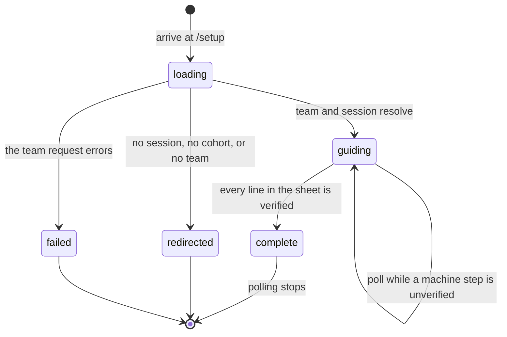

# The setup guide

## Summary

The setup guide takes a student from "the portal knows my team" to "my machine can run the benchmark". It is a command sheet: five shell commands in run order, in one code frame, each with a short comment above it and a small box in the left gutter that fills when CogPortal has seen that command's result. Nothing on it is ticked by hand. Every filled box is evidence the `cogworks` CLI sent from inside the team's own worktree, or a device the student linked.

It lives at `/setup` behind `RequireStage stage="team"`, so a visitor with no session goes to `/signin`, one with no cohort to `/join`, and one with no team to `/connect`, all with `replace` (`apps/portal/src/App.tsx:125`, `:59`, `:69`, `:70`). It is the last stop of the onboarding chain and the only page whose main content is text meant to be typed somewhere else.

It is the one page in the product that spans two surfaces at once. The commands are printed in a browser and run in a terminal, and the only thing joining them is one HTTP call the student makes on purpose, by adding `--update-setup` to a command they were going to run anyway. Everything odd about the page follows from that split: the silence while it waits, several boxes filling at once, and the fact that a failure is reported in the terminal and never here.

> Technical note: the sheet is a sheet rather than a numbered step list because of how evidence arrives. One `check` reports four facts in a single request, so several gutter cells fill together; numbered steps would imply they complete one at a time (`apps/portal/src/components/CommandSheet.tsx:16-23`).

## The simple case

A student finishes connecting a repository and lands here. The masthead reads `Setup · 0 of 5 verified`, rendered uppercase by the `u-kicker` utility, so on screen it says SETUP · 0 OF 5 VERIFIED (`apps/portal/src/routes/SetupPage.tsx:107-110`, `apps/portal/src/styles/app.css:103-110`). The team's name is the heading (`:111`), the repository's full name is a mono link under it (`:123-130`), and a strip of member avatars, a member count, and an "Add" link to `/team` sit on the rule below (`:132-143`).

Then the sheet, labelled for assistive technology as "Setup commands, in run order" (`:146`). Five lines, each an italic comment over one command, each with an empty rule box in the gutter:

```
# clone
git clone {repo url}.git && cd {repo name}

# tool  (if "command not found": activate the course environment, then rerun)
python -m pip install --upgrade "cogworks-benchmark @ git+https://github.com/SamGu-NRX/CogPortal.git@fix/product-description-triage#subdirectory=python/cogbench"

# benchmark for {track title}
python -m pip install "{distribution} @ {pinned git source}"

# link · opens the portal for approval
cogworks link --portal {origin}

# check · updates this page
cogworks check --benchmark {benchmark id} --update-setup
```

They paste them in order. Nothing on the page changes while they work. When the check passes and its portal call lands, the page repaints within two and a half seconds: the boxes for clone, tool, benchmark, and check fill with ticks at once, the four commands drop to faint ink, and the masthead reaches SETUP · 5 OF 5 VERIFIED. The terminal, meanwhile, has printed one line naming what it sent: `setup: updated clone, environment, project, wiring` (`python/cogbench/src/cogbench/cli.py:158`).

At five of five, the quiet "Open dashboard" link at the foot of the page becomes a filled button (`SetupPage.tsx:149-165`). That is the whole difference completion makes. There is no completion panel and no congratulation.

If they stop halfway and close the tab, nothing is lost, because nothing on this page was holding the progress. The four machine steps live in the portal's database, written by the CLI, and the link cell reads the device list.

## What each line says

The five lines are the product, so they are quoted in full order. Each is built by `setupCommandLines` (`apps/portal/src/lib/setup-progress.ts:74-132`), which is the single place the sheet's contents are decided.

**Clone.** Comment `# clone`. Command `git clone {repo url}.git && cd {repo name}`, built from the team record (`setup-progress.ts:86-89`, `:153-154`). Its cell fills on the `clone` step.

**Tool.** Comment `# tool  (if "command not found": activate the course environment, then rerun)`. Command `python -m pip install --upgrade "cogworks-benchmark @ {COGBENCH_SOURCE}"` (`setup-progress.ts:95-99`). Its cell fills on the `environment` step. The source is a PEP 508 direct reference to a branch of the CogPortal repository itself, `git+https://github.com/SamGu-NRX/CogPortal.git@fix/product-description-triage#subdirectory=python/cogbench` (`apps/portal/src/lib/benchmark-packages.ts:30-31`). It is the one source on the page pinned to a moving ref rather than a commit, deliberately: the tool reads a student's repository and reports what it found, so it has to move with the branch, and `--upgrade` is what makes a second run pick up the branch head (`benchmark-packages.ts:19-29`).

**Benchmark.** Comment `# benchmark for {track title}`. Command `python -m pip install "{distribution} @ {source}"` (`setup-progress.ts:109-112`). Its cell fills on the `project` step. Each source is pinned to a forty character commit, which is the submodule commit recorded in `.gitmodules`; a submodule bump is also an edit to `benchmark-packages.ts` (`benchmark-packages.ts:1-11`). The two vision tracks share one distribution, so switching between recognition and clustering installs nothing new (`benchmark-packages.ts:39-45`). This line is present only when the selected track has a mapped package; a track with none shows no install line rather than a guessed one (`benchmark-packages.ts:60-64`), and the sheet is then four lines long and the masthead says "of 4".

**Link.** Comment `# link · opens the portal for approval`. Command `cogworks link --portal {origin}`, where the origin is `window.location.origin` (`setup-progress.ts:117-120`, `SetupPage.tsx:76`). Its cell fills when the account has at least one CLI device, not when a particular machine is linked (`setup-progress.ts:159`).

**Check.** Comment `# check · updates this page`. Command `cogworks check --benchmark {id} --update-setup` (`setup-progress.ts:125-128`). Its cell fills on the `wiring` step. The flag is load bearing and the code says so: without it the CLI returns without making a request, which would make the comment above the line false and leave the whole sheet grey forever (`setup-progress.ts:121-124`).

Two commands that were on this page are gone. There is no `pip install -e .`: neither the course template nor any 2026 repository carries a `pyproject.toml` or `setup.py`, so that command failed for everyone who ran it, and the resolver reads the repository directly instead (`setup-progress.ts:103-108`). And the tool is no longer installed from the TestPyPI channel, because that channel and `main` both serve `cogworks-benchmark` 0.1.0, which has no resolver: a student who ran the old line got a `check` that could not search their repository (`setup-progress.ts:91-94`). A test pins both absences, along with the sheet's length and the shape of every pin (`apps/portal/test/command-sheet.test.ts:44-113`).

## The ask, event by event



### Asking

Arriving on the route is the ask. Two things are decided before anything renders.

**Which team.** `GET /api/team` supplies the repository name and URL and the member list (`apps/portal/worker/routes/team.ts:119`). It decides the clone command, the heading, and the member strip.

**Which benchmark.** `useTrack()` reads the active benchmark list and the browser's stored preference, and it decides both the benchmark id in the `check` command and whether the install line exists at all (`apps/portal/src/lib/track.ts:86`). The comment above the switcher says why the control is on this page: "Every command on this page names a benchmark, so the page has to show which one and let a student change it. Without this the default track silently decides what they're told to type." (`SetupPage.tsx:113-115`).

While `useTeam()` is pending or the session has no user, the whole page is one line: "Loading your team" (`SetupPage.tsx:28`). Past three seconds that mark appends the whole seconds it has been waiting; see [`../cross-cutting/live-updates.md`](../cross-cutting/live-updates.md#the-loading-mark-names-its-own-wait).

Nothing about who the student is or how they arrived is read any more. The page no longer branches on whether they created the team or joined it, and `ConnectPage` no longer sends that fact: both of its exits are a plain `navigate("/setup", { replace: true })` (`apps/portal/src/routes/ConnectPage.tsx:206`, `:358`).

### Answered without work

Three ways out before any content renders, all of them free.

- A gate redirect. `RequireStage` sends the student to `/signin`, `/join`, or `/connect` with `replace`, so the back button does not bounce them into the same gate.
- A failed `GET /api/team`. The page renders a `QueryError` card whose wording is chosen by what the student can do about it rather than by which of the error codes arrived (`apps/portal/src/lib/query-error-state.ts:69`, `SetupPage.tsx:29-35`).
- A session that has no user. Same loading mark as a pending team, indefinitely.

Nothing is written in any of these cases. The page makes no request that changes anything, ever.

> Technical note: the gate resolves after the session query, not before it, so a student on a slow connection sees "Loading" and then a redirect rather than an immediate bounce. That is the shared behavior of every gated route and is described in [`foundations/the-ask.md`](../foundations/the-ask.md#edge-cases).

### The work begins

There is no such moment on this page.

The setup guide never writes to the portal. It issues three reads (`GET /api/team`, `GET /api/v1/connections`, `GET /api/v1/setup/state`) and renders them. Since the self-check box was removed, the browser has no way to produce a durable effect at all: the only `localStorage` keys left are a dismissal flag for the dashboard nudge and a dead key from the old checkbox guide that nothing writes and only the reset clears (`setup-progress.ts:19-36`).

The moment that matters for this feature happens in a terminal. `cogworks check --benchmark {id} --update-setup` posts to `/api/v1/cli/setup/checks` and upserts one row per step (`apps/portal/worker/routes/setup.ts:87`). That is when a step stops being free to abandon, and it is described in [`terminal/check.md`](../terminal/check.md). The portal page only watches the result arrive.

The one exception is owner-only and behind a deployment flag: "Reset guide" issues `DELETE /api/v1/setup/state`, which deletes every verification row for that user and team (`setup.ts:116`).

> Technical note: the four steps land together because the CLI batches them, not because the page groups them. `check --update-setup` sends the list `("clone", "environment", "project", "wiring")` in one request, and only after the check itself returned 0 (`cli.py:617`). The server upserts each name and answers with the list it accepted (`setup.ts:85`). There is no partial state on the wire and no way for a student to report one step at a time.

The dev rehearsal bar, when it renders, sits above everything else under the kicker "Dev rehearsal" (`SetupPage.tsx:216`). It holds three mode buttons labelled "Live state", "creator", and "member" (`:217-227`) and a "Reset guide" control on the right that arms to "Confirm reset" before firing (`:229-235`).

### While it works

`useSetupState()` polls `GET /api/v1/setup/state` every 2.5 seconds and stops when `clone`, `environment`, `project`, and `wiring` are all present (`apps/portal/src/lib/queries.ts:264-272`). The stopping set is `CHECKLIST_MACHINE_STEPS`, deliberately smaller than the server's full list, and both the hook and the constant say why: the server's `SETUP_STEPS` also carries `test` and `run`, which are later learning milestones the sheet never shows, so waiting on every step kept a finished page polling forever (`queries.ts:265-267`, `setup-progress.ts:54-57`). `useConnections()` polls every 4 seconds until at least one CLI device exists, then stops (`queries.ts:120-121`).

Everything else on the page is inert while it waits. The copy control works and the track switcher works. There is no spinner, no "waiting for your terminal" line, and no indication that the page is asking anything. A student who runs the check and watches the browser sees nothing for up to 2.5 seconds and then four cells fill at once.

The sheet has one copy control, not one per line: a small "copy all" button in the top right of the frame, which changes to "copied" for 1.4 seconds (`CommandSheet.tsx:81-88`). It copies the commands joined by newlines and none of the comments, which are for reading rather than pasting (`CommandSheet.tsx:6-12`, and the test at `command-sheet.test.ts:118-125`). A clipboard write the browser refuses is swallowed, and the comment gives the fallback: the commands stay on screen to select by hand (`CommandSheet.tsx:48-50`).

The masthead carries `aria-live="polite"` (`SetupPage.tsx:107`), so the move from "4 of 5" to "5 of 5" is announced. Each command also carries a screen-reader-only prefix, "Verified. " or "Not verified yet. ", so the gutter is not the only place its state exists (`CommandSheet.tsx:66-68`). The gutter cell itself is `aria-hidden` (`:100`).

Only a newly filled cell animates. The tick enters on `anim-rise`, the same 200ms quartic the rest of the interface uses, and because only a newly mounted tick animates, a report that fills three cells does not re-run the one already filled (`CommandSheet.tsx:93-97`, pinned by `command-sheet.test.ts:143-164`). A filled line also drops its command to faint ink, which leaves the commands still to run as the only full-contrast text in the frame.

Changing the track rewrites the benchmark id in the `check` command, rewrites or removes the install line, and rewrites the comment naming the track's title. It does not reset any cell: verification is per user and team, not per benchmark. It can change the denominator, so a switch from a mapped track to an unmapped one turns "3 of 5" into "3 of 4".

### How it ends

The page has no end. It stays on screen and stops polling when the four machine steps are verified.

Complete means `verified === total` from `setupCommandProgress`, which filters and counts the same array the sheet renders (`setup-progress.ts:163-170`, `SetupPage.tsx:81-82`). The comment above the count states the guarantee it buys: the masthead can never claim a number the sheet does not show, so a student can literally count the ticks and get the figure in the masthead (`SetupPage.tsx:79-80`). At completion the "Open dashboard" link becomes a filled button with an arrow; below completion it is the same words in quiet mono (`SetupPage.tsx:149-165`).

The commands that come after setup are no longer on this page. They live in the dashboard's FIRST RUN panel, which prints `cogworks check`, `cogworks run`, and `cogworks sync` for the selected benchmark; see [`start-a-practice-run.md`](start-a-practice-run.md).

The same progress is echoed on the dashboard by a slim nudge reading "Getting set up", one small square per line, and "{verified} of {total} verified", which disappears at completion or when dismissed (`apps/portal/src/components/SetupNudge.tsx:57`, `:59-72`, `:53`). It builds the same array from the same function, and its own comment records the bug that motivated the sharing: the two used to disagree, the nudge saying "2 of 6 steps done" against the page's "0 of 6 verified", because the nudge counted milestones a student never typed, including the team's own existence (`SetupNudge.tsx:19-27`). Dismissal is permanent for that team and login, written to `cog-setup-dismissed:{teamId}:{login}` (`setup-progress.ts:19-21`, `:46-52`). The nudge shares this page's polling hooks, so a dashboard left open also polls the setup endpoint every 2.5 seconds until the four steps land.

## What a filled cell claims

There is one mark now, and it makes one claim: CogPortal observed the result of this command. Four of the five cells read CLI evidence, and the fifth reads the device list (`setup-progress.ts:12-15`).

That claim is weaker than it looks in two places, and both are worth stating outright.

The four CLI cells say a linked device reported something, not that the portal looked at the machine. The portal checks exactly one thing in the payload, the repository the caller says they are standing in, and refuses the whole call when that disagrees with the team's (`setup.ts:74`). Everything else, the CLI version, the Python version, the installed benchmark and submission ids, is recorded evidence rather than a checked claim.

The link cell is weaker still: it says a device token exists for this account, not that the device is the machine the student is looking at. A student with two laptops sees that cell filled from the other one.

The rule behind both is in [`foundations/what-the-portal-claims.md`](../foundations/what-the-portal-claims.md#verified): the portal only says what it observed, and anything on a student's machine is theirs to confirm. The page no longer states that rule in prose, because it no longer needs to distinguish four strengths of claim. Nothing here can be advanced from the browser, and a test pins the consequence that matters most: a student working alone reaches five of five on CLI evidence plus one linked device, with no second member and no checkbox anywhere (`apps/portal/test/setup-contract.test.ts:83-92`).

## Modifiers

| Modifier | Set before the ask | Changed while it works |
| --- | --- | --- |
| Who you are | Any signed-in member of a team sees the same sheet. The page no longer varies by whether the student created the team or joined it. An owner on a deployment with `ONBOARDING_DEV_TOOLS=enabled` additionally gets the dev rehearsal bar (`SetupPage.tsx:41`). An instructor with no team never reaches the page: the gate sends them to `/connect`. | A teammate accepting an invitation adds an avatar to the member strip and increments the member count on the next `useTeam()` read, which has no poll. It changes no cell and no count. |
| Where your team and repository stand | The whole page is addressed to one team and one repository. The clone command is built from the team record (`setup-progress.ts:153-154`), and a test pins that it names the team's own repository rather than the template (`command-sheet.test.ts:111-116`). No team means no page. | Changing the team's repository from the team page rewrites the clone command on the next read. Verification rows are keyed on user and team, not on the repository, so filled cells survive a repository change and now describe a directory the student no longer has. |
| Which week's benchmark | The track switcher picks it, defaulting to the newest active module (`track.ts:80`). It sets the benchmark id in the `check` command, the distribution and pin in the install command, and the track title in that command's comment. | Switching mid-guide rewrites the commands under the student's cursor with no warning, and can change the denominator when one track has a mapped package and the other does not. A student who copied the old command and has not run it yet gets no indication that the page now says something else. |
| Practice or leaderboard | No effect. Neither appears. The page is about the machine. | No effect. |
| Flags, options, and where you are typing | `?replay=creator` and `?replay=member` are honored only for an owner on a dev-tools deployment (`SetupPage.tsx:62-66`). Every other query parameter is ignored. Copying is one button for the whole sheet; there is no print view. | Pressing a rehearsal button rewrites the query string with `replace` and blanks the evidence: `verifiedSteps` becomes an empty list and the device count becomes 0 (`SetupPage.tsx:74-75`). The commands themselves do not change, which is the point, and the comment says so: a rehearsing owner sees the sheet a student sees on day zero (`:68-69`). The live state is not lost, only not consulted. |

## Cancel and interrupt

| Event | Before the work begins | While it works |
| --- | --- | --- |
| You stop it yourself | There is nothing to stop. Leaving the page mid-load cancels three reads that changed nothing. | Same. The page holds no in-flight write of any kind. |
| You do something else mid-way | Navigating away unmounts the queries and stops both polls; TanStack Query also pauses polling for a backgrounded tab (`queries.ts:257`). Returning refetches. | Same. Every cell is server state, so nothing about the sheet's position depends on the tab staying open. |
| A teammate acts at the same time | A teammate joining before the page loads shows up in the member strip and the count. It changes no cell. | A teammate's own `check --update-setup` does not affect this student's page. Verification rows are keyed on user and team (`setup.ts:33`), so each member fills in their own copy of the sheet. A team of four has four independent sheets. |
| The network or the portal fails | A failed `GET /api/team` replaces the page with a `QueryError` card and a retry button. | A failed `GET /api/v1/setup/state` is silent: the page keeps the last good state and keeps polling. A student whose portal is down sees a sheet that simply never fills, with nothing saying why. |
| The page or the process goes away | Nothing to lose. | Nothing to lose. Reload re-reads all three queries and repaints identically. |
| The thing being measured changes | Nothing has been measured yet. | A benchmark version bump does not touch verification rows, and neither does a repository change. The filled cells are about commands, not about a target, and no version or commit is recorded with them. A submodule bump changes the pin printed in the install command without touching the cell that command filled. |
| The platform refuses or credit runs out | Credit is not consulted. The page never spends anything and shows no quota. | The CLI's call is the one that can be refused. Three refusals reach the student in the terminal rather than here: no team (403, "Finish joining a team and connecting its repository first.", `setup.ts:71`), a mismatched directory (409, "This directory is {repositoryFullName}, but CogPortal expects {team repo}.", `setup.ts:81`), and a dead token ("This CogPortal connection is missing, expired, or revoked. Run `cogworks link --portal {}` and retry.", `cli.py:151`). The page shows no trace of any of them. |

## Interactions with other systems

**Who may do this.** Any signed-in student on a team, for their own progress only. There is no view of a teammate's sheet and no instructor view of one. The dev rehearsal bar requires both `session.user.isOwner` and `session.auth.onboardingDevToolsEnabled` (`SetupPage.tsx:41`), and the reset endpoint re-checks both server side, returning 404 "API route not found." rather than 403 when either fails (`setup.ts:110`). Answering a disabled endpoint as though it does not exist is the right shape: a 403 would confirm the route is real. Ownership here is the deployment's `PLATFORM_OWNER_LOGINS`, read from the environment and never from the database, for the reason set out in [`admin.md`](admin.md#three-roles).

The CLI's write path uses a different actor entirely. `POST /api/v1/cli/setup/checks` authenticates a device token, not a browser session (`setup.ts:58`), so the account that fills the sheet is the account the machine was linked as. A student signed in to the browser on one account and linked in the terminal on another watches a sheet that will never fill, with nothing on either surface saying the two disagree.

**The team owns it.** The repository, the members, and the commands are the team's. The verification rows are not: they are per user and per team, so "the guide" is really one sheet per person. That is the correct scope, because the sheet is about a laptop, and see [`foundations/the-team-and-the-repository.md`](../foundations/the-team-and-the-repository.md) for why almost everything else on the platform is not scoped this way.

**Credit.** None spent, none shown. A student cannot learn their remaining practice runs from this page; the hosted quota belongs to the dashboard. See [`../cross-cutting/credit-and-quota.md`](../cross-cutting/credit-and-quota.md).

**What the portal claims.** One mark, one claim, described above. Owned by [`foundations/what-the-portal-claims.md`](../foundations/what-the-portal-claims.md).

**What the benchmark supplied.** Nothing is run and nothing is scored. The only benchmark-derived content is the id in the `check` command and the distribution, pin, and title in the install command, which come from the selected track (`benchmark-packages.ts:53-58`).

**Live updates and reconnection.** Two polls, both plain HTTP: setup state every 2.5 seconds until four steps are verified, connections every 4 seconds until a device exists. No WebSocket, no reconnection logic, no backoff. A poll that fails is retried on the next tick. The setup response is served `Cache-Control: private, no-store` (`setup.ts:53`), so no intermediary holds a stale answer between ticks. Both polls are the fastest in the portal after the run surface, and both exist for the same reason: they are waiting on something happening in another window.

**Discord.** Not mentioned anywhere on the page. A student who finishes setup gets no Discord message and no prompt to link an account. This is the only onboarding surface that never names the fourth surface.

**Configuration.** The `link` command prints `window.location.origin` (`SetupPage.tsx:76`), so a student on a staging portal copies a command pointing at staging. `ONBOARDING_DEV_TOOLS=enabled` gates the rehearsal bar and the reset endpoint. The benchmark id comes from the browser's stored track preference. The tool's install source and every benchmark pin are compiled into the bundle from `benchmark-packages.ts`, so changing them is a deploy, not a setting.

## Edge cases

- **Linking a machine can fill the clone cell.** `cogworks link`, run inside a worktree with a GitHub `origin`, sends `("clone",)` on its own (`cli.py:678`). A student who links from inside the project sees the clone cell fill before running `check`. If they link from elsewhere, the CLI prints "setup: device linked; change into your team project before running `cogworks check --benchmark {} --update-setup`." on stderr instead (`cli.py:683`).
- **The four cells fill together or not at all.** `check --update-setup` sends all four names in one call and only when the check itself returned 0 (`cli.py:617`). A student whose benchmark installs cleanly but whose repository the resolver cannot wire gets exit 2 and no portal update, so the clone and tool cells stay empty even though both commands succeeded. The page has no way to say "three of these four are fine".
- **The update call does not retry.** `update_setup_checks` passes `retry=False` with a 10 second timeout, and the docstring gives the reason: "the student asked for one visible portal update, and a failure should return control with an actionable retry instead of becoming background telemetry." (`python/cogbench/src/cogbench/client.py:141`). One flaky moment means running the command again.
- **`check --update-setup` cannot be pointed at a portal.** Only `run` declares `--portal` among the checking commands (`cli.py:85-88`), and `check` passes `None` to `_update_setup` (`cli.py:618`), so the portal comes from `COGPORTAL_URL` or the saved active portal. The `link` line on the sheet writes `--portal` in for the student, so the two commands on one page can name different portals if the environment disagrees with the browser.
- **The sheet writes the portal the browser is serving.** The `link` command prints the origin the page is being served from (`SetupPage.tsx:76`), so a student reading a staging portal copies a command that links their machine to staging. The CLI's own precedence rule, `--portal` then `COGPORTAL_URL` then the saved active portal, does not apply here, because the page writes the flag in for them. See [`foundations/the-ask.md`](../foundations/the-ask.md#configuration-precedence).
- **Test and run are steps the sheet never shows.** `SETUP_STEPS` on the server is six long, ending in `test` and `run` (`packages/contracts/src/schema.ts:927`), and `test --update-setup` and `run --update-setup` each send exactly one name (`cli.py:642`). Neither has a line here, and `CHECKLIST_MACHINE_STEPS` exists precisely so the poll does not wait on them (`setup-progress.ts:54-57`).
- **Resetting reloads the page into a rehearsal.** "Reset guide" arms a `ConfirmButton` that changes its own label to "Confirm reset" (`SetupPage.tsx:229-235`), then deletes the server rows, clears the local keys, and does a full page assignment to `/setup?replay=creator` (`:94-101`). A failed reset renders nothing at all: the mutation has an `onSuccess` and no error path.
- **The dead checkbox key is still cleared.** Nothing writes `cog-setup:{teamId}:{login}` any more, but the reset still removes it so a student who used the old checkbox guide is not left with an orphan entry (`setup-progress.ts:23-27`, `:31`).
- **Nothing on the page tells a student what `--update-setup` sends.** `cogworks link` prints that sentence before the handshake (`cli.py:660`). The sheet's own comment on the check line says only that it "updates this page".
- **The install source is a branch, and the page does not say so.** The tool line pins a branch rather than a commit, on purpose, and `--upgrade` re-resolves it every time (`benchmark-packages.ts:19-31`). A student who ran the line last week and runs it again today can get a different tool, and nothing in the comment above the command mentions that.
- **The commands name a benchmark even before the benchmark list resolves.** `useTrack()` returns the constant `vision-recognition` as `benchmarkId` until the query lands (`apps/portal/src/lib/queries.ts:18`, `track.ts:100`). The check command therefore renders a real, possibly wrong, command for one paint. The dashboard nudge avoids this by returning null while the track is pending, with a comment saying it is avoiding a count that renumbers itself (`SetupNudge.tsx:39-41`); the page itself does not wait.
- **One active benchmark means no switcher.** `TrackSwitcher` renders plain text with no trigger when there is a single track, on the stated ground that "One track is not a choice." (`apps/portal/src/components/TrackSwitcher.tsx:118`). A cohort running one module sees a label where a control would otherwise be, and the label still carries the version, as `{title} · v{version}` (`:116`).
- **The 409 for a wrong directory compares normalized names.** The server strips a trailing `.git` and lowercases both sides before comparing (`setup.ts:23`), so a remote written with different capitalization or with the `.git` suffix still matches. What does not match is a fork under a personal account, which is the case the sentence at `setup.ts:81` exists to name.
- **A repeat run is not an error.** The upsert only rewrites `verifiedAt` (`setup.ts:96`), and the CLI prints `setup: updated {names}` with whatever the server accepted (`cli.py:158`). Running the check ten times leaves four rows and ten timestamps, and the page looks identical each time.
- **The rehearsal modes blank the real device too.** A replay sets the verified list empty and the device count to zero (`SetupPage.tsx:74-75`), so an owner rehearsing sees their own linked machine reported as unlinked. That is correct for a rehearsal and confusing for anyone who forgot the query string is on; the masthead appends " · replaying creator" or " · replaying member" to say so (`:109`).
- **The two rehearsal modes now differ only in the word.** `creator` and `member` blank the same two inputs and produce the same sheet, because nothing on the page varies by entry mode any more. The buttons remain, and the masthead prints whichever word is in the query string.
- **There is no way to empty a cell from the browser.** Short of the owner-only reset, a verification row is permanent. A student who cloned into the wrong directory, ran the check, and then deleted the folder keeps four filled cells describing nothing.
- **A copied sheet loses the gotcha.** "Copy all" carries the commands and none of the comments (`CommandSheet.tsx:6-12`), so the parenthetical telling a student what to do about `command not found` is on screen and not in the paste buffer.

## Open questions and verification

- The setup guide never surfaces a failed `GET /api/v1/setup/state`. The page keeps polling and keeps showing stale state with no notice. Whether that is preferable to a card is a product call; it is carried to triage as a question, not a defect.
- The page is silent for up to 2.5 seconds after a successful check, with nothing saying it is waiting. Whether a student runs the check twice because the first appeared to do nothing was not observed. **Unverified.**
- The guide is written for a student working alone at a terminal, and every filled cell is reported by whoever ran the command. Whether a team where one member sets up a shared machine reads the other members' empty sheets as a problem was not established.
- Whether a repository change should clear the verification rows is a product decision. Rows carry no benchmark and no repository (`apps/portal/worker/db/schema.ts`, `setupVerifications`), so a team that changes its repository keeps filled cells describing the old one.
- Whether the `no_team` 403 at `setup.ts:71` is reachable was not confirmed. A device is linked from a browser session that has already passed the team gate, so an account with a live device and no team may be unreachable, the same open question `terminal/status.md` raises about the identical sentence.
- The membership lookup in the CLI callback takes the first row with `limit(1)` and no ordering (`setup.ts:61`), the same pattern `terminal/status.md` flags on the device status route. Whether an account can hold two memberships at once was not confirmed from the schema; if it cannot, both are harmless.
- The reset mutation has no error path (`SetupPage.tsx:94-101`), so an owner whose `DELETE` fails sees the button return to rest and nothing else. Low severity, since the control only exists on a dev-tools deployment, but it is a silent failure.
- Whether a student reads an empty gutter cell as "not done yet" rather than as "broken" was not tested with anybody. The old page said so in a paragraph; this one says it only through the screen-reader prefix "Not verified yet. " (`CommandSheet.tsx:66-68`), which a sighted student never hears. **Unverified.**
- The install line disappears entirely for a track with no mapped package, taking the denominator with it. Whether a student notices the sheet shrinking from five lines to four when they switch tracks was not observed. **Unverified.**
- Nothing in the sheet records which benchmark a cell was filled against, so switching tracks after finishing leaves every cell filled while the install command underneath names a different distribution. Whether that matters depends on whether the two distributions can disagree about what a repository must provide, which was not established.
- Whether the tick's 200ms rise reads as a response to running the check, or like an unrelated flicker two and a half seconds later, was not measured. **Unverified**: no browser was opened for this pass.

Verified against Cog\*Portal commit `5a74e74`.
