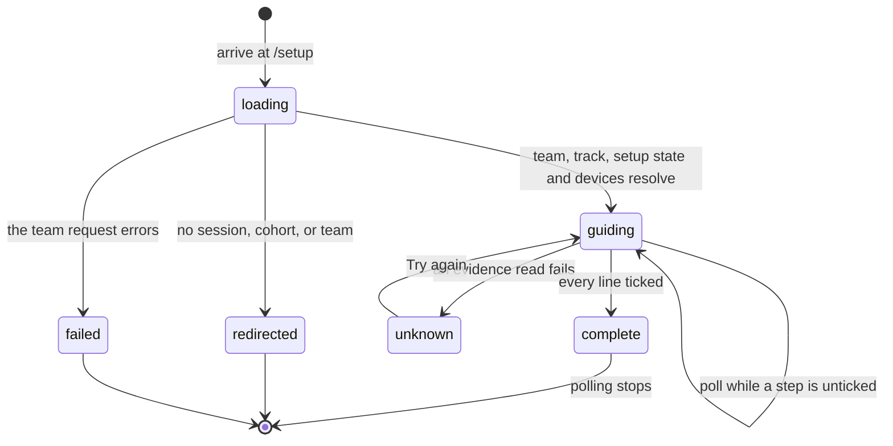

# The setup guide

## Summary

The setup guide takes a student from "the portal knows my team" to "my machine can run the benchmark". It is a numbered rail of five commands (four for a track with no packaged benchmark), each with a title, a margin note saying why, and a box that ticks when Cog\*Portal hears about it. A box ticks two ways: a linked device reports the step, which the page calls "Seen by the portal", or the student pastes a one-line check-off command into their terminal, which it calls "Checked off by you". Nothing is ticked from the browser.

It lives at `/setup` behind `RequireStage stage="team"` (`apps/portal/src/App.tsx:137-144`) and is the Setup tab for every team member (`apps/portal/src/components/Shell.tsx:62`). It spans two surfaces: the commands are printed in a browser and run in a terminal, and the only things joining them are the CLI's `--update-setup` report and the check-off command, both of which the student sends on purpose.

## The simple case

A student arrives from the team step. A green note at the top says "You've created {team}" or "You're on {team}", names their teammates, and ends "Start with step 1 below, which clones the team's repository." (`apps/portal/src/routes/SetupPage.tsx:480-516`). It appears once; the page removes the router state that carried it (`SetupPage.tsx:57-68`).

The heading is "Set up your machine", with the team name and repository above it and the lede "Five commands get a fresh terminal ready to run {track} against your team's code. Keep this page open beside it, and the boxes tick themselves as your terminal reports back." (`SetupPage.tsx:282-304`). A track switcher sits on the right. Under it, small squares, "0 of 5 done", and "Watching for your terminal" with a pulsing dot (`SetupPage.tsx:313-335`).

"Before you start" asks them to open a terminal and run `conda activate {env}`, with a note linking the CogWeb prerequisites and saying "The portal can't see your shell, so this one has no box." (`SetupPage.tsx:356-386`). Then the rail:

1. **Get the code.** `git clone {repo url}.git && cd {repo name}`.
2. **Install the CogWorks tool.** `python -m pip install --upgrade --force-reinstall "cogworks-benchmark @ git+https://github.com/SamGu-NRX/CogPortal.git@40d31a2…#subdirectory=python/cogbench"`.
3. **Install the {track} benchmark.** `python -m pip install "{dist} @ {source}" && python -m pip install --force-reinstall --no-deps "{dist} @ {source}"`.
4. **Link this device.** `cogworks link --portal {origin}`.
5. **Check that it finds your code.** `cogworks check --benchmark {id} --update-setup`.

Titles come from `setupStepTitle` and commands from `setupCommandLines` (`apps/portal/src/lib/setup-progress.ts:243-256`, `:93-174`). Each command is in a highlighted block with its own copy button. Observed locally on fixture data: `/tmp/cogshots/matched/pairs/a-setup-desk.png` (right half, `~2ff32fa`).

They run the commands in order. Linking from inside the clone ticks step 1. When `check` passes, the CLI prints `setup: updated clone, environment, project, wiring` and steps 1, 2, 3 and 5 tick together within 2.5 seconds; step 4 ticks once the device exists. At five of five, a "Setup complete" panel replaces the footer.

## What each line says

Each step has a margin note (`SetupPage.tsx:199-257`):

- **Get the code:** "You all work in this one repository, and every hosted run starts from it rather than from somebody's laptop."
- **Install the CogWorks tool:** the `cogworks` commands come from this package, "pinned to one commit, so everyone reading this page installs the same tool." Under the command: "If pip answers `externally-managed-environment`, the course environment isn't active; activate it and run this again."
- **Install the benchmark:** the scorer, its data and its checks live in their own package, "so this line changes when you switch tracks."
- **Link this device:** what `check` and `sync` send, and that the device can be revoked from Connections. Under it: "It prints a short code and opens this portal so you can approve it."
- **Check that it finds your code:** `check` reports which functions it wired up and "also confirms the steps above, so their boxes tick together." Under it: "If the box doesn't tick, the reason is in your terminal."

`--force-reinstall` on the tool is there because the package is 0.2.0 at every pin and pip treats an equal version as installed; a measured `--upgrade` between pins left the old commit in place (`setup-progress.ts:117-121`). The benchmark line installs with dependencies first, then force-replaces only the benchmark with `--no-deps`, so course packages are never forced (`setup-progress.ts:140-141`, `apps/portal/test/setup-rail.test.ts:80`). Every package is pinned to a forty-character commit; the benchmark pins match the submodule commits (`apps/portal/src/lib/benchmark-packages.ts:40-67`). The two vision tracks share one distribution. A track with no mapped package has no install line and the lede says "Four".

## The ask, event by event

```mermaid
stateDiagram-v2
    [*] --> loading : arrive at /setup
    loading --> redirected : no session, cohort, or team
    loading --> failed : the team request errors
    loading --> guiding : team, track, setup state and devices resolve
    guiding --> unknown : an evidence read fails
    unknown --> guiding : Try again
    guiding --> guiding : poll while a step is unticked
    guiding --> complete : every line ticked
    complete --> [*] : polling stops
    redirected --> [*]
    failed --> [*]
```

### Asking

Arriving is the ask. The page reads the team (repository and members), the track (`useTrack`), the setup state for that track, and the device list. It shows "Loading your team" until all four answer (`SetupPage.tsx:70`, `:123`, `:137-139`), so no command is rendered against a guessed benchmark.

The track decides the benchmark id in step 5, the package in step 3, and which evidence counts. `GET /api/v1/setup/state?benchmarkId={id}` answers with four lists: steps the CLI reported with no benchmark, the same per benchmark, and the two again for check-offs, plus one signed check-off token per self-checkable step for that benchmark (`apps/portal/worker/routes/setup.ts:64-143`).

### Answered without work

- A gate redirect to `/signin`, `/join` or `/connect`.
- A failed team read: the error card with a retry (`SetupPage.tsx:71-77`).
- A failed evidence read: the commands still render, because they come from the team and the track. The count reads "Progress unavailable", the squares disappear, the affected boxes show as unknown rather than empty, and an error card offers a retry (`SetupPage.tsx:146-154`, `:316-317`, `:344-351`). A failed device read marks only step 4 unknown (`setup-progress.ts:232-239`).

Nothing is written.

### The work begins

The page itself never writes, apart from the owner-only reset. Three things from the terminal do, and each is free to repeat:

- **`cogworks check --benchmark {id} --update-setup`**, only when the check exits 0 (`python/cogbench/src/cogbench/cli.py:1166-1172`). It posts `clone`, `environment`, `project` and `wiring` with the benchmark id. The portal stores `environment`, `project` and `wiring` against that benchmark and `clone` without one (`setup.ts:225-253`).
- **`cogworks link`** run inside a git worktree with a GitHub remote posts `clone` alone (`cli.py:1273-1277`). Outside one it prints "setup: device linked; change into your team project before running `cogworks check --benchmark {id} --update-setup`." on stderr (`cli.py:1279-1284`).
- **The check-off command.** Steps 1 to 3 each have a fold, "Tick this box from your terminal", while unticked (`SetupPage.tsx:555-600`). Inside: "Once the command above has worked, paste this into the same terminal. It records that you did this one step and sends nothing else; `check` confirms it for itself at the end." and a one-line Python command that POSTs to `/api/v1/setup/check-off?t={token}`. The server answers in the terminal with "CogPortal: '{step}' is checked off. Back to the browser with you." (`setup.ts:148-181`). Step 5 has no check-off; `wiring` is refused even with a forged token (`setup.ts:154`).

### While it works

`useSetupState` polls every 2.5 seconds until the four steps are ticked for this track, by either source, then stops (`apps/portal/src/lib/queries.ts:280-312`). `useConnections` polls every 4 seconds until a device exists (`queries.ts:129-136`). While both run, the rail shows "Watching for your terminal".

A box that ticks while the student watches is stamped and drawn in about half a second; one already ticked on arrival just shows (`apps/portal/src/components/StepRail.tsx:105-134`). A ticked step folds its command away with "Show command", and the label reads "Seen by the portal" or "Checked off by you"; a step that ticks while open stays open (`SetupPage.tsx:400-405`, `StepRail.tsx:222`). Screen readers hear "Verified. ", "Checked off from your terminal. ", "Progress unknown. " or "Not verified yet. " before each title (`StepRail.tsx:44-49`). The count says who ticked: ", seen by the portal" or ", checked off by you" (with "both" or "all" once there are two or more), or ": {n} seen by the portal, {m} checked off by you" when they are mixed (`SetupPage.tsx:456-461`).

Switching the track rewrites steps 3 and 5 and re-reads the evidence for the new benchmark. Steps 2, 3 and 5 are about one environment, so a track the student has not checked shows them open; step 1 and the device carry over. The switch says nothing about why boxes reopened.

### How it ends

The page stays open and stops polling once complete. Complete means every line is ticked and no evidence read failed (`SetupPage.tsx:181`). The panel is "Setup complete" (`SetupPage.tsx:417-439`):

- All seen by the portal: "Everything the portal can verify checks out. Your terminal found the repository and called your code.", drawn in the verified tone.
- Any checked off: "Every step is ticked; the ones marked checked off are your own report rather than something the portal saw.", in the plain tone.

Both continue "Whether the code is any good is what runs are for. Local runs are unlimited and score the same way, so start there:" with `cogworks run --benchmark {id}` and a "Go to Runs" button. Before completion the footer reads "No rush; the guide keeps your place. Hosted practice runs build from your pushed commit and don't need any of this, so you can start one from Runs whenever you like." (`SetupPage.tsx:441-448`).

The Runs page carries the same count in a slim nudge, "Setup {done} of {total} done" with "Next: {step title}" linking to `/setup#step-{id}`, which scrolls to and focuses that step (`apps/portal/src/components/SetupNudge.tsx:94-108`, `SetupPage.tsx:127-133`). Dismissing it is permanent for that team and login and its label says "Setup stays in the tabs" (`SetupNudge.tsx:112`).

## What a tick claims

"Seen by the portal" means a device linked to this account reported the step from a directory whose GitHub remote names the team's repository. The portal checks that one fact and refuses the whole report otherwise (`setup.ts:200-209`). Package versions are recorded, not checked. Step 4 means this account has at least one device, not that this machine is linked (`setup-progress.ts:217`).

"Checked off by you" means someone ran a command carrying a token signed for this account, team, step and benchmark. It is the student's word. A later CLI report upgrades a check-off to seen; a check-off never downgrades a CLI report (`setup.ts:167-178`, `:249-251`). The completion panel claims verification only when every tick was seen (`SetupPage.tsx:182-184`).

## Modifiers

| Modifier | Set before the ask | Changed while it works |
| --- | --- | --- |
| Who you are | Every member sees the same commands; evidence is per account. An owner on a deployment with `ONBOARDING_DEV_TOOLS=enabled` also gets a "Dev rehearsal" bar (`SetupPage.tsx:84`, `:602-638`). A staff member without a team never reaches the page. | Signing in as another account in another tab reloads this one on return (restore gate); the evidence query is keyed by login and team so one account's answer never shows for another (`queries.ts:286-289`). |
| Where your team and repository stand | The clone command is the team's repository. | A repository change rewrites the clone command on the next team read. Evidence rows are keyed on user, team, step and benchmark, not repository, so ticks survive the change. |
| Which week's benchmark | The switcher picks it: the browser's stored choice, else the first benchmark of the newest active module (`apps/portal/src/lib/track.ts:74-82`). It sets steps 3 and 5 and which evidence counts. | Switching re-reads evidence and can change the total between five and four. A command copied for the old track and not yet run gives no warning; a check-off copied for one track ticks only that track (`apps/portal/test/setup-check-off.test.ts:187`). |
| Practice or leaderboard | No effect. The footer says hosted practice runs need none of this. | No effect. |
| Flags, options, and where you are typing | `?replay=creator` or `?replay=member` only for a dev-tools owner. The check-off uses `HTTPSConnection` or `HTTPConnection` to match the page's protocol (`SetupPage.tsx:567`). | Rehearsal blanks the evidence and the device count, appends " · replaying {mode}" to the count, and hides check-offs (`SetupPage.tsx:156-180`, `:326`). |

## Cancel and interrupt

| Event | Before the work begins | While it works |
| --- | --- | --- |
| You stop it yourself | Nothing to stop. | Same; the page holds no write. |
| You do something else mid-way | Leaving stops both polls; returning refetches. | Same. Every tick is server state. |
| A teammate acts at the same time | A teammate joining shows in the arrival note only. | A teammate's report ticks their own rail, not this one. |
| The network or the portal fails | A failed team read shows the error card. | A failed evidence read is shown as unknown with a retry, not as unticked boxes. The CLI's report does not retry: one failure prints the reason and returns (`python/cogbench/src/cogbench/client.py:136-151`). |
| The page or the process goes away | Nothing to lose. | A reload repaints the same ticks. The arrival note does not come back. |
| The thing being measured changes | Nothing measured yet. | A pin change does not untick anything; ticks record no version. A check-off token expires after seven days and is stable for a day so the command does not change under the cursor (`apps/portal/worker/routes/setup-check-off-token.ts:16-22`); a stale one prints "CogPortal: this check-off command is stale. Copy a fresh one from the setup page." (`setup-check-off-token.ts:27-28`). |
| The platform refuses or credit runs out | Credit is not consulted. | The CLI's report is refused in the terminal: "Finish joining a team and connecting its repository first." (`setup.ts:197`), "This directory is {repo}, but CogPortal expects {team repo}." (`setup.ts:207`), or "This CogPortal connection is missing, expired, or revoked. Run `cogworks link --portal {origin}` and retry." (`cli.py:200-203`). The page shows none of them. |

## Interactions with other systems

**Who may do this.** Any team member, for their own evidence. The CLI report authenticates the device, so the account that fills the rail is the account the machine was linked as. The check-off authenticates nothing but its signed token. The reset endpoint answers 404 unless the caller is an owner on a dev-tools deployment (`setup.ts:257-264`).

**The team owns it.** The repository and the commands are the team's. The evidence is per person and team, because it is about a laptop.

**Credit.** None spent, none shown.

**What the portal claims.** Two kinds of tick, kept apart in the mark, the label, the spoken prefix, the count and the completion panel. Owned by [`../foundations/what-the-portal-claims.md`](../foundations/what-the-portal-claims.md).

**What the benchmark supplied.** Nothing is run here. Track titles, package pins and conda environment names come from `benchmark-packages.ts`.

**Live updates and reconnection.** Two plain polls; the setup response is `Cache-Control: private, no-store` (`setup.ts:133`).

**Discord.** Not mentioned on the page.

**Configuration.** The link command prints `window.location.origin`. The check-off command prints `window.location.host`. Both are signed by `BETTER_AUTH_SECRET`, so rotating it invalidates every copied check-off (`setup-check-off-token.ts:59-61`). The tool pin and benchmark pins are compiled into the bundle.

## Edge cases

- **`check --update-setup` sends nothing when the check fails.** The flag is gated on exit 0 with no message (`cli.py:1166`). The page's "If the box doesn't tick, the reason is in your terminal." points at the check's own output.
- **The tool pin is not this build.** The page installs the CLI at `40d31a2` (`benchmark-packages.ts:40-41`), an ancestor of `2ff32fa` with several later `python/cogbench` commits not in it.
- **Test and run are steps the rail never shows.** `cogworks test --update-setup` and `run --update-setup` post `test` or `run` with no benchmark (`cli.py:1234-1239`); the server keeps them and the rail ignores them.
- **"Copy" takes one command.** Each block copies its own line; there is no copy-all.
- **Reset reloads into a rehearsal.** "Reset guide" arms to "Confirm, this clears your ticks", deletes the rows, clears local keys and loads `/setup?replay=creator`. A failed reset shows nothing (`SetupPage.tsx:269-276`, `:628-633`).
- **There is no way to untick a box** short of the owner-only reset.
- **Every return from the terminal rereads the session.** When the browser tab becomes hidden (a minimized window, another tab, or on most browsers a window fully covered), the restore gate conceals the rail and puts a loading mark over it until a fresh session read answers (`apps/portal/src/components/RestoreGate.tsx:135-156`, `:209-249`). On this page a student alternates between the two windows for every step.
- **The check-off command contains a bearer token.** Anyone holding it can tick that one step for that account until it expires. It cannot do anything else.

## Open questions and verification

- `check --update-setup` drops the flag silently when the check fails (`cli.py:1166`). B-16.
- Whether a student reads the reopened boxes after a track switch as lost work was not observed; the page no longer explains it.
- Whether a check-off for a step whose command failed misleads a student into a "Setup complete" panel was not observed. The panel's plain tone and sentence are the only signal.
- The check-off route does not confirm the token's account is still on the token's team (`setup.ts:156-178`). A removed member's week-old command would write a row for a team they left. No student-visible effect was found.
- Observed locally on fixture data at `2ff32fa`: three check-off commands answered 200 with "'clone' is checked off", "'environment'", "'project'", and after a refresh the rail read "3 of 5 done, all checked off by you" (`CogPortal-qa-video-20260930/outputs/beta-qa/final-2ff32fa/checkoff-responses.json`, `setup-after-refresh.txt`). No CLI report, device link or real install was exercised.
- Hosted beta (`4984730`) differs: it pins the CLI at `b6bbffb`, which carries the per-item `None` fix (beta `apps/portal/src/lib/benchmark-packages.ts:41`, candidate `benchmark-packages.ts:41`); the conda step is a numbered "00 Start in the course environment" row, step 5 is "Prove the wiring", check-offs are always visible under "Done here? Run this in the same terminal and the box ticks itself.", and the footer reads "No rush. This page keeps your place." with "Open dashboard" (beta `apps/portal/src/routes/SetupPage.tsx:205`, `:292`, `:364`, `:369`, `:416`, candidate `SetupPage.tsx:356-386`, `:441-448`, `:555-600`, `setup-progress.ts:254`).

Read against Cog\*Portal commit `2ff32fa`.
