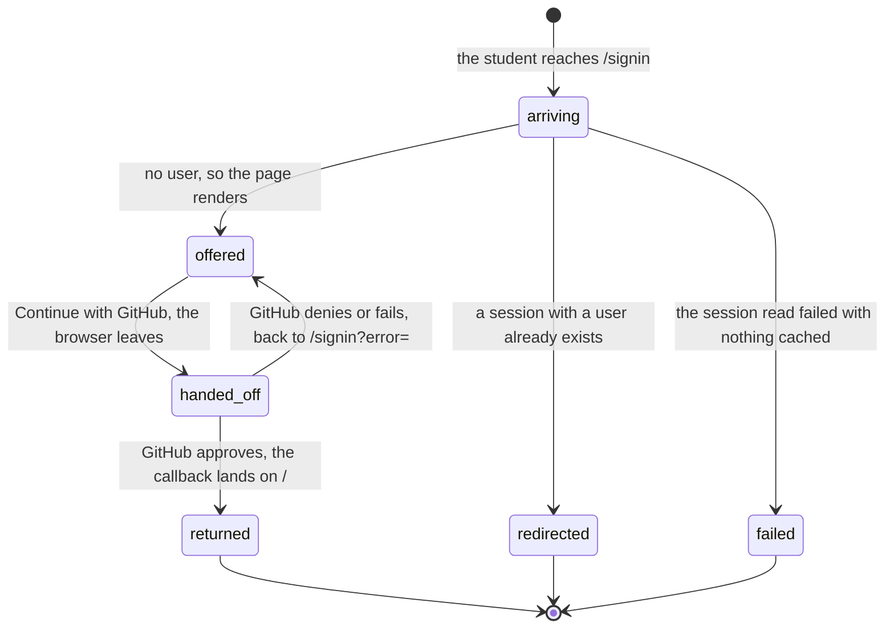

# Signing in

## Summary

Signing in is the first ask a student makes, and the only one the portal answers before it knows who they are. It owns one route, `/signin` (`apps/portal/src/App.tsx:97`), which sits outside every stage gate and carries one control: a link that hands the browser to GitHub. Everything after it depends on it, because `RequireStage` sends a session with no user here from every gated route (`apps/portal/src/App.tsx:63`).

This document owns `/signin` and the two public places that lead to it: the header button in the shell and the landing page at `/`. It does not own the cohort join code or the team, which are [`join-or-make-a-team.md`](join-or-make-a-team.md), and it does not own the repository, which is [`connect-a-repository.md`](connect-a-repository.md).

## The simple case

A student opens the portal, sees the landing page, and presses "Sign in with GitHub" (`apps/portal/src/routes/Landing.tsx:47`). They arrive at `/signin`, which offers one button, "Continue with GitHub" (`apps/portal/src/routes/SignInPage.tsx:71`). Pressing it leaves the portal entirely: the browser navigates to `/api/github/login`, which redirects to GitHub's authorization screen. GitHub asks whether they want to let Cog\*Portal read their account. They approve, GitHub returns them to the portal, and they land back on `/`.

They are now signed in, and the landing page's first button reads "Open Dashboard" (`apps/portal/src/routes/Landing.tsx:39`). Pressing it takes them to whatever they still owe: `/join` if they have no cohort, `/connect` if they have a cohort but no team, `/dashboard` if they have both (`apps/portal/src/App.tsx:33`).

The last paragraph is the one worth reading twice. A successful GitHub sign-in does not carry the student forward on its own. It returns them to the landing page and waits for a second press. See [Edge cases](#edge-cases).

The other way in is the shell's header, which renders a "Sign in" button on every page while signed out and the user menu once a session exists (`apps/portal/src/components/Shell.tsx:65`). The button is a plain link to `/signin` and carries no record of the page it was pressed from, so a student who was reading the leaderboard and signed in from there does not come back to the leaderboard.

## The ask, event by event

### Asking

Arriving on `/signin` is itself the ask. The page reads the session and decides among four renderings before it shows anything.

**Already signed in.** A session carrying a user never sees the page. It is redirected to the pending connection return if one was saved, otherwise to `nextStagePath` (`apps/portal/src/routes/SignInPage.tsx:22`), with `replace`, so the back button does not bounce between the two.

**The session read failed with nothing cached.** The page renders the shared `QueryError` panel rather than the form (`apps/portal/src/routes/SignInPage.tsx:28`). The comment above it names the reason: with no session there is no auth config either, and the availability check below treats an absent config as a disabled provider, so an outage read as "sign-in isn't configured".

**The first session read is still in flight.** A loading mark, for the same reason (`apps/portal/src/routes/SignInPage.tsx:40`).

**No user, and the config arrived.** The form renders. Which control it renders is decided by `auth.githubConfigured`, a field the session carries for exactly this (`packages/contracts/src/schema.ts:298`).

One thing is captured before the redirect, and only one. When a signed-out student is bounced off `/connections`, the guard saves the address they were trying to reach so sign-in can return them to it (`apps/portal/src/App.tsx:61`). The saved value is filtered: only a path beginning `/connections#discord=` or `/connections?user_code=` is kept, and only those are handed back (`apps/portal/src/lib/pending-return.ts:4`). Every other destination is discarded, which is why signing in from the leaderboard or from `/dashboard` lands on the landing page rather than back where the student was.

> Technical note: that save happens during render, not in an effect (`apps/portal/src/App.tsx:61` and `:67`). Writing to `sessionStorage` while React is computing what to draw is a side effect in a place React reserves for pure work. Both writes are idempotent, so the double render that `StrictMode` performs in development is harmless here, and `main.tsx:15` does enable `StrictMode`. It is harmless by luck rather than by design; see [Edge cases](#edge-cases) for the same pattern in a place where the luck runs out.

### Answered without work

Three of the four renderings above end the ask with nothing recorded: the redirect, the error panel, and the loading mark. So does the disabled state. When `githubConfigured` is false, the same "Continue with GitHub" label renders on a disabled button, with a visible sentence under it: "GitHub sign-in isn't configured. Ask course staff to enable it." (`apps/portal/src/routes/SignInPage.tsx:85`). The comment says why the sentence is visible rather than a `title`: keyboard and touch users have no hover, and a disabled control takes no focus.

A returning error is also answered without work. A `?error=` in the query string renders one line above the fold. If the value contains "denied", it reads "GitHub sign-in was cancelled. Sign in again when you're ready."; anything else reads "GitHub sign-in failed. Try again." (`apps/portal/src/routes/SignInPage.tsx:94`). The comment explains the test: GitHub and Better Auth both spell a cancellation with "denied" (`access_denied`, `oauth_denied`), and the portal does not claim to know what any other value means.

Nothing is written in any of these cases. No account row, no cookie beyond whatever the browser already held.

The development form has its own short path. Its "Sign in" button is disabled until the field holds something other than whitespace, and the submit handler returns early on an empty value or a mutation already in flight (`apps/portal/src/routes/SignInPage.tsx:49`). Pressing return on an empty field does nothing at all, with no message, which is the correct answer for a control that is visibly disabled.

### The work begins

The moment the browser leaves for `/api/github/login`.

"Continue with GitHub" is a plain anchor, not a fetch (`apps/portal/src/routes/SignInPage.tsx:66`). The whole page navigates. That endpoint asks Better Auth for a social sign-in URL, copies every `Set-Cookie` it produced onto the response, and returns a 302 (`apps/portal/worker/routes/github.ts:69`). By the time the student is looking at github.com, an OAuth state cookie exists in their browser, and abandoning is no longer free in the narrow sense that returning to `/signin` starts a new handshake rather than resuming this one.

The endpoint sets `callbackURL: "/"` and `errorCallbackURL: "/signin"` (`apps/portal/worker/routes/github.ts:72`). The second exists because Better Auth falls the error callback back to the success callback, which sent a cancelled sign-in to the landing page with a query parameter nobody read.

In development the equivalent moment is `POST /api/dev/login` creating or signing in the account, which writes a user row on first use (`apps/portal/worker/routes/session.ts:45`).

### While it works

Nothing on the portal updates, because the student is not on the portal. The handshake is a full-page navigation to GitHub and back; there is no spinner, no polling, and no way to cancel from the portal side. Pressing the browser's back button during the GitHub screen returns to `/signin`, which renders exactly as it did.

The one visible progress state belongs to the development form: its "Sign in" button takes a `busy` prop from the mutation and the "Enter demo mode" button disables while the same mutation is pending (`apps/portal/src/routes/SignInPage.tsx:119`). Both buttons read the same mutation, so pressing one disables the other, and both report into the same error paragraph.

There is no timeout. If GitHub's authorization screen never loads, the student is looking at GitHub's failure, and the portal has nothing to say about it.

### How it ends

On approval, GitHub returns the browser to the portal, Better Auth writes the session cookie, and the student lands on `/`. The landing page reads the session again. If a pending connection return was saved, it navigates there at once (`apps/portal/src/routes/Landing.tsx:22`). Otherwise it renders the signed-in landing page and waits.

On refusal or failure, the student lands on `/signin?error=<code>` and reads one of the two sentences above.

The error line does not clear itself. It is read from the query string on every render (`apps/portal/src/routes/SignInPage.tsx:45`), so it stays visible under the button until the student navigates somewhere without the parameter. A second attempt that succeeds leaves the page entirely, so the stale sentence is never seen alongside a success.

Nothing else is written on the portal side by a successful sign-in beyond the account, the session, and the OAuth account row Better Auth keeps. The OAuth token is encrypted at rest (`apps/portal/worker/auth/better-auth.ts:86`), which matters later: the repository listing and every permission check read that token back on the student's behalf.

Two facts follow the account from here. The GitHub login is mapped onto the user row at sign-in (`apps/portal/worker/auth/better-auth.ts:55`), and `overrideUserInfoOnSignIn` is on, so a login renamed on GitHub is corrected on the next sign-in rather than drifting. Account linking is disabled (`apps/portal/worker/auth/better-auth.ts:87`), so one portal account maps to one GitHub identity and there is no way to attach a second.

The session that comes back is the same payload every guard reads: a user with a login, a display name, an avatar, a platform role, and two booleans for owner and TA; a cohort or null; a team or null; and the deployment's auth config (`packages/contracts/src/schema.ts:312`). The login shown is the GitHub login when there is one and the local part of the email when there is not (`apps/portal/worker/auth/session.ts:32`). Everything the rest of the portal decides about this student is decided from those three nullable fields.

## Modifiers

| Modifier | Set before the ask | Changed while it works |
| --- | --- | --- |
| Who you are | Signed out is the only state the page is for. A signed-in student never sees it: the guard at `SignInPage.tsx:21` redirects to the pending return or to `nextStagePath`. An instructor is redirected on the same line by the same rule; there is no staff sign-in and no separate credential. | No effect. The session is read once per render and the redirect fires on the next one. A session that arrives mid-handshake simply means the page redirects when the browser comes back. |
| Where your team and repository stand | No effect on what the page shows. It decides where the student lands afterwards: `nextStagePath` reads user, then cohort, then team, and returns `/signin`, `/join`, `/connect`, or `/dashboard` (`apps/portal/src/App.tsx:33`). | No effect. A team created in another tab changes the destination of the next redirect, not this one. |
| Which week's benchmark | No effect. No benchmark is named, loaded, or chosen anywhere in the sign-in flow. The track switcher lives behind the team gate. | No effect. |
| Practice or leaderboard | No effect. Neither exists yet for an account with no team. `/leaderboard` is public and reachable without signing in at all (`apps/portal/src/App.tsx:96`). | No effect. |
| Flags, options, and where you are typing | The deployment's configuration decides the whole page. `githubConfigured` swaps the live anchor for a disabled button and a sentence; `devAuthEnabled` adds the local sign-in block below a rule (`apps/portal/src/routes/SignInPage.tsx:101`). Both come from the session payload, so a student cannot force either from the browser. A `?error=` in the address bar renders its sentence whether or not a handshake happened. | No effect. Both flags are read from the session the page already has. |

The two configuration flags are mutually exclusive by construction: `devAuthAvailable` requires GitHub to be unconfigured (`apps/portal/worker/env.ts:89`), so no deployment ever shows a working GitHub button and a local sign-in form at the same time.

A deployment with neither shows the disabled button and the sentence naming course staff, and there is no way in at all. That is the correct answer, and it is the state a misconfigured deployment lands in rather than failing at boot, because `assertAuthConfiguration` only refuses a half-configured pair (`apps/portal/worker/auth/better-auth.ts:13`).

## Cancel and interrupt

| Event | Before the work begins | While it works |
| --- | --- | --- |
| You stop it yourself | Closing the tab on `/signin` leaves nothing behind. No request has been made. | Pressing Cancel on GitHub's authorization screen returns to `/signin?error=access_denied` and the page reads "GitHub sign-in was cancelled. Sign in again when you're ready." Nothing was written; the next attempt starts clean. |
| You do something else mid-way | Navigating away from `/signin` is free. The page holds one piece of state, the development login field, and it is not persisted. | Opening a second tab and signing in there leaves the first tab on `/signin` showing the form. It corrects itself only on a re-render; the session query has a 60 second stale time and does not refetch on window focus (`apps/portal/src/lib/queries.ts:24`, `apps/portal/src/App.tsx:27`), so the stale form can sit visible for a while. Pressing "Continue with GitHub" from it starts a second handshake, which succeeds and is harmless. |
| A teammate acts at the same time | No effect. Sign-in is the one ask in the platform that is entirely about a person. | No effect. A teammate creating the team while this student is on GitHub only changes which page `nextStagePath` names afterwards. |
| The network or the portal fails | A failed session read with nothing cached renders the `QueryError` panel with "The request never reached the portal, so nothing was lost. Check your connection, then try again." and a "Try again" button (`apps/portal/src/lib/query-error-state.ts:96`). A warm tab keeps rendering the form off cached data. | A `/api/github/login` that cannot reach Better Auth's provider returns 502 with "GitHub sign-in did not return a redirect URL." (`apps/portal/worker/routes/github.ts:84`). Because this is a full-page navigation and not a fetch, the student sees the raw JSON error body in the address bar's page, not the portal's error panel. **Unverified.** |
| The page or the process goes away | Nothing is lost. There is nothing to lose. | A reload during the GitHub screen is GitHub's problem, not the portal's. A reload after the callback lands finds the session cookie already set and renders as signed in. |
| The thing being measured changes | No effect. | A GitHub login renamed between the authorization and the callback is written as the new name, because `mapProfileToUser` reads the profile the callback carries and `overrideUserInfoOnSignIn` is on (`apps/portal/worker/auth/better-auth.ts:54`). |
| Refused, or out of credit | Credit is not consulted. There is no team to spend it. A deployment with GitHub unconfigured is the only refusal on this page, and it is stated before any press. | Not reachable. |

After any interrupt the student is either signed in or not, with nothing in between: the session cookie is written by the callback or it is not.

## Interactions with other systems

**Who may do this.** Anyone. `/signin` is registered outside every guard (`apps/portal/src/App.tsx:97`), as are `/` and `/leaderboard`. Role is decided after sign-in, not during it: `platformRole` reads an owner list from the environment and a staff table from the database (`apps/portal/worker/auth/roles.ts:73`). A student cannot influence it from this page. The owner list deliberately does not live in the database, because anyone who could write the staff table could otherwise make themselves an owner (`apps/portal/worker/auth/roles.ts:34`).

**The team owns it.** Nothing here belongs to a team. This is one of the three asks in the platform that are about a person rather than a team, along with linking a device and reading `cogworks status`. See [`../foundations/the-ask.md`](../foundations/the-ask.md#interactions-with-other-systems).

**Credit.** None spent, none shown.

**What the portal claims.** The page claims only what it observed: whether GitHub sign-in is configured, and whether the last attempt carried an error code. It does not claim to know why a non-"denied" error happened, which is why the second sentence is "GitHub sign-in failed. Try again." and not a diagnosis. See [`../foundations/what-the-portal-claims.md`](../foundations/what-the-portal-claims.md).

**What the benchmark supplied.** Nothing. No benchmark is loaded, and the landing page's four steps ("Fork the template", "Set up your machine", "Practice locally", "Connect and run", `apps/portal/src/routes/Landing.tsx:62`) name no benchmark either. The step-two copy says why: the exact commands need a track, and a signed-out page has no track, so they live on `/setup` where the portal can also verify each one (`apps/portal/src/routes/Landing.tsx:14`).

**Live updates and reconnection.** None. The session query has a 60 second stale time and no refetch interval (`apps/portal/src/lib/queries.ts:20`), and `refetchOnWindowFocus` is off globally (`apps/portal/src/App.tsx:27`). Nothing on this page polls.

**Discord.** Not involved directly, with one exception. A student who started a Discord link and was bounced here has that address saved, and comes back to it after signing in (`apps/portal/src/lib/pending-return.ts:12`). Nothing is posted to a channel by signing in.

**Configuration.** `GITHUB_CLIENT_ID` and `GITHUB_CLIENT_SECRET` together decide `githubConfigured`, and the worker refuses to boot with one and not the other (`apps/portal/worker/auth/better-auth.ts:13`). `ENVIRONMENT`, `DEV_AUTH`, and the absence of GitHub credentials decide `devAuthEnabled` (`apps/portal/worker/env.ts:89`). `BETTER_AUTH_URL` must be a bare HTTPS origin, with HTTP allowed only on localhost, and the worker throws at startup otherwise (`apps/portal/worker/auth/better-auth.ts:33`), which is the same rule the CLI applies to a portal origin.

## Edge cases

- **A successful GitHub sign-in does not advance the student.** The callback URL is `/` (`apps/portal/worker/routes/github.ts:72`), and the landing page navigates onward only when a pending connection return exists (`apps/portal/src/routes/Landing.tsx:22`). A first-time student therefore lands on the landing page, signed in, and has to press "Open Dashboard" to reach `/join`. `SignInPage` itself does the opposite: it redirects to `nextStagePath` (`apps/portal/src/routes/SignInPage.tsx:22`). The two paths into the same state disagree.
- **The landing page has no error state.** It destructures `data` from the session query and reads nothing else (`apps/portal/src/routes/Landing.tsx:13`). A failed session read leaves `session` undefined, so `authed` is false and the page renders as though the student were signed out, offering a sign-in button to someone who may already be signed in. Every other route reads the same query and renders `QueryError`.
- **The development sign-in accepts a narrow login and reports a rejection in the wrong voice.** The request schema requires 1 to 39 characters matching `^[a-zA-Z0-9-]+$` (`packages/contracts/src/schema.ts:1014`). A login with a space or a dot fails `parseBody` and comes back as 400 "The request body is invalid." (`apps/portal/worker/http/respond.ts:22`), which the page renders verbatim because it is an `ApiRequestError`. The only student-voiced fallback, "Sign-in failed. Try again.", is reserved for errors that are not `ApiRequestError` at all (`apps/portal/src/routes/SignInPage.tsx:129`).
- **A development account has no GitHub identity.** `githubLogin` is set to null immediately after the account is created (`apps/portal/worker/routes/session.ts:55`), because that column is uniquely indexed and a real row may already hold the same name. The connections page says so in words: "No GitHub identity; development sign-ins don't carry one." (`apps/portal/src/routes/ConnectionsPage.tsx:211`). Role checks fall back to the account name, and only when `devAuthAvailable` is true, so there is no real identity to impersonate (`apps/portal/worker/auth/session.ts:52`).
- **"Enter demo mode" provisions a whole account.** It posts `demo: true`, and the server joins the active cohort and connects the fixture repository as "Demo Team" in the same request (`apps/portal/worker/routes/session.ts:57`). With no active cohort it fails with 404 "Active cohort not found.", which renders in the same paragraph as the form's own errors.
- **The demo button navigates to a hardcoded path.** It calls `navigate("/dashboard")` (`apps/portal/src/routes/SignInPage.tsx:138`) while the submit button a few lines above uses `pendingConnectionReturn() ?? nextStagePath(s)` (`apps/portal/src/routes/SignInPage.tsx:52`). The destination happens to be right, because the server gave the demo account a team. The pending connection return is not honoured, so a developer who ran `cogworks link` first and then pressed this button loses the device code with no notice.
- **`RequireStaff` sends a non-staff user away without saying anything.** It redirects to `/` with `replace` and no message (`apps/portal/src/App.tsx:83`), so a student who follows a link to `/admin` sees the landing page and no explanation. The `QueryError` vocabulary already has a sentence for this case, "Your account doesn't have access to this view. A TA can grant access if you should have it." (`apps/portal/src/lib/query-error-state.ts:175`), and the guard does not use it.
- **`/__gallery` exists only in development.** The route is behind `import.meta.env.DEV` and is stripped from a production bundle (`apps/portal/src/App.tsx:172`), so in production it falls through to `NotFound` and reads "404. Nothing found at this address." (`apps/portal/src/routes/NotFound.tsx:8`).
- **Sign-in is rate limited, and the portal does not say so in its own words.** Better Auth's rate limiter is enabled with database storage whenever an environment is present (`apps/portal/worker/auth/better-auth.ts:81`). A student who presses the button repeatedly is throttled by the auth layer, whose reply is not one of the sentences this page knows how to render. **Unverified**: no rate limit was triggered in this pass.
- **The only destination the portal remembers is a device or Discord link.** `rememberConnectionReturn` accepts two prefixes and drops everything else (`apps/portal/src/lib/pending-return.ts:4`). That is deliberate: those two are the flows where a code expires while the student is elsewhere. The consequence is that sign-in is a one-way trip from every other page.
- **The session read is not retried on window focus.** `refetchOnWindowFocus` is off for every query (`apps/portal/src/App.tsx:27`), and the session's stale time is 60 seconds (`apps/portal/src/lib/queries.ts:24`). A tab left on `/signin` while the student signs in elsewhere keeps showing the form until something re-renders it.
- **A disabled provider and a broken one look different, on purpose.** An unconfigured deployment shows a greyed button with a sentence naming course staff. A configured deployment whose session read failed shows the error panel with a retry. Getting these two confused is exactly what the comments at `SignInPage.tsx:25` and `:37` say the code was changed to prevent, and `apps/portal/test/session-guard-render.test.ts:145` asserts the distinction holds.
- **The user menu, not this page, is where a session ends.** Signing out clears the session and returns a payload with every field null (`apps/portal/worker/routes/session.ts:123`). It does not unlink a device: a machine linked with `cogworks link` keeps its token. See [`../terminal/link.md`](../terminal/link.md).
- **A guarded route reached while signed out redirects before it renders anything.** The gate runs after the session query resolves, so on a slow connection the student sees a loading mark and then a redirect, not an instant bounce (`apps/portal/src/App.tsx:50`). The same behavior is described once, for every route, in [`../foundations/the-ask.md`](../foundations/the-ask.md#edge-cases).
- **The header hides the dashboard link until a team exists.** `Dashboard` renders only when the session carries a team (`apps/portal/src/components/Shell.tsx:53`), so a signed-in student with no team sees only `Leaderboard` in the primary nav and reaches the next step through the landing page or the user menu.
- **`/update-user` is disabled at the auth layer.** The additional `githubLogin` field has to be marked as input for the provider mapping to write it, which would otherwise let a signed-in account set its own GitHub login through Better Auth's own endpoint. The endpoint is turned off instead (`apps/portal/worker/auth/better-auth.ts:64`).
- **Two accounts can share a GitHub login only if one of them is a development account.** `github_login` is uniquely indexed on the users table (`apps/portal/worker/db/schema.ts:43`), and a development account is written with null there rather than competing for the name.

## Open questions and verification

- The callback landing on `/` rather than on `nextStagePath` costs every first-time student one extra press. Whether that is deliberate (the landing page doubles as the setup guide) or an oversight is a product call. Carried to triage.
- What a student actually sees when `/api/github/login` returns 502 was not observed. Because the anchor is a full-page navigation, the portal's error panel cannot render it, and the browser is likely to show the raw JSON body. **Unverified.**
- Whether Better Auth ever emits an error code containing "denied" for something that is not a cancellation was not established. The comment at `SignInPage.tsx:91` names `access_denied` and `oauth_denied`; other providers spell it differently, but GitHub is the only provider configured.
- The landing page's missing error state is a real inconsistency with every other route, but whether a student would notice it depends on how often a cold session read fails. Not measured. **Unverified.**
- `RequireStaff` redirecting a non-staff user to `/` with no message is a silent refusal in a codebase that otherwise always names its refusals (`apps/portal/src/App.tsx:83`). Worth treating as a bug. The sentence to use already exists in `query-error-state.ts`.
- The demo button's hardcoded `/dashboard` is currently correct because the server provisions a cohort and a team in the same request. It is still the one place in this file that does not use `nextStagePath`, and it silently drops a pending device link. Carried to triage as an inconsistency rather than an observed failure.
- Whether Better Auth's rate limiter ever fires during ordinary use, and what the student sees when it does, was not established. **Unverified.**
- The landing page's "Open Dashboard" label is wrong for most students who read it: for anyone without a cohort or a team it goes to `/join` or `/connect` (`apps/portal/src/routes/Landing.tsx:36`). Whether that misnaming matters in practice was not observed. **Unverified.**
- Whether the stale `?error=` sentence can appear next to a fresh, unrelated failure was not tested. Reading the source, it cannot: a success navigates away and a second failure rewrites the same parameter.
- No sign-in was performed against a running portal in this pass. Every string above was read from the source. **Unverified.**

Verified against Cog\*Portal commit `f74e087`.
