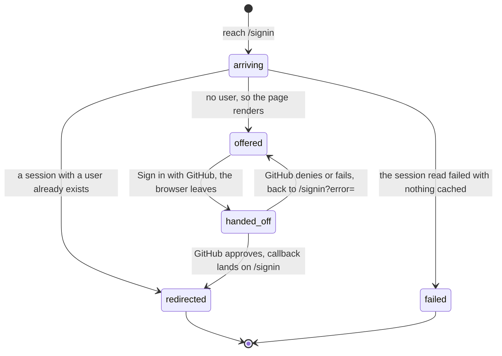

# Signing in

## Summary

Signing in is the first ask a student makes, and the only one the portal answers before it knows who they are. It owns one route, `/signin` (`apps/portal/src/App.tsx:112`), which sits outside every stage gate and carries one control: a link that hands the browser to GitHub. `RequireStage` sends a session with no user here from every gated route (`App.tsx:68-73`).

This document owns `/signin`, the two public places that lead to it (the header's "Sign in" button and the landing page at `/`), and how a returning tab learns who is signed in now. The cohort code and the team are [`join-or-make-a-team.md`](join-or-make-a-team.md); the repository is [`connect-a-repository.md`](connect-a-repository.md).

## The simple case

A student opens the portal. The landing page leads with "See how your capstone holds up as the problem gets harder." and an example run labeled "Example", then four numbered steps under "How a capstone week goes" (`apps/portal/src/routes/Landing.tsx:39`, `:70-134`). They press "Sign in with GitHub" (`Landing.tsx:55-58`) and arrive at `/signin`.

The sign-in page opens with the four-step path ("Sign in", "Cohort", "Team", "Set up") with step 1 current, the heading "Sign in", and "We use your GitHub account, so there's no new password to keep track of." (`apps/portal/src/routes/SignInPage.tsx:131-137`). A margin note says signing in shares the GitHub profile and email, and that reading the team's repository is a separate step (`SignInPage.tsx:146-148`). They press "Sign in with GitHub" (`SignInPage.tsx:173-176`), approve on GitHub, and come back to `/signin`, which sends them at once to the step they owe: `/join`, `/connect`, or `/dashboard` (`SignInPage.tsx:78-80`, `App.tsx:34-39`).

## The ask, event by event

```mermaid
stateDiagram-v2
    [*] --> arriving : reach /signin
    arriving --> redirected : a session with a user already exists
    arriving --> failed : the session read failed with nothing cached
    arriving --> offered : no user, so the page renders
    offered --> handed_off : Sign in with GitHub, the browser leaves
    handed_off --> redirected : GitHub approves, callback lands on /signin
    handed_off --> offered : GitHub denies or fails, back to /signin?error=
    redirected --> [*]
    failed --> [*]
```

### Asking

Arriving on `/signin` is the ask. The page reads the session and picks one of four renderings.

**Already signed in.** Replace to the stored connection return if there is one, otherwise to `nextStagePath` (`SignInPage.tsx:78-80`).

**The read failed with nothing cached.** The shared error card with a retry (`SignInPage.tsx:85-92`). Without it, an outage would read as "sign-in isn't configured", because no session means no auth config.

**The first read is in flight.** A loading mark, for the same reason (`SignInPage.tsx:97-99`).

**No user, and the config arrived.** The page renders, and `auth.githubConfigured` decides the button (`SignInPage.tsx:172`).

One thing can be carried across the handshake. When a signed-out student is bounced off `/connections?user_code=…` or `/connections#discord=…`, the gate stores that address in `sessionStorage` (`App.tsx:69-71`, `apps/portal/src/lib/pending-return.ts:3-7`). Nothing else is remembered, so signing in from the leaderboard ends on the next stage, not on the leaderboard.

### Answered without work

**GitHub not configured.** A disabled "Sign in with GitHub" with a visible sentence under it: "GitHub sign-in isn't configured. Ask course staff to enable it." (`SignInPage.tsx:179-187`). On such a deployment the "Development sign-in" fold below starts open, since it holds the only sign-in that works (`SignInPage.tsx:106`, `:193-202`). Observed locally on fixture data: `/tmp/cogshots/matched/pairs/a-signin-desk.png` (right half, `~2ff32fa`).

**A returning error.** `?error=` renders an alert above the button. A code containing "denied" reads "GitHub sign-in was cancelled. Sign in again when you're ready." (`SignInPage.tsx:51-53`). Seven named codes have their own sentences, among them `state_mismatch`, "Your sign-in expired or began in another tab. Start again from this page.", and `account_not_linked`, which says another GitHub account already uses that email (`SignInPage.tsx:27-46`). Any other code reads "GitHub sign-in failed. Try again." (`SignInPage.tsx:58`). Under the sentence the raw code is printed in mono, only when it looks like a Better Auth code (`/^[a-z0-9_]{1,64}$/`), so a TA has something to search (`SignInPage.tsx:165-167`).

**The development form.** "Sign in" is disabled until the field has text. A name outside `^[a-zA-Z0-9-]{1,39}$` is refused in the browser with "A GitHub username is letters, numbers, and hyphens, up to 39 characters." (`SignInPage.tsx:64`, `:114-117`, `:122`).

Nothing is written in any of these cases.

### The work begins

When the browser leaves for `/api/github/login`. The button is a plain anchor. The endpoint asks Better Auth for a GitHub URL, forwards its cookies, and redirects (`apps/portal/worker/routes/github.ts:65-91`). Both callbacks are `/signin`: success so the page can route the student onward, and errors so the code is read (`github.ts:76`, `:81`). Returning to `/signin` mid-handshake starts a new handshake.

In development the equivalent moment is `POST /api/dev/login`, which creates the account on first use (`apps/portal/worker/routes/session.ts:27-115`).

### While it works

Nothing on the portal updates; the student is on GitHub. There is no spinner, no polling and no timeout. The development form's "Sign in" shows a busy state and "Open the demo team" disables while the same request is pending (`SignInPage.tsx:233`, `:248`).

### How it ends

On approval, Better Auth writes the session cookie and the browser lands on `/signin`, which redirects to the pending return or the next stage. On refusal, the student lands on `/signin?error=<code>` and reads the sentence. The alert reads the query string on every render and stays until the student leaves.

The GitHub login is mapped onto the account at sign-in and overwritten on each sign-in, so a renamed login is corrected (`apps/portal/worker/auth/better-auth.ts:55-56`). OAuth tokens are encrypted at rest (`better-auth.ts:87`).

**Coming back to a tab.** Every page sits under `RestoreGate`. When a tab is hidden it conceals account-bound content; when it is shown again or restored from the back/forward cache, it reads the session fresh. The same account gets the page back; a different login or team reloads the document (`apps/portal/src/components/RestoreGate.tsx:71-109`, `:135-156`). A tab left on `/signin` while the student signed in elsewhere therefore redirects onward on return.

**Signing out** is in the account menu. It clears the session and navigates to `/` (`apps/portal/src/components/UserMenu.tsx:226-233`, `session.ts:117-129`). It does not unlink a device.

## Modifiers

| Modifier | Set before the ask | Changed while it works |
| --- | --- | --- |
| Who you are | Signed out is the only state the page is for. A signed-in student or instructor is redirected by the same rule. Staff are sent to the student stages too: `nextStagePath` does not read the platform role, so a staff member with no cohort lands on "Join the cohort". | A session that arrives in another tab redirects this one on its next return. |
| Where your team and repository stand | No effect on the page. Decides where the student lands afterwards (`App.tsx:34-39`). | No effect. |
| Which week's benchmark | No effect. | No effect. |
| Practice or leaderboard | No effect. `/leaderboard` is public. | No effect. |
| Flags, options, and where you are typing | `githubConfigured` swaps the live anchor for a disabled button and a sentence; `devAuthEnabled` adds the development fold. Both come from the session payload. A `?error=` renders its sentence whether or not a handshake happened. | No effect. |

The two flags exclude each other: development auth requires GitHub unconfigured (`apps/portal/worker/env.ts:91-97`).

## Cancel and interrupt

| Event | Before the work begins | While it works |
| --- | --- | --- |
| You stop it yourself | Closing the tab on `/signin` leaves nothing. | Cancel on GitHub returns to `/signin?error=access_denied` and the cancellation sentence. Nothing was written. |
| You do something else mid-way | Navigating away is free. | Signing in from a second tab and returning to this one rereads the session and redirects. |
| A teammate acts at the same time | No effect. | A teammate creating the team only changes which page the redirect names. |
| The network or the portal fails | A failed read with nothing cached shows "The request never reached the portal, so nothing was lost. Check your connection, then try again." with a retry (`apps/portal/src/lib/query-error-state.ts:93`). On the landing page, which has no error state of its own, the header slot says "Couldn't check who's signed in." with "Try again" only when the restore gate's read failed (`RestoreGate.tsx:287-306`). | A login endpoint that gets no URL from Better Auth answers 502 "GitHub sign-in did not return a redirect URL." (`github.ts:88`). It is a full-page navigation, so the browser shows the JSON body. |
| The page or the process goes away | Nothing to lose. | A reload after the callback finds the cookie and redirects. |
| The thing being measured changes | No effect. | A login renamed on GitHub is written as the new name. |
| The platform refuses or credit runs out | A deployment with GitHub unconfigured is the only refusal, stated before any press. | Not reachable. |

## Interactions with other systems

**Who may do this.** Anyone. `/signin`, `/` and `/leaderboard` are outside every guard. Role is decided after sign-in; see [`../foundations/identity-and-roles.md`](../foundations/identity-and-roles.md#the-two-role-systems).

**The team owns it.** Nothing here belongs to a team.

**Credit.** None. The landing page states the budget: "Each benchmark gives your team {PRACTICE_LIMIT} practice runs and {OFFICIAL_LIMIT} official attempts" (`Landing.tsx:129-132`), which are 10 and 3 (`packages/contracts/src/schema.ts:1519-1520`).

**What the portal claims.** Whether GitHub sign-in is configured and what code the last attempt carried. An unknown code gets the generic sentence and its raw code, not a diagnosis. The landing page's example run is labeled "Example" because nothing on it was measured (`Landing.tsx:196-199`).

**What the benchmark supplied.** Nothing.

**Live updates and reconnection.** No polling. The restore gate rereads the session on every return to the tab.

**Discord.** A student bounced here from a Discord link returns to it after signing in.

**Configuration.** `GITHUB_CLIENT_ID` and `GITHUB_CLIENT_SECRET` decide `githubConfigured`; the worker refuses to boot with one and not the other. `ENVIRONMENT`, `DEV_AUTH` and the absence of GitHub credentials decide `devAuthEnabled`. `GITHUB_TEMPLATE_REPO` changes landing step 1 from "One your team already has is fine. If your instructor shares a template, forking it is the easy start." to a fork link "or bring one your team already has." (`Landing.tsx:82-108`).

## Edge cases

- **The landing page forwards a pending return.** A signed-in visit to `/` with a stored connection return navigates there (`Landing.tsx:30-31`).
- **A stored return outlives the link it was for.** It is cleared only when a device is approved, a Discord request is confirmed, cancelled or dismissed, or the gate drops the link (`apps/portal/src/routes/ConnectionsPage.tsx:72`, `:174`, `pending-return.ts:38`). A student who reaches the approval page and leaves without approving is sent back to `/connections?user_code=…` by every later visit to `/` or `/signin` in that tab, including a press on the Cog\*Portal wordmark (`apps/portal/src/components/Shell.tsx:9-14`).
- **The landing page has no error state.** It reads only `data` from the session query (`Landing.tsx:27`). A failed cold read renders it signed out.
- **"Open the demo team" provisions an account.** It posts `demo: true`; the server joins the active cohort and connects the fixture repository as "Demo Team" (`session.ts:57-76`), then the page uses the same destination as "Sign in" (`SignInPage.tsx:107-108`, `:249`). With no active cohort it fails with "Active cohort not found."
- **`RequireStaff` sends a non-staff account to `/` with no message** (`App.tsx:95-96`).
- **`/__gallery` exists only in development** (`App.tsx:187-189`).
- **Sign-in is rate limited by Better Auth** (`better-auth.ts:82`). What a throttled student sees was not established.
- **Before signing in, the header shows only "Leaderboard".** After, a student without a team gets a "Get started" tab pointing at their next stage; staff do not (`Shell.tsx:52-66`).

## Open questions and verification

- Staff without a team are routed into student onboarding after every sign-in (`App.tsx:34-39`, `SignInPage.tsx:79`). Carried to triage as new.
- A stored connection return is never cleared by leaving the approval page, which turns `/` and the wordmark into a redirect back to it for the rest of the tab session (`Landing.tsx:30-31`, `pending-return.ts:9-19`). Carried to triage as new.
- What a student sees when `/api/github/login` returns 502 was not observed.
- Whether a throttled sign-in produces a code this page names was not established.
- The margin note says reading the repository is "a separate, read-only step later" (`SignInPage.tsx:146-148`). The GitHub App's permissions are configured on GitHub, not in this repository, so the read-only claim could not be checked from code.
- Observed locally on fixture data (`/tmp/cogshots/matched/pairs/a-landing-desk.png`, `a-signin-desk.png`, `/tmp/cogshots/runtime/log.txt`, `~2ff32fa`): the landing copy, the four steps with 10 and 3, step 1 without a template, the disabled GitHub button with its sentence, and no horizontal overflow at 390 pixels on `/` and `/signin`. No GitHub OAuth was exercised.
- Hosted beta (`4984730`) differs: the button reads "Continue with GitHub" (beta `apps/portal/src/routes/SignInPage.tsx:116`, candidate `SignInPage.tsx:175`), there is no onboarding path, the demo button reads "Enter demo mode" and goes to `/dashboard` regardless of a pending return (beta `SignInPage.tsx:191`, `:196`, candidate `SignInPage.tsx:249`, `:252`), and the landing page's signed-in button reads "Open Dashboard" or "Continue setup" (beta `Landing.tsx:48`, candidate `Landing.tsx:51`).
- Local `17d26d9` differs: `nextStagePath` sends staff and TAs with no team to `/admin` (`App.tsx:37-43` at `17d26d9`). A synthetic staff login opening `/signin`, `/dashboard` and `/setup` settled on `/admin` each time, on the local fixture build ([checkpoint](../verification/checkpoint-17d26d9.md)). The account menu's wording was not observed.

Read against Cog\*Portal commit `2ff32fa`.
