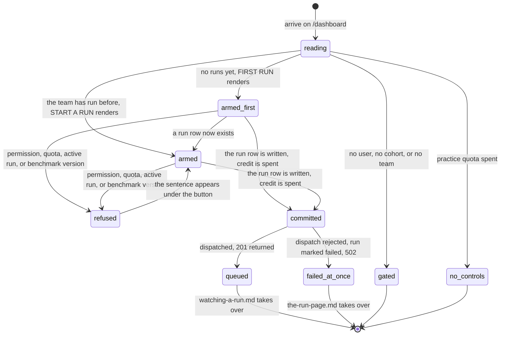

# Starting a practice run

## What this document owns

The route is `/dashboard`. This document owns its run controls and every state they can be in, from arriving on the page to the instant a run row exists: the branch select, the "Run practice benchmark" button, the sentence that replaces both when the quota is spent, and every way the ask can be refused before anything is written. It also owns the dashboard's two shapes, the single-panel page a team sees before its first run and the grid it sees afterwards, because a student reads them before deciding to press anything.

It stops the moment the run row exists. [`watching-a-run.md`](watching-a-run.md) owns the `CURRENT RUN` panel that replaces these controls, the run page while a run is still moving, and the separate live console at `/run-surfaces/:surfaceId`. [`the-run-page.md`](the-run-page.md) owns the finished run at `/runs/:runId`. [`promote-to-the-leaderboard.md`](promote-to-the-leaderboard.md) owns the "Promote to official" control that shares this panel, the `PUBLISHED RESULT` panel, and the official quota.

## Summary

Starting a practice run is one select and one button. The student picks a branch, presses "Run practice benchmark", and the portal checks their GitHub write access, resolves that branch to a commit, writes a run row, and hands the job to the sandbox. From that moment the team owns a hosted attempt that cost one of ten, and nothing the student does in the browser can give it back.

One component, `CurrentRunPanel`, holds the controls and renders in one of three shapes (`apps/portal/src/routes/DashboardPage.tsx:301-495`). With a run in flight on the selected benchmark it is `CURRENT RUN` (`:329`), so a student never sees a start button and a running run at the same time, and never has to decide whether pressing it again would be safe. With no run in flight and no run in the team's history it is `FIRST RUN` (`:410`). Otherwise it is `START A RUN` (`:437`).

The page loads with three requests. `GET /api/dashboard?benchmark=` answers everything on the page in one payload: the benchmark, the team, the quota, the last resolved commit, the active run, the promotable candidate, the published selection, and up to fifty runs (`apps/portal/worker/routes/dashboard.ts:101`). `GET /api/github/repositories` supplies the branch list. `GET /api/v1/local-reports?benchmark=` fills the self-reported table at the bottom. Only the first blocks the page, and only the first repolls, every 2 seconds and only while it already knows about an active run (`apps/portal/src/lib/queries.ts:41-42`).

The dashboard withholds a panel rather than showing an empty one. Every standing panel here reports something a run produced, so before the first run each would be a label over nothing, and the one thing to do would be spread across five of them (`DashboardPage.tsx:68-72`). `RUN LOG`, `ATTEMPT BUDGET`, `PUBLISHED RESULT`, and `LOCAL REPORTS` appear only once they hold a row.

Everything on the page is scoped to one benchmark, chosen by the track switcher in the masthead. Quota, runs, the candidate, the published result, and the local reports table all change together when it changes.

A practice run is the only kind of run this page can start, and it is the only kind that is cheap enough to be started casually: it is scored against a public split, its log is kept, and it is visible only to the team. An official run is never started here; it is made by promoting a practice run that succeeded. See [`../foundations/the-run.md`](../foundations/the-run.md) for the distinction and [`promote-to-the-leaderboard.md`](promote-to-the-leaderboard.md) for the act.

## The simple case

### Before the first run

A student opens `/dashboard`. While the benchmark list and the dashboard payload load, the page shows a loading mark reading `Loading` (`DashboardPage.tsx:50`), which appends the whole seconds it has been waiting once the wait passes three; see [`../cross-cutting/live-updates.md`](../cross-cutting/live-updates.md#the-loading-mark-names-its-own-wait).

A team with no runs then gets one panel, `FIRST RUN`, and nothing else (`DashboardPage.tsx:408-434`). It is two columns. On the left, a `Branch` label over a select of the repository's branches, a "Run practice benchmark" button beside it, and under both one mono line reading `10 of 10 hosted · 3 official · local unlimited` (`:414-417`). On the right, a code block with the three commands that do the same work on the student's own machine, spending nothing, each already carrying this benchmark's id (`:422-429`):

```
cogworks check --benchmark {benchmark id}
cogworks run --benchmark {benchmark id}
cogworks sync
```

Under the panel, one faint mono line names the machine a hosted run gets: the repository's full name, the runtime version, `CPU`, and `network blocked during evaluation`, joined by middots and skipping any segment this session cannot name (`:75-82`, `:120`).

That is the whole page. No run log, no budget cells, no published result, no local reports table.

### After the first run

They press the button. It goes busy. One `POST /api/runs/practice` carries the benchmark id and the branch name. The server checks their GitHub write access, resolves the branch to a forty-character commit, writes a run surface and a run row, lays down six empty phase rows, dispatches the job to Modal, and answers `201` with the new run id.

The dashboard query is invalidated, refetches, and the panel becomes `CURRENT RUN`, holding the run's label, its branch and short commit, a phase rail, and the line `Updates every 2 s · started just now` (`DashboardPage.tsx:354-356`). It rises into place on the poll that first sees the run, so the swap reads as the panel changing rather than as a page reload (`:327-328`). The page does not navigate. The student is still on the dashboard and has to click the run label to reach the run page.

With a run in the history the page becomes a three-column grid (`:124`). `RUN LOG` sits under the run panel with a `{n} recorded` aside, and it too rises on the poll that first returns a row, so the log arrives rather than appearing already there (`:134-146`). In the right column, `CONNECTED SOURCE` names the repository, the commit under `last tested`, and one line about the environment a run gets: `{runtimeVersion} · CPU · network blocked during evaluation` (`:174-176`). `ATTEMPT BUDGET` draws the two quotas as countable cells rather than a bar, labelled `Hosted practice` and `Official attempts` (`:186-200`). `PUBLISHED RESULT` and `LOCAL REPORTS` follow.

Three of those five are themselves conditional, and each names the fact it is waiting on:

- `ATTEMPT BUDGET` renders only once something has been spent. The cells count what has been spent, so before anything is spent the panel would be ten empty boxes and a label (`:183-185`).
- `PUBLISHED RESULT` renders only when the team has a published selection (`:203`).
- `LOCAL REPORTS` renders when there is at least one synced report, or when the query failed (`:241`). Nothing renders while it is in flight, so the panel does not appear and then withdraw; a failed query still renders, because the fact that a self-reported number could not be read is a fact about this session (`:238-240`).

`CONNECTED SOURCE` is the one panel that always renders once the grid does, and it keeps two empty states: "No repository connected." for a team with no repository (`:179`), and `nothing yet; start a practice run` where the last tested commit would go (`:170`).

`RUN LOG` has no empty state at all. `RunList` returns null for an empty list, and the component says why: the dashboard withholds the whole panel until there is a row, and the one thing to do about an empty log is the button in `FIRST RUN` (`apps/portal/src/components/RunList.tsx:11-17`).

`PUBLISHED RESULT` leads with which run is public and puts its number underneath, as a footnote rather than a headline: a mono line reading `attempt #{n} · {shortSha}`, then the primary metric's label and value in smaller type, then "View run" and "Leaderboard" links (`:209-232`). The reason is recorded in the code: a team ranks itself against a headline figure and does not against an identifier, and the run is what they would open next anyway (`:205-208`).

Above all of it, until setup is finished, sits a slim strip reading `Getting set up`, a row of squares one per command on the setup sheet, `{verified} of {total} verified`, a `Continue` link to `/setup`, and a dismiss button (`apps/portal/src/components/SetupNudge.tsx:56-93`). It counts the same array the setup page renders, so the two figures cannot disagree. See [`setup.md`](setup.md).

## The ask, event by event



### Asking

The click captures two things and nothing else: the benchmark id and the branch.

The benchmark id is not the one the track switcher is showing. It is `d.benchmark.id`, the id the server put in the dashboard payload it just served, and the code gives the reason: "The dashboard payload is already scoped to the selected track, so its own benchmark id is the one to run; anything else would start a run the student isn't looking at" (`DashboardPage.tsx:316-318`).

The branch is local component state, initialised once from the repository's default branch (`DashboardPage.tsx:321`). Because it is initialised once, it does not follow a track switch, a repository change, or a repository list that arrives late. See Edge cases.

Nothing is validated in the browser. The select only offers strings the server sent, so there is no client-side error state to write. The button is an ordinary button, not the two-step `ConfirmButton` used for promotion beneath it: spending a practice run is treated as reversible enough to fire on the first click, and spending an official attempt is not.

Three things are deliberately not captured. There is no note, label, or message on a run, so a team running the same commit twice has nothing but the timestamp to say why. There is no choice of dataset or difficulty; the practice split is fixed. And there is no record of who pressed the button anywhere the dashboard can show, though the run surface keeps one.

Before any of this, the route gate has already run. `RequireStage stage="team"` sends a student with no session to `/signin`, with no cohort to `/join`, and with no team to `/connect`, all with `replace` (`apps/portal/src/App.tsx:133`, `:59`, `:69`, `:70`). A student who reaches the dashboard has a team, and a team is created by connecting a repository, so the repository is always present in practice.

### Answered without work

The ask can end with nothing recorded in six ways. The first is not an error at all; the rest come back from the server as one sentence under the button (`DashboardPage.tsx:400-406` in `FIRST RUN`, `:445-451` in `START A RUN`).

**The controls are not there.** With the practice quota spent, the select and the button are replaced by a sentence: "All 10 hosted practice runs are used. Local practice stays unlimited." (`DashboardPage.tsx:367-371`). Nothing is disabled; the controls are absent from the document, so there is no greyed-out button to hover for a reason.

The replacement is written into the shared `launcher`, so `FIRST RUN` would show it too, but that combination cannot happen: the server computes `practiceUsed` and the run list from the same query, scoped to the same benchmark and version (`dashboard.ts:42-52`, `:105`, `:114`), so a spent quota always implies at least one run and therefore the grid rather than `FIRST RUN`.

The sentence names one way forward, local practice, which costs nothing. It no longer points at promotion, which was true of the sentence it replaced and is not something this panel can promise: the promotion control lives further down the same panel and exists only when there is a successful practice run to promote. It is a dead end for hosted practice on that benchmark version, and it does not say the one thing that would change that, which is that a new benchmark version starts the count again.

**A run is already in progress.** `409 active_run_exists`. The server writes "A run is already active for this benchmark." (`apps/portal/worker/services/run-actions.ts:205`) and the dashboard replaces it with its own: "A run is already in progress; runs go one at a time per benchmark." (`DashboardPage.tsx:402-404`). This is the only code the dashboard rewrites; every other failure is shown in the server's own words.

**GitHub says no.** Three sentences, all `403`, from the permission check that runs before anything else: "Sign in to GitHub on Cog\*Portal before changing a run." when the portal holds no GitHub token for the account (`run-actions.ts:86`), "GitHub access expired. Sign in to Cog\*Portal again." when the permission lookup throws (`run-actions.ts:96`), and "Current write permission to the connected repository is required." when the lookup succeeds and returns something below write (`run-actions.ts:99`).

**The branch does not resolve,** and there is no sentence for it. Resolving a branch to a commit is unguarded on this path (`run-actions.ts:245`), unlike the exact-SHA path directly above it, which catches and answers "Push {shortSha} to GitHub first." (`run-actions.ts:233`) or "GitHub resolved a different commit." (`run-actions.ts:237`). What a student sees when the branch was deleted on GitHub was not determined; see Open questions.

**The quota is spent anyway.** `409 quota_exhausted`, "The practice-run quota is exhausted." (`run-actions.ts:209`). Reachable whenever a teammate spends the last run between this page's last read and this click, which a page sitting on `START A RUN` never notices, because it does not poll.

**The benchmark version is not active.** `409`, "That benchmark version is not active." (`run-actions.ts:119`), for a start; and a `404` carrying "Active benchmark not found." for a dashboard load naming a benchmark that is no longer active (`dashboard.ts:39`). Both are reachable when the week rolls over under an open tab.

In every one of these, no run row, no surface row, no credit, and no Discord message.

Three more failures are answered before the panel exists at all, by the page rather than the button. A session that expired under an open tab renders `SESSION ENDED` with "Your session ended, so the portal no longer recognizes this browser. Sign in again to continue." and a link to `/signin`. An account with no cohort renders `COHORT REQUIRED`, and one with no team renders `TEAM REQUIRED` with "This view belongs to a team, and you're not on one yet. Connect a repository and the team exists." Each is chosen by what the student can do about it rather than by which of the twenty-one error codes arrived (`apps/portal/src/lib/query-error-state.ts:121`).

### The work begins

The moment is the insert into `runs` (`run-actions.ts:271`). Credit is counted from run rows, so the row and the cost are the same event: the dashboard's `practiceUsed` is a count of practice run rows at the current benchmark version (`dashboard.ts:105`), and the server's own limit check counts the same rows (`run-actions.ts:206`). There is no separate ledger to fall out of step with the runs.

Two things happen immediately before. The commit is resolved and frozen, and everything after this is about that forty-character SHA whatever the branch does next. Then a run surface row is written with `onConflictDoNothing` (`run-actions.ts:252`). That surface is the identity the live console, the Discord message, and any later promotion all hang off; see [`watching-a-run.md`](watching-a-run.md).

One thing happens immediately after: six phase rows are laid down empty, one per pipeline phase (`run-actions.ts:142`), so the phase rail has a full skeleton to draw before a single event arrives from the sandbox.

> Technical note: the run id is `run_` plus ten hex characters and the surface id is `surface_` plus twenty (`run-actions.ts:250`). A rerun derives its successor surface id from a hash of the old one rather than fresh randomness (`run-actions.ts:450`), so re-running the same surface twice lands on the same successor rather than opening two.

A partial unique index makes the concurrent case behave like the sequential one. Two students pressing the button at the same instant produce one run row, and the loser gets `active_run_exists` from the constraint rather than from the check that already passed (`run-actions.ts:310`). The comment calls this "a normal conflict", which is the right posture: the team is the unit, so two members starting a run at once is expected rather than exceptional.

None of these writes share a transaction. The surface, the run, the phase skeleton, and the dispatch happen one after another, and a failure part way through leaves what came before it. The one place that is explicitly batched is the dispatch-failure cleanup, which is described under "How it ends".

### While it works

There is almost no middle. The button shows its busy state, the mutation is one request, and everything else on the page stays live and interactive. No optimistic row appears in `RUN LOG`, and the quota line does not move until the server answers.

The one part that can take real time is invisible. The GitHub permission check and the branch resolution are both round trips to GitHub made inside the request, with nothing on screen saying the portal is waiting on GitHub rather than on itself. A slow GitHub makes pressing "Run practice benchmark" look like a slow portal.

Nothing else on the page is disabled while this happens. A student can switch tracks, open a run, or press "Promote to official" underneath, all of which the server will resolve on its own terms.

### How it ends

On success the server answers `201` with `{ runId }`, and the mutation invalidates the dashboard query for that benchmark (`queries.ts:442-448`). The refetch is what swaps the panel; there is no local state change. For a team's first run the refetch does more than swap one panel: `d.runs.length` stops being zero, so the whole page changes shape from the single `FIRST RUN` panel to the three-column grid (`DashboardPage.tsx:72`, `:111-124`).

**The dashboard does not navigate to the run it started.** The success handler invalidates and stops. The same mutation on the run page's retry button does navigate, and the comment there gives the reason it was added: "the old page kept its button, and pressing it again returned active_run_exists" (`apps/portal/src/routes/RunDetailPage.tsx:60-69`). The dashboard has the same hazard and not the same fix, though the vanishing panel covers most of it.

On a dispatch failure the ask ends in a run that has already failed. The run is updated to `failed` with category `provider`, phase `queued`, and the detail "The run could not be queued for Modal.", and for an official run the attempt claim is deleted in the same D1 batch, because "either half alone is a lie: a failed run keeping its claim silently spends an attempt, and a released claim on a still-queued run leaves a claimless run holding the active-run index" (`run-actions.ts:160`). The caller gets `502` with "The run could not be queued. Try again." (`run-actions.ts:176`).

The run row survives that. A student who reads "The run could not be queued. Try again." has already spent one of ten practice runs on a job that never reached a container, and nothing tells them so except `7 of 10 hosted runs left` becoming `6 of 10` and a new failed row in `RUN LOG`. Official attempts have a refund path for exactly this shape of failure; practice runs have none.

Either way the student is left on the dashboard with one obvious next move: the run's label in `CURRENT RUN` or in `RUN LOG`, which is a link to the run page. That is where the rest of this run's life is described, in [`watching-a-run.md`](watching-a-run.md) and then [`the-run-page.md`](the-run-page.md).

## Modifiers

Each row is read once, at the start of the request. Nothing in this table can change the outcome of a request already in flight.

The one row that does real work here is the last: everything about this ask is decided by the branch, and the branch is the only thing the student can vary.

| Modifier | Set before the ask | Changed while it works |
| --- | --- | --- |
| Who you are | Signed out, no cohort, or no team: the dashboard never renders and `RequireStage` redirects with `replace` (`App.tsx:133`). With a team the panel renders identically for every member; there is no per-member gate in the browser. The server gate is current GitHub write access on the connected repository, checked live on every start (`run-actions.ts:79`), so a member removed from the repository sees a working button and is refused by the server. An instructor gets no extra control here. | No effect. The permission check runs once, at the start of the request, and a change made on GitHub a moment later does not reach the answer already in flight. |
| Where your team and repository stand | A team is created by connecting a repository, so the repository is effectively always present. If it is absent, the branch list computes to empty, leaving a select with no options beside a live button, and once the grid renders `CONNECTED SOURCE` shows "No repository connected." (`DashboardPage.tsx:179`). A team with no runs gets the `FIRST RUN` panel and no run log at all, and the repository's absence also drops it from the machine line under that panel, which skips any segment this session cannot name (`:75-82`). With runs but no resolved commit, `nothing yet; start a practice run` sits where the last tested commit goes (`:170`). | A teammate connecting a different repository invalidates the repositories query and the dashboard, so the branch list changes under the student. The selected branch does not follow it; see Edge cases. |
| Which week's benchmark | The track switcher chooses which benchmark the whole page is about (`DashboardPage.tsx:101-106`). The choice lives in `localStorage` under `cogportal.track` and defaults to the last module in course order, audio then vision then language, because "A team opening the portal is almost always working on the most recent module that's open" (`apps/portal/src/lib/track.ts:20`). A stored id that is no longer active falls back to that default. It also decides the benchmark id printed in the three local commands inside `FIRST RUN` (`DashboardPage.tsx:422-429`). | Switching tracks mid-request does not cancel it. The run being started is the one the previous payload named, so a fast switch can start a run on the benchmark just left, and the invalidation afterwards is keyed to that benchmark rather than the one now on screen. A switch to a track the team has never run also changes the page's shape, because `d.runs` is per benchmark. |
| Practice or leaderboard | This button always starts a practice run. Nothing anywhere starts an official run directly: official runs exist only by promoting a practice run that succeeded, using the control in the same panel. See [`promote-to-the-leaderboard.md`](promote-to-the-leaderboard.md). | No effect. A promotion started by a teammate mid-request makes a run active, so this request loses the race and is refused with `active_run_exists`. |
| Flags, options, and where you are typing | The branch is the only option. There is no commit field and no way to start a hosted run on a commit that is not a branch tip from this page. The CLI and the Discord activity reach the same service with an exact SHA through the run surface; a run started that way with no branch records the literal string `detached` (`run-actions.ts:279`). Everything here is the same on a phone: the panel reflows and the controls do not change. | No effect. |

## Cancel and interrupt

The short version: nothing here can be cancelled, and everything before the run row can be abandoned for free.

| Event | Before the work begins | While it works |
| --- | --- | --- |
| You stop it yourself | Nothing to stop. The panel has no cancel, and the button has no armed state; it fires on the first click. | There is no way to abort the request from the page, and no cancel endpoint exists anywhere in the platform. Closing the tab does not stop the server from writing the run row, and no code path can ever set a run to `cancelled`. |
| You do something else mid-way | Navigating away before the click leaves nothing behind. | Navigating away mid-request abandons the response, not the request. The run is created, the browser never learns its id, and the student finds it in `RUN LOG` on their next visit. Two fast clicks are answered by the unique index: one run, and `active_run_exists` for the second (`run-actions.ts:310`). |
| A teammate acts at the same time | A teammate's run started a moment earlier means this page is showing controls that are already stale. The dashboard repolls only while it already knows about an active run, so a page sitting on `START A RUN` does not poll at all and can stay stale for as long as the tab is open. The refusal on click is the only correction. | The active-run check and the unique index both run inside the request, so a second start is refused rather than queued behind the first. |
| The network or the portal fails | A failed dashboard load replaces the whole page with a `QueryError` card and a "Back to start" link (`DashboardPage.tsx:51-58`). A failed repositories load is silent; see Open questions. A failed local-reports load is the one query whose failure renders a panel that would otherwise be absent, printing "Synced local reports are temporarily unavailable. Hosted and official results are unaffected." in place of the table (`:241`, `:247-250`), which is the only place on this page that names what is still trustworthy. | A request that never leaves the browser raises code `network` with "Could not reach the portal. Check your connection and try again." (`apps/portal/src/lib/api.ts:63`), shown under the button, and nothing was written. A request that reached the server and timed out on the way back may well have written a run row the student cannot see until they reload. |
| The page or the process goes away | Nothing is pending, so nothing is lost. A reload re-reads everything. | The run row outlives every browser that was watching. On reload the dashboard shows `CURRENT RUN` for a run the student never saw start. |
| The thing being measured changes | The branch list is a snapshot from a query that stays fresh for five minutes (`queries.ts:111`), so a branch deleted on GitHub inside that window is still offered in the select. | The commit is resolved once, inside the request, and the run is about that commit for the rest of its life; a push landing one second later is not in it. A benchmark version rolling over between page load and click is refused with "That benchmark version is not active." (`run-actions.ts:119`). |
| The platform refuses or credit runs out | The quota comes from the dashboard payload, so a page loaded when one run remained still shows the controls after a teammate spends it. The server's own count is authoritative and answers `409 quota_exhausted`. | Credit is spent by writing the row, so there is no window in which a run exists without having been paid for. The reverse happens: a row written and then failed by a dispatch rejection has spent a practice run, and practice runs are never refunded. See [`../cross-cutting/credit-and-quota.md`](../cross-cutting/credit-and-quota.md). |

## Interactions with other systems

**Who may do this.** Any team member with current write access to the connected repository. The browser does not check at all; the server checks live against GitHub on every start (`run-actions.ts:79`). The fixture repository is exempt and skips the check entirely (`run-actions.ts:83`), which is what lets a demo cohort run without GitHub.

**The team owns it.** The run belongs to the team, not to whoever pressed the button. It appears in `RUN LOG` for every member, it spends the team's shared quota, and nothing on the dashboard records who started it. The run surface does record it, and the live console prints that login; see [`watching-a-run.md`](watching-a-run.md) and [`../foundations/the-team-and-the-repository.md`](../foundations/the-team-and-the-repository.md).

**Credit.** One of ten hosted practice runs per team per benchmark version (`packages/contracts/src/schema.ts:1176`), spent when the row is written and never given back: the refund path covers official attempts only (`apps/portal/worker/execution/refunds.ts:115`). See [`../cross-cutting/credit-and-quota.md`](../cross-cutting/credit-and-quota.md).

**What the portal claims.** Nothing yet. The only claim this ask makes is the resolved commit, which the portal saw for itself and shows as a copyable chip under `last tested` (`DashboardPage.tsx:166-172`). The `LOCAL REPORTS` panel on the same page is the counter-example, labelled `SELF-REPORTED · NOT PROMOTABLE` (`:245`), listing a student login, a short commit with ` · dirty` where the tree was dirty or `not recorded` where there was none, `no primary metric` where the report carried none, and at most five rows before "showing the 5 newest of {n} synced reports" (`:264-288`). See [`../foundations/what-the-portal-claims.md`](../foundations/what-the-portal-claims.md).

**What the benchmark supplied.** Nothing yet. The page does print one fact about the environment the run will get, in two places: under the `FIRST RUN` panel as the machine line, repository included (`DashboardPage.tsx:75-82`, `:120`), and inside `CONNECTED SOURCE` once the grid renders, as `{runtimeVersion} · CPU · network blocked during evaluation` (`:174-176`).

**Live updates and reconnection.** None here. The dashboard polls every 2 seconds only while it already knows about an active run (`queries.ts:41-42`), so this panel is exactly the state the page loaded with. See [`../cross-cutting/live-updates.md`](../cross-cutting/live-updates.md).

**Discord.** Starting a run creates a run surface and publishes it (`run-actions.ts:317`), which is what puts a message in the team's Discord channel when one is bound. Nothing on the dashboard says that pressing this button posts to Discord. See [`../discord/channel-messages.md`](../discord/channel-messages.md).

**Configuration.** `PRACTICE_LIMIT` is 10 and `OFFICIAL_LIMIT` is 3 (`schema.ts:1215-1216`). The dashboard reads both from the quota payload, except the promote button's confirm label, which imports `OFFICIAL_LIMIT` directly (`DashboardPage.tsx:475`). Under `EXECUTION_PROVIDER=fixture` a `simulated` chip appears beside the track switcher (`:105`) and run results are scripted rather than measured.

## Edge cases

- **The branch select does not follow anything.** `branch` is initialised from the default branch on the panel's first render and never re-initialised (`DashboardPage.tsx:321`). The panel unmounts when a run starts and remounts when it ends, so the selection resets to the default after every run. A student iterating on a feature branch chooses it again every single time.
- **The quota reads differently in the two launch panels.** `FIRST RUN` prints all three numbers on one line, `{practiceLeft} of {limit} hosted · {officialLeft} official · local unlimited` (`DashboardPage.tsx:414-417`); `START A RUN` prints only `{practiceLeft} of {limit} hosted runs left` (`:441-443`) and leaves the official count to the `ATTEMPT BUDGET` panel, which is itself absent until something has been spent. A team that has never run therefore sees its official budget once, on the page it will never see again.
- **A run still moving has an empty outcome column.** `RunList` prints the primary metric, or the failure's catalog code, or nothing at all (`RunList.tsx:25-29`). The comment gives the reason: the status chip in the same row already says where the run is, and a dash in the outcome column reads as a result that came back blank (`:22-24`).
- **The machine line and `CONNECTED SOURCE` say the same thing differently.** Before the first run the environment is one faint line that leads with the repository (`DashboardPage.tsx:75-82`); afterwards the same facts are split, the repository into a link at the top of `CONNECTED SOURCE` and the rest into a line at its foot (`:174-176`). A team crossing that boundary sees the sentence it read yesterday rearranged.
- **A run row can be paid for and never run.** A dispatch rejection marks the run failed but leaves the row, and practice rows are what the quota counts. The failure is real, the cost is real, and the run page for it shows a phase rail that never left `Queued`.
- **A surface can exist with no run.** The surface row is written before the run row and is not rolled back when the run insert throws for any reason other than the unique constraint. `buildRunSurfaceSnapshot` answers such a surface with a `404` carrying "Run surface has no run." (`apps/portal/worker/services/run-surfaces.ts:293`).
- **Run labels can collide.** A run is shown as `RUN` plus the last four characters of its ten-hex-character id, uppercased (`apps/portal/src/lib/format.ts:38`). Two runs in one team's log can carry the same label, with nothing but position and timestamp to tell them apart.
- **The quota resets on a version bump.** `practiceUsed` counts runs at the current benchmark version only (`dashboard.ts:47`). A team that used all ten gets ten more when the benchmark is republished, and the exhausted sentence never mentions it.
- **`RUN LOG` shows at most fifty runs.** The dashboard serialises `allRuns.slice(0, 50)` (`dashboard.ts:100`) and its `{n} recorded` aside counts what it was given, so the count agrees with the list and both understate a longer history.
- **The last tested commit is the newest run's, not the newest success.** `lastResolvedSha` is `allRuns[0]?.sha` (`dashboard.ts:110`), so a run that failed to fetch the repository still becomes what `CONNECTED SOURCE` calls `last tested`.
- **A single-benchmark cohort has no switcher.** With one active benchmark the track control renders as plain text with no trigger, on the stated ground that "One track is not a choice." (`apps/portal/src/components/TrackSwitcher.tsx:118-119`), so nothing on the page suggests other tracks exist.
- **The greeting is local.** The masthead reads "Good morning", "Good afternoon", or "Good evening" from the browser's own clock and the student's first name or login (`DashboardPage.tsx:90-94`, `apps/portal/src/lib/format.ts:43-44`). It is the only text on the page that is about the person rather than the team, and it survived a commit that deleted every other sentence which was not a fact about the team.
- **The team name in the masthead is a link to the team page,** styled only by its hover underline (`DashboardPage.tsx:96-99`), so nothing at rest says it is clickable.
- **A run started from the CLI or Discord appears here with no marker.** `RUN LOG` shows mode, status, branch, commit, outcome, and age, and nothing about where the run came from. A team that started one from a terminal and one from the dashboard cannot tell them apart on this page.
- **`ATTEMPT BUDGET` draws one cell per allowed run** (`apps/portal/src/components/QuotaCells.tsx:33`), so the practice row is ten cells wide and wraps on a narrow screen. The numeric `{used}/{limit} used` above it (`:25`) is the reliable reading.
- **A status change is announced without being shown.** The `CURRENT RUN` panel carries a visually hidden live region reading `{run label} is {status}` (`DashboardPage.tsx:335-337`), so a screen reader hears each phase change while the polling itself stays silent.
- **The commit chip copies more than it shows.** `last tested` renders the first seven characters and copies all forty, briefly showing `copied` in their place (`apps/portal/src/components/ShaChip.tsx:36`). Where the clipboard is unavailable the copy fails silently and the short SHA stays on screen.

## Open questions and verification

- A branch deleted on GitHub goes through an unguarded `resolveRef` on the start path (`run-actions.ts:245`), while the exact-SHA path beside it catches the same failure and writes a sentence. What the student reads was not determined. Worth treating as a bug. **Unverified.**
- `DashboardPage` never surfaces a repositories error and silently degrades the branch list to the default branch alone (`DashboardPage.tsx:64-67`). A failed query, a still-loading query, and a genuinely single-branch repository are indistinguishable on screen. Carried to triage.
- The dashboard's start mutation does not navigate to the run it started, while the run page's identical mutation does (`RunDetailPage.tsx:66-69`). Whether the panel swap is enough of a signal was not observed, and on a team's first run the swap is a whole page reshape rather than one panel. **Unverified.**
- Whether a team reads `FIRST RUN` as the whole page or as a page that failed to load the rest was not observed. It is one panel and one line on an otherwise empty screen, which is the intent, and the intent has not been tested with anybody. **Unverified.**
- The `FIRST RUN` panel names three CLI commands, `check`, `run`, and `sync`, but not `link`, so a student who reaches the dashboard without a linked device gets commands that work locally and a `sync` that will not. Whether that ordering causes trouble in practice was not established.
- `cancelled` is a real status in the database enum (`apps/portal/worker/db/schema.ts:304`), the contract enum (`schema.ts:35`), `TERMINAL_STATUSES` (`schema.ts:40`), and the run surface projection (`services/run-surfaces.ts:40`), but no code path writes it and there is no cancel endpoint. A reader looking for a way to stop a run will not find one here, and there is nothing to find. Carried to triage.
- The live GitHub permission check runs on every start (`run-actions.ts:79`), so a GitHub outage stops every hosted run behind a sentence about the student's own access. Whether that happens in practice was not established. **Unverified.**
- Whether a student notices the branch select resetting after each run was not observed, and neither was how long the GitHub round trip inside the request usually takes. **Unverified.**
- The exhausted-practice sentence and the exhausted-official sentence are written by different files and do not match in shape. Whether that is deliberate was not established; the official one is quoted in [`promote-to-the-leaderboard.md`](promote-to-the-leaderboard.md).
- Whether the `TEAM REQUIRED` and `COHORT REQUIRED` cards are reachable on this route at all was not confirmed. `RequireStage` redirects before the dashboard mounts, so the mapping may only ever be reached by a session that expires between the gate and the request. **Unverified.**
- Whether a select with no options is reachable, which needs a team whose repository is null, was not confirmed against the schema. If a team always has a repository, that branch is dead copy.
- The dashboard stops polling the moment a run reaches a terminal status, so the panel the student is left with is the one the last poll produced. Whether the swap back to `START A RUN` is visible as a jump was not observed. **Unverified.**
- Nothing on this page distinguishes a run started here from one started by the CLI or by Discord, and no timing was taken for how long the panel takes to flip after a start. **Unverified.**

Verified against Cog\*Portal commit `5a74e74`.
