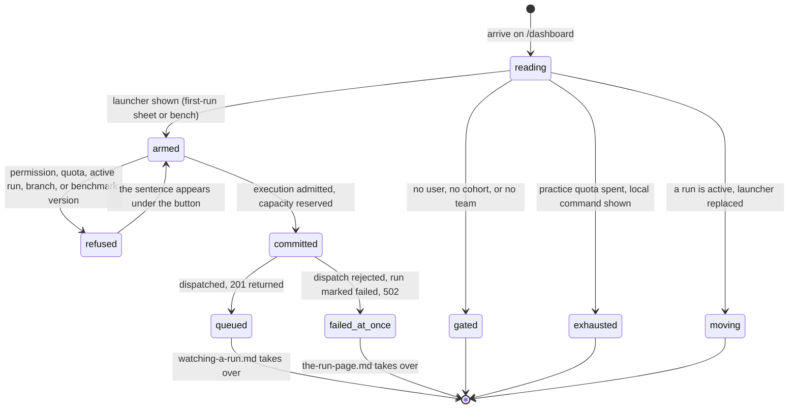

# Starting a practice run

## What this document owns

The route is `/dashboard`, labeled `Runs` in the header (`apps/portal/src/components/Shell.tsx:61`). This document owns the page's launcher and every state it can be in, from arriving on the page to the instant a run row exists: the branch select, the "Run practice benchmark" button, what replaces them when the quota is spent or a run is moving, and every way the ask can be refused before anything is written. It also owns the page's two shapes, the first-run sheet and the bench a team sees afterwards, because a student reads them before deciding to press anything.

It stops the moment the run row exists. [`watching-a-run.md`](watching-a-run.md) owns the `Running now` card, the run page while a run is moving, and the console at `/run-surfaces/:surfaceId`. [`the-run-page.md`](the-run-page.md) owns `/runs/:runId` once the run has finished. [`promote-to-the-leaderboard.md`](promote-to-the-leaderboard.md) owns the promotion block that can sit inside the `Latest run` card or beside it.

## Summary

Starting a practice run is one select and one button. The portal checks current repository access, resolves the branch to a commit and admits an execution. An active execution reserves capacity; only a completed evaluation uses one of the team's ten practice evaluations. See [credit and quota](../cross-cutting/credit-and-quota.md).

The page is scoped to one benchmark, chosen by index tabs above the title when more than one track is open (`apps/portal/src/routes/DashboardPage.tsx:105-111`). The title is the benchmark's own, with its version beside it, the team name above it and the benchmark summary under it (`:120-138`). A `?benchmark=` link opens that track, stores it as the choice and drops the parameter from the address (`:57-76`).

The page loads with one blocking request, `GET /api/dashboard?benchmark=`, which carries the benchmark, the team, the quota, the last resolved commit for the connected repository, the active run, the promotable candidate, the published selection and up to fifty runs (`apps/portal/worker/routes/dashboard.ts:33-140`). The branch list and the local reports load beside it and never block. Only the dashboard query repolls, every 2 seconds and only while its payload names an active run (`apps/portal/src/lib/queries.ts:43-50`).

The page has two shapes (`DashboardPage.tsx:172-175`). A team with no runs on this benchmark version gets one sheet, `Run it for the first time`. A team with runs gets the bench: the latest run in words, the launcher, the run history, then the standing facts at the foot. The component's own comment states the order: is a run moving, what did the latest run show, what can we do next, what have we done before (`:44-51`).

A practice run is the only kind this page starts. An official run exists only by promoting a practice run that succeeded; see [`../foundations/the-run.md`](../foundations/the-run.md).

## The simple case

### Before the first run

A student opens `/dashboard`. While the track list and the payload load, the page shows a loading mark reading `Loading` (`DashboardPage.tsx:97`, `:143`), which counts seconds once the wait passes three; see [`../cross-cutting/live-updates.md`](../cross-cutting/live-updates.md#the-loading-mark-names-its-own-wait).

A team with no runs gets the first-run sheet (`DashboardPage.tsx:676-744`). Its heading is "Run it for the first time", then "Nothing has run on {benchmark title} yet. There are two ways to start, and you can use both." (`:700-704`). Two sections follow:

- **"Here, from your pushed commit"**, with "A hosted run scores the commit your branch points to on GitHub. One that succeeds can be promoted to one of your {n} official attempts, which score the hidden set." (`:707-712`), then the launcher: a `Branch` select, the "Run practice benchmark" button, and "{left} of {limit} hosted practice runs left on this version; a run that fails doesn't count." (`:624-656`).
- **"On your machine, as often as you like"**, with "These need the CogWorks tool from Setup first. The commands already name this benchmark." (`:719-729`) and a code block carrying `cogworks check --benchmark {id}`, `cogworks run --benchmark {id}` and `cogworks sync` (`:731-739`).

A margin note beside the sheet reads "Both kinds of run score your code the same way. Local runs have no limit, so that's usually where the iteration happens." (`:691-692`). Under the sheet, a `For reference` strip shows only the repository and `Hosted machine` as `{runtimeVersion} · CPU · network off while scoring` (`:793-822`). Observed locally on fixture data in `/tmp/cogshots/matched/pairs/a-dashboard-first-desk.png` (right half, near `2ff32fa`).

### After the first run

The student presses the button. It goes busy. One `POST /api/runs/practice` carries the benchmark id and the branch (`apps/portal/src/lib/api.ts:247-251`). The server checks GitHub write access, resolves the branch to a forty-character commit, writes a run surface and a run row, lays down six empty phase rows, dispatches the job and answers `201` with the run id (`apps/portal/worker/routes/runs.ts:24-32`).

The button stays busy until the dashboard has refetched, because the mutation returns the invalidation promise so "the stale zero-run dashboard" is replaced before it lets go (`queries.ts:480-489`). The page then changes shape to the bench. The page does not navigate; the run opens from its card.

The bench, top to bottom (`DashboardPage.tsx:203-308`):

- **The lead card.** `Running now` while a run is active, `Latest run` otherwise, with a status chip, the run's title as a link ("Practice run on main"), and `Run #XXXX · {shortSha}` (`:356-373`). A finished run is described in words: a failure as the catalog title plus "Stopped at {phase} {time ago}. Failed runs don't use your hosted budget."; a success as "Finished {time ago}." with the primary metric as a small data line under it (`:428-460`). The link under it reads "Open the run", "See what went wrong" or "Read what it found" (`:347-353`).
- **"Start a practice run".** The launcher, with a margin note: "A hosted run scores the commit your branch points to, on our machine with the network off. Local runs score the same way with no limit, so that's usually where the iteration happens." (`:236-250`, `:311-313`). While a run is active the launcher is replaced by "Runs go one at a time on each benchmark, so the next one can start once this one finishes." (`:241-245`).
- **"Run history".** One row per run, newest first, with a count aside that reads `{n} runs` or `the latest 50` (`:252-270`). Eight rows show; the rest fold under "Show {n} earlier runs" (`apps/portal/src/components/RunList.tsx:11`, `:67-77`).
- **"Local reports"**, labeled "Self-reported, not promotable", only when a synced report exists or the query failed (`DashboardPage.tsx:277-304`).
- **"For reference".** Repository, hosted machine, `Last tested commit`, the two quotas drawn as tallies, and `On the leaderboard` when the team has a published selection (`:793-886`).

Observed locally on fixture data in `pairs/b-dashboard-desk.png` (right half).

Above everything, until setup is finished, sits the setup strip; see [`setup.md`](setup.md).

## The ask, event by event

```mermaid
stateDiagram-v2
    [*] --> reading : arrive on /dashboard
    reading --> gated : no user, no cohort, or no team
    reading --> exhausted : practice quota spent, local command shown
    reading --> moving : a run is active, launcher replaced
    reading --> armed : launcher shown (first-run sheet or bench)
    armed --> refused : permission, quota, active run, branch, or benchmark version
    refused --> armed : the sentence appears under the button
    armed --> committed : execution admitted, capacity reserved
    committed --> queued : dispatched, 201 returned
    committed --> failed_at_once : dispatch rejected, run marked failed, 502
    queued --> [*] : watching-a-run.md takes over
    failed_at_once --> [*] : the-run-page.md takes over
    gated --> [*]
    exhausted --> [*]
    moving --> [*]
```

### Asking

The click captures two things: the benchmark id and the branch.

The benchmark id is the one in the payload the page is showing, not whatever the tabs hold at that instant: "The dashboard payload is already scoped to the selected track, so its own benchmark id is the one to run; anything else would start a run the student isn't looking at" (`DashboardPage.tsx:602-605`).

The branch is remembered in module state, so it survives a run starting and ending and a track switch, and falls back to the repository's default branch when the remembered one is no longer offered (`:585-608`). It lasts until a reload.

Nothing is validated in the browser. The button fires on the first click; it is an ordinary button, not the arm-then-confirm `ConfirmButton` used for promotion, because a failed practice run costs nothing.

Nothing else is captured: no note on the run, no choice of split, and nothing the page shows about who pressed the button. The run surface records the starter; see [`watching-a-run.md`](watching-a-run.md).

The route gate runs first. `RequireStage stage="team"` sends a student with no session to `/signin`, no cohort to `/join`, and no team to `/connect` (`apps/portal/src/App.tsx:145-151`).

### Answered without work

**The controls are not there.** With the practice quota spent, the launcher is replaced by "All {limit} hosted practice runs on this version are used. Local runs score the same way and have no limit:" and a code block with `cogworks run --benchmark {id}` (`DashboardPage.tsx:612-622`). This replaced the earlier dead end; the sentence still does not say that a new benchmark version starts a new count.

**A run is moving.** The launcher is replaced by the one-at-a-time sentence above. Nothing to press.

Everything else comes back from the server as one sentence under the button (`DashboardPage.tsx:663-669`):

- **A run is already in progress.** `409 active_run_exists`. The server writes "A run is already active for this benchmark." (`apps/portal/worker/services/run-actions.ts:256`); the page rewrites it to "A run is already in progress; runs go one at a time per benchmark." (`DashboardPage.tsx:665-667`). This is the only code the page rewrites.
- **GitHub says no.** `403`: "Sign in to GitHub on Cog\*Portal before changing a run." with no stored token, "GitHub access expired. Sign in to Cog\*Portal again." when the permission lookup throws, "Current write permission to the connected repository is required." below write (`run-actions.ts:125`, `:135`, `:138`). Status, `f03ebfa` (2026-10-03): a throwing lookup is sorted by GitHub's answer. A 401 gives "GitHub no longer accepts this portal's sign-in for you. Sign out, sign in with GitHub again, and retry this action."; a 403 or 404 that is not a rate limit gives the write-permission sentence; anything else, rate limits included, is a `502` with "GitHub didn't answer the write-access check, so this didn't go through. Try again in a moment." (`run-actions.ts:149-161`).
- **The branch does not resolve.** `409`, "GitHub has no branch named {branch}." (`run-actions.ts:300-307`).
- **The quota is spent anyway.** `409 quota_exhausted`, "The practice-run quota is exhausted." when completed plus reserved evaluations reach ten (`run-actions.ts:257-259`). Status, `f03ebfa` (2026-10-03): it reads "All 10 hosted practice runs on this version are used. Local runs (cogworks run) have no limit." (`run-actions.ts:126-127`, `:311`). Reachable when a teammate's run completes between this page's last read and the click.
- **The hosted environment is not ready.** `409`, "This benchmark's hosted environment is not ready." when the benchmark row carries no sandbox contract (`run-actions.ts:262-266`).
- **The benchmark version is not active.** `409`, "That benchmark version is not active." (`run-actions.ts:158`). A dashboard load naming an inactive benchmark is a `404` with "Active benchmark not found." (`dashboard.ts:47`).

Each of these leaves no run row, no quota and no Discord message. All but one also leave no surface row. The exception is a race: the surface is written before the capacity-guarded run insert (see below), so when a concurrent start wins the active slot or the last place, this request is refused with `active_run_exists` or `quota_exhausted` after its surface row exists. Nothing publishes that surface, and nothing removes it. Read from code, not observed: while it is among the team's ten most recently updated surfaces, the Activity's surface list and `GET /api/run-surfaces` fail, because building its snapshot throws "Run surface has no run." (`apps/portal/worker/services/run-surfaces.ts:300`, `apps/portal/worker/routes/activity.ts:246-258`).

The page itself can fail before the launcher exists. A failed payload replaces the bench with a `QueryError` card and a "Back to start" link (`DashboardPage.tsx:144-151`). The card's label and sentence are chosen by what the student can do: `SESSION ENDED` with "Your session ended, so the portal no longer recognizes this browser. Sign in again to continue.", `COHORT REQUIRED`, `TEAM REQUIRED`, or `REQUEST DID NOT ARRIVE` (`apps/portal/src/lib/query-error-state.ts:84-160`).

### The work begins

The execution becomes durable when it is admitted. Closing the page does not cancel it.

Immediately before, the commit is resolved and frozen. Then a run surface is written with `onConflictDoNothing` (`run-actions.ts:312-330`). That surface is what the console, the Discord message and any later promotion hang off.

The run row is inserted with a capacity check in the same statement (`run-actions.ts:332-370`). A partial unique index makes two simultaneous starts behave like two sequential ones: one run, and `active_run_exists` for the loser (`:371-377`), or `quota_exhausted` when the winner took the last place, because the capacity check counts active runs (`run-accounting.ts:90-94`, `run-actions.ts:369`). Either way the loser's surface row, written just before, stays without a run. Then six empty phase rows (`:378`), the dispatch (`:379`), and the surface publish that posts or edits the Discord message (`:380`).

> Technical note: the run id is `run_` plus ten hex characters and the surface id `surface_` plus twenty (`run-actions.ts:312`, `:331`). The surface, the run, the phases and the dispatch are separate writes; a failure part way leaves what came before it.

### While it works

The button shows its busy state for one request plus the refetch. No optimistic row appears and the quota line does not move until the refetch lands. The GitHub permission check and branch resolution are round trips inside the request, and nothing on screen says the portal is waiting on GitHub.

Nothing else is disabled. A student can switch tabs or open a run while it works.

### How it ends

On success the refetched payload names an active run, so the bench appears with `Running now` and the launcher becomes the one-at-a-time sentence. For a team's first run this is the whole page changing shape. A visually hidden live region announces `{run title} is {status}` (`DashboardPage.tsx:197-210`).

On a dispatch failure that happened before anything reached Modal, the run is marked failed with category `provider`, phase `queued`, detail "The run could not be queued for Modal." and the button shows "The run could not be queued. Try again." (`run-actions.ts:205-227`). The record stays in history and uses no quota. A dispatch Modal may have accepted without acknowledging keeps its reservation until a callback or the stale-run sweep settles it (`:182-189`). `a6eef75` (2026-10-03): a hosted run is now admitted with the exact job it will be sent with. Its weights are chosen from the team's roster read once before the insert, so a member leaving afterwards no longer changes them, and an emptied roster no longer sends none. A weight or provenance refusal is answered before admission and writes no run, console or phases. A starter who is no longer on the team gets "You're no longer on this team, so no run was started. Reload to see where you are.", including when the leave lands between the request's checks and the insert, and a full practice allowance still gets the quota sentence (`apps/portal/worker/services/run-actions.ts`, `apps/portal/worker/services/run-accounting.ts`). Promotion and Retry are admitted the same way.

Retry for a failed execution lives in the run's console, not here; see [`the-run-page.md`](the-run-page.md#the-work-begins). Starting from this launcher always resolves the branch again.

## Modifiers

| Modifier | Set before the ask | Changed while it works |
| --- | --- | --- |
| Who you are | Signed out, no cohort, or no team: `RequireStage` redirects (`App.tsx:145-151`). Every member sees the same page. The server gate is current GitHub write access, checked live on every start (`run-actions.ts:118-142`), so a member removed from the repository sees a working button and is refused. The development fixture repository skips the check (`:122`). An instructor gets no extra control. | No effect. The permission check runs once, inside the request. |
| Where your team and repository stand | A team is created by connecting a repository. With no repository, the branch list is empty and `For reference` shows "No repository connected." (`DashboardPage.tsx:815`). `Last tested commit` is the newest run of the connected repository, matched on repository id, or "None recorded for this repository" (`:823-835`, `dashboard.ts:131-140`). | A teammate changing the repository invalidates the dashboard and branch list. A remembered branch the new list lacks falls back to the default (`DashboardPage.tsx:608`). |
| Which week's benchmark | The tabs choose the benchmark the whole page is about. The choice lives in `localStorage` under `cogportal.track` and defaults to the most recent open module (`apps/portal/src/lib/track.ts:14-20`). One open track draws no tabs (`apps/portal/src/components/TrackSwitcher.tsx:92`). The local commands name this benchmark's id. | Switching tabs mid-request does not cancel it; the run is the one the earlier payload named. The bench is keyed by benchmark, so a switch remounts it (`DashboardPage.tsx:153`). |
| Practice or leaderboard | This button always starts a practice run. Official runs come only from promotion. | A teammate's promotion makes a run active, so this request is refused with `active_run_exists`. |
| Flags, options, and where you are typing | The branch is the only option; there is no commit field. The CLI and the Activity reach the same service with an exact SHA; a run started that way with no branch records `detached` and is titled "… on commit {shortSha}" (`run-actions.ts:341`, `apps/portal/src/lib/run-meta.ts:27-29`). On a phone the page is one column and the controls do not change. | No effect. |

## Cancel and interrupt

| Event | Before the work begins | While it works |
| --- | --- | --- |
| You stop it yourself | Nothing to stop. The button has no armed state. | No way to abort from the page, and no cancel endpoint exists. Closing the tab does not stop the server. |
| You do something else mid-way | Navigating away leaves nothing behind. | The run is created and the browser never sees the response. The student finds it as `Running now` on the next visit. Two fast clicks give one run and `active_run_exists` (`run-actions.ts:371-377`). |
| A teammate acts at the same time | A page with no active run does not poll, so a teammate's start is invisible until a refetch. The refusal on click is the correction. | The active-run check and the unique index both run inside the request, so a second start is refused, not queued. |
| The network or the portal fails | A failed payload renders the `QueryError` card. A failed branch list now says so: "We couldn't load the branch list from GitHub, so only {branch} is offered. Reload the page to try again." (`DashboardPage.tsx:657-662`). A failed local-reports read prints "Synced local reports are temporarily unavailable. Hosted and official results are unaffected." (`:289-292`). | A request that never left the browser shows "Could not reach the portal. Check your connection and try again." (`apps/portal/src/lib/api.ts:71-76`) and nothing was written. A request that timed out on the way back may have written a run the student sees only after a reload. |
| The page or the process goes away | Nothing pending. | The run outlives the browser. A reload shows `Running now`. |
| The thing being measured changes | The branch list is fresh for five minutes (`queries.ts:125`), so a branch deleted inside that window is still offered; the start then fails with "GitHub has no branch named {branch}." | The commit is resolved once; a push one second later is not in this run. A version rolling over is refused with "That benchmark version is not active." |
| The platform refuses or credit runs out | A stale page may offer a start after a teammate's run used the last evaluation. Admission decides. | An active execution reserves capacity. Completion adds one; failure does not. |

## Interactions with other systems

**Who may do this.** Any team member with current write access to the connected repository, checked by the server on every start. The fixture repository skips the check (`run-actions.ts:122`).

**The team owns it.** The run belongs to the team. Nothing on this page names who started it.

**Credit.** Ten completed hosted practice evaluations per team and benchmark version; failures use none. The launcher says so in its count line, and a failed lead card says "Failed runs don't use your hosted budget." (`DashboardPage.tsx:445`).

**What the portal claims.** Only the resolved commit, shown as a copyable chip under `Last tested commit`. The local reports are labeled "Self-reported, not promotable" with a margin note: "We show them as they arrived and can't check them, so they stay off the leaderboard." (`DashboardPage.tsx:283-285`, `:318-324`). See [`../foundations/what-the-portal-claims.md`](../foundations/what-the-portal-claims.md).

**What the benchmark supplied.** Nothing yet. The page states the environment once, as `Hosted machine` (`DashboardPage.tsx:818-822`).

**Live updates and reconnection.** None while no run is active. See [`../cross-cutting/live-updates.md`](../cross-cutting/live-updates.md).

**Discord.** Starting a run publishes its surface (`run-actions.ts:380`), which posts the team's channel message when a channel is bound. Nothing on the page says so. See [`../discord/channel-messages.md`](../discord/channel-messages.md).

**Configuration.** `PRACTICE_LIMIT` is 10 and `OFFICIAL_LIMIT` is 3 (`packages/contracts/src/schema.ts:1519-1520`). Under `EXECUTION_PROVIDER=fixture` a `Simulated` chip sits beside the team name (`DashboardPage.tsx:125`) and results are scripted.

## Edge cases

- **Run titles repeat; the tag tells them apart.** Rows lead with "Practice run on {branch}" and carry `Run #XXXX`, the last four characters of the id, as the record (`RunList.tsx:111-127`). Two tags can still collide.
- **A run still moving has an empty reading column.** The row prints the primary metric, the failure's code, or nothing (`RunList.tsx:93-100`).
- **A row names its repository only when it differs** from the connected one, or reads "source not recorded" (`RunList.tsx:119-125`).
- **The quota resets on a version bump.** Accounting is per benchmark version (`dashboard.ts:61-63`); the exhausted sentence does not say so.
- **The history shows at most fifty runs** and says `the latest 50` when full (`DashboardPage.tsx:257-261`, `dashboard.ts:93`).
- **A run that finishes while the page is open is marked once.** Its sentence gets a highlighter stroke drawn left to right, already drawn under reduced motion (`DashboardPage.tsx:81-95`, `:462-486`).
- **The first-run sheet does not show the official count in the launcher line.** It names it in the sentence above the launcher instead; the bench shows both as tallies under `For reference`.
- **A run started from the CLI or Discord has no marker** in the history beyond a `detached` title when it had no branch.

## Open questions and verification

- Whether a team reads the first-run sheet as the whole page was not observed with anybody. The local fixture screenshot shows it renders. **Unverified** beyond `pairs/a-dashboard-first-desk.png`.
- The page still does not navigate to the run it started; the lead card is the signal. Whether that is enough on a first run, where the whole page reshapes, was not observed.
- The first-run sheet's command block assumes a linked device for `cogworks sync` and does not name `cogworks link`; it points at Setup instead (`DashboardPage.tsx:725-729`).
- `cancelled` is in every status enum and the lead card has a sentence for it (`DashboardPage.tsx:457`), but nothing writes it. Carried to triage (B-37).
- A GitHub outage stops every hosted start behind a sentence about the student's own access, because the permission check runs first (`run-actions.ts:128-136`). Not observed. Status, `f03ebfa` (2026-10-03): an outage or rate limit now says GitHub didn't answer and to try again (`run-actions.ts:156-160`); read from code and `apps/portal/test/rpc-refusals.test.ts`, no real outage or rate limit observed.
- No hosted start from this page was observed on this build. The hosted beta run `run_f5fc5babe5` was started on beta's pre-redesign dashboard.
- Hosted beta (`4984730`) differs: its dashboard is the panel grid `FIRST RUN`, `START A RUN`, `CURRENT RUN`, `RUN LOG`, `CONNECTED SOURCE`, `ATTEMPT BUDGET` (beta `apps/portal/src/routes/DashboardPage.tsx:148`, `:161`, `:200`, `:373`, `:457`, `:515`); the candidate replaces it with the bench (`DashboardPage.tsx:203-308`).
- Integrated `93dfa5e` source differs on the admission race (`0a7335b`): the capacity-guarded run, its console and its phases are written in one D1 batch, with the console inserted only if the run was (`apps/portal/worker/services/run-actions.ts:382`). A refused start therefore writes nothing. The portal and Activity console lists also select only consoles that have a run or a local session (`apps/portal/worker/services/run-surfaces.ts:573-600`). The systems owner checked this over local HTTP on `0a7335b`, with the fixture provider and synthetic data. With nine accepted practice runs, two concurrent starts returned one `201` and one `409 quota_exhausted` and left no runless console. With eleven newer runless consoles inserted, both lists returned `200` with only the real console. Neither a hosted race nor `93dfa5e` itself was exercised.

Read against Cog\*Portal commit `2ff32fa`.
