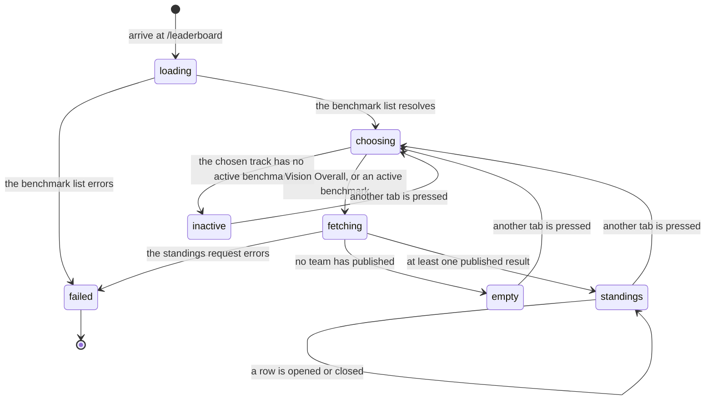

# The leaderboard

## Summary

The leaderboard is the only page in Cog\*Portal that shows one team's work to another team. It lists every team that has published an official result for a benchmark, ranked, with the primary metric on each row and everything else folded away behind a disclosure. Opening a row reveals the supporting metrics, the commit, the completion time, and a link to the team's repository.

Two kinds of team sit on the board. A *live* team is one whose members signed in and published. An *archive* team is a 2026 team scored after the course from its repository as it was left, under a replaced name; it exists so that a board is populated from day one of a cohort and so a live team has something to stand next to. The distinction is a column on the team (`teams.provenance`, `apps/portal/migrations/0034_team_provenance.sql`), it travels with every leaderboard entry (`packages/contracts/src/schema.ts`, `LeaderboardEntrySchema.provenance`), and it decides what the row may disclose.

It lives at `/leaderboard` and is public. No gate wraps it in `App.tsx` (`apps/portal/src/App.tsx:96`), and both of its endpoints read the session with `getAuth`, which returns null rather than throwing when nobody is signed in (`apps/portal/worker/routes/leaderboard.ts:28`, `:38`). A signed-out visitor sees the same standings a student does, minus the `YOU` marker on their own row.

The page is organized by module rather than by benchmark: three top tabs, Vision, Language, and Audio, and for Vision a second row of tabs choosing Overall, Recognition, or Clustering. Overall is not a benchmark. It is a family: a weighted combination of three metrics drawn from two separate published runs, admitted only when both came from the same commit.

## The simple case

A student opens `/leaderboard` and lands on Vision, Overall, because those are the initial values of both pieces of state (`apps/portal/src/routes/LeaderboardPage.tsx:28`, `:29`). The heading reads "Vision". Under the tabs, a header row labels three columns, Rank, Team, and the primary metric's own label, and then the standings.

Each row is one button: a two-digit rank, the team name, the primary metric formatted to its declared precision, and a chevron (`:250`). Rank 01 is drawn in the detector accent; every other rank is plain ink (`:258`). The student's own team, if they have one, is tinted and carries a small `YOU` tag (`:248`, `:270`).

Pressing a row unfolds it. The team description appears first if there is one, then the supporting metrics as label and value pairs, then `Commit` with the seven-character short SHA (full SHA in the title attribute), `Completed` as a local date and time, and `Repository` as a link with the `https://github.com/` prefix stripped (`:302`, `:313`, `:325`).

An archive row reads differently. Beside its name sits the kicker `2026 cohort, anonymized`, and its disclosure has no `Commit` and no `Repository`: the read model blanks both before the entry leaves the server (`apps/portal/worker/services/leaderboard.ts`, the two `provenance === "archive"` branches), because the link names a GitHub account and a commit SHA resolves to its repository through GitHub's commit search, and either would make the kicker false. When at least one archive row is on the board, one sentence under the list says what they are: "Archive rows are 2026 teams scored after the course from their repositories as they left them, with names replaced." A test pins the blanking on both fields and on the whole serialized entry (`apps/portal/test/leaderboard-archive.test.ts`).

Under the list, one line of small type states what the board is and its one rule. For a single benchmark: "{benchmark id} / v{version}. Each team publishes one selected official result." (`:176`). For Overall: "vision-overall / v1. All three components must come from selected official runs at the same repository and commit." (`:190`).

The column header carries the primary metric's label, read from the first entry (`:202`). On an empty board there is no first entry, so the header is never drawn at all: the empty state replaces the whole table. That is why the fallback string `"Score"` on the same line is unreachable in practice.

An inactive track reads "{title} is in progress. Standings open when the track is calibrated." (`:153`) and an empty one reads "No official results are published yet. Check again after teams publish their results." (`:207`). Both are rendered inside the same bordered frame, so the two conditions look alike and differ only in sentence. That is the right distinction to make in words: one says the track is not open, the other says the track is open and nobody has finished.

## The ask, event by event

### Asking

Arriving is the ask, and it is answered in two requests rather than one.

The first is `GET /api/benchmarks`, which returns every benchmark row the database holds, ordered active first, then by module, then by title (`apps/portal/worker/services/catalog.ts:12`). The page uses it for three things: which module tabs to annotate, which benchmark id belongs to a chosen tab, and the title in the heading.

Which benchmark that second request names is worked out in the page. For Language and Audio, it is the first active row for that module, falling back to the first row of any kind so that an inactive benchmark's title is still available for the empty state (`LeaderboardPage.tsx:34`). For Vision, two named lookups run instead: `vision-recognition` and `vision-clustering`, each required to be active (`:39`). The sub-tab then picks between them, and Overall falls through to `recognition` for the heading while the body ignores that choice entirely (`:41`).

The second request depends on the tab. Vision Overall asks `GET /api/leaderboard-family?family=vision-overall`. Everything else asks `GET /api/leaderboard?benchmark={id}`. Both are cached for 30 seconds and neither polls (`apps/portal/src/lib/queries.ts:94`, `:102`).

Nothing about the ask depends on who is asking except one field. `isYou` is computed server side by comparing the row's team against the caller's, if the caller has one (`apps/portal/worker/services/leaderboard.ts:87`).

> Technical note: the two leaderboard endpoints call `getAuth`, which returns null for an unauthenticated request, rather than `requireTeam`, which throws. That one choice is what makes the page public. Everything else on the route is identical for a signed-in and a signed-out caller, and the response carries no marker saying which it was.

### Answered without work

Four short paths, none of which record anything.

- A failed benchmark list. The whole body becomes a `QueryError` card with a retry button (`LeaderboardPage.tsx:147`).
- A failed standings request. Same card, scoped to the list rather than the page, so the tabs stay usable (`:169`, `:185`).
- A track with no active benchmark. An empty state: "{title} is in progress. Standings open when the track is calibrated." (`:153`). The title falls back to the tab label when there is no benchmark row at all.
- A board with no published results. An empty state: "No official results are published yet. Check again after teams publish their results." (`:207`).

The page never writes anything. There is no vote, no follow, no filter that persists, and no state saved between visits. Reloading returns to Vision Overall regardless of what was open before.

### The work begins

There is no such moment. The leaderboard is a read.

The moment that puts a team on it happens elsewhere. `PUT /api/leaderboard-selection` writes one row into `leaderboard_selections` for the team, the benchmark id, and the benchmark version, and it refuses anything that is not a succeeded official run: "Only a succeeded official run can be published." (`apps/portal/worker/services/run-actions.ts:426`). That act is described in [`promote-to-the-leaderboard.md`](promote-to-the-leaderboard.md).

The table's primary key is `(teamId, benchmarkId, benchmarkVersion)` (`apps/portal/worker/db/schema.ts:618`), and publishing again overwrites the row rather than adding one (`run-actions.ts:437`). That is the whole of the "one selected official result" rule the footer states: it is a database constraint, not a check in the read path.

### While it works

Nothing streams. The two queries resolve, the list renders, and the page sits still.

Rows animate in with a short rise, staggered by 35 milliseconds up to the eighth row, and every animation collapses to zero duration under a reduced-motion preference (`LeaderboardPage.tsx:243`, `:246`). Opening a row animates its height; the padding sits on an inner element so the animated wrapper does not fight it (`:301`). The active tab's underline is a shared layout element that slides between tabs, drawn in the module's own accent, with a comment explaining why the color is not fixed: "Underlining the Language tab in detector red would say 'vision' while reading Language." (`:84`).

Switching between Recognition and Clustering remounts the list with a key on the benchmark id (`:157`), so every open disclosure closes. Switching to Overall does not remount, because `OverallStandings` takes no key.

### How it ends

The page has no end. It is a view, and it stays until the student leaves.

What a student takes from it is the same set of facts for every board: a rank, a team name, one number, and on request four or five more. Nothing on it links to a run. The repository link is the only way out of the page toward another team's work, and it leaves the portal entirely.

That absence is worth naming. A rank on this page cannot be opened into the run that produced it, not even by the team that owns it. The commit is shown, the repository is linked, and the run itself is unreachable from here. A student who wants to know how a number was reached has to go through their own dashboard, and can only do that for their own team, which is the correct scope but leaves the leaderboard as the one page in the product where a number appears with no path to the finding underneath it. That runs against the platform's stated stance, which is to lead with what a run shows rather than what it scored (`docs/design/the-instrument-not-the-judge.md`). A leaderboard is the one place where the score is the point, so the tension is deliberate; it is recorded here because the page is the exception rather than the rule.

## What the Overall standings actually require

The Vision Overall board is the only place on the platform where one number is assembled from more than one run, and its admission rule is stricter than a reader would guess from the tab.

The family declares three components, each naming a benchmark id, a benchmark version, a metric key, and a weight. All three carry a weight of one third: `known_identification` and `unknown_lifecycle` from `vision-recognition` version 2, and `clustering_pairwise_f1` from `vision-clustering` version 2 (`apps/portal/migrations/0013_week2_vision.sql:56`). Three components, drawn from two published runs.

A team is admitted only when all of the following hold.

1. It has a published selection on every required track, meaning both `vision-recognition@2` and `vision-clustering@2`. Missing either drops the team silently (`apps/portal/worker/services/leaderboard.ts:167`).
2. Every one of those runs carries a non-null repository id, and all of them share the same `(repositoryId, sha)` pair (`apps/portal/worker/services/benchmark-family.ts:11`). A null repository id fails the check outright, even when every other value matches.
3. Every declared component metric exists on its run. A missing metric drops the team (`leaderboard.ts:180`).

The score is then the weighted sum of the three component values (`benchmark-family.ts:20`), reported as a synthetic metric with key `overall`, label "Overall", precision 3, and higher-is-better (`leaderboard.ts:198`). No run produced that number; the read model computed it. The three components become the supporting metrics, relabelled with the family's own labels rather than the benchmark's (`:207`). The completion time is the latest of the contributing runs (`:213`).

The same-commit rule is what the tab is really for. Two runs from two different commits would let a team publish their best recognition result from one afternoon and their best clustering result from another, and call the combination one submission. Requiring one commit makes Overall a claim about a single state of the repository. Tests pin all four cases of the check, including that two null repository ids do not count as matching (`apps/portal/test/benchmark-family.test.ts:8`).

None of that is visible from the page. A team that has published both component results at different commits is simply absent from Overall, exactly like a team that published neither. There is no "you are not eligible yet" row, no count of how many teams were excluded, and no way from this page to find out which of the three conditions a team failed. The footer names the rule; nothing applies it to the reader.

The weights are also invisible. All three are one third today, so the Overall number is the mean of its three components, but nothing on the page says so and a future family could weight them differently without the page changing at all.

## Modifiers

| Modifier | Set before the ask | Changed while it works |
| --- | --- | --- |
| Who you are | Signed out, signed in, student, or instructor, the standings are identical. The only difference is the `YOU` tag and row tint, which need a team (`leaderboard.ts:87`). There is no instructor view, no hidden column, and no per-person number anywhere on the page, which is the platform's hardest rule (see [`foundations/what-the-portal-claims.md`](../foundations/what-the-portal-claims.md#no-per-person-numbers)). | Signing in in another tab does not repaint this one. The 30 second stale time means the `YOU` tag appears on the next refetch at the earliest. |
| Where your team and repository stand | A team with no published result is not on the board and gets no placeholder saying so. A team that has published sees itself tinted. A repository change does not move a published result: the row carries the run's own SHA and the team's current repository URL, which can therefore point somewhere the result did not come from. | A teammate publishing a result while the page is open does not appear until a refetch. There is no live update and no notice. |
| Which week's benchmark | The tabs are the modifier. Vision, Language, and Audio come from a fixed list in the page (`LeaderboardPage.tsx:17`), not from the benchmark data, so a fourth module would need a code change. Within Vision, three sub-tabs choose between the family and its two component benchmarks. | Switching a tab issues a new query at once. Switching between Recognition and Clustering also closes every open row, because the list is keyed on the benchmark id (`:157`). |
| Practice or leaderboard | Only official, published results appear. A practice run cannot reach this page at all, and a self-reported local report cannot either. This is the sharpest use of the distinction in the product: the leaderboard is the definition of "leaderboard" in [`foundations/the-run.md`](../foundations/the-run.md). | No effect. Publishing is a separate act on a separate page. |
| Flags, options, and where you are typing | No query parameters are read. `/leaderboard?benchmark=x` is ignored; the tabs are component state. The API accepts `?benchmark=` and `?family=` directly, and `/api/leaderboard` with no parameter answers with whichever active benchmark has the highest version number, which is a different question from "the current one". | Nothing to change. The browser's back button does not step between tabs, because no tab writes to history. |

## Cancel and interrupt

| Event | Before the work begins | While it works |
| --- | --- | --- |
| You stop it yourself | Leaving the page cancels two reads that changed nothing. | Same. Closing an open row is local state and costs nothing. |
| You do something else mid-way | Switching tabs abandons the in-flight query for the old tab; TanStack Query keeps its result cached under its own key, so switching back is instant for 30 seconds. | Same. Two tabs of the leaderboard are independent and can disagree for up to 30 seconds. |
| A teammate acts at the same time | A teammate publishing before the page loads puts the team on the board on arrival. | A teammate publishing, or republishing over the team's existing row, does not reach an open page. The board a student is looking at can be stale by any amount, with nothing marking it. |
| The portal fails | A failed benchmark list replaces the whole body with a card; the tabs go with it. | A failed standings request replaces only the list, so the tabs survive and another track can be tried. Both cards offer a retry, because a repeated request can genuinely answer differently (`apps/portal/src/lib/query-error-state.ts:87`). A 404 does not: the card for "Benchmark not found." says "The portal has no record at this address. Trying again will return the same answer." and shows no retry button (`:113`). |
| The page or the process goes away | Nothing to lose. | Nothing to lose. Reload returns to Vision Overall with every row closed. |
| The thing being measured changes | A benchmark version bump changes which rows the board can see. `getLeaderboardReadModel` resolves the highest version of the id and then filters selections to exactly that version (`leaderboard.ts:36`, `:54`), so every result published against the previous version disappears from the board the moment the new row is inserted. The results still exist; the board stops asking about them. | Same, on the next refetch. Nothing announces it. A student watching a board that emptied has no way to learn why. |
| The platform refuses or credit runs out | Credit is not consulted and no quota is shown. The page costs nothing to read. | No effect. |

## Interactions with other systems

**Who may do this.** Anyone, including a browser with no session. This is the only route in the product with no gate and no authenticated read, and it is deliberate: a leaderboard nobody outside the cohort can see is not a leaderboard.

**The team owns it.** Every row is a team: a team name, a team description, a team repository. There is no member list, no author, and no per-person figure, in keeping with [`foundations/what-the-portal-claims.md`](../foundations/what-the-portal-claims.md#no-per-person-numbers). The commit is the only identifier on the row that points at a moment rather than a group.

**Credit.** None spent here. Reaching the board costs one official attempt, spent when the run is promoted, not when it is published. Publishing is free and repeatable: a team with three official attempts can publish and republish among them as often as they like, because the cost was paid upstream. See [`../cross-cutting/credit-and-quota.md`](../cross-cutting/credit-and-quota.md).

**What the portal claims.** Everything on this page is a hosted, verified number. Self-reported results cannot appear, refusals cannot appear, and a run with no primary metric is dropped rather than shown as blank (`leaderboard.ts:74`). The Overall column is the one number here the portal computed rather than measured, and nothing on the page says so.

**What the benchmark supplied.** Not disclosed on this page. The supporting metrics are the benchmark's own, with their own labels and precisions, and no floor or role annotation reaches the leaderboard: `formatMetricValue` prints a value and an optional unit, nothing else (`apps/portal/src/lib/format.ts:3`). A metric that is a floor on a run page is an ordinary number here.

**Live updates and reconnection.** None. Two queries, a 30 second stale time, no polling, no socket. Refetch on window focus is off for every query in the app (`apps/portal/src/lib/queries.ts` is configured from `App.tsx:27`), so returning to a parked tab does not refresh it either. This is the least live surface in the portal, on a page whose content changes only when other people act.

**Discord.** Nothing on this page is posted anywhere. Publishing a result may produce a channel message; that belongs to [`../discord/channel-messages.md`](../discord/channel-messages.md).

**Configuration.** The family id is hardcoded in the page as `vision-overall` (`LeaderboardPage.tsx:182`) and defaulted to the same string in the route (`apps/portal/worker/routes/leaderboard.ts:44`). The three module tabs are a literal in the page. Everything else comes from the database: which benchmarks exist, which are active, their titles, their versions, and the family's components and weights. Adding a module means editing this file; opening a benchmark means one row.

## Edge cases

- **An open row follows its team, not its rank.** Rows are keyed by team name, commit, and completion time (`LeaderboardPage.tsx`, the `EntryRow` key), so a refetch that reorders the standings carries an open disclosure with the team it describes. It used to be keyed by rank, which moved the open panel to whichever team took that position.
- **Archive rows are not stored anonymized; they are served anonymized.** The repository columns on `teams` are `NOT NULL` and a run needs a `sha`, so the staging seed stores a placeholder repository (`archive/<slug>`, an empty URL) and a digest in place of the commit (`apps/portal/scripts/seed-staging-archive.sql`). The read model then blanks both fields anyway. Two layers, and the second is the one the test pins, because the first is a property of one seed file and the second is a property of the product.
- **Archive teams are off the staff triage list.** The admin overview selects live teams only (`apps/portal/worker/routes/admin.ts`, `/admin/overview`). Eight memberless teams that will never run would otherwise sort to the top as "no hosted runs".
- **The `aria-controls` id is the rank too.** Two boards never render at once, so the ids do not collide today (`:253`).
- **A published run with no primary metric vanishes.** The read model skips any selection whose run has no primary metric or no finish time (`leaderboard.ts:74`). The team is not told, and the board does not say a row was dropped.
- **Ties break by who finished first.** Sorting is by the primary metric in its declared direction, then by ascending completion time (`leaderboard.ts:90`). The family board hardcodes descending score with the same tiebreak (`:217`).
- **The repository link can outlive the result.** `repoUrl` comes from the team record, not from the run (`leaderboard.ts:79`), so a team that changed its repository shows a link to the new one beside a commit from the old one.
- **The Overall board pins component versions.** The family's components name `vision-recognition@2` and `vision-clustering@2` explicitly (`0013_week2_vision.sql:58`). Publishing a version 3 result satisfies neither, so a version bump on either benchmark empties the Overall standings until the family is migrated too.
- **Every value is formatted by its own metric.** `formatMetricValue` uses the metric's declared precision and appends its unit when it has one (`format.ts:3`). The synthetic Overall metric declares precision 3 and no unit, so it always prints three decimals.
- **The heading is not the benchmark's title on Vision.** It is the literal "Vision" whenever the Vision tab is selected, regardless of sub-tab (`LeaderboardPage.tsx:53`). Recognition and Clustering therefore share a heading, and the only thing naming the board is the footer under the list.
- **A team with no description simply has fewer rows in its disclosure.** The description block renders only when present (`:303`), and nothing marks its absence. A team that never wrote one is indistinguishable from one whose description failed to load.
- **The `Repository` row is the only optional field with a reason to be missing.** It renders only when `repoUrl` is set (`:315`). Every other field in the disclosure is unconditional, so a row with no repository link is a row three lines shorter with no explanation.
- **Rank is zero padded to two digits.** `String(entry.rank).padStart(2, "0")` (`:262`), so first place reads `01` and a hundredth team would read `100`, breaking the column's alignment. A cohort large enough to reach three digits was not considered.
- **The primary metric's direction is the metric's, not the board's.** Sorting reads `higherIsBetter` off the primary metric and flips the comparison (`leaderboard.ts:91`). A benchmark whose primary metric is a loss would rank ascending with no visible sign that it did.
- **The family board's sort is hardcoded descending.** Overall does not consult `higherIsBetter` (`leaderboard.ts:217`), which is correct for the synthetic metric it builds and would be wrong for any future family whose components were losses.
- **Two rows can share a rank number only if two runs finished in the same millisecond.** Ranks are assigned by index after sorting (`leaderboard.ts:95`), so ties are broken silently rather than shared. Two teams with identical scores get different ranks and nothing says the gap is arbitrary.
- **Publishing overwrites rather than appends.** A team that publishes a worse result over a better one has no undo on this page, and the board shows the newer number. The constraint that makes this true is the table's primary key (`schema.ts:618`).
- **The two boards share one row component.** `StandingsTable` is given entries and a footer and knows nothing about which query produced them (`LeaderboardPage.tsx:195`), which is why the Overall board's synthetic metric renders exactly like a measured one.
- **Reduced motion removes the stagger, not the order.** With the preference set, rows appear at once with no rise and the tab underline jumps rather than slides (`:241`, `:88`). Nothing about the content changes.

## Open questions and verification

- **A track annotated "in progress" is still clickable.** `available` is computed for every tab and used only to render the annotation; the button carries no `disabled` and no guard (`LeaderboardPage.tsx:60`, `:65`). Pressing an inactive tab sets the module and falls through to the empty state, so the outcome is harmless, but the page offers a control it has already labelled as not ready. Worth treating as a bug.
- **Vision Overall fires its query whether or not the components exist.** The body renders `OverallStandings` on the sole condition `module === "vision" && visionView === "overall"` (`:148`), before the check that would have caught an inactive benchmark. With neither vision benchmark active, the page still requests `/api/leaderboard-family?family=vision-overall` and shows the generic "No official results are published yet." rather than the "in progress" sentence the other tracks would give. Worth treating as a bug, and it is the first thing a visitor hits, because Overall is the landing tab.
- **The Vision tab reads "in progress" unless both vision benchmarks are active.** `available` for Vision is `Boolean(recognition && clustering)` (`:62`), so a cohort running Recognition alone sees the Vision tab annotated as not ready while its Recognition standings work. The annotation describes the family's readiness and is attached to the module.
- **An unreleased benchmark's title and summary are public.** `listBenchmarks` applies no `active` filter (`apps/portal/worker/services/catalog.ts:9`), `/api/benchmarks` has no authentication (`apps/portal/worker/routes/benchmarks.ts:11`), and the worker installs no auth middleware over `/api/*` (`apps/portal/worker/index.ts:49`). Anyone can read the title and summary of next week's benchmark before it opens, and the page itself prints an inactive benchmark's title in its empty state (`LeaderboardPage.tsx:153`). Worth treating as a bug: whether the titles are sensitive is a course decision, but the endpoint currently makes it for the course.
- **`?benchmark=` ignores `active` and takes the highest version.** With a benchmark id supplied, the read model filters on the id alone and orders by version descending (`leaderboard.ts:31`). Every other version resolution in the codebase pairs the id with `active` (`apps/portal/worker/routes/dashboard.ts:34`, `run-actions.ts:195`). The consequence is that a standings request can resolve to a version nobody is allowed to run against. Worth treating as a bug.
- The no-parameter branch of the same function orders every active benchmark by version and takes the first (`leaderboard.ts:41`), so `/api/leaderboard` answers with whichever active benchmark happens to carry the highest version number, across all modules. The page never takes this path; a direct API caller does.
- Whether the row stagger and the height animation feel right at twenty rows was not observed. **Unverified**: no browser was opened for this pass.
- Whether a student reads the Overall number as measured rather than computed was not tested. Nothing on the page distinguishes it from a benchmark's own primary metric, and the footer's phrasing describes the admission rule rather than the arithmetic.
- Whether two active versions of one benchmark id can exist at once was not established from the migrations. If they can, the client's `find` picks by list order while the server picks by version, and the two could name different rows.
- Nothing on the page distinguishes a board that is empty because nobody published from a board that emptied because the benchmark version moved. Both render the same sentence. A version bump is the more alarming of the two and gets no acknowledgement.
- The leaderboard does not poll, on a page whose entire content is other people's actions. Whether a student leaves it open expecting it to move was not observed. **Unverified.**
- Whether a signed-out visitor should see team names and repository links at all is a course decision the code has already made. It is recorded here because the page is the only unauthenticated read in the product.
- The three module tabs are a literal in the page rather than derived from the modules present in the benchmark list (`LeaderboardPage.tsx:17`). A cohort running a subset still sees all three, annotated. Whether that is a feature (the shape of the course, visible from week one) or an oversight is a product call.

Verified against Cog\*Portal commit `5059e1f` plus the archive provenance change in flight on 2026-09-05.
