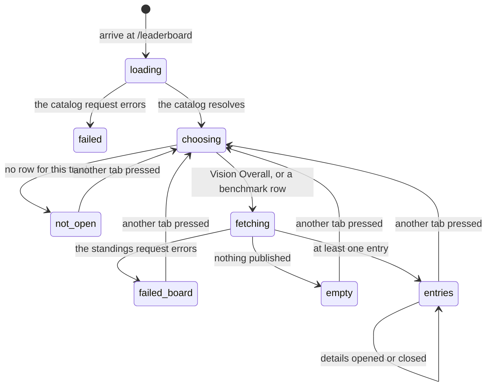

# The leaderboard

## Summary

The leaderboard is the one page where a team's work is shown to other teams. It lists, for one benchmark at a time, the official result each team chose to publish, as a column of entries: the team's name, the team's own description of its approach, then the primary metric in small mono type. Everything else (supporting metrics, commit, completion time, repository) unfolds under a "Details" button.

The page answers to `docs/design/the-instrument-not-the-judge.md`, so it has no rank column and no medal. Its margin note says so: "Entries follow the published score, without rank numbers. A few thousandths between two teams says less than what each one tried." (`apps/portal/src/routes/LeaderboardPage.tsx:195`). The entries still arrive in score order from the server.

Two kinds of team appear. A *live* team signed in and published. An *archive* team is a 2026 team scored after the course from its repository as it was left, under a replaced name, so a board is populated before a cohort publishes anything (`teams.provenance`, `apps/portal/migrations/0034_team_provenance.sql`). An archive entry discloses less.

The page lives at `/leaderboard` and is public. No stage gate wraps it (`apps/portal/src/App.tsx:111`), and both endpoints read the session with `getAuth`, which returns null for a visitor rather than refusing (`apps/portal/worker/routes/leaderboard.ts:28`, `:38`). A signed-out visitor sees the same entries a student does, without the "Your team" mark. Observed locally on fixture data, signed out, in `/tmp/cogshots/matched/pairs/b-leaderboard-language-desk.png` and `b-leaderboard-vision-desk.png`.

The page is organized by module: three tabs, Audio, Vision and Language, in the order the course runs them (`LeaderboardPage.tsx:24`, `apps/portal/src/lib/track.ts:19`). Vision has a second row choosing Overall, Recognition or Clustering. Overall is not a benchmark; it is a weighted combination of three metrics from two published runs, admitted only when both came from one commit.

## The simple case

A student opens `/leaderboard` from the header. With no `?benchmark=` in the address, the page opens on Audio, the first track (`LeaderboardPage.tsx:62`). The header reads "Published results", then the benchmark's title, then "Each team chooses one official run to show the cohort. Read an entry for what the team tried; its numbers sit underneath." (`:102`, `:104`). The benchmark's one-line summary sits above the entries.

Each entry is a heading with the team name, the team description if it has one, and a line such as `Overall 0.431 · Sep 30` with a "Details" button (`:371`, `:389`, `:401`). The student's own team carries a highlighter mark reading "Your team" (`:375`). Pressing "Details" opens a small table: each supporting metric, `Commit` with the short SHA (full SHA on hover), `Completed` as a local date and time, and `Repository` as a link with `https://github.com/` stripped (`:418`, `:422`, `:424`, `:436`). The button becomes "Hide details".

An archive entry has the note "2026 cohort, anonymized" beside its name (`:379`), and its details have no commit and no repository: the server blanks both (`apps/portal/worker/services/leaderboard.ts:95`, `:98`), because the link names a GitHub account and a commit resolves to its repository through GitHub search. When any archive entry is on the board, a sentence under the list explains: "Archive entries are 2026 teams scored after the course from their repositories as they left them, with names replaced." (`LeaderboardPage.tsx:332`).

Under the list, one mono line names the board and its rule: "{benchmark id} / v{version}. One selected official result per team." (`:275`).

A team arriving from its own published run follows "See it on the leaderboard" or "See the leaderboard", which carry `?benchmark={id}` and open that benchmark's tab, including the right Vision sub-tab (`apps/portal/src/routes/RunDetailPage.tsx:710`, `LeaderboardPage.tsx:59`, `:70`).

## The ask, event by event

```mermaid
stateDiagram-v2
    [*] --> loading : arrive at /leaderboard
    loading --> failed : the catalog request errors
    loading --> choosing : the catalog resolves
    choosing --> not_open : no row for this track
    choosing --> fetching : Vision Overall, or a benchmark row
    fetching --> failed_board : the standings request errors
    fetching --> empty : nothing published
    fetching --> entries : at least one entry
    entries --> entries : details opened or closed
    not_open --> choosing : another tab pressed
    empty --> choosing : another tab pressed
    entries --> choosing : another tab pressed
    failed_board --> choosing : another tab pressed
```

### Asking

Arriving is the ask, answered in two requests.

The first is `GET /api/benchmarks`, which returns every catalog row, active or not, active first (`apps/portal/worker/services/catalog.ts:12`). The page uses it to choose the board, annotate tabs and title the page. It is cached for five minutes (`apps/portal/src/lib/queries.ts:39`).

For Audio and Language the board is the module's first active row, or its first row of any kind when none is active (`LeaderboardPage.tsx:78`). For Vision, Recognition and Clustering each require an active row (`:83`, `:84`). A tab is annotated "in progress" when its track has no active benchmark; Vision needs both of its benchmarks active to lose the annotation (`:116`, `:136`).

The second request depends on the tab: `GET /api/leaderboard-family?family=vision-overall` for Vision Overall, `GET /api/leaderboard?benchmark={id}` otherwise. Both are cached for 30 seconds and never poll (`queries.ts:104`, `:112`). The server sets `isYou` by comparing each entry's team to the caller's, when there is one (`leaderboard.ts:105`); the page shows it only after the account has been confirmed on a returning tab (`LeaderboardPage.tsx:357`).

> Technical note: the server resolves `?benchmark={id}` to that id's highest version without checking `active` (`apps/portal/worker/services/leaderboard.ts:33`). The page chose the row by `active`, so the two can name different versions of one benchmark.

### Answered without work

None of these records anything:

- **The catalog fails.** A `QueryError` card replaces the board, with a retry (`LeaderboardPage.tsx:212`). The tabs stay.
- **The standings fail.** The same card in the board's place (`:261`, `:290`). Another tab can be tried. A 404 card says "The portal has no record at this address. Trying again will return the same answer." and has no retry (`apps/portal/src/lib/query-error-state.ts:110`).
- **The track has no catalog row, or the Vision sub-tab's benchmark is inactive.** "{Track} is in progress. Standings open when the track is calibrated." (`LeaderboardPage.tsx:217`).
- **An inactive benchmark with no entries.** "{title} is in progress. Standings open when the track is calibrated." (`:279`).
- **An inactive benchmark with archive entries.** The entries show, under "{title} isn't calibrated for this cohort yet, so nothing new is being scored on it. What the archive holds is below." (`:269`). Audio is inactive in the shipped catalog (`apps/portal/migrations/0020_week1_audio.sql:43`), so this is the first board a visitor sees wherever archive teams were seeded.
- **An active benchmark with nothing published.** "No official results are published yet. Check again after teams publish their results." (`:306`). Observed locally on fixture data for Recognition in `pairs/b-leaderboard-vision-desk.png`.
- **Vision Overall with no team eligible.** "Overall needs a Recognition result and a Clustering result from the same commit, and no team has published both yet. Recognition and Clustering have their own standings in the tabs above." (`:298`).

All of these sit in the same bordered frame, so they differ only in sentence.

### The work begins

There is no such moment. The page is a read. The act that puts a team on it is publication, in [`promote-to-the-leaderboard.md`](promote-to-the-leaderboard.md). The selections table's primary key is team, benchmark and version (`apps/portal/worker/db/schema.ts:680`), which is the whole of "one selected official result per team".

### While it works

Nothing streams. Entries rise 4 pixels into place over 200 ms, staggered 35 ms up to the eighth, and appear at once under reduced motion (`LeaderboardPage.tsx:361`). The "Details" chevron turns over 150 ms. The active module tab carries a 2-pixel underline in the module's own color; the active Vision sub-tab sits on a raised chip.

Arrow keys, Home and End move focus along a tab row; Enter or Space selects, so moving through tabs never fetches a board (`apps/portal/src/lib/tablist.ts:3`). A tab choice lasts until the next navigation, including a navigation to the same link (`LeaderboardPage.tsx:55`). Switching between benchmarks remounts the list (`:221`), which closes any open details.

### How it ends

The read has no ending state. What a reader takes from it is, per entry, a team, its stated approach, one number with its label and date, and on request the rest. Nothing on the page links to a run, not even for the reader's own team; the repository link is the only way toward another team's work, and it leaves the portal.

## What the Overall standings actually require

The Vision Overall board is the one place a number is assembled from more than one run. The family declares three components of weight one third each: `known_identification` and `unknown_lifecycle` from `vision-recognition` version 2, and `clustering_pairwise_f1` from `vision-clustering` version 2 (`apps/portal/migrations/0013_week2_vision.sql:56`).

A team is admitted only when all of these hold:

1. It has a selection on both `vision-recognition@2` and `vision-clustering@2`, each a succeeded official run scored by the catalog's current scorer version (`leaderboard.ts:147`, `:155`, `:193`).
2. Both runs carry the same non-null repository id and the same commit (`apps/portal/worker/services/benchmark-family.ts:11`).
3. Every component metric exists on its run (`leaderboard.ts:206`).

The score is the weighted sum (`benchmark-family.ts:20`), shown as a metric labeled "Overall" with three decimals, higher is better (`leaderboard.ts:237`). The three components become its supporting metrics under the family's labels, and the completion time is the later of the two runs. Tests pin the same-commit check, including that two null repository ids do not match (`apps/portal/test/benchmark-family.test.ts`).

The page states the rule in its footer, "vision-overall / v1. All three components must come from selected official runs at the same repository and commit." (`LeaderboardPage.tsx:295`), and in its summary, "Recognition and Clustering together, both from one commit." (`:96`). It does not show the weights, does not say the number was computed rather than measured, and does not tell an absent team which condition it failed.

## Modifiers

| Modifier | Set before the ask | Changed while it works |
| --- | --- | --- |
| Who you are | Signed out, student or instructor, the entries are identical. A team member sees "Your team" on their own entry. No instructor column and no per-person number. | Signing in elsewhere does not repaint this tab; the mark appears on the next fetch, at the earliest 30 seconds later. |
| Where your team and repository stand | A team that has not published is absent, with no placeholder. The repository link is the one the published run recorded, not the team's current one (`leaderboard.ts:94`); a run from before that was recorded shows a `Repository` row reading "not recorded" (`LeaderboardPage.tsx:453`). | A teammate's publication does not reach an open page until a refetch. |
| Which week's benchmark | The tabs are the modifier, from a fixed list of three modules. `?benchmark={id}` opens that benchmark's tab on arrival. | Switching a tab fetches that board, or reuses its cache for 30 seconds. |
| Practice or leaderboard | Only published official runs appear. Practice runs and self-reported local reports cannot. | No effect. |
| Flags, options, and where you are typing | The page reads one parameter, `?benchmark=`. The API also accepts `?family=`, and `/api/leaderboard` with no parameter answers with the active benchmark of highest version across all modules (`leaderboard.ts:40`). The page does not write tabs to history, so Back leaves the page. | No effect. |

## Cancel and interrupt

| Event | Before the work begins | While it works |
| --- | --- | --- |
| You stop it yourself | Leaving cancels two reads that changed nothing. | Closing details is local state. |
| You do something else mid-way | Switching tabs abandons the old board's request; its result is cached under its own key. | Two tabs of the page can disagree for up to 30 seconds. |
| A teammate acts at the same time | A publication before arrival is on the board. | A publication or re-publication does not reach an open page, and nothing marks it stale. |
| The network or the portal fails | A failed catalog shows a card in the board's place. | A failed board shows a card in its place; the tabs survive. |
| The page or the process goes away | Nothing to lose. | Reload returns to the tab named in the address, or Audio, with details closed. |
| The thing being measured changes | A new active version of a benchmark becomes its board; selections against the previous version disappear from view. A scorer-version change within one version hides older selections the same way (`leaderboard.ts:58`). | Same, on the next fetch. Nothing says why a board emptied. |
| The platform refuses or credit runs out | Credit is not consulted. | No effect. |

## Interactions with other systems

**Who may do this.** Anyone, including a browser with no session.

**The team owns it.** Every entry is a team: name, description, repository. No member list and no per-person figure ([no per-person numbers](../foundations/what-the-portal-claims.md#no-per-person-numbers)).

**Credit.** None spent here. Reaching the board cost one completed official attempt, spent when the official run completed; publishing is free. See [credit and quota](../cross-cutting/credit-and-quota.md).

**What the portal claims.** Every entry is a hosted official measurement. The read model drops a selection whose run is not a succeeded official run, has no primary metric, has no finish time (`leaderboard.ts:76`, `:79`), or was scored by a scorer version the catalog no longer uses (`:58`). Overall is the one number here the portal computed, and the page does not say so.

**What the benchmark supplied.** Labels, precisions and units are the benchmark's. Floors and roles do not reach this page: `formatMetricValue` prints a value and an optional unit (`apps/portal/src/lib/format.ts:3`), so a floor is an ordinary row under "Details".

**Live updates and reconnection.** None. Two queries, 30 seconds stale, no polling, and no refetch on focus (`App.tsx:28`). Publishing in the same tab refreshes the single-benchmark boards but not the Overall board (`queries.ts:509`).

**Discord.** Nothing here is posted. See [`../discord/channel-messages.md`](../discord/channel-messages.md).

**Configuration.** The family id `vision-overall` is written into the page (`LeaderboardPage.tsx:287`) and defaulted in the route (`routes/leaderboard.ts:44`). The modules come from `COURSE_ORDER`. Everything else is catalog data: which benchmarks exist and are active, titles, versions, scorer versions, the family's components and weights.

## Edge cases

- **Entries are sorted by whatever each run calls primary.** The server sorts by `primaryMetric.value` in that metric's direction (`leaderboard.ts:108`) and never compares the key with the benchmark's `primary_metric_key`, which nothing reads (`apps/portal/worker/db/schema.ts:268`). A Week 3 run that withheld its overall names `text_mrr` as primary (`apps/runner-modal/src/cogworks_runner/modal_app.py:2051`), so a text-only team's `Text MRR` is ordered among other teams' `Overall` values. On the fixture data, the same commit read Overall 0.443 and Text MRR 0.772 (`pairs/b-run-success-desk.png`).
- **A selection can vanish while the team's pages call it public.** The run page's "Published" and the Runs page's "On the leaderboard" read the selection row; this page applies the scorer-version and primary-metric filters too. See [promotion](promote-to-the-leaderboard.md#edge-cases).
- **The board can show a version nobody can run.** With an inactive higher version in the catalog, `?benchmark={id}` resolves to it and shows that version's empty board and footer, while the tab was chosen from the active row.
- **Inactive tracks answer.** A tab annotated "in progress" is a normal button; pressing it shows the archive or the in-progress sentence. The catalog names every benchmark, active or not, to anyone (`catalog.ts:8`, `apps/portal/worker/routes/benchmarks.ts:11`).
- **Vision Overall asks even when nothing is open.** It renders whenever Vision and Overall are chosen (`LeaderboardPage.tsx:213`), and with both Vision benchmarks inactive its empty sentence still points at "their own standings in the tabs above".
- **The Overall board pins component versions.** A version 3 of either Vision benchmark satisfies neither component, so Overall empties until the family is migrated.
- **Open details follow their team.** Entries are keyed by team name, commit and completion time (`LeaderboardPage.tsx:323`), so a refetch that reorders the list keeps the open entry with its team.
- **Ties break by who finished first.** Then by nothing visible: the page shows no ranks, so equal scores read as an order.
- **Rank is still computed and sent.** Every entry carries `rank` (`leaderboard.ts:113`); the page does not print it.
- **A description is optional.** An entry without one is a name and a number.
- **Publishing over a better result has no undo here.** The board shows the newer selection.

## Open questions and verification

- Mixed primary metrics share one order on a board (`leaderboard.ts:108`). Carried to triage.
- `?benchmark=` ignores `active` and takes the highest version (`leaderboard.ts:33`). Carried to triage.
- Inactive benchmarks are public and their tabs respond ([B-31](../bug-triage.md)). With archive entries now shown on inactive boards, part of this is deliberate; whether an unreleased benchmark's title and summary should be public is a course decision.
- The Overall board is not refreshed by a publication in the same tab (`queries.ts:509`).
- Whether readers take score order without ranks as a ranking was not observed.
- No hosted board was observed. The fixture screenshots show signed-out rendering and the empty state, not a populated multi-team board or the details table.
- Hosted beta (`4984730`) differs: its page draws a rank column with the first rank in detector red, a tinted row and a `YOU` tag (beta `apps/portal/src/routes/LeaderboardPage.tsx:344`, `:355`, `:358`, `:369`), where the candidate has no ranks and a "Your team" mark (`LeaderboardPage.tsx:193`, `:375`). The server read model is the same on both.

Read against Cog\*Portal commit `2ff32fa`. Local fixture observations are named where used.
