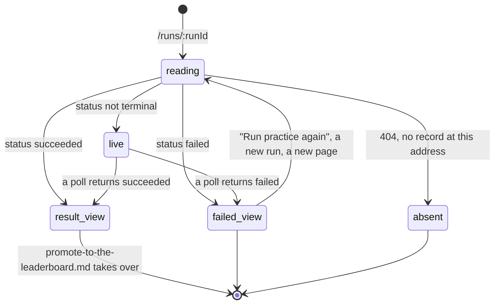

# The run page

## What this document owns

`/runs/:runId` once the run has reached a terminal status. Everything a finished run puts on screen is here: the phase rail with its timings, the failure card and the refusal card, the finding, the sweep, the wiring trace, the primary metric and its supporting list, the diagnostics, and the capped log.

[`start-a-practice-run.md`](start-a-practice-run.md) owns how the run came to exist. [`watching-a-run.md`](watching-a-run.md) owns the same route while the run is still moving, and the separate live console at `/run-surfaces/:surfaceId`. [`promote-to-the-leaderboard.md`](promote-to-the-leaderboard.md) owns the `PROMOTE` and `PUBLISH` panels that sit between the results and the log on this page.

## Summary

This is the page the whole platform is arranged around, and it is arranged around one rule: **a run page leads with what the run shows, not with what it scored.**

The number is not the headline. The headline is a sentence the benchmark wrote, set larger than the number, in the place the eye lands first. The number sits below it, where a reading sits under the trace that explains it. The reason is in `docs/design/the-instrument-not-the-judge.md` and is repeated in the component: "A score answers 'how did we do' and stops there. A team reading 0.53 with no other information has to guess which half of their pipeline produced it, and guessing is what this course exists to replace" (`apps/portal/src/components/Finding.tsx:6`).

Everything else on the page follows from that. The scorer's own notes lead. Under them, the curve of the score against the benchmark's difficulty knob, because "Two teams with the same final number have visibly different curves" (`apps/portal/src/components/SweepTrace.tsx:38`). Under that, the list of the team's own functions the platform ran, because the number rests on an inference the platform made by running their code and it will not hide that inference. Only then the metric, at 5xl in serif, bracketed, with its explanation never folded away.

A failed run gets the same treatment from the other side. It is never "Something went wrong": it is a named phase, a stable code, a plain-language explanation, the raw detail, one next step, a copyable command that reproduces it locally, and, for an official run, a line saying whether it cost an attempt.

The page is reached from `RUN LOG` on the dashboard, from the `CURRENT RUN` panel, from the candidate line, and from the published result. It loads with `GET /api/runs/:id` and, once that answers, a second request for the run's own benchmark so the failure copy and the quota belong to this run rather than to whichever track the dashboard defaulted to (`apps/portal/src/routes/RunDetailPage.tsx:47`).

One consequence of the rule is worth stating in advance, because it is what a reader will notice first: for a run that scored, the largest text on the page is a sentence, not a number, and the number is roughly a third of the way down. For a run that failed, the largest text is the name of what went wrong, and the phase it happened in is the panel's own label.

## The simple case

A student opens a finished practice run. The page shows a loading mark reading `Reading run record` (`RunDetailPage.tsx:71`), then the run.

At the top, a small `← Dashboard` link, then the masthead: `RUN 3F82` in serif, a `Practice` chip, a status chip reading `Succeeded` with a still square. Under it one line of metadata: `audio-identification / v3`, the branch, a copyable commit chip, the start time in the browser's locale, and the total duration.

Then `PIPELINE`: the seven-node rail, every node filled, the terminal `Complete` node carrying a check, and under each node the time that phase took. Nothing says "Updates every 2 s." any more; that line renders only while the run is live.

Then the finding. A bracketed figure headed `What this run shows`, carrying one sentence in 19px serif: the scorer's first diagnostic. Under it, if the scorer wrote more, the rest as a bulleted list behind a rule. Under that, when the benchmark has a difficulty knob, a small hand-drawn curve of the score against it.

Then, when the platform found the team's functions by running them, a second panel headed `Your code, as it was run`: one row per stage, each naming the stage, the team's own `module.function`, and what it received and returned in plain words, as `took an array of shape (1025, 171) · returned a list of 5158 pairs`.

Then `RESULTS`, in two columns. On the left the primary metric, bracketed, its label in a mono kicker, its value at 5xl in serif, an arrow reading `▲ higher is better`, and its explanation in body serif underneath, never behind a disclosure. On the right the supporting metrics as a label-and-value list. At the bottom of the panel, one line: "Public practice split." for a practice run, "Hidden official split." for an official one.

Then `PROMOTE`, which belongs to [`promote-to-the-leaderboard.md`](promote-to-the-leaderboard.md). Then, for a practice run that produced one, `LOG · CAPPED`.

A failed run replaces the middle of that page with one alert-toned panel labelled `FAILED DURING EVALUATE`, and everything below the pipeline changes accordingly. There are no metrics, no finding, no promote block, and often no log.

That panel reads top to bottom as one argument. `E-RUNTIME` in a mono chip in the corner. "Your code raised an exception" in serif. Then the explanation: "Evaluation started, but your submission raised an unhandled exception while processing benchmark inputs." Then the runner's own detail in a monospaced block, wrapped rather than truncated. Then `What to do`: "Reproduce with the local practice runner; the traceback excerpt is in the log below. Fix, verify locally, then run practice again before promoting." Then `Reproduce locally` and a copyable `cogworks run --benchmark audio-identification`.

For a run that failed because nothing in the repository could be scored, a second panel follows it, headed `WHAT THE BENCHMARK LOOKED FOR`, carrying the sentence that says how far the search got and, under it, the incomplete chain of the team's own functions.

## The ask, event by event

### Asking

Arriving on a finished run commits nothing and changes nothing. The URL carries the run id, and the page reads it and three more things: the run record, the benchmark list, and the dashboard for the run's own benchmark.

The dashboard query is deliberately deferred until the run record has arrived, and deliberately keyed to the run's benchmark rather than the current track, because "Quota, retry, and failure copy all belong to *this run's* benchmark" (`RunDetailPage.tsx:47`). The consequence is that the quota is unavailable on the page's first render, which matters for the promote button; see [`promote-to-the-leaderboard.md`](promote-to-the-leaderboard.md).

Nothing on this page is user input. Every control except the retry button and the two official ones is a disclosure: a supporting metric row that opens its note, a log that expands, a commit chip that copies.

> Technical note: the run record is re-synced on every read. `GET /api/runs/:id` calls `syncRun` before serialising (`apps/portal/worker/routes/runs.ts:64`), which is what advances a fixture-provider run and repairs a run the reaper has since decided is stale. Reading a run page can therefore change the run's status, which is the one way in which this page is not purely a reader.

### Answered without work

One refusal. A run id that is not this team's is a `404` with "Run not found." (`apps/portal/worker/routes/runs.ts:63`), because the query filters by team before it filters by id, so "does not exist" and "belongs to someone else" are the same answer.

It renders as an absence rather than a fault: "The portal has no record at this address. Trying again will return the same answer." with no retry button and a "Back to dashboard" link the page supplies itself (`RunDetailPage.tsx:74`).

A session that expired renders `SESSION ENDED` instead, and a genuine server fault renders `FAILED ON OUR SIDE` with the server's own sentence and a second line, "If it happens again, tell a TA; this one is ours to fix." (`apps/portal/src/lib/query-error-state.ts:54`).

### The work begins

Reading a finished run never begins any work. The page has exactly two controls that do, and both are on the failure path or the promotion path.

The first is "Run practice again on main", which appears for a practice run whose failure is marked retryable, and for an official run that did not consume its attempt. It starts a new practice run and then navigates to it, because "the old page kept its button, and pressing it again returned active_run_exists" (`RunDetailPage.tsx:64`). It spends one of the team's ten hosted runs.

The second is promotion, which is [`promote-to-the-leaderboard.md`](promote-to-the-leaderboard.md).

### While it works

For a terminal run there is no work and no polling: `useRun` evaluates its refetch interval to `false` as soon as the status is terminal (`apps/portal/src/lib/queries.ts:58`), so a finished run page is static until something is pressed.

Three things still move. A supporting metric row with an explanation expands in place when clicked, animating from zero to its natural height so "a two-line note and a five-line note both open at the same speed" (`apps/portal/src/components/MetricBlock.tsx:145`). The log toggles between its tail and its whole. The commit chip briefly reads `copied`.

The commit chip is worth its own note. It shows seven characters and copies all forty, swapping its label to `copied` for 1.4 seconds, and when the clipboard is unavailable it fails silently and leaves the short SHA in place (`apps/portal/src/components/ShaChip.tsx:25`). The full SHA is also its title attribute and its screen-reader label, so it is readable without copying.

### How it ends

The page does not end. It is the record of a run, it is stable, and it stays correct indefinitely. Its two exits are a new run started from the retry button and a promotion, both of which navigate away.

## What a finished run puts on the page

Ten components decide what a finished run looks like. They are described here in the order the page draws them, which is also the order the design argues they should be read: what the run shows, then how it behaved as the task got harder, then which code produced it, then the number, then the raw material.

### The finding

`Finding` is a bracketed figure headed `What this run shows`, carrying `run.diagnostics[0]` as one sentence in serif at 19px on a phone and 21px on a desktop, with a maximum measure of 58 characters (`Finding.tsx:32`). The remaining diagnostics render below a rule as a bulleted list at 13.5px.

Nothing in it is written by the portal. "The text arrives from the benchmark, assembled from templates against measured numbers, so it can only say what the run observed" (`Finding.tsx:14`). The panel renders only when there is at least one diagnostic or a sweep, and a succeeded run with neither drops straight to the wiring trace.

Diagnostics are capped at 32 entries of 240 characters each by the contract (`packages/contracts/src/schema.ts:150`), and they are safe on an official run because "they describe the submission's own output shape, never the hidden data" (`apps/portal/worker/http/serializers.ts:140`).

When a run succeeded and the scorer wrote nothing at all, the `RESULTS` panel carries one line instead: "The scorer had no notes on this run." (`RunDetailPage.tsx:255`). The comment says it is "Kept for a run whose scorer had nothing to say, which is rare and would otherwise lose its notes entirely."

### The sweep

`SweepTrace` draws the score against the benchmark's difficulty knob: Week 1's is a count of songs, Week 3's is an ordering of four query rewrites. It is a hand-drawn SVG, not a chart library, because "Four points and two axes do not need 40kB of JavaScript, and a library's defaults (gridlines, tooltips, a legend, rounded everything) fight the notebook look" (`SweepTrace.tsx:42`).

The y axis is pinned to 0 through 1 rather than fitted to the data, because "A fitted axis makes a curve that fell from 0.54 to 0.52 look like a collapse, which is exactly the misreading this component exists to prevent" (`SweepTrace.tsx:70`). Two rules and no grid. Each point prints its value above it when there are six points or fewer; beyond that only the endpoints carry labels. The x axis labels only its ends, using each point's own name when it has one, because Week 3's x values are 0 through 3 and "say nothing" (`SweepTrace.tsx:52`).

The whole figure carries one spoken sentence for a screen reader: the metric, the axis, and the value at each end (`SweepTrace.tsx:90`). Fewer than two points renders nothing.

### The wiring trace

`WiringTrace` is headed `Your code, as it was run`, or `How far your code was followed` when the chain is incomplete, "because 'wired up' would be claiming too much" (`apps/portal/src/components/WiringTrace.tsx:34`). Each row is a stage in mono uppercase, the team's function as `module.function`, and under it `took {received} · returned {returned}`.

It exists because nothing in a 2026 repository declares which function is the peak finder. The platform works it out by calling their functions and passing each one's output to the next, and it shows that inference rather than assuming it: "a team can read this and see whether we ran the code they think we ran" (`WiringTrace.tsx:8`).

The received and returned strings are shapes rather than values: "an array of shape (1025, 171)", "a list of 5158 pairs". They are described as "the reproduction a team debugs from" and "the platform's whole contribution to a chain that runs and answers wrongly: what ran, on what, and what came back" (`WiringTrace.tsx:54`).

It sits below the finding and above the number, and the page comment gives the reason: "a team checks it when a score surprises them, which is after they have read the finding and before they argue with the number" (`RunDetailPage.tsx:234`). It is absent for a repository that declared its own submission, because then nothing was inferred. The contract caps it at 16 steps.

### The metrics

`PrimaryMetric` is the headline number, in a bracketed figure: a mono kicker for the label, the value at 5xl in serif with its unit beside it at reading size, and a direction mark reading `▲ higher is better` or `▼ lower is better`. The direction is always explicit, because "the portal never assumes higher-is-better" (`MetricBlock.tsx:6`).

Its explanation is never behind a disclosure: "The leaderboard number is the one a team will argue about, so its explanation is never behind a disclosure. Set in the body serif at reading size: this is prose to be read, not a label to be scanned" (`MetricBlock.tsx:29`).

`SupportingMetrics` is a label-and-value list arranged by what each number is rather than by the order the scorer returned it. Week 3 publishes sixteen metrics: four scored, three floors, two probes that are run and deliberately not scored, and seven diagnostics. Four rules shape the list.

A row with an explanation is itself the button, with a dotted underline on the label as the only affordance, because "an icon on every row would add eleven pieces of furniture to a list whose value is its quietness" (`MetricBlock.tsx:50`). It opens in place, under its own row, behind a rule down the left, "the way a marginal note unfolds in a notebook". The value column never moves.

A floor renders inline inside the row of the metric it belongs to, as `floor 0.42`, at the same precision as that metric. It gets no arrow, because a floor "was its own row with an arrow saying 'higher is better', which is advice to raise a number the submission does not control" (`MetricBlock.tsx:78`).

A probe that is run and not scored renders indented beneath the score it shadows, marked `not scored` and with no arrow: "high means the query text was matched rather than its meaning, which is the opposite of good" (`MetricBlock.tsx:87`). The pairing is the point, because `retrieval_mrr` and `retrieval_mrr_verbatim` are homonyms and "A student reading the second as the first reads their result as its opposite" (`MetricBlock.tsx:178`).

Diagnostics sort to the bottom, behind a horizontal rule, "because they describe one component in more detail rather than answering 'how did I do'" (`MetricBlock.tsx:210`). Anything the sweep already plots is dropped from the list entirely, since "A row for it would be the same number twice" (`MetricBlock.tsx:200`).

All of it is driven by the metric's own `role` and `relatesTo` fields and never by a metric's name, "so a benchmark that grows a floor gets this for free and one that declares nothing renders exactly as it did before" (`MetricBlock.tsx:181`).

### The refusal card

`RefusalCard` is headed `WHAT THE BENCHMARK LOOKED FOR`. It carries the refusal's headline in serif at 17px to 19px, an optional next step in smaller type, and, when there is one, an incomplete wiring trace under a rule.

It renders only under a failure, and the page comment says why it sits there: "Under the failure card, because the card says which phase stopped and this says why. Only for a run that failed for want of code to score; every other failure has a traceback, and the log is where that belongs" (`RunDetailPage.tsx:169`).

The next step appears only when the platform honestly has one, "a package it can name, a file it could not read. Most refusals have none, and an invented next step is worse than an absent one" (`apps/portal/src/components/RefusalCard.tsx:32`). The card offers no diagnosis at all: "The platform cannot know which of their lines is wrong, and a confident wrong guess costs a team more time than saying nothing does" (`RefusalCard.tsx:13`). See [`../foundations/what-the-portal-claims.md`](../foundations/what-the-portal-claims.md).

### The failure card

`FailureCard` is titled `FAILED DURING {PHASE}` in capitals, with the phase taken from the failure itself, and a mono code chip in the panel's corner. Under it: a serif title, an explanation, the raw `failureDetail` in a preformatted block when there is one, a `What to do` block, a `Reproduce locally` copy block when a command applies, and for an official run one line stating the cost.

That line is one of exactly two sentences: "This failure consumed one official attempt." or "No official attempt was consumed." (`apps/portal/src/components/FailureCard.tsx:69`). It is coloured against the two outcomes and is the only place on the page that answers the question directly.

The copy comes from a fixed catalog of twelve categories, sharpened per module where the concept genuinely differs (`packages/contracts/src/failures.ts:31`).

| Category | Code | Title | Retry offered |
| --- | --- | --- | --- |
| `repository_fetch` | `E-FETCH` | Repository could not be fetched | yes |
| `dependency_install` | `E-INSTALL` | Dependency installation failed | no |
| `data_download` | `E-DATA` | Benchmark data is not ready | yes |
| `model_cache` | `E-MODEL` | Model cache is not ready | yes |
| `adapter_missing` | `E-ADAPTER` | Nothing here could be scored | no |
| `contract_invalid` | `E-CONTRACT` | Adapter does not satisfy the contract | no |
| `student_runtime` | `E-RUNTIME` | Your code raised an exception | no |
| `timeout` | `E-TIMEOUT` | Evaluation exceeded the time limit | no |
| `memory_limit` | `E-MEMORY` | Memory limit exceeded | no |
| `output_invalid` | `E-OUTPUT` | Predictions did not match the schema | no |
| `scorer` | `E-SCORER` | Scoring failed on our side | yes |
| `provider` | `E-PROVIDER` | Execution provider failed | yes |

Two of them say outright that the fault is the platform's. `E-SCORER`: "Your predictions were produced and retrieved, but the trusted scorer failed. This is a platform problem, not a problem with your code." `E-PROVIDER`: "The isolated execution environment failed before your code ran. This is a platform problem, not a problem with your code."

`E-ADAPTER` carries a note about its own history. The old copy told teams to register an entry point in `pyproject.toml`, which "is packaging metadata that none of the thirteen 2026 capstones has and that the platform no longer needs. Sending a team to write it would cost them an afternoon on the wrong problem" (`failures.ts:79`). It now reads: "We look for the functions this week asks for by running the code in your repository. Nothing here did the job end to end, and the reason is below." The reason below it is the refusal card.

The module overrides sharpen the advice rather than the wording. A vision team over the time limit is told to "Profile recognize() on a single image locally. Batch descriptor computation and avoid re-loading model weights per image."; a language team is told to "Embed the image pool once in prepare_database() rather than per search, and keep GloVe loaded instead of re-reading it on every call." (`failures.ts:200`). The base entry must stay true on its own, because a run whose module has not resolved yet renders the base.

The `{benchmark}` placeholder in each reproduce command is filled with this run's benchmark id, so the copy block is a command the student can paste (`failures.ts:252`).

### The phase rail

`PhaseRail` draws seven nodes: Queued, Prepare, Install, Contract check, Evaluate, Score, Complete. The first six are the pipeline phases from the contract; `Complete` is a terminal node the component adds itself (`apps/portal/src/components/PhaseRail.tsx:108`).

On a finished run the rail carries per-phase timings, which the dashboard's copy of the same rail does not. A timing renders only when a phase has both a start and an end, so a phase that never ran shows a label and nothing under it.

The phases are laid down as an empty skeleton the moment the run is created, and the runner fills them in as it goes: each status event stamps the new phase's start and the previous phase's end (`apps/portal/worker/routes/runner-events.ts:86`). A run that died before reporting anything therefore has six empty rows and a rail with a cross on `Queued`.

A failed run puts a red cross on the failed node and leaves every node after it as an outline with an unfilled connector. A succeeded run fills everything and puts a check in the terminal node. Every node also carries its state in words for a screen reader: `complete`, `in progress`, `failed`, or `not started`.

### The log

`LogView` renders only for a practice run that has a log, under a panel labelled `LOG · CAPPED`. It shows the last 14 lines with a leading ellipsis line, "because the most recent lines carry the diagnosis" (`apps/portal/src/components/LogView.tsx:4`), and a toggle reading `show all 214 lines` that becomes `collapse to tail`.

An official run never has one. The runner writes `log` only when the mode is practice (`apps/portal/worker/routes/runner-events.ts:194`), so the panel is absent rather than empty, and the only place the page explains that is the live line the student may never have seen.

The masthead's own chips finish the record. The mode chip reads `Practice` in neutral rule or `Official · attempt 2/3` in detector red. The status chip pairs a word with a coloured square and never colour alone, and the square pulses only while the instrument is measuring, which on this page means never. Under `EXECUTION_PROVIDER=fixture` a third chip reads `simulated`, whose tooltip says "Execution provider is in fixture mode — results are scripted, not real evaluation." (`apps/portal/src/components/SimulatedChip.tsx:8`).

## Modifiers

| Modifier | Set before the ask | Changed while it works |
| --- | --- | --- |
| Who you are | The route requires a team (`apps/portal/src/App.tsx:147`) and the query filters by team id, so a student reads their own team's runs and nothing else. Every member sees the same page; there is no owner-only detail and no per-person number anywhere on it. An instructor has no route to another team's run page. | A session expiring turns a reload into `SESSION ENDED`. The page itself does not re-read, so a page already on screen stays readable. |
| Where your team and repository stand | The page reports the repository the run used, resolved from the team at serialisation time rather than stored on the run (`apps/portal/worker/http/serializers.ts:125`). A team that changed repositories therefore sees the new repository's details attached to an old run. | Nothing here re-reads on its own, so a change lands on the next load. |
| Which week's benchmark | The run's own benchmark decides the failure copy, the module override, the quota shown beside promote, and the reproduce command. The track switcher has no effect on this route at all. | No effect. A run's benchmark and version never change. |
| Practice or leaderboard | The mode changes four things: the masthead chip reads `Practice` or `Official · attempt 2/3`; the results footer reads "Public practice split." or "Hidden official split."; the log exists for practice only; and the failure card gains its attempt line for official only. The next-action panel changes from `PROMOTE` to `PUBLISH`. | The mode never changes. Promotion creates a second, separate run with its own page. |
| Flags, options, and where you are typing | Nothing is configurable. The layout is a single column capped at `max-w-4xl` and the results grid drops to one column on a narrow screen; the sweep redraws with a narrower viewBox so its 9px labels survive the downscale (`SweepTrace.tsx:11`). | No effect. |

## Cancel and interrupt

| Event | Before the work begins | While it works |
| --- | --- | --- |
| You stop it yourself | Nothing to stop. There is no cancel on this page, and no code path anywhere writes the `cancelled` status the rail and the status chip both have words for. | Closing an expanded metric note or collapsing the log changes only what is on screen. Neither is persisted, so a reload returns every row to its folded state. |
| You do something else mid-way | Leaving the page loses nothing; the record is durable. | Pressing "Run practice again" navigates away to the new run as soon as the server answers. Pressing it twice is stopped by the button's busy state and, failing that, by the server's `active_run_exists`. |
| A teammate acts at the same time | A teammate promoting this run does not change this page, which describes one run. Their new official run is a different page. | The page does not poll once terminal, so a teammate's action is invisible until a reload. The one visible consequence is a promote button that has gone stale and will be refused by the server. |
| The network or the portal fails | A failed load replaces the page with the query-error card and a "Back to dashboard" link. | Nothing is in flight, so nothing to lose. A failed retry prints either the server's sentence or "The action couldn't be completed. Try again." under the button (`RunDetailPage.tsx:205`). |
| The page or the process goes away | Nothing pending. | The record is durable and identical on reload, apart from the expanded rows and the expanded log, which reset. |
| The thing being measured changes | The run is about a commit that was resolved when it started. A push, a branch deletion, or a repository change does not alter it. | A benchmark version bump does not alter a finished run either. It does alter the quota shown beside promote, and it makes the run's own version visibly older than the active one, which the page shows as `v3` in the metadata line and never flags. |
| The platform refuses or credit runs out | Reading costs nothing and is never refused for quota. | The retry button spends a practice run and can be refused for quota; the promote button spends an official attempt. See [`../cross-cutting/credit-and-quota.md`](../cross-cutting/credit-and-quota.md). |

## Interactions with other systems

**Who may do this.** Any member of the team that owns the run. There is no share link, no read-only view, and no instructor path to another team's run page.

**The team owns it.** The page names no person anywhere. It names the branch, the commit, the benchmark, the functions, and the numbers, and none of them is attributed. That is the platform's hardest rule and this page is where it would be easiest to break.

**Credit.** The page reports credit rather than spending it, except through the retry and promote buttons. The failure card's attempt line is the authoritative statement for an official run, and it is authoritative because the server sets it when hidden evaluation actually began (`failures.ts:9`).

**What the portal claims.** Every number on this page is a hosted measurement the portal made itself, which is why it may be promoted. A refusal is a sentence with a reason and never a zero, a withheld number is absent rather than zero, and a floor is drawn as the scale of the metric it belongs to rather than as a target. See [`../foundations/what-the-portal-claims.md`](../foundations/what-the-portal-claims.md).

**What the benchmark supplied.** The finding, the diagnostics, the sweep, the metric labels, the help text, the roles, and the floors are all the benchmark's, carried through the run record untouched. The portal decides only where they sit. See [`../cross-cutting/what-the-benchmark-supplied.md`](../cross-cutting/what-the-benchmark-supplied.md).

**Live updates and reconnection.** None once terminal. See [`watching-a-run.md`](watching-a-run.md) for the live half of this route.

**Discord.** The run's surface keeps a Discord message in sync while the run is alive, and that message links to the console rather than to this page. Nothing on this page links to Discord.

**Configuration.** Diagnostics are capped at 32 entries of 240 characters, wiring at 16 steps, refusal headline and next step at 600 characters each, and sweeps at 24 points (`schema.ts:150`). The log's tail is 14 lines (`LogView.tsx:11`).

## Edge cases

- **A succeeded run with no primary metric renders no results at all.** The results block requires `run.status === "succeeded" && primary` (`RunDetailPage.tsx:212`), so a run that scored nothing primary shows a pipeline, possibly a finding, and then the promote panel with no number above it.
- **A failed run with an unknown failure category renders nothing for the failure.** The block requires both `run.failure` and a catalog entry (`RunDetailPage.tsx:161`), so a category the catalog does not carry would leave a page with a red cross on the rail and no explanation. All twelve current categories are in the catalog.
- **The retry button's fallback text is unreachable.** It reads "Run practice again on {branch}" with a fallback of "the default branch", but `branch` is a non-nullable string in the contract (`schema.ts:130`), so the fallback never renders.
- **A retry on a detached run asks GitHub for a branch called `detached`.** A run started from an exact SHA with no branch stores the literal `detached` (`apps/portal/worker/services/run-actions.ts:279`). The comment above `retryFrom` says omitting the branch lets the server use the team's default (`RunDetailPage.tsx:59`), but because the field is never null, the literal is sent instead, and resolving it is unguarded.
- **The log's line count is of the whole log, not of what is shown.** `show all 214 lines` counts every line while the pane shows fourteen, which is the right number to promise and does mean the button understates how much is hidden by exactly fourteen.
- **A phase that was skipped and a phase that took no time look the same.** A timing renders only when both ends exist, so a run that never installed anything shows `Install` with nothing under it, exactly like a phase whose events were lost.
- **The `Complete` node is not a phase.** It has no timing, it is drawn by the component rather than by the contract's `RUN_PHASES`, and it fills only on `succeeded`. A failed run leaves it an outline forever.
- **The metadata line's duration is wall-clock from creation.** It is `finishedAt - createdAt` (`RunDetailPage.tsx:91`), so time spent queued is inside it, and the sum of the per-phase timings under the rail can be visibly smaller.
- **Diagnostics and the finding are the same list.** The finding is `diagnostics[0]` and the supporting bullets are the rest, so a benchmark that writes its most important note second buries it.
- **An official run shows its wiring trace and diagnostics.** Both are safe "on the same grounds as diagnostics: it describes their code, never the data" (`serializers.ts:144`), so an official run is not as opaque as its suppressed log suggests.
- **The page announces its status to a screen reader on every render** through a visually hidden live region reading `Run status: Succeeded` (`RunDetailPage.tsx:122`), which on a terminal run fires once and then never again.
- **An expanded metric note is not addressable.** The disclosure is component state with a generated id, so there is no way to link a teammate to an open explanation, and a reload closes every one.
- **The refusal card renders under a failure only.** `run.refusal` is a field on every run detail, but the page only draws it inside the failure block (`RunDetailPage.tsx:173`), so a refusal attached to a run that somehow succeeded would never be shown.
- **The failure detail is the only surviving text on an official failure.** With no log, `failureDetail` carries everything, which is why the refund cap notice is appended to it rather than replacing it: replacing "would delete the very evidence the message tells the team to bring to an instructor" (`apps/portal/worker/execution/refunds.ts:55`).
- **Two runs on the same commit look identical above the fold.** The masthead shows the run label, the mode, the status, the benchmark, the branch, and the commit, and two practice runs of the same commit differ only in their label and their timestamp.
- **The sweep's aria label reads the endpoints only.** A screen reader hears the first and last values and the axis, never the shape between them, which is the part the component exists to show (`SweepTrace.tsx:90`).
- **The `← Dashboard` link is the only way back.** It sits above the masthead in small mono capitals, and a student who arrived from Discord or from a pasted link has nothing else on the page pointing anywhere.
- **Nothing on the page names the run surface it belongs to,** so a run reached from the dashboard gives no route to the live console that was following it. See [`watching-a-run.md`](watching-a-run.md).
## Open questions and verification

- The retry path for a run whose branch is the literal `detached` sends that string to GitHub, contradicting the comment directly above it (`RunDetailPage.tsx:59`). The resolve is unguarded on that path (`run-actions.ts:245`), so the likely outcome is an unhandled error rather than a sentence. Worth treating as a bug. **Unverified.**
- A succeeded run with diagnostics but no primary metric renders a finding and no `RESULTS` panel, so "The scorer had no notes on this run." can never appear for it. Whether that combination occurs was not established.
- Whether the finding genuinely leads the eye ahead of the 5xl number below it was not observed, and it is the central claim of the page's design. It needs a screenshot. **Unverified.**
- Whether a student can tell a floor from a score at a glance in the supporting list was not observed. The floor renders inline as `floor 0.42` at the metric's own precision, which reads correctly in the source. **Unverified.**
- No run page was opened against a real Week 3 payload, so the sixteen-metric arrangement (four scored, three floors, two probes, seven diagnostics) is described from `MetricBlock.tsx:170` rather than from a screen. **Unverified.**
- The failure card's attempt line is the only place the cost of an official failure is stated. Whether a student reads it, given that it sits at the bottom of a long alert panel, was not observed. **Unverified.**
- Whether any current benchmark sends a `plotted` metric that is not also in the sweep was not checked. If one does, it is dropped from the list and drawn nowhere.
- `cancelled` remains unreachable: the rail would draw it as a completed pipeline (`apps/portal/src/lib/run-meta.ts:47`) and the status chip would render it in muted grey, but nothing writes it and there is no cancel endpoint. Carried to triage.
- The `simulated` chip's tooltip contains an em dash, which `docs/design/voice.md` rules out ("Execution provider is in fixture mode — results are scripted, not real evaluation.", `SimulatedChip.tsx:8`). It is a title attribute rather than body copy, but it is student-visible. Carried to triage.
- Reading a run page can advance the run, because the handler syncs before serialising. Whether that has any visible effect under the Modal provider was not established. **Unverified.**
- Whether the per-phase timings ever sum visibly short of the stated duration was not measured; the gap is the queued time and any phase whose events were lost. **Unverified.**
Verified against Cog\*Portal commit `f74e087`.
