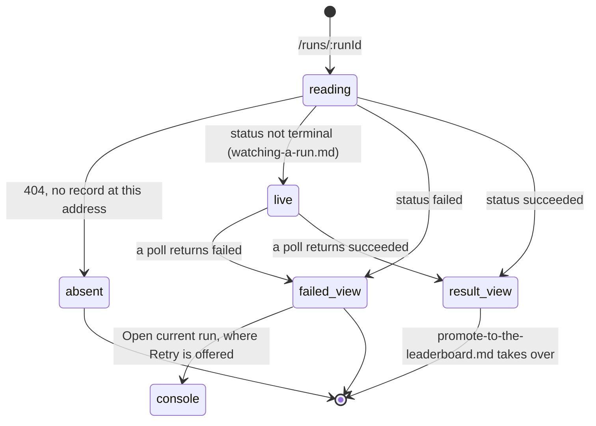

# The run page

## What this document owns

`/runs/:runId` once the run has reached a terminal status: the finding, the sweep, the wiring trace, the readings, the failure card and the refusal card inside it, what a failed execution recorded before it stopped, the pipeline with its timings, and the folded log.

[`start-a-practice-run.md`](start-a-practice-run.md) owns how the run came to exist. [`watching-a-run.md`](watching-a-run.md) owns the same route while the run is moving, and the console at `/run-surfaces/:surfaceId`, which is where Retry lives. [`promote-to-the-leaderboard.md`](promote-to-the-leaderboard.md) owns the `Official attempt` and `Publish` sections between the readings and the pipeline.

## Summary

The page is arranged around one rule: **a run page leads with what the run shows, not with what it scored.** The component says why: "A team reading 0.53 with no other information has to guess which half of their pipeline produced it, and guessing is what this course exists to replace" (`apps/portal/src/components/Finding.tsx:8-10`).

For a run that succeeded, the order down the page is the order of weight `docs/design/the-instrument-not-the-judge.md` sets (`apps/portal/src/routes/RunDetailPage.tsx:41-56`): the benchmark's finding in the largest type on the page, the curve of the score against the benchmark's difficulty knob, the team's own functions as the platform ran them, then `Readings` as a footnote table with changes against the team's previous comparable run, then the one decision the run offers, then the pipeline and the folded log.

For a run that failed: the failure card first, which names what happened, shows the runner's one line about it, and offers one next action; then the pipeline showing where it stopped; then the log if one exists.

The page loads with `GET /api/runs/:id`, the benchmark list, and, once the record arrives, the dashboard for the run's own benchmark, which supplies the quota and the previous comparable run (`RunDetailPage.tsx:57-75`).

## The simple case

A student opens a finished practice run. The page shows `Reading run record` (`RunDetailPage.tsx:77`), then:

- A `Runs` link back to `/dashboard`, and "Open current run" in the corner when the run belongs to a console (`:108-124`).
- The masthead: the benchmark's title as an eyebrow with a status chip, the run's title in serif ("Practice run on improved-thresholds"), and one metadata line: `Run #XXXX`, the repository the run used as a link, a copyable commit chip, the start time, the duration, and `{benchmarkId} v{version}` (`:127-176`). When the run used uploaded weights, one more line names them: "{files} from your local run at {shortSha}" (`:177-181`).
- **What this run shows.** The scorer's first diagnostic in serif at 24 to 31px, the remaining diagnostics as a list under a rule (`Finding.tsx:24-53`). A margin note says "The benchmark's scorer wrote this sentence from the numbers it measured, so it only says what the run observed." (`RunDetailPage.tsx:476-480`). When the scorer wrote nothing, the slot stays a sentence: "The scorer didn't write a finding for this run. Its readings are below." or one of two variants (`:488-497`).
- The sweep, when the benchmark has a difficulty knob, then `Your code, as it was run` (`:500-522`).
- **Readings.** The primary metric as the first row, slightly larger, with its direction and its explanation open; then the supporting metrics, then `Diagnostics` under their own label; `Public practice split.` or `Hidden official split.` as the section's aside (`:525-591`).
- **Official attempt** for a practice run, or **Publish**/**Published** for an official run. See [`promote-to-the-leaderboard.md`](promote-to-the-leaderboard.md).
- **Pipeline.** "Every stage finished, {duration} from start to end." then the rail with per-phase times (`:256-268`).
- **Show the log**, folded, with `{n} lines, capped` beside it, for a practice run that has one (`:284-288`, `apps/portal/src/components/LogView.tsx:28-34`).

Observed locally on fixture data in `/tmp/cogshots/matched/pairs/b-run-success-desk.png` and `b-run-official-desk.png` (right halves, near `2ff32fa`). Both fixture runs had no diagnostics, so both show the "didn't write a finding" sentence.

A failed run replaces the top of that page with one card (`RunDetailPage.tsx:188-234`). For a failure in the submission it reads, top to bottom: `Run failed · stopped at Evaluate` with `E-RUNTIME` at the right; "Your code raised an exception" in serif; the runner's detail line open in a monospaced block; `Next step` with "Reproduce with the local runner and use the recorded details to find the exception." and a copyable `cogworks run --benchmark {id}`; then "Show details", which holds the catalog's longer explanation (`apps/portal/src/components/FailureCard.tsx:73-155`). A margin note beside it reads "A run that fails doesn't count against your team's practice runs." or, for an official run, "A failed official attempt doesn't use up one of your team's attempts." (`RunDetailPage.tsx:194-198`). Observed locally on fixture data in `pairs/b-run-failed-desk.png`.

The same words were shown hosted, on beta's older card, for `run_f5fc5babe5` (`SamGu-NRX/week2_capstone@29f9cf9`, `vision-recognition` v2): `E-RUNTIME · Evaluate`, "Your code raised an exception", and the detail `'NoneType' object is not subscriptable` (`CogPortal-qa-video-20260930/outputs/beta-qa/hosted-run_f5fc5babe5/failed-dom.txt`, beta `4984730` lineage). The exception came from the platform's own `cogbench` pipeline reading element `k` of a per-item answer that was `None` for a photo with no face (`python/cogbench/src/cogbench/pipeline.py:834`), not from the team's code. Beta fixed the read in `468655c`; the candidate still has it. The one same-submission Retry, `run_f93ba19397`, succeeded at 0.925 on beta (`hosted-run_f93ba19397/result.json`). See "The failure card" for why the page says "your code" anyway.

## The ask, event by event

```mermaid
stateDiagram-v2
    [*] --> reading : /runs/:runId
    reading --> absent : 404, no record at this address
    reading --> live : status not terminal (watching-a-run.md)
    reading --> failed_view : status failed
    reading --> result_view : status succeeded
    live --> failed_view : a poll returns failed
    live --> result_view : a poll returns succeeded
    failed_view --> console : Open current run, where Retry is offered
    result_view --> [*] : promote-to-the-leaderboard.md takes over
    failed_view --> [*]
    absent --> [*]
```

### Asking

Arriving on a finished run commits nothing. The dashboard query is keyed to the run's own benchmark, because "Quota and failure copy belong to *this run's* benchmark, not to whichever track the dashboard happens to default to" (`RunDetailPage.tsx:61-63`). It also names the run this one is compared against: the team's most recent earlier run that succeeded in the same mode on the same benchmark version, read from the latest fifty (`:393-415`).

> Technical note: `GET /api/runs/:id` calls `syncRun` before answering (`apps/portal/worker/routes/runs.ts:100-101`), so reading a fixture run's page can advance it.

### Answered without work

One refusal. A run id that is not this team's is a `404` with "Run not found." (`runs.ts:100`), because the query filters by team first. It renders as "The portal has no record at this address. Trying again will return the same answer." with no retry and a "Back to your runs" link (`RunDetailPage.tsx:78-88`, `apps/portal/src/lib/query-error-state.ts:101-114`). An expired session renders `SESSION ENDED`; a server fault renders `FAILED ON OUR SIDE`.

### The work begins

Reading a finished run begins no work. The page has two controls that do, promote and publish, both owned by [`promote-to-the-leaderboard.md`](promote-to-the-leaderboard.md).

Retry is not on this page. A failed run whose record carries a surface id links to its console, where the server offers Retry when the failed execution is still current, the team has capacity, no run is active, and the recorded source is still the connected repository (`apps/portal/worker/services/run-surfaces.ts:370-396`). Retry starts a new execution of the same recorded commit, configuration and mode, and the failed execution stays in history (`apps/portal/worker/services/run-actions.ts:553-668`). A run with no surface id has no link; recovery is a new practice run from the dashboard.

Where the link sits depends on the catalog's `retryable` flag (`RunDetailPage.tsx:96-100`). For a platform-side failure (`E-FETCH`, `E-DATA`, `E-MODEL`, `E-SCORER`, `E-PROVIDER`), "Open current run" is the card's primary button. For a failure the catalog attributes to the submission, it stays a small link in the corner and the card's next step is the local reproduction.

### While it works

A terminal run is not polled (`apps/portal/src/lib/queries.ts:75-78`). Three things still move: a supporting reading opens its explanation in place when clicked, the log folds and unfolds, and the commit chip copies the full SHA, showing a tick for 1.4 seconds; when the clipboard refuses, it says "Couldn't copy. Copy the full SHA below manually, or try again." and shows the SHA in a read-only field (`apps/portal/src/components/ShaChip.tsx:25-68`).

### How it ends

The page is a historical record of one execution. A later Retry does not change it; the console moves to the newer execution and lists the old one under "Show run history".

## What a finished run puts on the page

### The finding

`Finding` carries `run.diagnostics[0]` as one sentence and the rest as a list (`Finding.tsx:24-53`). Nothing in it is written by the portal: "The text arrives from the benchmark, assembled from templates against measured numbers, so it can only say what the run observed" (`:16-18`). Diagnostics are capped at 32 entries of 600 characters on the run record (`packages/contracts/src/schema.ts:234`).

### The sweep

`SweepTrace` draws the score against the knob: Week 1's is a count of songs, Week 3's an ordering of four query rewrites. It is hand-drawn SVG with the y axis pinned to 0 through 1, because "A fitted axis makes a curve that fell from 0.54 to 0.52 look like a collapse" (`apps/portal/src/components/SweepTrace.tsx:122-124`). A doubling knob gets a log axis (`:118-122`). The largest fall of 0.1 or more is marked with the detection bracket; the 0.1 is stated in the source as "a judgment, not a measured threshold" (`:46-59`). When a previous comparable run has a sweep on the same axis and metric, it is drawn as a faint dashed line behind this one (`:90-114`). Fewer than two points draws nothing.

### The wiring trace

`WiringTrace` is headed `Your code, as it was run`, or `How far your code was followed` when incomplete, "because 'wired up' would be claiming too much" (`apps/portal/src/components/WiringTrace.tsx:33-43`). Each row names the stage and the team's `module.function`, with `took {received} · returned {returned}` in shapes, not values. It is absent for a repository that declared its own submission. Observed hosted on beta for `run_f93ba19397`: `DESCRIPTORS get_descriptor.file_descriptors`, then `STORE` and `QUERY` on `vector_db.VectorDatabase()` (`hosted-run_f93ba19397/succeeded-ui.txt`).

### The readings

The primary metric is the first row, "at reading size rather than poster size" (`apps/portal/src/components/MetricBlock.tsx:91-96`), with `▲ higher is better` or `▼ lower is better` only when the run recorded roles and the metric is not a floor (`:20-55`). Its explanation is open. Floors that belong to it sit under it with no arrow (`:155-190`).

The supporting list is arranged by role: floors fold into their parent's row as `floor 0.42`; a probe that is run and not scored sits under the score it shadows, marked `not scored`; anything the sweep already plots is dropped; diagnostics come last under `Diagnostics` with "These look at one part of the pipeline more closely." (`MetricBlock.tsx:249-264`, `:385-456`). Each row with an explanation is itself a button that opens the note under it.

When the team has a previous comparable run, a `change` column appears and each row prints `+0.024`, `−0.042` or `same` in the metric's precision, never colored: "a green '+0.002' reads as praise, which is the judge's job and not the instrument's" (`MetricBlock.tsx:61-75`). Floors get no change. The margin note names the run compared against: "Changes are against Run #XXXX, your team's previous practice run on {branch}." (`RunDetailPage.tsx:533-543`). Without one, the note explains the split instead (`:544-556`).

A succeeded run with no primary metric says "This run has no overall score. Everything the scorer could measure is below." and still renders everything else (`RunDetailPage.tsx:236-247`, `:576-581`).

### The failure card

`FailureCard` opens on three lines: what happened, the runner's note, and one next action (`FailureCard.tsx:10-31`). The header is `Run failed · stopped at {phase}` with the code at the right. The copy comes from a fixed catalog of twelve categories (`packages/contracts/src/failures.ts:20-147`):

| Category | Code | Title | `retryable` |
| --- | --- | --- | --- |
| `repository_fetch` | `E-FETCH` | Repository could not be fetched | yes |
| `dependency_install` | `E-INSTALL` | Dependency installation failed | no |
| `data_download` | `E-DATA` | Benchmark data is not ready | yes |
| `model_cache` | `E-MODEL` | Model cache is not ready | yes |
| `adapter_missing` | `E-ADAPTER` | Nothing here could be scored | no |
| `contract_invalid` | `E-CONTRACT` | Adapter does not satisfy the contract | no |
| `student_runtime` | `E-RUNTIME` | Your code raised an exception | no |
| `timeout` | `E-TIMEOUT` | Evaluation exceeded the time limit | no |
| `memory_limit` | `E-MEMORY` | Memory limit exceeded | no |
| `output_invalid` | `E-OUTPUT` | Predictions did not match the schema (`f03ebfa`: "Results came back in a shape scoring can't read") | no |
| `scorer` | `E-SCORER` | Scoring failed on our side | yes |
| `provider` | `E-PROVIDER` | The run couldn't finish | yes |

The flag decides the layout (`FailureCard.tsx:65-155`). Not retryable: the detail line open, `Next step` with the action and the reproduce command, and the explanation behind "Show details". Retryable: the explanation open, the caller's next step (the console link), and the detail, the action and the command behind "Show details". Module overrides sharpen the advice for vision and language (`failures.ts:164-213`), and `{benchmark}` in each command is filled with this run's id (`:220-236`).

What the card says about blame is decided upstream. In the Evaluate phase the runner reports any nonzero exit of the evaluation process as `student_runtime` (`apps/runner-modal/src/cogworks_runner/modal_app.py:1733-1740`, and `:1670` for the older path). The reason is recorded at `_platform_owned_evaluation_failure` (`:1930-1977`): once student code runs in a process, nothing that process prints is evidence about the platform, because a student module can forge any marker. The same process also runs the platform's own `cogbench` pipeline, so an exception there is reported as the team's. That is what happened to `run_f5fc5babe5`. The detail line is the last unindented line of stderr with its exception class removed (`modal_app.py:2005-2038`), so the student sees `'NoneType' object is not subscriptable` with no class, file or line, and a failed hosted run stores no log (the failure write at `apps/portal/worker/routes/runner-events.ts:247-260` sets none; only a completion carries one, `:226`). "Use the recorded details" points at one line.

### The refusal card

When a failure carries a refusal, the card leads with it instead of the catalog title (`FailureCard.tsx:85-93`). `RefusalCard` is set like a compiler diagnostic (`apps/portal/src/components/RefusalCard.tsx:4-16`):

- `refused at {stage}`, the stage read out of the headline with a regular expression and falling back to the failure's phase (`:68-82`, `:116`), with the collapsed failure `{code} · {mode}` to its right (`FailureCard.tsx:57-63`).
- The headline as the card's title in serif (`RefusalCard.tsx:132-138`).
- A nine-character label column: `after` (the last hand-off that returned something), `not read` (skipped modules, with an owner tag only when the owner is not the team, and a `fix` line for two exception classes), `raised` (file and line inside their repository), and `next`, which always ends with `cogworks check --benchmark {id} --update-setup` (`:143-229`).
- Under a rule, `How far your code was followed` (`:232-236`).

Status, `f03ebfa` (2026-10-03): between the headline and the label column the card now draws the refusal's notes, the first open in the reading face and the rest behind a fold labelled "1 more note from the search" or "{n} more notes from the search" (`RefusalCard.tsx:100-126`, `:177`). Seen on this page locally with a synthetic `not_wired` row carrying three notes (`~/.long-run/cogportal/evidence/student-recovery/screens/runpage-not-wired-notes.png`) and on the gallery fixture at 375 px and expanded by keyboard (`screens/gallery-refusal-notes-*.png`). Line numbers in the list above are `2ff32fa`'s.

The fix line appears for a `RuntimeError` mentioning a microphone or recording and for any `FileNotFoundError`, and for nothing else, "because a wrong fix sends a team somewhere an absent one does not" (`RefusalCard.tsx:43-66`).

### Recorded before it stopped

A failed execution can still carry findings: a completion that arrives after the run was marked failed is stored as evidence without changing the status (`runner-events.ts:168-246`). The page shows them inside the failure card's details, under `Recorded before it stopped`, and never as results (`RunDetailPage.tsx:216-231`).

### The phase rail

Seven nodes: Queued, Prepare, Install, Contract check, Evaluate, Score, and a terminal Complete the component adds (`apps/portal/src/components/PhaseRail.tsx:9-129`). A finished phase shows its time when it has both ends. A failed run puts a red cross on the failed node; a succeeded run fills everything and checks Complete. Each node carries `complete`, `in progress`, `failed` or `not started` for a screen reader. On a phone the rail is a list, one stage per line.

### The log

`LogView` renders only for a practice run whose record has a log, folded behind "Show the log" with `{n} lines, capped` (`LogView.tsx:21-57`). Open, it shows the last 14 lines after an ellipsis, "because the most recent lines carry the diagnosis", and "Show all {n} lines" toggles to "Show only the last 14 lines". On Modal only a completed practice run has a log; the fixture provider scripts one for failures too, which is why `pairs/b-run-failed-desk.png` shows one.

## Modifiers

| Modifier | Set before the ask | Changed while it works |
| --- | --- | --- |
| Who you are | The route requires a team (`apps/portal/src/App.tsx:161-167`) and the query filters by team, so a student reads their own team's runs. No person is named anywhere on the page. An instructor has no route to another team's run. | A session expiring shows on the next load as `SESSION ENDED`; a page already on screen stays readable. |
| Where your team and repository stand | The metadata line names the repository the run recorded, or "repository not recorded" with a tooltip "This run predates the recorded repository name." (`RunDetailPage.tsx:148-162`). A run from a repository the team has left keeps its own name. | Nothing re-reads on its own; a change lands on the next load, where the promote and publish sections replace their buttons with the source refusal (`:621-627`, `:715-718`). |
| Which week's benchmark | The run's own benchmark decides the failure copy, the module override, the reproduce command and the quota. The tabs have no effect here. | No effect. |
| Practice or leaderboard | Practice: `Public practice split.`, a log when one exists, the `Official attempt` section, and the practice margin note on failure. Official: `Hidden official split.`, no log, the `Publish` section, the official margin note, and a title "Official attempt {n} on {branch}" (`RunDetailPage.tsx:296-306`). | The mode never changes. Promotion creates a separate run with its own page. |
| Flags, options, and where you are typing | Nothing is configurable. On a phone margin notes stack after the work they annotate (`RunDetailPage.tsx:317-342`), the rail becomes a list, and the sweep narrows its viewBox so its labels stay readable (`SweepTrace.tsx:11-33`). | No effect. |

## Cancel and interrupt

| Event | Before the work begins | While it works |
| --- | --- | --- |
| You stop it yourself | Nothing to stop. There is no cancel, and nothing writes `cancelled`. | Closing a reading's note, the log, or "Show details" changes only the screen; a reload folds everything again. |
| You do something else mid-way | Leaving loses nothing. | Nothing on a failed run's page starts work; "Open current run" is a link. |
| A teammate acts at the same time | A teammate's Retry or promotion does not change this page; their new run has its own page. | The page does not poll once terminal, so a promote button can go stale and be refused by the server. |
| The network or the portal fails | A failed load shows the query-error card and "Back to your runs". | Nothing in flight. |
| The page or the process goes away | Nothing pending. | The record is identical on reload, folds reset. |
| The thing being measured changes | The run's commit is fixed. | A version bump does not alter a finished run; the metadata line keeps showing its own version, and the comparison only ever uses the same version. |
| The platform refuses or credit runs out | Reading is free. | Retry and promotion need capacity; only a completed evaluation uses quota. |

## Interactions with other systems

**Who may do this.** Any member of the owning team. No share link and no read-only view.

**The team owns it.** The page names the branch, the commit, the repository, the functions and the numbers, and no person.

**Credit.** Reading is free. The failure card's margin note states that a failed run uses no quota, which is the server's policy (`apps/portal/worker/services/run-accounting.ts`). See [credit and quota](../cross-cutting/credit-and-quota.md).

**What the portal claims.** Every reading is a hosted measurement. A withheld number is absent, never zero, and a floor is a scale, not a target. The `E-RUNTIME` title is the one place the page claims to know whose code raised, and it cannot observe that; see the failure card above and [`../foundations/what-the-portal-claims.md`](../foundations/what-the-portal-claims.md).

**What the benchmark supplied.** The finding, the diagnostics, the sweep, the labels, the help, the roles and the floors come from the benchmark untouched. Weights the team uploaded are named in the masthead. See [`../cross-cutting/what-the-benchmark-supplied.md`](../cross-cutting/what-the-benchmark-supplied.md).

**Live updates and reconnection.** None once terminal. See [`watching-a-run.md`](watching-a-run.md).

**Discord.** The channel message links to the console, not to this page; the console links here with "See why it failed" and "View details".

**Configuration.** Run-record diagnostics are capped at 32 entries of 600 characters, wiring at 16 steps, sweeps at 24 points, refusal headline and next step at 600 characters (`schema.ts:234-330`). The log tail is 14 lines (`LogView.tsx:4`). Under the fixture provider a `Simulated` chip sits beside the status with the tooltip "Execution provider is in fixture mode. Results are scripted, not real evaluation." (`apps/portal/src/components/SimulatedChip.tsx:13`).

## Edge cases

- **The run page and the dashboard title the same run differently.** The run page's own `runTitle` writes "Official attempt 1" and "on a detached commit" (`RunDetailPage.tsx:296-306`); the shared one used by the dashboard writes "Official attempt #1" and "on commit {shortSha}" (`apps/portal/src/lib/run-meta.ts:18-30`). Observed locally in `pairs/b-run-official-desk.png` against `pairs/b-dashboard-desk.png`.
- **A failed run with an unknown category shows a header and nothing under it.** `copy` is null and only `Run failed` renders (`FailureCard.tsx:55`, `:95`). All twelve current categories are catalogued.
- **The duration is wall-clock from creation,** so queued time is inside it and the phase times can sum short of it (`RunDetailPage.tsx:101-102`).
- **The finding is `diagnostics[0]`.** A benchmark that writes its most important note second buries it.
- **An official run shows its wiring and diagnostics.** They describe code, never data.
- **The refusal heading depends on a regular expression over a sentence the CLI writes** (`RefusalCard.tsx:80-82`). A reworded verdict downgrades the heading to the phase silently.
- **The comparison reads only the latest fifty runs,** so an older run has no comparison rather than a wrong one (`RunDetailPage.tsx:397-401`).
- **A sweep from the previous run is drawn only on the same axis and metric** (`SweepTrace.tsx:107-114`).
- **Retry offered for a failure the page calls the team's.** The console offers Retry for any eligible failure, including `E-RUNTIME`, while this page's next step for `E-RUNTIME` is to reproduce locally. On `run_f5fc5babe5` the Retry succeeded, because the fault was the platform's.

## Open questions and verification

- The `E-RUNTIME` title asserts the team's code raised, and the runner cannot tell (`modal_app.py:1733-1740`). Observed hosted on beta for `run_f5fc5babe5`, where the platform's `pipeline.py` raised. Carried to triage.
- The `pipeline.py` per-item `None` crash is still in the candidate (`python/cogbench/src/cogbench/pipeline.py:834`). Any Week 2 recognition team whose describe step returns `None` for a no-face photo will fail Evaluate the same way here. Carried to triage.
- A hosted `E-RUNTIME` carries one line, no location and no log. Whether students can act on that was not observed beyond the one beta run.
- Whether the finding leads the eye ahead of the readings was observed only on fixture runs whose scorer wrote no finding. A real finding sentence was observed hosted on beta for `run_f93ba19397` ("2 of 10 queries for the newly enrolled person were called unknown rather than named…") on beta's pre-redesign layout, not on this one.
- The no-primary state and the refusal card were not in the matched pairs. **Unverified** on this build. Status, `f03ebfa` (2026-10-03): the refusal card with notes and the rewritten `E-OUTPUT` card were seen locally on synthetic and fixture data at that commit ([B-61](../bug-triage.md#b-61-a-refusals-notes-reach-the-browser-and-are-never-drawn), [B-62](../bug-triage.md#b-62-the-e-output-card-promises-checks-that-do-not-run)); no hosted refusal.
- `cancelled` is still unreachable (B-37).
- Hosted beta (`4984730`) differs: its failure card opens on "Run failed" and the title only, with code, explanation, detail, action and reproduce command all behind "Show details" (beta `apps/portal/src/components/FailureCard.tsx:41-80`); the candidate opens on the title, detail and next step (`FailureCard.tsx:73-127`). Beta's run page puts `PIPELINE` first, then the finding, the wiring and a `RESULTS` panel with a bracketed primary metric (observed in `hosted-run_f93ba19397/succeeded-ui.txt`); the candidate leads with the finding and puts the pipeline after the decision (`RunDetailPage.tsx:245-281`).
- Hosted beta (`4984730` lineage after `468655c`) differs: `pipeline.py` passes a per-item `None` through the element read (beta `python/cogbench/src/cogbench/pipeline.py:833-841`); the candidate indexes it and raises (`pipeline.py:834`).

Read against Cog\*Portal commit `2ff32fa`.
