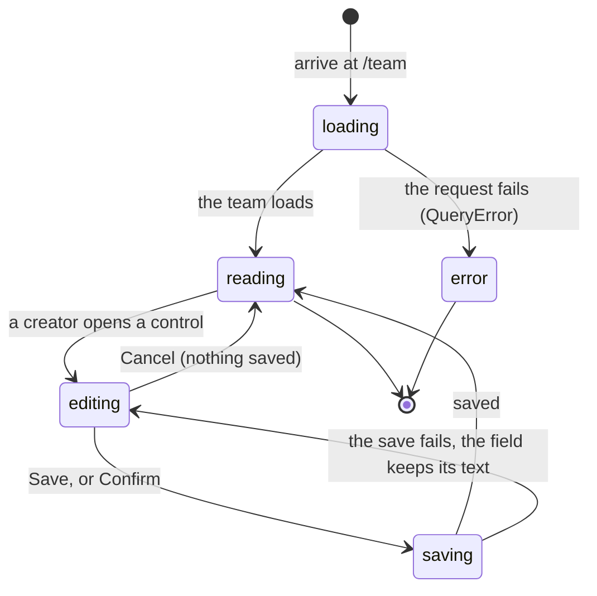

# The team page

> **In flight.** The process-signals panel and the co-author credit behind it were being written while this document was drafted, as uncommitted work on top of `f74e087`. The files are `apps/portal/src/routes/TeamPage.tsx`, `apps/portal/src/components/ProcessPanel.tsx` and `MemberAvatar.tsx` (both new), `apps/portal/worker/services/process-signals.ts`, `apps/portal/worker/routes/team.ts`, `apps/portal/worker/github/commits.ts`, and `apps/portal/test/process-signals.test.ts`. What is written below is what the source said when it was read. A verifier must re-read those files rather than trust this prose.

## Summary

The team page at `/team` is where a team looks at itself. It holds the settings a creator can change (the name, the leaderboard description, the members, the connected repository) and, below them, a panel showing what the team's commits and runs say about how the work went. That panel is the platform's answer to a question a leaderboard cannot address: where the work went, and when the pieces first fit together.

Every student on a team can reach it. Only the creator can change anything.

The page is reached from the dashboard by clicking the team name, from the setup guide's "Team settings" link, and directly at `/team`. It requires a team, so a student without one is sent to `/connect`.

## The simple case

A member opens `/team` and reads. The team name, the description if there is one, the TA if one is assigned, the members with their avatars, and the connected repository. Below that, a panel labeled "YOUR COMMITS AND RUNS" with a sentence in serif at the top, a rail of pipeline stages showing who touched each one and when, and the date of the first run that scored.

A creator sees the same thing with controls attached: "Rename", "Add description" or "Edit", "Add member", a "Remove" beside each member, and "Change repository".

Nothing on this page is a grade, and nothing counts anything per person. A stage says who touched it and never how much. That is a hard rule, enforced by tests rather than by convention (`apps/portal/worker/services/process-signals.ts:15`).

## The ask, event by event

### Asking

Arriving loads the team from `GET /api/team`. While it is in flight the page shows a loading mark labeled "Loading team". A failure shows the shared error card with a retry.

Two further requests are deliberately lazy. The repository list is fetched only when a creator opens "Change repository", and the list of people who could be invited only when the member palette opens. A member who never touches those controls never triggers either request.

The process panel loads separately from `GET /api/v1/team/process`, so the settings above it are readable before the commit history has been read.

### Answered without work

A member who reads and leaves changes nothing. No view is recorded, no timestamp is written, and the process panel's cached result is not refreshed by the visit.

A creator who opens "Rename", types, and presses "Cancel" also changes nothing; the field is discarded and the heading returns.

### The work begins

At the moment a save request is sent. Each control commits separately:

- **Rename** and **description** both go to `PATCH /api/team`. The name is capped at 60 characters, the description at 280. At least one field must be present.
- **Add member** posts to `/api/team/members` with a GitHub login.
- **Remove** deletes `/api/team/members/{login}`.
- **Change repository** posts to `/api/team/repository`.

Only the last of these is guarded by a confirmation, because it is the only one that changes what the team is measured against.

### While it works

Buttons show their pending state in words rather than a spinner: "Removing…" replaces "Confirm remove?" while a removal is in flight.

The remove control is a two-step arm rather than a dialog. The first click changes the label to "Confirm remove?" and the accessible name to "Confirm removing @{login}"; the armed state expires by itself after four seconds. A student who clicks once and looks away does not leave a live destructive button on screen.

The member palette is a search field labeled "Search the cohort" with arrow-key navigation and Enter to add. It states its own empty cases plainly: "Everyone in the cohort already has a team." and "No one matches \"{query}\"."

### How it ends

A successful save updates the page in place. There is no toast and no navigation.

A failure shows a short sentence next to the control and keeps the text the student typed. The sentences are terse to the point of being unhelpful: "Update failed." for a rename or description (`apps/portal/src/routes/TeamPage.tsx:163`), the single word "Failed." for a member change (`:327`), and "Changing the repository failed." (`:405`). None of them says what to do next, and the first two do not say which operation failed when more than one control is open.

The server's own sentences are much better, and some of them do reach the page. Changing the repository while a run is active answers 409 with "Wait for the current run to finish before switching repositories." Connecting one another team already holds answers "That repository is already connected by team {name}."

## The process panel

The panel is labeled "YOUR COMMITS AND RUNS" and carries, in its top corner, when the reading was taken: "read {time ago}".

It has three parts.

**The finding sentences.** The first one is set in serif inside corner brackets, the rest are bulleted below a rule. They are generated from four signals and they are the panel's whole argument. The ones a team is most likely to see:

- "No end-to-end run yet. Integration is the part the course says is hardest, and it usually takes longer than teams expect."
- "The first end-to-end run landed on {date}, with {n} scored runs since."
- "Only one person has touched the {stage} stage."
- "No commits have touched the {stage} stage yet."
- "The {file} signature changed after your pipeline first worked."

When the history cannot be used, the panel says so first, because it changes how everything under it reads: "The commit history is a single upload, so stage and ownership findings below aren't available; the runs are the portal's own observations and still count." A history that could not be fetched gets its own sentence ending "the runs are still reliable."

**The stage rail.** One row per pipeline stage in pipeline order, so reading down the rail is reading along the pipeline. Each row names the stage, shows the avatars and logins of everyone who touched it, and draws a bar spanning the first and last commit that did. A stage nobody has touched reads "no commits yet" and draws nothing. All the bars share one time axis so they are comparable, with the first and last dates printed underneath in UTC.

Which stages exist depends on the week, and the week is inferred from the module of the team's newest run. Before any run has scored there is no week, and the panel says so rather than guessing: "Stages appear here after a run scores. The run is what tells the portal which week's pipeline to read your files against."

**First end-to-end run.** The date the first run scored, the number that have scored since, and then any commit that has changed `submission.py` or `benchmark_adapter.py` since. Five rows at most, each with the commit chip, the date, and the files; beyond that, "{n} more since then." With none: "Nothing has changed submission.py or benchmark_adapter.py since that run."

> Technical note: the panel's result is cached for 30 minutes per team (`apps/portal/worker/routes/team.ts:199`), and computing it needs a GitHub token, which comes from whoever asked. So the first member to open the page without a working token caches the fetch-failure state for the whole team for half an hour, and everybody who opens it afterwards is told the history could not be read. Worth treating as a bug.

## Co-author credit

GitHub attributes a commit to one author, but a team that pairs in one editor session records the second person in a `Co-authored-by:` trailer. Without reading those trailers, a real student who worked on three commits appears nowhere at all, which is exactly the failure the process layer exists to catch.

So a commit's authors are its own author plus every trailer that resolves to somebody on the team roster. A trailer resolves three ways, tried in order: a GitHub noreply address, whose login is the part after the numeric prefix; a roster member whose email matches; and a trailer name that is itself a roster login. A trailer that resolves to none of these is dropped (`apps/portal/worker/services/process-signals.ts:233`). Dropping is the only defence here against a bot or an outsider being credited as a team member, and it means an outside collaborator's trailer silently does not count.

This applies to the stage rail and to the ownership list. It does not apply to the contract-file changes list: a churn event still records exactly one author (`apps/portal/worker/services/process-signals.ts:422`), so a commit whose only team participant came in through a trailer is listed under someone else. The two halves of the panel disagree about who wrote a commit.

## Modifiers

| Modifier | Set before the ask | Changed while it works |
| --- | --- | --- |
| Who you are | The creator sees every control; every other member sees the same information with no controls at all. There is no message explaining the difference, so a member cannot tell whether a control is missing or absent by design. A TA or instructor uses the admin page instead; see [`admin.md`](admin.md). | The creator's role is re-checked against GitHub on every mutation, so a creator demoted on GitHub between opening the page and pressing Save is refused with "Your GitHub permission on the team repository is no longer admin, so team settings are read-only for you." |
| Where your team and repository stand | The whole page is about this. A team always has a repository, so there is no unconnected state. The process panel's stages depend on a run having scored. | A teammate changing the repository in another tab does not update this one; the page has no live channel. |
| Which week's benchmark | The stage rail's stages come from the week inferred from the newest run's module, so the panel changes shape when a team moves to a new week. There is no track switcher on this page. | No effect within one visit; the panel is cached for 30 minutes. |
| Practice or leaderboard | The description is the only field with a leaderboard consequence: its placeholder says "One line about your approach, shown on the leaderboard." Nothing else on the page is public. | No effect. |
| Flags, options, and where you are typing | Browser only. There is no CLI or Discord equivalent of this page; `cogworks status` shows the team name and repository but nothing about process, and `/cog` shows runs. | No effect. |

## Cancel and interrupt

| Event | Before the work begins | While it works |
| --- | --- | --- |
| You stop it yourself | "Cancel" discards an edit with nothing saved. The remove control disarms by itself after four seconds. | There is no way to cancel a save in flight; the buttons show a pending label and no abort. |
| You do something else mid-way | Navigating away discards an open edit without asking. Nothing warns about unsaved text. | Navigating away leaves the request to finish; the result is applied on the server and the student does not see it. |
| A teammate acts at the same time | Two creators cannot exist, because there is exactly one creator per team. | A teammate's change is not reflected until the page is refetched. Two edits to different fields do not conflict; two to the same field are last-write-wins with nothing said. |
| The portal fails | Not detected. | The short failure sentences above appear next to the control and the typed text is kept, so nothing the student wrote is lost. |
| The page or process goes away | An open edit is lost on reload with no prompt. | A request already sent is applied regardless of the tab closing. |
| The thing being measured changes | Changing the repository is refused while a run is active. | The process panel's cached reading can be up to 30 minutes old, and the "read {time ago}" label is the only indication. |
| Refused, or out of credit | Credit is not consulted here. Changing a repository is free. | No effect. |

An interrupted edit leaves the team exactly as it was. The page holds no draft between visits.

## Interactions with other systems

**Who may do this.** Read for any member, write for the creator only, re-checked against GitHub on every mutation. A member removed here loses portal access to the team but keeps whatever GitHub access they had, and the page does not say so.

**The team owns it.** Everything on the page is the team's. The one place a person appears alone is the member list and the stage rail's avatars, and neither carries a number.

**Credit.** None spent. Changing the repository does not refund or consume anything, and the run history stays with the team, which is what the confirmation label promises.

**What the portal claims.** The process panel is careful about this in a way worth noticing. A signal it could not compute returns null or an explicit reason, never a zero standing in for missing data, because a zero would read as "we looked and nothing happened", which is a stronger and different claim than "we could not look". The panel prints the reason instead: "Stages aren't shown here because {reason}." See [`../foundations/what-the-portal-claims.md`](../foundations/what-the-portal-claims.md).

**What the benchmark supplied.** Nothing appears here. The panel reads commits and runs, not scoring.

**Live updates and reconnection.** None. The page does not poll and holds no stream. The process panel is cached for 30 minutes server-side.

**Discord.** The team's Discord channel is not shown or changed here; that is bound from `/cog` inside the channel itself. The team nudges that get posted to that channel are computed from the same first-light signal this page shows, so a team reading "No end-to-end run yet" here is the team that will get the `no_first_light` nudge; see [`../discord/channel-messages.md`](../discord/channel-messages.md).

**Configuration.** None. Nothing on this page is configurable per team beyond the fields it edits.

## Edge cases

- **There is no way to leave a team.** No control anywhere in the product lets a member remove themselves, and the creator cannot be removed at all ("A team admin cannot be removed here. Change their permission on GitHub instead."). A student who joined the wrong team must ask the creator or an instructor. The unique index on membership puts a student on one team at a time, so until somebody lets them out they cannot join another.
- **A login in the stage rail is not always a portal account.** The rail names whoever the commit history names, so a git author with no linked GitHub user appears under their git name with no avatar. The initial-letter box is the honest rendering of that, and the code says so.
- **Dates are drawn in UTC on purpose.** The finding sentences above the rail are formatted in UTC, so leaving the rail in the local zone would print the same instant as two different days on one screen.
- **A whole week's work landing on one day** collapses every bar to the same point, so the rail special-cases a zero-width span rather than dividing by zero.
- **The confirmation for changing a repository contains an em dash**: "Confirm — history stays with the team" (`apps/portal/src/routes/TeamPage.tsx:404`). `docs/design/voice.md` bans em dashes in UI strings and gives this exact string as its worked example of the fix, with the corrected form "Confirm, history stays with the team". The code has the version the style guide rejects.
- **"Failed."** on its own (`:327`) is the shortest error string in the product. It appears beside a member control and says neither what failed nor what to do.

## Open questions and verification

- The process-signals cache is keyed per team but computed with the caller's GitHub token (`apps/portal/worker/routes/team.ts:276`), so one member with an expired token poisons the panel for the whole team for 30 minutes. Worth treating as a bug. **Unverified** against a running portal.
- `boundaryChurn` records one `authorLogin` per event (`apps/portal/worker/services/process-signals.ts:422`) while the stage rail now credits co-authors, so the two halves of the same panel can name different people for the same commit. This looks like an oversight in the in-flight work rather than a decision.
- A trailer that resolves to nobody on the roster is dropped silently. Whether a team would notice an outside collaborator's contribution vanishing from the rail was not established, and there is no sentence for it.
- "Update failed.", "Failed.", and "Changing the repository failed." give no next action, which `docs/design/voice.md` requires of an error ("what happened, then exactly one next action"). Whether the server's better sentence is reachable in those paths was not confirmed. **Unverified.**
- No control lets a member leave a team. Whether that is deliberate is a product call; the consequence is that a mis-join needs an instructor.
- The panel's behavior for a team whose newest run is from a different week than its current work was not established: the week is inferred from the newest run's module, so a team that has moved on but not yet run may see the previous week's stages. **Unverified.**
- The four-second arm on the remove button was read from the code and not timed. **Unverified.**

Verified against Cog\*Portal commit `f74e087`, plus uncommitted work in the files named at the top.
