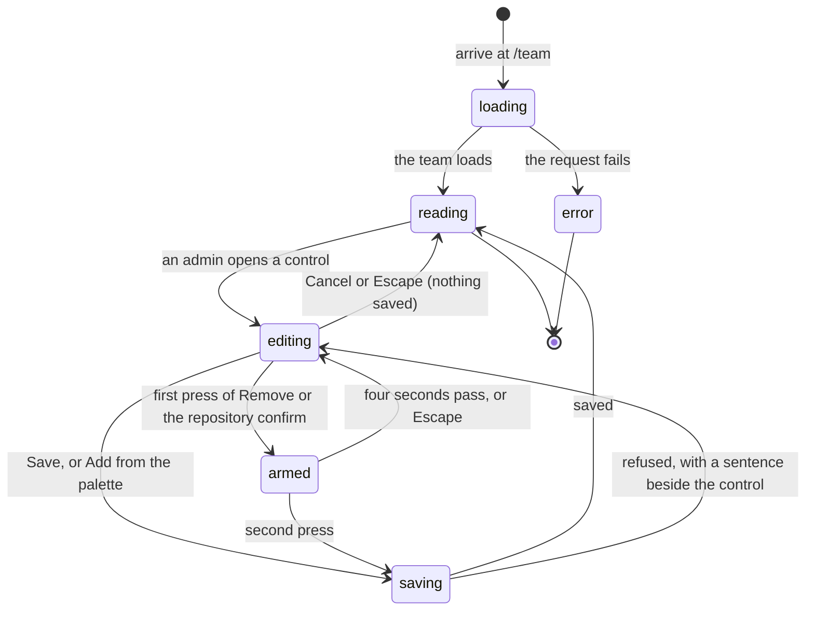

# The team page

## Summary

The team page at `/team` is where a team looks at itself: who is on it, who its TA is, which repository it runs from, and, last, what its commits and runs say about where the work went. A source comment gives the order: "People come first because they are what a student opens this page to check (did my teammate get added, who is our TA)" (`apps/portal/src/routes/TeamPage.tsx:43`). Everything a team admin can change is edited in place where it is read; there is no separate settings form.

Every member can read it. Only a member whose stored team role is `admin` sees controls. The creator is stored as `admin` whatever their GitHub permission (`apps/portal/worker/github/team.ts:73`); anyone who joins later is stored with their GitHub permission, so a GitHub admin who joins is a team admin too and a team can have several.

It is reached from the "Team" tab in the header (`apps/portal/src/components/Shell.tsx:63`), from the team name beside the wordmark on wide screens (`Shell.tsx:89`), from the "Team page" link on the setup guide after creating a team (`apps/portal/src/routes/SetupPage.tsx:503`), and directly. It requires a team, so a student without one is sent on by `RequireStage` (see [`../foundations/the-ask.md`](../foundations/the-ask.md#asking)).

## The simple case

A member opens `/team`. The eyebrow reads "Your team" (`TeamPage.tsx:168`), then the team name as the heading and the description under it. "People" lists each member with an avatar, their name, their login under it when different, "you" beside the reader, and a role word only for "Admin" or "Maintainer" (`:34-37`). Under the members, "Teaching staff" lists the assigned TAs, or reads "No TA is assigned yet; your instructors assign them." (`:427`). "Repository" links the repository on GitHub with its default branch. "Where the work went" closes the page.

The margin carries the reason for each section in italic serif. For a member who is not an admin, People says "A team admin adds and removes people. Admin means admin on the team's GitHub repository, so that's where the role is granted." (`:337-338`). Repository says "Every hosted run starts from this repository. If you change it, the team keeps its run history and official attempts." (`:463`).

A team admin sees the same page with "Rename" beside the name, "Edit" beside the description or "Add a line about your approach" when there is none, "Add someone" at the head of People, "Remove" beside every member who is not an admin, and "Change repository" under the link. Their People note reads "Adding someone here puts them on the team in the portal. Invite them as a collaborator on the fork too, so they can push." (`:332-333`).

Observed locally on fixture data for an admin on desktop and phone (`/tmp/cogshots/matched/pairs/a-team-desk.png`, `b-team-active-desk.png`, `b-team-active-mob.png`, close to `2ff32fa`). The member-only view was not captured.

## The ask, event by event

```mermaid
stateDiagram-v2
    [*] --> loading : arrive at /team
    loading --> reading : the team loads
    loading --> error : the request fails
    reading --> editing : an admin opens a control
    editing --> reading : Cancel or Escape (nothing saved)
    editing --> armed : first press of Remove or the repository confirm
    armed --> editing : four seconds pass, or Escape
    editing --> saving : Save, or Add from the palette
    armed --> saving : second press
    saving --> reading : saved
    saving --> editing : refused, with a sentence beside the control
    reading --> [*]
    error --> [*]
```

### Asking

Arriving loads the team from `GET /api/team`; "Loading team" shows until it answers, and a failure is the shared error card with a retry (`TeamPage.tsx:51-57`). "Where the work went" loads separately from `GET /api/v1/team/process` and is asked again on every visit, with no client copy reused (`apps/portal/src/lib/queries.ts:232-238`, pinned by `apps/portal/test/team-process-query.test.ts:27`). It is requested whether the section is open or closed.

Two lists are fetched only when needed: the admin's repository list when "Change repository" opens (`TeamPage.tsx:499`), and the cohort's students without a team when the "Add someone" palette opens (`apps/portal/src/components/MemberPalette.tsx:32`).

### Answered without work

Reading changes nothing the team owns. Opening an editor and leaving with "Cancel" or Escape discards the draft and returns focus to the control that opened it (`TeamPage.tsx:104-130`, `:158-163`). Saving a name identical to the current one closes the editor without a request (`:145`), and Save is disabled while the name is blank (`:194`).

One thing a visit can write is the team's cached commit history, described under [the process panel](#the-process-panel).

### The work begins

At the moment a save request is sent. Each control commits on its own:

- **Rename** and **description** send `PATCH /api/team`. The name is capped at 60 characters and the description at 280, with a live counter (`TeamPage.tsx:187`, `:257`). An emptied description saves as no description (`:153`). The hint under it says what it is for: "Shown beside your published result on the leaderboard." (`:255`).
- **Add someone** opens a palette searching "the cohort by name or login" (`MemberPalette.tsx:172`). It lists only signed-in cohort students with no team, so a teammate who has never signed in cannot be found here. Enter or "Add" on a row posts at once, with no confirmation.
- **Leave** (`b0e0c55`) sits on the reader's own row only. The first press changes it to "Confirm, you leave" and adds a line under the row: "Only you come off the team; its hosted runs, attempts and published results stay. Your local reports leave its list with you, and your GitHub access doesn't change.", or for the last member "You're the last member, so the team will be empty. It keeps its repository, runs and results, and anyone with write access on GitHub can join it again." (`TeamPage.tsx:471-477`). The second press sends `POST /api/team/leave` and lands on `/connect` with "You left {team}" (`ConnectPage.tsx:61`). It lapses and disarms like Remove. `1eb371c` (2026-10-03): the rejoin those lines describe holds for live teams only. For a past-course (`archive`) team the armed line ends "It's a past-course demonstration, so you can't join it again yourself; course staff would have to add you back.", or for the last member "...so only course staff can add anyone back.", because students can't join an archive team themselves (`apps/portal/worker/routes/team-membership.ts:143-150`), while staff can add a member to any team in their scope (`apps/portal/worker/routes/admin.ts:389-393`).
- **Remove** arms before it acts. The first press changes the label to "Confirm, they leave"; the second sends `DELETE /api/team/members/{login}` (`TeamPage.tsx:439`). The arm lapses after four seconds and Escape disarms it (`apps/portal/src/components/RemoveButton.tsx:62`, `:74`).
- **Change repository** opens a picker headed "Pick the repository your next run should start from" (`TeamPage.tsx:533`). The confirm reads "Switch to {fullName}" once a repository is picked, then "Confirm, history stays with the team" for four seconds (`:562-563`).

Every write re-checks the caller against GitHub first. A team admin whose live GitHub permission is no longer admin is demoted on the spot and refused with "Your GitHub permission on the team repository is no longer admin, so team settings are read-only for you." (`apps/portal/worker/routes/team.ts:179-188`). A GitHub outage keeps the stored role (`:176-178`).

### While it works

The pressed control shows its busy state and nothing else on the page is disabled. A removal reads "Removing…"; a palette row reads "Adding…" (`MemberPalette.tsx:234`); the repository picker shows "Listing repositories" while it loads (`TeamPage.tsx:535`).

The palette stays open after an add and announces "Added {name} to the team." (`MemberPalette.tsx:250`), so several teammates can be added in one sitting. Its empty states are sentences: "Everyone in the cohort already has a team." and "No one matches "{query}"." Escape closes it and returns focus to "Add someone"; tabbing out closes it too.

### How it ends

A successful save replaces the team on screen with the server's answer, with no toast and no navigation, and focus returns to the control that opened the editor (`queries.ts:240-265`).

A refusal shows the server's own sentence beside the control. The common ones:

- "Wait for the current run to finish before switching repositories." while any run of the team is active (`team.ts:498-521`).
- "That repository is already connected by team {name}." (`team.ts:585`), "Repositories must be public to run the benchmark." (`:544`), "You need write access to run the benchmark for this repository." (`:554`).
- "@{login} is already on team {name}." or "@{login} is already on this team." (`apps/portal/worker/routes/team-membership.ts:59-61`), "@{login} is not in your cohort." (`:244`).
- "A team admin can't be removed." (`team-membership.ts:304`). The page never offers Remove on an admin's row (`TeamPage.tsx:397`), so this is reachable only from a stale page.

When the failure carries no sentence, each control has its own fallback that keeps the typed text and says what to do: "The new name didn't save. Try again in a moment." (`TeamPage.tsx:228`), "The description didn't save. Your text is still in the box; try again." (`:309`), "@{login} is still on the team. Try removing them again." (`:449`), "The repository didn't change. Pick it again and confirm." (`:556`), and in the palette "That didn't go through. Try adding them again." (`MemberPalette.tsx:123`).

Changing the repository also deletes the team's cached commit history (`team.ts:605`). Earlier run pages keep naming the repository each run came from (`apps/portal/worker/http/serializers.ts:114`), and acting on such a run is refused with "This run came from a repository your team is no longer connected to. Start a fresh run on {repository} to {action}." (`apps/portal/worker/services/run-source.ts:30`).

## The process panel

"Where the work went" is the last section, and its heading is the toggle, reading "Hide" or "Show" (`apps/portal/src/components/ProcessPanel.tsx:58-80`). It is open by default; closing it is remembered for the rest of the browser session only, so a team meets it again next week (`:114-139`). The margin note stays visible either way: "We read your recent commits and your runs. A stage shows who has worked on it, never how much, so nothing here counts anything per person." (`:87-88`). The body shows "Reading commits and runs" while loading (`:101`).

It reads the most recent 40 commits on the default branch (`apps/portal/worker/github/commits.ts:104`) and the team's runs against the connected repository. It has four parts.

**Findings.** At most four sentences (`apps/portal/worker/services/process-signals.ts:528`), the first set larger in serif. They are fixed templates, chosen by condition, never generated (`:660-670`). What the history allows comes first:

- "There is no commit history yet, so there is nothing to read about which parts of the pipeline have been worked on." (`:547`)
- "The repository arrived as one upload, so there is no way to tell which commit touched which stage; the runs are the portal's own record and still hold." (`:543`)
- "The commit history could not be read from GitHub just now, so the stages below are blank; the runs are the portal's own record and still hold." (`:553`)

Then the first end-to-end run: "Your pipeline first scored end to end on {YYYY-MM-DD}, and {n} runs have scored in total." (`:578`), or "No run has scored end to end yet, so there is no working pipeline to read anything else against. Integration is the part the course says is hardest, and it usually takes longer than teams expect." (`:569`), or, after a repository change, "Your earlier scored runs aren't tied to the repository that's connected now, so the stage map starts again with your next run." (`:568`). Then, when they apply, one sentence each for commits that changed `submission.py` or `benchmark_adapter.py` after that run, for stages no commit has touched, and for stages only one person has committed to (`:588`, `:631`, `:651`). Over a truncated window these say "in your most recent {n} commits" rather than "yet".

**Stages of the pipeline.** One row per stage of the week's pipeline, in pipeline order. Each row names the stage, flags "no commits yet" or "only one person so far" (over a window, "none in the commits we read" or "one person in the commits we read"), draws a bar from the stage's first to its latest commit on one shared time axis, and lists the avatars and logins of everyone who committed to it (`ProcessPanel.tsx:312-395`). A dashed rule marks "First scored end to end {date}" across the bars (`:398-428`). One line under the axis says how to read the bars (`:431-433`). Dates are UTC.

The week comes from the newest run against the connected repository, of any status (`team.ts:372-388`). With no such run there are no stages and the section says "Stages appear here after a run scores. The run is what tells the portal which week's pipeline to read your files against." (`ProcessPanel.tsx:232-233`). When the history cannot be attributed it says "Stages aren't shown here because {reason}." (`:237`).

**Adapter files changed.** Only when there was a first scored run, the history is usable, and at least one commit after that run touched `submission.py` or `benchmark_adapter.py` (`:159`, `:467`). Five rows at most, each a commit chip, its date and the files, then "{n} more since then." No author is shown.

**The footer.** "History checked {time ago}, from your {n} commits." with "most recent" before the count when the window was truncated (`:167-172`).

Nothing in the panel is a count per person. The stage rows say who, never how much, and a test walks the whole response for any field shaped like a per-person total (`apps/portal/test/process-signals.test.ts:296`).

> Technical note: only the GitHub history is cached, for 30 minutes per team and only for the repository and branch it was read from (`team.ts:206`, `:258-274`). Runs are read fresh on every request, so a run that scores shows on the next visit. The read uses the GitHub token of whoever opened the page. A GitHub 401 is never stored (`:292-296`), but a caller with no token at all stores "could not be read" for the whole team for 30 minutes (`:284-289`). The footer's "History checked {time ago}" is the only sign of that.

### Co-author credit

GitHub records one author per commit; a pair working in one editor adds the second person as a `Co-authored-by:` trailer. A commit's people are its author plus every trailer that resolves to someone on the team: a GitHub noreply address, then an email the portal has for a member, then a trailer name that is literally a member's login (`process-signals.ts:236-249`). A trailer that resolves to nobody on the team is dropped (`:251-258`). That rule is what keeps bots and outside collaborators named only in a trailer off a team's stage rows, and it means their share of a commit silently does not appear. The commit's author is always kept, member or not, so an outside collaborator who authored a commit does appear (see [Edge cases](#edge-cases)).

## Modifiers

| Modifier | Set before the ask | Changed while it works |
| --- | --- | --- |
| Who you are | A team admin sees every control. Any other member, a maintainer included, sees the same page with no controls and the margin note saying admin is a GitHub role. TAs and instructors use [`admin.md`](admin.md); they are not on a team and cannot open `/team` for one. | Every write re-reads the caller's GitHub permission. A demoted admin is refused with the read-only sentence and stored as their GitHub role from then on. The controls stay on screen until the page reloads. |
| Where your team and repository stand | A team always has a repository, so there is no unconnected state. Stages need a run against the connected repository; the first-scored-run sentences need a succeeded one. | A teammate's change in another tab is not shown here; the page does not poll. |
| Which week's benchmark | The stage rows come from the week of the newest run against the connected repository. A team that moves weeks sees the old week's stages until its first run of the new one. | No effect within a visit. |
| Practice or leaderboard | Only the description reaches the leaderboard, and its hint says so. Runs of both modes count toward the first scored run. | No effect. |
| Flags, options, and where you are typing | Browser only. `cogworks status` shows the team name and repository; nothing outside this page shows the process findings. Phones stack each margin note above its section. | No effect. |

## Cancel and interrupt

| Event | Before the work begins | While it works |
| --- | --- | --- |
| You stop it yourself | Cancel or Escape discards an edit. An armed Remove or repository confirm lapses after four seconds or on Escape. | A save in flight cannot be cancelled. |
| You do something else mid-way | Navigating away discards an open edit without asking. | The request finishes on the server; returning shows the result. |
| A teammate acts at the same time | Two admins can hold the page open at once. Their edits are last-write-wins with nothing said. | A teammate's change appears only after this page refetches. Adding someone a teammate just added is refused with "@{login} is already on this team." |
| The network or the portal fails | A failed team load is the error card with a retry. A failed process read is its own error card inside the section. | The control shows the server's sentence or its fallback, and typed text is kept. |
| The page or the process goes away | An open edit is lost on reload. | A sent request completes regardless. |
| The thing being measured changes | Changing the repository is refused while any run is active. | The cached history can be up to 30 minutes old; runs are always current. A repository change clears the cache at once. |
| The platform refuses or credit runs out | Credit is not consulted. Changing the repository costs nothing and keeps run history and official attempts. | No effect. |

An interrupted edit leaves the team as it was. The page holds no draft between visits.

## Interactions with other systems

**Who may do this.** Read for any member, write for a stored team admin, re-checked against GitHub on every write. Removing someone takes them off the portal team only; their GitHub access is untouched, and the page does not say so.

**The team owns it.** Everything here belongs to the team. A person appears alone only in People and in the stage rows, and neither carries a number.

**Credit.** None spent. The Repository note promises run history and official attempts stay with the team.

**What the portal claims.** The process panel returns an explicit reason rather than a zero when it cannot look, because a zero would claim "we looked and nothing happened" (`process-signals.ts:264-269`). The "Adapter files changed" section is hidden when empty, because an empty list over two files most repositories do not have was reading as reassurance (`ProcessPanel.tsx:461-467`). See [`../foundations/what-the-portal-claims.md`](../foundations/what-the-portal-claims.md).

**What the benchmark supplied.** Nothing appears here.

**Live updates and reconnection.** None. The team does not poll, and the process panel is fetched once per visit.

**Discord.** Not shown or changed here; a team chooses its channel with `/cog`. The `no_first_light` nudge posted to that channel reads the same first-scored-run signal as this page (`apps/portal/worker/services/team-nudges.ts:109`); see [`../discord/channel-messages.md`](../discord/channel-messages.md).

**Configuration.** None beyond the fields the page edits.

## Edge cases

- **Nobody can leave a team.** No control on any surface removes yourself, and nobody in the portal can remove a team admin. A student on the wrong team needs a team admin or an instructor, and the one-team index keeps them from joining another meanwhile (`apps/portal/worker/db/schema.ts:196`). `b0e0c55`: any member can now leave from their own row (above); removing another admin is still refused.
- **A creator with only write access loses settings on first use.** Creating a team needs only write access (`apps/portal/worker/routes/github.ts:195-203`) but stores the creator as admin. Their first save demotes them. If no other member is a stored admin, nobody on the team can add, remove, rename or change the repository again, and adding the fork's owner from this page stores them as `write` (`team-membership.ts:261`).
- **A member added here is stored as `write` without asking GitHub,** unlike joining, which reads the permission (`team-membership.ts:169-177`). The People note tells the admin to send the GitHub invitation as well, but gives no link to the repository's collaborator settings.
- **A stage row can name someone who is not on the team.** The commit author's login is used as GitHub reports it, so a non-member author appears with the initial-letter avatar (`ProcessPanel.tsx:524-532`).
- **Dates are UTC on purpose,** because the finding sentences format dates in UTC and the rail must agree with them (`ProcessPanel.tsx:511-521`).
- **"Stages appear here after a run scores"** is shown only when no run exists for the connected repository, and the first run brings the stages whether it scores or fails (`team.ts:365-371`).
- **A revoked GitHub sign-in says the same thing twice.** The lead finding and the Stages line both carry "GitHub no longer accepts this portal's sign-in for you, so the stages below are blank. Sign out, sign in with GitHub again, and reopen this page." The Stages copy wraps it as "Stages aren't shown here because {reason}.", which ends in two full stops (`process-signals.ts:125-126`, `ProcessPanel.tsx:237`).
- **Two server sentences predate the page's words.** "Only the team creator can change team settings." (`team.ts:149`) and the join refusal's "add you here from Team settings" (`team-membership.ts:69`) use names the page no longer shows; it says "Admin" and "Team".

## Open questions and verification

- The no-token path still caches "could not be read" for the whole team for 30 minutes (`team.ts:284-289`, `:297-314`). What makes `getGithubToken` return null for a GitHub-signed-in student in practice was not established. **Unverified.**
- A rejected write of the history cache fails the whole process request on this build (`team.ts:306-314`).
- The creator-demotion path above leaves a team with no admin and no in-product way to get one back. Whether to store the creator's real permission, or let a GitHub admin claim the role, is a product call.
- No control lets a member leave a team. The cohort refusal still tells a student to "Leave it before joining a different cohort." (`apps/portal/worker/routes/cohorts.ts:38`). `b0e0c55`: Leave exists, and the refusal reads "Leave it from your Team page, then use this code." (`cohorts.ts:50`).
- `boundaryChurn` still records one `authorLogin` per commit while stage rows credit co-authors (`process-signals.ts:422-425`). The page no longer shows the churn author, so the two never disagree on screen; the field is still in the response (`team.ts:464`).
- The member-only view, the palette, the armed states and every refusal sentence were read from code, not observed. **Unverified.**
- Hosted beta (`4984730`) differs: a failed history-cache write is caught and logged, and the visit still answers (`apps/portal/worker/routes/team.ts:307-318` at `4984730`, commit `610e04a`); here it fails the request (`team.ts:306-314`).
- Hosted beta (`4984730`) differs: the pre-redesign page is headed "Team settings" (`apps/portal/src/routes/TeamPage.tsx:74` at `4984730`), arms removal as "Confirm remove?" (`apps/portal/src/routes/TeamPage.tsx:354` at `4984730`), and falls back to "Failed.", "Update failed." and "Changing the repository failed." (`:339`, `:168`, `:404` at `4984730`); here removal arms as "Confirm, they leave" and each fallback names a next step (`TeamPage.tsx:439`, `:228`, `:309`, `:449`, `:556`).

Read against Cog\*Portal commit `2ff32fa`. Layout observed locally on fixture data in `/tmp/cogshots/matched/pairs/` (close to `2ff32fa`).
