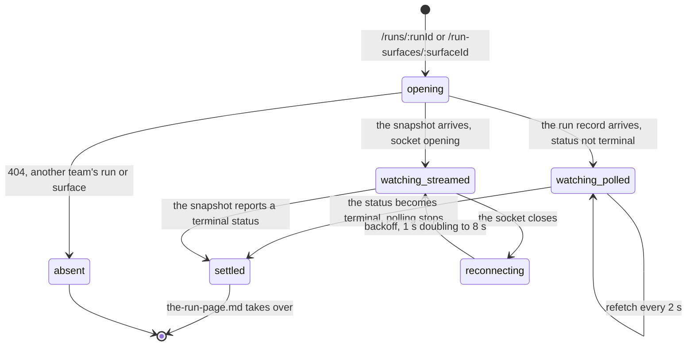

# Watching a run

## What this document owns

Two live surfaces, and the panel that links to the first of them.

The first is `/runs/:runId` while the run has not reached a terminal status. The page polls, the phase rail moves, and almost nothing else is on it. The dashboard's `CURRENT RUN` panel is the same view in miniature and is owned here too, because it exists only while a run is moving.

The second is `/run-surfaces/:surfaceId`, a different page with a different mechanism: a WebSocket to a Durable Object, a full event stream, a stage strip that spans a run's whole life from local to published, and its own set of action buttons. It is reached from Discord and from the CLI. Nothing in the portal links to it.

[`start-a-practice-run.md`](start-a-practice-run.md) owns everything up to the run row existing. [`the-run-page.md`](the-run-page.md) owns `/runs/:runId` once the run is terminal, which is where the finding, the metrics, the failure card, and the diagnostics live. [`promote-to-the-leaderboard.md`](promote-to-the-leaderboard.md) owns what the console's "Promote to official" and "Publish result" buttons actually do.

## Summary

A run takes minutes, and the platform gives it two live views built on two different mechanisms that never meet.

The run page polls. `GET /api/runs/:id` every 2 seconds for as long as the run's status is not `succeeded`, `failed`, or `cancelled` (`apps/portal/src/lib/queries.ts:58`). While it polls, the page shows a masthead, one line of metadata, and a single `PIPELINE` panel holding the phase rail. Everything else on that route is conditional on a terminal status and is simply absent.

The run console streams. `/run-surfaces/:surfaceId` opens a WebSocket to `/api/run-surfaces/:id/stream`, backed by a Durable Object that rebuilds and broadcasts a snapshot every 2 seconds while the run is running (`apps/portal/worker/realtime/run-surface-hub.ts:8`). It shows an event timeline, a progress bar, a four-stage strip, and buttons for the next move.

The two describe the same run and share nothing: different routes, different payloads, different vocabulary for the same states, and no link between them in either direction from inside the portal.

Neither view can be acted on while it is live. The run page's retry, promote, and publish controls all require a terminal status, and the console's action list is empty while its run is running. Watching is the only thing on offer.

## The simple case

A student presses start on the dashboard and clicks the run's label. The run page shows a loading mark reading `Reading run record` (`apps/portal/src/routes/RunDetailPage.tsx:71`), then the run: `RUN 3F82` in serif, a `Practice` chip, a status chip reading `Preparing` with a pulsing square, and a line of metadata carrying the benchmark and version, the branch, a copyable commit chip, and the start time.

Under it, one panel labelled `PIPELINE` holding a seven-node rail: Queued, Prepare, Install, Contract check, Evaluate, Score, Complete. The node the run is in carries the detection brackets and a soft pulse; the ones behind it are filled; the ones ahead are outlines. Under the rail, one line: "Updates every 2 s." (`RunDetailPage.tsx:155`).

Every 2 seconds the page asks again, and the rail moves when the answer changes. Nothing announces the poll. A visually hidden live region reads `Run status: Evaluating` so a screen reader hears each change (`RunDetailPage.tsx:122`).

If the run fails while they are watching, the change arrives on an ordinary poll: the rail's node turns into a red cross, the status chip stops pulsing and reads `Failed`, and the failure card and its next steps appear below. Nothing marks the transition, and the page does not scroll.

That is the whole page while a run is live. There is no metric, no log, no diagnostics, no elapsed counter, and no estimate. The results, failure, promote, publish, and log blocks are all gated on a terminal status, so the page a student watches for four minutes has one moving part.

Even the duration is missing. The metadata line prints a duration only once `finishedAt` exists (`RunDetailPage.tsx:91`), so a live run shows a start time and nothing counting. The console does show a clock, which is one of the few things it does better.

Back on the dashboard, the same run is drawn smaller. `CURRENT RUN` carries a status chip in the panel's corner, the run's label as a link, the line `practice · main · 4f2a91c`, the same phase rail without timings, and `Updates every 2 s · started 2 min ago` (`apps/portal/src/routes/DashboardPage.tsx:312`). For an official run the right-hand line reads `official attempt #2 · logs suppressed` instead.

The console is a different afternoon. A student runs `cogworks run --live`, the bot posts a message in the team's channel, and they open the link from Discord. The page reads `Opening live bench`, then fills with something the run page never shows: a header saying `On the bench · evaluating` with a live dot, the benchmark's title, the team, the login of whoever started it, the short commit, and a running clock. Under that a four-cell strip, `Local Hosted Official Published`, with a mark on each. Under that, on the left, a scrolling list of timestamped sentences, and on the right a reference panel and a column of buttons.

The words are different too. Where the run page says `Evaluating`, the console says `Evaluation started` and then `Evaluating · 412/1000 cases`. Where the run page says `Succeeded`, the console says `Bench clear`. They are two vocabularies for one set of states, and no page shows both.

## The ask, event by event

### Asking

Watching commits nothing. Both surfaces are reads, and arriving on either one changes no state anywhere: no view is recorded, no notification is sent, and nothing about the run depends on whether anyone is looking.

That is worth stating plainly because the run page looks like it might be doing something: it polls, it changes, and it has an aria-busy console beside it. It is a reader. The run would reach exactly the same end with every browser closed.

The run page asks for one thing, the run id in the URL, and then quietly asks for three more. It fetches the benchmark list to learn which module this run belongs to, so the failure copy can be the module's rather than the generic one (`RunDetailPage.tsx:52`). It fetches the dashboard for that run's benchmark, but only once the run record has arrived, because "Quota, retry, and failure copy all belong to *this run's* benchmark, not to whichever track the dashboard happens to default to" (`RunDetailPage.tsx:47`). That second query polls on its own timer whenever the team has an active run, so a run page open on a live run makes two requests every 2 seconds, not one.

The console asks for the surface id, fetches one snapshot over HTTP, and then opens the socket. Its loading label is `Opening live bench` (`apps/portal/src/routes/RunSurfacePage.tsx:37`), and it waits for both the query and the first snapshot before rendering anything.

Which surface a student lands on is decided before they arrive. Discord's `/cog` reply links to the team's newest surface (`apps/discord-bot/src/commands.ts:166`), and the message the worker keeps in sync links to the surface it describes (`apps/portal/worker/services/discord-messages.ts:101`). A student who has never used Discord has no path to this page at all.

### Answered without work

Both surfaces have exactly one refusal, and it is the same one: the portal has no record at this address.

A run belonging to another team is a `404` with "Run not found." (`apps/portal/worker/routes/runs.ts:63`), because the query is scoped by team id before it looks at the run id. A surface belonging to another team is a `404` with "Run surface not found.", written that way deliberately (`apps/portal/worker/routes/run-surfaces.ts:19`): saying "forbidden" would confirm the surface exists.

Both render as an absence rather than a fault: "The portal has no record at this address. Trying again will return the same answer." with no retry button, because "A retry button on a 404 makes a promise the button cannot keep" (`apps/portal/src/lib/query-error-state.ts:45`). The run page supplies its own way out, a "Back to dashboard" link, on the grounds that "a run belongs to the dashboard, not to the front page" (`apps/portal/src/components/Feedback.tsx:44`). The console supplies the same link, and for it that link is the only navigation the page ever offers; see Edge cases.

There is one more refusal that no student will see. The stream endpoint answers a request without a WebSocket upgrade header with `426` and "Expected a WebSocket upgrade." (`routes/run-surfaces.ts:61`), which only a hand-written request can reach.

### The work begins

Nothing begins here. The execution already exists and will finish whether or not a browser is open. Only completion uses quota.

The console's actions can start new work. Hosted verification and promotion reserve capacity while running and count only when completed. Retry preserves the failed execution's source and mode in the same console. Publication selects an existing result without cost.

### While it works

**The run page.** One request every 2 seconds, unconditionally, for as long as the status is not terminal. There is no backoff, no jitter, and no pause on a hidden tab beyond what the query library does on its own. The rail redraws from the run's status and its failure phase; per-phase timings are computed but only render for phases that have both a start and an end, so the phase in progress shows a label and no duration (`apps/portal/src/components/PhaseRail.tsx:31`).

The rail's node labels are `Queued`, `Prepare`, `Install`, `Contract check`, `Evaluate`, `Score`, and a terminal `Complete`, and the status chip uses a second set of words for the same states: `Queued`, `Preparing`, `Installing`, `Contract check`, `Evaluating`, `Scoring` (`apps/portal/src/lib/run-meta.ts:9`). The chip's square pulses only while the run is genuinely moving, and the component's rule is that "Status is always text plus color, never color alone" (`apps/portal/src/components/StatusChip.tsx:5`).

The one line under the rail is where the two modes diverge. A practice run says "Updates every 2 s." An official run says "Hidden evaluation; logs are suppressed." (`RunDetailPage.tsx:154`). That is the only place the page explains why an official run will never show a log, and the reason it can say it early is that the log is written only for practice at the moment the run completes (`apps/portal/worker/routes/runner-events.ts:194`).

**The console.** The socket delivers a whole snapshot per frame, not a delta. On connect the Durable Object immediately sends the last snapshot it stored, so a browser that arrives late is current within one frame (`run-surface-hub.ts:43`). A frame that fails its schema is dropped in silence, because "the next authoritative snapshot wins" (`apps/portal/src/lib/run-surface-stream.ts:47`).

When the socket closes, the page reconnects with exponential backoff: roughly 1 second, then 2, 4, and 8, capped at 8 (`run-surface-stream.ts:54`). The snapshot on screen stays put throughout, so a reconnecting console shows the last known state rather than a spinner. The connection word in the header changes instead: `Live` while the socket is open, `Snapshot` when it is closed for good, and `Reconnecting…` otherwise (`apps/portal/src/components/RunConsole.tsx:84`).

> Technical note: the object answers a literal `ping` frame with `pong` through Cloudflare's auto-response, which lets it stay hibernated while a browser keeps the connection warm (`run-surface-hub.ts:13`). Its alarm is what does the work: a publish schedules one 250 ms out while the run is running, and each tick rebuilds the snapshot, broadcasts it, updates Discord, and reschedules 2 seconds later until the run stops (`run-surface-hub.ts:35`).

The header carries a status word chosen from the run rather than the socket: `On the bench · evaluating` while running, `Bench clear` on success, `Stopped during evaluation` on failure, `Stopped before completion` on a cancellation (`RunConsole.tsx:76`). Beside it, the benchmark title, the team name, the actor's login, the short commit, and an elapsed clock. When a metric exists it sits in the top right behind a left rule.

Under the header, a four-cell strip: Local, Hosted, Official, Published, each marked `✓`, `●`, `○`, or `×` (`RunConsole.tsx:66`). It is the only place in the portal that draws a run's whole life as one line, and it is the reason this page exists at all: the run page knows about one run, and a surface knows about the local run, the practice run, and the official run that share a commit.

While running, a progress row shows the current step in words and, when the runner sent counts, `412/1000 cases` and a filled bar. Without counts the bar runs an indeterminate animation. The step words come from a fixed table: `Fetching repository`, `Installing dependencies`, `Checking benchmark contract`, `Contract passed`, `Evaluation started`, `Evaluating`, `Scoring result`, `Run complete`, and one per failure kind (`RunConsole.tsx:24`).

The left pane is the event timeline, headed `Safe event stream` while the run is live and `Run summary` once it stops (`RunConsole.tsx:306`). Each row is an elapsed time and a sentence. Repeated heartbeats collapse to their newest instance before drawing, so a hundred identical `Evaluating` frames render as one line that keeps moving (`packages/contracts/src/schema.ts:506`). The list auto-scrolls only while the student is already at the bottom; scroll up and new arrivals become a `3 new events` button floating over the list, which scrolls back down and clears the count (`RunConsole.tsx:347`). With no events yet it reads "Waiting for the first structured event."

The timeline shows only the events of the run the current stage belongs to, because "a live view must not describe a completed local run while hosted or official work is active" (`schema.ts:592`). A promotion therefore empties the list and refills it with the official run's events, and the scroll position and the unread count both reset when that happens (`RunConsole.tsx:152`).

The right pane is `Run reference`: the full commit, the branch or `detached`, and a workspace line reading `Uncommitted changes` or `Clean`. Under it, the buttons the current stage allows, and under those, on a failed run, "The useful detail is still in the runner's terminal." (`RunConsole.tsx:379`).

Pressing a button opens a modal rather than arming in place. It is headed `Confirm action` with the button's own label, one sentence naming the cost, and `Close` and `Confirm`. "Run again" is different: it opens a modal headed `Run locally` and `Back to the bench` carrying one copyable line, `cogworks run --benchmark audio-identification --live`, and no confirm button at all (`RunConsole.tsx:393`). Escape and a click on the backdrop both close it.

The server supplies the action list. Retry checks current execution status, capacity and recorded inputs, and admission rechecks eligibility before dispatch. Retry is offered for an eligible failure, without a failure-category prohibition. It targets that physical failure so a replay cannot choose a newer execution. The portal owner is integrating the browser controls; their final presentation is unverified here.

While any action is in flight every button is disabled and the pressed one reads `Working…` (`RunConsole.tsx:368`).

### How it ends

**The run page.** When a poll returns a terminal status, the refetch interval evaluates to `false` and the polling stops (`queries.ts:58`). The live line under the rail disappears, and the rest of the page appears at once: the finding, the metrics, the failure card, the log. That is [`the-run-page.md`](the-run-page.md). There is no transition and no announcement beyond the hidden live region reading the new status.

**The console.** The Durable Object stops rescheduling its alarm once the snapshot is no longer running (`run-surface-hub.ts:85`), so the ticks stop and the socket goes quiet without closing. The header word becomes `Complete`, `Stopped`, or `Cancelled`. The timeline collapses to its last three events with a `Show all 14` toggle beside the heading, and the action buttons change to whatever the new stage allows (`RunConsole.tsx:307`).

On a failure the console adds one line under the buttons and nothing else: "The useful detail is still in the runner's terminal." That is true for a run started by the CLI and false for one started from the dashboard, and the page has no way to tell which it is looking at.

A surface whose run disappears entirely is handled too: the object deletes its alarm and its storage and closes every socket with the reason "Run surface no longer exists" (`run-surface-hub.ts:64`).

Nothing about the end is pushed to the student beyond the screen changing. There is no sound, no title change, no browser notification, and no email. A team that started a run and switched tabs finds out when they come back.

## Modifiers

Nothing in this table changes what is being watched. A run is bound to a commit, a benchmark, and a team at the moment it starts, and every row below only changes what the watcher is allowed to see or is told.

| Modifier | Set before the ask | Changed while it works |
| --- | --- | --- |
| Who you are | Both routes are behind `RequireStage stage="team"` (`apps/portal/src/App.tsx:147`), and both queries are scoped by the caller's team, so a student can only watch their own team's runs. There is no read-only or spectator view, and an instructor watching another team's run has no route for it here. | A session that expires mid-watch turns the next poll into `SESSION ENDED` with "Your session ended, so the portal no longer recognizes this browser. Sign in again to continue." and a link to `/signin`. The console's socket does not re-authenticate; it closes and reconnects into the same rejection. |
| Where your team and repository stand | The run is about a commit that was resolved when it started, so the repository's current state does not affect what is being watched. The console's `Run reference` pane reports the workspace the run came from, `Uncommitted changes` or `Clean`, which is only ever true of a local run. | A teammate changing the connected repository does not disturb a run in flight. It does invalidate the dashboard query the run page keeps open, so that half of the page re-reads. |
| Which week's benchmark | The run page uses the run's own benchmark, never the track switcher's, for quota, failure copy, and the retry button (`RunDetailPage.tsx:50`). The console reads the benchmark off the surface and shows its title in the header. | Switching tracks in another tab has no effect on either surface. Both are keyed to a run, and a run's benchmark never changes. |
| Practice or leaderboard | The mode decides one line and one absence. A practice run shows "Updates every 2 s." and will have a log; an official run shows "Hidden evaluation; logs are suppressed." and will not, because the log is written only for practice (`runner-events.ts:194`). The console's stage strip shows which of the four stages the surface has reached. | The mode of a run never changes. Promoting creates a second run on the same surface, which the console follows by switching the stage it projects events for (`schema.ts:594`); the run page stays on the run in its URL. |
| Flags, options, and where you are typing | There is nothing to configure. The polling interval, the backoff, and the event cap are constants (`schema.ts:1178`, `run-surface-stream.ts:54`, `apps/portal/worker/services/run-surfaces.ts:37`). Which surface a student lands on is decided by where they came from: the dashboard and `RUN LOG` lead to the run page, Discord and the CLI lead to the console. | No effect. |

## Cancel and interrupt

| Event | Before the work begins | While it works |
| --- | --- | --- |
| You stop it yourself | There is nothing to stop, and no cancel exists. `cancelled` is a real status in the enums and in `TERMINAL_STATUSES`, and the console even has words for it, but no code path writes it, so the phase rail can never reach it. | Closing the console's modal with Escape, the backdrop, or `Close` abandons the action and leaves the run alone. Nothing else on either page can be stopped. |
| You do something else mid-way | Navigating away before either page renders leaves nothing. | Navigating away unmounts the query and closes the socket in a cleanup that also cancels a pending reconnect timer (`run-surface-stream.ts:60`). The run continues. Coming back re-reads from the server, so nothing is lost except the events older than the surface's 250-event retention. |
| A teammate acts at the same time | A teammate's promotion or rerun changes what the console will show on the next tick, and the run page does not notice at all: it is bound to one run id. | The console follows the surface's newest stage automatically, so a teammate's promotion moves the strip to `Official` and the timeline to that run's events under the watching student. Nothing says a teammate did it. |
| The network or the portal fails | A failed first read renders the query-error card; a `404` renders as an absence with no retry. | A failed poll shows an error card in place of the whole run page. A failed socket is invisible: the connection word changes to `Reconnecting…`, the snapshot stays, and the backoff runs to 8 seconds and keeps trying indefinitely. |
| The page or the process goes away | Nothing is pending. | The run outlives the browser. A reload of the run page re-reads and resumes polling; a reload of the console re-fetches the snapshot and reopens the socket, and the Durable Object replays its latest stored snapshot on connect. |
| The thing being measured changes | The run is about a fixed commit and cannot be retargeted. | A push, a branch move, or a benchmark version bump has no effect on a run in flight. The next run is a different question. |
| The platform refuses or credit runs out | Watching costs nothing and is never refused for quota. | Quota only matters if the student presses one of the console's action buttons, and then the refusal is the server's. See [`promote-to-the-leaderboard.md`](promote-to-the-leaderboard.md) and [`../cross-cutting/credit-and-quota.md`](../cross-cutting/credit-and-quota.md). |

## Interactions with other systems

**Who may do this.** Any member of the team that owns the run. Both routes require a team and both queries filter by team id, so there is no cross-team read and no unauthenticated share link.

That has a consequence for the Discord link: a student on another team who clicks it lands on the absence card, not on a permission message, and cannot tell whether the surface exists.

**The team owns it.** The console names who started the surface, as `@login` in the header, and that is the only per-person attribution on either page. It is an author, not a score; no number on either surface belongs to a person.

**Credit.** Watching spends nothing. The console's buttons do, and they say so in the confirm sentence before the request goes.

**What the portal claims.** While a run is live, the portal claims almost nothing: a phase, an elapsed time, and a step name. No metric appears on the run page until the run is terminal. The console will show a primary metric as soon as one exists, which for a promoted run is the practice run's metric being shown under an `Official` stage; see Edge cases. See [`../foundations/what-the-portal-claims.md`](../foundations/what-the-portal-claims.md).

The stream is called a "safe event stream" for a reason. It carries a code from a fixed list of eighteen, a phase, an elapsed time, and optional case counts (`schema.ts:459`). No stdout, no traceback, and no benchmark data ever reaches it, which is why the same component can render an official run that suppresses its log entirely.

**What the benchmark supplied.** Nothing on either live surface. The progress counts are the benchmark's own case counts, reported as `{current}/{total} cases`.

**Live updates and reconnection.** This is the document for it: 2-second polling on the run page, a 2-second Durable Object tick and a WebSocket on the console, 250 events retained per surface, and reconnection with backoff to 8 seconds. See [`../cross-cutting/live-updates.md`](../cross-cutting/live-updates.md).

**Discord.** The same Durable Object tick that broadcasts to browsers also updates the team's Discord message (`run-surface-hub.ts:57`), and a Discord rate limit reschedules the whole tick rather than dropping the update. The console's own URL is built only by Discord and by the activity. See [`../discord/channel-messages.md`](../discord/channel-messages.md).

**Configuration.** `ACTIVE_RUN_POLL_MS` is 2000 (`schema.ts:1178`), the hub's `TICK_MS` is 2000 (`run-surface-hub.ts:8`), and `MAX_SURFACE_EVENTS` is 250 (`services/run-surfaces.ts:37`). Under `EXECUTION_PROVIDER=fixture` the console shows a `SIMULATED` chip in its header and the run page shows the same chip in its masthead.

## Edge cases

- **Nothing in the portal links to the run console.** `/run-surfaces/:surfaceId` is a real route (`App.tsx:155`), and the only places that build its URL are the Discord bot (`apps/discord-bot/src/commands.ts:166` and `:564`), the message the worker posts (`apps/portal/worker/services/discord-messages.ts:101`), and the Discord activity (`apps/portal/src/activity-main.tsx:269`). The dashboard, `RUN LOG`, and the run page never mention it. A team without Discord will not know the page exists.
- **The console's success state has no way out.** The "Back to dashboard" link exists only in the error branch (`RunSurfacePage.tsx:27`). A student who lands on a working console has the browser's back button and nothing else: the page renders `RunConsole` alone, and the component's own `Open Cog*Portal ↗` button appears only when a callback is supplied, which `RunSurfacePage` does not supply (`RunConsole.tsx:371`). The error page is the one with navigation, which is backwards.
- **A first connection is announced as a reconnection.** `connectionCopy` returns `Reconnecting…` for every socket state that is not `live` or `closed`, so the initial `connecting` state reads as though something had already gone wrong (`RunConsole.tsx:84`).
- **A rerun moves the student to a different URL.** The rerun mutation answers with a successor surface, and the page navigates there, because "staying on the old id would keep showing the finished run it was created from" (`RunSurfacePage.tsx:51`). The old surface remains and is now unreachable from anywhere in the portal.
- **The console shows a metric before the run that will produce it has finished.** The snapshot's metrics come from the official run when one exists and the practice run otherwise (`services/run-surfaces.ts:304`), so a freshly promoted surface can display the practice number under an `Official` stage until the official run scores.
- **The event stream is capped at 250 per surface** (`services/run-surfaces.ts:37`), and inserts past the cap delete the oldest. A long run that also went through local, practice, and official on one surface can lose its earliest events, and nothing on the page says any were dropped.
- **The run page is nearly blank while it works.** A student who arrives at a queued run sees a title, a metadata line, and a rail. Whether that reads as waiting or as broken was not measured.
- **A failed action on the console is reported in the aside, not the modal.** The modal closes on `Confirm`, and the message appears beside the buttons: either the server's own sentence or "That action could not be completed." (`RunSurfacePage.tsx:56`).
- **The dashboard panel and the run page disagree about detail.** Both draw the same rail, but only the run page passes `showTimings`, so per-phase durations exist on one and not the other (`RunDetailPage.tsx:149`).
- **A succeeded run and a cancelled run draw the same rail.** `currentPhaseIndex` returns "past the last phase" for both (`run-meta.ts:47`), so if `cancelled` were ever written, the rail would show a completed pipeline for a run that stopped early. Nothing writes it, so this is latent rather than live.
- **Under the fixture provider the timeline is reconstructed rather than streamed.** Phase timings are turned into the same event shapes Modal would have sent, with queued and preparing deliberately collapsed into one line to avoid "rendering two identical lines" (`services/run-surfaces.ts:138`). The console therefore looks real in a demo cohort, with only the `SIMULATED` chip to say otherwise.
- **A surface update failing does not fail the run.** When the runner's event is applied but appending it to the surface throws, the error is logged and swallowed (`runner-events.ts:296`), so the run record advances while the console misses a frame. The next 2-second tick rebuilds from the database and catches up.
- **The console's elapsed clock is the surface's, not the run's.** It measures from the current run's creation to its finish or to now (`services/run-surfaces.ts:298`), so a promoted surface restarts its clock when the official run begins.
- **The run page's retry and promote controls are absent while a run is live,** because both are gated on a terminal status. A student watching a run that is clearly going to fail has nothing to press.
- **The console's failure line assumes a terminal.** "The useful detail is still in the runner's terminal." is printed for every failed surface (`RunConsole.tsx:379`), including one whose run was started from the dashboard by someone who never opened a terminal.
- **A `404` from the hub deletes the surface's history.** When a tick finds the surface gone, the object clears its storage and closes every socket (`run-surface-hub.ts:59`). Any browser watching sees the connection drop and then reconnect into a `404`, which renders the absence card.
- **The progress bar can go backwards.** The snapshot's progress is the newest event carrying one (`services/run-surfaces.ts:303`), and events are re-read from the database on every tick, so a duplicate or out-of-order runner event moves the bar to whatever the newest row says.
- **Both pages show the `simulated` marker in different words.** The run page uses the shared chip reading `simulated` (`apps/portal/src/components/SimulatedChip.tsx:11`); the console draws its own reading `SIMULATED` in ochre (`RunConsole.tsx:234`).
- **The console has no phase rail and the run page has no event stream.** Neither page is a superset of the other, so a student comparing notes with a teammate on Discord is describing a different screen.
- **The run page's polling survives a hidden tab only as far as the query library allows.** Nothing in the portal's own code pauses or resumes it, so what happens to a backgrounded run page depends entirely on library defaults.
- **The status chip and the rail can disagree for one frame.** Both read the same run object, but the chip renders the status and the rail renders a phase index derived from it, so a status the rail does not know how to place lands past the last node rather than nowhere (`run-meta.ts:44`).

## Open questions and verification

- Nothing in the portal links to `/run-surfaces/:surfaceId`, and its success state offers no navigation at all. Both halves look like defects rather than decisions. Carried to triage. **Unverified** against a running portal.
- `Reconnecting…` on a first connection (`RunConsole.tsx:90`) is a one-line fix and a real misstatement. Carried to triage.
- Whether the run page's two 2-second polls (its own and the dashboard's) are both intentional was not established. The dashboard query is enabled only once the run record arrives, so the cost is real but bounded.
- Whether a student ever sees `Snapshot` in the console was not determined. It requires the stream state to be `closed`, which the hook only sets when no path is supplied, so it may be unreachable on this route. **Unverified.**
- The 250-event cap can silently drop history on a surface that carried several runs. Whether that happens within one session was not measured. **Unverified.**
- No timing was taken for how long a run sits in each phase, so whether "Updates every 2 s." is reassuring or whether the rail looks stuck was not observed. **Unverified.**
- Whether the Durable Object's Discord sync can starve browser updates when Discord rate-limits, since a retry reschedules the whole tick (`run-surface-hub.ts:71`), was not tested. Worth checking.
- Two vocabularies describe one set of states: the run page's `Evaluating` against the console's `Evaluation started`, `Succeeded` against `Bench clear`, `Failed` against `Stopped during evaluation`. Whether that is deliberate voice for two audiences or drift between two features was not established.
- Whether a student who reaches the console from Discord ever finds their way back to the dashboard was not observed, and it is the question the dead end above turns on. **Unverified.**
- The event timeline's `Show all {n}` toggle appears only when a terminal run has more than three events (`RunConsole.tsx:307`). Whether three is enough of a summary was not evaluated.
- The run page polls every 2 seconds with no pause and no backoff for the whole life of a run. For a fifteen-minute evaluation that is roughly 450 requests from one open tab, and a second series of the same size from the dashboard query beside it. Whether that is a load concern was not assessed.
- Whether the console's clock restarting on promotion reads as a bug to a student was not observed. **Unverified.**
- The console's action set is computed on the server and rendered without explanation, so a stage that offers nothing shows an empty column with no sentence saying why. Whether that reads as a loading state was not observed. **Unverified.**

Verified against Cog\*Portal commit `a0e8eac` for recovery policy; unchanged layout references retain the earlier draft. Assembled UI remains unverified.
