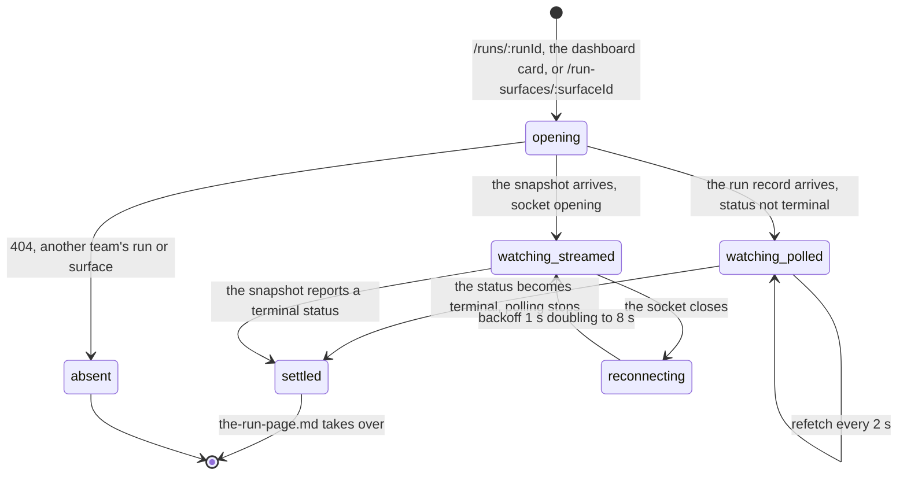

# Watching a run

## What this document owns

Three live views of a run that has not finished.

The first is `/runs/:runId` while the run's status is not terminal. The page polls, the phase rail moves, and the results are not there yet. The second is the dashboard's `Running now` card, the same run in miniature, which exists only while a run is moving. The third is the console at `/run-surfaces/:surfaceId`: a WebSocket view that follows a run's whole life from local to published, with its own Retry and action buttons.

[`start-a-practice-run.md`](start-a-practice-run.md) owns everything up to the run row existing. [`the-run-page.md`](the-run-page.md) owns `/runs/:runId` once the run is terminal. [`promote-to-the-leaderboard.md`](promote-to-the-leaderboard.md) owns what the console's "Promote to official" and "Publish result" do.

## Summary

A run takes minutes, and the platform shows it two ways built on two mechanisms.

The run page and the dashboard card poll. `GET /api/runs/:id` repeats every 2 seconds while the status is not `succeeded`, `failed` or `cancelled` (`apps/portal/src/lib/queries.ts:71-80`); the dashboard repeats every 2 seconds while its payload names an active run (`:43-50`). Both show the phase rail and a sentence saying they check back on their own.

The console streams. It fetches one snapshot over HTTP, then opens a WebSocket to `/api/run-surfaces/:id/stream`, backed by a Durable Object that rebuilds and broadcasts the snapshot every 2 seconds while the run is running (`apps/portal/worker/realtime/run-surface-hub.ts:8`). It shows an event list, a progress bar, a four-stage lifecycle strip and the buttons for the next move.

The views now link to each other. The run page carries "Open current run" to the console whenever the run has a surface (`apps/portal/src/routes/RunDetailPage.tsx:104`, `:116-123`). The console carries a "Runs" link back to `/dashboard` (`apps/portal/src/routes/RunSurfacePage.tsx:43-49`), "See why it failed" to the run page on a failed hosted run (`apps/portal/src/components/RunConsole.tsx:341-349`), and "View details" for each execution in its history (`:553-569`). The header's `Runs` tab stays lit on both routes (`apps/portal/src/components/Shell.tsx:20`, `:61`).

Nothing can be acted on while a run is live. The run page's promote and publish blocks need a terminal status, and the console offers no buttons until its run stops.

## The simple case

A student presses start on the dashboard. The bench shows a `Running now` card: a status chip, the run's title as a link ("Practice run on main"), `Run #XXXX · {shortSha} · started just now`, the phase rail without timings, and "This card checks back every two seconds, so there's no need to reload." (`apps/portal/src/routes/DashboardPage.tsx:356-386`). An official run's line adds `· logs kept back` (`:372`). Under it, "Open the run".

The run page shows `Reading run record` while it loads (`RunDetailPage.tsx:77`), then a `Runs` link, "Open current run" in the corner, the benchmark title with a status chip such as `Preparing`, the run's title, and the metadata line (`:108-182`). Directly under, the `Pipeline` section leads, because there is nothing else yet: "Still running. This page checks back on its own, and what the run shows will appear here once it has been scored." (`:256-262`), then the seven-node rail: Queued, Prepare, Install, Contract check, Evaluate, Score, Complete. The node the run is in carries the detection brackets and a pulse; finished phases show their time underneath. Under the rail, `Updates every 2 s.` for practice or `Hidden evaluation; logs are suppressed.` for official (`:274-280`).

Every 2 seconds the page asks again. A visually hidden live region reads `Run status: Evaluating` (`:183-185`). If the run fails, the change arrives on an ordinary poll and the failure card appears above the pipeline; see [`the-run-page.md`](the-run-page.md).

While the run is `Queued`, both views add one sentence: "Nothing has reported back yet, which is usually a short wait for a free machine. If nothing arrives within ten to fifteen minutes we stop waiting and mark this run failed, so it won't sit here all afternoon." (`apps/portal/src/lib/run-meta.ts:66-69`). The range matches the code: the stale-run sweep fails a run queued for ten minutes and runs every five (`apps/portal/worker/execution/maintenance.ts:32`, `apps/portal/wrangler.jsonc:92`).

There is no metric, no elapsed counter and no estimate on the run page while it is live.

The console is reached from "Open current run", from Discord, or from the Activity. It reads `Opening live bench` (`RunSurfacePage.tsx:37`), then shows a header with a status word, `On the bench · evaluating` while running (`RunConsole.tsx:85-91`), and a connection word in the corner; the benchmark title; the team, `@login` of the starter, the short commit and an elapsed clock. Under that, the current step in words with `{current}/{total} cases` when the runner sent counts, over a thin progress bar (`:386-410`). Then the strip `Local · Hosted · Official · Published`, each marked `✓`, `●`, `○`, `×` or `–` (`:76-83`, `:416-434`). Then, on the left, `Live events`, and on the right, `Run reference` (`:436-550`).

## The ask, event by event

```mermaid
stateDiagram-v2
    [*] --> opening : /runs/:runId, the dashboard card, or /run-surfaces/:surfaceId
    opening --> absent : 404, another team's run or surface
    opening --> watching_polled : the run record arrives, status not terminal
    opening --> watching_streamed : the snapshot arrives, socket opening
    watching_polled --> watching_polled : refetch every 2 s
    watching_polled --> settled : the status becomes terminal, polling stops
    watching_streamed --> reconnecting : the socket closes
    reconnecting --> watching_streamed : backoff 1 s doubling to 8 s
    watching_streamed --> settled : the snapshot reports a terminal status
    settled --> [*] : the-run-page.md takes over
    absent --> [*]
```

### Asking

Watching commits nothing. Every view is a read: no view is recorded, nothing is sent, and the run ends the same with every browser closed.

The run page reads the run id, then two more things: the benchmark list, so the failure copy can be the module's, and the dashboard for the run's own benchmark once the record has arrived (`RunDetailPage.tsx:61-70`). That second query polls on its own timer while the team has an active run, so a run page open on a live run makes two requests every 2 seconds.

> Technical note: `GET /api/runs/:id` calls `syncRun` before answering (`apps/portal/worker/routes/runs.ts:100-101`), which is what advances a fixture-provider run. Reading a page can change a fixture run's status.

The console fetches the snapshot and opens the socket; it waits for both before rendering anything (`RunSurfacePage.tsx:37`).

Which console a student reaches is decided before they arrive. Discord's `/cog` reply links to the team's newest surface (`apps/discord-bot/src/commands.ts:170`); the channel message links to its own surface (`apps/portal/worker/services/discord-messages.ts:101`); the run page links to the surface its run belongs to.

### Answered without work

One refusal on every view: the portal has no record at this address.

A run belonging to another team is a `404` with "Run not found." (`apps/portal/worker/routes/runs.ts:100`); a surface belonging to another team is a `404` with "Run surface not found.", deliberately, so the answer does not confirm the surface exists (`apps/portal/worker/routes/run-surfaces.ts:19`). Both render as an absence: "The portal has no record at this address. Trying again will return the same answer." with no retry button (`apps/portal/src/lib/query-error-state.ts:101-114`). Both pages add "Back to your runs" (`RunDetailPage.tsx:82-84`, `RunSurfacePage.tsx:29-33`).

The stream endpoint answers a request with no upgrade header with `426` and "Expected a WebSocket upgrade." (`run-surfaces.ts:62`), which only a hand-written request reaches.

### The work begins

Nothing begins here. The execution already exists and finishes whether or not anyone watches.

The console's buttons can start work once the run stops: Retry and hosted verification reserve capacity while running and count only when completed; promotion reserves official capacity; publishing selects an existing result. See [`promote-to-the-leaderboard.md`](promote-to-the-leaderboard.md) and [`the-run-page.md`](the-run-page.md#the-work-begins).

### While it works

**The run page.** One request every 2 seconds, no backoff and no pause beyond what the query library does on its own. The rail redraws from the run's status. Per-phase times render only for phases with both a start and an end, so the phase in progress shows a label and no time (`apps/portal/src/components/PhaseRail.tsx:32-37`). The status chip uses its own words for the same states: `Queued`, `Preparing`, `Installing`, `Contract check`, `Evaluating`, `Scoring` (`run-meta.ts:41-51`), against the rail's `Prepare`, `Install`, `Evaluate`, `Score` (`:32-39`).

**The dashboard card.** The same rail without timings. A run that finishes while the page is open is announced, "{title} finished: {status}", and its sentence gets a single highlighter stroke (`DashboardPage.tsx:197-201`, `:390`).

**The console.** The socket delivers a whole snapshot per frame. On connect the Durable Object rebuilds the snapshot from the database and sends it, so a late browser is current within one frame (`run-surface-hub.ts:114-127`). A frame that fails the schema, or is older than the one on screen, is dropped (`apps/portal/src/lib/run-surface-stream.ts:47-55`).

When the socket closes, the page reconnects after 1, 2, 4 and then 8 seconds, forever (`run-surface-stream.ts:57-62`). The snapshot stays on screen; the corner word changes. It reads `Live` while open, `Snapshot` when there is no stream path, and `Reconnecting…` otherwise, including the first connection (`RunConsole.tsx:93-100`).

The progress row names the current step from a fixed table, `Fetching repository`, `Installing dependencies`, `Checking benchmark contract`, `Contract passed`, `Evaluation started`, `Evaluating`, `Scoring result`, `Run complete`, and one sentence per failure kind (`RunConsole.tsx:34-53`). With counts it fills a bar; without them the bar runs an indeterminate animation (`:404-407`). The hosted runner sends `0/{n}` at the start of evaluation and `{n}/{n}` at the end, and nothing in between, so the bar sits empty for the longest phase (B-22).

The event list collapses repeated heartbeats to their newest instance (`packages/contracts/src/schema.ts:656`). It scrolls itself only while the reader is within 24 pixels of the bottom; otherwise new arrivals raise a `{n} new events` button (`RunConsole.tsx:468-494`). With nothing yet it reads "Waiting for the first event from the runner." (`:476`). The list shows only the current run's events, so a promotion empties it and refills it with the official run's (`schema.ts:787`, `RunConsole.tsx:210-223`).

`Run reference` lists the repository, the full commit, the branch or `detached`, and the workspace as `Uncommitted changes` or `Clean` (`RunConsole.tsx:497-507`). No action buttons appear while the run is running; the server sends none (`apps/portal/worker/services/run-surfaces.ts:346-364`).

### How it ends

**The run page.** When a poll returns a terminal status the refetch interval becomes `false` and polling stops (`queries.ts:75-78`). The live sentence and footer go, and the finished page appears at once. See [`the-run-page.md`](the-run-page.md).

**The dashboard card.** It remounts as `Latest run` with the finished run in words (`DashboardPage.tsx:216-228`).

**The console.** The Durable Object stops rescheduling once the snapshot is no longer running (`run-surface-hub.ts:87-97`). The status word becomes `Bench clear` or `Run failed`; the corner word becomes `Complete` or `Stopped` (`RunConsole.tsx:85-100`). A success shows the primary metric beside the title (`:329-334`) and offers the stage's buttons. A failure shows the reason, either the refusal headline or the failure sentence, then "See why it failed", then Retry with "Runs the same commit again." when the server offers it, or the sentence explaining why it does not (`:336-384`). The event list folds to its last three, with "Show all {n}" for a success and "Show details" for a failure (`:202-205`).

Nothing is pushed beyond the screen changing: no sound, no title change, no notification.

## Modifiers

| Modifier | Set before the ask | Changed while it works |
| --- | --- | --- |
| Who you are | All routes require a team (`apps/portal/src/App.tsx:161-175`) and every query is scoped to the caller's team. There is no spectator view and no instructor route to another team's run. | A session that expires mid-watch turns the next poll into `SESSION ENDED`. The open socket is not re-authenticated; it keeps receiving until it closes for another reason. |
| Where your team and repository stand | The run is about the commit resolved at the start. The console's `Run reference` names the repository the run used, or "not recorded" (`RunConsole.tsx:501-503`). | A repository change does not disturb a run in flight. After it, the console withholds its buttons and says why (`RunConsole.tsx:513-517`). |
| Which week's benchmark | The run page uses the run's own benchmark for its copy and quota (`RunDetailPage.tsx:61-70`). The console shows the surface's benchmark title. | No effect. A run's benchmark never changes. |
| Practice or leaderboard | Practice shows `Updates every 2 s.`; official shows `Hidden evaluation; logs are suppressed.` and the dashboard card adds `· logs kept back`. The console's strip shows which stage the surface has reached. | A promotion creates a second run on the same surface; the console follows it, and the run page stays on the run in its URL. |
| Flags, options, and where you are typing | Nothing to configure. The same console renders inside the Discord Activity, compact, with an "Open Cog\*Portal" button the browser page does not show (`RunConsole.tsx:542-547`). | No effect. |

## Cancel and interrupt

| Event | Before the work begins | While it works |
| --- | --- | --- |
| You stop it yourself | Nothing to stop, and no cancel exists anywhere. | Closing the console's dialog with Escape, the backdrop or `Close` abandons the action (`RunConsole.tsx:571-589`). Nothing else on any view stops anything. |
| You do something else mid-way | Navigating away before render leaves nothing. | Navigating away unmounts the query and closes the socket, clearing any pending reconnect (`run-surface-stream.ts:66-71`). Coming back re-reads; nothing is lost except events past the 250-event retention. |
| A teammate acts at the same time | The run page is bound to one run id and does not notice a teammate's Retry or promotion. | The console follows the surface's newest execution, so a teammate's Retry or promotion moves the strip and the event list under the watching student. Nothing says who did it. |
| The network or the portal fails | A failed first read renders the query-error card; a `404` renders as an absence. | A failed poll keeps the last good page with nothing marking it stale. A failed socket shows `Reconnecting…` and retries every 8 seconds indefinitely. |
| The page or the process goes away | Nothing pending. | The run outlives the browser. A sandbox that stops reporting is failed by the stale-run sweep after ten minutes in `queued` or sixty minutes from creation in any later phase (`maintenance.ts:32`, `:52-61`, `wrangler.jsonc:82`). |
| The thing being measured changes | The run's commit cannot be retargeted. | A push or version bump has no effect on a run in flight. |
| The platform refuses or credit runs out | Watching costs nothing. | Quota matters only when a console button is pressed, and then the refusal is the server's sentence, shown under the header (`RunSurfacePage.tsx:65-67`). |

## Interactions with other systems

**Who may do this.** Any member of the owning team. A student on another team who follows a Discord link gets the absence card and cannot tell whether the surface exists.

**The team owns it.** The console names who started the surface as `@login`; that is the only person named on any live view, and it is an author, not a number.

**Credit.** Watching spends nothing. The console's confirm dialog names the cost before a request goes: "This uses one of the team's shared practice runs." for hosted verification, "Use official attempt {n} of 3 for {title} at {sha}?" for promotion (`RunConsole.tsx:271-277`).

**What the portal claims.** A phase, a step name and an elapsed time. No metric appears on the run page until the run is terminal; the console shows its primary metric only after success (`RunConsole.tsx:329`). The event stream carries a code from a fixed list, a phase, an elapsed time and optional counts, never stdout or data, which is why it can render an official run. See [`../foundations/what-the-portal-claims.md`](../foundations/what-the-portal-claims.md).

**What the benchmark supplied.** Nothing on any live view. The counts are the benchmark's own case counts.

**Live updates and reconnection.** Intervals, retention and backoff are in [`../cross-cutting/live-updates.md`](../cross-cutting/live-updates.md).

**Discord.** The Durable Object tick that broadcasts to browsers also edits the team's channel message (`run-surface-hub.ts:162`). See [`../discord/channel-messages.md`](../discord/channel-messages.md).

**Configuration.** `ACTIVE_RUN_POLL_MS` is 2000 (`packages/contracts/src/schema.ts:1521`), the hub's `TICK_MS` is 2000, and surfaces keep 250 events (`run-surfaces.ts:42`). Under `EXECUTION_PROVIDER=fixture` both pages show a `Simulated` chip (`RunDetailPage.tsx:131`, `RunConsole.tsx:311`).

## Edge cases

- **A first connection is announced as a reconnection.** The stream starts in `connecting`, and `connectionCopy` maps every state but `live` and `closed` to `Reconnecting…` (`run-surface-stream.ts:21`, `RunConsole.tsx:93-100`).
- **An event with no elapsed time shows an em dash** in the time column (`RunConsole.tsx:115`), a character `docs/design/voice.md` bans.
- **A rerun or Retry can move the console to a new URL.** A hosted rerun answers with a successor surface and the page navigates there (`RunSurfacePage.tsx:60-64`). Retry stays on the same surface.
- **The console's elapsed clock is the current execution's.** It restarts when a promotion or Retry begins (`run-surfaces.ts:301-305`).
- **The progress bar can go backwards.** It shows the newest event that carries counts (`run-surfaces.ts:310`).
- **Events past 250 per surface are deleted oldest first,** with nothing on screen saying so.
- **Two vocabularies for one state.** The run page says `Evaluating`, `Succeeded`, `Failed`; the console says `On the bench · evaluating`, `Bench clear`, `Run failed`.
- **A live official run is nearly blank.** It shows the title, the metadata, the pipeline sentence and the rail.
- **Under the fixture provider the event list is reconstructed** from phase timings, with queued and preparing collapsed into one line (`run-surfaces.ts:106-174`).

## Open questions and verification

- Observed locally on fixture data: the failed console with "See why it failed", Retry and "Runs the same commit again." (`/tmp/cogshots/matched/pairs/b-run-surface-desk.png`, near `2ff32fa`). The live run page and live dashboard card were not in the matched pairs. **Unverified** on this build.
- The progress counter stays at `0/{n}` through evaluation (B-22). Not observed hosted.
- `Reconnecting…` on a first connection is a one-line misstatement. Carried to triage.
- The run page polls twice every 2 seconds while live (its own record and the dashboard). Whether that matters for load was not assessed.
- Whether `Snapshot` is ever seen on the browser route was not determined: it needs a null stream path, which `RunSurfacePage` never passes (`RunSurfacePage.tsx:18-21`).
- No reconnection, stale-run sweep or Discord rate-limit reschedule was observed.
- Hosted beta (`4984730`) observed the live run page for `run_f5fc5babe5` in `hosted-run_f5fc5babe5/evaluating.jpg`: pre-redesign layout, `RUN ABE5` title and an `EVALUATING` chip. That is beta's layout, not the candidate's.
- Hosted beta (`4984730`) differs: its console page has no "Runs" link in the success state (beta `apps/portal/src/routes/RunSurfacePage.tsx:40`) and no "See why it failed" (beta `apps/portal/src/components/RunConsole.tsx:321-323` goes straight from the reason to the local "Run again"); the candidate has both (`RunSurfacePage.tsx:43-49`, `RunConsole.tsx:341-349`).

Read against Cog\*Portal commit `2ff32fa`.
